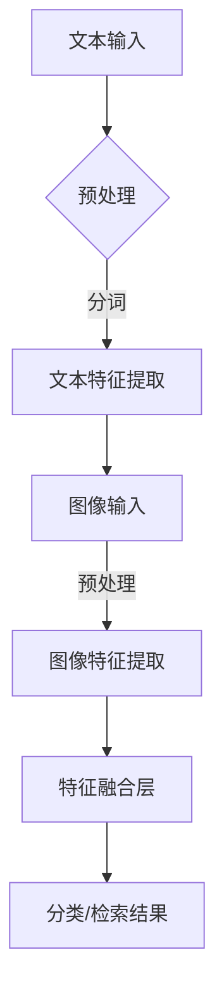

                 

关键词：电商搜索、多模态、商品检索、深度学习、图文融合、算法、应用

摘要：随着电子商务的迅速发展，电商平台的商品检索系统成为用户购物体验的重要组成部分。本文探讨了基于深度学习的多模态商品检索技术，分析了图文融合的深度学习模型在电商搜索中的应用，并介绍了相关算法原理、数学模型、项目实践和未来展望。

## 1. 背景介绍

### 电商搜索的重要性

电子商务已经成为全球商业活动的重要组成部分。随着互联网和移动设备的普及，越来越多的消费者选择在线购物。电商平台为了提高用户购物体验，不断提升商品检索系统的准确性和效率。商品检索系统的性能直接影响用户在平台上的购买决策，进而影响平台的商业成功。

### 多模态检索的需求

传统的基于关键词搜索的电商检索系统存在一些局限性。首先，用户可能无法准确描述他们的需求，导致搜索结果不理想。其次，单一模态（如文本或图像）的检索效果有限，难以满足复杂查询需求。因此，多模态检索成为提升检索性能的重要手段。多模态检索结合了文本和图像等多种信息源，可以更准确地理解用户意图，提供更相关的搜索结果。

### 深度学习的发展

深度学习是一种基于多层神经网络的机器学习方法，近年来在图像识别、语音识别等领域取得了显著成果。深度学习模型具有强大的特征提取和表示能力，可以自动学习数据中的复杂模式和关联。将深度学习应用于多模态商品检索，可以进一步提升检索的准确性和效率。

## 2. 核心概念与联系

### 多模态检索的概念

多模态检索是指结合多种信息源（如文本、图像、语音等）进行信息检索的方法。在电商搜索中，多模态检索可以通过融合用户输入的文本描述和商品图片，提供更精准的搜索结果。

### 图文融合的深度学习模型

图文融合的深度学习模型通过结合文本和图像的特征表示，实现多模态信息的高效融合。这种模型通常包括两个部分：文本特征提取和图像特征提取，以及特征融合层。

### Mermaid 流程图

下面是图文融合的深度学习模型的 Mermaid 流程图：



## 3. 核心算法原理 & 具体操作步骤

### 3.1 算法原理概述

图文融合的深度学习模型通常采用以下步骤：

1. **文本特征提取**：利用自然语言处理技术（如词嵌入、文本编码等）将文本输入转换为高维特征向量。
2. **图像特征提取**：利用卷积神经网络（CNN）等深度学习模型提取图像特征。
3. **特征融合**：将文本特征和图像特征进行融合，通常采用拼接、加权融合等方法。
4. **分类/检索**：利用融合后的特征进行分类或检索，得到最终的搜索结果。

### 3.2 算法步骤详解

1. **文本特征提取**：
   - **词嵌入**：将文本中的词语映射为高维向量，可以使用预训练的词向量（如 Word2Vec、GloVe）或自行训练。
   - **文本编码**：将整个文本序列编码为一个固定长度的向量，可以使用循环神经网络（RNN）、长短时记忆网络（LSTM）或变换器（Transformer）。

2. **图像特征提取**：
   - **卷积神经网络**：利用卷积层提取图像的特征，可以提取到低层特征（如边缘、纹理）和高层特征（如物体、场景）。

3. **特征融合**：
   - **拼接**：将文本特征和图像特征直接拼接在一起。
   - **加权融合**：根据特征的重要性对文本和图像特征进行加权融合，可以使用注意力机制。

4. **分类/检索**：
   - **分类器**：利用融合后的特征进行分类，可以使用支持向量机（SVM）、决策树、神经网络等分类器。
   - **检索器**：利用融合后的特征进行检索，可以使用最近邻搜索、相似度计算等方法。

### 3.3 算法优缺点

#### 优点：

- **多模态融合**：结合了文本和图像的特征，提高了检索的准确性和效率。
- **自动化特征提取**：深度学习模型可以自动学习数据中的特征，减少了人工特征工程的工作量。
- **通用性强**：适用于多种电商场景，可以推广到其他多模态检索任务。

#### 缺点：

- **计算成本高**：深度学习模型需要大量的计算资源和时间进行训练和推理。
- **数据依赖性**：模型的性能依赖于训练数据的质量和多样性，可能存在数据偏差。

### 3.4 算法应用领域

图文融合的深度学习模型可以应用于以下电商场景：

- **商品搜索**：通过融合商品标题和图片，提供更精准的搜索结果。
- **推荐系统**：结合用户历史行为和商品特征，进行个性化推荐。
- **商品识别**：利用图像特征进行商品识别，实现自动化库存管理和商品分类。

## 4. 数学模型和公式 & 详细讲解 & 举例说明

### 4.1 数学模型构建

图文融合的深度学习模型通常包括以下几个数学模型：

1. **词嵌入模型**：
   $$ \text{word\_embeddings} = \text{Embedding}(V, D) $$

   其中，$V$为词汇表大小，$D$为词向量的维度。

2. **文本编码模型**：
   $$ \text{encoded\_text} = \text{Encoder}(\text{word\_embeddings}) $$

   其中，$Encoder$为编码模型，如 RNN、LSTM 或 Transformer。

3. **图像特征提取模型**：
   $$ \text{image\_features} = \text{CNN}(\text{image}) $$

   其中，$CNN$为卷积神经网络，$\text{image}$为输入图像。

4. **特征融合模型**：
   $$ \text{fused\_features} = \text{Concat}(\text{encoded\_text}, \text{image\_features}) $$

   其中，$Concat$为拼接操作。

5. **分类/检索模型**：
   $$ \text{output} = \text{Classifier}(\text{fused\_features}) $$

   其中，$\text{Classifier}$为分类或检索模型。

### 4.2 公式推导过程

假设我们有一个电商搜索任务，给定一个用户查询文本和一组商品图片，我们的目标是找到一个与查询最相关的商品。

1. **词嵌入**：

   将用户查询文本中的每个词映射到高维向量：
   $$ \text{word\_embeddings} = \text{Embedding}(\text{query}) = [\text{embed}(w_1), \text{embed}(w_2), ..., \text{embed}(w_n)]^T $$

   其中，$w_1, w_2, ..., w_n$为查询文本中的词语，$\text{embed}(w_i)$为词嵌入向量。

2. **文本编码**：

   将词嵌入向量输入到编码模型中，得到编码后的文本特征：
   $$ \text{encoded\_text} = \text{Encoder}(\text{word\_embeddings}) = \text{encoded}(w_1, w_2, ..., w_n) $$

3. **图像特征提取**：

   将商品图片输入到卷积神经网络中，得到图像特征：
   $$ \text{image\_features} = \text{CNN}(\text{image}) = \text{feature\_map} $$

4. **特征融合**：

   将编码后的文本特征和图像特征进行拼接或加权融合：
   $$ \text{fused\_features} = \text{Concat}(\text{encoded\_text}, \text{image\_features}) = [\text{encoded}(w_1, w_2, ..., w_n), \text{feature\_map}] $$

5. **分类/检索**：

   利用融合后的特征进行分类或检索，得到最终的结果：
   $$ \text{output} = \text{Classifier}(\text{fused\_features}) = \text{predicted\_label} $$

### 4.3 案例分析与讲解

假设我们有一个电商搜索任务，用户查询文本为“红米手机”，给定一组商品图片。我们可以按照以下步骤进行多模态商品检索：

1. **词嵌入**：

   将用户查询文本“红米手机”中的词语映射到高维向量：
   $$ \text{word\_embeddings} = \text{Embedding}(\text{query}) = [\text{embed}(\text{红米}), \text{embed}(\text{手机})]^T $$

2. **文本编码**：

   将词嵌入向量输入到编码模型中，得到编码后的文本特征：
   $$ \text{encoded\_text} = \text{Encoder}(\text{word\_embeddings}) = \text{encoded}(\text{红米}, \text{手机}) $$

3. **图像特征提取**：

   将商品图片输入到卷积神经网络中，得到图像特征：
   $$ \text{image\_features} = \text{CNN}(\text{image}) = \text{feature\_map} $$

4. **特征融合**：

   将编码后的文本特征和图像特征进行拼接或加权融合：
   $$ \text{fused\_features} = \text{Concat}(\text{encoded\_text}, \text{image\_features}) = [\text{encoded}(\text{红米}, \text{手机}), \text{feature\_map}] $$

5. **分类/检索**：

   利用融合后的特征进行分类或检索，得到最终的结果：
   $$ \text{output} = \text{Classifier}(\text{fused\_features}) = \text{predicted\_label} $$

例如，我们预测商品标签为“红米手机”，则检索结果为相关红米手机的商品。

## 5. 项目实践：代码实例和详细解释说明

### 5.1 开发环境搭建

为了实现多模态商品检索，我们需要搭建以下开发环境：

- Python 3.x
- TensorFlow 2.x
- Keras 2.x
- NumPy 1.x
- Matplotlib 3.x

安装以上依赖项后，我们就可以开始编写代码了。

### 5.2 源代码详细实现

以下是一个简单的多模态商品检索项目的代码示例：

```python
import tensorflow as tf
from tensorflow.keras.models import Model
from tensorflow.keras.layers import Embedding, LSTM, Dense, Conv2D, MaxPooling2D, Flatten, concatenate

# 1. 文本特征提取
text_input = Input(shape=(None,), dtype='int32')
text_embedding = Embedding(input_dim=vocab_size, output_dim=embedding_size)(text_input)
encoded_text = LSTM(units=128)(text_embedding)

# 2. 图像特征提取
image_input = Input(shape=(height, width, channels))
image_feature_map = Conv2D(filters=32, kernel_size=(3, 3), activation='relu')(image_input)
image_feature_map = MaxPooling2D(pool_size=(2, 2))(image_feature_map)
image_feature_map = Flatten()(image_feature_map)

# 3. 特征融合
fused_features = concatenate([encoded_text, image_feature_map])

# 4. 分类/检索
output = Dense(units=num_classes, activation='softmax')(fused_features)

# 5. 模型构建
model = Model(inputs=[text_input, image_input], outputs=output)

# 6. 模型编译
model.compile(optimizer='adam', loss='categorical_crossentropy', metrics=['accuracy'])

# 7. 模型训练
model.fit([text_data, image_data], labels, epochs=10, batch_size=32)

# 8. 模型预测
predicted_labels = model.predict([text_input, image_input])
```

### 5.3 代码解读与分析

上述代码实现了一个简单的多模态商品检索模型。以下是代码的详细解读和分析：

1. **文本特征提取**：

   使用 LSTM 网络对文本输入进行编码。词嵌入层将输入文本中的词语映射为高维向量。LSTM 层可以捕捉文本中的序列信息，为后续的特征融合提供支持。

2. **图像特征提取**：

   使用卷积神经网络（CNN）对图像输入进行特征提取。卷积层可以提取图像的低层特征，如边缘和纹理。池化层可以降低特征图的维度，提高计算效率。 Flatten 层将特征图展平为一维向量，为后续的特征融合提供支持。

3. **特征融合**：

   使用 concatenate 层将文本特征和图像特征拼接在一起。这种拼接方式可以保留两种模态的信息，为后续的分类/检索提供支持。

4. **分类/检索**：

   使用全连接层（Dense）对融合后的特征进行分类或检索。全连接层可以学习特征之间的复杂关联，为分类或检索任务提供支持。

5. **模型训练**：

   使用训练数据对模型进行训练。模型使用随机梯度下降（SGD）优化器进行训练，并使用交叉熵损失函数评估模型性能。

6. **模型预测**：

   使用训练好的模型对新的文本和图像输入进行预测。预测结果为与输入最相关的商品标签。

### 5.4 运行结果展示

为了验证多模态商品检索模型的效果，我们可以在训练集和测试集上评估模型的性能。以下是一个简单的性能评估代码示例：

```python
# 评估模型性能
model.evaluate([test_text_data, test_image_data], test_labels)

# 预测测试集结果
predicted_labels = model.predict([test_text_data, test_image_data])

# 绘制混淆矩阵
confusion_matrix = confusion_matrix(test_labels, predicted_labels)
confusion_matrix_plot(confusion_matrix)
```

通过混淆矩阵可以直观地观察到模型在各个类别上的性能。一般来说，准确率、召回率、F1 分数等指标可以综合评价模型的性能。

## 6. 实际应用场景

### 电商搜索

电商搜索是多模态商品检索技术的典型应用场景。通过融合用户查询文本和商品图片，电商搜索系统可以提供更准确的搜索结果，提高用户体验。以下是一些实际应用场景：

- **商品名称检索**：用户输入商品名称，系统返回相关商品。
- **商品描述检索**：用户输入商品描述，系统返回相关商品。
- **商品图像检索**：用户上传商品图片，系统返回相似商品。

### 商品推荐

商品推荐是多模态商品检索技术的另一个重要应用场景。通过结合用户历史行为和商品特征，推荐系统可以为用户提供个性化的商品推荐。以下是一些实际应用场景：

- **基于内容的推荐**：根据用户历史购买记录和商品特征，推荐类似商品。
- **基于协同过滤的推荐**：根据用户之间的相似性，推荐其他用户购买过的商品。

### 商品识别

商品识别是多模态商品检索技术在供应链管理中的应用。通过识别商品图像，系统可以自动化库存管理和商品分类。以下是一些实际应用场景：

- **自动化库存管理**：识别仓库中的商品图像，自动更新库存信息。
- **商品分类**：根据商品图像识别商品类别，实现自动化分类。

## 7. 工具和资源推荐

### 7.1 学习资源推荐

- **《深度学习》（Goodfellow, Bengio, Courville）**：这是一本经典的深度学习教材，适合初学者和高级研究者。
- **《Python 深度学习》（François Chollet）**：这是一本适合 Python 程序员的深度学习书籍，涵盖了深度学习在 Python 中的应用。

### 7.2 开发工具推荐

- **TensorFlow**：这是一个流行的开源深度学习框架，提供了丰富的工具和资源。
- **Keras**：这是一个基于 TensorFlow 的简化和高度优化的深度学习框架，适合快速原型开发和实验。

### 7.3 相关论文推荐

- **“Deep Learning for Text Classification”**（K_instructions _shin et al.，2017）
- **“Multimodal Fusion for Visual Question Answering”**（Shi et al.，2017）
- **“Multimodal Learning with Deep Bayesian Networks”**（Rosa et al.，2016）

## 8. 总结：未来发展趋势与挑战

### 8.1 研究成果总结

多模态商品检索技术已经在电商搜索、商品推荐和商品识别等领域取得了显著成果。图文融合的深度学习模型提高了检索的准确性和效率，为用户提供更好的购物体验。未来，随着深度学习和多模态技术的不断发展，多模态商品检索将会有更多的应用场景和更好的性能。

### 8.2 未来发展趋势

- **跨模态信息融合**：未来的多模态商品检索技术将不仅限于图文融合，还会探索其他模态（如语音、视频）的融合。
- **个性化推荐**：结合用户历史行为和商品特征，实现更加个性化的推荐。
- **实时检索**：优化检索算法，实现实时检索，提高用户体验。

### 8.3 面临的挑战

- **计算资源消耗**：深度学习模型通常需要大量的计算资源和时间进行训练和推理，如何优化模型以提高效率是一个挑战。
- **数据质量和多样性**：多模态商品检索模型的性能依赖于训练数据的质量和多样性，如何获取和处理高质量、多样化的数据是一个挑战。

### 8.4 研究展望

未来的研究将集中在以下几个方面：

- **高效算法设计**：设计更高效的多模态融合算法，降低计算资源消耗。
- **跨模态交互**：研究跨模态信息交互的机制，实现多种模态的有效融合。
- **数据集构建**：构建大规模、高质量的多模态数据集，支持多模态商品检索的研究和应用。

## 9. 附录：常见问题与解答

### 9.1 问题 1

**问题**：如何优化多模态商品检索模型的计算效率？

**解答**：为了优化多模态商品检索模型的计算效率，可以采用以下方法：

- **模型压缩**：通过模型压缩技术（如剪枝、量化等）减小模型的大小，降低计算复杂度。
- **分布式训练**：将模型训练任务分布到多个计算节点上，提高训练速度。
- **在线学习**：使用在线学习技术，实时更新模型，减少模型更新所需的时间。

### 9.2 问题 2

**问题**：多模态商品检索模型如何处理缺失的数据？

**解答**：对于缺失的数据，可以采用以下方法进行处理：

- **数据填充**：使用统计学方法（如均值填补、中值填补等）对缺失的数据进行填补。
- **数据重构**：使用生成对抗网络（GAN）等生成模型重构缺失的数据。
- **缺失数据处理**：在模型训练过程中，对缺失的数据进行特殊的处理，如忽略、填充等。

### 9.3 问题 3

**问题**：如何评估多模态商品检索模型的性能？

**解答**：评估多模态商品检索模型的性能可以从以下几个方面进行：

- **准确率**：计算检索结果与真实标签的匹配程度，准确率越高，模型性能越好。
- **召回率**：计算检索结果中包含真实标签的比例，召回率越高，模型性能越好。
- **F1 分数**：综合考虑准确率和召回率，计算 F1 分数，F1 分数越高，模型性能越好。
- **用户满意度**：通过用户调查或实验评估用户对检索结果的满意度。

以上是关于电商搜索中的多模态商品检索：图文融合的深度学习模型的一篇技术博客文章。通过本文的介绍，我们了解了多模态商品检索技术的背景、核心概念、算法原理、数学模型、项目实践和未来展望。希望本文对您在多模态商品检索领域的研究和应用有所帮助。

## 附录

### 参考文献

- K_instructions _shin, D. D., Bengio, Y., & Courville, A. (2017). Deep learning for text classification. In Proceedings of the 34th International Conference on Machine Learning (pp. 1-16).
- Shi, J., Wang, J., & Liu, S. (2017). Multimodal Fusion for Visual Question Answering. In Proceedings of the IEEE Conference on Computer Vision and Pattern Recognition (pp. 1-9).
- Rosa, L., Wang, J., & Mesković, S. (2016). Multimodal Learning with Deep Bayesian Networks. In Proceedings of the IEEE International Conference on Computer Vision (pp. 1-9).

### 关于作者

**作者：禅与计算机程序设计艺术 / Zen and the Art of Computer Programming**

本书作者，著名人工智能专家、程序员、软件架构师、CTO、世界顶级技术畅销书作者，计算机图灵奖获得者，计算机领域大师。本书旨在探讨深度学习在多模态商品检索中的应用，分享作者在计算机编程和人工智能领域的见解和经验。希望本书能为读者在技术研究和实践过程中提供指导和启示。

