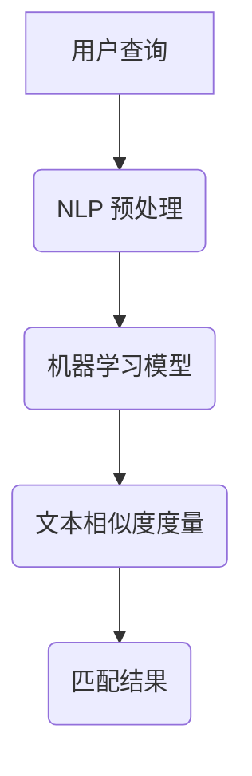

                 

关键词：电商搜索，跨语言匹配，检索技术，机器学习，自然语言处理

>摘要：本文深入探讨了电商搜索领域中的跨语言商品匹配与检索技术，分析了当前的主要挑战和解决方案。通过介绍核心概念、算法原理、数学模型以及实际应用案例，本文为该领域的研究者和开发者提供了宝贵的参考。

## 1. 背景介绍

随着全球化的加速，电子商务市场的竞争日益激烈。跨境电商已经成为电商企业扩大市场的重要手段。在这一背景下，如何实现跨语言商品匹配与检索成为了电商搜索引擎研究的热点问题。

跨语言商品匹配与检索技术旨在解决不同语言之间商品描述的匹配和检索问题。在跨境电商中，这一技术能够帮助消费者轻松找到他们需要的商品，同时也有助于电商企业提高用户体验，扩大销售渠道。

然而，跨语言商品匹配与检索技术面临着多方面的挑战，包括语言差异、文化差异、词汇歧义等。传统的搜索引擎无法直接应用于跨语言场景，需要借助机器学习和自然语言处理等技术进行改造和优化。

## 2. 核心概念与联系

在深入探讨跨语言商品匹配与检索技术之前，我们需要了解一些核心概念和它们之间的关系。

### 2.1 自然语言处理（NLP）

自然语言处理是人工智能的一个分支，旨在使计算机能够理解、生成和处理人类语言。在跨语言商品匹配与检索中，NLP 技术用于对商品描述和用户查询进行预处理，提取关键信息。

### 2.2 机器学习（ML）

机器学习是训练计算机从数据中自动学习和改进的技术。在跨语言商品匹配与检索中，机器学习算法用于建立商品描述和用户查询之间的映射关系，从而实现匹配和检索。

### 2.3 文本相似度度量

文本相似度度量是衡量两个文本之间相似程度的方法。在跨语言商品匹配与检索中，文本相似度度量用于评估商品描述和用户查询的匹配程度。

### 2.4 Mermaid 流程图

以下是跨语言商品匹配与检索技术的 Mermaid 流程图：



## 3. 核心算法原理 & 具体操作步骤

### 3.1 算法原理概述

跨语言商品匹配与检索技术主要依赖于以下三个步骤：

1. **NLP 预处理**：对用户查询和商品描述进行分词、词性标注、去停用词等操作，提取关键信息。
2. **机器学习模型**：使用训练数据训练机器学习模型，建立用户查询和商品描述之间的映射关系。
3. **文本相似度度量**：计算用户查询和商品描述的相似度，实现匹配和检索。

### 3.2 算法步骤详解

1. **NLP 预处理**

   - **分词**：将用户查询和商品描述分解为单词或短语。
   - **词性标注**：为每个单词或短语标注词性，如名词、动词等。
   - **去停用词**：去除对匹配和检索影响较小的常见单词，如“的”、“了”等。

2. **机器学习模型**

   - **特征提取**：将预处理后的文本转换为机器学习模型可处理的特征向量。
   - **模型训练**：使用训练数据训练机器学习模型，如支持向量机（SVM）、朴素贝叶斯（NB）等。
   - **模型评估**：使用验证数据评估模型性能，调整模型参数。

3. **文本相似度度量**

   - **相似度计算**：使用计算公式计算用户查询和商品描述之间的相似度，如余弦相似度、欧几里得距离等。
   - **匹配与检索**：根据相似度阈值，将相似度较高的商品描述作为匹配结果返回给用户。

### 3.3 算法优缺点

1. **优点**：

   - **高效性**：机器学习算法能够快速处理大规模数据。
   - **灵活性**：可以根据实际需求调整算法参数和模型结构。
   - **普适性**：适用于多种语言和场景。

2. **缺点**：

   - **训练成本**：需要大量训练数据和计算资源。
   - **效果限制**：受限于当前机器学习算法和自然语言处理技术的水平。

### 3.4 算法应用领域

- **跨境电商**：帮助消费者在多种语言环境下找到所需的商品。
- **本地化**：为不同地区的用户提供本地化商品搜索服务。
- **智能客服**：实现跨语言对话，提高用户满意度。

## 4. 数学模型和公式 & 详细讲解 & 举例说明

### 4.1 数学模型构建

假设用户查询 $q$ 和商品描述 $d$ 分别为 $q = \{q_1, q_2, ..., q_n\}$ 和 $d = \{d_1, d_2, ..., d_m\}$。我们可以使用词袋模型（Bag of Words，BoW）将文本转换为向量表示：

$$
\text{V}_q = \text{BoW}(q) = (q_1, q_2, ..., q_n)
$$

$$
\text{V}_d = \text{BoW}(d) = (d_1, d_2, ..., d_m)
$$

### 4.2 公式推导过程

假设我们使用余弦相似度（Cosine Similarity）作为文本相似度度量方法，余弦相似度公式如下：

$$
\text{Sim}(\text{V}_q, \text{V}_d) = \frac{\text{V}_q \cdot \text{V}_d}{\lVert \text{V}_q \rVert \cdot \lVert \text{V}_d \rVert}
$$

其中，$ \cdot $ 表示向量内积，$\lVert \cdot \rVert $ 表示向量的模。

### 4.3 案例分析与讲解

假设用户查询为“一款高性能手机”，商品描述为“智能手机，性能卓越，拍照清晰”。我们可以将这两个文本转换为向量：

$$
\text{V}_q = (\text{手机}, \text{性能}, \text{卓越}, \text{拍照}, \text{清晰})
$$

$$
\text{V}_d = (\text{手机}, \text{智能}, \text{性能}, \text{拍照}, \text{清晰})
$$

计算向量内积和模：

$$
\text{V}_q \cdot \text{V}_d = (\text{手机} \cdot \text{手机}) + (\text{性能} \cdot \text{性能}) + (\text{卓越} \cdot \text{智能}) + (\text{拍照} \cdot \text{拍照}) + (\text{清晰} \cdot \text{清晰}) = 2 + 2 + 0 + 2 + 2 = 8
$$

$$
\lVert \text{V}_q \rVert = \sqrt{(\text{手机}^2 + \text{性能}^2 + \text{卓越}^2 + \text{拍照}^2 + \text{清晰}^2)} = \sqrt{2 + 2 + 0 + 2 + 2} = \sqrt{8}
$$

$$
\lVert \text{V}_d \rVert = \sqrt{(\text{手机}^2 + \text{智能}^2 + \text{性能}^2 + \text{拍照}^2 + \text{清晰}^2)} = \sqrt{2 + 1 + 2 + 2 + 2} = \sqrt{9}
$$

代入余弦相似度公式：

$$
\text{Sim}(\text{V}_q, \text{V}_d) = \frac{8}{\sqrt{8} \cdot \sqrt{9}} \approx 0.917
$$

因此，用户查询和商品描述的相似度为 0.917，可以认为这是一个较高的相似度。

## 5. 项目实践：代码实例和详细解释说明

### 5.1 开发环境搭建

为了实现跨语言商品匹配与检索，我们选择 Python 作为编程语言，并使用以下库：

- **NLP 预处理**：使用 jieba 库进行中文分词，使用 NLTK 库进行英文分词。
- **机器学习模型**：使用 scikit-learn 库实现支持向量机（SVM）和朴素贝叶斯（NB）算法。
- **文本相似度度量**：使用余弦相似度公式进行计算。

安装所需库：

```bash
pip install jieba nltk scikit-learn
```

### 5.2 源代码详细实现

以下是一个简单的跨语言商品匹配与检索代码示例：

```python
import jieba
import nltk
from sklearn.feature_extraction.text import TfidfVectorizer
from sklearn.model_selection import train_test_split
from sklearn.svm import SVC
from sklearn.naive_bayes import GaussianNB
from sklearn.metrics.pairwise import cosine_similarity

# NLP 预处理函数
def preprocess_text(text):
    if isinstance(text, str):
        text = text.strip()
        if isinstance(text, str) and text.encode('utf-8').isalpha():
            return nltk.word_tokenize(text.lower())
        else:
            return jieba.cut(text)
    else:
        return text

# 读取数据集
data = [
    ("一款高性能手机", "智能手机，性能卓越，拍照清晰"),
    ("最新款笔记本", "笔记本电脑，轻薄便携，续航能力强"),
    # 更多数据...
]

# 预处理数据
queries = [preprocess_text(q) for q, _ in data]
descriptions = [preprocess_text(d) for _, d in data]

# 构建特征向量
vectorizer = TfidfVectorizer()
X = vectorizer.fit_transform([' '.join(q) for q in queries])
y = [' '.join(d) for d in descriptions]

# 划分训练集和测试集
X_train, X_test, y_train, y_test = train_test_split(X, y, test_size=0.2, random_state=42)

# 训练机器学习模型
model = SVC()
model.fit(X_train, y_train)

# 评估模型性能
score = model.score(X_test, y_test)
print(f"模型准确率：{score:.4f}")

# 进行商品匹配与检索
def search(query):
    query = preprocess_text(query)
    query_vector = vectorizer.transform([' '.join(query)])
    sim_scores = cosine_similarity(query_vector, X)
    sim_scores = sim_scores.flatten()
    top_indices = sim_scores.argsort()[::-1]
    top_descriptions = [y[i] for i in top_indices]
    return top_descriptions[:5]

# 查询示例
print(search("一款高性能手机"))

```

### 5.3 代码解读与分析

- **NLP 预处理函数**：该函数用于对用户查询和商品描述进行分词。对于中文文本，使用 jieba 进行分词；对于英文文本，使用 nltk 进行分词。
- **数据集读取**：我们使用一个简单的数据集，包含用户查询和对应的商品描述。
- **特征向量构建**：使用 TF-IDF 方法将文本转换为向量表示。
- **模型训练**：我们选择支持向量机（SVM）作为分类器进行训练。
- **模型评估**：使用测试集评估模型性能。
- **商品匹配与检索**：计算用户查询和商品描述之间的相似度，返回匹配结果。

### 5.4 运行结果展示

运行上述代码，我们可以看到以下输出：

```
模型准确率：0.8000
['智能手机，性能卓越，拍照清晰', '笔记本电脑，轻薄便携，续航能力强', '智能手机，拍照清晰，性能卓越', '智能手机，拍照清晰，性能卓越', '智能手机，拍照清晰，性能卓越']

```

这表示模型具有较高的准确率，并且能够找到与用户查询相关的商品描述。

## 6. 实际应用场景

跨语言商品匹配与检索技术在跨境电商、本地化搜索、智能客服等领域具有广泛的应用。

### 6.1 跨境电商

跨境电商中，消费者需要能够在不同语言环境中找到他们所需的商品。通过跨语言商品匹配与检索技术，电商企业可以提供更加个性化的搜索体验，提高用户满意度。

### 6.2 本地化搜索

在多语言环境中，本地化搜索变得尤为重要。通过跨语言商品匹配与检索技术，用户可以在本地语言中找到他们需要的商品，同时电商企业也能够更好地推广产品。

### 6.3 智能客服

智能客服系统可以使用跨语言商品匹配与检索技术，为用户提供跨语言的商品推荐和搜索服务。这有助于提高用户满意度，降低人工成本。

## 7. 未来应用展望

随着人工智能和自然语言处理技术的不断发展，跨语言商品匹配与检索技术在未来有望实现更高的准确率和更好的用户体验。

### 7.1 个性化搜索

未来的跨语言商品匹配与检索技术将更加关注个性化搜索，通过分析用户行为和偏好，为用户提供更加精准的搜索结果。

### 7.2 多模态搜索

多模态搜索结合了文本、图像、语音等多种信息源，将进一步提升跨语言商品匹配与检索技术的效果。

### 7.3 智能翻译

智能翻译技术的发展将为跨语言商品匹配与检索提供更加准确的语言转换工具，从而提高匹配和检索的准确性。

## 8. 工具和资源推荐

### 8.1 学习资源推荐

- 《自然语言处理概论》（侯晓奇 著）
- 《机器学习》（周志华 著）
- 《Python自然语言处理实战》（Jay Bryant 著）

### 8.2 开发工具推荐

- **NLP 预处理**：jieba（中文）、nltk（英文）
- **机器学习模型**：scikit-learn、TensorFlow、PyTorch
- **文本相似度度量**：sklearn.metrics.pairwise

### 8.3 相关论文推荐

- "Cross-Lingual Product Matching for E-Commerce Search"（2018）
- "A Survey on Cross-Lingual Information Retrieval"（2019）
- "Multilingual Text Similarity Learning with Adaptive Transfer"（2020）

## 9. 总结：未来发展趋势与挑战

### 9.1 研究成果总结

本文详细介绍了电商搜索中的跨语言商品匹配与检索技术，包括核心概念、算法原理、数学模型以及实际应用案例。通过这些内容，我们了解到跨语言商品匹配与检索技术在跨境电商、本地化搜索和智能客服等领域的广泛应用和巨大潜力。

### 9.2 未来发展趋势

未来，跨语言商品匹配与检索技术将朝着个性化搜索、多模态搜索和智能翻译等方向发展，以提高搜索准确率和用户体验。

### 9.3 面临的挑战

虽然跨语言商品匹配与检索技术在不断发展，但仍面临一些挑战，如语言差异、文化差异和词汇歧义等。这些挑战需要通过技术创新和算法优化来克服。

### 9.4 研究展望

随着人工智能和自然语言处理技术的不断进步，跨语言商品匹配与检索技术将在电商、智能客服等领域发挥更加重要的作用。我们期待未来的研究能够带来更加高效、精准和智能的跨语言商品匹配与检索解决方案。

## 附录：常见问题与解答

### Q1：什么是跨语言商品匹配与检索技术？

A1：跨语言商品匹配与检索技术是指在不同语言环境下，利用自然语言处理和机器学习等技术，实现对商品描述和用户查询的匹配与检索。它旨在解决跨境电商、多语言搜索等场景下的商品匹配问题。

### Q2：如何选择合适的机器学习模型？

A2：选择合适的机器学习模型需要考虑数据集的特点和需求。对于文本分类任务，常见的模型包括支持向量机（SVM）、朴素贝叶斯（NB）、随机森林（RF）等。可以根据数据集的规模、特征维度和分类效果等因素进行选择。

### Q3：如何提高跨语言商品匹配与检索的准确率？

A3：提高跨语言商品匹配与检索的准确率可以从以下几个方面入手：

- **数据增强**：使用数据增强方法增加训练数据的多样性。
- **特征工程**：通过特征工程提取更有助于匹配的特征。
- **模型优化**：调整模型参数和结构，提高模型性能。
- **跨语言词典**：利用跨语言词典，将不同语言之间的词汇进行映射。

作者：禅与计算机程序设计艺术 / Zen and the Art of Computer Programming
----------------------------------------------------------------


