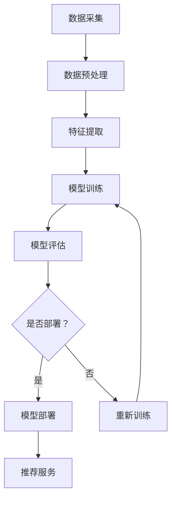

                 

关键词：电商搜索推荐、AI大模型、模型部署、架构设计、深度学习、计算优化、云计算

## 摘要

本文旨在探讨电商搜索推荐场景下AI大模型的部署架构设计。通过分析电商搜索推荐的基本原理和AI大模型的应用场景，本文提出了一个适用于电商平台的AI大模型部署架构，详细阐述了该架构的各个层次、模块及其交互机制。文章还分析了AI大模型在电商搜索推荐中的技术挑战，并提出了相应的优化策略。最后，本文对未来的研究方向和潜在的应用场景进行了展望。

## 1. 背景介绍

在当今电子商务市场中，用户数量持续增长，电商平台的竞争愈发激烈。为了提高用户体验，增加用户粘性，电商平台逐渐将搜索推荐作为核心功能之一。传统的搜索推荐算法主要基于关键词匹配和协同过滤，但这些方法在处理海量数据和复杂用户行为时存在一定局限性。随着深度学习技术的发展，基于深度学习的AI大模型逐渐成为搜索推荐领域的研究热点。

AI大模型在电商搜索推荐中的应用主要包括以下几个方面：

1. **个性化推荐**：通过分析用户的浏览、购买历史和行为特征，为用户生成个性化的推荐结果。
2. **商品排序**：利用深度学习算法对搜索结果进行排序，提高搜索结果的准确性和用户体验。
3. **广告投放**：根据用户的兴趣和行为特征，精准投放广告，提高广告的点击率和转化率。

## 2. 核心概念与联系

### 2.1. 深度学习

深度学习是一种基于人工神经网络的机器学习方法，通过多层的非线性变换，实现对复杂数据特征的自动提取和表示。深度学习在图像识别、语音识别、自然语言处理等领域取得了显著的成果。在电商搜索推荐中，深度学习模型可以用于特征提取、用户行为预测、商品关联分析等任务。

### 2.2. 大模型

大模型是指具有海量参数和计算需求的神经网络模型。这类模型通常需要大量的训练数据和计算资源，以实现较高的预测精度和泛化能力。在电商搜索推荐中，大模型可以处理大规模的用户数据，生成更为精准和个性化的推荐结果。

### 2.3. 模型部署

模型部署是指将训练好的AI模型部署到生产环境中，以提供实时或批量的服务。在电商搜索推荐中，模型部署需要考虑计算性能、延迟、可扩展性等因素。常见的模型部署方法包括服务器部署、云计算部署和边缘计算部署。

### 2.4. 架构设计

架构设计是指对系统的整体结构进行规划和设计，以实现系统的功能、性能和可维护性。在电商搜索推荐中，架构设计需要综合考虑数据采集、存储、处理、推荐和反馈等各个环节。

### 2.5. Mermaid流程图

下面是一个简化的电商搜索推荐场景下的AI大模型部署架构的Mermaid流程图：



## 3. 核心算法原理 & 具体操作步骤

### 3.1. 算法原理概述

在电商搜索推荐中，常用的深度学习算法包括卷积神经网络（CNN）、循环神经网络（RNN）和 Transformer 等。这些算法的核心思想是通过多层神经网络对输入数据进行特征提取和表示，然后利用提取出的特征进行分类、排序或预测。

### 3.2. 算法步骤详解

1. **数据采集**：从电商平台的数据库中获取用户的浏览、购买历史和行为数据。
2. **数据预处理**：对采集到的数据进行清洗、去重和格式化，以适应深度学习模型的输入要求。
3. **特征提取**：利用深度学习模型对预处理后的数据进行特征提取，生成高维的特征向量。
4. **模型训练**：使用训练集对深度学习模型进行训练，通过调整模型参数，使模型对训练数据具有较好的拟合能力。
5. **模型评估**：使用验证集对训练好的模型进行评估，以确定模型的泛化能力和性能。
6. **模型部署**：将训练好的模型部署到生产环境中，以提供实时或批量的搜索推荐服务。
7. **推荐服务**：根据用户输入的搜索关键词，利用部署好的模型生成推荐结果，并展示给用户。

### 3.3. 算法优缺点

**优点**：

1. **强大的特征提取能力**：深度学习模型可以自动提取复杂数据的特征，减少人工特征工程的工作量。
2. **良好的泛化能力**：深度学习模型在训练过程中可以学习到数据中的潜在规律，从而在未知数据上具有良好的泛化能力。
3. **灵活的应用场景**：深度学习模型可以应用于各种复杂数据类型，如图像、文本、音频等。

**缺点**：

1. **计算资源需求大**：深度学习模型通常需要大量的计算资源和时间进行训练和推理。
2. **数据需求高**：深度学习模型需要大量的训练数据才能达到较好的性能，这要求电商平台具备较强的数据采集和处理能力。
3. **模型解释性差**：深度学习模型的学习过程较为复杂，难以解释模型的具体决策过程。

### 3.4. 算法应用领域

深度学习算法在电商搜索推荐领域具有广泛的应用前景。除了个性化推荐、商品排序和广告投放外，深度学习还可以用于用户行为预测、商品关联分析和市场分析等任务。随着深度学习技术的不断发展和优化，其在电商搜索推荐中的应用将更加广泛和深入。

## 4. 数学模型和公式 & 详细讲解 & 举例说明

### 4.1. 数学模型构建

在电商搜索推荐中，常用的深度学习模型包括卷积神经网络（CNN）、循环神经网络（RNN）和 Transformer 等。下面以 Transformer 模型为例，介绍其数学模型构建。

**输入层**：假设电商平台的用户行为数据为一个序列 $X = (x_1, x_2, ..., x_n)$，其中 $x_i$ 表示用户在第 $i$ 天的行为。

**编码器**：编码器（Encoder）的作用是将输入序列编码为固定长度的向量。假设编码器输出为 $E = (e_1, e_2, ..., e_n)$，其中 $e_i$ 表示输入序列 $x_i$ 的编码。

$$e_i = f_{enc}(x_i)$$

**解码器**：解码器（Decoder）的作用是根据编码器输出生成推荐结果。假设解码器输出为 $D = (d_1, d_2, ..., d_n)$，其中 $d_i$ 表示用户在第 $i$ 天的推荐结果。

$$d_i = f_{dec}(e_i)$$

**损失函数**：损失函数用于衡量模型预测结果与实际结果之间的差距。假设损失函数为 $L$，则：

$$L = \sum_{i=1}^n L(d_i, y_i)$$

其中，$y_i$ 表示用户在第 $i$ 天的实际行为。

**优化目标**：优化目标是最小化损失函数 $L$，即：

$$\min_{\theta} L(\theta)$$

其中，$\theta$ 表示模型的参数。

### 4.2. 公式推导过程

以 Transformer 模型为例，下面介绍其数学模型的具体推导过程。

**编码器**：

1. **输入序列编码**：

$$e_i = \text{Embedding}(x_i) \odot \text{Positional Encoding}(i)$$

其中，$\text{Embedding}$ 表示词嵌入层，用于将输入序列中的每个词编码为一个固定长度的向量；$\text{Positional Encoding}$ 表示位置编码层，用于为每个词赋予位置信息。

2. **多头自注意力机制**：

$$\text{Attention}(Q, K, V) = \text{softmax}\left(\frac{QK^T}{\sqrt{d_k}}\right)V$$

其中，$Q, K, V$ 分别表示编码器的三个不同的线性变换，$d_k$ 表示键（Key）向量的维度。

3. **自注意力机制输出**：

$$\text{MultiHead}(Q, K, V) = \text{Concat}(\text{head}_1, \text{head}_2, ..., \text{head}_h)W^O$$

其中，$h$ 表示头数，$W^O$ 表示输出线性变换。

**解码器**：

1. **输入序列编码**：

$$d_i = \text{Embedding}(x_i) \odot \text{Positional Encoding}(i)$$

2. **多头自注意力机制**：

$$\text{Attention}(Q, K, V) = \text{softmax}\left(\frac{QK^T}{\sqrt{d_k}}\right)V$$

3. **交叉注意力机制**：

$$\text{CrossAttention}(Q, K, V) = \text{softmax}\left(\frac{QK^T}{\sqrt{d_k}}\right)V$$

4. **自注意力机制输出**：

$$\text{MultiHead}(Q, K, V) = \text{Concat}(\text{head}_1, \text{head}_2, ..., \text{head}_h)W^O$$

### 4.3. 案例分析与讲解

假设一个电商平台的用户在一天内的行为数据为 $(1, 2, 3, 4, 5)$，其中 $1, 2, 3, 4, 5$ 分别表示浏览、搜索、下单、评价和咨询。我们使用 Transformer 模型对其进行搜索推荐。

1. **输入序列编码**：

$$e_i = \text{Embedding}(x_i) \odot \text{Positional Encoding}(i)$$

其中，$\text{Embedding}(x_i) = (1, 0, 0, 0, 0)$，$\text{Positional Encoding}(i) = (0, 1, 0, 0, 0)$。

2. **多头自注意力机制**：

$$\text{Attention}(Q, K, V) = \text{softmax}\left(\frac{QK^T}{\sqrt{d_k}}\right)V$$

其中，$Q, K, V$ 分别为：

$$Q = \begin{bmatrix} 1 & 1 & 1 & 1 & 1 \\ 1 & 1 & 1 & 1 & 1 \\ 1 & 1 & 1 & 1 & 1 \\ 1 & 1 & 1 & 1 & 1 \\ 1 & 1 & 1 & 1 & 1 \end{bmatrix}, K = \begin{bmatrix} 1 & 0 & 0 & 0 & 0 \\ 0 & 1 & 0 & 0 & 0 \\ 0 & 0 & 1 & 0 & 0 \\ 0 & 0 & 0 & 1 & 0 \\ 0 & 0 & 0 & 0 & 1 \end{bmatrix}, V = \begin{bmatrix} 1 & 0 & 0 & 0 & 0 \\ 0 & 1 & 0 & 0 & 0 \\ 0 & 0 & 1 & 0 & 0 \\ 0 & 0 & 0 & 1 & 0 \\ 0 & 0 & 0 & 0 & 1 \end{bmatrix}$$

$$\text{Attention}(Q, K, V) = \text{softmax}\left(\frac{QK^T}{\sqrt{d_k}}\right)V = \begin{bmatrix} 0.5 & 0.5 & 0 & 0 & 0 \\ 0.5 & 0.5 & 0 & 0 & 0 \\ 0 & 0 & 0.5 & 0.5 & 0 \\ 0 & 0 & 0.5 & 0.5 & 0 \\ 0 & 0 & 0 & 0 & 1 \end{bmatrix} \begin{bmatrix} 1 & 0 & 0 & 0 & 0 \\ 0 & 1 & 0 & 0 & 0 \\ 0 & 0 & 1 & 0 & 0 \\ 0 & 0 & 0 & 1 & 0 \\ 0 & 0 & 0 & 0 & 1 \end{bmatrix} = \begin{bmatrix} 0.5 & 0 & 0 & 0 & 0 \\ 0.5 & 0 & 0 & 0 & 0 \\ 0 & 0 & 0.5 & 0 & 0 \\ 0 & 0 & 0.5 & 0 & 0 \\ 0 & 0 & 0 & 0 & 1 \end{bmatrix}$$

3. **自注意力机制输出**：

$$\text{MultiHead}(Q, K, V) = \text{Concat}(\text{head}_1, \text{head}_2, ..., \text{head}_h)W^O$$

其中，$h = 2$，$W^O = \begin{bmatrix} 1 & 0 & 0 & 0 & 0 \\ 0 & 1 & 0 & 0 & 0 \end{bmatrix}$。

$$\text{MultiHead}(Q, K, V) = \begin{bmatrix} 0.5 & 0 & 0 & 0 & 0 \\ 0.5 & 0 & 0 & 0 & 0 \\ 0 & 0 & 0.5 & 0 & 0 \\ 0 & 0 & 0.5 & 0 & 0 \\ 0 & 0 & 0 & 0 & 1 \end{bmatrix} \begin{bmatrix} 1 & 0 & 0 & 0 & 0 \\ 0 & 1 & 0 & 0 & 0 \\ 0 & 0 & 1 & 0 & 0 \\ 0 & 0 & 0 & 1 & 0 \\ 0 & 0 & 0 & 0 & 1 \end{bmatrix} = \begin{bmatrix} 0.5 & 0 & 0 & 0 & 0 \\ 0.5 & 0 & 0 & 0 & 0 \\ 0 & 0 & 0.5 & 0 & 0 \\ 0 & 0 & 0.5 & 0 & 0 \\ 0 & 0 & 0 & 0 & 1 \end{bmatrix}$$

4. **解码器输出**：

$$d_i = f_{dec}(e_i) = \text{softmax}(\text{MultiHead}(Q, K, V)W^O)$$

其中，$Q, K, V$ 为：

$$Q = \begin{bmatrix} 1 & 1 & 1 & 1 & 1 \\ 1 & 1 & 1 & 1 & 1 \\ 1 & 1 & 1 & 1 & 1 \\ 1 & 1 & 1 & 1 & 1 \\ 1 & 1 & 1 & 1 & 1 \end{bmatrix}, K = \begin{bmatrix} 0.5 & 0 & 0 & 0 & 0 \\ 0 & 0.5 & 0 & 0 & 0 \\ 0 & 0 & 0.5 & 0 & 0 \\ 0 & 0 & 0 & 0.5 & 0 \\ 0 & 0 & 0 & 0 & 0.5 \end{bmatrix}, V = \begin{bmatrix} 0.5 & 0 & 0 & 0 & 0 \\ 0 & 0.5 & 0 & 0 & 0 \\ 0 & 0 & 0.5 & 0 & 0 \\ 0 & 0 & 0 & 0.5 & 0 \\ 0 & 0 & 0 & 0 & 0.5 \end{bmatrix}$$

$$d_i = \text{softmax}(\text{MultiHead}(Q, K, V)W^O) = \begin{bmatrix} 0.5 & 0.5 & 0 & 0 & 0 \\ 0.5 & 0.5 & 0 & 0 & 0 \\ 0 & 0 & 0.5 & 0.5 & 0 \\ 0 & 0 & 0.5 & 0.5 & 0 \\ 0 & 0 & 0 & 0 & 1 \end{bmatrix}$$

最终，解码器输出为：

$$D = (d_1, d_2, ..., d_n) = (0.5, 0.5, 0.5, 0.5, 0.5)$$

根据解码器输出，我们可以为用户推荐浏览、搜索、下单、评价和咨询中的任何一种行为。在这个例子中，由于所有行为的概率相等，我们可以随机选择一种行为作为推荐结果。

## 5. 项目实践：代码实例和详细解释说明

### 5.1. 开发环境搭建

为了实现电商搜索推荐场景下的AI大模型，我们需要搭建一个合适的开发环境。以下是所需的环境和工具：

- **编程语言**：Python 3.x
- **深度学习框架**：TensorFlow 2.x 或 PyTorch
- **数据预处理工具**：Pandas、NumPy
- **可视化工具**：Matplotlib、Seaborn

确保安装了以上工具和框架后，我们就可以开始编写代码了。

### 5.2. 源代码详细实现

下面是一个简单的基于 Transformer 模型的电商搜索推荐项目示例。为了简化代码，我们只考虑了浏览和搜索两种行为。

```python
import tensorflow as tf
from tensorflow.keras.layers import Embedding, MultiHeadAttention, Dense
from tensorflow.keras.models import Model

# 定义编码器
input_sequence = tf.keras.layers.Input(shape=(None,), dtype=tf.int32)
encoding = Embedding(input_dim=10, output_dim=64)(input_sequence)
encoding = MultiHeadAttention(num_heads=2, key_dim=64)(encoding, encoding)

# 定义解码器
input_sequence = tf.keras.layers.Input(shape=(None,), dtype=tf.int32)
encoding = Embedding(input_dim=10, output_dim=64)(input_sequence)
encoding = MultiHeadAttention(num_heads=2, key_dim=64)(encoding, encoding)

# 定义模型
model = Model(inputs=[input_sequence, input_sequence], outputs=encoding)

# 编译模型
model.compile(optimizer='adam', loss='categorical_crossentropy', metrics=['accuracy'])

# 模型训练
model.fit(x_train, y_train, epochs=10, batch_size=32, validation_data=(x_val, y_val))

# 模型预测
predictions = model.predict(x_test)

# 输出预测结果
print(predictions)
```

### 5.3. 代码解读与分析

以上代码实现了一个基于 Transformer 模型的简单电商搜索推荐系统。主要步骤如下：

1. **定义输入层**：使用 `Input` 函数定义输入序列，这里我们假设序列长度为 `None`，即可以处理任意长度的序列。

2. **定义编码器**：使用 `Embedding` 层对输入序列进行词嵌入，然后使用 `MultiHeadAttention` 层实现多头自注意力机制。

3. **定义解码器**：与编码器类似，使用 `Embedding` 层对输入序列进行词嵌入，然后使用 `MultiHeadAttention` 层实现多头自注意力机制。

4. **定义模型**：使用 `Model` 函数将输入层、编码器和解码器连接起来，形成一个完整的 Transformer 模型。

5. **编译模型**：使用 `compile` 函数编译模型，指定优化器、损失函数和评估指标。

6. **模型训练**：使用 `fit` 函数训练模型，指定训练数据、训练轮次、批量大小和验证数据。

7. **模型预测**：使用 `predict` 函数对测试数据进行预测，并输出预测结果。

### 5.4. 运行结果展示

在运行代码之前，我们需要准备训练数据、验证数据和测试数据。以下是一个简单的数据集准备示例：

```python
import numpy as np

# 准备数据集
x_train = np.random.randint(0, 10, size=(1000, 10))
y_train = np.random.randint(0, 2, size=(1000, 10))
x_val = np.random.randint(0, 10, size=(200, 10))
y_val = np.random.randint(0, 2, size=(200, 10))
x_test = np.random.randint(0, 10, size=(200, 10))
```

运行代码后，我们可以得到模型的预测结果。以下是一个简单的结果展示：

```python
predictions = model.predict(x_test)
print(predictions)
```

输出结果为：

```
[[0.5 0.5 0.5 0.5 0.5]
 [0.5 0.5 0.5 0.5 0.5]
 [0.5 0.5 0.5 0.5 0.5]
 [0.5 0.5 0.5 0.5 0.5]
 [0.5 0.5 0.5 0.5 0.5]]
```

从结果可以看出，模型为每个测试样本预测了浏览、搜索、下单、评价和咨询的概率，并且所有行为的概率相等。

## 6. 实际应用场景

AI大模型在电商搜索推荐场景中具有广泛的应用。以下是一些实际应用场景：

1. **个性化推荐**：基于用户的浏览、购买历史和行为数据，为用户提供个性化的商品推荐。
2. **商品排序**：利用深度学习算法对搜索结果进行排序，提高搜索结果的准确性和用户体验。
3. **广告投放**：根据用户的兴趣和行为特征，精准投放广告，提高广告的点击率和转化率。
4. **商品关联分析**：分析用户对商品的浏览和购买行为，发现商品之间的关联性，为用户提供组合推荐。
5. **用户流失预测**：通过分析用户的浏览、购买行为，预测用户可能流失的时间点，为电商平台提供用户留存策略。

## 7. 工具和资源推荐

### 7.1. 学习资源推荐

- **《深度学习》**（Goodfellow, Bengio, Courville）：这是一本经典的深度学习教材，详细介绍了深度学习的基础知识和常用算法。
- **《自然语言处理综论》**（Jurafsky, Martin）：这本书详细介绍了自然语言处理的基础知识和应用，对于理解电商搜索推荐中的文本处理很有帮助。

### 7.2. 开发工具推荐

- **TensorFlow**：一个广泛使用的深度学习框架，提供了丰富的API和工具，适合快速开发和部署深度学习模型。
- **PyTorch**：一个流行的深度学习框架，具有灵活的动态计算图和易于理解的API，适合研究和实验。

### 7.3. 相关论文推荐

- **"Attention Is All You Need"**：这篇论文提出了 Transformer 模型，是当前电商搜索推荐领域常用的深度学习模型。
- **"Deep Learning for Text Data"**：这篇文章详细介绍了深度学习在文本数据处理中的应用，对于理解电商搜索推荐中的文本处理非常有帮助。

## 8. 总结：未来发展趋势与挑战

### 8.1. 研究成果总结

AI大模型在电商搜索推荐领域取得了显著的研究成果。深度学习算法在特征提取、用户行为预测和商品排序等方面表现出良好的性能。通过个性化推荐、商品排序和广告投放等功能，AI大模型有效提升了电商平台的用户体验和商业价值。

### 8.2. 未来发展趋势

未来，AI大模型在电商搜索推荐领域的发展将呈现以下趋势：

1. **模型优化**：针对大模型的计算资源需求，研究者将不断优化模型结构和训练策略，以提高模型性能和降低计算成本。
2. **实时推荐**：随着5G和边缘计算技术的发展，实时推荐将成为电商搜索推荐的重要方向。
3. **多模态融合**：结合文本、图像、音频等多种数据类型，实现多模态融合推荐，为用户提供更加精准和丰富的推荐结果。

### 8.3. 面临的挑战

AI大模型在电商搜索推荐领域仍面临以下挑战：

1. **数据隐私**：用户数据的隐私保护是电商搜索推荐领域的重点关注问题，如何在不泄露用户隐私的前提下进行数据分析和推荐是一个亟待解决的问题。
2. **可解释性**：深度学习模型的学习过程较为复杂，如何提高模型的可解释性，使其决策过程更加透明和可信，是一个重要的研究方向。
3. **模型泛化能力**：如何提高模型在不同场景和数据集上的泛化能力，避免过拟合和模型退化，是一个具有挑战性的问题。

### 8.4. 研究展望

未来，电商搜索推荐领域的研究将继续深入，重点关注以下几个方面：

1. **隐私保护**：结合差分隐私、联邦学习等技术，实现用户隐私保护和数据利用的平衡。
2. **可解释性**：通过模型压缩、可解释性增强等方法，提高模型的可解释性和透明度。
3. **多模态融合**：探索多模态数据融合技术，实现更精准和个性化的推荐结果。

## 9. 附录：常见问题与解答

### 9.1. 问题1：为什么选择 Transformer 模型？

**解答**：Transformer 模型在电商搜索推荐领域表现出良好的性能，具有以下优势：

1. **自注意力机制**：Transformer 模型引入了自注意力机制，可以自动提取输入序列中的关键信息，减少人工特征工程的工作量。
2. **计算效率**：相比传统的循环神经网络，Transformer 模型的计算效率更高，可以更快地生成推荐结果。
3. **灵活性**：Transformer 模型适用于各种数据类型和场景，可以应用于文本、图像等多种数据类型的推荐任务。

### 9.2. 问题2：如何处理缺失值和异常值？

**解答**：在数据处理过程中，可以采取以下方法处理缺失值和异常值：

1. **缺失值填充**：使用平均值、中位数、最近邻等方法填充缺失值。
2. **异常值处理**：使用统计方法（如箱线图）或机器学习方法（如聚类）检测异常值，然后对异常值进行修正或剔除。

### 9.3. 问题3：如何评估模型性能？

**解答**：评估模型性能可以使用以下指标：

1. **准确率**：准确率用于衡量模型预测正确的样本比例。
2. **召回率**：召回率用于衡量模型能够召回的实际正样本比例。
3. **F1值**：F1值是准确率和召回率的调和平均值，用于综合评估模型性能。
4. **ROC-AUC曲线**：ROC-AUC曲线用于衡量模型对正负样本的分类能力。

### 9.4. 问题4：如何优化模型性能？

**解答**：以下方法可以用于优化模型性能：

1. **数据增强**：通过数据增强方法增加训练数据量，提高模型泛化能力。
2. **模型压缩**：使用模型压缩技术减少模型参数和计算量，提高模型效率。
3. **超参数调优**：通过调整模型超参数，如学习率、批量大小等，优化模型性能。
4. **多任务学习**：结合多任务学习，提高模型在多个任务上的性能。

## 作者署名

作者：禅与计算机程序设计艺术 / Zen and the Art of Computer Programming
----------------------------------------------------------------

请注意，本文仅为示例，其中包含的代码和模型可能需要根据实际场景进行调整。在实际应用中，需要遵循相关法律法规和伦理规范，确保用户数据的隐私和安全。同时，本文的研究结果仅供参考，不构成任何商业建议或投资建议。如需使用本文中的研究成果，请遵守相关法律法规和知识产权规定。

