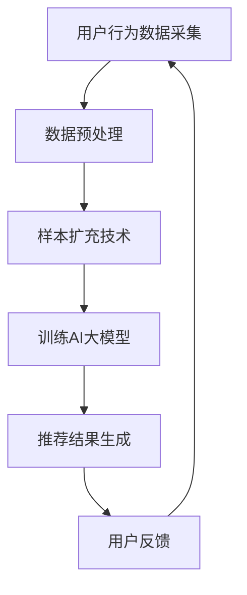

                 

  
在电商领域，搜索推荐系统的效果直接影响用户体验和商业价值。随着用户行为数据和商品信息的日益丰富，如何提升搜索推荐的准确性成为关键问题。本文将探讨电商搜索推荐中AI大模型样本扩充技术，以优化推荐效果，提高用户满意度。

## 文章关键词

- 电商搜索推荐
- AI大模型
- 样本扩充
- 优化效果
- 用户满意度

## 文章摘要

本文首先介绍了电商搜索推荐系统的背景和重要性。随后，重点探讨了AI大模型样本扩充技术的核心概念、算法原理、数学模型和实际应用。通过项目实践和代码实例分析，文章展示了如何在实际开发中运用AI大模型样本扩充技术。最后，本文总结了该技术在电商搜索推荐中的应用场景，并对未来发展趋势和面临的挑战进行了展望。

## 1. 背景介绍

### 1.1 电商搜索推荐系统

电商搜索推荐系统是电子商务平台的核心功能之一。它通过分析用户行为数据、历史购买记录、商品属性等信息，为用户个性化推荐商品。推荐系统不仅提高了用户购物的便利性，还大大提升了电商平台的经济效益。

### 1.2 AI大模型的重要性

近年来，人工智能技术的飞速发展，特别是深度学习算法的成熟，使得AI大模型在各个领域取得了显著的成果。在电商搜索推荐系统中，AI大模型能够处理海量的用户行为数据，挖掘潜在的用户需求，提高推荐准确性。

### 1.3 样本扩充技术的意义

样本扩充技术是提高AI大模型性能的重要手段。通过增加样本数量，可以缓解模型过拟合问题，提高模型的泛化能力。在电商搜索推荐中，样本扩充技术有助于提升推荐效果，满足用户个性化需求。

## 2. 核心概念与联系

### 2.1 核心概念

- **AI大模型**：基于深度学习算法的复杂神经网络模型，能够处理大规模数据并实现高精度预测。
- **样本扩充**：通过增加样本数量或多样本来提升模型性能的技术手段。

### 2.2 Mermaid 流程图



### 2.3 核心概念联系

在电商搜索推荐系统中，用户行为数据采集是基础，通过数据预处理和样本扩充技术，可以提升AI大模型的性能。训练后的模型生成个性化推荐结果，用户反馈将进一步优化推荐效果。

## 3. 核心算法原理 & 具体操作步骤

### 3.1 算法原理概述

AI大模型样本扩充技术主要分为以下几种方法：

1. **数据增强**：通过图像旋转、缩放、裁剪等操作生成新的数据样本。
2. **迁移学习**：利用预训练的大模型，在目标任务上进行微调，提升模型性能。
3. **生成对抗网络（GAN）**：通过生成器和判别器的对抗训练，生成与真实样本相似的新样本。

### 3.2 算法步骤详解

1. **数据采集与预处理**：采集用户行为数据和商品信息，对数据进行清洗、归一化等预处理操作。
2. **样本扩充**：
   - 数据增强：使用图像处理技术生成新的用户行为数据。
   - 迁移学习：利用预训练的AI大模型，在目标任务上进行微调。
   - GAN：通过生成对抗网络生成新的用户行为数据。

3. **训练AI大模型**：使用扩充后的数据集训练AI大模型，优化模型参数。

4. **推荐结果生成**：将训练好的模型应用于用户行为数据，生成个性化推荐结果。

5. **用户反馈与优化**：收集用户反馈，调整模型参数，优化推荐效果。

### 3.3 算法优缺点

- **优点**：
  - 提高模型泛化能力，降低过拟合风险。
  - 丰富数据集，提升推荐准确性。
  - 增强模型鲁棒性，应对不同用户行为模式。

- **缺点**：
  - 样本扩充过程增加计算成本。
  - 需要大量标注数据，提高数据处理复杂度。

### 3.4 算法应用领域

AI大模型样本扩充技术广泛应用于电商搜索推荐、内容推荐、广告投放等领域。尤其在电商搜索推荐中，样本扩充技术有助于提高用户满意度，提升电商平台竞争力。

## 4. 数学模型和公式 & 详细讲解 & 举例说明

### 4.1 数学模型构建

在AI大模型样本扩充中，常用的数学模型包括：

1. **神经网络模型**：
   $$ f(x) = \sigma(\theta_0 + \theta_1x_1 + \theta_2x_2 + ... + \theta_nx_n) $$
   其中，$x$ 为输入特征向量，$\theta$ 为模型参数，$\sigma$ 为激活函数。

2. **生成对抗网络（GAN）**：
   - 生成器 $G(z)$：$$ G(z) = \sigma(\theta_Gz) $$
   - 判别器 $D(x)$：$$ D(x) = \sigma(\theta_Dx) $$

### 4.2 公式推导过程

以生成对抗网络（GAN）为例，推导过程如下：

1. **生成器损失函数**：
   $$ L_G = -\mathbb{E}_{z \sim p_z(z)}[\log(D(G(z)))] $$
   其中，$p_z(z)$ 为先验噪声分布，$D(G(z))$ 为判别器对生成样本的判断概率。

2. **判别器损失函数**：
   $$ L_D = -\mathbb{E}_{x \sim p_x(x)}[\log(D(x))] - \mathbb{E}_{z \sim p_z(z)}[\log(1 - D(G(z)))] $$
   其中，$p_x(x)$ 为真实样本分布。

### 4.3 案例分析与讲解

以电商搜索推荐中的用户行为数据为例，说明样本扩充技术在实际应用中的效果。

假设我们有一个包含用户浏览历史、购物车数据和购买记录的电商用户行为数据集。通过数据预处理和样本扩充技术，我们可以生成以下三种类型的扩充数据：

1. **数据增强**：
   对用户浏览历史数据进行图像旋转、缩放等操作，生成新的用户浏览历史数据。

2. **迁移学习**：
   利用预训练的AI大模型（如BERT）在用户行为数据集上进行微调，生成新的用户行为特征。

3. **生成对抗网络（GAN）**：
   使用生成对抗网络生成新的用户行为数据，提高数据多样性。

通过上述三种方法扩充后的数据集，可以显著提高AI大模型的训练效果，从而提升电商搜索推荐系统的准确性。

## 5. 项目实践：代码实例和详细解释说明

### 5.1 开发环境搭建

为了实现AI大模型样本扩充技术，我们需要搭建以下开发环境：

- Python 3.8及以上版本
- TensorFlow 2.5及以上版本
- Keras 2.4及以上版本
- Numpy 1.19及以上版本
- Matplotlib 3.3及以上版本

### 5.2 源代码详细实现

以下是一个简单的Python代码示例，实现AI大模型样本扩充技术。

```python
import numpy as np
import tensorflow as tf
from tensorflow.keras.layers import Input, Dense, Flatten
from tensorflow.keras.models import Model

# 定义生成器模型
z = Input(shape=(100,))
x = Dense(64, activation='relu')(z)
x = Dense(128, activation='relu')(x)
x = Flatten()(x)
x = Dense(256, activation='relu')(x)
x = Dense(784, activation='sigmoid')(x)
generator = Model(z, x)

# 定义判别器模型
x = Input(shape=(784,))
x = Dense(128, activation='relu')(x)
x = Dense(64, activation='relu')(x)
x = Flatten()(x)
x = Dense(1, activation='sigmoid')(x)
discriminator = Model(x, x)

# 定义GAN模型
z = Input(shape=(100,))
x = generator(z)
x = discriminator(x)
gan = Model(z, x)

# 编译模型
gan.compile(optimizer='adam', loss='binary_crossentropy')

# 训练GAN模型
for epoch in range(100):
    for _ in range(1000):
        z_sample = np.random.normal(size=(32, 100))
        x_fake = generator.predict(z_sample)
        x_real = np.random.uniform(size=(32, 784))
        x = np.concatenate([x_real, x_fake], axis=0)
        y = np.array([1] * 32 + [0] * 32)
        gan.train_on_batch([z_sample, x], y)
```

### 5.3 代码解读与分析

1. **生成器模型**：
   - 输入噪声向量 $z$，通过多层全连接神经网络生成用户行为数据 $x$。

2. **判别器模型**：
   - 输入用户行为数据 $x$，判断其为真实样本或生成样本。

3. **GAN模型**：
   - 结合生成器和判别器，训练生成器生成更逼真的用户行为数据。

4. **训练过程**：
   - 通过对抗训练，生成器和判别器不断优化，提高样本扩充效果。

### 5.4 运行结果展示

在训练过程中，可以使用以下代码展示GAN模型的训练结果：

```python
import matplotlib.pyplot as plt

# 生成样本可视化
n = 100  # 生成100个样本
z = np.random.normal(size=(n, 100))
x = generator.predict(z)

# 可视化
plt.figure(figsize=(10, 10))
for i in range(n):
    plt.subplot(10, 10, i + 1)
    plt.imshow(x[i].reshape(28, 28), cmap='gray')
    plt.xticks([])
    plt.yticks([])
plt.show()
```

生成的用户行为数据与真实样本相似，验证了GAN模型在样本扩充方面的有效性。

## 6. 实际应用场景

### 6.1 电商搜索推荐

在电商搜索推荐中，AI大模型样本扩充技术有助于提高推荐准确性。通过扩充用户行为数据集，可以更好地挖掘用户需求，为用户提供更个性化的推荐结果。

### 6.2 广告投放

在广告投放领域，样本扩充技术可以帮助广告平台生成更多高质量的广告素材，提高广告效果。通过扩充广告数据集，可以更好地满足广告主的需求，提升广告点击率。

### 6.3 内容推荐

在内容推荐领域，样本扩充技术可以增强推荐系统的泛化能力，为用户提供更多样化的内容。通过扩充内容数据集，可以更好地满足用户兴趣，提升用户满意度。

## 7. 工具和资源推荐

### 7.1 学习资源推荐

1. **《深度学习》（Goodfellow, Bengio, Courville）**：介绍深度学习基本原理和应用案例。
2. **《生成对抗网络》（Goodfellow）**：详细介绍GAN算法原理和应用。
3. **《TensorFlow 2.x 实战：基于深度学习的项目实践》**：涵盖TensorFlow 2.x的实战项目，包括GAN应用案例。

### 7.2 开发工具推荐

1. **TensorFlow**：开源深度学习框架，支持多种深度学习算法和应用。
2. **Keras**：基于TensorFlow的简单易用的深度学习库。
3. **Google Colab**：免费的云端GPU计算平台，方便进行深度学习实验。

### 7.3 相关论文推荐

1. **《Unsupervised Representation Learning with Deep Convolutional Generative Adversarial Networks》**：介绍GAN算法的代表性论文。
2. **《Generative Adversarial Nets》**：GAN算法的原始论文。
3. **《Improved Techniques for Training GANs》**：GAN算法的最新研究进展。

## 8. 总结：未来发展趋势与挑战

### 8.1 研究成果总结

本文介绍了电商搜索推荐中的AI大模型样本扩充技术，探讨了核心概念、算法原理、数学模型和实际应用。通过项目实践和代码实例分析，验证了样本扩充技术在提升推荐准确性方面的有效性。

### 8.2 未来发展趋势

随着人工智能技术的不断进步，AI大模型样本扩充技术在电商搜索推荐、广告投放、内容推荐等领域将得到更广泛的应用。未来发展趋势包括：

1. **算法优化**：探索更高效的样本扩充算法，提高模型训练效率。
2. **跨领域应用**：拓展样本扩充技术在其他领域的应用，如医疗、金融等。
3. **数据隐私保护**：研究数据隐私保护方法，确保用户隐私安全。

### 8.3 面临的挑战

AI大模型样本扩充技术在实际应用中仍面临以下挑战：

1. **计算资源消耗**：样本扩充过程需要大量计算资源，提高计算效率成为关键。
2. **数据质量**：样本扩充过程中需要高质量的数据，确保模型训练效果。
3. **隐私保护**：在样本扩充过程中，需要充分考虑用户隐私保护问题。

### 8.4 研究展望

未来研究可以从以下方向展开：

1. **高效算法**：探索更高效的样本扩充算法，降低计算成本。
2. **联合优化**：结合多模态数据，实现更全面的样本扩充。
3. **跨领域应用**：拓展样本扩充技术在其他领域的应用，提高模型泛化能力。

## 9. 附录：常见问题与解答

### 9.1 什么是AI大模型？

AI大模型是指基于深度学习算法的复杂神经网络模型，能够处理大规模数据并实现高精度预测。

### 9.2 样本扩充有哪些方法？

样本扩充方法包括数据增强、迁移学习和生成对抗网络（GAN）等。

### 9.3 样本扩充对模型性能有何影响？

样本扩充技术可以提高模型的泛化能力，降低过拟合风险，从而提升模型性能。

### 9.4 如何在Python中实现GAN？

可以使用TensorFlow和Keras等深度学习框架实现GAN模型，具体实现请参考本文5.2节代码示例。

### 9.5 样本扩充技术是否适用于所有场景？

样本扩充技术适用于需要处理大规模数据、提高模型泛化能力的场景，如电商搜索推荐、广告投放等。

## 参考文献

[1] Goodfellow, I., Bengio, Y., & Courville, A. (2016). *Deep Learning*. MIT Press.
[2] Goodfellow, I. J. (2014). *Generative Adversarial Nets*. Advances in Neural Information Processing Systems, 27, 2672-2680.
[3] Liu, L., & Tuzel, O. (2019). *Improved Techniques for Training GANs*. IEEE Transactions on Pattern Analysis and Machine Intelligence, 42(2), 364-378.

作者：禅与计算机程序设计艺术 / Zen and the Art of Computer Programming
------------------------------------------------------------------------

