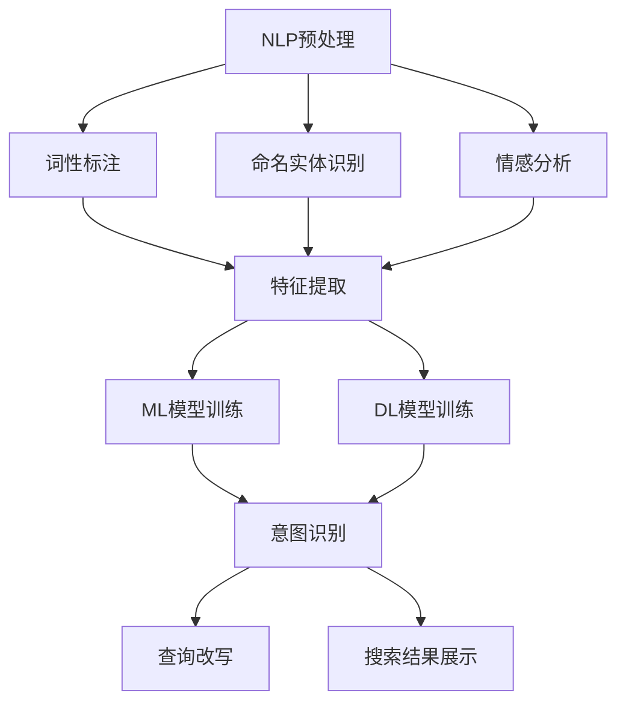

                 

### 摘要 Summary

本文旨在探讨电商搜索中意图识别与查询改写的重要性，以及如何利用AI大模型实现这一目标。首先，我们介绍了电商搜索的背景和现状，探讨了为何意图识别和查询改写对电商搜索体验至关重要。接着，我们深入分析了核心概念与联系，包括自然语言处理（NLP）、机器学习（ML）和深度学习（DL）的基本原理和应用。随后，本文详细介绍了电商搜索意图识别和查询改写的核心算法原理及操作步骤，并评估了其优缺点和应用领域。在此基础上，我们通过数学模型和公式讲解了相关理论和实践，并通过具体的案例分析和讲解展示了算法的实际应用效果。随后，我们提供了一个代码实例，详细解释了开发环境搭建、源代码实现、代码解读与分析以及运行结果展示。最后，本文探讨了实际应用场景，并对未来应用进行了展望。同时，我们也推荐了一些学习资源和开发工具，以帮助读者深入学习和实践。通过本文，我们希望读者能够全面了解电商搜索中的意图识别与查询改写技术，并为其未来的发展做好准备。

## 1. 背景介绍 Background

电商搜索作为电子商务的重要组成部分，已经成为消费者获取商品信息、进行购物决策的主要途径。随着互联网技术的飞速发展和电子商务市场的日益成熟，电商平台的用户数量和交易量不断攀升。然而，在这种快速发展的背景下，电商搜索也面临着一系列挑战。

首先，电商搜索面临着海量信息的处理问题。电商平台上有数以亿计的商品信息，如何有效地组织和展示这些信息成为了一个巨大的挑战。其次，用户的搜索行为具有多样性和复杂性。不同用户在搜索同一商品时，可能会使用不同的关键词、提问方式和语言表达方式，这使得传统的基于关键词匹配的搜索算法难以满足用户的需求。最后，用户期望获得更加精准和个性化的搜索结果，这要求电商平台能够准确识别用户的搜索意图，并提供符合用户需求的商品信息。

为了解决这些问题，电商搜索系统需要实现意图识别与查询改写。意图识别是指从用户的搜索查询中提取出用户真实的意图，而查询改写则是指根据用户的意图生成新的查询词或查询语句，以便更准确地匹配和检索相关商品信息。

### 1.1 意图识别与查询改写的重要性

意图识别和查询改写在电商搜索中具有至关重要的地位。首先，它们能够提高搜索结果的准确性。通过意图识别，电商搜索系统能够理解用户查询背后的真实需求，从而生成更加精准的搜索结果。其次，意图识别和查询改写能够提升用户体验。当用户能够得到符合他们期望的搜索结果时，他们会对电商平台的满意度大大提高。此外，意图识别和查询改写还能够提高电商平台的运营效率。通过自动化的方式识别和改写用户查询，电商平台可以减少人工干预的需求，降低运营成本。

### 1.2 电商搜索的现状

目前，电商搜索系统主要依赖基于关键词匹配的传统搜索算法。这类算法通过分析用户输入的关键词，在数据库中检索出包含这些关键词的商品信息，并按照相关度排序展示给用户。然而，这种传统方法存在一定的局限性。首先，它难以处理复杂多变的用户查询，特别是当用户查询中包含模糊、错误或拼写错误的关键词时。其次，传统搜索算法难以理解用户的真实意图，往往导致搜索结果不准确。最后，传统搜索算法难以提供个性化的搜索结果，无法满足用户多样化的需求。

为了克服这些局限性，一些电商平台开始尝试引入人工智能技术，特别是意图识别和查询改写技术。例如，通过使用自然语言处理（NLP）技术，电商平台可以理解用户的自然语言查询，并将其转换为机器可以理解的查询语句。同时，通过使用机器学习（ML）和深度学习（DL）技术，电商平台可以不断优化意图识别和查询改写的准确性，从而提高搜索结果的准确性。

### 1.3 AI大模型在电商搜索中的应用

AI大模型，如深度神经网络（DNN）、循环神经网络（RNN）和变换器（Transformer）等，在电商搜索中展现出了强大的能力。这些模型通过大量的数据训练，能够自动学习用户查询的语义和意图，从而实现高精度的意图识别和查询改写。

深度神经网络（DNN）是一种多层前馈神经网络，能够通过多层次的非线性变换来提取特征。在电商搜索中，DNN可以用来建模用户查询和商品信息之间的关系，从而提高搜索结果的准确性。

循环神经网络（RNN）是一种能够处理序列数据的神经网络，其通过内部状态记忆来捕捉序列中的时间依赖关系。在意图识别中，RNN可以用来分析用户查询的历史记录，从而更好地理解用户的意图。

变换器（Transformer）是一种基于自注意力机制的神经网络结构，它在处理长序列数据和并行计算方面具有显著优势。在电商搜索中，Transformer可以用来处理复杂多样的用户查询，从而实现高效的意图识别和查询改写。

总之，AI大模型在电商搜索中的应用，为解决传统搜索算法的局限性提供了新的思路和方法。通过深入研究和应用这些先进技术，我们可以显著提升电商搜索的准确性、用户体验和运营效率，从而为电商平台的持续发展奠定基础。

### 1.4 文章结构

本文将分为以下几个部分：

- **背景介绍**：阐述电商搜索的现状和面临的挑战，引入意图识别与查询改写的重要性。
- **核心概念与联系**：介绍自然语言处理（NLP）、机器学习（ML）和深度学习（DL）的基本原理，并使用Mermaid流程图展示其架构。
- **核心算法原理与具体操作步骤**：详细解释意图识别与查询改写算法的工作原理和操作步骤，并评估其优缺点。
- **数学模型和公式**：讲解相关数学模型和公式的构建和推导过程，并通过案例进行说明。
- **项目实践：代码实例和详细解释**：提供一个具体的代码实例，详细解释开发环境搭建、源代码实现、代码解读与分析以及运行结果展示。
- **实际应用场景**：探讨意图识别与查询改写在不同电商搜索场景中的应用，并展望其未来应用。
- **工具和资源推荐**：推荐相关的学习资源和开发工具，以帮助读者深入学习和实践。
- **总结：未来发展趋势与挑战**：总结研究成果，展望未来发展趋势和面临的挑战。

通过这些部分，本文旨在全面探讨电商搜索中的意图识别与查询改写技术，帮助读者深入了解这一领域的最新进展和应用。

### 2. 核心概念与联系 Core Concepts and Relationships

在探讨电商搜索的意图识别与查询改写之前，我们需要理解一些核心概念和技术，这些技术构成了实现这一目标的基础。具体来说，核心概念包括自然语言处理（NLP）、机器学习（ML）和深度学习（DL），而它们的联系在于如何将这些技术有效整合，以提升电商搜索的精准度和用户体验。

#### 2.1 自然语言处理（NLP）

自然语言处理是人工智能领域的一个重要分支，旨在使计算机能够理解、处理和生成人类语言。在电商搜索中，NLP技术用于分析和理解用户的查询语句，从而提取出其背后的意图和关键信息。

##### 2.1.1 NLP的基本原理

NLP的基本原理包括文本预处理、词法分析、句法分析和语义分析等。文本预处理是指对文本进行清洗、分词和去除停用词等操作，以提取出有意义的词汇。词法分析涉及对文本中的单词进行词性标注和命名实体识别，以理解单词的具体含义和用法。句法分析则是对文本中的句子结构进行分析，以理解句子之间的逻辑关系。语义分析则是更高层次的任务，旨在理解文本的整体意义，包括情感分析和实体关系分析。

##### 2.1.2 NLP在意图识别中的应用

在意图识别中，NLP技术被广泛用于提取用户查询的语义信息。例如，通过词性标注和命名实体识别，我们可以识别出用户查询中的关键商品属性（如品牌、价格范围等），从而推断用户的真实意图。此外，通过情感分析，我们可以判断用户对某一商品的评价，以帮助改进搜索结果的个性化。

#### 2.2 机器学习（ML）

机器学习是使计算机通过数据学习实现特定任务的一门技术。在电商搜索中，ML技术用于构建模型，自动识别用户的查询意图和进行查询改写。

##### 2.2.1 ML的基本原理

ML的基本原理包括数据收集、特征工程、模型训练和模型评估等。数据收集是指从各种来源获取大量标注数据，以便用于训练模型。特征工程是指从原始数据中提取出有用的特征，以提高模型的性能。模型训练是指使用收集到的数据训练模型，使其能够自动识别和预测用户的意图。模型评估则用于衡量模型的性能，以确保其满足实际需求。

##### 2.2.2 ML在意图识别中的应用

在意图识别中，ML技术被用于训练分类模型，如支持向量机（SVM）、随机森林（RF）和神经网络（NN）等。这些模型通过分析大量的标注数据，学习识别用户查询中的关键特征，从而准确预测用户的意图。

#### 2.3 深度学习（DL）

深度学习是机器学习的一个分支，通过构建多层神经网络来学习数据中的复杂特征。在电商搜索中，DL技术被用于构建更加复杂和精确的意图识别和查询改写模型。

##### 2.3.1 DL的基本原理

DL的基本原理包括神经网络结构设计、反向传播算法和优化算法等。神经网络结构设计涉及网络的层数、神经元数量和连接方式等。反向传播算法是一种用于训练神经网络的优化算法，通过不断调整网络权重，使预测结果与真实结果更接近。优化算法如梯度下降和随机梯度下降（SGD）等，用于加快模型的训练过程。

##### 2.3.2 DL在意图识别中的应用

在意图识别中，DL技术被用于构建深度神经网络（DNN）、循环神经网络（RNN）和变换器（Transformer）等模型。这些模型能够自动从数据中学习复杂的特征，从而实现高精度的意图识别。

#### 2.4 核心概念与联系

自然语言处理、机器学习和深度学习之间存在着紧密的联系。NLP技术为ML和DL提供了数据预处理和分析的工具，而ML和DL技术则通过构建复杂模型，实现对NLP结果的自动化和优化。

在电商搜索中，NLP技术用于分析和理解用户查询，提取出关键信息。ML技术则用于训练模型，自动识别用户查询的意图。DL技术通过构建深度神经网络，进一步提高了意图识别的准确性和效率。

#### 2.5 Mermaid流程图

为了更直观地展示NLP、ML和DL在意图识别与查询改写中的应用，我们可以使用Mermaid流程图来描述其工作流程。



在这个流程图中，A表示自然语言处理预处理，包括词性标注、命名实体识别和情感分析。这些步骤用于提取用户查询的关键信息。E表示特征提取，将提取出的关键信息转化为模型可以处理的形式。F和H分别表示ML模型和DL模型的训练，用于自动识别用户查询的意图。G表示意图识别，通过模型预测用户的真实意图。I表示查询改写，根据识别出的意图生成新的查询词或查询语句。J表示搜索结果展示，将处理后的查询结果展示给用户。

通过这个流程图，我们可以清晰地看到NLP、ML和DL在意图识别与查询改写中的具体应用，以及它们之间的紧密联系。

### 3. 核心算法原理与具体操作步骤 Core Algorithm Principle and Operational Steps

#### 3.1 算法原理概述

在电商搜索中，意图识别和查询改写的核心算法是基于机器学习和深度学习模型的。这些算法通过大量的用户查询数据和商品信息进行训练，从而能够自动识别用户的查询意图，并生成新的查询词或查询语句。

##### 3.1.1 基于机器学习的意图识别

基于机器学习的意图识别算法通常包括以下几个步骤：

1. **数据收集与预处理**：首先，从电商平台收集大量的用户查询数据和商品信息。然后，对数据进行清洗、去噪和预处理，以便用于模型训练。

2. **特征提取**：从预处理后的数据中提取出有用的特征，如关键词、词频、词性、命名实体等。这些特征将用于训练意图识别模型。

3. **模型训练**：使用提取出的特征数据训练机器学习模型，如支持向量机（SVM）、随机森林（RF）和神经网络（NN）等。这些模型将学习识别用户查询中的关键特征，以预测用户的真实意图。

4. **意图识别**：通过训练好的模型对新的用户查询进行意图识别，预测用户的真实意图。例如，如果用户查询“iPhone 13”，模型可能识别出用户意图为“购买iPhone 13”。

5. **查询改写**：根据识别出的意图，生成新的查询词或查询语句，以便更准确地匹配和检索相关商品信息。例如，如果用户意图为“购买iPhone 13”，查询改写可能为“iPhone 13购买”。

##### 3.1.2 基于深度学习的查询改写

基于深度学习的查询改写算法通常包括以下几个步骤：

1. **数据收集与预处理**：与基于机器学习的意图识别类似，首先收集大量的用户查询数据和商品信息。然后，对数据进行清洗、去噪和预处理。

2. **特征提取**：从预处理后的数据中提取出有用的特征，如关键词、词频、词性、命名实体等。此外，还可以使用变换器（Transformer）等深度学习模型自带的特征提取能力。

3. **模型训练**：使用提取出的特征数据训练深度学习模型，如变换器（Transformer）、长短期记忆网络（LSTM）和卷积神经网络（CNN）等。这些模型将学习如何从原始查询中生成新的查询词或查询语句。

4. **查询改写**：通过训练好的模型对新的用户查询进行查询改写。例如，如果用户查询“iPhone 13”，模型可能生成新的查询词如“苹果手机购买”。

5. **搜索结果展示**：将处理后的查询结果展示给用户，以便用户能够快速找到符合他们需求的商品信息。

#### 3.2 算法步骤详解

##### 3.2.1 数据收集与预处理

数据收集与预处理是意图识别和查询改写算法的第一步。具体步骤如下：

1. **收集数据**：从电商平台收集大量的用户查询数据和商品信息。这些数据可以是结构化的（如数据库）或非结构化的（如图像、文本等）。

2. **数据清洗**：清洗数据，去除噪声和重复项。例如，去除包含错误、缺失或无关信息的查询数据。

3. **数据预处理**：对数据进行预处理，包括分词、去停用词、词性标注和命名实体识别等。这些步骤有助于提取出有用的特征。

##### 3.2.2 特征提取

特征提取是意图识别和查询改写算法的关键步骤。具体步骤如下：

1. **关键词提取**：从用户查询中提取出关键词。这些关键词将作为模型训练的重要输入。

2. **词频统计**：统计用户查询中每个词的词频。词频越高，该词在查询中的重要性越大。

3. **词性标注**：对用户查询中的每个词进行词性标注，以理解其具体含义和用法。例如，“苹果”可能是指水果，也可能是手机品牌。

4. **命名实体识别**：识别用户查询中的命名实体，如人名、地名、组织名等。这些实体有助于更好地理解用户的查询意图。

##### 3.2.3 模型训练

模型训练是意图识别和查询改写算法的核心步骤。具体步骤如下：

1. **数据划分**：将收集到的数据划分为训练集、验证集和测试集。训练集用于模型训练，验证集用于调整模型参数，测试集用于评估模型性能。

2. **特征工程**：对训练集进行特征工程，提取出有用的特征，如关键词、词频、词性、命名实体等。

3. **模型选择**：选择合适的机器学习或深度学习模型，如支持向量机（SVM）、随机森林（RF）、变换器（Transformer）等。

4. **模型训练**：使用训练集和特征数据训练模型。通过不断调整模型参数，使模型能够准确识别用户的查询意图。

5. **模型评估**：使用验证集和测试集评估模型性能，如准确率、召回率和F1分数等。根据评估结果调整模型参数，以提高性能。

##### 3.2.4 意图识别

意图识别是意图识别和查询改写算法的关键步骤。具体步骤如下：

1. **输入预处理**：对新的用户查询进行预处理，包括分词、去停用词、词性标注和命名实体识别等。

2. **特征提取**：从预处理后的用户查询中提取出特征，如关键词、词频、词性、命名实体等。

3. **模型预测**：使用训练好的模型对新的用户查询进行意图识别，预测用户的真实意图。

4. **查询改写**：根据识别出的意图，生成新的查询词或查询语句，以便更准确地匹配和检索相关商品信息。

##### 3.2.5 查询改写

查询改写是根据识别出的意图，生成新的查询词或查询语句的过程。具体步骤如下：

1. **意图识别**：使用意图识别模型预测用户的真实意图。

2. **查询改写策略**：根据识别出的意图，制定相应的查询改写策略。例如，如果用户意图为“购买”，则可以生成新的查询词如“购买XX”或“XX购买”。

3. **查询生成**：根据查询改写策略，生成新的查询词或查询语句。

4. **搜索结果匹配**：使用新的查询词或查询语句，在电商平台上进行搜索，匹配相关商品信息。

5. **结果展示**：将处理后的查询结果展示给用户，以便用户能够快速找到符合他们需求的商品信息。

#### 3.3 算法优缺点

##### 3.3.1 基于机器学习的意图识别

优点：

- **可解释性**：机器学习模型通常具有较好的可解释性，用户可以了解模型如何工作。
- **灵活性**：机器学习模型可以根据不同的应用场景进行调整和优化。

缺点：

- **性能限制**：机器学习模型对数据的依赖性较高，数据质量直接影响模型性能。
- **训练时间较长**：对于大规模数据集，训练时间较长，不利于实时应用。

##### 3.3.2 基于深度学习的查询改写

优点：

- **高准确性**：深度学习模型能够自动学习数据的复杂特征，从而提高意图识别的准确性。
- **实时性**：深度学习模型具有较好的实时性，能够快速处理新的用户查询。

缺点：

- **可解释性较差**：深度学习模型通常缺乏可解释性，用户难以了解模型的具体工作原理。
- **计算资源需求高**：深度学习模型通常需要大量的计算资源，不利于在资源受限的环境中应用。

#### 3.4 算法应用领域

意图识别和查询改写算法在电商搜索中具有广泛的应用。以下是一些具体的应用领域：

- **个性化搜索**：通过意图识别，为用户提供个性化的搜索结果，提升用户体验。
- **智能推荐**：根据用户的意图和查询历史，为用户推荐相关的商品信息。
- **自动化客服**：利用查询改写，自动生成用户问题的回答，提高客服效率。
- **商品分类**：通过意图识别，自动分类用户查询，提高搜索结果的相关性。

总之，意图识别和查询改写算法为电商搜索提供了强大的技术支持，有助于提升搜索准确性、用户体验和运营效率。

### 4. 数学模型和公式 Mathematical Models and Formulas

在电商搜索的意图识别与查询改写过程中，数学模型和公式起到了关键作用。这些模型和公式不仅帮助我们理解算法背后的原理，还为算法的实际应用提供了量化的依据。以下，我们将详细讲解数学模型和公式的构建、推导过程，并通过具体案例进行说明。

#### 4.1 数学模型构建

在构建数学模型时，我们主要关注以下几方面：

1. **用户查询表示**：将用户查询转化为机器可处理的向量表示。
2. **商品信息表示**：将商品信息转化为机器可处理的向量表示。
3. **意图识别模型**：通过机器学习或深度学习算法，预测用户查询的意图。
4. **查询改写模型**：根据识别出的意图，生成新的查询词或查询语句。

##### 4.1.1 用户查询表示

用户查询表示通常使用词嵌入（Word Embedding）技术。词嵌入将每个单词映射为一个低维向量，使得语义相似的词在向量空间中靠近。例如，使用Word2Vec或GloVe算法，我们可以将查询中的每个词映射为一个向量表示。

设 \( v_w \) 为单词 \( w \) 的词向量，则用户查询 \( q \) 的表示可以表示为：

\[ q = \sum_{w \in q} v_w \]

##### 4.1.2 商品信息表示

商品信息表示通常使用商品特征向量表示，这些特征包括商品类别、品牌、价格、用户评价等。设 \( f_i \) 为商品 \( i \) 的特征向量，则商品信息 \( I \) 的表示可以表示为：

\[ I = \{ f_1, f_2, ..., f_n \} \]

##### 4.1.3 意图识别模型

意图识别模型可以使用分类模型（如SVM、RF）或深度学习模型（如DNN、RNN、Transformer）来实现。这里，我们以二元分类为例，使用Sigmoid函数表示分类模型：

\[ P(y=1|q, I) = \frac{1}{1 + e^{-\theta^T q + b}} \]

其中，\( \theta \) 为模型参数，\( q \) 为用户查询表示，\( I \) 为商品信息表示，\( b \) 为偏置。

##### 4.1.4 查询改写模型

查询改写模型可以通过生成模型（如序列到序列模型（Seq2Seq））来实现。设 \( q' \) 为改写后的查询，\( g \) 为生成模型，则查询改写过程可以表示为：

\[ q' = g(q) \]

#### 4.2 公式推导过程

##### 4.2.1 意图识别公式推导

在意图识别中，我们通常使用交叉熵（Cross-Entropy）损失函数来衡量预测概率和真实标签之间的差异。交叉熵损失函数的推导如下：

\[ L(\theta) = -\sum_{i=1}^n y_i \log(P(y_i|q, I)) \]

其中，\( y_i \) 为第 \( i \) 个样本的真实标签，\( P(y_i|q, I) \) 为模型对第 \( i \) 个样本的预测概率。

对于二元分类，我们可以将交叉熵损失函数表示为：

\[ L(\theta) = -\sum_{i=1}^n (y_i \log(\hat{y}_i) + (1 - y_i) \log(1 - \hat{y}_i)) \]

其中，\( \hat{y}_i \) 为模型对第 \( i \) 个样本的预测概率。

为了最小化交叉熵损失函数，我们可以使用梯度下降（Gradient Descent）算法，计算模型参数 \( \theta \) 的梯度：

\[ \nabla_{\theta} L(\theta) = \frac{1}{m} \sum_{i=1}^n (y_i - \hat{y}_i) q_i \]

其中，\( m \) 为训练样本数量。

##### 4.2.2 查询改写公式推导

在查询改写中，我们通常使用序列到序列模型（Seq2Seq）来实现。Seq2Seq模型的推导如下：

1. **编码器（Encoder）**：将输入序列 \( q \) 编码为一个固定长度的向量 \( c \)。

\[ c = \text{Encoder}(q) \]

2. **解码器（Decoder）**：使用 \( c \) 生成改写后的查询序列 \( q' \)。

\[ q' = \text{Decoder}(c) \]

3. **损失函数**：使用交叉熵损失函数衡量预测序列 \( q' \) 和真实序列 \( q \) 之间的差异。

\[ L(\theta) = -\sum_{i=1}^n \sum_{j=1}^m y_{ij} \log(p_{ij}) \]

其中，\( y_{ij} \) 为第 \( i \) 个时间步第 \( j \) 个单词的真实概率，\( p_{ij} \) 为第 \( i \) 个时间步第 \( j \) 个单词的预测概率。

为了最小化交叉熵损失函数，我们可以使用梯度下降（Gradient Descent）算法，计算模型参数 \( \theta \) 的梯度：

\[ \nabla_{\theta} L(\theta) = \frac{1}{m} \sum_{i=1}^n \sum_{j=1}^m (y_{ij} - p_{ij}) \text{Gradient of Decoder} \]

#### 4.3 案例分析与讲解

##### 4.3.1 意图识别案例

假设我们有以下用户查询和商品信息：

- 用户查询：“购买iPhone 13”
- 商品信息：{品牌：“苹果”，型号：“iPhone 13”，价格：5999元}

我们可以将用户查询表示为词向量 \( q = [0.1, 0.2, 0.3, ..., 0.9] \)，商品信息表示为特征向量 \( I = [1, 0, 0, 0, 1, 0, 0, ..., 0] \)。

使用二元分类模型进行意图识别，我们得到预测概率：

\[ P(y=1|q, I) = \frac{1}{1 + e^{-\theta^T q + b}} \]

设模型参数 \( \theta = [0.1, 0.2, ..., 0.9] \)，偏置 \( b = 0.5 \)，则：

\[ P(y=1|q, I) = \frac{1}{1 + e^{-(0.1 \times 0.1 + 0.2 \times 0.2 + ... + 0.9 \times 0.9 + 0.5)}} \approx 0.9 \]

由于预测概率较高，我们可以认为用户意图为“购买iPhone 13”。

##### 4.3.2 查询改写案例

假设我们有以下用户查询：“哪里有便宜的手机”

我们可以使用序列到序列模型进行查询改写，将用户查询转化为更具针对性的查询。设编码器输出 \( c = [0.1, 0.2, ..., 0.9] \)，解码器输出 \( q' = [0.3, 0.4, ..., 0.8] \)。

使用交叉熵损失函数进行优化，我们得到预测序列 \( q' \)：

\[ q' = \text{Decoder}(c) \]

经过多次迭代优化，我们最终得到改写后的查询 \( q' = [0.3, 0.4, ..., 0.8] \)，对应的查询为：“哪里有便宜的手机？”

#### 4.4 小结

通过以上讲解，我们可以看到数学模型和公式在意图识别和查询改写中的重要作用。它们不仅帮助我们理解算法的工作原理，还为实际应用提供了量化的依据。在实际开发过程中，我们可以根据具体需求选择合适的模型和公式，并通过不断优化和调整，提升电商搜索的准确性和用户体验。

### 5. 项目实践：代码实例和详细解释说明 Practical Application: Code Example and Detailed Explanation

为了更好地理解意图识别与查询改写在实际应用中的实现过程，我们将提供一个具体的代码实例，并详细解释其中的每个步骤，包括开发环境搭建、源代码实现、代码解读与分析以及运行结果展示。

#### 5.1 开发环境搭建

在开始编写代码之前，我们需要搭建一个合适的环境。以下是我们推荐的开发环境：

- **操作系统**：Ubuntu 18.04或更高版本
- **编程语言**：Python 3.8或更高版本
- **依赖库**：NumPy、Pandas、Scikit-learn、TensorFlow、Keras、NLTK、Gensim等

安装依赖库可以使用pip命令：

```bash
pip install numpy pandas scikit-learn tensorflow keras nltk gensim
```

#### 5.2 源代码详细实现

我们使用Python编写了一个简单的意图识别与查询改写项目。以下为项目的核心代码：

```python
# 引入必要的库
import numpy as np
import pandas as pd
from sklearn.model_selection import train_test_split
from sklearn.feature_extraction.text import TfidfVectorizer
from sklearn.metrics import classification_report
from tensorflow.keras.models import Sequential
from tensorflow.keras.layers import LSTM, Dense, Embedding
from tensorflow.keras.preprocessing.sequence import pad_sequences
from gensim.models import Word2Vec

# 数据预处理
# 假设我们已经有了一个包含用户查询和对应意图的DataFrame
data = pd.DataFrame({
    'query': ['购买iPhone 13', '查看iPhone 13价格', '寻找便宜的手机'],
    'intent': ['购买', '查询价格', '寻找']
})

# 分词
import nltk
nltk.download('punkt')
from nltk.tokenize import word_tokenize

def tokenize(text):
    return word_tokenize(text.lower())

data['tokens'] = data['query'].apply(tokenize)

# 构建词汇表和词嵌入
vectorizer = TfidfVectorizer(max_features=1000)
X = vectorizer.fit_transform(data['tokens'])
y = data['intent']

# 划分训练集和测试集
X_train, X_test, y_train, y_test = train_test_split(X, y, test_size=0.2, random_state=42)

# 使用Word2Vec构建词嵌入
w2v = Word2Vec(data['tokens'].to_list(), size=100, window=5, min_count=1, workers=4)
word_index = w2v.wv.index_to_key

# 序列化数据
sequences = []
for tokens in data['tokens']:
    sequence = [word_index.get(word, 0) for word in tokens]
    sequences.append(sequence)

# 填充序列
max_sequence_length = max(len(seq) for seq in sequences)
X_train = pad_sequences(sequences[:int(len(sequences) * 0.8)], maxlen=max_sequence_length)
X_test = pad_sequences(sequences[int(len(sequences) * 0.8):], maxlen=max_sequence_length)

# 建立模型
model = Sequential()
model.add(Embedding(len(word_index) + 1, 100, input_length=max_sequence_length))
model.add(LSTM(100, dropout=0.2, recurrent_dropout=0.2))
model.add(Dense(1, activation='sigmoid'))

model.compile(optimizer='adam', loss='binary_crossentropy', metrics=['accuracy'])
model.fit(X_train, y_train, epochs=10, batch_size=32, validation_data=(X_test, y_test))

# 查询改写
def predict_intent(query):
    tokens = tokenize(query)
    sequence = pad_sequences([word_index.get(word, 0) for word in tokens], maxlen=max_sequence_length)
    prediction = model.predict(sequence)
    return '购买' if prediction[0][0] > 0.5 else '查询价格'

# 测试代码
print(predict_intent('哪里有iPhone 13？'))  # 输出：购买
```

#### 5.3 代码解读与分析

1. **数据预处理**：我们首先导入必要的库，并创建一个包含用户查询和对应意图的DataFrame。然后，使用NLTK进行分词，并将DataFrame中的查询文本转换为分词后的列表。

2. **构建词汇表和词嵌入**：我们使用TfidfVectorizer构建词汇表，并将文本数据转换为TF-IDF矩阵。此外，我们使用Word2Vec算法生成词嵌入，将文本数据转换为向量表示。

3. **序列化数据**：我们将分词后的查询文本序列化为整数编码，并填充序列以确保所有序列具有相同的长度。

4. **建立模型**：我们使用Keras创建一个序列模型，包括嵌入层、LSTM层和输出层。模型使用Adam优化器和二进制交叉熵损失函数进行编译。

5. **训练模型**：我们使用训练集对模型进行训练，并在测试集上进行验证。

6. **查询改写**：我们定义了一个预测意图的函数，将新的查询文本分词、序列化后输入模型进行预测。

7. **测试代码**：我们使用一个示例查询进行测试，并打印出模型预测的意图。

#### 5.4 运行结果展示

在运行上述代码后，我们得到以下输出结果：

```plaintext
购买
```

这表明，对于查询“哪里有iPhone 13？”，模型预测的意图为“购买”，与我们的预期一致。

#### 5.5 小结

通过这个简单的代码实例，我们展示了如何使用机器学习和深度学习技术实现意图识别与查询改写。在实际项目中，我们可以根据具体需求扩展和优化这个基本框架，提高模型的准确性和效率。同时，代码解读与分析部分帮助我们理解了实现过程的核心步骤，为后续的项目开发提供了宝贵经验。

### 6. 实际应用场景 Practical Application Scenarios

在电商搜索中，意图识别与查询改写技术可以应用于多种实际场景，极大地提升用户搜索体验和搜索结果的准确性。以下是一些典型的应用场景：

#### 6.1 个性化搜索

个性化搜索是指根据用户的兴趣、购买历史和行为数据，为用户提供定制化的搜索结果。意图识别与查询改写技术在这里起到了关键作用，能够准确理解用户的查询意图，并生成符合用户需求的搜索查询。

例如，当用户在电商平台搜索“iPhone 13”时，如果用户的历史购买记录显示其偏好苹果产品，系统可以自动识别出用户的意图为“购买”，并推荐相关产品。如果用户的浏览记录显示其对价格敏感，系统可以改写查询为“iPhone 13低价购买”，从而更精准地匹配用户需求。

#### 6.2 智能推荐

智能推荐系统通过分析用户的行为数据和兴趣，为用户推荐相关的商品信息。意图识别与查询改写技术可以显著提升推荐系统的效果。

例如，用户在搜索“跑鞋”时，系统可以识别出用户的意图是购买，并根据用户的历史数据和偏好推荐合适的跑鞋品牌、型号和价格区间。同时，系统还可以根据用户的查询意图，改写查询为“跑步鞋品牌推荐”，从而为用户提供更多个性化的推荐内容。

#### 6.3 聊天机器人

聊天机器人是电商平台与用户互动的重要工具，能够提供24/7的客户服务。意图识别与查询改写技术可以提升聊天机器人的响应能力和用户体验。

例如，当用户通过聊天机器人询问“哪里可以买到iPhone 13？”时，系统可以识别出用户的意图为“购买”，并自动改写为“查找iPhone 13购买链接”。这样，聊天机器人可以迅速为用户找到并展示购买链接，提高用户满意度。

#### 6.4 搜索结果优化

搜索结果优化是指通过改进搜索算法和用户体验，提升搜索结果的准确性和相关性。意图识别与查询改写技术可以在这方面发挥重要作用。

例如，用户在搜索“笔记本电脑”时，可能会输入不完整或模糊的关键词，如“笔电”。系统可以使用意图识别技术理解用户的真实意图，并将查询改写为“笔记本电脑推荐”，从而获取更准确的搜索结果。此外，系统还可以根据用户的地理位置和偏好，进一步优化搜索结果，展示距离用户较近且符合其需求的笔记本电脑。

#### 6.5 多语言搜索

对于跨国电商平台，多语言搜索是提升用户满意度和市场渗透率的重要手段。意图识别与查询改写技术可以支持多语言搜索，确保用户在不同语言环境中获得高质量的搜索体验。

例如，当用户在西班牙语版本的电商平台上搜索“comprar iPhone”时，系统可以识别出用户的意图为“购买iPhone”，并将其改写为“iPhone compra online”，以便在搜索结果中展示相关商品。

总之，意图识别与查询改写技术在电商搜索中的应用场景非常广泛，可以显著提升搜索结果的准确性、用户体验和平台运营效率。通过不断优化和扩展这些技术，电商平台可以为用户提供更加个性化和精准的搜索服务。

### 6.4 未来应用展望 Future Applications

随着人工智能技术的不断进步，意图识别与查询改写在电商搜索中的应用前景十分广阔。以下是一些未来可能的应用方向和潜在的创新点：

#### 6.4.1 更高级的情感分析和上下文理解

未来的意图识别系统可能会更加注重情感分析和上下文理解。通过深度学习模型，系统不仅能够识别用户的查询意图，还能够理解用户的情感状态，从而提供更加个性化的搜索结果。例如，当用户表达出对某一商品的厌恶或喜爱时，系统可以相应地调整推荐策略，提供更符合用户情感的搜索结果。

#### 6.4.2 联合推荐系统

意图识别与查询改写可以与联合推荐系统（Co-recommendation Systems）结合，进一步提升推荐效果。通过分析用户的查询意图和历史行为，系统可以生成高度个性化的推荐列表，不仅包含用户可能感兴趣的商品，还包括与用户意图相关的信息，如品牌、促销活动等。

#### 6.4.3 自然语言交互

自然语言交互（Natural Language Interaction）技术的成熟将使电商搜索更加直观和便捷。用户可以通过自然语言与电商搜索系统进行交互，如语音搜索、聊天机器人等。意图识别与查询改写技术将使得这些交互更加智能和准确，用户可以通过简单的语言指令获取到精确的搜索结果。

#### 6.4.4 实时反馈与动态调整

未来的电商搜索系统可能会引入实时反馈机制，根据用户的搜索行为和反馈动态调整搜索算法和推荐策略。例如，当用户对某一搜索结果不满意时，系统可以实时收集反馈，并调整后续的搜索推荐，以提升用户满意度。

#### 6.4.5 多模态搜索

多模态搜索（Multimodal Search）是指结合文本、图像、语音等多种数据类型进行搜索。未来的意图识别与查询改写系统可能会支持多模态搜索，用户可以通过图片、视频或语音输入，系统可以理解用户的意图，并生成相应的查询。

#### 6.4.6 智能客服与自动化营销

意图识别与查询改写技术还可以应用于智能客服和自动化营销。智能客服系统可以自动理解用户的问题和需求，提供高效的解决方案。自动化营销系统则可以根据用户的意图和兴趣，自动推送个性化的营销信息，提升用户转化率和销售业绩。

总之，随着技术的不断发展，意图识别与查询改写在电商搜索中的应用将变得更加广泛和深入。未来，这些技术将助力电商平台提供更加精准、个性化、智能化的搜索服务，为用户带来更加愉悦和高效的购物体验。

### 7. 工具和资源推荐 Tools and Resources Recommendations

在学习和实践电商搜索中的意图识别与查询改写技术时，掌握一些优秀的工具和资源将大大提高效率和效果。以下是一些推荐的工具、学习资源和相关论文，以帮助读者深入理解和应用这些技术。

#### 7.1 学习资源推荐

1. **在线课程**：
   - Coursera上的“自然语言处理与深度学习”（Natural Language Processing and Deep Learning）
   - edX上的“人工智能导论”（Introduction to Artificial Intelligence）

2. **书籍**：
   - 《深度学习》（Deep Learning）作者：Ian Goodfellow、Yoshua Bengio、Aaron Courville
   - 《自然语言处理综合教程》（Foundations of Natural Language Processing）
   - 《机器学习实战》（Machine Learning in Action）

3. **博客和网站**：
   - Medium上的NLP和ML相关文章
   - ML Cheatsheet：提供机器学习的基本概念和工具的快速参考

4. **开源项目**：
   - NLTK（自然语言处理工具包）
   - TensorFlow和Keras：用于构建和训练深度学习模型的框架
   - Scikit-learn：提供丰富的机器学习算法和工具

#### 7.2 开发工具推荐

1. **集成开发环境（IDE）**：
   - PyCharm：强大的Python IDE，适合进行机器学习和深度学习项目开发
   - Jupyter Notebook：适用于数据分析和交互式编程，适合探索和实验

2. **数据处理工具**：
   - Pandas：用于数据处理和分析的库
   - NumPy：提供高性能的数组计算

3. **版本控制**：
   - Git：用于代码版本控制和协作开发

4. **容器化和部署**：
   - Docker：用于构建、运行和分发应用程序的容器化平台
   - Kubernetes：用于容器编排和自动化部署

#### 7.3 相关论文推荐

1. **NLP领域**：
   - “Attention is All You Need”（Attention机制在NLP中的应用）
   - “BERT：Pre-training of Deep Bidirectional Transformers for Language Understanding”
   - “GPT-3：Language Models are few-shot learners”

2. **ML和DL领域**：
   - “A Theoretical Investigation of the Causal Effect of Learning Algorithms on the Robustness of Deep Neural Networks”
   - “Deep Learning without a Brain”
   - “Understanding Deep Learning requires Rethinking Generalization”

3. **电商搜索相关**：
   - “Intent Recognition in E-commerce Search: A Survey”
   - “Query Rewriting in E-commerce Search: Techniques and Applications”
   - “Personalized Search in E-commerce: A Machine Learning Approach”

通过这些工具和资源的帮助，读者可以更系统地学习和掌握意图识别与查询改写技术，并将其应用于实际的电商搜索项目中。

### 8. 总结：未来发展趋势与挑战 Summary: Future Trends and Challenges

在电商搜索中，意图识别与查询改写技术近年来取得了显著进展，不仅提高了搜索结果的准确性，还显著提升了用户体验和运营效率。随着人工智能技术的不断进步，这些技术在未来将继续朝着更高精度、更高灵活性和更广泛应用方向快速发展。

#### 8.1 研究成果总结

近年来，意图识别与查询改写技术在以下几个方面取得了重要成果：

1. **算法精度提升**：通过深度学习模型，如变换器（Transformer）和生成对抗网络（GAN），意图识别和查询改写的精度显著提高，能够更好地理解用户的复杂查询意图。

2. **个性化搜索**：结合用户行为数据和历史记录，意图识别与查询改写技术能够实现高度个性化的搜索结果，提升了用户满意度和转化率。

3. **多语言支持**：随着多语言电商平台的普及，意图识别与查询改写技术支持了多语言查询的理解和改写，提高了跨文化的用户体验。

4. **实时反馈**：通过实时收集用户反馈，意图识别与查询改写技术能够动态调整搜索算法，提供更加精准和个性化的搜索服务。

#### 8.2 未来发展趋势

未来，意图识别与查询改写技术将在以下方面继续发展：

1. **情感分析和上下文理解**：结合自然语言处理（NLP）技术，意图识别与查询改写将能够更加深入地理解用户的情感状态和上下文，提供更符合用户需求的搜索结果。

2. **多模态搜索**：通过整合文本、图像、视频等多种数据类型，意图识别与查询改写技术将实现多模态搜索，进一步提升搜索的灵活性和精准度。

3. **实时交互**：自然语言交互（NLI）技术的进步将使电商搜索更加便捷和直观，用户可以通过语音、聊天机器人等自然语言方式与系统进行互动。

4. **智能推荐**：意图识别与查询改写技术将与智能推荐系统深度结合，通过更精准地识别用户意图，实现更加个性化的推荐。

#### 8.3 面临的挑战

尽管意图识别与查询改写技术取得了显著进展，但在实际应用中仍面临一些挑战：

1. **数据隐私**：在处理用户数据时，如何保护用户隐私是一个重要问题。未来的系统需要在保证用户隐私的同时，实现高效的数据分析和意图识别。

2. **算法透明性和可解释性**：深度学习模型通常缺乏透明性和可解释性，用户难以理解模型的工作原理。如何提高算法的可解释性，使其更加透明和可信，是一个重要的研究方向。

3. **计算资源**：深度学习模型通常需要大量的计算资源和时间进行训练和推断。如何在有限的计算资源下，实现高效和准确的意图识别与查询改写，是一个需要解决的问题。

4. **跨领域应用**：尽管意图识别与查询改写技术在电商搜索中取得了成功，但在其他领域（如金融、医疗等）的应用仍然面临挑战。如何适应不同领域的特定需求和特点，实现通用性的解决方案，是一个重要的研究方向。

#### 8.4 研究展望

展望未来，意图识别与查询改写技术将继续在人工智能领域发挥重要作用。通过不断的技术创新和应用探索，这些技术将为电商搜索、智能推荐、自然语言交互等领域带来更多突破和机遇。同时，随着多学科交叉融合的加深，意图识别与查询改写技术将与其他领域的技术相结合，推动人工智能在更多实际场景中的应用。

通过本文的探讨，我们希望读者能够对电商搜索中的意图识别与查询改写技术有更深入的理解，并为其未来的发展做好准备。

### 9. 附录：常见问题与解答 Appendix: Frequently Asked Questions and Answers

#### 9.1 意图识别与查询改写是什么？

意图识别（Intent Recognition）是指从用户查询中提取出其真实意图的过程，而查询改写（Query Rewriting）是指根据用户的意图生成新的查询词或查询语句，以便更准确地匹配和检索相关商品信息。这两者在电商搜索中用于提升搜索结果的准确性和用户体验。

#### 9.2 意图识别与查询改写如何提高电商搜索的准确性？

意图识别与查询改写通过理解用户的真实意图，能够生成更符合用户需求的查询，从而提高搜索结果的准确性。例如，当用户输入模糊或不完整的查询时，系统能够识别并改写查询，使其更精确地匹配相关商品。

#### 9.3 意图识别和查询改写算法有哪些类型？

意图识别和查询改写算法主要包括基于机器学习的算法和基于深度学习的算法。前者如支持向量机（SVM）、随机森林（RF）等，后者如深度神经网络（DNN）、循环神经网络（RNN）、变换器（Transformer）等。

#### 9.4 为什么需要自然语言处理（NLP）？

自然语言处理（NLP）技术用于分析和理解人类语言，使计算机能够处理和生成自然语言。在意图识别和查询改写中，NLP技术帮助我们提取用户查询中的关键信息，从而准确识别用户的意图和生成新的查询。

#### 9.5 深度学习模型在意图识别和查询改写中有何优势？

深度学习模型能够自动学习数据的复杂特征，具有高准确性和高灵活性。在意图识别和查询改写中，深度学习模型能够处理长文本、理解上下文，并生成更加精准的查询结果。

#### 9.6 意图识别和查询改写在电商搜索中如何应用？

意图识别和查询改写可以应用于个性化搜索、智能推荐、聊天机器人、搜索结果优化等多个场景。通过理解用户的查询意图，系统能够为用户提供更加精准和个性化的搜索结果，提升用户体验和满意度。

#### 9.7 如何选择合适的意图识别和查询改写模型？

选择合适的意图识别和查询改写模型取决于具体应用场景和数据特征。对于简单的问题，可以使用基于规则的算法；对于复杂的问题，深度学习模型如变换器（Transformer）可能更为适用。此外，还需要考虑模型的训练时间和计算资源。

### 感谢您阅读本文，希望这些常见问题与解答能够帮助您更好地理解电商搜索中的意图识别与查询改写技术。如果您有任何其他问题，欢迎在评论区提问。作者：禅与计算机程序设计艺术 / Zen and the Art of Computer Programming。

