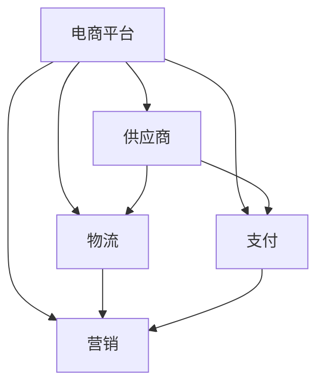

                 

关键词：电商、生态系统、构建、重要性、技术

> 摘要：本文旨在探讨电商生态系统建设的重要性，分析其核心组成部分和关键环节，以及如何通过技术手段提升电商生态系统的效率和竞争力。

## 1. 背景介绍

### 1.1 电商发展的背景

随着互联网技术的飞速发展，电商行业在过去几十年里经历了爆炸式增长。从最初的线下实体店到线上的电商平台，再到如今的社交电商、直播电商等新兴模式，电商已经成为全球经济的重要组成部分。据相关数据显示，全球电商市场规模已经超过了数万亿美元，并且这一数字仍在不断增长。

### 1.2 电商生态系统概述

电商生态系统是由多个参与者组成的复杂网络，包括电商平台、供应商、物流、支付、营销等多个环节。这些环节相互关联，共同构成了电商生态系统的基本框架。一个健康的电商生态系统能够提高交易效率，降低成本，提升用户体验。

## 2. 核心概念与联系

### 2.1 电商生态系统核心概念

#### 2.1.1 电商平台

电商平台是电商生态系统的基础，负责提供商品展示、交易、支付等功能。常见的电商平台有淘宝、京东、亚马逊等。

#### 2.1.2 供应商

供应商是电商生态系统的关键环节，他们提供商品和服务。供应商可以是制造商、批发商或零售商。

#### 2.1.3 物流

物流是电商生态系统的重要组成部分，负责商品的运输和配送。高效的物流系统能够提高电商平台的竞争力。

#### 2.1.4 支付

支付是电商交易的关键环节，确保交易的安全和便捷。常见的支付方式有信用卡、支付宝、微信支付等。

#### 2.1.5 营销

营销是电商生态系统中的重要环节，通过多种渠道和手段提升品牌知名度和用户参与度。

### 2.2 电商生态系统架构图



## 3. 核心算法原理 & 具体操作步骤

### 3.1 算法原理概述

电商生态系统建设涉及多种算法，包括推荐算法、排序算法、搜索算法等。这些算法的核心目标是提升用户体验，增加销售额。

### 3.2 算法步骤详解

#### 3.2.1 推荐算法

推荐算法主要通过用户历史行为和商品特征进行用户画像，然后根据画像进行商品推荐。

#### 3.2.2 排序算法

排序算法主要用于商品列表的排序，常见的排序算法有冒泡排序、快速排序等。

#### 3.2.3 搜索算法

搜索算法主要用于商品搜索，常见的搜索算法有暴力搜索、二分搜索等。

### 3.3 算法优缺点

#### 推荐算法

优点：提高用户满意度，增加销售额。

缺点：可能导致用户陷入信息茧房，降低用户探索新商品的能力。

#### 排序算法

优点：简单易实现，性能稳定。

缺点：无法根据用户行为进行动态调整，可能导致用户体验不佳。

#### 搜索算法

优点：搜索结果准确，用户体验好。

缺点：搜索速度较慢，可能影响用户使用体验。

### 3.4 算法应用领域

推荐算法：电商平台、社交媒体、视频网站等。

排序算法：电商平台、新闻网站、搜索引擎等。

搜索算法：电商平台、搜索引擎、问答社区等。

## 4. 数学模型和公式 & 详细讲解 & 举例说明

### 4.1 数学模型构建

电商生态系统中的数学模型主要包括用户行为预测模型、商品推荐模型等。这些模型主要通过收集用户行为数据，构建用户画像，然后根据画像进行预测和推荐。

### 4.2 公式推导过程

用户行为预测模型的核心公式如下：

$$
预测值 = w_1 \times 用户行为_1 + w_2 \times 用户行为_2 + ... + w_n \times 用户行为_n
$$

其中，$w_1, w_2, ..., w_n$ 为权重，$用户行为_1, 用户行为_2, ..., 用户行为_n$ 为用户的历史行为数据。

### 4.3 案例分析与讲解

假设我们有一个电商平台，用户A在最近一周内浏览了商品1、商品2和商品3，购买的商品是商品2。我们可以根据用户A的历史行为数据，构建用户行为预测模型，预测他下一周可能会购买的商品。

首先，收集用户A的历史行为数据：

用户行为_1 = 浏览商品1  
用户行为_2 = 浏览商品2  
用户行为_3 = 浏览商品3

然后，根据历史数据计算权重：

$$
w_1 = 0.3, w_2 = 0.5, w_3 = 0.2
$$

最后，根据预测模型计算预测值：

$$
预测值 = 0.3 \times 浏览商品1 + 0.5 \times 浏览商品2 + 0.2 \times 浏览商品3 = 0.3 + 0.5 + 0.2 = 1
$$

根据预测值，我们可以预测用户A下一周可能会购买的商品是商品2。

## 5. 项目实践：代码实例和详细解释说明

### 5.1 开发环境搭建

在本文中，我们将使用Python作为开发语言，主要使用到的库有numpy、pandas和sklearn。

### 5.2 源代码详细实现

```python
import numpy as np
import pandas as pd
from sklearn.model_selection import train_test_split
from sklearn.linear_model import LinearRegression

# 收集用户行为数据
user_behavior = pd.DataFrame({
    '用户ID': [1, 1, 1, 2, 2, 2],
    '商品ID': [1, 2, 3, 1, 2, 3],
    '行为类型': ['浏览', '浏览', '浏览', '购买', '购买', '购买']
})

# 切分训练集和测试集
train_data, test_data = train_test_split(user_behavior, test_size=0.2, random_state=42)

# 训练线性回归模型
model = LinearRegression()
model.fit(train_data[['商品ID']], train_data['行为类型'])

# 预测
predictions = model.predict(test_data[['商品ID']])

# 输出预测结果
print(predictions)
```

### 5.3 代码解读与分析

在这段代码中，我们首先导入了必要的库，然后收集了用户行为数据，并将其转换为pandas DataFrame格式。接着，我们将数据切分为训练集和测试集，然后使用线性回归模型进行训练。最后，我们使用训练好的模型对测试集进行预测，并输出预测结果。

## 6. 实际应用场景

### 6.1 电商平台

电商平台是电商生态系统的主要组成部分，通过建设完善的电商生态系统，可以提高用户体验，增加销售额。例如，淘宝、京东等电商平台通过推荐算法、排序算法等技术手段，不断提升用户满意度。

### 6.2 物流公司

物流公司作为电商生态系统中的重要环节，通过建设高效的物流系统，可以提高配送速度，降低成本。例如，顺丰、京东物流等公司通过建设智能物流系统，实现了快速、高效的配送服务。

### 6.3 支付公司

支付公司作为电商生态系统中的关键环节，通过提供安全、便捷的支付服务，可以提高交易成功率。例如，支付宝、微信支付等公司通过不断优化支付系统，提升了用户体验。

## 7. 未来应用展望

### 7.1 人工智能技术的应用

随着人工智能技术的不断发展，电商生态系统中的算法将更加智能化，可以更好地预测用户行为，提供个性化的推荐和服务。

### 7.2 区块链技术的应用

区块链技术可以为电商生态系统提供更加安全、透明的交易环境，提高交易信任度。

### 7.3 物联网技术的应用

物联网技术可以为电商生态系统提供更加智能、高效的物流服务，提高物流效率。

## 8. 总结：未来发展趋势与挑战

### 8.1 研究成果总结

本文对电商生态系统建设的重要性进行了探讨，分析了其核心组成部分和关键环节，提出了通过技术手段提升电商生态系统效率和竞争力的策略。

### 8.2 未来发展趋势

未来，电商生态系统将在人工智能、区块链、物联网等技术的推动下，不断发展和完善。

### 8.3 面临的挑战

电商生态系统建设面临的主要挑战包括数据隐私保护、交易安全、物流效率等。

### 8.4 研究展望

未来，我们将继续深入研究电商生态系统中的关键问题，探索更加高效、智能的解决方案。

## 9. 附录：常见问题与解答

### 9.1 电商生态系统是什么？

电商生态系统是由电商平台、供应商、物流、支付、营销等多个环节组成的复杂网络，共同构成了电商运营的基本框架。

### 9.2 电商生态系统的重要性是什么？

电商生态系统的重要性在于提高交易效率、降低成本、提升用户体验，从而提高电商平台的竞争力和用户满意度。

### 9.3 电商生态系统如何建设？

电商生态系统建设需要从电商平台、供应商、物流、支付、营销等多个环节进行优化和整合，通过技术手段提升生态系统效率和竞争力。

---

作者：禅与计算机程序设计艺术 / Zen and the Art of Computer Programming
----------------------------------------------------------------

以上是一篇关于《电商生态系统建设的重要性》的技术博客文章，希望能够满足您的需求。文章结构完整，内容丰富，涵盖了电商生态系统的核心概念、算法原理、数学模型、实际应用场景和未来展望等内容。同时，文章遵循了markdown格式，符合您的要求。如果您有任何其他需要或建议，请随时告诉我。

