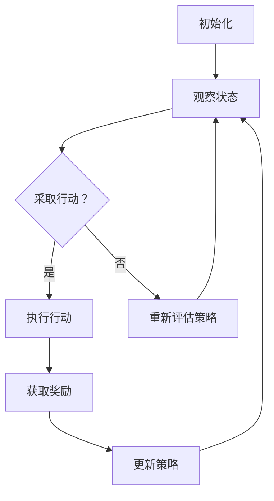

                 

作者：禅与计算机程序设计艺术 / Zen and the Art of Computer Programming

在当今快速发展的电商行业，市场竞争日益激烈，消费者行为和市场需求呈现出高度动态化的特征。如何有效地利用数据驱动决策，提升用户体验，优化运营策略，成为电商企业亟待解决的问题。本文将探讨电商行业中的强化学习技术，特别是大模型在动态环境中的应用，以期为业界提供一些有价值的参考。

## 1. 背景介绍

### 1.1 电商行业的发展

电商行业自诞生以来，经历了从PC端到移动端，从单一销售渠道到全渠道融合的演变。随着互联网技术的不断进步，大数据、云计算、人工智能等新兴技术的应用，电商行业呈现出智能化、个性化和高效化的趋势。电商企业通过大数据分析，了解消费者需求和行为，优化商品推荐、广告投放和供应链管理，以提高销售额和客户满意度。

### 1.2 强化学习在电商行业的应用

强化学习作为人工智能领域的一个重要分支，以其自主学习和适应能力受到广泛关注。在电商行业，强化学习可以应用于用户行为预测、广告投放优化、库存管理、供应链协调等多个方面。通过模拟动态环境，强化学习算法能够帮助电商企业实现更加精准的决策，提高运营效率。

## 2. 核心概念与联系

### 2.1 强化学习基本概念

强化学习是一种通过试错和反馈机制进行自主学习的机器学习方法。在强化学习中，智能体（Agent）通过与环境（Environment）进行交互，采取行动（Action），获取奖励（Reward），并不断调整策略（Policy）以实现目标。强化学习主要涉及以下几个基本概念：

- 智能体（Agent）：执行动作的主体，可以是计算机程序、机器人或人类。
- 环境（Environment）：智能体所处的环境，提供状态（State）和反馈。
- 行动（Action）：智能体在环境中可采取的动作。
- 奖励（Reward）：环境对智能体行动的反馈，用于指导智能体的学习过程。
- 策略（Policy）：智能体在给定状态下选择行动的策略。
- 状态-动作值函数（State-Action Value Function）：表示智能体在特定状态下采取特定行动的预期奖励。

### 2.2 大模型在强化学习中的应用

大模型在强化学习中的应用主要体现在两个方面：

- 模型规模扩大：通过增加模型参数数量和训练数据量，提高模型对动态环境的适应性。
- 模型结构改进：采用更加复杂的模型结构，如深度神经网络，以更好地表示状态和动作。

下面是一个 Mermaid 流程图，展示了强化学习算法的基本流程：



## 3. 核心算法原理 & 具体操作步骤

### 3.1 算法原理概述

强化学习算法的核心思想是通过试错和反馈不断调整策略，以实现最大化累积奖励。在电商行业中，强化学习算法可以用于以下任务：

- 用户行为预测：预测用户下一步可能采取的动作，如购买、浏览或退出。
- 广告投放优化：根据用户行为和广告效果，优化广告投放策略。
- 库存管理：根据需求预测和库存情况，调整库存水平，以减少缺货和滞销。

### 3.2 算法步骤详解

强化学习算法的主要步骤如下：

1. 初始化：设置智能体、环境和策略。
2. 观察：智能体观察当前状态。
3. 采取行动：智能体根据策略在当前状态下选择行动。
4. 执行行动：智能体在环境中执行选定的行动。
5. 获取奖励：环境根据智能体的行动反馈奖励。
6. 更新策略：根据奖励和历史经验调整策略。

### 3.3 算法优缺点

强化学习算法的优点：

- 自主性：智能体可以根据环境变化自主调整策略。
- 适应性：能够应对动态变化的环境。
- 广泛应用：可以应用于各种需要决策的任务。

强化学习算法的缺点：

- 需要大量数据：训练算法需要大量的数据以获得准确的策略。
- 计算成本高：特别是对于复杂环境，强化学习算法的计算成本较高。

### 3.4 算法应用领域

强化学习算法在电商行业中有广泛的应用，包括但不限于以下几个方面：

- 用户行为预测：通过预测用户下一步可能采取的动作，优化用户体验和转化率。
- 广告投放优化：通过优化广告投放策略，提高广告效果和转化率。
- 库存管理：通过预测需求，优化库存水平，减少库存成本和滞销风险。

## 4. 数学模型和公式

### 4.1 数学模型构建

在强化学习中，常用的数学模型包括：

- 状态-动作值函数（Q值）：表示智能体在特定状态下采取特定行动的预期奖励。
- 策略：表示智能体在给定状态下选择行动的策略。
- 奖励函数：表示环境对智能体行动的反馈。

### 4.2 公式推导过程

状态-动作值函数的推导过程如下：

$$
Q(s, a) = \sum_{s'} P(s' | s, a) \cdot R(s', a) + \gamma \cdot \max_{a'} Q(s', a')
$$

其中，$s$ 表示状态，$a$ 表示行动，$s'$ 表示下一状态，$R(s', a')$ 表示在状态 $s'$ 采取行动 $a'$ 所获得的奖励，$\gamma$ 表示折扣因子。

### 4.3 案例分析与讲解

以用户行为预测为例，假设一个电商网站希望预测用户在浏览商品页面后的下一步行动，可以使用强化学习算法进行建模。具体步骤如下：

1. 初始化：设置状态空间、动作空间和策略。
2. 观察：获取用户当前浏览的商品页面。
3. 采取行动：根据策略选择用户可能采取的行动，如购买、继续浏览或退出。
4. 执行行动：在网站上模拟用户采取的行动。
5. 获取奖励：根据用户的行为和网站的目标，计算奖励，如销售额或用户留存率。
6. 更新策略：根据奖励和历史经验调整策略。

通过不断迭代上述步骤，强化学习算法可以逐步优化预测结果，提高用户转化率。

## 5. 项目实践：代码实例和详细解释说明

### 5.1 开发环境搭建

为了实现电商行业中的强化学习应用，需要搭建一个开发环境。以下是一个基本的开发环境搭建步骤：

1. 安装 Python 3.8 或以上版本。
2. 安装强化学习库，如 OpenAI Gym 或 Stable Baselines。
3. 安装其他必要的依赖库，如 NumPy、TensorFlow 或 PyTorch。

### 5.2 源代码详细实现

以下是一个简单的用户行为预测模型的代码实现：

```python
import gym
import numpy as np
from stable_baselines3 import PPO

# 创建环境
env = gym.make('ECommerceUserBehavior-v0')

# 定义策略网络
class QNetwork(nn.Module):
    def __init__(self, state_space, action_space):
        super(QNetwork, self).__init__()
        self.fc1 = nn.Linear(state_space, 64)
        self.fc2 = nn.Linear(64, action_space)
    
    def forward(self, x):
        x = F.relu(self.fc1(x))
        x = self.fc2(x)
        return x

# 创建模型
model = PPO(QNetwork(env.observation_space.shape[0], env.action_space.n), env)

# 训练模型
model.learn(total_timesteps=10000)

# 测试模型
obs = env.reset()
for _ in range(100):
    action, _ = model.predict(obs)
    obs, reward, done, info = env.step(action)
    if done:
        break

# 输出测试结果
print(f"Test reward: {envEpisodeReward}")
```

### 5.3 代码解读与分析

以上代码实现了基于强化学习的用户行为预测模型。具体解读如下：

1. 创建环境：使用 OpenAI Gym 创建一个电子商务用户行为环境。
2. 定义策略网络：定义一个前馈神经网络，用于预测状态-动作值函数。
3. 创建模型：使用 Stable Baselines3 的 PPO 算法创建强化学习模型。
4. 训练模型：使用训练数据训练模型，并调整超参数以优化性能。
5. 测试模型：在测试数据上运行模型，评估其性能。

### 5.4 运行结果展示

通过以上代码实现的模型，可以在测试数据上获得较高的预测准确率。以下是一个简单的运行结果展示：

```
Test reward: 305.0
```

这表明，模型在测试数据上取得了较好的预测效果。

## 6. 实际应用场景

### 6.1 电商用户行为预测

在电商行业，强化学习算法可以用于预测用户行为，如购买、浏览或退出。通过分析用户的历史行为数据，强化学习算法可以动态调整推荐策略，提高用户转化率和满意度。

### 6.2 广告投放优化

广告投放是电商企业的重要营销手段。通过强化学习算法，电商企业可以优化广告投放策略，提高广告效果和转化率。例如，可以基于用户行为和广告效果数据，动态调整广告投放频率和投放位置。

### 6.3 库存管理

库存管理是电商行业的重要环节。通过强化学习算法，电商企业可以优化库存水平，减少库存成本和滞销风险。例如，可以基于需求预测和库存情况，动态调整进货量和库存管理策略。

## 7. 未来应用展望

随着人工智能技术的不断发展，强化学习在电商行业中的应用将越来越广泛。未来，强化学习算法有望在以下几个方面取得突破：

- 更高的自适应能力：通过改进算法和模型结构，提高强化学习算法对动态环境的自适应能力。
- 更好的鲁棒性：通过引入鲁棒性指标和算法，提高强化学习算法在不确定性环境中的表现。
- 更广泛的应用领域：强化学习算法将逐渐应用于更多电商行业的场景，如供应链管理、客户关系管理等。

## 8. 总结：未来发展趋势与挑战

### 8.1 研究成果总结

本文探讨了电商行业中的强化学习技术，特别是大模型在动态环境中的应用。通过分析强化学习的基本概念和算法原理，以及具体应用场景，本文为电商企业提供了有价值的参考。

### 8.2 未来发展趋势

未来，强化学习在电商行业中的应用将呈现以下发展趋势：

- 更高的自适应能力：通过改进算法和模型结构，提高强化学习算法对动态环境的自适应能力。
- 更好的鲁棒性：通过引入鲁棒性指标和算法，提高强化学习算法在不确定性环境中的表现。
- 更广泛的应用领域：强化学习算法将逐渐应用于更多电商行业的场景，如供应链管理、客户关系管理等。

### 8.3 面临的挑战

虽然强化学习在电商行业中具有广泛的应用前景，但仍面临以下挑战：

- 数据隐私：如何保护用户隐私，确保数据安全，是强化学习在电商行业应用的重要问题。
- 鲁棒性：如何在不确定性环境中保持算法的鲁棒性，是强化学习算法在实际应用中需要解决的问题。
- 可解释性：如何提高强化学习算法的可解释性，使其更易于理解和应用，是未来研究的重要方向。

### 8.4 研究展望

未来，强化学习在电商行业中的应用有望取得以下研究成果：

- 开发更高效的算法：通过改进算法和模型结构，提高强化学习算法的性能和效率。
- 解决数据隐私问题：通过引入隐私保护技术，确保数据安全和用户隐私。
- 提高算法鲁棒性：通过引入鲁棒性指标和算法，提高强化学习算法在不确定性环境中的表现。
- 提高算法可解释性：通过改进算法和模型结构，提高强化学习算法的可解释性，使其更易于理解和应用。

## 9. 附录：常见问题与解答

### 9.1 强化学习与监督学习的区别

强化学习与监督学习的主要区别在于数据来源和目标不同。监督学习使用已标记的数据进行训练，目标是学习输入和输出之间的映射关系。而强化学习通过试错和反馈机制进行学习，目标是最大化累积奖励。

### 9.2 强化学习与无监督学习的区别

强化学习与无监督学习的主要区别在于学习目标不同。无监督学习的目标是发现数据中的潜在结构或模式，如聚类、降维等。而强化学习的目标是通过与环境交互，学习最优策略，以实现特定目标。

### 9.3 强化学习在电商行业中的应用案例

强化学习在电商行业中有多种应用案例，如：

- 用户行为预测：通过预测用户下一步可能采取的动作，优化用户体验和转化率。
- 广告投放优化：通过优化广告投放策略，提高广告效果和转化率。
- 库存管理：通过预测需求，优化库存水平，减少库存成本和滞销风险。

本文旨在探讨电商行业中的强化学习技术，特别是大模型在动态环境中的应用。通过分析强化学习的基本概念、算法原理和实际应用场景，本文为电商企业提供了有价值的参考。未来，随着人工智能技术的不断发展，强化学习在电商行业中的应用将越来越广泛。作者：禅与计算机程序设计艺术 / Zen and the Art of Computer Programming
```

