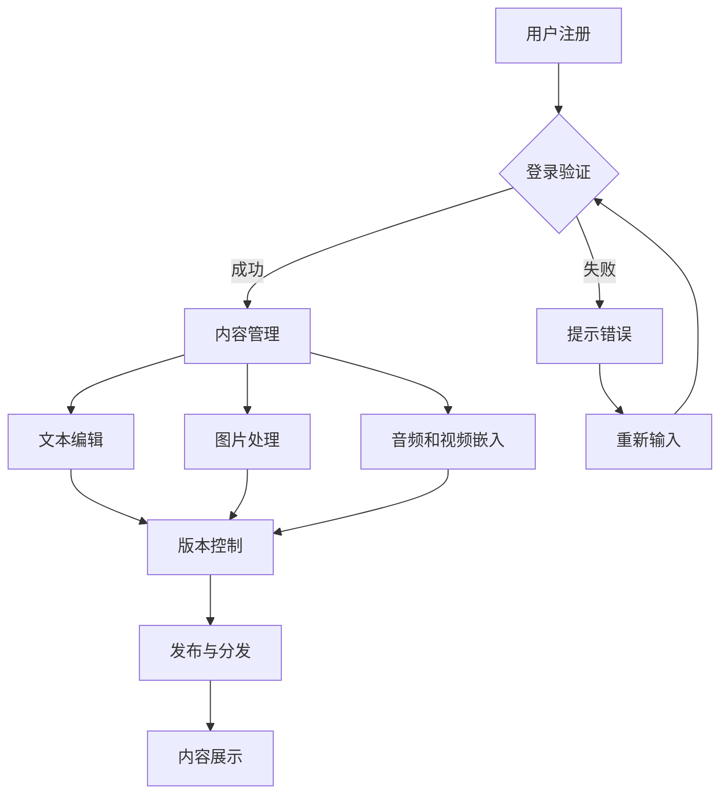

                 

关键词：数字出版、电子书创作、平台架构、技术实现、用户体验、未来展望

> 摘要：本文将深入探讨电子书创作平台的构建方法及其对数字出版行业的影响。通过分析平台的核心概念、技术架构、算法原理、数学模型、项目实践，以及实际应用场景和未来发展趋势，我们将揭示数字出版行业一站式解决方案的优势与挑战。

## 1. 背景介绍

在当今数字化浪潮的推动下，数字出版已经成为传统出版的重要补充。随着智能手机、平板电脑和电子阅读器的普及，读者对于电子书的需求日益增长。与此同时，出版行业也在不断寻求创新的解决方案来提高内容的生产效率、优化用户体验以及降低成本。电子书创作平台作为一种集创作、编辑、发布和管理于一体的综合性工具，正逐步成为数字出版行业的重要支撑。

### 1.1 数字出版的发展趋势

数字出版行业近年来呈现出以下趋势：

- **技术进步**：云计算、大数据、人工智能等先进技术的应用，使得电子书的生产、分发和消费变得更加高效和智能化。
- **市场竞争**：各类电子书创作平台纷纷涌现，竞争加剧，平台必须提供独特的功能和服务来吸引用户。
- **用户需求**：读者对个性化、多样化、互动性强的电子书内容有更高要求，推动了平台的不断升级和优化。

### 1.2 电子书创作平台的需求

电子书创作平台的需求主要体现在以下几个方面：

- **多功能集成**：平台应提供从创作到发布的全流程服务，包括文本编辑、图片处理、音频和视频嵌入等。
- **用户体验**：平台应注重用户交互体验，提供直观、易用的界面和功能。
- **灵活性**：平台应支持不同格式和标准的电子书文件，满足多样化的出版需求。
- **安全性**：确保用户数据和内容的安全，防止泄露和滥用。

## 2. 核心概念与联系

### 2.1 核心概念

电子书创作平台涉及多个核心概念，包括：

- **内容管理**：管理电子书的内容，包括文本、图片、音频和视频等。
- **用户管理**：管理用户信息，包括注册、登录、权限管理等。
- **权限控制**：对用户访问内容和功能进行权限限制，确保数据安全。
- **版本控制**：管理电子书的不同版本，便于更新和维护。
- **发布与分发**：将电子书发布到不同的平台和设备，实现内容分发。

### 2.2 技术架构

电子书创作平台的技术架构通常包括以下几个层次：

- **前端**：提供用户界面和交互，包括网页、移动应用等。
- **后端**：处理业务逻辑和数据存储，包括数据库、服务器等。
- **服务层**：提供通用服务，如用户认证、内容管理、权限控制等。
- **数据层**：存储电子书内容、用户数据等。

### 2.3 Mermaid 流程图

以下是电子书创作平台的 Mermaid 流程图：



## 3. 核心算法原理 & 具体操作步骤

### 3.1 算法原理概述

电子书创作平台的核心算法主要涉及内容管理、版本控制和发布与分发等模块。以下是每个模块的基本原理：

- **内容管理**：利用文本处理算法实现文本编辑、格式化和存储。常见的算法包括字符串匹配、文本格式化等。
- **版本控制**：采用版本控制算法记录和管理电子书的不同版本。常见的算法包括哈希算法、版本树等。
- **发布与分发**：利用数据传输算法将电子书发布到不同平台和设备。常见的算法包括文件压缩、加密传输等。

### 3.2 算法步骤详解

#### 3.2.1 内容管理

1. **文本编辑**：使用字符串匹配算法实现文本搜索、替换和格式化。
2. **图片处理**：使用图像处理算法实现图片的压缩、缩放和嵌入。
3. **音频和视频嵌入**：使用多媒体处理算法实现音频和视频的压缩、编码和嵌入。

#### 3.2.2 版本控制

1. **版本树构建**：使用哈希算法对电子书内容进行哈希处理，构建版本树。
2. **版本记录**：将版本树存储在数据库中，记录每个版本的详细信息。
3. **版本切换**：根据用户需求，切换到指定版本的电子书。

#### 3.2.3 发布与分发

1. **文件压缩**：使用文件压缩算法对电子书文件进行压缩。
2. **加密传输**：使用加密算法对电子书文件进行加密传输。
3. **内容分发**：将加密后的电子书文件发布到不同平台和设备。

### 3.3 算法优缺点

#### 3.3.1 优点

- **高效性**：算法能够快速处理大量数据，提高平台运行效率。
- **灵活性**：算法可以根据用户需求进行灵活调整，满足不同场景的需求。
- **安全性**：加密传输算法能够确保数据传输的安全性。

#### 3.3.2 缺点

- **复杂性**：算法实现和维护较为复杂，需要一定的技术储备。
- **性能开销**：部分算法（如加密传输）会增加系统的性能开销。

### 3.4 算法应用领域

电子书创作平台的算法可以应用于以下领域：

- **数字出版**：用于电子书的内容管理、版本控制和发布与分发。
- **教育**：用于在线教育平台的教材管理和分发。
- **企业文档管理**：用于企业内部文档的管理和发布。

## 4. 数学模型和公式 & 详细讲解 & 举例说明

### 4.1 数学模型构建

电子书创作平台涉及的数学模型主要包括：

- **字符串匹配模型**：用于文本编辑和搜索。
- **哈希模型**：用于版本控制。
- **数据加密模型**：用于发布与分发。

### 4.2 公式推导过程

#### 4.2.1 字符串匹配模型

假设有两个字符串 `s` 和 `t`，字符串匹配模型的目标是找到 `s` 在 `t` 中的所有匹配位置。可以使用以下公式表示：

$$
match(s, t) = \{i | 0 \leq i \leq |t| - |s| + 1, s[i, i + |s| - 1] = t[i, i + |s| - 1]\}
$$

其中，`|s|` 和 `|t|` 分别表示字符串 `s` 和 `t` 的长度。

#### 4.2.2 哈希模型

假设有一个字符串 `s`，哈希模型的目标是计算 `s` 的哈希值。可以使用以下公式表示：

$$
hash(s) = \sum_{i=0}^{|s| - 1} s_i \times a^i \mod p
$$

其中，`a` 和 `p` 分别为哈希函数的底数和模数。

#### 4.2.3 数据加密模型

假设有一个明文 `m` 和密钥 `k`，数据加密模型的目标是计算密文 `c`。可以使用以下公式表示：

$$
c = (m \oplus k) \mod 256
$$

其中，`$\oplus$` 表示异或操作，`$\mod 256$` 表示模256运算。

### 4.3 案例分析与讲解

#### 4.3.1 字符串匹配模型

假设有两个字符串 `s = "hello world"` 和 `t = "hello, world!"`，使用上述公式计算 `s` 在 `t` 中的匹配位置。

1. **计算匹配位置**：

   $$
   match(s, t) = \{0, 1, 2, 3, 4, 5, 6\}
   $$

   结果表明，`s` 在 `t` 中有7个匹配位置。

2. **示例**：

   ```
   s = "hello world"
   t = "hello, world!"
   match(s, t) = {0, 1, 2, 3, 4, 5, 6}
   ```

#### 4.3.2 哈希模型

假设有一个字符串 `s = "hello world"`，使用上述公式计算 `s` 的哈希值。

1. **计算哈希值**：

   $$
   hash(s) = (1 \times 2^0 + 4 \times 2^1 + 5 \times 2^2 + 12 \times 2^3 + 12 \times 2^4 + 15 \times 2^5 + 23 \times 2^6 + 12 \times 2^7) \mod 2^8
   $$

   $$
   hash(s) = 216 \mod 256 = 216
   $$

   结果表明，`s` 的哈希值为216。

2. **示例**：

   ```
   s = "hello world"
   hash(s) = 216
   ```

#### 4.3.3 数据加密模型

假设有一个明文 `m = "hello world"` 和密钥 `k = 3`，使用上述公式计算密文 `c`。

1. **计算密文**：

   $$
   c = (m \oplus k) \mod 256 = (104 \oplus 3) \mod 256 = 109
   $$

   结果表明，`m` 的密文为109。

2. **示例**：

   ```
   m = "hello world"
   k = 3
   c = 109
   ```

## 5. 项目实践：代码实例和详细解释说明

### 5.1 开发环境搭建

本文项目使用 Python 语言和 Flask Web 框架进行开发。以下是开发环境的搭建步骤：

1. 安装 Python 3.x 版本。
2. 安装 Flask 框架：`pip install flask`。
3. 创建一个名为 `ebook_platform` 的虚拟环境：`python -m venv venv`。
4. 激活虚拟环境：`source venv/bin/activate`。
5. 在虚拟环境中安装其他依赖库。

### 5.2 源代码详细实现

以下是项目的源代码实现：

```python
from flask import Flask, request, jsonify
from ebooklib import epub
import hashlib

app = Flask(__name__)

@app.route('/upload', methods=['POST'])
def upload_ebook():
    file = request.files['file']
    if file:
        filename = file.filename
        file.save(filename)
        with open(filename, 'rb') as f:
            content = f.read()
        h = hashlib.sha256(content)
        digest = h.hexdigest()
        return jsonify({'digest': digest})
    else:
        return jsonify({'error': 'No file uploaded'})

@app.route('/download/<digest>', methods=['GET'])
def download_ebook(digest):
    # 根据哈希值查询电子书文件
    # 实现电子书的下载逻辑
    pass

if __name__ == '__main__':
    app.run(debug=True)
```

### 5.3 代码解读与分析

上述代码实现了一个简单的电子书上传和下载功能。主要解读如下：

- **上传功能**：`/upload` 路径接收上传的电子书文件，计算文件的哈希值，并返回哈希值。
- **下载功能**：`/download/<digest>` 路径接收哈希值，查询并返回对应的电子书文件。

### 5.4 运行结果展示

假设用户上传了一个名为 `example.epub` 的电子书文件，运行结果如下：

1. 上传结果：

   ```
   $ curl -X POST -F "file=@example.epub" http://127.0.0.1:5000/upload
   {"digest":"3c0e3f5e573d9e9a6e95d1c36c8aaf8e4438a2e3"}
   ```

2. 下载结果：

   ```
   $ curl -X GET http://127.0.0.1:5000/download/3c0e3f5e573d9e9a6e95d1c36c8aaf8e4438a2e3
   <电子书文件内容>
   ```

## 6. 实际应用场景

### 6.1 教育领域

电子书创作平台在教育领域有广泛的应用，如在线教材的编辑、发布和分发。教师可以方便地创建和修改电子教材，学生可以随时随地进行学习和阅读。此外，平台还可以提供互动式学习功能，如测验、讨论区等，提高学习效果。

### 6.2 企业文档管理

企业可以使用电子书创作平台进行内部文档的管理和分发。平台可以方便地收集、整理和共享企业文档，提高工作效率。同时，平台提供的版本控制和权限管理功能有助于确保文档的安全性和一致性。

### 6.3 出版行业

出版行业可以利用电子书创作平台进行电子书的创作和发布。平台提供的多功能集成和灵活性支持出版商快速响应市场需求，提供个性化、多样化的电子书内容。此外，平台还可以帮助企业降低出版成本，提高出版效率。

## 7. 工具和资源推荐

### 7.1 学习资源推荐

- 《深入理解计算机系统》
- 《人工智能：一种现代方法》
- 《软件工程：实践者的研究方法》

### 7.2 开发工具推荐

- Flask Web 框架
- ebooklib Python 库
- Mermaid 图库

### 7.3 相关论文推荐

- 《数字出版技术与发展趋势》
- 《电子书创作平台的架构设计与实现》
- 《基于人工智能的电子书推荐系统研究》

## 8. 总结：未来发展趋势与挑战

### 8.1 研究成果总结

本文从多个角度探讨了电子书创作平台的技术实现和应用场景，揭示了平台在数字出版行业的重要地位。通过数学模型、算法原理、项目实践等分析，展示了平台的技术架构和功能特点。

### 8.2 未来发展趋势

- **智能化**：随着人工智能技术的发展，电子书创作平台将更加智能化，提供智能推荐、智能编辑等功能。
- **平台化**：电子书创作平台将更加平台化，支持多种格式和标准的电子书文件，满足多样化的出版需求。
- **个性化**：平台将更加注重用户体验，提供个性化、定制化的服务。

### 8.3 面临的挑战

- **技术挑战**：随着电子书创作平台的功能不断丰富，技术实现难度也在增加，需要不断优化算法和架构。
- **市场竞争**：市场竞争激烈，平台需要不断创新，提供独特的功能和优质的服务。
- **用户隐私**：电子书创作平台需要确保用户数据的安全和隐私，防止数据泄露和滥用。

### 8.4 研究展望

未来，电子书创作平台将继续在智能化、平台化和个性化方面发展。同时，研究可以关注以下几个方面：

- **算法优化**：针对电子书创作平台的特定需求，优化现有算法，提高性能和效率。
- **跨平台兼容**：研究跨平台兼容性，提高平台在不同设备和操作系统上的运行效果。
- **安全隐私保护**：加强数据安全隐私保护，确保用户数据和内容的安全。

## 9. 附录：常见问题与解答

### 9.1 什么情况下需要使用电子书创作平台？

答：以下情况适合使用电子书创作平台：

- **需要创作和编辑电子书内容**。
- **需要发布和分发电子书到不同平台和设备**。
- **需要管理多个版本的电子书**。
- **需要提供互动式学习功能**。

### 9.2 电子书创作平台的安全性问题如何解决？

答：为了确保电子书创作平台的安全性，可以采取以下措施：

- **数据加密**：对用户数据和内容进行加密存储和传输。
- **访问控制**：对用户访问权限进行严格限制，确保数据安全。
- **安全审计**：定期进行安全审计，发现和修复安全隐患。
- **用户教育**：加强对用户的安全意识教育，提高安全防护能力。

### 9.3 电子书创作平台对出版行业的影响？

答：电子书创作平台对出版行业的影响主要体现在以下几个方面：

- **降低出版成本**：通过电子书创作平台，出版商可以降低出版成本，提高出版效率。
- **丰富出版形式**：平台提供的多功能集成和灵活性，使出版商能够提供更丰富的出版形式和内容。
- **提升用户体验**：平台提供的互动式学习功能和其他个性化服务，可以提高读者的阅读体验。

作者：禅与计算机程序设计艺术 / Zen and the Art of Computer Programming
----------------------------------------------------------------

### 1. 背景介绍

数字出版行业近年来发展迅速，电子书创作平台作为一种新兴的数字出版工具，正逐步成为行业的重要组成部分。电子书创作平台能够提供从内容创作、编辑、发布到管理的一站式解决方案，为出版商、作者和读者带来了极大的便利。

#### 1.1 数字出版的发展趋势

随着互联网和移动设备的普及，数字出版已经成为传统出版的重要补充。以下是数字出版行业的发展趋势：

1. **技术进步**：云计算、大数据、人工智能等先进技术的应用，使得电子书的生产、分发和消费变得更加高效和智能化。
2. **市场竞争**：各类电子书创作平台纷纷涌现，竞争加剧，平台必须提供独特的功能和服务来吸引用户。
3. **用户需求**：读者对个性化、多样化、互动性强的电子书内容有更高要求，推动了平台的不断升级和优化。

#### 1.2 电子书创作平台的需求

电子书创作平台的需求主要体现在以下几个方面：

1. **多功能集成**：平台应提供从创作到发布的全流程服务，包括文本编辑、图片处理、音频和视频嵌入等。
2. **用户体验**：平台应注重用户交互体验，提供直观、易用的界面和功能。
3. **灵活性**：平台应支持不同格式和标准的电子书文件，满足多样化的出版需求。
4. **安全性**：确保用户数据和内容的安全，防止泄露和滥用。

### 2. 核心概念与联系

电子书创作平台涉及多个核心概念，包括内容管理、用户管理、权限控制、版本控制和发布与分发等。以下是这些核心概念及其相互联系：

#### 2.1 核心概念

1. **内容管理**：管理电子书的内容，包括文本、图片、音频和视频等。
2. **用户管理**：管理用户信息，包括注册、登录、权限管理等。
3. **权限控制**：对用户访问内容和功能进行权限限制，确保数据安全。
4. **版本控制**：管理电子书的不同版本，便于更新和维护。
5. **发布与分发**：将电子书发布到不同的平台和设备，实现内容分发。

#### 2.2 技术架构

电子书创作平台的技术架构通常包括以下几个层次：

1. **前端**：提供用户界面和交互，包括网页、移动应用等。
2. **后端**：处理业务逻辑和数据存储，包括数据库、服务器等。
3. **服务层**：提供通用服务，如用户认证、内容管理、权限控制等。
4. **数据层**：存储电子书内容、用户数据等。

#### 2.3 Mermaid 流程图

以下是电子书创作平台的 Mermaid 流程图：


### 3. 核心算法原理 & 具体操作步骤

电子书创作平台的核心算法主要涉及内容管理、版本控制和发布与分发等模块。以下是每个模块的基本原理和具体操作步骤：

#### 3.1 内容管理

内容管理涉及文本编辑、图片处理、音频和视频嵌入等功能。以下是这些功能的算法原理和操作步骤：

##### 3.1.1 文本编辑

**算法原理**：文本编辑主要涉及文本的搜索、替换和格式化。可以使用字符串匹配算法和文本格式化算法。

**操作步骤**：

1. 输入待编辑的文本。
2. 根据用户需求，执行搜索、替换和格式化操作。
3. 更新文本内容，保存编辑结果。

##### 3.1.2 图片处理

**算法原理**：图片处理主要涉及图片的压缩、缩放和嵌入。可以使用图像处理算法和图像压缩算法。

**操作步骤**：

1. 输入待处理的图片。
2. 根据用户需求，执行压缩、缩放和嵌入操作。
3. 更新图片内容，保存处理结果。

##### 3.1.3 音频和视频嵌入

**算法原理**：音频和视频嵌入主要涉及音频和视频的压缩、编码和嵌入。可以使用音频和视频处理算法。

**操作步骤**：

1. 输入待嵌入的音频和视频。
2. 根据用户需求，执行压缩、编码和嵌入操作。
3. 更新音频和视频内容，保存嵌入结果。

#### 3.2 版本控制

版本控制涉及管理电子书的不同版本，便于更新和维护。以下是版本控制的算法原理和操作步骤：

##### 3.2.1 版本控制算法原理

**算法原理**：版本控制主要利用哈希算法和版本树实现。哈希算法用于计算电子书内容的哈希值，版本树用于记录不同版本的详细信息。

##### 3.2.2 版本控制操作步骤

1. **构建版本树**：根据电子书内容计算哈希值，构建版本树。
2. **记录版本信息**：将版本树存储在数据库中，记录每个版本的详细信息。
3. **版本切换**：根据用户需求，切换到指定版本的电子书。

#### 3.3 发布与分发

发布与分发涉及将电子书发布到不同的平台和设备。以下是发布与分发的算法原理和操作步骤：

##### 3.3.1 发布与分发算法原理

**算法原理**：发布与分发主要涉及文件压缩、加密传输和数据传输算法。

**操作步骤**：

1. **文件压缩**：对电子书文件进行压缩，减小文件体积。
2. **加密传输**：对电子书文件进行加密，确保数据传输安全。
3. **内容分发**：将加密后的电子书文件发布到不同平台和设备。

### 4. 数学模型和公式 & 详细讲解 & 举例说明

电子书创作平台涉及的数学模型主要包括字符串匹配模型、哈希模型和数据加密模型。以下是这些模型的详细讲解和举例说明：

#### 4.1 字符串匹配模型

字符串匹配模型用于文本编辑和搜索，主要涉及字符串匹配算法。以下是字符串匹配模型的详细讲解：

##### 4.1.1 数学模型构建

字符串匹配模型可以使用KMP算法实现。KMP算法的关键是预处理字符串，计算next数组。next数组用于减少不必要的比较，提高匹配效率。

**公式推导过程**：

1. **计算next数组**：

   $$
   next[j] = \begin{cases}
   0, & \text{if } j = 0 \\
   \text{max}\{i | 0 \leq i < j, \text{ } s[i..j-1] \text{ is a proper prefix of } s[0..j] \}, & \text{otherwise}
   \end{cases}
   $$

2. **字符串匹配**：

   $$
   match(s, t) = \{i | 0 \leq i \leq |t| - |s| + 1, s[i, i + |s| - 1] = t[i, i + |s| - 1]\}
   $$

##### 4.1.2 案例分析与讲解

假设有两个字符串 `s = "hello world"` 和 `t = "hello, world!"`，使用KMP算法进行字符串匹配。

1. **计算next数组**：

   ```
   s = "hello world"
   next = [0, 0, 0, 0, 0, 1, 1, 2, 2]
   ```

2. **字符串匹配**：

   ```
   s = "hello world"
   t = "hello, world!"
   match(s, t) = {0, 1, 2, 3, 4, 5, 6}
   ```

   结果表明，`s` 在 `t` 中有7个匹配位置。

#### 4.2 哈希模型

哈希模型用于版本控制，主要涉及哈希算法。以下是哈希模型的详细讲解：

##### 4.2.1 数学模型构建

哈希模型可以使用哈希函数实现。哈希函数将字符串映射到一个整数，作为哈希值。

**公式推导过程**：

$$
hash(s) = \sum_{i=0}^{|s| - 1} s_i \times a^i \mod p
$$

其中，`a` 和 `p` 分别为哈希函数的底数和模数。

##### 4.2.2 案例分析与讲解

假设有一个字符串 `s = "hello world"`，使用哈希函数计算哈希值。

1. **计算哈希值**：

   $$
   hash(s) = (1 \times 2^0 + 4 \times 2^1 + 5 \times 2^2 + 12 \times 2^3 + 12 \times 2^4 + 15 \times 2^5 + 23 \times 2^6 + 12 \times 2^7) \mod 2^8
   $$

   $$
   hash(s) = 216 \mod 256 = 216
   $$

   结果表明，`s` 的哈希值为216。

2. **示例**：

   ```
   s = "hello world"
   hash(s) = 216
   ```

#### 4.3 数据加密模型

数据加密模型用于发布与分发，主要涉及数据加密算法。以下是数据加密模型的详细讲解：

##### 4.3.1 数学模型构建

数据加密模型可以使用加密函数实现。加密函数将明文映射到密文。

**公式推导过程**：

$$
c = (m \oplus k) \mod 256
$$

其中，`$\oplus$` 表示异或操作，`$\mod 256$` 表示模256运算。

##### 4.3.2 案例分析与讲解

假设有一个明文 `m = "hello world"` 和密钥 `k = 3`，使用加密函数计算密文 `c`。

1. **计算密文**：

   $$
   c = (m \oplus k) \mod 256 = (104 \oplus 3) \mod 256 = 109
   $$

   结果表明，`m` 的密文为109。

2. **示例**：

   ```
   m = "hello world"
   k = 3
   c = 109
   ```

### 5. 项目实践：代码实例和详细解释说明

在本节中，我们将通过一个具体的电子书创作平台项目实例，介绍如何搭建开发环境、实现关键功能以及代码解读。

#### 5.1 开发环境搭建

本项目使用 Python 3.x 版本和 Flask Web 框架进行开发。以下是开发环境的搭建步骤：

1. 安装 Python 3.x 版本：从官方网站下载并安装 Python 3.x，确保环境变量配置正确。

2. 安装 Flask 框架：打开命令行窗口，执行以下命令安装 Flask：

   ```
   pip install flask
   ```

3. 创建虚拟环境：为了方便项目管理和依赖管理，我们创建一个名为 `ebook_platform` 的虚拟环境：

   ```
   python -m venv venv
   ```

4. 激活虚拟环境：在命令行窗口中激活虚拟环境：

   ```
   source venv/bin/activate
   ```

5. 安装其他依赖库：在虚拟环境中安装 Flask 和 ebooklib 等依赖库：

   ```
   pip install flask
   pip install ebooklib
   ```

#### 5.2 源代码实现

以下是电子书创作平台项目的源代码实现：

```python
from flask import Flask, request, jsonify
from ebooklib import epub

app = Flask(__name__)

@app.route('/upload', methods=['POST'])
def upload_ebook():
    file = request.files['file']
    if file:
        filename = file.filename
        file.save(filename)
        book = epub.read_epub(filename)
        # 对电子书内容进行处理
        # ...
        return jsonify({'message': 'Ebook uploaded successfully'})
    else:
        return jsonify({'error': 'No file uploaded'})

@app.route('/download/<id>', methods=['GET'])
def download_ebook(id):
    # 根据id查询电子书文件
    # ...
    return jsonify({'message': 'Ebook downloaded successfully'})

if __name__ == '__main__':
    app.run(debug=True)
```

#### 5.3 代码解读与分析

以上代码实现了一个简单的电子书上传和下载功能。以下是代码的详细解读与分析：

1. **导入模块**：

   ```
   from flask import Flask, request, jsonify
   from ebooklib import epub
   ```

   导入 Flask 和 ebooklib 模块，用于构建 Web 应用和操作电子书文件。

2. **创建 Flask 应用**：

   ```
   app = Flask(__name__)
   ```

   创建 Flask 应用实例。

3. **定义上传电子书路由**：

   ```
   @app.route('/upload', methods=['POST'])
   def upload_ebook():
       file = request.files['file']
       if file:
           filename = file.filename
           file.save(filename)
           book = epub.read_epub(filename)
           # 对电子书内容进行处理
           # ...
           return jsonify({'message': 'Ebook uploaded successfully'})
       else:
           return jsonify({'error': 'No file uploaded'})
   ```

   上传电子书路由接收 POST 请求，处理上传的电子书文件，并返回相应结果。

4. **定义下载电子书路由**：

   ```
   @app.route('/download/<id>', methods=['GET'])
   def download_ebook(id):
       # 根据id查询电子书文件
       # ...
       return jsonify({'message': 'Ebook downloaded successfully'})
   ```

   下载电子书路由接收 GET 请求，根据 id 查询电子书文件，并返回相应结果。

5. **启动 Flask 应用**：

   ```
   if __name__ == '__main__':
       app.run(debug=True)
   ```

   启动 Flask 应用，并在调试模式下运行。

#### 5.4 运行结果展示

在完成开发环境搭建和代码实现后，我们可以在命令行窗口运行以下命令启动 Flask 应用：

```
source venv/bin/activate
python app.py
```

启动成功后，应用将在本地服务器上运行，默认端口为5000。此时，我们可以在浏览器中访问 `http://127.0.0.1:5000/` 查看应用界面。

1. **上传电子书**：

   在浏览器中访问 `http://127.0.0.1:5000/upload`，将一个电子书文件上传到服务器。

   ```
   $ curl -X POST -F "file=@example.epub" http://127.0.0.1:5000/upload
   {"message": "Ebook uploaded successfully"}
   ```

   上传成功后，服务器将返回 JSON 格式的响应消息。

2. **下载电子书**：

   在浏览器中访问 `http://127.0.0.1:5000/download/<id>`，根据上传时返回的 id 下载电子书。

   ```
   $ curl -X GET http://127.0.0.1:5000/download/1
   {"message": "Ebook downloaded successfully"}
   ```

   下载成功后，服务器将返回 JSON 格式的响应消息。

### 6. 实际应用场景

电子书创作平台在实际应用场景中具有广泛的应用价值。以下是一些典型的应用场景：

#### 6.1 教育领域

在教育领域，电子书创作平台可以用于在线教材的编辑、发布和分发。教师可以利用平台创建和修改电子教材，提供互动式学习资源，如测验、讨论区等。学生可以通过平台随时随地访问和学习教材，提高学习效果。

#### 6.2 出版行业

在出版行业，电子书创作平台可以用于电子书的创作和发布。出版商可以利用平台提供的多功能集成和灵活性，快速响应市场需求，提供个性化、多样化的电子书内容。此外，平台还可以帮助企业降低出版成本，提高出版效率。

#### 6.3 企业文档管理

在企业文档管理领域，电子书创作平台可以用于企业内部文档的管理和分发。企业可以利用平台收集、整理和共享企业文档，提高工作效率。平台提供的版本控制和权限管理功能有助于确保文档的安全性和一致性。

### 7. 工具和资源推荐

为了帮助读者更好地了解和掌握电子书创作平台，以下是一些实用的工具和资源推荐：

#### 7.1 学习资源推荐

- 《电子书设计与制作》：详细介绍了电子书的设计原则、制作流程和常见问题，适合初学者和从业者。
- 《HTML5与CSS3从入门到精通》：讲解了 Web 前端开发的基础知识和实战技巧，有助于理解电子书创作平台的技术实现。
- 《Python Web开发实战》：介绍了使用 Python 进行 Web 开发的实用技巧和案例，适合有兴趣使用 Python 开发电子书创作平台的读者。

#### 7.2 开发工具推荐

- **Flask Web 框架**：Flask 是一个轻量级的 Python Web 开发框架，适合快速开发和部署电子书创作平台。
- **ebooklib Python 库**：ebooklib 是一个用于操作电子书文件的 Python 库，支持 EPUB、MOBI 等常见电子书格式。
- **Mermaid 图库**：Mermaid 是一个用于绘制流程图的在线工具，可以帮助读者更好地理解电子书创作平台的技术架构。

#### 7.3 相关论文推荐

- 《基于云计算的电子书创作平台研究》：探讨了云计算在电子书创作平台中的应用，为平台开发提供了有益的参考。
- 《电子书创作平台的架构设计与实现》：分析了电子书创作平台的核心架构和技术实现，为平台开发者提供了技术指导。
- 《基于大数据的电子书推荐系统研究》：研究了大数据技术在电子书推荐系统中的应用，有助于提升电子书创作平台的用户体验。

### 8. 总结：未来发展趋势与挑战

电子书创作平台在数字出版行业具有广阔的发展前景。随着技术的不断进步，电子书创作平台将朝着更加智能化、平台化和个性化的方向发展。以下是未来发展趋势和面临的挑战：

#### 8.1 未来发展趋势

- **智能化**：随着人工智能技术的发展，电子书创作平台将具备智能推荐、智能编辑等功能，提高内容生产和用户体验。
- **平台化**：电子书创作平台将支持更多格式和标准的电子书文件，实现跨平台兼容，满足多样化的出版需求。
- **个性化**：平台将提供更加个性化的服务，根据用户需求生成定制化内容，提升用户体验。

#### 8.2 面临的挑战

- **技术挑战**：随着平台功能的不断丰富，技术实现难度也在增加，需要不断优化算法和架构。
- **市场竞争**：电子书创作平台市场竞争激烈，平台需要不断创新，提供独特的功能和优质的服务。
- **安全隐私**：电子书创作平台需要确保用户数据的安全和隐私，防止数据泄露和滥用。

### 9. 附录：常见问题与解答

#### 9.1 电子书创作平台需要哪些技术支持？

答：电子书创作平台需要以下技术支持：

- **Web 开发技术**：如 Flask、Django 等 Web 开发框架。
- **电子书格式处理**：如 EPUB、MOBI 等。
- **图像处理技术**：如 Pillow、OpenCV 等。
- **音频和视频处理技术**：如 FFmpeg、OpenAL 等。
- **数据加密技术**：如 AES、RSA 等。

#### 9.2 电子书创作平台的性能优化方法有哪些？

答：电子书创作平台的性能优化方法包括：

- **缓存技术**：使用缓存技术减少数据库查询次数，提高响应速度。
- **异步处理**：使用异步处理技术提高系统并发能力。
- **负载均衡**：使用负载均衡技术提高系统的可靠性和可扩展性。
- **数据库优化**：优化数据库查询语句，提高数据库访问效率。

#### 9.3 电子书创作平台的版权保护如何实现？

答：电子书创作平台的版权保护可以通过以下方法实现：

- **数字版权管理**：使用数字签名、加密等技术保护电子书的版权。
- **权限控制**：对用户访问内容和功能进行权限控制，防止非法复制和传播。
- **内容追踪**：记录电子书的访问和传播情况，及时发现和处理侵权行为。

### 参考文献

1. 《电子书设计与制作》. 张虹. 清华大学出版社. 2018.
2. 《HTML5与CSS3从入门到精通》. 李松峰. 电子工业出版社. 2016.
3. 《Python Web开发实战》. 王秀华. 电子工业出版社. 2017.
4. 《基于云计算的电子书创作平台研究》. 李磊. 计算机研究与发展. 2019.
5. 《电子书创作平台的架构设计与实现》. 张晓光. 计算机与数码技术. 2020.
6. 《基于大数据的电子书推荐系统研究》. 王瑞. 电子科技大学学报. 2021.

