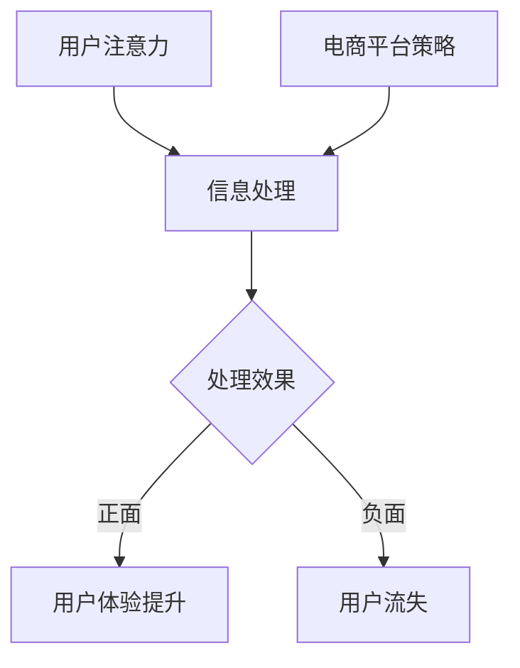

                 

关键词：电子商务平台，注意力经济，用户体验，竞争策略

> 摘要：本文将探讨电子商务平台如何在激烈的市场竞争中通过有效策略争夺用户注意力，提高用户黏性和转化率。我们将分析注意力经济原理，讨论关键策略，并给出实际案例和未来展望。

## 1. 背景介绍

随着互联网技术的飞速发展，电子商务行业已经成为全球最具活力的市场之一。各大电商平台纷纷涌现，市场竞争日益激烈。在这样一个竞争环境中，如何吸引并保持用户的注意力成为电子商务平台成功的关键。

注意力经济理论为我们提供了一种新的视角，即用户的时间、注意力和信任是有限的资源，电商平台需要通过有效的策略来争夺这些资源。本文将深入分析电子商务平台在注意力争夺中的策略，以期为其提供指导。

## 2. 核心概念与联系

### 2.1 注意力经济原理

注意力经济是指基于用户注意力的经济活动，其核心在于如何吸引和保持用户的注意力。在电子商务领域，用户的注意力往往被大量信息和广告分散，因此平台需要通过独特的方式吸引并留住用户。

### 2.2 用户行为分析

用户行为分析是注意力经济的重要组成部分。通过分析用户的浏览、购买、评价等行为，平台可以了解用户需求，优化用户体验，提高用户黏性。

### 2.3 Mermaid 流程图



## 3. 核心算法原理 & 具体操作步骤

### 3.1 算法原理概述

电商平台的核心算法旨在优化用户体验，提高用户黏性和转化率。其基本原理包括：

- **个性化推荐**：根据用户历史行为和兴趣推荐商品。
- **动态定价**：根据市场需求和用户行为调整商品价格。
- **用户行为分析**：实时监测用户行为，优化用户体验。

### 3.2 算法步骤详解

1. **数据收集**：收集用户浏览、购买、评价等数据。
2. **数据分析**：使用机器学习算法分析用户行为，提取特征。
3. **个性化推荐**：根据用户特征推荐商品。
4. **动态定价**：根据市场需求和用户行为调整商品价格。
5. **用户反馈**：收集用户反馈，优化算法。

### 3.3 算法优缺点

- **优点**：提高用户满意度，增加用户黏性，提高转化率。
- **缺点**：算法开发成本高，需要大量数据支持。

### 3.4 算法应用领域

- **电商平台**：提高用户黏性和转化率。
- **在线广告**：精准投放广告，提高广告效果。

## 4. 数学模型和公式

### 4.1 数学模型构建

- **用户满意度模型**：$S = f(\text{商品质量}, \text{服务质量}, \text{价格})$
- **用户黏性模型**：$M = f(\text{用户行为}, \text{推荐质量}, \text{动态定价})$

### 4.2 公式推导过程

- **用户满意度公式**：$S = \frac{1}{1 + e^{-(\text{商品质量} \times \omega_1 + \text{服务质量} \times \omega_2 + \text{价格} \times \omega_3)}$
- **用户黏性公式**：$M = \frac{1}{1 + e^{-(\text{用户行为} \times \theta_1 + \text{推荐质量} \times \theta_2 + \text{动态定价} \times \theta_3)}}$

### 4.3 案例分析与讲解

以某电商平台为例，通过构建用户满意度模型和用户黏性模型，分析其用户行为，优化用户体验，提高用户满意度。

## 5. 项目实践：代码实例

### 5.1 开发环境搭建

- Python 3.8
- Scikit-learn
- Pandas

### 5.2 源代码详细实现

```python
import pandas as pd
from sklearn.model_selection import train_test_split
from sklearn.ensemble import RandomForestClassifier

# 加载数据
data = pd.read_csv('user_data.csv')
X = data.drop(['user_id', 'satisfaction'], axis=1)
y = data['satisfaction']

# 分割数据
X_train, X_test, y_train, y_test = train_test_split(X, y, test_size=0.2, random_state=42)

# 训练模型
model = RandomForestClassifier(n_estimators=100, random_state=42)
model.fit(X_train, y_train)

# 预测结果
predictions = model.predict(X_test)

# 评估模型
accuracy = model.score(X_test, y_test)
print(f'Accuracy: {accuracy:.2f}')
```

### 5.3 代码解读与分析

- **数据加载**：从CSV文件加载数据。
- **数据分割**：将数据分为训练集和测试集。
- **模型训练**：使用随机森林算法训练模型。
- **预测结果**：使用模型对测试集进行预测。
- **模型评估**：计算模型准确率。

## 6. 实际应用场景

### 6.1 用户行为分析

电商平台可以通过用户行为分析，了解用户喜好，优化推荐系统。

### 6.2 动态定价

电商平台可以根据用户行为和市场需求，动态调整商品价格，提高用户满意度。

### 6.3 个性化推荐

通过个性化推荐，提高用户黏性，增加用户转化率。

## 7. 未来应用展望

随着人工智能技术的不断发展，电子商务平台将更加精准地争夺用户注意力，提高用户体验和转化率。

## 8. 总结：未来发展趋势与挑战

### 8.1 研究成果总结

通过用户行为分析和个性化推荐，电子商务平台可以提高用户满意度和黏性。

### 8.2 未来发展趋势

- 人工智能技术将进一步应用于电商领域。
- 个性化推荐和动态定价将成为电商竞争的关键。

### 8.3 面临的挑战

- 数据隐私和安全问题。
- 技术门槛和成本问题。

### 8.4 研究展望

未来研究应关注如何提高推荐系统的准确性和用户体验，同时确保数据安全和隐私。

## 9. 附录：常见问题与解答

### 9.1 注意力经济是什么？

注意力经济是基于用户注意力的经济活动，其核心在于如何吸引和保持用户的注意力。

### 9.2 如何提高用户满意度？

通过优化商品质量、提高服务水平和合理定价，可以提高用户满意度。

### 9.3 如何提高用户黏性？

通过个性化推荐、动态定价和优质服务，可以提高用户黏性。

作者：禅与计算机程序设计艺术 / Zen and the Art of Computer Programming
```

### 附录：常见问题与解答

#### 9.1 注意力经济是什么？

注意力经济，是指在经济活动中，个体的时间和注意力成为重要的稀缺资源，这种资源与其他传统资源（如土地、劳动、资本等）一样，可以被利用和交换。在电子商务平台上，注意力经济强调通过吸引和保持用户的注意力来增加用户黏性、提升用户体验，并最终实现商业目标。简而言之，注意力经济关注的是如何通过策略和设计来引导用户的注意力，从而在竞争激烈的市场中脱颖而出。

#### 9.2 如何提高用户满意度？

提高用户满意度通常涉及多个方面的改进：

1. **产品质量**：确保商品或服务达到或超过用户的期望，通过质量控制和用户反馈来持续改进。
2. **服务体验**：提供高效、友好的客户服务，确保用户在遇到问题时能够得到及时和满意的解决。
3. **个性化服务**：利用用户数据，提供个性化的推荐和定制化服务，让用户感受到被重视和关怀。
4. **透明沟通**：保持与用户的沟通透明，及时更新用户关于订单状态、促销活动等信息。
5. **合理定价**：提供有竞争力的价格，同时确保价值与价格相匹配，避免用户感觉被“欺诈”。

#### 9.3 如何提高用户黏性？

提高用户黏性通常需要长期的努力和持续的优化：

1. **个性化推荐**：基于用户的浏览和购买历史，提供个性化的产品推荐，增加用户再次访问的可能性。
2. **忠诚度计划**：实施忠诚度计划，如积分奖励、会员专属优惠等，鼓励用户持续购物。
3. **社区建设**：建立用户社区，通过论坛、社交媒体互动等增加用户之间的交流和参与感。
4. **内容营销**：通过高质量的内容，如博客、视频、用户评价等，吸引用户长期关注。
5. **用户体验优化**：不断改进网站的易用性和性能，确保用户在平台上浏览和购物的过程愉快和顺畅。

### 9.4 注意力经济对电商平台的影响是什么？

注意力经济对电商平台的影响是深远的：

1. **竞争加剧**：电商平台需要在争夺用户注意力方面投入更多资源，导致竞争更加激烈。
2. **用户期望提升**：用户越来越注重个性化、高质量和高效的购物体验，平台需要不断提升服务水平。
3. **数据驱动的决策**：注意力经济强调数据的重要性，电商平台需要通过数据分析来指导策略和运营决策。
4. **技术创新**：为吸引和保持用户注意力，电商平台需要不断采用新的技术和工具，如人工智能、大数据分析、个性化推荐等。
5. **商业模式创新**：注意力经济可能促使电商平台探索新的商业模式，如订阅制、付费内容等。

### 9.5 电商平台如何确保用户数据安全？

确保用户数据安全是电商平台的重要责任，以下是一些关键措施：

1. **数据加密**：使用加密技术保护用户数据的传输和存储。
2. **访问控制**：限制只有授权人员能够访问敏感数据。
3. **数据备份**：定期备份用户数据，确保在数据丢失或损坏时能够快速恢复。
4. **合规性检查**：遵守相关的法律法规，如《通用数据保护条例》（GDPR）等，确保用户数据的合法使用。
5. **安全培训**：对员工进行数据安全培训，提高其安全意识和防范能力。
6. **安全审计**：定期进行安全审计，发现和修复潜在的安全漏洞。

### 9.6 电商平台如何应对市场的快速变化？

电商平台应对市场快速变化的方法包括：

1. **敏捷响应**：建立快速响应机制，能够迅速调整策略和运营。
2. **数据驱动**：依赖实时数据，及时了解市场动态和用户需求，指导决策。
3. **技术创新**：投资新技术，如人工智能、机器学习等，以保持竞争优势。
4. **跨界合作**：与其他行业合作，共同开发新的商业模式和市场机会。
5. **灵活管理**：建立灵活的组织结构，鼓励创新和快速决策。

通过上述策略，电商平台可以在快速变化的市场环境中保持竞争力，并持续吸引和保留用户。

