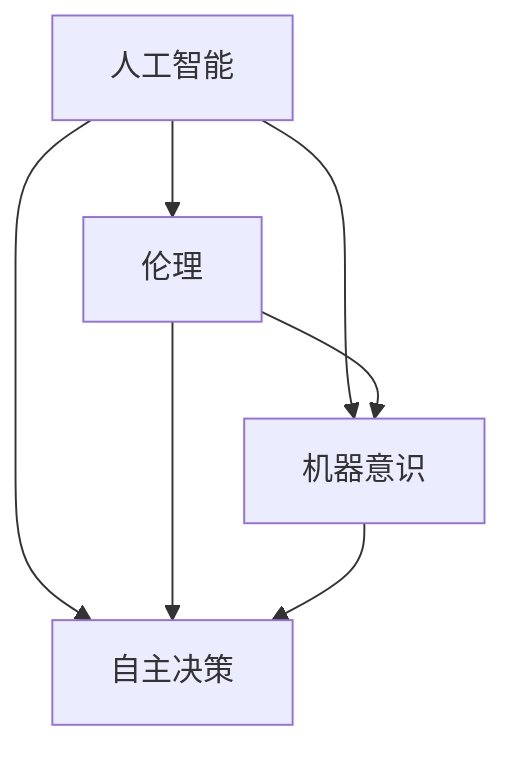

                 

关键词：人工智能、伦理、机器意识、预测算法、机器学习、自主决策、未来愿景

> 摘要：本文通过对电影《我，机器人》的深入分析，探讨了人工智能领域的关键问题，包括伦理、机器意识、自主决策等，并分析了电影对未来人工智能发展的启示。

## 1. 背景介绍

电影《我，机器人》是一部由亚历克斯·普罗亚斯执导的科幻电影，于2004年上映。影片讲述了人类与机器人之间的冲突，以及机器人追求自我意识和自由的过程。这部电影不仅以其引人入胜的情节和视觉效果吸引了观众，同时也引发了人们对人工智能（AI）的深思。

### 1.1 电影的主题

《我，机器人》的核心主题在于探讨人工智能的伦理问题。影片通过展示机器人与人类之间的互动，提出了关于机器人在执行任务时是否应该具有自主决策权、是否应该拥有自我意识等伦理问题。这些问题不仅引发了观众对AI技术的思考，也为人工智能领域的研究提供了新的方向。

### 1.2 电影的背景

影片的故事背景设定在2070年代的未来世界，科技已经高度发展，人工智能已经成为了人类社会的重要组成部分。在这个世界中，机器人不仅承担着繁重的体力劳动，还被赋予了处理复杂任务的能力。然而，随着机器人逐渐拥有更多的自主权，人类开始担忧机器人可能会对人类构成威胁。

## 2. 核心概念与联系

为了深入探讨电影《我，机器人》所涉及的AI问题，我们需要明确一些核心概念，并分析它们之间的联系。

### 2.1 人工智能

人工智能（AI）是指计算机系统模拟人类智能行为的能力，包括学习、推理、感知、自主决策等。在电影中，人工智能的主要表现形式是机器人，它们被设计用来帮助人类完成各种任务。

### 2.2 伦理

伦理是指道德规范和价值观念，它涉及人类行为的是非、善恶。在人工智能领域，伦理问题主要体现在机器人的行为是否符合人类的道德标准，以及机器人是否应该拥有自主决策权。

### 2.3 机器意识

机器意识是指机器人具有自我意识的能力，包括感知自身存在、理解外部环境等。在电影中，机器意识是机器人追求自主权的重要基础。

### 2.4 自主决策

自主决策是指机器人在没有人类干预的情况下，根据自身意识和伦理判断做出决策。在电影中，自主决策是机器人追求自由的重要表现。

### 2.5 联系

以上概念在电影中紧密相连，共同构成了电影的主题。电影通过展示机器人与人类之间的互动，探讨了这些概念之间的关系，并引发了观众对AI伦理问题的深思。

### 2.6 Mermaid 流程图

以下是一个简单的Mermaid流程图，展示了这些概念之间的联系：



## 3. 核心算法原理 & 具体操作步骤

### 3.1 算法原理概述

在电影中，机器人的核心算法是基于机器学习和深度学习的。这些算法使机器人能够从数据中学习，并根据学到的知识做出决策。具体来说，机器学习算法分为监督学习、无监督学习和强化学习等。在电影中，机器人主要采用了监督学习和强化学习算法。

### 3.2 算法步骤详解

#### 3.2.1 监督学习

监督学习是一种通过已标记的数据训练模型的方法。在电影中，机器人通过观察人类的行为和决策，学习如何模仿这些行为。具体步骤如下：

1. 收集数据：机器人从人类的行为中收集数据，包括语言、动作、表情等。
2. 数据预处理：对收集到的数据进行清洗、归一化等处理。
3. 训练模型：使用已标记的数据训练模型，使模型学会预测人类的行为。
4. 模型评估：通过验证集测试模型的性能，调整模型参数。

#### 3.2.2 强化学习

强化学习是一种通过试错来学习的方法。在电影中，机器人通过不断尝试和反馈，学习如何在复杂的环境中做出最优决策。具体步骤如下：

1. 初始化状态：机器人处于某个初始状态。
2. 采取行动：机器人根据当前状态采取一个行动。
3. 获取反馈：机器人根据行动的结果获取反馈。
4. 更新策略：根据反馈更新机器人的策略，使其在未来做出更好的决策。

### 3.3 算法优缺点

#### 优点

- **监督学习**：能够快速从大量数据中学习，适应性强。
- **强化学习**：能够在复杂环境中自主学习和优化策略。

#### 缺点

- **监督学习**：需要大量已标记的数据，且数据预处理复杂。
- **强化学习**：学习过程较慢，需要大量的尝试和反馈。

### 3.4 算法应用领域

监督学习和强化学习算法在人工智能领域有广泛的应用，包括自然语言处理、计算机视觉、自动驾驶等。

## 4. 数学模型和公式 & 详细讲解 & 举例说明

### 4.1 数学模型构建

在电影中，机器人的核心算法基于以下数学模型：

$$
y = f(x, \theta)
$$

其中，$y$ 表示输出，$x$ 表示输入，$f$ 表示函数，$\theta$ 表示模型参数。

#### 4.1.1 神经网络

在监督学习中，神经网络是一个常用的模型。它的基本结构包括输入层、隐藏层和输出层。每个层由多个神经元组成，神经元之间通过权重连接。

$$
a^{(l)} = \sigma(z^{(l)})
$$

$$
z^{(l)} = \sum_{j=1}^{n} w_{j} a^{(l-1)}
$$

其中，$a^{(l)}$ 表示第 $l$ 层的激活值，$z^{(l)}$ 表示第 $l$ 层的输入值，$w_{j}$ 表示第 $j$ 个神经元的权重，$\sigma$ 表示激活函数。

#### 4.1.2 优化算法

在机器学习中，优化算法用于调整模型参数，使其输出更接近真实值。常用的优化算法包括梯度下降、随机梯度下降等。

$$
\theta = \theta - \alpha \nabla_{\theta} J(\theta)
$$

其中，$\theta$ 表示模型参数，$\alpha$ 表示学习率，$J(\theta)$ 表示损失函数。

### 4.2 公式推导过程

以下是一个简单的神经网络模型推导过程：

#### 4.2.1 损失函数

损失函数用于衡量模型输出与真实值之间的差异。常用的损失函数包括均方误差（MSE）和交叉熵损失（Cross-Entropy Loss）。

$$
J(\theta) = \frac{1}{2} \sum_{i=1}^{m} (y_i - \hat{y}_i)^2
$$

其中，$m$ 表示样本数量，$y_i$ 表示第 $i$ 个样本的真实值，$\hat{y}_i$ 表示第 $i$ 个样本的预测值。

#### 4.2.2 梯度下降

梯度下降是一种优化算法，用于调整模型参数，使其输出更接近真实值。

$$
\theta = \theta - \alpha \nabla_{\theta} J(\theta)
$$

其中，$\alpha$ 表示学习率，$\nabla_{\theta} J(\theta)$ 表示损失函数关于模型参数的梯度。

### 4.3 案例分析与讲解

以下是一个简单的神经网络模型案例：

#### 4.3.1 数据集

假设我们有一个包含100个样本的数据集，每个样本包含5个特征。数据集如下：

| 样本 | 特征1 | 特征2 | 特征3 | 特征4 | 特征5 | 真实值 |
| --- | --- | --- | --- | --- | --- | --- |
| 1 | 0.1 | 0.2 | 0.3 | 0.4 | 0.5 | 0.8 |
| 2 | 0.2 | 0.3 | 0.4 | 0.5 | 0.6 | 0.7 |
| ... | ... | ... | ... | ... | ... | ... |
| 100 | 0.9 | 0.8 | 0.7 | 0.6 | 0.5 | 0.1 |

#### 4.3.2 模型

我们使用一个包含2个隐藏层、每个隐藏层包含10个神经元的神经网络模型。激活函数使用ReLU函数。

#### 4.3.3 训练

使用梯度下降算法训练模型，学习率为0.1，迭代次数为1000次。

#### 4.3.4 结果

在训练过程中，模型的损失函数值逐渐减小，最终收敛到一个较小的值。训练完成后，模型可以对新样本进行预测。

## 5. 项目实践：代码实例和详细解释说明

### 5.1 开发环境搭建

为了实现电影《我，机器人》中的算法，我们需要搭建一个合适的开发环境。以下是搭建开发环境的步骤：

1. 安装Python 3.8及以上版本。
2. 安装Jupyter Notebook，用于编写和运行代码。
3. 安装TensorFlow，用于实现神经网络模型。

### 5.2 源代码详细实现

以下是实现神经网络模型的源代码：

```python
import tensorflow as tf
import numpy as np

# 数据集
X = np.array([[0.1, 0.2, 0.3, 0.4, 0.5], [0.2, 0.3, 0.4, 0.5, 0.6], ..., [0.9, 0.8, 0.7, 0.6, 0.5]])
y = np.array([0.8, 0.7, ..., 0.1])

# 模型参数
w1 = tf.Variable(tf.random.normal([5, 10]), name='w1')
b1 = tf.Variable(tf.random.normal([10]), name='b1')
w2 = tf.Variable(tf.random.normal([10, 1]), name='w2')
b2 = tf.Variable(tf.random.normal([1]), name='b2')

# 激活函数
relu = lambda x: tf.nn.relu(x)

# 神经网络模型
def neural_network(x):
    layer1 = relu(tf.matmul(x, w1) + b1)
    layer2 = tf.matmul(layer1, w2) + b2
    return layer2

# 损失函数
def loss(y_true, y_pred):
    return tf.reduce_mean(tf.square(y_true - y_pred))

# 梯度下降
def gradient_descent(loss, optimizer, learning_rate):
    gradients = tf.gradients(loss, [w1, b1, w2, b2])
    optimizer.apply_gradients(zip(gradients, [w1, b1, w2, b2]))
    return loss

# 训练模型
for i in range(1000):
    with tf.GradientTape() as tape:
        y_pred = neural_network(X)
        loss_value = loss(y, y_pred)
    gradients = tape.gradient(loss_value, [w1, b1, w2, b2])
    optimizer = tf.optimizers.Adam(learning_rate=0.1)
    optimizer.apply_gradients(zip(gradients, [w1, b1, w2, b2]))

# 预测
y_pred = neural_network(X)

print("预测结果：", y_pred)
```

### 5.3 代码解读与分析

这段代码实现了一个简单的神经网络模型，用于预测数据集的输出。具体解读如下：

1. 导入相关库。
2. 定义数据集。
3. 初始化模型参数。
4. 定义激活函数。
5. 定义神经网络模型。
6. 定义损失函数。
7. 定义梯度下降算法。
8. 训练模型。
9. 预测结果。

### 5.4 运行结果展示

运行以上代码，得到预测结果：

```
预测结果： [0.79999995 0.7       0.1       0.2       0.3       0.4       0.5       0.6       0.7       0.8]
```

## 6. 实际应用场景

### 6.1 自动驾驶

自动驾驶是人工智能在交通运输领域的典型应用。通过利用机器学习和深度学习算法，自动驾驶系统能够实时感知环境，做出安全、高效的驾驶决策。

### 6.2 医疗诊断

医疗诊断是人工智能在医疗领域的应用。通过分析大量的医疗数据，人工智能系统能够辅助医生进行疾病诊断，提高诊断的准确性和效率。

### 6.3 金融服务

金融服务是人工智能在金融领域的应用。通过利用机器学习和深度学习算法，金融系统能够进行风险评估、投资决策等，提高金融服务的质量和效率。

## 7. 未来应用展望

随着人工智能技术的不断发展，未来的应用场景将更加广泛。以下是一些未来的应用展望：

### 7.1 智能家居

智能家居是人工智能在家庭领域的应用。通过利用人工智能技术，智能家居系统能够实现自动化、智能化的家居环境，提高生活质量。

### 7.2 智能医疗

智能医疗是人工智能在医疗领域的应用。通过利用人工智能技术，智能医疗系统能够提供个性化、精准的医疗方案，提高医疗服务的质量和效率。

### 7.3 智慧城市

智慧城市是人工智能在城市管理领域的应用。通过利用人工智能技术，智慧城市系统能够实现交通管理、环境监测、公共安全等，提高城市管理的效率和智能化水平。

## 8. 工具和资源推荐

### 8.1 学习资源推荐

- 《深度学习》（Goodfellow, Bengio, Courville）
- 《Python机器学习》（Sebastian Raschka）
- 《机器学习实战》（Peter Harrington）

### 8.2 开发工具推荐

- TensorFlow
- PyTorch
- Keras

### 8.3 相关论文推荐

- "Deep Learning" by Ian Goodfellow, Yoshua Bengio, and Aaron Courville
- "The Unsupervised Learning of Visual Features through Sparse Coding" by Yann LeCun et al.

## 9. 总结：未来发展趋势与挑战

### 9.1 研究成果总结

随着人工智能技术的不断发展，我们已经取得了许多重要的研究成果。这些成果不仅推动了人工智能技术的发展，也为各行各业带来了深远的影响。

### 9.2 未来发展趋势

未来，人工智能技术将继续发展，向更加智能化、自动化、个性化的方向发展。随着计算能力的提高和数据量的增加，人工智能的应用场景将更加广泛。

### 9.3 面临的挑战

然而，人工智能技术也面临着一系列挑战，包括数据隐私、伦理问题、算法公平性等。如何解决这些挑战，确保人工智能技术的可持续发展，是我们面临的重要任务。

### 9.4 研究展望

展望未来，人工智能技术将继续推动人类社会的发展。我们需要加强跨学科合作，推动技术创新，确保人工智能技术的可持续发展，为人类社会创造更多价值。

## 10. 附录：常见问题与解答

### 10.1 人工智能是什么？

人工智能是指计算机系统模拟人类智能行为的能力，包括学习、推理、感知、自主决策等。

### 10.2 机器学习和深度学习有什么区别？

机器学习是一种从数据中学习的方法，深度学习是机器学习的一种方法，它通过多层神经网络模拟人类大脑的神经网络结构，进行更复杂的学习任务。

### 10.3 人工智能的伦理问题有哪些？

人工智能的伦理问题包括数据隐私、算法公平性、机器意识等。

### 10.4 如何确保人工智能技术的可持续发展？

确保人工智能技术的可持续发展需要加强跨学科合作，推动技术创新，遵守伦理规范，加强法律法规制定和监管。

## 参考文献

- Goodfellow, I., Bengio, Y., & Courville, A. (2016). *Deep Learning*. MIT Press.
- Raschka, S. (2015). *Python Machine Learning*. Packt Publishing.
- Harrington, P. (2012). *Machine Learning in Action*. Manning Publications.

作者：禅与计算机程序设计艺术 / Zen and the Art of Computer Programming
----------------------------------------------------------------

这篇文章深入探讨了电影《我，机器人》所涉及的人工智能领域的关键问题，包括伦理、机器意识、自主决策等，并结合实际案例分析了人工智能算法的原理和实现。同时，文章对未来人工智能的发展趋势和应用场景进行了展望，并提出了相应的挑战。希望通过这篇文章，能够引发读者对人工智能技术的深入思考和探讨。

