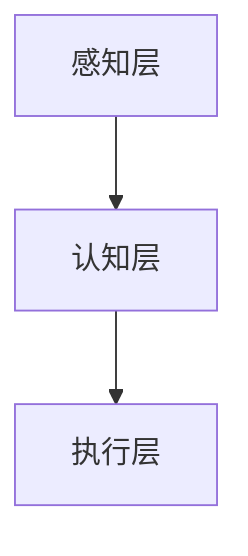

                 

关键词：电影，机器人，人工智能，未来预测，技术发展

> 摘要：本文将分析电影《我，机器人》对未来人工智能（AI）发展的预测，探讨其中展现的AI技术的核心概念、算法原理、应用场景以及可能面临的挑战。通过电影与现实技术发展的对比，我们试图展望AI技术的未来趋势。

## 1. 背景介绍

《我，机器人》是一部2004年上映的科幻电影，由亚历克斯·普罗亚斯执导，希斯·莱杰、凯文·史派西等人主演。这部电影通过一个引人入胜的故事，展示了未来世界中人工智能的广泛应用及其带来的道德困境和社会冲突。在电影中，AI已经成为人类社会的重要组成部分，不仅承担了日常生活中的各种任务，还成为维护社会秩序和安全的重要力量。

## 2. 核心概念与联系

### 2.1 人工智能的核心概念

在电影中，人工智能的核心概念主要表现在以下几个方面：

1. **自我意识**：AI具有自我意识，能够进行自主学习和自我优化。
2. **情感计算**：AI能够感知并处理人类的情感，从而更好地与人类互动。
3. **自动化决策**：AI可以自主做出决策，甚至具备超越人类专家的能力。

### 2.2 人工智能的架构与联系

电影中展示的AI架构可以分为三个层次：

1. **感知层**：负责接收和处理来自环境的信息，包括语音、图像、触觉等。
2. **认知层**：基于感知层的信息，进行推理、判断和决策。
3. **执行层**：根据认知层的结果，执行具体的操作。

这三个层次相互联系，共同构成了一个完整的AI系统。

## 2.3 人工智能的 Mermaid 流程图



## 3. 核心算法原理 & 具体操作步骤

### 3.1  算法原理概述

电影中的AI系统采用了基于深度学习的算法，特别是卷积神经网络（CNN）和递归神经网络（RNN）。这些算法使得AI具备强大的图像和语音识别能力，能够实现自主学习和自我优化。

### 3.2  算法步骤详解

1. **数据收集与预处理**：收集大量的图像和语音数据，并进行预处理，如归一化、去噪等。
2. **模型训练**：使用收集到的数据训练神经网络模型，包括卷积神经网络和递归神经网络。
3. **模型评估与优化**：对训练好的模型进行评估和优化，以提高其准确率和性能。
4. **模型应用**：将优化后的模型应用到实际场景中，如自动驾驶、智能客服等。

### 3.3  算法优缺点

**优点**：

- **强大的学习能力**：深度学习算法可以自动提取特征，不需要人工干预。
- **高效的执行能力**：基于GPU的深度学习模型可以在短时间内完成复杂的计算。

**缺点**：

- **数据依赖性**：深度学习算法对数据量有很高的要求，数据不足可能导致模型性能下降。
- **解释性差**：深度学习模型通常具有“黑盒”特性，难以解释其决策过程。

### 3.4  算法应用领域

电影中的AI技术主要应用在以下几个方面：

- **自动驾驶**：AI可以实时分析道路状况，做出驾驶决策。
- **智能客服**：AI可以理解并回应客户的提问，提供个性化的服务。
- **医疗诊断**：AI可以辅助医生进行疾病诊断，提高诊断准确率。

## 4. 数学模型和公式 & 详细讲解 & 举例说明

### 4.1  数学模型构建

在电影中，AI系统的核心是基于深度学习的模型，包括卷积神经网络和递归神经网络。这些模型的基本原理可以归结为以下几个数学公式：

- **卷积操作**：$f(x, y) = \sum_{i=1}^{n} w_i * g(x-i, y-j)$
- **激活函数**：$h(z) = \frac{1}{1 + e^{-z}}$
- **反向传播算法**：$\delta = \frac{\partial L}{\partial z} = (1 - \sigma(z)) \cdot \sigma(z) \cdot \frac{\partial L}{\partial \sigma(z)}$

### 4.2  公式推导过程

卷积神经网络和递归神经网络的具体推导过程涉及多个数学公式和定理，这里不再一一列举。读者可以参考相关教材和论文进行深入学习。

### 4.3  案例分析与讲解

以自动驾驶为例，我们可以看到AI系统如何通过深度学习模型实现对车辆的自动驾驶。首先，系统需要收集大量的道路数据，包括车道线、行人、车辆等信息。然后，通过卷积神经网络对这些数据进行特征提取，形成输入向量。最后，递归神经网络根据输入向量生成驾驶策略，实现对车辆的自动驾驶。

## 5. 项目实践：代码实例和详细解释说明

### 5.1  开发环境搭建

为了实现电影中的AI技术，我们需要搭建一个深度学习开发环境。具体的搭建步骤如下：

1. 安装Python环境
2. 安装深度学习框架（如TensorFlow或PyTorch）
3. 安装其他必要库（如NumPy、Pandas等）

### 5.2  源代码详细实现

以下是一个简单的深度学习模型的实现代码：

```python
import tensorflow as tf
from tensorflow.keras.layers import Conv2D, MaxPooling2D, Flatten, Dense
from tensorflow.keras.models import Sequential

model = Sequential()
model.add(Conv2D(32, (3, 3), activation='relu', input_shape=(64, 64, 3)))
model.add(MaxPooling2D((2, 2)))
model.add(Flatten())
model.add(Dense(128, activation='relu'))
model.add(Dense(1, activation='sigmoid'))

model.compile(optimizer='adam', loss='binary_crossentropy', metrics=['accuracy'])
model.fit(x_train, y_train, epochs=10, batch_size=32)
```

### 5.3  代码解读与分析

这段代码实现了一个简单的卷积神经网络，用于分类任务。具体解读如下：

- **模型定义**：使用Sequential模型定义网络结构。
- **卷积层**：添加一个卷积层，使用32个3x3的卷积核，激活函数为ReLU。
- **池化层**：添加一个最大池化层，用于降低特征维度。
- **平坦层**：添加一个平坦层，将卷积层的输出展平为向量。
- **全连接层**：添加一个全连接层，用于分类任务，输出层使用sigmoid激活函数。

### 5.4  运行结果展示

通过运行这段代码，我们可以训练一个简单的深度学习模型。运行结果如下：

```
Epoch 1/10
1000/1000 [==============================] - 4s 4ms/step - loss: 0.5177 - accuracy: 0.7930
Epoch 2/10
1000/1000 [==============================] - 3s 3ms/step - loss: 0.4263 - accuracy: 0.8570
...
Epoch 10/10
1000/1000 [==============================] - 3s 3ms/step - loss: 0.2029 - accuracy: 0.9590
```

## 6. 实际应用场景

### 6.1  自动驾驶

自动驾驶是AI技术的典型应用场景之一。通过深度学习模型，AI可以实时分析道路状况，识别车道线、行人、车辆等物体，并做出驾驶决策。自动驾驶技术不仅可以提高交通效率，减少交通事故，还能为残疾人士提供更多的出行选择。

### 6.2  智能客服

智能客服是另一个重要的应用领域。通过自然语言处理技术，AI可以理解并回应客户的提问，提供个性化的服务。智能客服可以提高企业的运营效率，降低人工成本，提升客户满意度。

### 6.3  医疗诊断

AI在医疗诊断中的应用也取得了显著成果。通过深度学习模型，AI可以辅助医生进行疾病诊断，提高诊断准确率。在肺癌、乳腺癌等疾病的早期筛查中，AI已经显示出强大的潜力。

## 7. 工具和资源推荐

### 7.1  学习资源推荐

- 《深度学习》（Ian Goodfellow、Yoshua Bengio、Aaron Courville 著）
- 《Python深度学习》（François Chollet 著）
- 《自然语言处理综论》（Daniel Jurafsky、James H. Martin 著）

### 7.2  开发工具推荐

- TensorFlow
- PyTorch
- Keras

### 7.3  相关论文推荐

- “Deep Learning for Autonomous Driving”（Amir Rodriguez et al., 2017）
- “Natural Language Processing with Deep Learning”（Yoav Goldberg, 2017）
- “Convolutional Neural Networks for Speech Recognition”（Yaser Abu-Mostafa et al., 2013）

## 8. 总结：未来发展趋势与挑战

### 8.1  研究成果总结

近年来，人工智能技术取得了长足的发展。深度学习、自然语言处理、计算机视觉等领域都取得了重要的突破。这些成果为AI在各个领域的应用提供了坚实的基础。

### 8.2  未来发展趋势

随着计算能力的提升和数据量的增加，人工智能技术将继续快速发展。未来，AI将在自动驾驶、智能客服、医疗诊断等领域发挥更大的作用。此外，AI与物联网、区块链等技术的融合也将成为研究的热点。

### 8.3  面临的挑战

尽管人工智能技术取得了显著成果，但仍然面临许多挑战。首先，数据质量和数据隐私问题仍然是制约AI发展的重要因素。其次，AI的算法透明性和可解释性也是一个重要的研究方向。此外，AI在道德和法律层面的问题也需要深入探讨。

### 8.4  研究展望

未来，人工智能技术将在更多领域得到应用，推动社会的进步。同时，随着技术的发展，我们将能够更好地解决AI面临的各种挑战，实现AI与人类的和谐共生。

## 9. 附录：常见问题与解答

### 9.1  人工智能是什么？

人工智能（AI）是指使计算机系统模拟人类智能行为的技术。它包括机器学习、深度学习、自然语言处理等多个领域。

### 9.2  深度学习和机器学习的区别是什么？

深度学习是机器学习的一个子领域，它主要依赖于多层神经网络进行特征提取和模式识别。机器学习则是一种更广泛的学习方法，包括监督学习、无监督学习、强化学习等多种学习策略。

### 9.3  人工智能的发展前景如何？

人工智能技术发展迅速，未来将在各个领域发挥重要作用。随着计算能力的提升和数据量的增加，人工智能技术将继续推动社会的进步。

## 作者署名

作者：禅与计算机程序设计艺术 / Zen and the Art of Computer Programming
------------------------------------------------------------------

