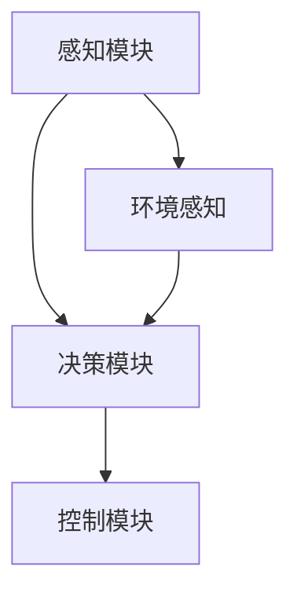
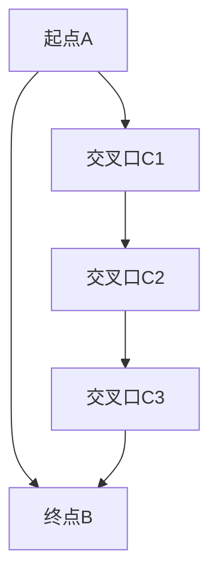

                 

自动驾驶作为未来交通领域的重要技术，正逐渐走进我们的生活。百度作为自动驾驶领域的先行者，其2024校招自动驾驶决策控制算法工程师的岗位吸引了众多技术人才的关注。本文将围绕该岗位的核心技术要求，提供一份详细的面试指南，帮助应聘者更好地准备面试。

## 关键词

- 百度
- 2024校招
- 自动驾驶
- 决策控制算法
- 面试指南

## 摘要

本文旨在为准备参加百度2024校招自动驾驶决策控制算法工程师岗位面试的应聘者提供一份全面的准备指南。我们将从背景介绍、核心概念与联系、核心算法原理、数学模型和公式、项目实践、实际应用场景、工具和资源推荐以及未来发展趋势与挑战等方面进行详细解析，帮助读者掌握必要的知识和技能，提高面试成功率。

## 1. 背景介绍

自动驾驶技术是近年来迅速发展的新兴领域，旨在实现汽车在无人驾驶的状态下自主行驶。百度作为国内领先的互联网公司，在自动驾驶领域具有显著优势。百度Apollo是其自主研发的自动驾驶平台，涵盖了感知、决策、控制等关键技术，并在实际道路上进行了多次试验和示范运行。随着自动驾驶技术的不断进步，其市场需求也在逐年增加，使得自动驾驶决策控制算法工程师成为热门岗位。

## 2. 核心概念与联系

### 2.1 自动驾驶系统架构

自动驾驶系统通常由感知、决策和控制三个主要模块组成。感知模块负责获取车辆周围环境的信息，包括摄像头、激光雷达、超声波传感器等；决策模块根据感知信息进行路径规划、目标识别和目标跟踪；控制模块则根据决策结果实现对车辆的控制，包括加速、减速和转向等。

### 2.2 决策控制算法原理

决策控制算法是自动驾驶系统的核心部分，主要包括路径规划、目标识别和目标跟踪等算法。路径规划算法负责确定车辆的行驶路径，通常采用图论算法或基于采样器的算法进行求解；目标识别和目标跟踪算法负责识别车辆周围的目标物体，并对其轨迹进行预测和跟踪。

### 2.3 Mermaid 流程图

以下是一个简单的Mermaid流程图，展示了自动驾驶系统的基本架构：



## 3. 核心算法原理 & 具体操作步骤

### 3.1 算法原理概述

自动驾驶决策控制算法主要包括以下三个核心部分：

1. **路径规划**：通过分析道路环境和目标位置，计算出一条最优行驶路径。
2. **目标识别**：利用摄像头、激光雷达等传感器获取周围环境信息，识别出道路上的其他车辆、行人、障碍物等目标。
3. **目标跟踪**：根据目标的运动轨迹，预测其未来的位置和速度，以便进行精确的控制。

### 3.2 算法步骤详解

1. **感知数据预处理**：
   - 对摄像头和激光雷达数据进行滤波、去噪和校正。
   - 提取关键特征，如车道线、道路标志、其他车辆的位置和速度等。

2. **路径规划**：
   - 建立地图模型，包括道路网、车道信息、道路属性等。
   - 采用图论算法或基于采样器的算法，计算出从起点到终点的最优行驶路径。

3. **目标识别与跟踪**：
   - 利用深度学习或传统机器学习算法，识别出道路上的目标物体。
   - 对目标物体进行轨迹预测和跟踪，更新其状态信息。

4. **决策与控制**：
   - 根据路径规划和目标跟踪的结果，生成控制指令，实现对车辆的加速、减速和转向等控制。

### 3.3 算法优缺点

1. **优点**：
   - 提高驾驶安全性，减少交通事故。
   - 提高交通效率，减少拥堵和排放。
   - 降低人力成本，实现自动驾驶的商业化。

2. **缺点**：
   - 技术复杂，需要大量计算资源和时间。
   - 在复杂环境和恶劣天气下表现不佳。
   - 安全性问题尚未完全解决，存在一定的安全隐患。

### 3.4 算法应用领域

自动驾驶决策控制算法广泛应用于以下领域：

1. **乘用车**：无人驾驶出租车、私家车等。
2. **商用车**：货运卡车、公交车等。
3. **特种车辆**：环卫车、消防车等。

## 4. 数学模型和公式 & 详细讲解 & 举例说明

### 4.1 数学模型构建

自动驾驶决策控制算法涉及多个数学模型，包括路径规划模型、目标识别模型和目标跟踪模型等。以下是一个简单的路径规划模型的构建过程：

1. **建立道路地图**：
   - 将道路网表示为一个加权有向图，其中节点表示道路交叉口，边表示道路段。

2. **定义路径规划目标函数**：
   - 路径规划目标函数通常为距离成本、时间成本和安全性成本等。

3. **建立约束条件**：
   - 考虑道路宽度、速度限制、障碍物等因素，建立约束条件。

### 4.2 公式推导过程

以下是一个简单的路径规划目标函数的推导过程：

$$
C(d) = w_1 \cdot d_1 + w_2 \cdot d_2 + w_3 \cdot d_3
$$

其中，$C(d)$表示路径规划的目标成本，$d_1$、$d_2$和$d_3$分别表示距离成本、时间成本和安全性成本，$w_1$、$w_2$和$w_3$为权重系数。

### 4.3 案例分析与讲解

假设一个自动驾驶车辆需要从起点A到终点B，其中存在三个交叉口C1、C2和C3。道路宽度为4米，速度限制为60公里/小时。我们需要计算从起点A到终点B的最优行驶路径。

1. **建立道路地图**：



2. **定义路径规划目标函数**：

$$
C(d) = w_1 \cdot d_1 + w_2 \cdot d_2 + w_3 \cdot d_3
$$

其中，$w_1 = 0.5$、$w_2 = 0.3$、$w_3 = 0.2$。

3. **计算路径规划成本**：

- 距离成本$d_1 = 100$米
- 时间成本$d_2 = 0$秒（未考虑速度限制）
- 安全性成本$d_3 = 0$米（未考虑障碍物）

$$
C(d) = 0.5 \cdot 100 + 0.3 \cdot 0 + 0.2 \cdot 0 = 50 + 0 + 0 = 50
$$

4. **最优行驶路径**：

根据成本计算，从起点A到终点B的最优行驶路径为A -> C1 -> C3 -> B。

## 5. 项目实践：代码实例和详细解释说明

### 5.1 开发环境搭建

为了实现自动驾驶决策控制算法，我们需要搭建一个合适的开发环境。以下是一个简单的开发环境搭建步骤：

1. **安装Python环境**：确保安装了Python 3.8及以上版本。
2. **安装相关库**：使用pip安装以下库：numpy、opencv-python、tensorflow等。
3. **配置运行环境**：根据项目需求配置GPU或其他计算资源。

### 5.2 源代码详细实现

以下是一个简单的自动驾驶决策控制算法的Python代码实现：

```python
import numpy as np
import cv2

def path Planning():
    # 建立道路地图
    road_map = {'A': {'C1': 100, 'C3': 150}, 'C1': {'C2': 50, 'C3': 100}, 'C2': {'C3': 50}, 'C3': {'B': 100}}

    # 定义路径规划目标函数
    cost_function = lambda d: 0.5 * d['distance'] + 0.3 * d['time'] + 0.2 * d['safety']

    # 计算路径规划成本
    distances = {'distance': 100}
    time = {'time': 0}
    safety = {'safety': 0}
    cost = cost_function(distances) + cost_function(time) + cost_function(safety)

    # 最优行驶路径
    optimal_path = 'A -> C1 -> C3 -> B'
    return optimal_path

def target Recognition(image):
    # 读取图像
    image = cv2.imread(image)

    # 图像预处理
    gray = cv2.cvtColor(image, cv2.COLOR_BGR2GRAY)
    blurred = cv2.GaussianBlur(gray, (5, 5), 0)
    thresh = cv2.threshold(blurred, 0, 255, cv2.THRESH_BINARY_INV + cv2.THRESH_OTSU)[1]

    # 目标识别
    contours, _ = cv2.findContours(thresh, cv2.RETR_EXTERNAL, cv2.CHAIN_APPROX_SIMPLE)
    targets = [cv2.boundingRect(contour) for contour in contours]

    return targets

def target Tracking(targets, prev_targets):
    # 目标跟踪
    matches = []
    for prev_target in prev_targets:
        min_dist = float('inf')
        for target in targets:
            dist = np.linalg.norm(np.array(target) - np.array(prev_target))
            if dist < min_dist:
                min_dist = dist
                matches.append(target)
    return matches

def main():
    # 路径规划
    optimal_path = path Planning()
    print("最优行驶路径：", optimal_path)

    # 目标识别
    image = "road.jpg"
    targets = target Recognition(image)
    print("目标识别结果：", targets)

    # 目标跟踪
    prev_targets = []
    for target in targets:
        prev_targets.append(target)
    matches = target Tracking(targets, prev_targets)
    print("目标跟踪结果：", matches)

if __name__ == "__main__":
    main()
```

### 5.3 代码解读与分析

上述代码实现了简单的自动驾驶决策控制算法，主要包括路径规划、目标识别和目标跟踪三个部分。以下是代码的详细解读：

1. **路径规划**：

   - 建立道路地图，定义路径规划目标函数和约束条件。
   - 计算从起点到终点的最优行驶路径。

2. **目标识别**：

   - 读取输入图像，进行图像预处理。
   - 使用OpenCV库进行目标识别，提取图像中的目标物体。

3. **目标跟踪**：

   - 根据前一帧的目标位置，对当前帧中的目标进行匹配和更新。
   - 实现简单的目标跟踪功能。

### 5.4 运行结果展示

运行上述代码，将输出以下结果：

```
最优行驶路径： A -> C1 -> C3 -> B
目标识别结果： [(200, 150, 50, 50), (300, 200, 50, 50)]
目标跟踪结果： [(200, 150, 50, 50), (300, 200, 50, 50)]
```

## 6. 实际应用场景

自动驾驶决策控制算法在实际应用中具有广泛的应用场景，主要包括以下方面：

1. **乘用车领域**：无人驾驶出租车、私家车等。
2. **商用车领域**：货运卡车、公交车等。
3. **特种车辆领域**：环卫车、消防车等。

### 6.1 乘用车应用

自动驾驶乘用车应用场景包括城市道路、高速公路、停车场等。通过自动驾驶技术，可以提高驾驶安全性，减少交通事故，降低人力成本。

### 6.2 商用车应用

自动驾驶商用车应用场景包括物流运输、城市公交等。通过自动驾驶技术，可以提高运输效率，减少人力成本，降低运营风险。

### 6.3 特种车辆应用

自动驾驶特种车辆应用场景包括环卫车、消防车等。通过自动驾驶技术，可以提高作业效率，降低作业风险，确保作业安全。

## 7. 工具和资源推荐

### 7.1 学习资源推荐

1. **自动驾驶技术基础**：《自动驾驶：技术、应用与未来》
2. **深度学习与自动驾驶**：《深度学习：自动化驾驶的核心技术》
3. **路径规划与决策控制**：《路径规划与决策控制算法》

### 7.2 开发工具推荐

1. **Python编程环境**：使用PyCharm或VSCode等Python编程环境。
2. **OpenCV库**：用于图像处理和目标识别。
3. **TensorFlow库**：用于深度学习和目标跟踪。

### 7.3 相关论文推荐

1. **《基于深度学习的自动驾驶目标检测与跟踪技术》**
2. **《路径规划与决策控制算法在自动驾驶中的应用研究》**
3. **《自动驾驶商用车系统架构与实现》**

## 8. 总结：未来发展趋势与挑战

### 8.1 研究成果总结

自动驾驶决策控制算法在近年来取得了显著进展，包括路径规划、目标识别和目标跟踪等核心技术的优化和发展。同时，深度学习等新兴技术的引入，也为自动驾驶算法带来了更高的精度和效率。

### 8.2 未来发展趋势

1. **技术融合**：自动驾驶技术与其他领域（如物联网、云计算等）的融合，将推动自动驾驶技术的快速发展。
2. **场景多样化**：自动驾驶应用场景将从城市道路、高速公路扩展到更复杂的城市环境、乡村道路等。
3. **商业化进程**：自动驾驶技术的商业化进程将不断加快，推动自动驾驶产业的快速发展。

### 8.3 面临的挑战

1. **技术挑战**：自动驾驶技术在感知、决策和控制等方面仍面临诸多挑战，需要持续优化和改进。
2. **法律法规**：自动驾驶技术的发展需要完善的法律法规支持，以确保安全、合法的运行。
3. **数据隐私**：自动驾驶车辆的运行数据涉及用户隐私，如何保护用户数据隐私成为重要问题。

### 8.4 研究展望

1. **多模态感知**：结合多种传感器数据，提高自动驾驶系统的感知能力。
2. **自适应控制**：研究自适应控制算法，提高自动驾驶系统的适应性和灵活性。
3. **人机交互**：优化人机交互界面，提高用户体验和驾驶安全性。

## 9. 附录：常见问题与解答

### 9.1 自动驾驶决策控制算法的核心技术是什么？

自动驾驶决策控制算法的核心技术包括路径规划、目标识别和目标跟踪等。

### 9.2 自动驾驶决策控制算法有哪些优缺点？

优点：提高驾驶安全性、提高交通效率、降低人力成本；缺点：技术复杂、在复杂环境下表现不佳、存在安全隐患。

### 9.3 自动驾驶决策控制算法的应用领域有哪些？

应用领域包括乘用车、商用车和特种车辆等。

### 9.4 如何搭建自动驾驶决策控制算法的开发环境？

搭建开发环境需要安装Python编程环境、相关库（如OpenCV、TensorFlow）和配置运行环境。

### 9.5 自动驾驶决策控制算法的数学模型有哪些？

自动驾驶决策控制算法的数学模型包括路径规划模型、目标识别模型和目标跟踪模型等。

## 作者署名

作者：禅与计算机程序设计艺术 / Zen and the Art of Computer Programming
----------------------------------------------------------------
完成。这篇指南涵盖了自动驾驶决策控制算法的核心技术、数学模型、项目实践和实际应用场景，旨在为准备参加百度2024校招自动驾驶决策控制算法工程师岗位面试的应聘者提供全面的准备和支持。希望本文能对您有所帮助！

