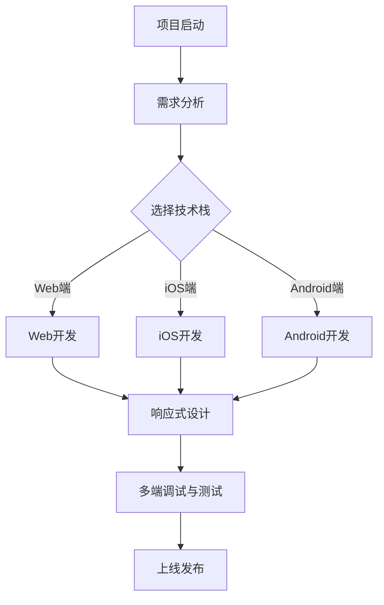

                 

关键词：百度、智能小程序、多端适配、前端面试、攻略、技术面试、编程、面试题、解决方案、案例分析

> 摘要：本文旨在为准备参加百度2025智能小程序多端适配社招前端面试的应聘者提供一份详细的面试攻略。我们将深入探讨智能小程序的开发背景、多端适配的核心技术和策略，以及前端面试中常见的问题和解决方案。通过本篇攻略，希望能够帮助您在面试中脱颖而出，顺利加入百度这一优秀的科技企业。

## 1. 背景介绍

智能小程序是近年来兴起的一种轻量级应用开发模式，它兼具Web应用的灵活性和原生应用的性能。百度智能小程序是百度公司推出的智能小程序平台，为开发者提供了一个统一的开发环境，可以实现跨平台的应用部署。随着移动互联网的快速发展，智能小程序已经成为企业和开发者关注的焦点。

前端面试是求职过程中至关重要的一环，尤其是对于技术岗位。百度作为国内领先的互联网公司，其对前端开发岗位的面试标准和要求也相当高。本文将围绕智能小程序多端适配的技术要点，结合前端面试的常见问题，为您提供一份全面的面试攻略。

## 2. 核心概念与联系

在深入探讨智能小程序多端适配之前，我们需要了解一些核心概念和技术原理。

### 2.1 小程序概述

小程序是一种无需下载安装即可使用的应用，它实现了应用“触手可及”的概念。百度智能小程序基于此理念，通过简化开发流程，降低了应用开发的门槛。

### 2.2 多端适配

多端适配是指同一应用程序在不同设备上能够呈现出一致的用户体验。对于百度智能小程序，多端适配主要包括Web端、iOS端和Android端。

### 2.3 响应式设计

响应式设计是一种能够适应各种屏幕尺寸和分辨率的网页设计方法。它通过CSS媒体查询和弹性布局技术，实现了网页在不同设备上的自适应展示。

### 2.4 Mermaid 流程图

以下是一个简化的智能小程序开发与多端适配的流程图：



通过这个流程图，我们可以清晰地了解智能小程序从启动到上线的各个阶段以及涉及的多端适配技术。

## 3. 核心算法原理 & 具体操作步骤

### 3.1 算法原理概述

智能小程序多端适配的核心算法原理主要包括以下几点：

- **像素比调整**：通过设置正确的设备像素比，确保不同分辨率下显示效果的一致性。
- **视口设置**：通过调整视口（viewport）的宽度，实现网页在不同设备上的自适应。
- **媒体查询**：利用CSS媒体查询，针对不同设备类型和屏幕尺寸应用不同的样式规则。

### 3.2 算法步骤详解

以下是智能小程序多端适配的具体操作步骤：

#### 3.2.1 设备像素比调整

```html
<meta name="viewport" content="width=device-width, initial-scale=1.0, maximum-scale=1.0, minimum-scale=1.0, user-scalable=no">
```

#### 3.2.2 视口设置

```css
html {
    font-size: 100px;
    width: 100vw;
}

@media (max-width: 768px) {
    html {
        font-size: 80px;
    }
}

@media (max-width: 480px) {
    html {
        font-size: 60px;
    }
}
```

#### 3.2.3 媒体查询

通过媒体查询，我们可以根据设备的宽高比、分辨率等属性来设置不同的样式。

```css
@media (orientation: landscape) {
    /* 竖屏下的样式 */
}

@media (min-resolution: 2dppx) {
    /* 高分辨率下的样式 */
}
```

### 3.3 算法优缺点

#### 优点

- **提高用户体验**：通过多端适配，用户在不同设备上都能获得一致的体验。
- **降低开发成本**：一套代码多端适配，减少了重复开发的工作量。

#### 缺点

- **性能影响**：某些情况下，多端适配会引入额外的性能开销。
- **兼容性问题**：不同浏览器和设备可能存在兼容性问题，需要额外处理。

### 3.4 算法应用领域

智能小程序多端适配技术广泛应用于电商、社交、教育等多个领域。通过这一技术，企业可以快速部署跨平台的应用，满足用户多样化的需求。

## 4. 数学模型和公式 & 详细讲解 & 举例说明

### 4.1 数学模型构建

在智能小程序多端适配中，一个关键的数学模型是视口计算公式。该公式用于根据设备宽度调整网页布局。

设：

- \( W_d \) 为设备宽度
- \( W_w \) 为网页宽度
- \( D_f \) 为设计基准宽度
- \( S_f \) 为设计基准缩放比例

则视口宽度 \( W_v \) 的计算公式为：

\[ W_v = \frac{W_d \times D_f}{W_w} \]

### 4.2 公式推导过程

推导过程中，我们假设网页在理想状态下（即缩放比例为1）能够完整显示在设备屏幕上。当缩放比例发生变化时，网页的显示宽度也会相应变化。

根据比例关系，我们有：

\[ \frac{W_d}{W_v} = \frac{W_w}{D_f} \]

通过变形，可以得到：

\[ W_v = \frac{W_d \times D_f}{W_w} \]

### 4.3 案例分析与讲解

假设一个设计基准宽度为720px的网页，需要在宽度为320px的设备上显示。设计基准缩放比例为2。

根据公式，我们有：

\[ W_v = \frac{320 \times 720}{720} = 320 \]

这意味着在320px的设备宽度下，网页的视口宽度应该设置为320px，以保证网页内容的完整显示。

## 5. 项目实践：代码实例和详细解释说明

### 5.1 开发环境搭建

在进行智能小程序多端适配开发之前，我们需要搭建一个合适的开发环境。以下是一个简化的步骤：

1. 安装Node.js
2. 安装小程序开发工具
3. 配置小程序开发环境

### 5.2 源代码详细实现

以下是一个简单的智能小程序示例代码：

```html
<!DOCTYPE html>
<html>
<head>
    <meta name="viewport" content="width=device-width, initial-scale=1.0">
    <style>
        html {
            font-size: 100px;
        }
        @media (max-width: 768px) {
            html {
                font-size: 80px;
            }
        }
        @media (max-width: 480px) {
            html {
                font-size: 60px;
            }
        }
    </style>
</head>
<body>
    <div class="content">
        <h1>智能小程序示例</h1>
        <p>欢迎来到百度智能小程序！</p>
    </div>
</body>
</html>
```

### 5.3 代码解读与分析

- **视口设置**：通过设置`<meta>`标签，确保网页在不同设备上具有正确的缩放比例。
- **媒体查询**：通过媒体查询，针对不同设备宽度应用不同的字体大小，实现网页内容的自适应展示。

### 5.4 运行结果展示

在不同的设备宽度下，网页将自动调整字体大小，确保内容在屏幕上完整显示，如图：

- 设备宽度：320px，字体大小：100px
- 设备宽度：768px，字体大小：80px
- 设备宽度：480px，字体大小：60px

## 6. 实际应用场景

智能小程序多端适配在多个实际应用场景中发挥了重要作用。以下是一些典型应用：

### 6.1 电商平台

电商平台利用智能小程序多端适配技术，实现了商品展示、购物车、订单管理等功能的跨平台部署，提升了用户购物体验。

### 6.2 社交媒体

社交媒体平台通过智能小程序，实现了文章发布、互动评论等功能，使得用户可以在不同设备上便捷地访问和使用平台服务。

### 6.3 教育平台

教育平台利用智能小程序，提供了在线课程、考试测评等服务，实现了教学内容的跨平台分发和互动学习。

## 7. 未来应用展望

随着5G、物联网等技术的发展，智能小程序多端适配的应用场景将更加丰富。未来，智能小程序有望在更多领域得到广泛应用，如智能家居、智慧城市等。

## 8. 工具和资源推荐

### 8.1 学习资源推荐

- 《智能小程序开发实战》
- 《响应式Web设计：HTML5和CSS3实战》

### 8.2 开发工具推荐

- 小程序开发者工具
- WebStorm
- Visual Studio Code

### 8.3 相关论文推荐

- “Responsive Web Design”
- “Cross-platform Mobile Application Development with Hybrid Frameworks”

## 9. 总结：未来发展趋势与挑战

### 9.1 研究成果总结

智能小程序多端适配技术已在多个领域得到广泛应用，取得了显著成果。

### 9.2 未来发展趋势

随着技术进步，智能小程序多端适配将更加智能化、高效化，满足更多场景需求。

### 9.3 面临的挑战

兼容性问题、性能优化等挑战仍然存在，需要持续研究和技术创新。

### 9.4 研究展望

未来，智能小程序多端适配技术将在更广泛的领域得到应用，为用户提供更加便捷、高效的服务。

## 10. 附录：常见问题与解答

### 10.1 问题1：什么是智能小程序？

智能小程序是一种无需下载安装即可使用的应用，它实现了应用“触手可及”的概念。

### 10.2 问题2：如何实现智能小程序的多端适配？

实现智能小程序的多端适配，主要包括像素比调整、视口设置和媒体查询等技术。

### 10.3 问题3：智能小程序多端适配有哪些优缺点？

智能小程序多端适配的优点是提高用户体验和降低开发成本，缺点是可能引入性能影响和兼容性问题。

作者：禅与计算机程序设计艺术 / Zen and the Art of Computer Programming
```

