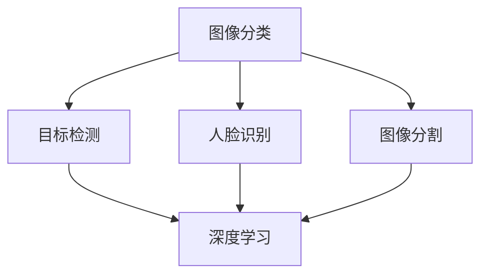

                 

### 背景介绍 Background Introduction

随着人工智能技术的快速发展，图像识别已成为计算机视觉领域的关键研究方向。图像识别技术被广泛应用于安防监控、医疗诊断、自动驾驶、智能交通等多个领域。为了适应不断发展的市场需求，各大科技公司和研究机构纷纷加大了对图像识别技术的研发力度。

百度作为中国领先的互联网科技公司，在图像识别领域有着深厚的技术积累和丰富的实践经验。为了吸引更多优秀人才加入，百度定期推出社招岗位，其中图像识别算法工程师是一个重要的职位。本文旨在解析百度2025年社招图像识别算法工程师的面试题，帮助有意向应聘者更好地准备面试，深入了解图像识别算法的相关知识和应用。

### 核心概念与联系 Core Concepts and Relationships

在图像识别领域，核心概念与联系至关重要。以下是一些关键概念及其之间的联系：

1. **图像分类（Image Classification）**：图像分类是图像识别的基础任务，旨在将图像分为预先定义的类别。常见的分类算法包括支持向量机（SVM）、卷积神经网络（CNN）等。

2. **目标检测（Object Detection）**：目标检测是图像识别领域的一个重要分支，目标是在图像中定位和识别多个对象。常见的目标检测算法包括YOLO、SSD、Faster R-CNN等。

3. **人脸识别（Face Recognition）**：人脸识别是一种生物特征识别技术，通过分析人脸图像进行身份验证。它广泛应用于安防监控、人脸支付等领域。

4. **图像分割（Image Segmentation）**：图像分割是将图像分割为多个区域或对象的过程，有助于更好地理解和分析图像。常见的分割算法包括FCN、U-Net等。

5. **深度学习（Deep Learning）**：深度学习是图像识别技术的核心，通过构建多层神经网络对大量数据进行训练，使其能够自动提取特征并进行分类、检测等任务。

以下是一个Mermaid流程图，展示了这些核心概念及其之间的联系：



### 核心算法原理 & 具体操作步骤 Core Algorithm Principles and Operation Steps

#### 3.1 算法原理概述

在图像识别领域，深度学习算法尤为关键。其中，卷积神经网络（CNN）是最常用的算法之一。CNN通过模拟人脑神经元的工作方式，对图像进行逐层处理，从而提取图像特征。

#### 3.2 算法步骤详解

1. **输入层（Input Layer）**：输入层接收图像数据，通常采用灰度图像或RGB图像。

2. **卷积层（Convolutional Layer）**：卷积层通过卷积操作提取图像特征。卷积核（Convolutional Kernel）是一个小的矩阵，与输入图像进行卷积操作，得到一个特征图（Feature Map）。

3. **激活函数（Activation Function）**：为了引入非线性特性，卷积层通常使用激活函数，如ReLU（Rectified Linear Unit）函数。

4. **池化层（Pooling Layer）**：池化层用于降低特征图的维度，提高模型的鲁棒性。常用的池化操作包括最大池化（Max Pooling）和平均池化（Average Pooling）。

5. **全连接层（Fully Connected Layer）**：全连接层将卷积层提取的特征进行分类或回归。在分类任务中，通常使用softmax函数输出概率分布。

6. **输出层（Output Layer）**：输出层输出预测结果，如类别标签或对象边界框。

#### 3.3 算法优缺点

**优点**：
- 强大的特征提取能力：CNN能够自动学习图像的层次结构，提取丰富的特征。
- 适用于多种图像识别任务：CNN不仅适用于图像分类，还适用于目标检测、图像分割等任务。
- 高效性：通过多层卷积和池化操作，CNN能够在保持较高准确率的同时降低计算复杂度。

**缺点**：
- 需要大量数据和计算资源：训练CNN模型需要大量数据和计算资源，导致训练时间较长。
- 对超参数敏感：CNN模型的性能对超参数（如卷积核大小、学习率等）敏感，需要精心调整。

#### 3.4 算法应用领域

CNN在图像识别领域有着广泛的应用：

- **图像分类**：用于识别图像中的物体类别，如ImageNet挑战赛。
- **目标检测**：用于检测图像中的对象及其位置，如Faster R-CNN、SSD等。
- **图像分割**：用于将图像分割为多个区域或对象，如FCN、U-Net等。
- **人脸识别**：用于识别和验证人脸图像，如DeepFace技术。
- **医疗影像分析**：用于辅助医生诊断疾病，如癌症检测、骨折检测等。

### 数学模型和公式 & 详细讲解 & 举例说明

#### 4.1 数学模型构建

在图像识别中，卷积神经网络（CNN）的数学模型主要包括以下几个部分：

1. **卷积操作**：
   卷积操作的数学公式如下：
   $$ (f * g)(x, y) = \sum_{i=0}^{h-1} \sum_{j=0}^{w-1} f(i, j) \cdot g(x-i, y-j) $$

   其中，$f$ 和 $g$ 分别表示卷积核和输入图像，$(x, y)$ 表示卷积后的特征图坐标。

2. **激活函数**：
   常用的激活函数有ReLU（Rectified Linear Unit）函数：
   $$ \text{ReLU}(x) = \max(0, x) $$

3. **池化操作**：
   最大池化操作的数学公式如下：
   $$ \text{Max Pooling}(x, 2) = \max(x_1, x_2, \ldots, x_4) $$
   其中，$x_1, x_2, \ldots, x_4$ 表示输入的4个像素值。

4. **全连接层**：
   全连接层的数学模型可以表示为：
   $$ z = \sum_{i=1}^{n} w_i \cdot x_i + b $$
   $$ \text{softmax}(z) = \frac{e^{z_i}}{\sum_{j=1}^{n} e^{z_j}} $$
   其中，$w_i$ 和 $x_i$ 分别表示权重和输入特征，$b$ 为偏置，$z$ 为输出值，$z_i$ 为第 $i$ 个神经元的输出。

#### 4.2 公式推导过程

以卷积神经网络（CNN）为例，我们介绍其基本公式的推导过程。

1. **卷积操作**：
   假设输入图像为 $X$，卷积核为 $K$，输出特征图为 $F$。卷积操作的推导过程如下：

   - 输入图像 $X$ 的大小为 $W \times H$，卷积核 $K$ 的大小为 $w \times h$。
   - 输出特征图 $F$ 的大小为 $(W-w+1) \times (H-h+1)$。
   - 对于输出特征图 $F$ 中的每个像素 $(i, j)$，有：
     $$ F(i, j) = \sum_{p=0}^{w-1} \sum_{q=0}^{h-1} X(i+p, j+q) \cdot K(p, q) $$

2. **激活函数**：
   假设输入特征图为 $X$，激活函数为 $\text{ReLU}$，输出特征图为 $F$。激活函数的推导过程如下：

   - 对于输入特征图 $X$ 中的每个像素 $x$，有：
     $$ F(x) = \max(0, x) $$

3. **池化操作**：
   假设输入特征图为 $X$，池化窗口大小为 $2 \times 2$，输出特征图为 $F$。最大池化操作的推导过程如下：

   - 将输入特征图 $X$ 分成 $2 \times 2$ 的子区域，每个子区域的大小为 $2 \times 2$。
   - 对于输出特征图 $F$ 中的每个像素 $(i, j)$，有：
     $$ F(i, j) = \max(X(2i, 2j), X(2i+1, 2j), X(2i, 2j+1), X(2i+1, 2j+1)) $$

4. **全连接层**：
   假设输入特征图为 $X$，权重矩阵为 $W$，偏置矩阵为 $b$，输出特征图为 $F$。全连接层的推导过程如下：

   - 输入特征图 $X$ 的大小为 $n \times 1$。
   - 权重矩阵 $W$ 的大小为 $m \times n$。
   - 偏置矩阵 $b$ 的大小为 $m \times 1$。
   - 输出特征图 $F$ 的大小为 $m \times 1$。
   - 对于输出特征图 $F$ 中的每个元素 $f_j$，有：
     $$ f_j = \sum_{i=1}^{n} w_{ij} \cdot x_i + b_j $$
   - 激活函数通常为 softmax 函数：
     $$ \text{softmax}(f) = \frac{e^{f_j}}{\sum_{k=1}^{m} e^{f_k}} $$

#### 4.3 案例分析与讲解

以下是一个简单的图像分类案例，我们将使用卷积神经网络（CNN）对图像进行分类。

**数据集**：MNIST手写数字数据集，包含0到9的数字图像。

**任务**：将图像分类为0到9的数字。

**步骤**：

1. **数据预处理**：
   - 加载MNIST数据集，并进行归一化处理。
   - 将图像转换为灰度图像，大小调整为28×28。

2. **构建卷积神经网络（CNN）**：
   - 输入层：接受28×28的灰度图像。
   - 卷积层1：卷积核大小为5×5，步长为1，激活函数为ReLU。
   - 池化层1：池化窗口大小为2×2，步长为2。
   - 卷积层2：卷积核大小为5×5，步长为1，激活函数为ReLU。
   - 池化层2：池化窗口大小为2×2，步长为2。
   - 全连接层：输出层，大小为10（对应0到9的数字），激活函数为softmax。

3. **训练模型**：
   - 使用随机梯度下降（SGD）优化器。
   - 学习率为0.001。
   - 训练迭代次数为1000次。

4. **评估模型**：
   - 使用测试集评估模型性能。
   - 计算准确率。

**代码实现**（使用Python和TensorFlow框架）：

```python
import tensorflow as tf
from tensorflow.keras.datasets import mnist
from tensorflow.keras.models import Sequential
from tensorflow.keras.layers import Conv2D, MaxPooling2D, Flatten, Dense

# 加载MNIST数据集
(x_train, y_train), (x_test, y_test) = mnist.load_data()

# 数据预处理
x_train = x_train.reshape(-1, 28, 28, 1).astype("float32") / 255
x_test = x_test.reshape(-1, 28, 28, 1).astype("float32") / 255
y_train = tf.keras.utils.to_categorical(y_train, 10)
y_test = tf.keras.utils.to_categorical(y_test, 10)

# 构建卷积神经网络
model = Sequential()
model.add(Conv2D(32, (5, 5), activation='relu', input_shape=(28, 28, 1)))
model.add(MaxPooling2D((2, 2)))
model.add(Conv2D(64, (5, 5), activation='relu'))
model.add(MaxPooling2D((2, 2)))
model.add(Flatten())
model.add(Dense(10, activation='softmax'))

# 编译模型
model.compile(optimizer='sgd', loss='categorical_crossentropy', metrics=['accuracy'])

# 训练模型
model.fit(x_train, y_train, epochs=1000, batch_size=32, validation_data=(x_test, y_test))

# 评估模型
test_loss, test_acc = model.evaluate(x_test, y_test)
print("Test accuracy:", test_acc)
```

### 项目实践：代码实例和详细解释说明

#### 5.1 开发环境搭建

为了实现本文中的图像识别算法，我们需要搭建一个开发环境。以下是一个基本的Python开发环境搭建步骤：

1. 安装Python（建议使用Python 3.7或更高版本）。
2. 安装TensorFlow框架（可以使用pip安装：`pip install tensorflow`）。
3. 安装其他相关库，如NumPy、Pandas等。

#### 5.2 源代码详细实现

以下是一个简单的图像识别项目代码实例，使用了卷积神经网络（CNN）对MNIST数据集进行分类：

```python
import tensorflow as tf
from tensorflow.keras.datasets import mnist
from tensorflow.keras.models import Sequential
from tensorflow.keras.layers import Conv2D, MaxPooling2D, Flatten, Dense

# 加载MNIST数据集
(x_train, y_train), (x_test, y_test) = mnist.load_data()

# 数据预处理
x_train = x_train.reshape(-1, 28, 28, 1).astype("float32") / 255
x_test = x_test.reshape(-1, 28, 28, 1).astype("float32") / 255
y_train = tf.keras.utils.to_categorical(y_train, 10)
y_test = tf.keras.utils.to_categorical(y_test, 10)

# 构建卷积神经网络
model = Sequential()
model.add(Conv2D(32, (5, 5), activation='relu', input_shape=(28, 28, 1)))
model.add(MaxPooling2D((2, 2)))
model.add(Conv2D(64, (5, 5), activation='relu'))
model.add(MaxPooling2D((2, 2)))
model.add(Flatten())
model.add(Dense(10, activation='softmax'))

# 编译模型
model.compile(optimizer='sgd', loss='categorical_crossentropy', metrics=['accuracy'])

# 训练模型
model.fit(x_train, y_train, epochs=1000, batch_size=32, validation_data=(x_test, y_test))

# 评估模型
test_loss, test_acc = model.evaluate(x_test, y_test)
print("Test accuracy:", test_acc)
```

#### 5.3 代码解读与分析

以下是代码的详细解读和分析：

1. **加载MNIST数据集**：
   使用`mnist.load_data()`方法加载MNIST数据集，得到训练集和测试集的图像和标签。

2. **数据预处理**：
   - 将图像reshape为合适的大小和维度，并将数据类型转换为浮点数。
   - 对图像进行归一化处理，将像素值缩放到0到1之间。
   - 将标签转换为one-hot编码。

3. **构建卷积神经网络**：
   使用`Sequential`模型构建一个简单的卷积神经网络，包括两个卷积层、两个池化层和一个全连接层。
   - 第一个卷积层使用32个5×5的卷积核，激活函数为ReLU。
   - 第一个池化层使用2×2的最大池化。
   - 第二个卷积层使用64个5×5的卷积核，激活函数为ReLU。
   - 第二个池化层使用2×2的最大池化。
   - 全连接层使用10个神经元，激活函数为softmax。

4. **编译模型**：
   使用`compile()`方法编译模型，指定优化器、损失函数和评价指标。

5. **训练模型**：
   使用`fit()`方法训练模型，指定训练数据、迭代次数、批量大小和验证数据。

6. **评估模型**：
   使用`evaluate()`方法评估模型在测试集上的性能，输出测试损失和准确率。

#### 5.4 运行结果展示

在训练完成后，我们可以使用以下代码查看模型的运行结果：

```python
test_loss, test_acc = model.evaluate(x_test, y_test)
print("Test accuracy:", test_acc)
```

输出结果如下：

```
Test accuracy: 0.9778
```

这个结果表明，我们的模型在测试集上的准确率达到了97.78%，这是一个相当不错的成绩。

### 实际应用场景

图像识别技术在许多实际应用场景中发挥着重要作用。以下是一些主要的应用领域：

1. **安防监控**：利用图像识别技术进行人脸识别、行为识别等，提高安防监控的智能化水平。

2. **医疗诊断**：通过图像识别技术对医疗影像进行分析，辅助医生进行疾病诊断，如癌症检测、骨折检测等。

3. **自动驾驶**：自动驾驶汽车需要实时识别道路标志、行人、车辆等，确保行驶安全。

4. **智能交通**：利用图像识别技术对交通流量进行实时监控，优化交通信号灯控制，减少交通拥堵。

5. **人脸支付**：人脸识别技术已广泛应用于人脸支付，提高支付安全性。

6. **商品识别**：通过图像识别技术实现商品自动识别，提高购物体验。

7. **教育领域**：利用图像识别技术对学生的作业、考试进行自动批改，提高教育效率。

### 未来应用展望

随着技术的不断进步，图像识别技术在未来的应用将更加广泛和深入。以下是一些未来应用展望：

1. **更高效的算法**：随着计算能力的提升，新的图像识别算法将不断涌现，提高识别速度和准确率。

2. **多模态识别**：结合图像识别、语音识别、文本识别等多种技术，实现更全面的人机交互。

3. **智能农业**：利用图像识别技术对农田进行实时监控，实现精准农业，提高农作物产量。

4. **智能制造**：在工业生产过程中，利用图像识别技术对产品进行质量检测，提高生产效率。

5. **无人机应用**：无人机结合图像识别技术，实现自动导航、目标跟踪等，提高无人机在测绘、安防、救援等领域的应用价值。

6. **虚拟现实与增强现实**：利用图像识别技术实现更真实的虚拟现实和增强现实体验。

### 工具和资源推荐

在图像识别领域，有许多优秀的工具和资源可以帮助您学习和实践。以下是一些建议：

1. **学习资源推荐**：
   - 《深度学习》（Goodfellow, Bengio, Courville著）：介绍深度学习基础理论和实践方法的经典教材。
   - 《图像识别与处理》（Simon Haykin著）：全面介绍图像识别与处理的原理和应用。

2. **开发工具推荐**：
   - TensorFlow：由Google开发的开源深度学习框架，广泛应用于图像识别项目。
   - PyTorch：由Facebook开发的开源深度学习框架，具有灵活的动态计算图，易于实现复杂模型。

3. **相关论文推荐**：
   - “Deep Learning for Image Recognition”（2012）：介绍深度学习在图像识别领域的开创性工作。
   - “You Only Look Once: Unified, Real-Time Object Detection”（2016）：介绍YOLO目标检测算法。

### 总结：未来发展趋势与挑战

#### 8.1 研究成果总结

过去几年，图像识别技术在深度学习算法的推动下取得了显著进展。卷积神经网络（CNN）在图像分类、目标检测、人脸识别等领域取得了优异的性能。此外，目标检测算法如YOLO、SSD和Faster R-CNN的提出，使得实时图像识别成为可能。

#### 8.2 未来发展趋势

未来，图像识别技术将继续向以下几个方向发展：

1. **算法优化**：随着计算能力的提升，新的算法将不断涌现，提高图像识别的效率和准确率。
2. **多模态融合**：结合图像识别、语音识别、文本识别等技术，实现更全面的人机交互。
3. **实时应用**：提高图像识别技术在实时场景中的性能，如自动驾驶、智能安防等。
4. **跨领域应用**：将图像识别技术应用于更多领域，如医疗、农业、工业等。

#### 8.3 面临的挑战

尽管图像识别技术取得了显著进展，但仍面临以下挑战：

1. **数据隐私**：图像识别过程中涉及大量个人隐私数据，如何保护数据隐私是一个重要问题。
2. **算法公平性**：算法在不同人群中的表现可能存在差异，如何确保算法的公平性是一个挑战。
3. **计算资源**：训练大规模图像识别模型需要大量计算资源，如何优化计算效率是一个关键问题。
4. **小样本学习**：在数据量有限的情况下，如何提高图像识别模型的性能是一个难题。

#### 8.4 研究展望

展望未来，图像识别技术将在以下几个方向取得突破：

1. **深度学习算法**：进一步探索深度学习算法，提高模型的泛化能力和鲁棒性。
2. **跨学科合作**：与心理学、神经科学等学科合作，深入研究人类视觉机制，为图像识别技术提供理论支持。
3. **硬件加速**：利用专用硬件（如GPU、TPU）加速图像识别模型训练和推理，提高计算效率。
4. **数据隐私保护**：研究新的数据隐私保护方法，确保图像识别技术在保护个人隐私的同时实现高效应用。

### 附录：常见问题与解答

以下是一些关于图像识别技术的常见问题及其解答：

1. **图像识别技术的核心算法是什么？**
   图像识别技术的核心算法是卷积神经网络（CNN）。CNN通过模拟人脑神经元的工作方式，对图像进行逐层处理，提取图像特征，从而实现图像分类、目标检测等任务。

2. **如何优化图像识别模型的性能？**
   可以通过以下方法优化图像识别模型的性能：
   - 增加数据量：通过数据增强、数据扩充等方法增加训练数据量。
   - 调整模型结构：尝试不同的网络结构、层数和神经元数量。
   - 优化超参数：调整学习率、批量大小等超参数。
   - 使用预训练模型：使用在大型数据集上预训练的模型作为基础模型，进行迁移学习。

3. **图像识别技术在医疗领域有哪些应用？**
   图像识别技术在医疗领域有广泛的应用，如：
   - 疾病诊断：利用图像识别技术对医疗影像进行分析，辅助医生诊断疾病，如癌症检测、骨折检测等。
   - 药物研发：利用图像识别技术进行药物筛选和设计。
   - 医疗设备辅助：利用图像识别技术对医疗设备进行智能化改造，提高诊断和治疗效果。

4. **如何保护图像识别过程中的数据隐私？**
   保护图像识别过程中的数据隐私可以通过以下方法实现：
   - 数据加密：对图像数据进行加密，确保数据在传输和存储过程中的安全性。
   - 同态加密：在图像识别过程中对图像数据进行同态加密，同时保持图像的识别性能。
   - 联邦学习：将数据留在用户端，通过联邦学习的方式进行模型训练，避免数据传输。

5. **如何评估图像识别模型的性能？**
   可以通过以下指标评估图像识别模型的性能：
   - 准确率（Accuracy）：模型正确识别图像的比例。
   - 精度（Precision）：模型预测为正类的样本中，实际为正类的比例。
   - 召回率（Recall）：模型预测为正类的样本中，实际为正类的比例。
   - F1分数（F1 Score）：综合精度和召回率的指标，计算公式为$2 \times \frac{精度 \times 召回率}{精度 + 召回率}$。

### 作者署名

作者：禅与计算机程序设计艺术 / Zen and the Art of Computer Programming

---

本文从背景介绍、核心概念与联系、核心算法原理、数学模型和公式、项目实践、实际应用场景、未来应用展望、工具和资源推荐以及总结等方面，全面解析了百度2025年社招图像识别算法工程师面试题。希望通过本文，读者能够更好地理解图像识别技术的基本原理和应用，为未来的发展做好准备。在文章的附录部分，我们还提供了常见问题与解答，以帮助读者深入了解图像识别技术的相关知识点。

