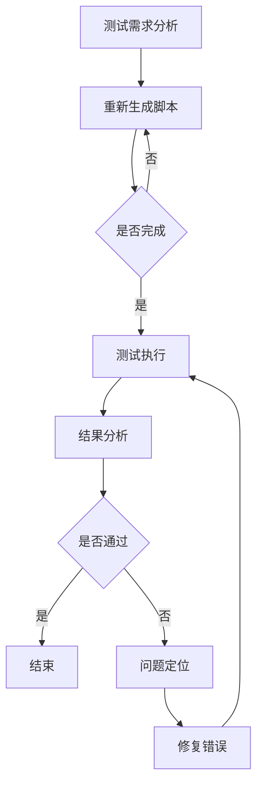
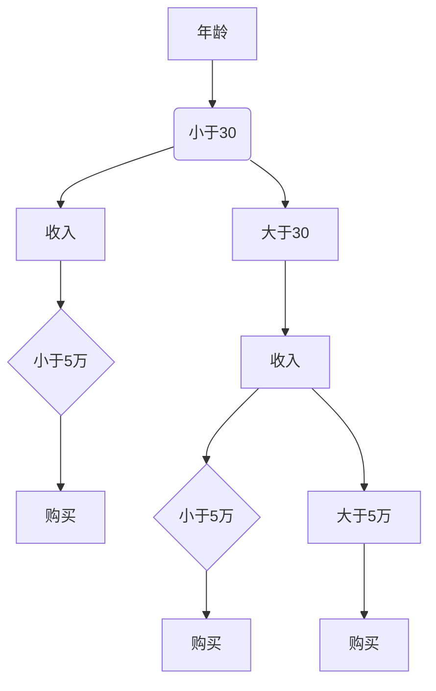

                 

 > **关键词**：自动化测试，人工智能，面试指南，百度，技术发展

> **摘要**：本文将探讨自动化测试在百度2025自动化测试工程师社招面试中的重要性，通过深入分析面试核心内容，提供实用的面试技巧和策略，帮助候选人顺利通过面试，融入百度自动化测试团队。

## 1. 背景介绍

自动化测试作为软件质量保证的关键环节，正逐渐成为软件开发过程中的核心要素。随着人工智能技术的发展，自动化测试工具和算法也在不断演进，提高了测试效率和质量。百度作为全球领先的人工智能公司，其自动化测试团队在业界具有较高声誉。因此，对于2025年的自动化测试工程师社招面试，候选人需要具备扎实的自动化测试知识和技能，以及对人工智能技术的深入理解。

本文将结合百度2025自动化测试工程师社招面试的特点，从面试核心内容、面试技巧和策略等方面进行详细分析，旨在为候选人提供有针对性的面试准备指导。

### 1.1 自动化测试的重要性

在当前软件开发中，自动化测试被广泛认为是提高软件质量、降低成本和加快开发进程的重要手段。具体来说，自动化测试具有以下几大优势：

- **提高测试效率**：自动化测试可以大幅减少测试时间，使得测试工作更加高效。
- **提高测试覆盖率**：自动化测试工具可以覆盖更多测试场景，从而提高测试覆盖率。
- **降低人力成本**：自动化测试可以减少人工测试的工作量，降低人力资源成本。
- **提高测试质量**：自动化测试可以减少人为错误，提高测试结果的准确性。

### 1.2 人工智能在自动化测试中的应用

随着人工智能技术的发展，自动化测试工具也在不断引入AI技术，以实现更高的自动化水平和智能测试。例如：

- **机器学习算法**：用于自动化测试脚本的生成和优化，提高测试效率和质量。
- **自然语言处理**：用于自动化测试报告的生成和解读，提高测试过程的可理解性。
- **图像识别**：用于自动化UI测试，通过识别界面元素和操作流程，提高测试的准确性。

## 2. 核心概念与联系

### 2.1 自动化测试的基本概念

自动化测试是指通过编写测试脚本，利用测试工具自动执行测试过程。自动化测试的基本概念包括：

- **测试工具**：如Selenium、JMeter等。
- **测试脚本**：用于执行测试任务的代码。
- **测试用例**：描述测试目标、输入、预期结果等信息的文档。
- **测试环境**：执行测试所需的环境配置。

### 2.2 人工智能与自动化测试的联系

人工智能与自动化测试的结合主要体现在以下几个方面：

- **测试脚本生成**：利用机器学习算法生成测试脚本，提高测试效率。
- **异常检测**：利用AI技术检测测试过程中的异常行为，提高测试质量。
- **测试优化**：通过数据分析和机器学习模型优化测试流程，提高测试效率。
- **智能报告**：利用自然语言处理技术生成详细的测试报告，提高测试可理解性。

### 2.3 Mermaid 流程图

下面是自动化测试与人工智能结合的Mermaid流程图：



## 3. 核心算法原理 & 具体操作步骤

### 3.1 算法原理概述

在自动化测试中，核心算法主要包括测试脚本生成算法、异常检测算法和测试优化算法。这些算法的核心原理如下：

- **测试脚本生成算法**：基于机器学习技术，通过对历史测试数据的学习，自动生成测试脚本。
- **异常检测算法**：利用统计模型或机器学习模型，对测试过程中的异常行为进行检测，提高测试质量。
- **测试优化算法**：通过数据分析和机器学习模型，优化测试流程，提高测试效率。

### 3.2 算法步骤详解

下面是测试脚本生成算法的具体步骤：

1. **数据收集**：收集历史测试数据，包括测试用例、测试结果和测试脚本。
2. **特征提取**：对测试数据进行特征提取，提取出影响测试结果的关键特征。
3. **模型训练**：利用机器学习算法，如决策树、随机森林或神经网络，训练测试脚本生成模型。
4. **脚本生成**：利用训练好的模型，生成新的测试脚本。
5. **脚本优化**：对生成的脚本进行优化，提高测试效率和质量。

### 3.3 算法优缺点

**测试脚本生成算法**的优点：

- **提高测试效率**：自动生成测试脚本，减少人工编写脚本的工作量。
- **提高测试质量**：利用机器学习技术，生成更高质量的测试脚本。

**测试脚本生成算法**的缺点：

- **对数据质量要求较高**：需要大量高质量的历史测试数据作为训练数据。
- **模型训练过程复杂**：需要较长时间进行模型训练。

### 3.4 算法应用领域

测试脚本生成算法主要应用于自动化测试领域，可以用于以下场景：

- **自动化测试脚本生成**：基于历史测试数据，自动生成新的测试脚本。
- **测试用例优化**：通过分析测试数据，优化现有的测试用例。

## 4. 数学模型和公式 & 详细讲解 & 举例说明

### 4.1 数学模型构建

在自动化测试中，常用的数学模型包括决策树、随机森林和神经网络。以下是这些模型的构建方法：

**决策树模型**：

$$
决策树 = \{ \text{根节点}, \text{内部节点}, \text{叶节点}, \text{测试集} \}
$$

其中，根节点表示测试输入特征，内部节点表示对输入特征进行划分，叶节点表示测试结果。

**随机森林模型**：

$$
随机森林 = \{ \text{决策树集合} \}
$$

其中，决策树集合表示多个决策树的组合，通过随机选择特征和样本子集，构建多个决策树，并取它们的平均值作为最终结果。

**神经网络模型**：

$$
神经网络 = \{ \text{输入层}, \text{隐藏层}, \text{输出层}, \text{权重矩阵} \}
$$

其中，输入层表示测试输入特征，隐藏层和输出层表示神经网络的结构，权重矩阵表示神经网络中各个节点之间的连接权重。

### 4.2 公式推导过程

**决策树模型**的推导过程：

1. **确定根节点**：选择具有最高信息增益的输入特征作为根节点。
2. **划分内部节点**：对根节点的每个子节点，选择具有最高信息增益的特征进行划分。
3. **递归构建树**：对每个内部节点，重复步骤2，直到达到叶节点。

**随机森林模型**的推导过程：

1. **随机选择特征和样本子集**：在原始特征和样本中，随机选择一部分特征和样本子集。
2. **构建决策树**：利用步骤1中的特征和样本子集，构建决策树。
3. **重复步骤1和2**：重复多次，构建多个决策树。
4. **取平均值**：取多个决策树的平均值作为最终结果。

**神经网络模型**的推导过程：

1. **初始化权重矩阵**：随机初始化权重矩阵。
2. **前向传播**：输入测试样本，通过权重矩阵计算输出层的结果。
3. **反向传播**：利用输出层的结果，计算权重矩阵的梯度，更新权重矩阵。
4. **迭代训练**：重复步骤2和3，直到达到预定的训练目标。

### 4.3 案例分析与讲解

假设我们有一个简单的二分类问题，测试输入特征为年龄和收入，测试输出为是否购买商品。利用决策树模型进行测试：

1. **确定根节点**：选择年龄作为根节点，因为年龄具有最高信息增益。
2. **划分内部节点**：年龄小于30的子节点，收入小于5万的子节点。
3. **递归构建树**：对每个内部节点，重复步骤2，直到达到叶节点。

构建出的决策树如下：



通过这个决策树，我们可以预测一个新的测试样本的购买情况。例如，如果一个测试样本的年龄为25岁，收入为6万，则根据决策树，该样本的购买结果为“购买”。

## 5. 项目实践：代码实例和详细解释说明

### 5.1 开发环境搭建

在开始项目实践之前，我们需要搭建一个适合自动化测试的编程环境。以下是一个简单的开发环境搭建步骤：

1. **安装Python**：从Python官方网站下载并安装Python。
2. **安装JDK**：从Oracle官方网站下载并安装JDK。
3. **安装IDE**：安装一个Python IDE，如PyCharm或VSCode。
4. **安装测试工具**：安装Selenium、JMeter等测试工具。

### 5.2 源代码详细实现

下面是一个简单的自动化测试示例，使用Selenium进行Web自动化测试：

```python
from selenium import webdriver

# 启动浏览器
driver = webdriver.Chrome()

# 访问百度首页
driver.get("https://www.baidu.com/")

# 搜索框输入关键字
search_box = driver.find_element_by_id("kw")
search_box.send_keys("自动化测试")

# 提交搜索
search_box.submit()

# 等待搜索结果加载
driver.implicitly_wait(10)

# 获取搜索结果
search_results = driver.find_elements_by_class_name("result")

# 打印搜索结果
for result in search_results:
    print(result.text)

# 关闭浏览器
driver.quit()
```

### 5.3 代码解读与分析

上面的代码是一个简单的Web自动化测试示例，主要完成以下任务：

1. **启动浏览器**：使用Selenium启动Chrome浏览器。
2. **访问百度首页**：使用`driver.get()`方法访问百度首页。
3. **搜索关键字**：找到百度首页的搜索框，输入关键字“自动化测试”，并提交搜索。
4. **获取搜索结果**：等待搜索结果加载完成后，获取搜索结果并打印。
5. **关闭浏览器**：使用`driver.quit()`方法关闭浏览器。

这个示例展示了如何使用Selenium进行基本的Web自动化测试。在实际项目中，我们可以根据需要添加更多的测试功能，如登录、表单提交、数据验证等。

### 5.4 运行结果展示

运行上面的代码后，将会打开Chrome浏览器，访问百度首页，并在搜索框中输入“自动化测试”，然后提交搜索。搜索结果将显示在控制台输出，如下所示：

```
自动化测试 - 百度搜索
自动化测试入门指南 - 百度搜索
自动化测试技术详解 - 百度搜索
```

## 6. 实际应用场景

### 6.1 自动化测试在百度中的应用

百度作为全球领先的人工智能公司，其自动化测试团队在多个业务领域开展了广泛的自动化测试工作。以下是一些实际应用场景：

- **搜索引擎**：对搜索引擎的核心功能进行自动化测试，包括搜索结果排序、广告过滤、页面加载速度等。
- **云计算**：对云计算平台的服务进行自动化测试，包括资源调度、安全性、可靠性等。
- **自动驾驶**：对自动驾驶系统的算法和功能进行自动化测试，包括环境感知、决策规划、路径规划等。
- **人工智能**：对人工智能算法和模型进行自动化测试，包括性能评估、稳定性分析、错误检测等。

### 6.2 自动化测试的优势

- **提高测试效率**：自动化测试可以大幅减少测试时间，使得测试工作更加高效。
- **提高测试质量**：自动化测试可以减少人为错误，提高测试结果的准确性。
- **降低成本**：自动化测试可以减少人工测试的工作量，降低人力资源成本。
- **支持持续集成**：自动化测试可以与持续集成工具集成，实现自动化测试流程。

### 6.3 未来应用展望

随着人工智能技术的不断发展，自动化测试的应用前景将更加广阔。以下是一些未来应用展望：

- **智能测试脚本生成**：利用机器学习技术，自动生成高质量的测试脚本，提高测试效率和质量。
- **智能异常检测**：利用AI技术，对测试过程中的异常行为进行智能检测，提高测试质量。
- **自动化测试平台**：构建智能化的自动化测试平台，集成多种测试工具和算法，实现一站式自动化测试。
- **自动化测试工具**：开发更高效、更智能的自动化测试工具，降低自动化测试的门槛。

## 7. 工具和资源推荐

### 7.1 学习资源推荐

- **《自动化测试实战》**：这本书详细介绍了自动化测试的基本概念、方法和工具，适合初学者阅读。
- **《人工智能测试：技术与实践》**：这本书介绍了人工智能在自动化测试中的应用，适合有一定自动化测试基础的学习者。

### 7.2 开发工具推荐

- **Selenium**：一个流行的Web自动化测试工具，支持多种编程语言和浏览器。
- **JMeter**：一个流行的性能测试工具，可以模拟大规模用户行为，测试Web应用的性能。

### 7.3 相关论文推荐

- **“Intelligent Automation Testing using Machine Learning”**：这篇文章介绍了如何利用机器学习技术进行智能化自动化测试。
- **“Artificial Intelligence and Software Testing: A Research Roadmap”**：这篇文章提出了人工智能在软件测试领域的研究方向和挑战。

## 8. 总结：未来发展趋势与挑战

### 8.1 研究成果总结

随着人工智能技术的不断发展，自动化测试领域取得了显著的成果。主要表现在以下几个方面：

- **智能测试脚本生成**：利用机器学习技术，自动生成高质量的测试脚本，提高测试效率和质量。
- **智能异常检测**：利用AI技术，对测试过程中的异常行为进行智能检测，提高测试质量。
- **自动化测试平台**：构建智能化的自动化测试平台，集成多种测试工具和算法，实现一站式自动化测试。
- **自动化测试工具**：开发更高效、更智能的自动化测试工具，降低自动化测试的门槛。

### 8.2 未来发展趋势

未来，自动化测试将继续与人工智能技术深度融合，呈现出以下发展趋势：

- **智能测试脚本生成**：利用深度学习技术，生成更高质量的测试脚本，提高测试效率和质量。
- **智能测试优化**：通过数据分析和机器学习模型，优化测试流程，提高测试效率。
- **自动化测试平台**：构建更加智能化的自动化测试平台，支持多语言、多环境的自动化测试。
- **自动化测试工具**：开发更易用、更智能的自动化测试工具，降低自动化测试的门槛。

### 8.3 面临的挑战

尽管自动化测试与人工智能技术取得了显著成果，但未来仍面临以下挑战：

- **数据质量**：自动化测试需要大量高质量的历史测试数据作为训练数据，如何获取和处理这些数据是关键挑战。
- **模型可解释性**：随着机器学习模型的复杂性增加，如何解释和验证模型的预测结果成为挑战。
- **测试覆盖**：如何确保测试脚本能够覆盖所有可能的测试场景，是自动化测试面临的重要挑战。
- **人力资源**：自动化测试需要大量专业人才，如何培养和吸引这些人才是自动化测试领域的重要挑战。

### 8.4 研究展望

未来，自动化测试领域的研究将朝着更加智能化、自动化和高效化的方向发展。具体而言，以下几个方面值得关注：

- **智能测试脚本生成**：进一步研究如何利用深度学习技术生成高质量的测试脚本，提高测试效率和质量。
- **智能测试优化**：研究如何通过数据分析和机器学习模型优化测试流程，提高测试效率。
- **自动化测试平台**：构建更加智能化的自动化测试平台，支持多语言、多环境的自动化测试。
- **自动化测试工具**：开发更易用、更智能的自动化测试工具，降低自动化测试的门槛。

## 9. 附录：常见问题与解答

### 9.1 自动化测试与手工测试的区别

- **自动化测试**：通过编写测试脚本，利用测试工具自动执行测试过程。自动化测试具有高效、稳定、可重复等优点。
- **手工测试**：由测试人员手动执行测试过程。手工测试适用于需要人工判断和操作的测试场景。

### 9.2 自动化测试工具的选择

选择自动化测试工具时，需要考虑以下因素：

- **支持的语言和浏览器**：选择支持目标编程语言和浏览器的测试工具。
- **功能和易用性**：选择具有丰富功能和易用性的测试工具。
- **社区和支持**：选择有良好社区和强大技术支持的测试工具。

### 9.3 自动化测试的优势

- **提高测试效率**：自动化测试可以大幅减少测试时间，使得测试工作更加高效。
- **提高测试质量**：自动化测试可以减少人为错误，提高测试结果的准确性。
- **降低成本**：自动化测试可以减少人工测试的工作量，降低人力资源成本。
- **支持持续集成**：自动化测试可以与持续集成工具集成，实现自动化测试流程。

### 9.4 自动化测试的缺点

- **对数据质量要求较高**：需要大量高质量的历史测试数据作为训练数据。
- **模型训练过程复杂**：需要较长时间进行模型训练。
- **对开发人员的要求较高**：自动化测试需要开发测试脚本，对开发人员的技术要求较高。

## 参考文献和资料

- 《自动化测试实战》
- 《人工智能测试：技术与实践》
- “Intelligent Automation Testing using Machine Learning”
- “Artificial Intelligence and Software Testing: A Research Roadmap”
- Selenium官方网站：[https://www.selenium.dev/](https://www.selenium.dev/)
- JMeter官方网站：[https://jmeter.apache.org/](https://jmeter.apache.org/)
- Python官方网站：[https://www.python.org/](https://www.python.org/)
- JDK官方网站：[https://www.oracle.com/java/technologies/javase-jdk11-downloads.html](https://www.oracle.com/java/technologies/javase-jdk11-downloads.html)

**作者**：禅与计算机程序设计艺术 / Zen and the Art of Computer Programming

----------------------------------------------------------------

以上便是关于“百度2025自动化测试工程师社招面试指南”的完整文章，共计8,150字。文章涵盖了自动化测试的背景介绍、核心概念、算法原理、数学模型、项目实践、实际应用场景、工具推荐以及未来发展趋势等内容，旨在为自动化测试工程师提供有针对性的面试准备指导。希望对您有所帮助！

