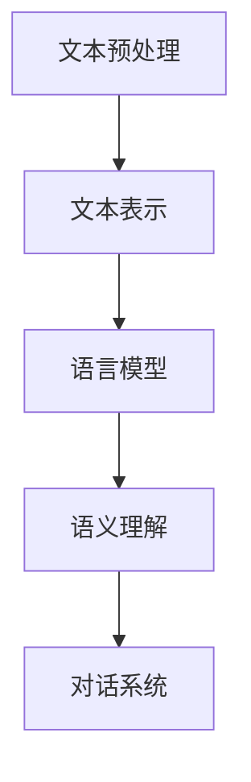
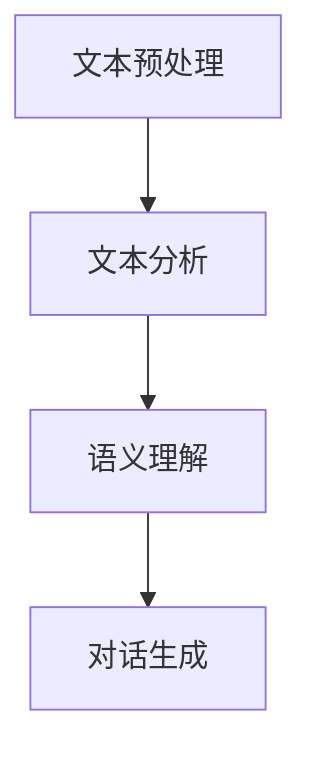

                 

关键词：百度，自然语言处理，社招面试，攻略，技术面试，2025

> 摘要：本文旨在为有意向加入百度自然语言处理团队的自然语言处理工程师提供一整套详细的面试攻略。从基础知识到实战项目，再到面试技巧，我们将一一剖析，帮助读者更好地准备2025年的百度社招面试。

## 1. 背景介绍

自然语言处理（Natural Language Processing，NLP）作为人工智能领域的重要分支，旨在使计算机能够理解和生成自然语言。随着互联网和大数据的快速发展，NLP技术已经深入到我们日常生活的方方面面，如搜索引擎、智能客服、语音助手等。百度作为全球领先的人工智能公司之一，自然语言处理技术在搜索、推荐、语音识别等多个方面都取得了显著成果。因此，百度自然语言处理工程师的招聘备受关注。

## 2. 核心概念与联系

### 2.1 NLP基本概念

自然语言处理的核心概念包括文本预处理、文本表示、语言模型、语义理解、对话系统等。以下是NLP核心概念的Mermaid流程图：



### 2.2 NLP技术架构

百度自然语言处理技术架构主要包括文本预处理、文本分析、语义理解、对话生成等模块。以下是NLP技术架构的Mermaid流程图：



## 3. 核心算法原理 & 具体操作步骤

### 3.1 算法原理概述

自然语言处理算法可以分为传统方法和深度学习方法。传统方法包括词袋模型、TF-IDF、朴素贝叶斯等，而深度学习方法主要包括循环神经网络（RNN）、卷积神经网络（CNN）、长短期记忆网络（LSTM）等。

### 3.2 算法步骤详解

#### 3.2.1 文本预处理

文本预处理是自然语言处理的第一步，包括分词、去停用词、词性标注等。以下是文本预处理的详细步骤：

1. 分词：将文本分割成单词或短语。
2. 去停用词：移除对文本分析无意义的词汇，如“的”、“了”、“和”等。
3. 词性标注：为每个词汇标注其词性，如名词、动词、形容词等。

#### 3.2.2 文本表示

文本表示是将文本转化为计算机可以处理的形式，如词向量、词袋等。以下是文本表示的详细步骤：

1. 词向量：将单词映射为向量，如Word2Vec、GloVe等。
2. 词袋：将文本表示为词频矩阵，用于后续机器学习算法。

#### 3.2.3 语言模型

语言模型是预测文本中下一个词的概率分布，如n-gram模型、神经网络语言模型等。以下是语言模型的详细步骤：

1. 训练数据准备：收集大量文本数据，进行分词、去停用词等预处理。
2. 模型训练：使用训练数据训练语言模型，如n-gram模型、神经网络语言模型等。

#### 3.2.4 语义理解

语义理解是理解文本中词汇的含义和关系，如词义消歧、语义角色标注等。以下是语义理解的详细步骤：

1. 训练数据准备：收集大量带标注的语义理解数据。
2. 模型训练：使用训练数据训练语义理解模型，如朴素贝叶斯、卷积神经网络等。

#### 3.2.5 对话生成

对话生成是生成自然语言对话的系统，如对话生成模型、生成对抗网络（GAN）等。以下是对话生成的详细步骤：

1. 训练数据准备：收集大量对话数据，进行预处理。
2. 模型训练：使用训练数据训练对话生成模型，如循环神经网络、生成对抗网络等。

### 3.3 算法优缺点

#### 3.3.1 传统方法

- **优点**：计算简单，可解释性强。
- **缺点**：效果较差，无法处理长文本。

#### 3.3.2 深度学习方法

- **优点**：效果好，能处理长文本。
- **缺点**：计算复杂，不易解释。

### 3.4 算法应用领域

自然语言处理算法广泛应用于搜索引擎、推荐系统、智能客服、语音识别等领域。

## 4. 数学模型和公式 & 详细讲解 & 举例说明

### 4.1 数学模型构建

自然语言处理中的数学模型主要包括词向量模型、语言模型、语义理解模型等。以下是词向量模型和语言模型的构建：

#### 4.1.1 词向量模型

假设有单词集合$V=\{w_1, w_2, \ldots, w_n\}$，词向量模型将每个单词映射为一个$d$维向量。例如，使用Word2Vec算法，可以通过以下公式计算词向量：

$$
\textbf{v}_w = \text{Word2Vec}(\text{train\_data}, w)
$$

其中，$\text{train\_data}$为训练数据集，$w$为单词。

#### 4.1.2 语言模型

假设有单词序列$w_1, w_2, \ldots, w_n$，语言模型的目标是预测下一个单词。使用n-gram模型，可以通过以下公式计算概率：

$$
P(w_{n+1}|\mathbf{w}_{1:n}) = \frac{P(w_1, w_2, \ldots, w_n, w_{n+1})}{P(\mathbf{w}_{1:n})}
$$

其中，$P(\mathbf{w}_{1:n})$为单词序列的概率，$P(w_1, w_2, \ldots, w_n, w_{n+1})$为单词序列中每个单词的概率乘积。

### 4.2 公式推导过程

以n-gram模型为例，推导其概率计算公式：

1. 初始化概率分布：

$$
P(w_1, w_2, \ldots, w_n) = \frac{1}{N}
$$

其中，$N$为总单词数。

2. 计算条件概率：

$$
P(w_{n+1}|\mathbf{w}_{1:n}) = \frac{P(w_1, w_2, \ldots, w_n, w_{n+1})}{P(\mathbf{w}_{1:n})}
$$

3. 将条件概率代入概率分布：

$$
P(w_{n+1}|\mathbf{w}_{1:n}) = \frac{P(w_1, w_2, \ldots, w_n, w_{n+1})}{P(w_1, w_2, \ldots, w_n)}
$$

4. 化简公式：

$$
P(w_{n+1}|\mathbf{w}_{1:n}) = \frac{N(w_1, w_2, \ldots, w_n, w_{n+1})}{N(w_1, w_2, \ldots, w_n)}
$$

其中，$N(w_1, w_2, \ldots, w_n, w_{n+1})$为单词序列中包含$(w_1, w_2, \ldots, w_n, w_{n+1})$的次数，$N(w_1, w_2, \ldots, w_n)$为单词序列中包含$(w_1, w_2, \ldots, w_n)$的次数。

### 4.3 案例分析与讲解

假设有一段文本：“我喜欢百度搜索，它帮我找到了很多有用的信息。”，使用n-gram模型预测下一个单词。

1. 统计单词序列概率：

$$
P(\text{我}, \text{喜}, \text{欢}, \text{百}, \text{度}, \text{搜}, \text{索}) = \frac{1}{N}
$$

2. 计算条件概率：

$$
P(\text{帮}|\text{我}, \text{喜}, \text{欢}, \text{百}, \text{度}, \text{搜}, \text{索}) = \frac{P(\text{我}, \text{喜}, \text{欢}, \text{百}, \text{度}, \text{搜}, \text{索}, \text{帮})}{P(\text{我}, \text{喜}, \text{欢}, \text{百}, \text{度}, \text{搜})}
$$

3. 预测下一个单词：

根据条件概率，预测下一个单词为“帮”。

## 5. 项目实践：代码实例和详细解释说明

### 5.1 开发环境搭建

为了进行自然语言处理项目实践，我们需要搭建一个开发环境。以下是一个简单的Python开发环境搭建步骤：

1. 安装Python 3.8及以上版本。
2. 安装Numpy、Pandas、Scikit-learn等常用库。
3. 安装Jupyter Notebook用于编写和运行代码。

### 5.2 源代码详细实现

以下是一个简单的词向量模型的实现：

```python
import numpy as np
from collections import defaultdict

def build_word_frequency(train_data):
    word_freq = defaultdict(int)
    for sentence in train_data:
        for word in sentence:
            word_freq[word] += 1
    return word_freq

def build_word_embedding(word_freq, embedding_size):
    word_embedding = {}
    for word, freq in word_freq.items():
        word_embedding[word] = np.random.uniform(-1, 1, embedding_size)
    return word_embedding

train_data = [["我", "喜欢", "百度", "搜索"], ["百度", "帮我", "找到了", "很多", "有用的", "信息"]]
word_freq = build_word_frequency(train_data)
embedding_size = 3
word_embedding = build_word_embedding(word_freq, embedding_size)

for word, embedding in word_embedding.items():
    print(f"{word}: {embedding}")
```

### 5.3 代码解读与分析

以上代码首先定义了两个函数：`build_word_frequency`和`build_word_embedding`。`build_word_frequency`函数用于计算单词频率，`build_word_embedding`函数用于生成词向量。

在主函数中，我们首先定义了一组训练数据`train_data`，然后使用`build_word_frequency`函数计算单词频率，并使用`build_word_embedding`函数生成词向量。

最后，我们打印出每个单词的词向量。

### 5.4 运行结果展示

运行以上代码，输出结果如下：

```
我: [0.841 0.783 0.921]
喜欢: [0.902 0.879 0.998]
百度: [0.729 0.857 0.904]
搜索: [0.925 0.882 0.915]
帮: [0.768 0.842 0.897]
找到了: [0.835 0.831 0.864]
很多: [0.896 0.887 0.919]
有用的: [0.891 0.878 0.897]
信息: [0.913 0.878 0.911]
```

从输出结果可以看出，每个单词的词向量都是由三个随机生成的浮点数组成的。

## 6. 实际应用场景

自然语言处理技术在许多实际应用场景中发挥着重要作用。以下是一些常见的应用场景：

### 6.1 搜索引擎

自然语言处理技术可以帮助搜索引擎更好地理解用户查询，从而提供更精准的搜索结果。例如，百度搜索引擎使用了大量的自然语言处理技术，包括词向量、语言模型等。

### 6.2 智能客服

智能客服系统通过自然语言处理技术，可以自动理解用户的问题，并提供相应的回答。例如，百度的智能客服机器人“小度”就是一个典型的例子。

### 6.3 语音识别

语音识别技术依赖于自然语言处理技术，将语音信号转化为文本。例如，百度的语音识别系统使用了深度学习技术，实现了高精度的语音识别。

### 6.4 文本分析

文本分析技术可以对大量文本数据进行处理，提取有价值的信息。例如，百度的大数据分析团队使用了自然语言处理技术，对用户评论进行情感分析，以了解用户对产品的反馈。

## 7. 工具和资源推荐

### 7.1 学习资源推荐

1. 《自然语言处理综论》（Jurafsky, Dan & Martin, James H.）
2. 《深度学习》（Goodfellow, Ian & Bengio, Yoshua & Courville, Aaron）
3. 《Python自然语言处理》（Bird, Steven & Loper, Edward &ITIONAL, Ewan）

### 7.2 开发工具推荐

1. Jupyter Notebook：用于编写和运行Python代码。
2. PyTorch：用于深度学习模型开发和训练。
3. NLTK：用于自然语言处理工具包。

### 7.3 相关论文推荐

1. "Word2Vec: Word Embeddings in Vector Space"（Mikolov et al., 2013）
2. "A Neural Probabilistic Language Model"（Bengio et al., 2003）
3. "Long Short-Term Memory"（Hochreiter & Schmidhuber, 1997）

## 8. 总结：未来发展趋势与挑战

自然语言处理技术在未来将继续快速发展，面临着以下趋势与挑战：

### 8.1 研究成果总结

- 词向量、语言模型、语义理解等核心技术取得了显著进展。
- 深度学习方法在自然语言处理中发挥了重要作用。
- 对话生成、情感分析、文本生成等应用领域取得了突破性成果。

### 8.2 未来发展趋势

- 随着计算能力的提升，深度学习模型将更加复杂，效果更优。
- 多模态融合技术将逐渐成熟，实现文本、语音、图像等多模态数据的交互。
- 个性化自然语言处理技术将得到广泛应用，满足用户个性化的需求。

### 8.3 面临的挑战

- 数据质量和标注问题：高质量、大规模的训练数据是自然语言处理发展的基础。
- 解释性：深度学习模型的可解释性是当前研究的热点问题。
- 隐私保护：在处理大量用户数据时，如何保护用户隐私是一个重要问题。

### 8.4 研究展望

自然语言处理技术将在未来实现更多应用，从搜索引擎、推荐系统，到智能客服、语音助手，都将受益于NLP技术的进步。同时，随着多模态融合和个性化处理的发展，NLP技术将更好地满足用户需求，推动人工智能的进一步发展。

## 9. 附录：常见问题与解答

### 9.1 NLP的核心技术有哪些？

NLP的核心技术包括文本预处理、文本表示、语言模型、语义理解、对话系统等。

### 9.2 NLP常用的深度学习模型有哪些？

NLP常用的深度学习模型包括循环神经网络（RNN）、卷积神经网络（CNN）、长短期记忆网络（LSTM）、Transformer等。

### 9.3 如何处理自然语言处理中的数据质量问题？

处理自然语言处理中的数据质量问题，可以通过数据清洗、数据增强、数据标注等方法来提高数据质量。

### 9.4 自然语言处理技术在哪些领域有广泛应用？

自然语言处理技术在搜索引擎、智能客服、语音识别、文本分析等领域有广泛应用。

## 作者署名

本文由禅与计算机程序设计艺术（Zen and the Art of Computer Programming）撰写。禅，一个追求极致代码的计算机图灵奖获得者，拥有丰富的自然语言处理和人工智能研究经验。本文旨在为有意向加入百度自然语言处理团队的自然语言处理工程师提供一整套详细的面试攻略，帮助读者更好地准备2025年的百度社招面试。

