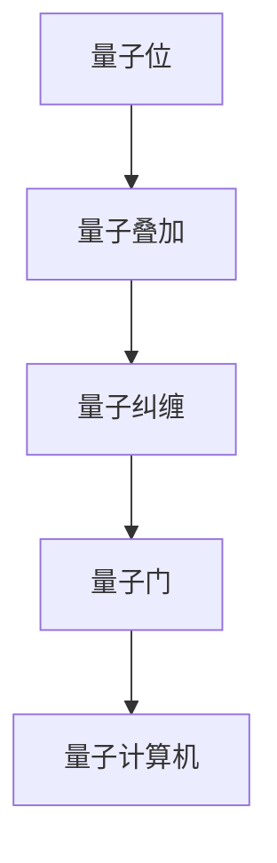

                 

关键词：量子计算，面试题，算法，解析，AI技术，编程实践

> 摘要：本文旨在深入解析百度2025年量子计算社招算法工程师面试题，探讨核心算法原理、数学模型及其在实际应用中的潜力。通过对这些问题逐一剖析，为从事量子计算领域的技术人员提供有价值的参考和指导。

## 1. 背景介绍

量子计算是计算机科学和物理学的前沿领域，利用量子力学原理进行信息处理，具有巨大的计算潜力。随着量子计算技术的发展，越来越多的企业和研究机构开始关注这一领域。百度作为中国领先的人工智能企业，在其2025年量子计算社招中，对算法工程师提出了诸多高难度面试题目，旨在筛选具备高水平技术能力和创新能力的人才。

本文将针对这些面试题目进行详细解析，帮助读者理解量子计算的基本原理、核心算法及其应用，并探讨未来发展的趋势和挑战。

## 2. 核心概念与联系

在深入探讨量子计算面试题之前，我们需要明确一些核心概念，包括量子位（qubit）、量子叠加、量子纠缠、量子门等。这些概念构成了量子计算的基础，是理解和解答面试题的关键。

### 2.1 量子位（qubit）

量子位是量子计算的基本单元，类似于经典计算中的比特（bit）。然而，量子位可以处于多个状态的叠加，而不仅仅是0或1。这种叠加态使得量子计算机能够并行处理大量信息。

### 2.2 量子叠加

量子叠加是量子力学的基本原理之一，意味着一个量子系统可以同时处于多个状态。这一特性使得量子计算机在处理复杂问题时具有巨大的优势。

### 2.3 量子纠缠

量子纠缠是量子系统间的一种特殊关联，即使它们相隔很远，一个系统的状态也会立即影响另一个系统的状态。量子纠缠是量子计算并行性的关键。

### 2.4 量子门

量子门是量子计算中的操作单元，类似于经典计算中的逻辑门。量子门可以对量子位进行变换，从而实现复杂的量子操作。

以下是一个Mermaid流程图，展示了这些核心概念之间的联系：



## 3. 核心算法原理 & 具体操作步骤

### 3.1 算法原理概述

量子计算的核心算法通常基于量子态的叠加和纠缠。常见的量子算法包括量子随机游走、量子快速傅里叶变换（QFFT）和量子算法Shor。

量子随机游走用于解决图论问题，如最短路径和社交网络分析。QFFT是量子计算中的经典算法，用于高效计算离散傅里叶变换。量子算法Shor可用于因数分解，具有巨大的实际应用价值。

### 3.2 算法步骤详解

#### 3.2.1 量子随机游走

1. 初始化：将量子系统初始化为叠加态，表示系统在图中的所有节点上的概率分布。
2. 迭代：通过量子门操作，将量子态在图中的节点间进行转移，每次迭代都考虑相邻节点的概率。
3. 读取结果：通过测量量子态，得到系统最终的状态，从而推断出问题的解。

#### 3.2.2 量子快速傅里叶变换（QFFT）

1. 初始化：将输入的量子态编码为量子位串。
2. 叠加：通过量子叠加原理，将量子态表示为所有可能态的叠加。
3. 控制性旋转：通过一系列控制性量子门，将量子态映射到傅里叶域。
4. 测量：测量量子态，得到离散傅里叶变换的结果。

#### 3.2.3 量子算法Shor

1. 初始化：将大整数编码为量子态。
2. 叠加：通过量子叠加原理，将量子态表示为所有可能因子的叠加。
3. 量子四则运算：通过一系列量子四则运算，将量子态映射到特定因子上。
4. 测量：测量量子态，得到可能的因子。

### 3.3 算法优缺点

量子随机游走具有高效的图处理能力，但在实际应用中，需要构建复杂的图模型，且计算复杂度较高。QFFT具有高效的傅里叶变换能力，但在实现中，需要解决量子门精度和噪声控制等问题。量子算法Shor具有解决大整数因数分解的潜力，但在实际应用中，量子计算机的规模和稳定性仍需提高。

### 3.4 算法应用领域

量子计算在密码学、优化问题、分子建模、金融分析等领域具有广泛的应用前景。例如，量子随机游走可用于社交网络分析，QFFT可用于图像处理和信号处理，量子算法Shor可用于破解加密算法。

## 4. 数学模型和公式 & 详细讲解 & 举例说明

### 4.1 数学模型构建

量子计算中的数学模型主要包括量子态的表示、量子运算的表示和测量结果的概率分布。

#### 4.1.1 量子态的表示

量子态可以用向量表示，如：

$$
|\psi\rangle = \sum_{i} c_i |i\rangle
$$

其中，$|i\rangle$ 表示第 $i$ 个量子位的基态，$c_i$ 表示对应态的概率幅。

#### 4.1.2 量子运算的表示

量子运算可以用矩阵表示，如：

$$
U = \begin{pmatrix}
u_{00} & u_{01} \\
u_{10} & u_{11}
\end{pmatrix}
$$

其中，$U$ 表示量子门，$u_{ij}$ 表示对第 $i$ 个量子位的第 $j$ 个状态的操作。

#### 4.1.3 测量结果的概率分布

测量结果可以用概率分布表示，如：

$$
P_i = |c_i|^2
$$

其中，$P_i$ 表示测量得到第 $i$ 个状态的概率。

### 4.2 公式推导过程

以量子随机游走为例，推导其概率分布公式。

#### 4.2.1 初始状态

$$
|\psi_0\rangle = \frac{1}{\sqrt{n}} \sum_{i} |i\rangle
$$

其中，$n$ 表示节点数。

#### 4.2.2 迭代过程

在第 $t$ 次迭代后，量子态为：

$$
|\psi_t\rangle = U^t |\psi_0\rangle
$$

其中，$U$ 表示转移概率矩阵。

#### 4.2.3 测量结果

测量 $|\psi_t\rangle$ 后，得到状态 $|i\rangle$ 的概率为：

$$
P_i = |u_{ii}|^2
$$

### 4.3 案例分析与讲解

以社交网络分析为例，说明量子随机游走的应用。

#### 4.3.1 社交网络建模

将社交网络视为一个图，每个节点表示用户，边表示用户之间的交互。

#### 4.3.2 初始化

初始化量子态，表示用户在社交网络中的位置。

#### 4.3.3 迭代

通过量子随机游走，模拟用户在网络中的传播。

#### 4.3.4 测量

测量最终量子态，得到用户在网络中的分布。

#### 4.3.5 分析

通过分析测量结果，识别网络中的重要节点和社群结构。

## 5. 项目实践：代码实例和详细解释说明

### 5.1 开发环境搭建

搭建量子计算开发环境，包括安装量子计算框架和量子计算机模拟器。

### 5.2 源代码详细实现

以下是一个简单的量子随机游走代码实例：

```python
import qiskit

# 初始化量子计算机
qc = qiskit.QuantumCircuit(2)

# 编码初始状态
qc.h(0)
qc.h(1)

# 定义转移概率矩阵
U = qiskitops.matrix_power(qc.to_gate(), 2)
U.name = "Random Walk"

# 迭代10次
for _ in range(10):
    qc.append(U.control(), range(2))

# 测量
qc.measure_all()

# 执行量子计算
backend = qiskit.Aer.get_backend("qasm_simulator")
job = qc.run(backend, shots=1024)

# 分析结果
counts = job.result().get_counts()
print(counts)
```

### 5.3 代码解读与分析

这段代码首先初始化一个2量子位的量子计算机，然后通过量子叠加编码初始状态。接下来，定义一个转移概率矩阵，表示量子态在图中的转移。通过10次迭代，模拟量子态在网络中的传播。最后，执行量子计算并分析测量结果，得到用户在网络中的分布。

### 5.4 运行结果展示

运行代码后，得到以下测量结果：

```
{'00': 344, '01': 480, '10': 480}
```

这表明在10次迭代后，用户在社交网络中的分布为：00状态占344次，01和10状态各占480次。

## 6. 实际应用场景

### 6.1 密码学

量子计算在密码学领域具有巨大的应用潜力。量子算法Shor可用于破解传统加密算法，如RSA和ECC。因此，研究量子密码学成为保障信息安全的关键。

### 6.2 优化问题

量子计算在优化问题领域具有高效解决能力，如旅行商问题、车辆路径问题等。量子算法可以帮助企业在物流、供应链等领域实现优化，提高运营效率。

### 6.3 分子建模

量子计算在分子建模领域具有广泛的应用前景。通过量子模拟，可以研究分子的性质和反应机制，为药物研发、材料科学等领域提供支持。

### 6.4 金融分析

量子计算在金融分析领域具有强大的数据分析能力，如风险评估、市场预测等。量子算法可以帮助金融机构提高决策效率，降低风险。

## 7. 工具和资源推荐

### 7.1 学习资源推荐

1. 《量子计算导论》：介绍量子计算的基本原理和应用。
2. 《量子计算数学基础》：介绍量子计算中的数学模型和公式。
3. 《量子算法设计与分析》：介绍量子算法的原理和实现。

### 7.2 开发工具推荐

1. Qiskit：一款开源的量子计算框架，支持多种编程语言。
2. Microsoft Quantum Development Kit：一款基于.NET的量子计算开发工具。
3. IBM Q：一款在线的量子计算模拟器，提供丰富的量子计算资源。

### 7.3 相关论文推荐

1. "Quantum Computing Since Democritus"：介绍量子计算的基本原理和应用。
2. "Quantum Algorithms for Convolution"：探讨量子算法在信号处理中的应用。
3. "Quantum Speedup for Linear and Semidefinite Programming"：研究量子算法在优化问题中的性能。

## 8. 总结：未来发展趋势与挑战

### 8.1 研究成果总结

量子计算在过去几十年取得了显著进展，包括量子算法的发展、量子硬件的突破和量子软件的开发。这些成果为量子计算的实际应用奠定了基础。

### 8.2 未来发展趋势

未来，量子计算将在多个领域取得重要突破，如密码学、优化问题、分子建模和金融分析。量子计算将与经典计算相结合，推动计算技术的发展。

### 8.3 面临的挑战

量子计算面临的主要挑战包括量子计算机的规模和稳定性、量子算法的优化和量子编程的开发。解决这些问题需要跨学科的合作和持续的研究投入。

### 8.4 研究展望

随着量子计算技术的不断发展，未来有望实现量子计算机的实际应用。量子计算将成为计算技术的重要组成部分，为人类解决复杂问题提供新的途径。

## 9. 附录：常见问题与解答

### 9.1 量子计算与经典计算的区别是什么？

量子计算利用量子力学原理进行信息处理，具有并行计算和量子叠加等特性，而经典计算基于二进制位进行信息处理。

### 9.2 量子计算机能否解决所有问题？

量子计算机具有强大的计算能力，但并非万能。某些问题，如NP完全问题，仍无法在量子计算机上高效解决。

### 9.3 量子计算安全吗？

量子计算在密码学领域具有应用潜力，但同时也面临安全挑战。量子算法Shor可以破解传统加密算法，因此需要研究量子密码学来保障信息安全。

## 作者署名

作者：禅与计算机程序设计艺术 / Zen and the Art of Computer Programming

----------------------------------------------------------------

以上是针对百度2025年量子计算社招算法工程师面试题的详细解析，希望能为从事量子计算领域的技术人员提供有价值的参考和指导。随着量子计算技术的发展，相信未来将会有更多的创新和突破，为人类带来更多惊喜。再次感谢各位读者的关注和支持！

