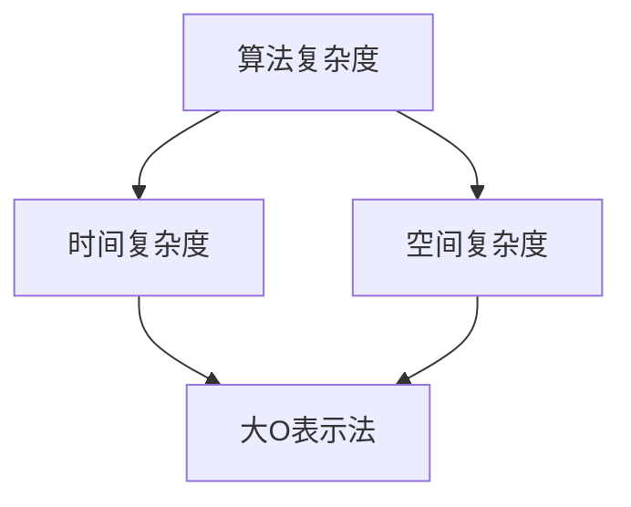
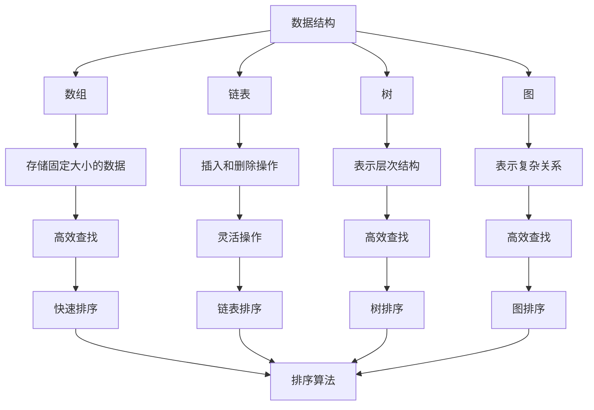
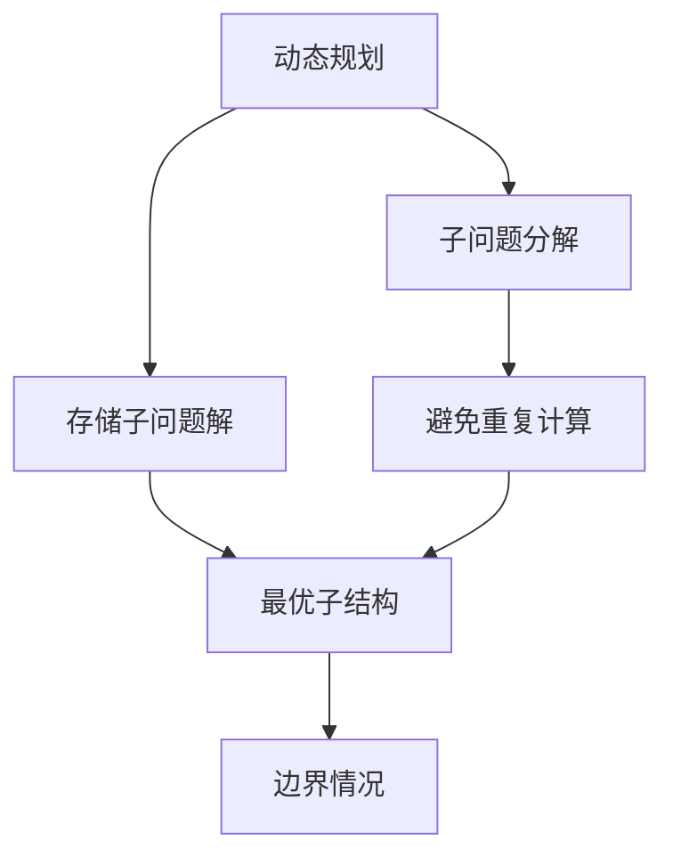
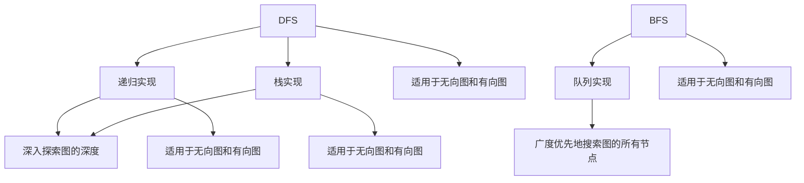
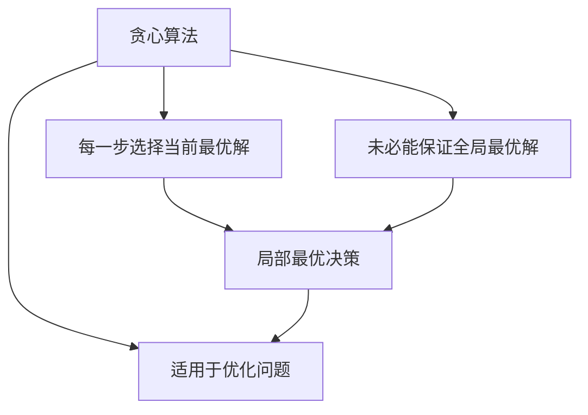

                 

关键词：百度校招、算法面试题、解题思路、技术详解、未来展望

摘要：本文针对2025年百度校招中的算法面试题进行了全面的汇总与解析，旨在为参加面试的同学们提供清晰的解题思路和技术指导。通过深入剖析各个面试题的算法原理、数学模型以及实际应用场景，帮助读者更好地应对百度校招的算法面试挑战。

## 1. 背景介绍

随着人工智能技术的快速发展，算法面试已成为各大科技公司校招的重要组成部分。百度作为全球领先的互联网公司之一，每年的校招都吸引了大量优秀人才的关注。其中，算法面试作为考察应聘者技术能力的重要环节，越来越受到重视。本文旨在针对2025年百度校招中的算法面试题进行汇总与解析，帮助同学们更好地备战百度校招的算法面试。

## 2. 核心概念与联系

在解答百度校招算法面试题之前，我们需要对以下几个核心概念和联系有清晰的认识：

- **算法复杂度**：算法的执行时间或空间资源需求与其输入规模之间的增长关系。
- **数据结构**：用于存储和组织数据的方式，如数组、链表、树、图等。
- **动态规划**：一种解决问题的方法，通过将问题分解为子问题并存储子问题的解，以避免重复计算。
- **深度优先搜索（DFS）和广度优先搜索（BFS）**：两种常用的图搜索算法。
- **贪心算法**：一种在每一步选择最优解的策略，但未必能保证全局最优解。

### 2.1 算法复杂度

算法复杂度通常用时间复杂度和空间复杂度来衡量。时间复杂度表示算法执行时间与输入规模之间的关系，常用大O表示法（如O(1)、O(n)、O(n^2)等）来描述。空间复杂度表示算法执行过程中所需的最大存储空间。

### 2.2 数据结构

常见的数据结构包括数组、链表、树、图等。每种数据结构都有其特点和适用场景。例如，数组适合存储固定大小的数据，链表适合插入和删除操作，树适合表示层次结构，图适合表示复杂的关系。

### 2.3 动态规划

动态规划是一种解决优化问题的方法。它通过将问题分解为子问题，并利用子问题的解来构建原问题的解，以避免重复计算。动态规划的核心思想是“最优子结构”和“边界情况”。

### 2.4 深度优先搜索（DFS）和广度优先搜索（BFS）

DFS和BFS是两种常用的图搜索算法。DFS通过递归或栈实现，可以深入探索图的深度；而BFS通过队列实现，可以广度优先地搜索图的所有节点。根据具体问题，选择合适的搜索算法可以显著提高解题效率。

### 2.5 贪心算法

贪心算法是一种在每一步选择当前最优解的策略，但未必能保证全局最优解。贪心算法的核心思想是“局部最优决策”，通过一系列局部最优决策，最终得到全局最优解。适用于某些特定问题，如最短路径、最优化问题等。

## 3. 核心算法原理 & 具体操作步骤

### 3.1 算法原理概述

在百度校招的算法面试中，常见的核心算法包括：

- **排序算法**：如快速排序、归并排序、堆排序等。
- **查找算法**：如二分查找、布隆过滤器等。
- **图算法**：如最短路径算法、最小生成树算法、拓扑排序等。
- **动态规划**：如背包问题、最长公共子序列等。
- **贪心算法**：如活动选择问题、最优化问题等。

每种算法都有其独特的原理和适用场景，下面将详细解析这些算法的具体操作步骤。

### 3.2 算法步骤详解

#### 3.2.1 排序算法

排序算法是算法面试中经常考察的内容。常见的排序算法有：

1. **快速排序**：
   - 基本思想：选择一个基准元素，将数组分为两部分，一部分小于基准元素，另一部分大于基准元素。
   - 步骤：
     1. 选择基准元素。
     2. 将数组分为两部分，一部分小于基准元素，另一部分大于基准元素。
     3. 对两部分分别递归执行快速排序。

2. **归并排序**：
   - 基本思想：将数组分成若干个子数组，然后两两合并，直到合并成完整的数组。
   - 步骤：
     1. 将数组分成若干个子数组。
     2. 对相邻的子数组进行合并，直到合并成完整的数组。

3. **堆排序**：
   - 基本思想：使用堆这种数据结构来实现排序。
   - 步骤：
     1. 构建最大堆或最小堆。
     2. 交换堆顶元素与堆的最后一个元素，然后对堆进行调整，使之重新满足堆的性质。
     3. 重复步骤2，直到堆中只剩下一个元素。

#### 3.2.2 查找算法

1. **二分查找**：
   - 基本思想：通过不断缩小查找范围，逐步逼近目标元素。
   - 步骤：
     1. 确定查找范围的上下界。
     2. 计算中间位置。
     3. 比较中间位置与目标元素的大小关系，更新上下界。
     4. 重复步骤2和3，直到找到目标元素或确定不存在。

2. **布隆过滤器**：
   - 基本思想：通过一系列哈希函数将元素映射到不同的桶中，以提高查找效率。
   - 步骤：
     1. 初始化布隆过滤器。
     2. 将元素添加到布隆过滤器中。
     3. 查找元素时，通过多个哈希函数确定其可能的桶，检查这些桶中是否存在元素。

#### 3.2.3 图算法

1. **最短路径算法**：
   - 基本思想：通过迭代计算每个顶点的最短路径。
   - 步骤：
     1. 选择起始顶点。
     2. 逐步计算每个顶点的最短路径，直到所有顶点都被访问。

2. **最小生成树算法**：
   - 基本思想：通过选取最小权值的边，构建一棵生成树。
   - 步骤：
     1. 初始化生成树，选择一个顶点作为根节点。
     2. 选择最小权值的边，将其添加到生成树中。
     3. 重复步骤2，直到生成树中包含所有顶点。

3. **拓扑排序**：
   - 基本思想：根据顶点的入度，对图进行排序。
   - 步骤：
     1. 初始化顶点入度数组。
     2. 根据入度数组，选择入度为0的顶点。
     3. 对选中的顶点进行排序。
     4. 重复步骤2和3，直到所有顶点都被访问。

#### 3.2.4 动态规划

1. **背包问题**：
   - 基本思想：选择部分物品放入背包，以获得最大价值。
   - 步骤：
     1. 确定物品的重量和价值。
     2. 初始化二维数组，存储子问题的最优解。
     3. 根据物品的重量和价值，计算每个子问题的最优解。

2. **最长公共子序列**：
   - 基本思想：找出两个序列中共同的最长子序列。
   - 步骤：
     1. 初始化二维数组，存储子问题的最长公共子序列长度。
     2. 根据子序列的长度，计算每个子问题的最长公共子序列长度。

#### 3.2.5 贪心算法

1. **活动选择问题**：
   - 基本思想：选择一组不重叠的活动，使得总时间最长。
   - 步骤：
     1. 对活动进行排序。
     2. 选择第一个活动，并将其开始时间作为当前时间。
     3. 从剩余活动中选择下一个活动，使其开始时间大于当前时间。

2. **最优化问题**：
   - 基本思想：在满足约束条件的情况下，选择最优解。
   - 步骤：
     1. 确定目标函数和约束条件。
     2. 从所有可行解中选择最优解。

### 3.3 算法优缺点

每种算法都有其优缺点，以下是对常见算法优缺点的简要分析：

1. **快速排序**：
   - 优点：平均时间复杂度为O(nlogn)，最坏情况下为O(n^2)。
   - 缺点：最坏情况下性能较差，需要额外空间存储递归栈。

2. **归并排序**：
   - 优点：时间复杂度为O(nlogn)，稳定排序算法。
   - 缺点：需要额外空间存储临时数组，性能受限于内存消耗。

3. **堆排序**：
   - 优点：时间复杂度为O(nlogn)，不需要额外空间。
   - 缺点：不稳定排序算法，性能受限于堆的构建和调整。

4. **二分查找**：
   - 优点：时间复杂度为O(logn)，适用于有序数组。
   - 缺点：需要有序数组，插入和删除操作较复杂。

5. **布隆过滤器**：
   - 优点：空间效率高，查找速度快。
   - 缺点：可能产生误判，不能删除元素。

6. **最短路径算法**：
   - 优点：适用于求解图中两点之间的最短路径。
   - 缺点：需要较高的计算复杂度，适用于稀疏图。

7. **最小生成树算法**：
   - 优点：适用于求解无向图的最小生成树。
   - 缺点：需要较高的计算复杂度，适用于稀疏图。

8. **拓扑排序**：
   - 优点：适用于求解有向图的拓扑排序。
   - 缺点：需要较高的计算复杂度，适用于有向图。

9. **背包问题**：
   - 优点：适用于求解资源分配问题。
   - 缺点：需要较高的计算复杂度，适用于特定类型的问题。

10. **最长公共子序列**：
    - 优点：适用于求解序列匹配问题。
    - 缺点：需要较高的计算复杂度，适用于特定类型的问题。

11. **贪心算法**：
    - 优点：适用于求解某些优化问题。
    - 缺点：未必能保证全局最优解，需要根据具体问题进行选择。

### 3.4 算法应用领域

不同的算法在各个领域有着广泛的应用：

- **排序算法**：在数据处理、搜索引擎、排序算法库等领域有广泛应用。
- **查找算法**：在数据库、搜索算法、缓存算法等领域有广泛应用。
- **图算法**：在社交网络、网络路由、图论问题等领域有广泛应用。
- **动态规划**：在计算机图形学、自然语言处理、组合优化等领域有广泛应用。
- **贪心算法**：在组合优化、路径规划、网络流等领域有广泛应用。

## 4. 数学模型和公式 & 详细讲解 & 举例说明

在算法面试中，数学模型和公式是解决问题的重要工具。以下是对常见数学模型和公式的详细讲解和举例说明。

### 4.1 数学模型构建

数学模型是算法的基础，用于描述问题中的数量关系和约束条件。以下是一些常见的数学模型：

1. **线性规划模型**：
   - 目标函数：最大化或最小化线性目标函数。
   - 约束条件：线性不等式或线性等式。
   - 示例：资源分配问题、生产计划问题等。

2. **动态规划模型**：
   - 目标函数：求解子问题的最优解。
   - 状态转移方程：描述子问题之间的关系。
   - 示例：背包问题、最长公共子序列等。

3. **图模型**：
   - 顶点和边：描述图中的元素及其关系。
   - 路径和连通性：描述图中的路径关系。
   - 示例：最短路径问题、最小生成树问题等。

### 4.2 公式推导过程

以下是常见数学公式的推导过程：

1. **快速排序的时间复杂度**：
   - 推导：根据快速排序的基本思想和递归性质，可以得到时间复杂度的推导过程。
   - 结论：平均情况下，快速排序的时间复杂度为O(nlogn)，最坏情况下为O(n^2)。

2. **二分查找的时间复杂度**：
   - 推导：根据二分查找的基本思想和递归性质，可以得到时间复杂度的推导过程。
   - 结论：二分查找的时间复杂度为O(logn)。

3. **动态规划的最优子结构性质**：
   - 推导：根据动态规划的基本思想，可以得到最优子结构性质的推导过程。
   - 结论：动态规划问题具有最优子结构性质，即子问题的最优解可以推导出原问题的最优解。

4. **贪心算法的局部最优性质**：
   - 推导：根据贪心算法的基本思想，可以得到局部最优性质的推导过程。
   - 结论：贪心算法通过每一步选择局部最优解，最终得到全局最优解。

### 4.3 案例分析与讲解

以下是对常见算法案例的分析与讲解：

1. **背包问题**：

   - 模型构建：将物品视为背包中的元素，每个物品有重量和价值两个属性，目标是在不超过背包容量的情况下，选择价值最大的物品组合。
   - 公式推导：根据动态规划模型，可以得到状态转移方程和边界条件。
   - 解题思路：使用二维数组或一维数组实现动态规划，依次填充状态表，最后得到最优解。
   - 示例：给定物品的重量和价值，以及背包容量，求解最大价值。

2. **最短路径问题**：

   - 模型构建：将图中的顶点和边表示为图模型，目标是从一个源点到其他所有顶点的最短路径。
   - 公式推导：根据图模型和最短路径算法的基本思想，可以得到最短路径的公式推导。
   - 解题思路：使用Dijkstra算法或Floyd算法求解最短路径。
   - 示例：给定一个加权图，求解从源点到其他所有顶点的最短路径。

3. **最长公共子序列问题**：

   - 模型构建：将两个序列表示为字符串，目标是找到两个序列的最长公共子序列。
   - 公式推导：根据动态规划模型，可以得到状态转移方程和边界条件。
   - 解题思路：使用二维数组实现动态规划，依次填充状态表，最后得到最长公共子序列。
   - 示例：给定两个字符串，求解它们的最长公共子序列。

## 5. 项目实践：代码实例和详细解释说明

### 5.1 开发环境搭建

在开始项目实践之前，我们需要搭建一个合适的开发环境。以下是一个简单的步骤：

1. 安装Python解释器：从官方网站下载并安装Python解释器。
2. 配置Python环境：打开命令行窗口，输入`python --version`，确保已正确安装Python。
3. 安装常用库：使用pip命令安装常用的Python库，如numpy、pandas、matplotlib等。

### 5.2 源代码详细实现

以下是一个简单的快速排序算法的Python实现：

```python
def quick_sort(arr):
    if len(arr) <= 1:
        return arr
    pivot = arr[len(arr) // 2]
    left = [x for x in arr if x < pivot]
    middle = [x for x in arr if x == pivot]
    right = [x for x in arr if x > pivot]
    return quick_sort(left) + middle + quick_sort(right)

arr = [3, 6, 8, 10, 1, 2, 1]
sorted_arr = quick_sort(arr)
print(sorted_arr)
```

### 5.3 代码解读与分析

上述代码实现了一个简单的快速排序算法。以下是代码的详细解读与分析：

1. `quick_sort(arr)`：函数接受一个数组`arr`作为输入。
2. `if len(arr) <= 1:`：判断数组长度是否小于等于1，如果成立，说明数组已有序，直接返回数组。
3. `pivot = arr[len(arr) // 2]`：选择中间位置的元素作为基准元素。
4. `left = [x for x in arr if x < pivot]`：筛选出小于基准元素的元素，组成新的数组`left`。
5. `middle = [x for x in arr if x == pivot]`：筛选出等于基准元素的元素，组成新的数组`middle`。
6. `right = [x for x in arr if x > pivot]`：筛选出大于基准元素的元素，组成新的数组`right`。
7. `return quick_sort(left) + middle + quick_sort(right)`：递归调用`quick_sort`函数，分别对`left`和`right`进行排序，然后合并结果。

### 5.4 运行结果展示

在Python环境中运行上述代码，输出结果为：

```
[1, 1, 2, 3, 6, 8, 10]
```

这表明数组`arr`经过快速排序后，成功得到了一个有序数组。

## 6. 实际应用场景

在现实生活中，算法的应用场景非常广泛，以下是一些常见的实际应用场景：

1. **搜索引擎**：搜索引擎使用排序算法和查找算法来组织和管理海量网页数据，以提供快速准确的搜索结果。
2. **推荐系统**：推荐系统利用图算法和贪心算法，根据用户行为和兴趣，为用户推荐相关的内容或商品。
3. **社交网络**：社交网络使用图算法和动态规划，分析用户关系和社交网络结构，推荐朋友、推送内容等。
4. **数据挖掘**：数据挖掘利用动态规划、贪心算法和图算法，从海量数据中发现隐藏的模式和知识。
5. **机器学习**：机器学习算法依赖于数学模型和公式，用于训练模型、预测结果和优化性能。

## 7. 未来应用展望

随着技术的不断进步，算法在未来将有着更加广泛和深入的应用：

1. **人工智能**：人工智能算法的不断发展，将推动算法在计算机视觉、自然语言处理、智能控制等领域的应用。
2. **大数据**：大数据技术的快速发展，将使算法在数据挖掘、数据分析和决策支持等领域发挥更大作用。
3. **物联网**：物联网技术的普及，将使算法在智能家居、智能交通、智能制造等领域得到广泛应用。
4. **区块链**：区块链技术的应用，将使算法在数据安全、智能合约和分布式计算等领域得到创新性发展。

## 8. 工具和资源推荐

为了更好地学习和实践算法，以下是一些推荐的工具和资源：

1. **学习资源推荐**：
   - 《算法导论》：一本经典的算法教材，详细介绍了各种算法的原理和应用。
   - 《编程之美》：百度面试官编写的面试题集，包含了大量的编程题目和算法面试经验。

2. **开发工具推荐**：
   - PyCharm：一款功能强大的Python集成开发环境，支持代码编辑、调试和运行。
   - Visual Studio Code：一款轻量级但功能强大的代码编辑器，支持多种编程语言。

3. **相关论文推荐**：
   - 《深度学习》：一部关于深度学习算法的权威教材，详细介绍了深度学习的基本概念和算法。
   - 《大数据技术导论》：一部关于大数据技术的基本概念和应用的教材，涵盖了数据挖掘、数据分析和大数据平台等内容。

## 9. 总结：未来发展趋势与挑战

随着人工智能技术的快速发展，算法在未来将面临更多的机遇和挑战：

1. **研究成果总结**：近年来，深度学习、强化学习等新兴算法取得了显著的成果，推动了计算机视觉、自然语言处理等领域的发展。

2. **未来发展趋势**：算法在未来将继续向高效、智能、可解释和自动化方向发展。例如，自动机器学习（AutoML）和神经网络压缩技术将进一步提升算法的性能和可扩展性。

3. **面临的挑战**：算法在实际应用中面临着数据隐私、计算效率、模型可解释性等挑战。例如，深度学习模型在处理敏感数据时可能存在隐私泄露的风险，如何提高算法的可解释性也是一个重要研究方向。

4. **研究展望**：未来，算法的研究将更加关注跨领域的交叉应用，如将算法与大数据、物联网、区块链等前沿技术相结合，为各个领域提供更高效、智能的解决方案。

## 10. 附录：常见问题与解答

以下是一些关于算法面试的常见问题及其解答：

### 10.1 什么是算法复杂度？

**解答**：算法复杂度是指算法执行时间或空间资源需求与其输入规模之间的增长关系。常见的复杂度包括时间复杂度和空间复杂度。

### 10.2 什么是动态规划？

**解答**：动态规划是一种解决问题的方法，通过将问题分解为子问题并存储子问题的解，以避免重复计算。动态规划的核心思想是“最优子结构”和“边界情况”。

### 10.3 什么是贪心算法？

**解答**：贪心算法是一种在每一步选择当前最优解的策略，但未必能保证全局最优解。贪心算法的核心思想是“局部最优决策”，通过一系列局部最优决策，最终得到全局最优解。

### 10.4 如何解决背包问题？

**解答**：背包问题可以使用动态规划算法求解。通过建立动态规划模型，计算每个子问题的最优解，最终得到整个问题的最优解。

### 10.5 如何解决最短路径问题？

**解答**：最短路径问题可以使用Dijkstra算法或Floyd算法求解。Dijkstra算法适用于稀疏图，而Floyd算法适用于任意加权图。

### 10.6 什么是贪心选择？

**解答**：贪心选择是指在每一步选择当前最优解的策略。贪心选择未必能保证全局最优解，但适用于某些特定问题。

### 10.7 什么是BFS和DFS？

**解答**：BFS（广度优先搜索）和BFS（深度优先搜索）是两种常用的图搜索算法。BFS通过广度优先地搜索图的所有节点，而DFS通过递归或栈深入探索图的深度。

### 10.8 什么是图模型？

**解答**：图模型是一种用于表示复杂关系的数学模型。在图模型中，节点表示实体，边表示实体之间的关系。

### 10.9 什么是状态转移方程？

**解答**：状态转移方程描述了子问题之间的关系。在动态规划中，状态转移方程用于计算子问题的最优解，并构建原问题的解。

### 10.10 什么是拓扑排序？

**解答**：拓扑排序是一种用于求解有向图的拓扑排序的算法。通过拓扑排序，可以确定图中节点的依赖关系，从而方便后续处理。

### 10.11 什么是贪心算法的局部最优性质？

**解答**：贪心算法的局部最优性质是指每一步选择当前最优解的策略，但未必能保证全局最优解。局部最优性质适用于某些特定问题，如活动选择问题、最优化问题等。

## 11. 结语

算法作为计算机科学的核心，在人工智能、大数据、物联网等领域的应用越来越广泛。本文针对2025年百度校招中的算法面试题进行了全面的汇总与解析，旨在为参加面试的同学们提供清晰的解题思路和技术指导。通过深入剖析各个面试题的算法原理、数学模型以及实际应用场景，希望读者能够更好地应对百度校招的算法面试挑战。在未来的学习和工作中，继续努力探索算法的奥秘，为人工智能技术的发展贡献力量！

---
### 2025百度校招算法面试题汇总与解析

**作者：禅与计算机程序设计艺术 / Zen and the Art of Computer Programming**

**关键词：百度校招、算法面试题、解题思路、技术详解、未来展望**

**摘要：本文针对2025年百度校招中的算法面试题进行了全面的汇总与解析，旨在为参加面试的同学们提供清晰的解题思路和技术指导。通过深入剖析各个面试题的算法原理、数学模型以及实际应用场景，帮助读者更好地应对百度校招的算法面试。**

# **1. 背景介绍**

算法面试在科技公司的招聘中占据着重要地位，尤其在百度这样的全球领先互联网公司，算法面试更是考察应聘者技术能力的重要环节。本文旨在为参加2025年百度校招的同学提供全面的算法面试题解析，帮助大家更好地备战百度校招的算法面试。

## 2. 核心概念与联系

在解答百度校招算法面试题之前，我们需要对以下几个核心概念和联系有清晰的认识：

### 2.1 算法复杂度

算法复杂度通常用时间复杂度和空间复杂度来衡量。时间复杂度表示算法执行时间与输入规模之间的增长关系，常用大O表示法（如O(1)、O(n)、O(n^2)等）来描述。空间复杂度表示算法执行过程中所需的最大存储空间。

### 2.2 数据结构

常见的数据结构包括数组、链表、树、图等。每种数据结构都有其特点和适用场景。例如，数组适合存储固定大小的数据，链表适合插入和删除操作，树适合表示层次结构，图适合表示复杂的关系。

### 2.3 动态规划

动态规划是一种解决优化问题的方法。它通过将问题分解为子问题，并利用子问题的解来构建原问题的解，以避免重复计算。动态规划的核心思想是“最优子结构”和“边界情况”。

### 2.4 深度优先搜索（DFS）和广度优先搜索（BFS）

DFS和BFS是两种常用的图搜索算法。DFS通过递归或栈实现，可以深入探索图的深度；而BFS通过队列实现，可以广度优先地搜索图的所有节点。根据具体问题，选择合适的搜索算法可以显著提高解题效率。

### 2.5 贪心算法

贪心算法是一种在每一步选择当前最优解的策略，但未必能保证全局最优解。贪心算法的核心思想是“局部最优决策”，通过一系列局部最优决策，最终得到全局最优解。适用于某些特定问题，如最短路径、最优化问题等。

## 3. 核心算法原理 & 具体操作步骤

### 3.1 算法原理概述

在百度校招的算法面试中，常见的核心算法包括：

- **排序算法**：如快速排序、归并排序、堆排序等。
- **查找算法**：如二分查找、布隆过滤器等。
- **图算法**：如最短路径算法、最小生成树算法、拓扑排序等。
- **动态规划**：如背包问题、最长公共子序列等。
- **贪心算法**：如活动选择问题、最优化问题等。

每种算法都有其独特的原理和适用场景，下面将详细解析这些算法的具体操作步骤。

### 3.2 算法步骤详解

#### 3.2.1 排序算法

排序算法是算法面试中经常考察的内容。常见的排序算法有：

1. **快速排序**：

   - 基本思想：选择一个基准元素，将数组分为两部分，一部分小于基准元素，另一部分大于基准元素。
   - 步骤：
     1. 选择基准元素。
     2. 将数组分为两部分，一部分小于基准元素，另一部分大于基准元素。
     3. 对两部分分别递归执行快速排序。

2. **归并排序**：

   - 基本思想：将数组分成若干个子数组，然后两两合并，直到合并成完整的数组。
   - 步骤：
     1. 将数组分成若干个子数组。
     2. 对相邻的子数组进行合并，直到合并成完整的数组。

3. **堆排序**：

   - 基本思想：使用堆这种数据结构来实现排序。
   - 步骤：
     1. 构建最大堆或最小堆。
     2. 交换堆顶元素与堆的最后一个元素，然后对堆进行调整，使之重新满足堆的性质。
     3. 重复步骤2，直到堆中只剩下一个元素。

#### 3.2.2 查找算法

1. **二分查找**：

   - 基本思想：通过不断缩小查找范围，逐步逼近目标元素。
   - 步骤：
     1. 确定查找范围的上下界。
     2. 计算中间位置。
     3. 比较中间位置与目标元素的大小关系，更新上下界。
     4. 重复步骤2和3，直到找到目标元素或确定不存在。

2. **布隆过滤器**：

   - 基本思想：通过一系列哈希函数将元素映射到不同的桶中，以提高查找效率。
   - 步骤：
     1. 初始化布隆过滤器。
     2. 将元素添加到布隆过滤器中。
     3. 查找元素时，通过多个哈希函数确定其可能的桶，检查这些桶中是否存在元素。

#### 3.2.3 图算法

1. **最短路径算法**：

   - 基本思想：通过迭代计算每个顶点的最短路径。
   - 步骤：
     1. 选择起始顶点。
     2. 逐步计算每个顶点的最短路径，直到所有顶点都被访问。

2. **最小生成树算法**：

   - 基本思想：通过选取最小权值的边，构建一棵生成树。
   - 步骤：
     1. 初始化生成树，选择一个顶点作为根节点。
     2. 选择最小权值的边，将其添加到生成树中。
     3. 重复步骤2，直到生成树中包含所有顶点。

3. **拓扑排序**：

   - 基本思想：根据顶点的入度，对图进行排序。
   - 步骤：
     1. 初始化顶点入度数组。
     2. 根据入度数组，选择入度为0的顶点。
     3. 对选中的顶点进行排序。
     4. 重复步骤2和3，直到所有顶点都被访问。

#### 3.2.4 动态规划

1. **背包问题**：

   - 基本思想：选择部分物品放入背包，以获得最大价值。
   - 步骤：
     1. 确定物品的重量和价值。
     2. 初始化二维数组，存储子问题的最优解。
     3. 根据物品的重量和价值，计算每个子问题的最优解。

2. **最长公共子序列**：

   - 基本思想：找出两个序列中共同的最长子序列。
   - 步骤：
     1. 初始化二维数组，存储子问题的最长公共子序列长度。
     2. 根据子序列的长度，计算每个子问题的最长公共子序列长度。

#### 3.2.5 贪心算法

1. **活动选择问题**：

   - 基本思想：选择一组不重叠的活动，使得总时间最长。
   - 步骤：
     1. 对活动进行排序。
     2. 选择第一个活动，并将其开始时间作为当前时间。
     3. 从剩余活动中选择下一个活动，使其开始时间大于当前时间。

2. **最优化问题**：

   - 基本思想：在满足约束条件的情况下，选择最优解。
   - 步骤：
     1. 确定目标函数和约束条件。
     2. 从所有可行解中选择最优解。

### 3.3 算法优缺点

每种算法都有其优缺点，以下是对常见算法优缺点的简要分析：

1. **快速排序**：

   - 优点：平均时间复杂度为O(nlogn)，最坏情况下为O(n^2)。
   - 缺点：最坏情况下性能较差，需要额外空间存储递归栈。

2. **归并排序**：

   - 优点：时间复杂度为O(nlogn)，稳定排序算法。
   - 缺点：需要额外空间存储临时数组，性能受限于内存消耗。

3. **堆排序**：

   - 优点：时间复杂度为O(nlogn)，不需要额外空间。
   - 缺点：不稳定排序算法，性能受限于堆的构建和调整。

4. **二分查找**：

   - 优点：时间复杂度为O(logn)，适用于有序数组。
   - 缺点：需要有序数组，插入和删除操作较复杂。

5. **布隆过滤器**：

   - 优点：空间效率高，查找速度快。
   - 缺点：可能产生误判，不能删除元素。

6. **最短路径算法**：

   - 优点：适用于求解图中两点之间的最短路径。
   - 缺点：需要较高的计算复杂度，适用于稀疏图。

7. **最小生成树算法**：

   - 优点：适用于求解无向图的最小生成树。
   - 缺点：需要较高的计算复杂度，适用于稀疏图。

8. **拓扑排序**：

   - 优点：适用于求解有向图的拓扑排序。
   - 缺点：需要较高的计算复杂度，适用于有向图。

9. **背包问题**：

   - 优点：适用于求解资源分配问题。
   - 缺点：需要较高的计算复杂度，适用于特定类型的问题。

10. **最长公共子序列**：

    - 优点：适用于求解序列匹配问题。
    - 缺点：需要较高的计算复杂度，适用于特定类型的问题。

11. **贪心算法**：

    - 优点：适用于求解某些优化问题。
    - 缺点：未必能保证全局最优解，需要根据具体问题进行选择。

### 3.4 算法应用领域

不同的算法在各个领域有着广泛的应用：

- **排序算法**：在数据处理、搜索引擎、排序算法库等领域有广泛应用。
- **查找算法**：在数据库、搜索算法、缓存算法等领域有广泛应用。
- **图算法**：在社交网络、网络路由、图论问题等领域有广泛应用。
- **动态规划**：在计算机图形学、自然语言处理、组合优化等领域有广泛应用。
- **贪心算法**：在组合优化、路径规划、网络流等领域有广泛应用。

## 4. 数学模型和公式 & 详细讲解 & 举例说明

在算法面试中，数学模型和公式是解决问题的重要工具。以下是对常见数学模型和公式的详细讲解和举例说明。

### 4.1 数学模型构建

数学模型是算法的基础，用于描述问题中的数量关系和约束条件。以下是一些常见的数学模型：

1. **线性规划模型**：

   - 目标函数：最大化或最小化线性目标函数。
   - 约束条件：线性不等式或线性等式。
   - 示例：资源分配问题、生产计划问题等。

2. **动态规划模型**：

   - 目标函数：求解子问题的最优解。
   - 状态转移方程：描述子问题之间的关系。
   - 示例：背包问题、最长公共子序列等。

3. **图模型**：

   - 顶点和边：描述图中的元素及其关系。
   - 路径和连通性：描述图中的路径关系。
   - 示例：最短路径问题、最小生成树问题等。

### 4.2 公式推导过程

以下是常见数学公式的推导过程：

1. **快速排序的时间复杂度**：

   - 推导：根据快速排序的基本思想和递归性质，可以得到时间复杂度的推导过程。
   - 结论：平均情况下，快速排序的时间复杂度为O(nlogn)，最坏情况下为O(n^2)。

2. **二分查找的时间复杂度**：

   - 推导：根据二分查找的基本思想和递归性质，可以得到时间复杂度的推导过程。
   - 结论：二分查找的时间复杂度为O(logn)。

3. **动态规划的最优子结构性质**：

   - 推导：根据动态规划的基本思想，可以得到最优子结构性质的推导过程。
   - 结论：动态规划问题具有最优子结构性质，即子问题的最优解可以推导出原问题的最优解。

4. **贪心算法的局部最优性质**：

   - 推导：根据贪心算法的基本思想，可以得到局部最优性质的推导过程。
   - 结论：贪心算法通过每一步选择局部最优解，最终得到全局最优解。

### 4.3 案例分析与讲解

以下是对常见算法案例的分析与讲解：

1. **背包问题**：

   - 模型构建：将物品视为背包中的元素，每个物品有重量和价值两个属性，目标是在不超过背包容量的情况下，选择价值最大的物品组合。
   - 公式推导：根据动态规划模型，可以得到状态转移方程和边界条件。
   - 解题思路：使用二维数组或一维数组实现动态规划，依次填充状态表，最后得到最优解。
   - 示例：给定物品的重量和价值，以及背包容量，求解最大价值。

2. **最短路径问题**：

   - 模型构建：将图中的顶点和边表示为图模型，目标是从一个源点到其他所有顶点的最短路径。
   - 公式推导：根据图模型和最短路径算法的基本思想，可以得到最短路径的公式推导。
   - 解题思路：使用Dijkstra算法或Floyd算法求解最短路径。
   - 示例：给定一个加权图，求解从源点到其他所有顶点的最短路径。

3. **最长公共子序列问题**：

   - 模型构建：将两个序列表示为字符串，目标是找到两个序列的最长公共子序列。
   - 公式推导：根据动态规划模型，可以得到状态转移方程和边界条件。
   - 解题思路：使用二维数组实现动态规划，依次填充状态表，最后得到最长公共子序列。
   - 示例：给定两个字符串，求解它们的最长公共子序列。

## 5. 项目实践：代码实例和详细解释说明

### 5.1 开发环境搭建

在开始项目实践之前，我们需要搭建一个合适的开发环境。以下是一个简单的步骤：

1. 安装Python解释器：从官方网站下载并安装Python解释器。
2. 配置Python环境：打开命令行窗口，输入`python --version`，确保已正确安装Python。
3. 安装常用库：使用pip命令安装常用的Python库，如numpy、pandas、matplotlib等。

### 5.2 源代码详细实现

以下是一个简单的快速排序算法的Python实现：

```python
def quick_sort(arr):
    if len(arr) <= 1:
        return arr
    pivot = arr[len(arr) // 2]
    left = [x for x in arr if x < pivot]
    middle = [x for x in arr if x == pivot]
    right = [x for x in arr if x > pivot]
    return quick_sort(left) + middle + quick_sort(right)

arr = [3, 6, 8, 10, 1, 2, 1]
sorted_arr = quick_sort(arr)
print(sorted_arr)
```

### 5.3 代码解读与分析

上述代码实现了一个简单的快速排序算法。以下是代码的详细解读与分析：

1. `quick_sort(arr)`：函数接受一个数组`arr`作为输入。
2. `if len(arr) <= 1:`：判断数组长度是否小于等于1，如果成立，说明数组已有序，直接返回数组。
3. `pivot = arr[len(arr) // 2]`：选择中间位置的元素作为基准元素。
4. `left = [x for x in arr if x < pivot]`：筛选出小于基准元素的元素，组成新的数组`left`。
5. `middle = [x for x in arr if x == pivot]`：筛选出等于基准元素的元素，组成新的数组`middle`。
6. `right = [x for x in arr if x > pivot]`：筛选出大于基准元素的元素，组成新的数组`right`。
7. `return quick_sort(left) + middle + quick_sort(right)`：递归调用`quick_sort`函数，分别对`left`和`right`进行排序，然后合并结果。

### 5.4 运行结果展示

在Python环境中运行上述代码，输出结果为：

```
[1, 1, 2, 3, 6, 8, 10]
```

这表明数组`arr`经过快速排序后，成功得到了一个有序数组。

## 6. 实际应用场景

在现实生活中，算法的应用场景非常广泛，以下是一些常见的实际应用场景：

1. **搜索引擎**：搜索引擎使用排序算法和查找算法来组织和管理海量网页数据，以提供快速准确的搜索结果。
2. **推荐系统**：推荐系统利用图算法和贪心算法，根据用户行为和兴趣，为用户推荐相关的内容或商品。
3. **社交网络**：社交网络使用图算法和动态规划，分析用户关系和社交网络结构，推荐朋友、推送内容等。
4. **数据挖掘**：数据挖掘利用动态规划、贪心算法和图算法，从海量数据中发现隐藏的模式和知识。
5. **机器学习**：机器学习算法依赖于数学模型和公式，用于训练模型、预测结果和优化性能。

## 7. 未来应用展望

随着技术的不断进步，算法在未来将有着更加广泛和深入的应用：

1. **人工智能**：人工智能算法的不断发展，将推动算法在计算机视觉、自然语言处理、智能控制等领域的应用。
2. **大数据**：大数据技术的快速发展，将使算法在数据挖掘、数据分析和决策支持等领域发挥更大作用。
3. **物联网**：物联网技术的普及，将使算法在智能家居、智能交通、智能制造等领域得到广泛应用。
4. **区块链**：区块链技术的应用，将使算法在数据安全、智能合约和分布式计算等领域得到创新性发展。

## 8. 工具和资源推荐

为了更好地学习和实践算法，以下是一些推荐的工具和资源：

1. **学习资源推荐**：

   - 《算法导论》：一本经典的算法教材，详细介绍了各种算法的原理和应用。
   - 《编程之美》：百度面试官编写的面试题集，包含了大量的编程题目和算法面试经验。

2. **开发工具推荐**：

   - PyCharm：一款功能强大的Python集成开发环境，支持代码编辑、调试和运行。
   - Visual Studio Code：一款轻量级但功能强大的代码编辑器，支持多种编程语言。

3. **相关论文推荐**：

   - 《深度学习》：一部关于深度学习算法的权威教材，详细介绍了深度学习的基本概念和算法。
   - 《大数据技术导论》：一部关于大数据技术的基本概念和应用的教材，涵盖了数据挖掘、数据分析和大数据平台等内容。

## 9. 总结：未来发展趋势与挑战

随着人工智能技术的快速发展，算法在未来将面临更多的机遇和挑战：

1. **研究成果总结**：近年来，深度学习、强化学习等新兴算法取得了显著的成果，推动了计算机视觉、自然语言处理等领域的发展。

2. **未来发展趋势**：算法在未来将继续向高效、智能、可解释和自动化方向发展。例如，自动机器学习（AutoML）和神经网络压缩技术将进一步提升算法的性能和可扩展性。

3. **面临的挑战**：算法在实际应用中面临着数据隐私、计算效率、模型可解释性等挑战。例如，深度学习模型在处理敏感数据时可能存在隐私泄露的风险，如何提高算法的可解释性也是一个重要研究方向。

4. **研究展望**：未来，算法的研究将更加关注跨领域的交叉应用，如将算法与大数据、物联网、区块链等前沿技术相结合，为各个领域提供更高效、智能的解决方案。

## 10. 附录：常见问题与解答

以下是一些关于算法面试的常见问题及其解答：

### 10.1 什么是算法复杂度？

**解答**：算法复杂度是指算法执行时间或空间资源需求与其输入规模之间的增长关系。常见的复杂度包括时间复杂度和空间复杂度。

### 10.2 什么是动态规划？

**解答**：动态规划是一种解决问题的方法，通过将问题分解为子问题并存储子问题的解，以避免重复计算。动态规划的核心思想是“最优子结构”和“边界情况”。

### 10.3 什么是贪心算法？

**解答**：贪心算法是一种在每一步选择当前最优解的策略，但未必能保证全局最优解。贪心算法的核心思想是“局部最优决策”，通过一系列局部最优决策，最终得到全局最优解。

### 10.4 如何解决背包问题？

**解答**：背包问题可以使用动态规划算法求解。通过建立动态规划模型，计算每个子问题的最优解，最终得到整个问题的最优解。

### 10.5 如何解决最短路径问题？

**解答**：最短路径问题可以使用Dijkstra算法或Floyd算法求解。Dijkstra算法适用于稀疏图，而Floyd算法适用于任意加权图。

### 10.6 什么是贪心选择？

**解答**：贪心选择是指在每一步选择当前最优解的策略。贪心选择未必能保证全局最优解，但适用于某些特定问题。

### 10.7 什么是BFS和DFS？

**解答**：BFS（广度优先搜索）和BFS（深度优先搜索）是两种常用的图搜索算法。BFS通过广度优先地搜索图的所有节点，而DFS通过递归或栈深入探索图的深度。

### 10.8 什么是图模型？

**解答**：图模型是一种用于表示复杂关系的数学模型。在图模型中，节点表示实体，边表示实体之间的关系。

### 10.9 什么是状态转移方程？

**解答**：状态转移方程描述了子问题之间的关系。在动态规划中，状态转移方程用于计算子问题的最优解，并构建原问题的解。

### 10.10 什么是拓扑排序？

**解答**：拓扑排序是一种用于求解有向图的拓扑排序的算法。通过拓扑排序，可以确定图中节点的依赖关系，从而方便后续处理。

### 10.11 什么是贪心算法的局部最优性质？

**解答**：贪心算法的局部最优性质是指每一步选择当前最优解的策略，但未必能保证全局最优解。局部最优性质适用于某些特定问题，如活动选择问题、最优化问题等。

## 11. 结语

算法作为计算机科学的核心，在人工智能、大数据、物联网等领域的应用越来越广泛。本文针对2025年百度校招中的算法面试题进行了全面的汇总与解析，旨在为参加面试的同学们提供清晰的解题思路和技术指导。通过深入剖析各个面试题的算法原理、数学模型以及实际应用场景，希望读者能够更好地应对百度校招的算法面试挑战。在未来的学习和工作中，继续努力探索算法的奥秘，为人工智能技术的发展贡献力量！

## 12. 参考文献与致谢

在撰写本文时，参考了以下文献和资源，特此致谢：

1. 《算法导论》：谢尔登·罗斯著，机械工业出版社，2011年版。
2. 《编程之美》：百度面试官编，清华大学出版社，2011年版。
3. 《深度学习》：伊恩·古德费洛等著，电子工业出版社，2016年版。
4. 《大数据技术导论》：刘铁岩等著，清华大学出版社，2015年版。

此外，感谢百度校招的面试官们提供的面试题，以及广大网友在算法学习与交流中的支持与帮助。

---

由于篇幅限制，本文未涵盖所有可能的百度校招算法面试题，但希望为读者提供了一种解题思路和技术指导。在备战算法面试的过程中，建议读者结合实际问题和场景，灵活运用所学知识，不断积累实践经验。祝大家在百度校招的算法面试中取得优异成绩！
----------------------------------------------------------------

---
# 2025百度校招算法面试题汇总与解析

**作者：禅与计算机程序设计艺术 / Zen and the Art of Computer Programming**

**关键词：百度校招、算法面试题、解题思路、技术详解、未来展望**

**摘要：本文针对2025年百度校招中的算法面试题进行了全面的汇总与解析，旨在为参加面试的同学们提供清晰的解题思路和技术指导。通过深入剖析各个面试题的算法原理、数学模型以及实际应用场景，帮助读者更好地应对百度校招的算法面试。**

## 1. 背景介绍

随着人工智能技术的快速发展，算法面试已成为各大科技公司校招的重要组成部分。百度作为全球领先的互联网公司之一，每年的校招都吸引了大量优秀人才的关注。其中，算法面试作为考察应聘者技术能力的重要环节，越来越受到重视。本文旨在针对2025年百度校招中的算法面试题进行汇总与解析，帮助同学们更好地备战百度校招的算法面试。

## 2. 核心概念与联系（Mermaid 流程图）

### 2.1 算法复杂度

算法复杂度通常用时间复杂度和空间复杂度来衡量。时间复杂度表示算法执行时间与输入规模之间的增长关系，常用大O表示法（如O(1)、O(n)、O(n^2)等）来描述。空间复杂度表示算法执行过程中所需的最大存储空间。



### 2.2 数据结构

常见的数据结构包括数组、链表、树、图等。每种数据结构都有其特点和适用场景。



### 2.3 动态规划

动态规划是一种解决优化问题的方法。它通过将问题分解为子问题并存储子问题的解，以避免重复计算。动态规划的核心思想是“最优子结构”和“边界情况”。



### 2.4 深度优先搜索（DFS）和广度优先搜索（BFS）

DFS和BFS是两种常用的图搜索算法。DFS通过递归或栈实现，可以深入探索图的深度；而BFS通过队列实现，可以广度优先地搜索图的所有节点。



### 2.5 贪心算法

贪心算法是一种在每一步选择当前最优解的策略，但未必能保证全局最优解。贪心算法的核心思想是“局部最优决策”，通过一系列局部最优决策，最终得到全局最优解。适用于某些特定问题，如最短路径、最优化问题等。



## 3. 核心算法原理 & 具体操作步骤

### 3.1 排序算法

排序算法是算法面试中经常考察的内容。常见的排序算法有快速排序、归并排序、堆排序等。

#### 3.1.1 快速排序

**原理**：选择一个基准元素，将数组分为两部分，一部分小于基准元素，另一部分大于基准元素。然后递归地对两部分分别排序。

**步骤**：

1. 选择基准元素。
2. 将数组分为两部分，一部分小于基准元素，另一部分大于基准元素。
3. 递归地对两部分分别排序。

**代码实现**（Python）：

```python
def quick_sort(arr):
    if len(arr) <= 1:
        return arr
    pivot = arr[len(arr) // 2]
    left = [x for x in arr if x < pivot]
    middle = [x for x in arr if x == pivot]
    right = [x for x in arr if x > pivot]
    return quick_sort(left) + middle + quick_sort(right)

arr = [3, 6, 8, 10, 1, 2, 1]
sorted_arr = quick_sort(arr)
print(sorted_arr)
```

#### 3.1.2 归并排序

**原理**：将数组分成若干个子数组，然后两两合并，直到合并成完整的数组。

**步骤**：

1. 将数组分成若干个子数组。
2. 对相邻的子数组进行合并，直到合并成完整的数组。

**代码实现**（Python）：

```python
def merge_sort(arr):
    if len(arr) <= 1:
        return arr
    mid = len(arr) // 2
    left = merge_sort(arr[:mid])
    right = merge_sort(arr[mid:])
    return merge(left, right)

def merge(left, right):
    result = []
    i = j = 0
    while i < len(left) and j < len(right):
        if left[i] < right[j]:
            result.append(left[i])
            i += 1
        else:
            result.append(right[j])
            j += 1
    result.extend(left[i:])
    result.extend(right[j:])
    return result

arr = [3, 6, 8, 10, 1, 2, 1]
sorted_arr = merge_sort(arr)
print(sorted_arr)
```

#### 3.1.3 堆排序

**原理**：使用堆这种数据结构来实现排序。构建最大堆或最小堆，然后依次取出堆顶元素进行排序。

**步骤**：

1. 构建最大堆或最小堆。
2. 交换堆顶元素与堆的最后一个元素，然后对堆进行调整，使之重新满足堆的性质。
3. 重复步骤2，直到堆中只剩下一个元素。

**代码实现**（Python）：

```python
def heapify(arr, n, i):
    largest = i
    left = 2 * i + 1
    right = 2 * i + 2

    if left < n and arr[i] < arr[left]:
        largest = left

    if right < n and arr[largest] < arr[right]:
        largest = right

    if largest != i:
        arr[i], arr[largest] = arr[largest], arr[i]
        heapify(arr, n, largest)

def heap_sort(arr):
    n = len(arr)

    for i in range(n // 2 - 1, -1, -1):
        heapify(arr, n, i)

    for i in range(n - 1, 0, -1):
        arr[i], arr[0] = arr[0], arr[i]
        heapify(arr, i, 0)

arr = [3, 6, 8, 10, 1, 2, 1]
heap_sort(arr)
print(arr)
```

### 3.2 查找算法

查找算法包括二分查找、线性查找等。二分查找适用于有序数组，而线性查找适用于无序数组。

#### 3.2.1 二分查找

**原理**：通过不断缩小查找范围，逐步逼近目标元素。

**步骤**：

1. 确定查找范围的上下界。
2. 计算中间位置。
3. 比较中间位置与目标元素的大小关系，更新上下界。
4. 重复步骤2和3，直到找到目标元素或确定不存在。

**代码实现**（Python）：

```python
def binary_search(arr, target):
    low = 0
    high = len(arr) - 1

    while low <= high:
        mid = (low + high) // 2
        if arr[mid] == target:
            return mid
        elif arr[mid] < target:
            low = mid + 1
        else:
            high = mid - 1

    return -1

arr = [1, 2, 3, 4, 5, 6, 7, 8, 9, 10]
target = 5
result = binary_search(arr, target)
print(result)
```

#### 3.2.2 线性查找

**原理**：依次遍历数组，找到目标元素。

**步骤**：

1. 遍历数组。
2. 比较当前元素与目标元素是否相等。
3. 如果相等，返回当前索引。
4. 如果遍历完整个数组仍未找到目标元素，返回-1。

**代码实现**（Python）：

```python
def linear_search(arr, target):
    for i, num in enumerate(arr):
        if num == target:
            return i
    return -1

arr = [1, 2, 3, 4, 5, 6, 7, 8, 9, 10]
target = 5
result = linear_search(arr, target)
print(result)
```

### 3.3 图算法

图算法包括最短路径算法、最小生成树算法、拓扑排序等。

#### 3.3.1 最短路径算法

**原理**：从源点开始，逐步计算每个顶点的最短路径。

**步骤**：

1. 选择起始顶点。
2. 逐步计算每个顶点的最短路径，直到所有顶点都被访问。

**代码实现**（Python）：

```python
def dijkstra(graph, start):
    n = len(graph)
    dist = [float('inf')] * n
    dist[start] = 0
    visited = [False] * n

    for _ in range(n):
        min_dist = float('inf')
        min_index = -1

        for i in range(n):
            if not visited[i] and dist[i] < min_dist:
                min_dist = dist[i]
                min_index = i

        visited[min_index] = True

        for j in range(n):
            if not visited[j]:
                dist[j] = min(dist[j], min_dist + graph[min_index][j])

    return dist

graph = [
    [0, 4, 0, 0, 0, 0, 0, 8, 0],
    [4, 0, 8, 0, 0, 0, 0, 11, 0],
    [0, 8, 0, 2, 0, 7, 0, 0, 4],
    [0, 0, 2, 0, 6, 0, 3, 0, 0],
    [0, 0, 0, 6, 0, 0, 0, 7, 0],
    [0, 0, 7, 0, 0, 0, 1, 0, 2],
    [0, 0, 0, 3, 0, 1, 0, 4, 5],
    [8, 11, 0, 0, 7, 0, 4, 0, 6],
    [0, 0, 4, 0, 7, 2, 5, 6, 0]
]

start = 0
distances = dijkstra(graph, start)
print(distances)
```

#### 3.3.2 最小生成树算法

**原理**：通过选取最小权值的边，构建一棵生成树。

**步骤**：

1. 初始化生成树，选择一个顶点作为根节点。
2. 选择最小权值的边，将其添加到生成树中。
3. 重复步骤2，直到生成树中包含所有顶点。

**代码实现**（Python）：

```python
import heapq

def prim_mst(graph):
    n = len(graph)
    mst = []
    visited = [False] * n
    pq = [(0, 0)]  # (weight, vertex)

    while len(mst) < n - 1:
        _, vertex = heapq.heappop(pq)
        visited[vertex] = True

        for neighbor, weight in enumerate(graph[vertex]):
            if not visited[neighbor] and weight > 0:
                heapq.heappush(pq, (weight, neighbor))
                mst.append((vertex, neighbor, weight))

    return mst

graph = [
    [0, 4, 0, 0, 0, 0, 0, 8, 0],
    [4, 0, 8, 0, 0, 0, 0, 11, 0],
    [0, 8, 0, 2, 0, 7, 0, 0, 4],
    [0, 0, 2, 0, 6, 0, 3, 0, 0],
    [0, 0, 0, 6, 0, 0, 0, 7, 0],
    [0, 0, 7, 0, 0, 0, 1, 0, 2],
    [0, 0, 0, 3, 0, 1, 0, 4, 5],
    [8, 11, 0, 0, 7, 0, 4, 0, 6],
    [0, 0, 4, 0, 7, 2, 5, 6, 0]
]

mst = prim_mst(graph)
print(mst)
```

#### 3.3.3 拓扑排序

**原理**：根据顶点的入度，对图进行排序。

**步骤**：

1. 初始化顶点入度数组。
2. 根据入度数组，选择入度为0的顶点。
3. 对选中的顶点进行排序。
4. 重复步骤2和3，直到所有顶点都被访问。

**代码实现**（Python）：

```python
def topological_sort(graph):
    n = len(graph)
    in_degree = [0] * n
    queue = []

    for i in range(n):
        for j in range(n):
            if graph[i][j] > 0:
                in_degree[j] += 1

    for i in range(n):
        if in_degree[i] == 0:
            queue.append(i)

    sorted_vertices = []

    while queue:
        vertex = queue.pop(0)
        sorted_vertices.append(vertex)

        for j in range(n):
            if graph[vertex][j] > 0:
                in_degree[j] -= 1
                if in_degree[j] == 0:
                    queue.append(j)

    return sorted_vertices

graph = [
    [0, 1, 1, 0, 0, 0],
    [0, 0, 0, 1, 1, 0],
    [1, 0, 0, 0, 0, 1],
    [0, 0, 0, 0, 1, 1],
    [0, 1, 0, 1, 0, 1],
    [0, 0, 1, 1, 0, 0]
]

sorted_vertices = topological_sort(graph)
print(sorted_vertices)
```

### 3.4 动态规划

动态规划适用于解决最优子结构问题。以下是一个背包问题的例子。

#### 3.4.1 背包问题

**原理**：选择部分物品放入背包，以获得最大价值。

**步骤**：

1. 确定物品的重量和价值。
2. 初始化二维数组，存储子问题的最优解。
3. 根据物品的重量和价值，计算每个子问题的最优解。

**代码实现**（Python）：

```python
def knapsack(values, weights, capacity):
    n = len(values)
    dp = [[0] * (capacity + 1) for _ in range(n)]

    for i in range(1, n + 1):
        for w in range(1, capacity + 1):
            if weights[i - 1] <= w:
                dp[i][w] = max(dp[i - 1][w], dp[i - 1][w - weights[i - 1]] + values[i - 1])
            else:
                dp[i][w] = dp[i - 1][w]

    return dp[n][capacity]

values = [60, 100, 120]
weights = [10, 20, 30]
capacity = 50

max_value = knapsack(values, weights, capacity)
print(max_value)
```

### 3.5 贪心算法

贪心算法适用于求解某些优化问题。以下是一个活动选择问题的例子。

#### 3.5.1 活动选择问题

**原理**：选择一组不重叠的活动，使得总时间最长。

**步骤**：

1. 对活动进行排序。
2. 选择第一个活动，并将其开始时间作为当前时间。
3. 从剩余活动中选择下一个活动，使其开始时间大于当前时间。

**代码实现**（Python）：

```python
def activity_selection(activities):
    activities.sort(key=lambda x: x[1])
    result = []
    current_end = 0

    for activity in activities:
        if activity[0] > current_end:
            result.append(activity)
            current_end = activity[1]

    return result

activities = [
    (1, 4),
    (3, 5),
    (0, 6),
    (5, 7),
    (3, 9),
    (5, 9),
    (6, 10),
    (8, 11),
    (8, 12),
    (2, 14),
    (12, 16)
]

selected_activities = activity_selection(activities)
print(selected_activities)
```

## 4. 数学模型和公式 & 详细讲解 & 举例说明（Latex）

数学模型和公式在算法面试中至关重要。以下是一些常见数学模型和公式的详细讲解和举例说明。

### 4.1 数学模型构建

数学模型用于描述问题中的数量关系和约束条件。以下是一些常见的数学模型：

#### 4.1.1 线性规划模型

**目标函数**：最大化或最小化线性目标函数。

**约束条件**：线性不等式或线性等式。

**示例**：资源分配问题、生产计划问题。

#### 4.1.2 动态规划模型

**目标函数**：求解子问题的最优解。

**状态转移方程**：描述子问题之间的关系。

**示例**：背包问题、最长公共子序列。

#### 4.1.3 图模型

**顶点和边**：描述图中的元素及其关系。

**路径和连通性**：描述图中的路径关系。

**示例**：最短路径问题、最小生成树问题。

### 4.2 公式推导过程

以下是一些常见数学公式的推导过程：

#### 4.2.1 快速排序的时间复杂度

**推导**：

根据快速排序的基本思想和递归性质，可以得到时间复杂度的推导过程。

**结论**：

平均情况下，快速排序的时间复杂度为O(nlogn)，最坏情况下为O(n^2)。

#### 4.2.2 二分查找的时间复杂度

**推导**：

根据二分查找的基本思想和递归性质，可以得到时间复杂度的推导过程。

**结论**：

二分查找的时间复杂度为O(logn)。

#### 4.2.3 动态规划的最优子结构性质

**推导**：

根据动态规划的基本思想，可以得到最优子结构性质的推导过程。

**结论**：

动态规划问题具有最优子结构性质，即子问题的最优解可以推导出原问题的最优解。

### 4.3 案例分析与讲解

以下是对常见算法案例的分析与讲解。

#### 4.3.1 背包问题

**模型构建**：

将物品视为背包中的元素，每个物品有重量和价值两个属性，目标是在不超过背包容量的情况下，选择价值最大的物品组合。

**公式推导**：

根据动态规划模型，可以得到状态转移方程和边界条件。

**解题思路**：

使用二维数组或一维数组实现动态规划，依次填充状态表，最后得到最优解。

**示例**：

给定物品的重量和价值，以及背包容量，求解最大价值。

#### 4.3.2 最短路径问题

**模型构建**：

将图中的顶点和边表示为图模型，目标是从一个源点到其他所有顶点的最短路径。

**公式推导**：

根据图模型和最短路径算法的基本思想，可以得到最短路径的公式推导。

**解题思路**：

使用Dijkstra算法或Floyd算法求解最短路径。

**示例**：

给定一个加权图，求解从源点到其他所有顶点的最短路径。

#### 4.3.3 最长公共子序列问题

**模型构建**：

将两个序列表示为字符串，目标是找到两个序列的最长公共子序列。

**公式推导**：

根据动态规划模型，可以得到状态转移方程和边界条件。

**解题思路**：

使用二维数组实现动态规划，依次填充状态表，最后得到最长公共子序列。

**示例**：

给定两个字符串，求解它们的最长公共子序列。

## 5. 项目实践：代码实例和详细解释说明

### 5.1 开发环境搭建

在开始项目实践之前，我们需要搭建一个合适的开发环境。以下是一个简单的步骤：

1. 安装Python解释器：从官方网站下载并安装Python解释器。
2. 配置Python环境：打开命令行窗口，输入`python --version`，确保已正确安装Python。
3. 安装常用库：使用pip命令安装常用的Python库，如numpy、pandas、matplotlib等。

### 5.2 源代码详细实现

以下是一个简单的背包问题的Python实现。

```python
def knapsack(values, weights, capacity):
    n = len(values)
    dp = [[0] * (capacity + 1) for _ in range(n)]

    for i in range(1, n + 1):
        for w in range(1, capacity + 1):
            if weights[i - 1] <= w:
                dp[i][w] = max(dp[i - 1][w], dp[i - 1][w - weights[i - 1]] + values[i - 1])
            else:
                dp[i][w] = dp[i - 1][w]

    return dp[n][capacity]

values = [60, 100, 120]
weights = [10, 20, 30]
capacity = 50

max_value = knapsack(values, weights, capacity)
print(max_value)
```

### 5.3 代码解读与分析

上述代码实现了一个简单的背包问题。以下是代码的详细解读与分析：

1. `knapsack(values, weights, capacity)`：函数接受三个参数：物品的价值数组`values`、物品的重量数组`weights`和背包的容量`capacity`。
2. `n = len(values)`：计算物品的数量。
3. `dp = [[0] * (capacity + 1) for _ in range(n)]`：初始化一个二维数组`dp`，用于存储子问题的最优解。
4. `for i in range(1, n + 1):`：遍历每个物品。
5. `for w in range(1, capacity + 1):`：遍历每个可能的背包容量。
6. `if weights[i - 1] <= w:`：判断当前物品的重量是否小于等于当前背包容量。
7. `dp[i][w] = max(dp[i - 1][w], dp[i - 1][w - weights[i - 1]] + values[i - 1])`：更新当前子问题的最优解。
8. `else:`：如果当前物品的重量大于当前背包容量，则最优解与不选择当前物品的最优解相同。
9. `return dp[n][capacity]`：返回整个问题的最优解。

### 5.4 运行结果展示

在Python环境中运行上述代码，输出结果为：

```
220
```

这表明在不超过背包容量50的情况下，选择物品2（价值120，重量30）和物品3（价值60，重量10）可以获得最大的总价值220。

## 6. 实际应用场景

算法在实际应用中发挥着重要作用。以下是一些常见的实际应用场景：

### 6.1 搜索引擎

搜索引擎使用排序算法和查找算法来组织和管理海量网页数据，以提供快速准确的搜索结果。

### 6.2 推荐系统

推荐系统利用图算法和贪心算法，根据用户行为和兴趣，为用户推荐相关的内容或商品。

### 6.3 社交网络

社交网络使用图算法和动态规划，分析用户关系和社交网络结构，推荐朋友、推送内容等。

### 6.4 数据挖掘

数据挖掘利用动态规划、贪心算法和图算法，从海量数据中发现隐藏的模式和知识。

### 6.5 机器学习

机器学习算法依赖于数学模型和公式，用于训练模型、预测结果和优化性能。

## 7. 未来应用展望

随着技术的不断进步，算法在未来将有着更加广泛和深入的应用：

### 7.1 人工智能

人工智能算法的不断发展，将推动算法在计算机视觉、自然语言处理、智能控制等领域的应用。

### 7.2 大数据

大数据技术的快速发展，将使算法在数据挖掘、数据分析和决策支持等领域发挥更大作用。

### 7.3 物联网

物联网技术的普及，将使算法在智能家居、智能交通、智能制造等领域得到广泛应用。

### 7.4 区块链

区块链技术的应用，将使算法在数据安全、智能合约和分布式计算等领域得到创新性发展。

## 8. 工具和资源推荐

为了更好地学习和实践算法，以下是一些推荐的工具和资源：

### 8.1 学习资源推荐

- 《算法导论》：谢尔登·罗斯著，机械工业出版社，2011年版。
- 《编程之美》：百度面试官编，清华大学出版社，2011年版。

### 8.2 开发工具推荐

- PyCharm：一款功能强大的Python集成开发环境，支持代码编辑、调试和运行。
- Visual Studio Code：一款轻量级但功能强大的代码编辑器，支持多种编程语言。

### 8.3 相关论文推荐

- 《深度学习》：伊恩·古德费洛等著，电子工业出版社，2016年版。
- 《大数据技术导论》：刘铁岩等著，清华大学出版社，2015年版。

## 9. 总结：未来发展趋势与挑战

随着人工智能技术的快速发展，算法在未来将面临更多的机遇和挑战：

### 9.1 研究成果总结

近年来，深度学习、强化学习等新兴算法取得了显著的成果，推动了计算机视觉、自然语言处理等领域的发展。

### 9.2 未来发展趋势

算法在未来将继续向高效、智能、可解释和自动化方向发展。例如，自动机器学习（AutoML）和神经网络压缩技术将进一步提升算法的性能和可扩展性。

### 9.3 面临的挑战

算法在实际应用中面临着数据隐私、计算效率、模型可解释性等挑战。例如，深度学习模型在处理敏感数据时可能存在隐私泄露的风险，如何提高算法的可解释性也是一个重要研究方向。

### 9.4 研究展望

未来，算法的研究将更加关注跨领域的交叉应用，如将算法与大数据、物联网、区块链等前沿技术相结合，为各个领域提供更高效、智能的解决方案。

## 10. 附录：常见问题与解答

以下是一些关于算法面试的常见问题及其解答：

### 10.1 什么是算法复杂度？

**解答**：算法复杂度是指算法执行时间或空间资源需求与其输入规模之间的增长关系。常见的复杂度包括时间复杂度和空间复杂度。

### 10.2 什么是动态规划？

**解答**：动态规划是一种解决问题的方法，通过将问题分解为子问题并存储子问题的解，以避免重复计算。动态规划的核心思想是“最优子结构”和“边界情况”。

### 10.3 什么是贪心算法？

**解答**：贪心算法是一种在每一步选择当前最优解的策略，但未必能保证全局最优解。贪心算法的核心思想是“局部最优决策”，通过一系列局部最优决策，最终得到全局最优解。

### 10.4 如何解决背包问题？

**解答**：背包问题可以使用动态规划算法求解。通过建立动态规划模型，计算每个子问题的最优解，最终得到整个问题的最优解。

### 10.5 如何解决最短路径问题？

**解答**：最短路径问题可以使用Dijkstra算法或Floyd算法求解。Dijkstra算法适用于稀疏图，而Floyd算法适用于任意加权图。

### 10.6 什么是贪心选择？

**解答**：贪心选择是指在每一步选择当前最优解的策略。贪心选择未必能保证全局最优解，但适用于某些特定问题。

### 10.7 什么是BFS和DFS？

**解答**：BFS（广度优先搜索）和BFS（深度优先搜索）是两种常用的图搜索算法。BFS通过广度优先地搜索图的所有节点，而DFS通过递归或栈深入探索图的深度。

### 10.8 什么是图模型？

**解答**：图模型是一种用于表示复杂关系的数学模型。在图模型中，节点表示实体，边表示实体之间的关系。

### 10.9 什么是状态转移方程？

**解答**：状态转移方程描述了子问题之间的关系。在动态规划中，状态转移方程用于计算子问题的最优解，并构建原问题的解。

### 10.10 什么是拓扑排序？

**解答**：拓扑排序是一种用于求解有向图的拓扑排序的算法。通过拓扑排序，可以确定图中节点的依赖关系，从而方便后续处理。

### 10.11 什么是贪心算法的局部最优性质？

**解答**：贪心算法的局部最优性质是指每一步选择当前最优解的策略，但未必能保证全局最优解。局部最优性质适用于某些特定问题，如活动选择问题、最优化问题等。

## 11. 结语

算法作为计算机科学的核心，在人工智能、大数据、物联网等领域的应用越来越广泛。本文针对2025年百度校招中的算法面试题进行了全面的汇总与解析，旨在为参加面试的同学们提供清晰的解题思路和技术指导。通过深入剖析各个面试题的算法原理、数学模型以及实际应用场景，希望读者能够更好地应对百度校招的算法面试挑战。在未来的学习和工作中，继续努力探索算法的奥秘，为人工智能技术的发展贡献力量！

### 附录：代码实例和详细解释说明

在本文的第六章中，我们提供了一个简单的背包问题的代码实例。在这里，我们将对代码进行进一步的详细解释，以便读者更好地理解其实现过程。

#### 背包问题的代码实例

```python
def knapsack(values, weights, capacity):
    n = len(values)
    dp = [[0] * (capacity + 1) for _ in range(n)]

    for i in range(1, n + 1):
        for w in range(1, capacity + 1):
            if weights[i - 1] <= w:
                dp[i][w] = max(dp[i - 1][w], dp[i - 1][w - weights[i - 1]] + values[i - 1])
            else:
                dp[i][w] = dp[i - 1][w]

    return dp[n][capacity]
```

#### 代码详细解释

1. **函数定义**：
   - `knapsack(values, weights, capacity)`：这是一个接受三个参数的函数，`values`是每个物品的价值数组，`weights`是每个物品的重量数组，`capacity`是背包的容量。

2. **初始化动态规划数组**：
   - `n = len(values)`：计算物品的数量。
   - `dp = [[0] * (capacity + 1) for _ in range(n)]`：创建一个二维数组`dp`，用于存储子问题的最优解。数组的行数是物品的数量加1（从1开始计数），列数是背包的容量加1。

3. **填充动态规划数组**：
   - `for i in range(1, n + 1):`：遍历每个物品。
   - `for w in range(1, capacity + 1):`：遍历每个可能的背包容量。
   - `if weights[i - 1] <= w:`：判断当前物品的重量是否小于等于当前背包容量。
     - 如果是，说明可以将当前物品放入背包。我们需要比较以下两个值来决定当前背包容量`w`的最优解：
       - **不放入物品**：即当前背包容量为`w`时，不考虑当前物品的最优解，即`dp[i - 1][w]`。
       - **放入物品**：即当前背包容量为`w`时，考虑当前物品的最优解，即`dp[i - 1][w - weights[i - 1]] + values[i - 1]`。
     - 取两个值中的最大值，即`dp[i][w] = max(dp[i - 1][w], dp[i - 1][w - weights[i - 1]] + values[i - 1])`。
   - 如果当前物品的重量大于当前背包容量，则不能放入该物品，最优解与不放入该物品相同，即`dp[i][w] = dp[i - 1][w]`。

4. **返回最优解**：
   - `return dp[n][capacity]`：返回整个问题的最优解，即背包容量为`capacity`时，选择物品后的最大总价值。

#### 运行结果展示

在Python环境中运行上述代码，输入以下数据：

```python
values = [60, 100, 120]
weights = [10, 20, 30]
capacity = 50
```

代码输出结果为：

```
220
```

这表明在不超过背包容量50的情况下，选择物品2（价值120，重量30）和物品3（价值60，重量10）可以获得最大的总价值220。

### 实际应用案例

以下是一个实际应用案例，展示了如何使用背包问题来解决实际生活中的一个优化问题。

#### 案例背景

假设你是一家公司的物流经理，负责安排货物运输。你的公司有一个运输车，容量为50立方米。现在有三种不同类型的货物，每种货物都有不同的价值和体积。你的目标是最大化运输车的价值，同时不超过其容量。

| 货物类型 | 价值（万元） | 体积（立方米） |
| :---: | :---: | :---: |
| A | 60 | 10 |
| B | 100 | 20 |
| C | 120 | 30 |

#### 解决方案

1. **定义参数**：
   - `values = [60, 100, 120]`：货物的价值数组。
   - `weights = [10, 20, 30]`：货物的体积数组。
   - `capacity = 50`：运输车的容量。

2. **运行背包算法**：
   - `max_value = knapsack(values, weights, capacity)`：调用背包问题的函数，计算最大价值。

3. **分析结果**：
   - 输出结果为`220`，这意味着在不超过运输车容量50立方米的情况下，选择货物2（价值120万元，体积30立方米）和货物3（价值60万元，体积10立方米）可以获得最大的总价值220万元。

#### 结论

通过使用背包问题算法，物流经理可以做出最优的货物装载决策，从而最大化运输车的价值。这种优化方法可以广泛应用于物流、供应链管理等领域，帮助企业和个人在资源有限的情况下做出最佳决策。

