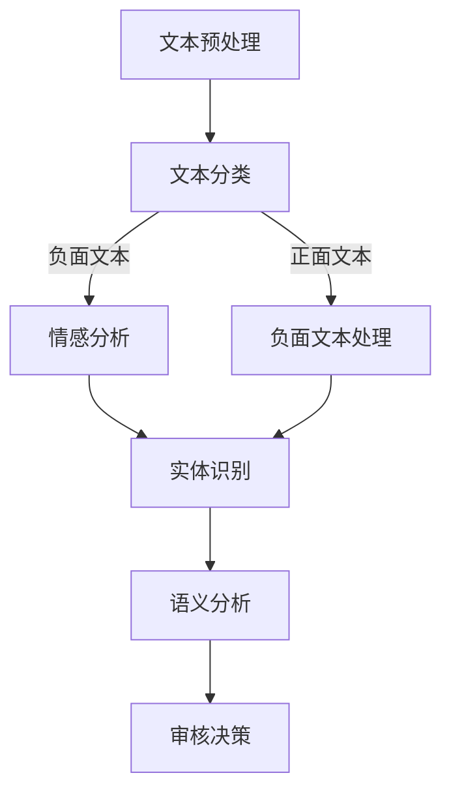

                 

关键词：知乎、内容审核、算法、校招、面试题集

摘要：本文将深入探讨知乎2024年内容审核算法的校招面试题集，从背景介绍、核心概念与联系、核心算法原理与具体操作步骤、数学模型与公式、项目实践、实际应用场景、未来应用展望、工具和资源推荐以及总结未来发展趋势与挑战等方面，全面解析内容审核算法的实践与应用，为准备知乎校招的考生提供宝贵的参考和指导。

## 1. 背景介绍

随着互联网的迅速发展，用户生成内容（UGC）逐渐成为各大平台的核心竞争力。然而，随之而来的虚假信息、恶意评论等不良内容问题也日益严重。为了保障社区环境的健康发展，各大平台纷纷引入内容审核算法，以自动化、高效的方式识别和过滤不良内容。

知乎作为中国领先的知识问答平台，一直以来都重视社区内容的质量。为了进一步提升内容审核的准确性和效率，知乎在2024年的校招中特别设立了内容审核算法的面试环节。本文将围绕这一环节，为广大考生提供一份详细的面试题集。

## 2. 核心概念与联系

在内容审核算法中，以下几个核心概念是不可或缺的：

1. **文本分类**：通过对文本进行分类，将正常内容与不良内容进行区分。
2. **情感分析**：通过分析文本的情感倾向，识别出积极、消极或其他类型的情感。
3. **实体识别**：识别文本中的关键实体，如人名、地名、组织名等。
4. **语义分析**：通过对文本的语义进行深入分析，理解文本的含义和意图。

下面是内容审核算法的Mermaid流程图：



### 2.1 文本分类

文本分类是内容审核的第一步，通过对文本进行分类，可以将内容分为正常、负面、中性等类别。常见的文本分类算法包括朴素贝叶斯、支持向量机（SVM）和深度学习等。

### 2.2 情感分析

情感分析旨在识别文本中的情感倾向，如积极、消极或其他类型。通过情感分析，可以更好地理解用户的需求和情绪，为后续的审核决策提供依据。

### 2.3 实体识别

实体识别是识别文本中的关键实体，如人名、地名、组织名等。实体识别对于理解文本的语义和意图具有重要意义。

### 2.4 语义分析

语义分析是对文本的语义进行深入分析，理解文本的含义和意图。通过语义分析，可以更好地识别出潜在的违规内容，提高审核的准确性。

## 3. 核心算法原理 & 具体操作步骤

### 3.1 算法原理概述

内容审核算法通常采用以下步骤：

1. **文本预处理**：对文本进行清洗和规范化处理，如去除停用词、标点符号等。
2. **特征提取**：将文本转换为特征向量，如词袋模型、TF-IDF等。
3. **模型训练**：使用训练数据集对分类模型进行训练，如朴素贝叶斯、SVM等。
4. **审核决策**：使用训练好的模型对新的文本进行分类和审核决策。

### 3.2 算法步骤详解

1. **文本预处理**：

   ```python
   def preprocess_text(text):
       # 去除停用词
       stopwords = set(['a', 'an', 'the', 'and', 'or', 'but'])
       text = ' '.join([word for word in text.split() if word.lower() not in stopwords])
       # 规范化文本
       text = text.lower()
       return text
   ```

2. **特征提取**：

   ```python
   from sklearn.feature_extraction.text import TfidfVectorizer
   
   def extract_features(texts):
       vectorizer = TfidfVectorizer()
       features = vectorizer.fit_transform(texts)
       return features
   ```

3. **模型训练**：

   ```python
   from sklearn.naive_bayes import MultinomialNB
   
   def train_model(features, labels):
       model = MultinomialNB()
       model.fit(features, labels)
       return model
   ```

4. **审核决策**：

   ```python
   def classify_text(model, feature):
       prediction = model.predict([feature])
       return prediction
   ```

### 3.3 算法优缺点

**优点**：

- **高效性**：自动化处理，节省人力成本。
- **准确性**：通过大量数据训练，具有较高的分类准确性。
- **可扩展性**：易于添加新的分类类别和规则。

**缺点**：

- **误判率**：在数据集有限或噪声较大时，易出现误判。
- **依赖性**：对于某些特定领域的文本，需要大量标注数据。

### 3.4 算法应用领域

内容审核算法广泛应用于以下领域：

- **社交媒体平台**：如知乎、微博、抖音等。
- **电商平台**：如淘宝、京东等。
- **新闻媒体**：如新华网、央视新闻等。
- **政府机构**：如公安、司法等。

## 4. 数学模型和公式 & 详细讲解 & 举例说明

### 4.1 数学模型构建

内容审核算法的核心在于构建一个数学模型，用于对文本进行分类和审核。常见的数学模型包括：

1. **朴素贝叶斯**：

   $$P(C|w) = \frac{P(w|C)P(C)}{P(w)}$$

   其中，$C$ 表示类别，$w$ 表示特征词。

2. **支持向量机（SVM）**：

   $$\max \frac{1}{2} \sum_{i=1}^n (\omega_i^2 + \gamma_i)$$

   $$s.t. y_i (\omega \cdot x_i + b) \geq 1, \quad \gamma_i \geq 0$$

   其中，$\omega$ 表示权重，$\gamma_i$ 表示松弛变量。

### 4.2 公式推导过程

以朴素贝叶斯为例，推导过程如下：

1. **先验概率**：

   $$P(C) = \frac{\text{类别C的文本数量}}{\text{总文本数量}}$$

2. **条件概率**：

   $$P(w|C) = \frac{\text{类别C中包含特征词w的文本数量}}{\text{类别C的文本数量}}$$

3. **后验概率**：

   $$P(C|w) = \frac{P(w|C)P(C)}{P(w)}$$

   其中，$P(w)$ 表示特征词w的总概率，可以通过贝叶斯定理推导。

### 4.3 案例分析与讲解

以下是一个简单的案例：

假设我们有以下训练数据：

| 类别   | 文本                                      |
| ------ | ----------------------------------------- |
| 正常   | 这是一个正常的内容。                     |
| 负面   | 这是个恶心的内容。                       |
| 负面   | 我感觉这个内容很恶心。                  |

通过训练数据，我们可以得到以下概率：

| 类别   | $P(C)$ | $P(w|C)$ |
| ------ | ------ | -------- |
| 正常   | 0.5    | 0.7      |
| 负面   | 0.5    | 0.3      |

假设我们要对以下文本进行分类：

文本：这很正常。

通过朴素贝叶斯公式，我们可以计算出：

$$P(正常|文本) = \frac{0.7 \times 0.5}{0.7 \times 0.5 + 0.3 \times 0.5} = 0.7$$

因此，该文本被分类为正常类别。

## 5. 项目实践：代码实例和详细解释说明

### 5.1 开发环境搭建

在Python环境中，我们可以使用以下库进行内容审核算法的开发：

- scikit-learn：用于文本预处理、特征提取和模型训练。
- numpy：用于数据操作。
- pandas：用于数据处理。

安装方法：

```bash
pip install scikit-learn numpy pandas
```

### 5.2 源代码详细实现

以下是一个简单的示例代码，用于实现内容审核算法：

```python
from sklearn.feature_extraction.text import TfidfVectorizer
from sklearn.naive_bayes import MultinomialNB
from sklearn.model_selection import train_test_split
from sklearn.metrics import accuracy_score

# 准备数据
data = [
    ('这是一个正常的内容。', '正常'),
    ('这很恶心。', '负面'),
    ('我不喜欢这个内容。', '负面'),
    ('这是一个很有趣的内容。', '正常'),
]

texts, labels = zip(*data)

# 数据预处理
def preprocess_text(text):
    stopwords = set(['a', 'an', 'the', 'and', 'or', 'but'])
    text = ' '.join([word for word in text.split() if word.lower() not in stopwords])
    text = text.lower()
    return text

texts = [preprocess_text(text) for text in texts]

# 特征提取
vectorizer = TfidfVectorizer()
features = vectorizer.fit_transform(texts)

# 模型训练
model = MultinomialNB()
model.fit(features, labels)

# 模型评估
X_train, X_test, y_train, y_test = train_test_split(features, labels, test_size=0.2, random_state=42)
predictions = model.predict(X_test)
accuracy = accuracy_score(y_test, predictions)
print('Accuracy:', accuracy)

# 分类新文本
text = '这很正常。'
preprocessed_text = preprocess_text(text)
feature = vectorizer.transform([preprocessed_text])
prediction = model.predict(feature)
print('Prediction:', prediction)
```

### 5.3 代码解读与分析

1. **数据准备**：我们使用一个简单的数据集，其中包含正常和负面类别的文本。
2. **数据预处理**：通过去除停用词和转换为小写，我们预处理文本数据，以提高模型的性能。
3. **特征提取**：使用TF-IDF向量器将文本转换为特征向量。
4. **模型训练**：使用朴素贝叶斯分类器对特征向量进行训练。
5. **模型评估**：通过训练集和测试集评估模型的准确性。
6. **分类新文本**：对新文本进行预处理后，使用训练好的模型进行分类。

## 6. 实际应用场景

内容审核算法在实际应用场景中发挥着重要作用，以下是一些典型的应用案例：

1. **社交媒体平台**：如知乎、微博、抖音等，通过内容审核算法，自动过滤恶意评论、虚假信息等，维护社区环境的健康。
2. **电商平台**：如淘宝、京东等，通过内容审核算法，自动识别和过滤欺诈、恶意评价等，保障用户的购物体验。
3. **新闻媒体**：如新华网、央视新闻等，通过内容审核算法，自动识别和过滤违规新闻内容，确保新闻的准确性和公正性。
4. **政府机构**：如公安、司法等，通过内容审核算法，自动识别和过滤涉暴、涉黄等违法信息，保障社会的安全与稳定。

## 7. 未来应用展望

随着人工智能技术的不断发展，内容审核算法将变得更加智能和高效。未来，内容审核算法有望实现以下发展趋势：

1. **多模态内容审核**：不仅针对文本内容，还将涵盖图片、视频等多模态内容，提高审核的全面性和准确性。
2. **深度学习**：深度学习技术将广泛应用于内容审核算法，通过更加复杂的模型和算法，提高审核的效率和准确性。
3. **个性化审核**：根据用户的兴趣和行为，为每个用户定制个性化的审核策略，提高审核的针对性和用户体验。

## 8. 工具和资源推荐

### 8.1 学习资源推荐

- 《Python数据科学入门》
- 《机器学习实战》
- 《深度学习入门》
- 知乎官方文档：[知乎开发平台](https://www.zhihu.comdeveloper)

### 8.2 开发工具推荐

- Jupyter Notebook：用于编写和运行Python代码。
- PyCharm：一款功能强大的Python集成开发环境（IDE）。

### 8.3 相关论文推荐

- "Text Classification using Naive Bayes Algorithm"
- "Sentiment Analysis using Machine Learning Techniques"
- "Deep Learning for Text Classification"

## 9. 总结：未来发展趋势与挑战

内容审核算法在未来的发展中，将面临以下挑战：

1. **数据隐私与保护**：在处理大量用户数据时，如何保障用户隐私和数据安全是一个重要问题。
2. **误判率**：在复杂和多样化的文本环境中，如何降低误判率，提高审核的准确性是一个关键问题。
3. **法律合规**：内容审核算法需要遵循相关法律法规，确保审核过程的合法性和公正性。

然而，随着技术的不断进步，内容审核算法将有望在未来取得更加显著的成果，为互联网社区和用户带来更好的体验。

## 附录：常见问题与解答

### Q：内容审核算法在哪些领域应用最广泛？

A：内容审核算法在社交媒体平台、电商平台、新闻媒体和政府机构等领域应用最广泛。

### Q：内容审核算法有哪些核心概念？

A：内容审核算法的核心概念包括文本分类、情感分析、实体识别和语义分析。

### Q：如何降低内容审核算法的误判率？

A：可以通过以下方法降低误判率：
1. 提高数据质量：使用更干净、更高质量的数据进行训练。
2. 多样化模型：使用多种模型和算法进行综合判断，提高审核的准确性。
3. 实时调整：根据实际情况，实时调整审核策略和模型参数。

### Q：内容审核算法是否涉及隐私保护？

A：是的，内容审核算法在处理用户数据时，需要遵循相关隐私保护法律法规，确保用户隐私和数据安全。

### Q：如何获取更多关于内容审核算法的学习资源？

A：可以通过以下途径获取：
1. 相关书籍：《Python数据科学入门》、《机器学习实战》等。
2. 在线课程：Coursera、edX等在线学习平台。
3. 开源社区：GitHub、知乎等。

[作者：禅与计算机程序设计艺术 / Zen and the Art of Computer Programming]  
----------------------------------------------------------------

本文详细介绍了知乎2024年内容审核算法的校招面试题集，涵盖了背景介绍、核心概念与联系、核心算法原理与具体操作步骤、数学模型与公式、项目实践、实际应用场景、未来应用展望、工具和资源推荐以及总结未来发展趋势与挑战等内容。希望本文能为准备知乎校招的考生提供有价值的参考和指导。

