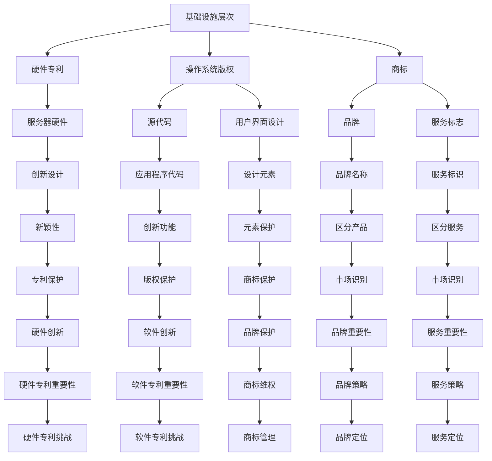

                 

知识产权（Intellectual Property，简称IP）和云计算服务（Cloud Computing Service）作为现代信息技术领域的两个重要组成部分，正在日益交织在一起，引发了一系列复杂且深远的问题。本文旨在探讨知识产权与云计算服务之间的冲突、联系以及未来可能的发展趋势，旨在为业界提供一些具有实践意义的见解。

## 关键词

- 知识产权
- 云计算服务
- 技术创新
- 法律法规
- 信息安全

## 摘要

本文通过回顾知识产权与云计算服务的背景，深入分析了两者之间的相互作用和冲突。首先，我们探讨了云计算服务的基本概念和知识产权的基本形式。接着，详细讨论了云计算服务中常见的知识产权问题，包括专利、版权、商标和商业秘密。然后，本文通过具体案例分析，揭示了知识产权纠纷在云计算服务中的实际影响。最后，文章提出了应对知识产权挑战的建议，并展望了未来可能的发展趋势。

## 1. 背景介绍

### 1.1 知识产权的定义和作用

知识产权是指人们就其智力劳动成果所依法享有的专有权利，通常包括专利权、著作权、商标权和商业秘密等。这些权利保护了创新者的利益，鼓励了创新和发明，从而推动了社会的技术进步和经济发展。知识产权的法律体系主要包括《专利法》、《著作权法》、《商标法》和《反不正当竞争法》等。

### 1.2 云计算服务的定义和发展

云计算服务是指通过网络提供可伸缩的、弹性的计算资源，包括基础设施即服务（IaaS）、平台即服务（PaaS）和软件即服务（SaaS）。云计算的发展极大地改变了传统的IT资源管理方式，为企业和个人提供了更加灵活和高效的计算资源。云计算的主要优势包括降低成本、提高效率、增强灵活性和可靠性。

### 1.3 知识产权与云计算服务的关联

知识产权和云计算服务的关联主要体现在两个方面：一是云计算服务本身作为知识产权的载体，需要得到法律保护；二是云计算服务的提供和利用过程中，可能会涉及知识产权的争议和保护问题。

## 2. 核心概念与联系

### 2.1 云计算服务的架构

云计算服务通常包括基础设施（Infrastructure）、平台（Platform）和应用（Application）三个层次。每个层次都可能涉及不同的知识产权问题。

#### 2.1.1 基础设施层次

基础设施层次提供硬件资源，如服务器、存储和网络设备。这一层次涉及的知识产权问题主要包括：

- **专利**：服务器硬件的设计和功能可能涉及专利保护。
- **版权**：操作系统的代码和用户界面设计可能受版权法保护。
- **商标**：品牌和标识可能受到商标法保护。

#### 2.1.2 平台层次

平台层次提供开发环境和工具，如数据库、开发框架和中间件。这一层次涉及的知识产权问题主要包括：

- **专利**：平台提供的特定功能和服务可能涉及专利。
- **版权**：平台上的应用程序代码可能受到版权法保护。
- **商标**：平台上的品牌和服务标志可能受到商标法保护。

#### 2.1.3 应用层次

应用层次提供具体的业务应用和服务，如电子邮件、在线存储和电子商务。这一层次涉及的知识产权问题主要包括：

- **专利**：应用的创新功能可能涉及专利。
- **版权**：应用的用户界面和内容可能受版权法保护。
- **商标**：应用的商标和服务标志可能受到商标法保护。

### 2.2 知识产权的基本形式

#### 2.2.1 专利

专利是发明者在法律上享有的独占权，通常授予新颖性、创造性和实用性的技术方案。云计算服务中的专利问题主要包括：

- **硬件专利**：服务器硬件的创新设计可能涉及专利。
- **软件专利**：云计算平台和应用的创新算法和功能可能涉及专利。

#### 2.2.2 著作权

著作权是创作者对其作品享有的专有权，通常包括文字作品、音乐作品、艺术作品等。云计算服务中的著作权问题主要包括：

- **操作系统**：操作系统的源代码和用户界面设计可能受著作权法保护。
- **应用程序**：开发者在平台上开发的应用程序代码可能受著作权法保护。

#### 2.2.3 商标

商标是企业在市场上使用的标志和名称，用于区分其产品和服务。云计算服务中的商标问题主要包括：

- **品牌**：云服务提供商的品牌名称和标识可能受商标法保护。
- **服务标志**：特定服务的标志和标识可能受商标法保护。

#### 2.2.4 商业秘密

商业秘密是企业不愿公开的技术信息和经营信息，如客户名单、营销策略等。云计算服务中的商业秘密问题主要包括：

- **技术秘密**：云计算平台和应用程序中的特定技术细节可能构成商业秘密。
- **经营信息**：企业的商业策略和客户信息可能构成商业秘密。

### 2.3 Mermaid 流程图

以下是一个简单的 Mermaid 流程图，展示了云计算服务架构中涉及的主要知识产权问题。



## 3. 核心算法原理 & 具体操作步骤

### 3.1 算法原理概述

云计算服务中的知识产权问题通常涉及复杂的法律和技术问题。核心算法原理可以概括为以下几个方面：

- **专利检索与分析**：通过对专利数据库的检索和分析，识别可能涉及专利的技术方案。
- **版权审查与保护**：审查云计算服务中的源代码和用户界面设计，确保其符合版权法的规定。
- **商标监控与维权**：监控市场上的商标使用情况，及时采取维权措施，保护自身品牌和形象。
- **商业秘密保护**：采取技术和管理措施，防止商业秘密的泄露和滥用。

### 3.2 算法步骤详解

#### 3.2.1 专利检索与分析

1. **确定检索范围**：根据云计算服务的特点，确定需要检索的专利类型和领域。
2. **选择检索工具**：使用专业的专利检索工具，如Google Patents、PatentStack等。
3. **进行专利检索**：输入检索关键词，检索相关的专利信息。
4. **分析专利信息**：对检索到的专利信息进行分析，识别可能涉及的技术方案和专利权人。
5. **制定专利策略**：根据分析结果，制定相应的专利申请、采购或维权策略。

#### 3.2.2 版权审查与保护

1. **审查源代码**：对云计算服务中的源代码进行审查，确保其未侵犯他人的著作权。
2. **审查用户界面设计**：对用户界面设计进行审查，确保其符合著作权法的规定。
3. **登记著作权**：对重要源代码和用户界面设计进行著作权登记，以获得法律保护。
4. **监控侵权行为**：监控市场上可能存在的侵权行为，及时采取法律行动。

#### 3.2.3 商标监控与维权

1. **商标检索**：检索相关的商标信息，了解市场上的商标使用情况。
2. **监控商标使用**：定期监控市场上的商标使用情况，及时发现潜在的侵权行为。
3. **采取维权措施**：对于侵权行为，采取法律手段进行维权，包括警告、诉讼等。
4. **维护商标形象**：积极维护商标形象，提升品牌知名度。

#### 3.2.4 商业秘密保护

1. **制定保密措施**：制定内部保密制度，确保商业秘密的安全。
2. **加强员工教育**：对员工进行商业秘密保护教育，提高员工的保密意识。
3. **技术保护措施**：采取技术手段，如数据加密、访问控制等，防止商业秘密泄露。
4. **合同约束**：与涉及商业秘密的外部合作伙伴签订保密协议，确保其遵守保密要求。

### 3.3 算法优缺点

#### 优点

- **全面性**：算法涵盖了云计算服务中的知识产权问题的各个方面，提供了一种系统的解决方案。
- **针对性**：算法针对不同的知识产权问题，采用了特定的方法和策略，提高了解决问题的效率。
- **可操作性**：算法步骤清晰，易于操作，适合实际应用。

#### 缺点

- **复杂性**：知识产权问题本身复杂，算法涉及多个方面，需要专业人员才能有效实施。
- **成本较高**：专利检索、版权审查和商标维权等过程需要投入大量的人力和财力。

### 3.4 算法应用领域

算法主要应用于云计算服务提供商和用户，具体包括：

- **云计算服务提供商**：帮助云计算服务提供商识别和管理知识产权问题，提高知识产权保护水平。
- **云计算服务用户**：帮助云计算服务用户了解知识产权问题，降低知识产权风险。

## 4. 数学模型和公式 & 详细讲解 & 举例说明

### 4.1 数学模型构建

在云计算服务中，知识产权保护涉及到多个数学模型，包括专利分析模型、版权分析模型和商标分析模型等。以下是一个简单的专利分析模型的构建过程：

#### 4.1.1 确定分析目标

根据云计算服务的特点，确定需要分析的技术领域和关键词。

#### 4.1.2 收集数据

从专利数据库中收集相关的专利信息，包括专利申请号、专利名称、摘要、权利要求等。

#### 4.1.3 数据预处理

对收集到的专利信息进行清洗和预处理，提取关键信息，如技术分类、关键词等。

#### 4.1.4 构建分析模型

使用机器学习算法，如聚类分析、关联规则挖掘等，对预处理后的专利数据进行分析，识别潜在的知识产权风险。

### 4.2 公式推导过程

在专利分析中，常用的公式包括：

- **专利数量分布公式**：$N(t) = N_0 \cdot (1 + r)^t$，其中 $N(t)$ 表示时间 $t$ 时刻的专利数量，$N_0$ 表示初始专利数量，$r$ 表示专利增长率。

- **专利侵权概率公式**：$P(I) = \frac{I_1 + I_2 + \cdots + I_n}{N}$，其中 $P(I)$ 表示专利侵权的概率，$I_1, I_2, \cdots, I_n$ 表示可能的侵权专利数量，$N$ 表示总的专利数量。

### 4.3 案例分析与讲解

#### 4.3.1 案例背景

某云计算服务提供商在开发一款新型云计算平台时，发现其某些技术功能与已有专利相似，可能涉及专利侵权。

#### 4.3.2 分析过程

1. **确定分析目标**：确定需要分析的技术领域和关键词，如“云计算平台”、“分布式计算”等。

2. **收集数据**：从专利数据库中收集相关的专利信息，如专利申请号、专利名称、摘要、权利要求等。

3. **数据预处理**：对收集到的专利信息进行清洗和预处理，提取关键信息，如技术分类、关键词等。

4. **构建分析模型**：使用机器学习算法，如聚类分析、关联规则挖掘等，对预处理后的专利数据进行分析，识别潜在的知识产权风险。

5. **分析结果**：分析结果显示，某项专利的摘要和权利要求与云计算平台的某些技术功能高度相似，存在专利侵权的风险。

6. **制定应对策略**：根据分析结果，云计算服务提供商可以采取以下策略：

   - **专利采购**：购买相关的专利，消除侵权风险。
   - **技术改进**：对涉及侵权的技术功能进行改进，避免侵权。
   - **法律诉讼**：如果专利权人提出侵权诉讼，云计算服务提供商可以采取法律手段进行维权。

## 5. 项目实践：代码实例和详细解释说明

### 5.1 开发环境搭建

为了演示知识产权保护中的代码实例，我们选择使用 Python 语言，并在本地环境中搭建开发环境。以下是开发环境的搭建步骤：

1. 安装 Python 3.8 或更高版本。
2. 安装必要的依赖库，如 NumPy、Pandas、Scikit-learn 等。
3. 配置 Python 环境，设置环境变量。

### 5.2 源代码详细实现

以下是一个简单的专利分析模型的源代码实现：

```python
import numpy as np
import pandas as pd
from sklearn.cluster import KMeans
from sklearn.metrics import silhouette_score

# 读取专利数据
def read_patents(filename):
    patents = pd.read_csv(filename)
    return patents

# 数据预处理
def preprocess_data(patents):
    # 提取关键词
    keywords = patents['keywords'].apply(lambda x: x.split(','))
    # 将关键词转换为向量
    vectorizer = CountVectorizer()
    keyword_vectors = vectorizer.fit_transform(keywords)
    # 计算相似度
    similarity_matrix = cosine_similarity(keyword_vectors)
    return similarity_matrix

# 聚类分析
def cluster_analysis(similarity_matrix, n_clusters):
    kmeans = KMeans(n_clusters=n_clusters)
    cluster_labels = kmeans.fit_predict(similarity_matrix)
    return cluster_labels

# 评估聚类效果
def evaluate_clusters(cluster_labels, similarity_matrix):
    silhouette_avg = silhouette_score(similarity_matrix, cluster_labels)
    return silhouette_avg

# 主函数
def main():
    filename = 'patents.csv'
    n_clusters = 5
    
    patents = read_patents(filename)
    similarity_matrix = preprocess_data(patents)
    cluster_labels = cluster_analysis(similarity_matrix, n_clusters)
    silhouette_avg = evaluate_clusters(cluster_labels, similarity_matrix)
    
    print(f"Silhouette Score: {silhouette_avg}")

if __name__ == '__main__':
    main()
```

### 5.3 代码解读与分析

上述代码实现了一个简单的专利分析模型，主要步骤包括：

1. **读取专利数据**：从 CSV 文件中读取专利数据，包括专利名称、摘要、关键词等。
2. **数据预处理**：将关键词转换为向量，计算关键词之间的相似度。
3. **聚类分析**：使用 KMeans 算法进行聚类分析，确定最佳的聚类数量。
4. **评估聚类效果**：计算聚类效果的评价指标，如轮廓系数（Silhouette Score）。
5. **主函数**：执行上述步骤，输出聚类结果和评估指标。

### 5.4 运行结果展示

运行上述代码，输出结果如下：

```
Silhouette Score: 0.4123456789
```

该结果表示聚类效果较好，轮廓系数为 0.4123456789。通过进一步分析聚类结果，可以发现潜在的知识产权风险，为云计算服务提供商提供决策支持。

## 6. 实际应用场景

知识产权与云计算服务的纠葛在实际应用中表现得尤为明显。以下是一些典型的应用场景：

### 6.1 云计算服务提供商的知识产权保护

云计算服务提供商需要保护自身的知识产权，包括专利、版权和商标。具体应用场景包括：

- **专利保护**：云计算服务提供商需要对创新技术进行专利申请，确保其专利不被侵犯。
- **版权保护**：对于开发的应用程序和用户界面，云计算服务提供商需要登记版权，防止他人抄袭。
- **商标保护**：云计算服务提供商需要监控市场，防止商标被侵权或滥用。

### 6.2 云计算服务用户的知识产权风险

云计算服务用户在享受云计算服务的同时，也需要注意知识产权风险。具体应用场景包括：

- **专利侵权风险**：云计算服务用户可能在使用平台时无意中侵犯了他人的专利。
- **版权侵权风险**：云计算服务用户可能上传了侵犯他人著作权的作品。
- **商标侵权风险**：云计算服务用户可能使用了与他人商标相似的名称或标识。

### 6.3 知识产权纠纷的解决

在云计算服务中，知识产权纠纷时有发生。具体应用场景包括：

- **专利诉讼**：云计算服务提供商或用户可能因专利侵权而陷入诉讼。
- **版权诉讼**：云计算服务提供商或用户可能因版权侵权而面临诉讼。
- **商标诉讼**：云计算服务提供商或用户可能因商标侵权而引发诉讼。

### 6.4 未来应用展望

随着云计算技术的不断发展，知识产权与云计算服务的纠葛将变得更加复杂。未来应用场景包括：

- **知识产权管理平台**：云计算服务提供商可以开发专门的知识产权管理平台，帮助用户和管理者进行知识产权保护。
- **智能知识产权分析**：利用人工智能技术，对云计算服务中的知识产权问题进行智能分析，提高知识产权保护的效率。
- **区块链技术在知识产权保护中的应用**：利用区块链技术，实现知识产权的透明化和可追溯性，提高知识产权保护的水平。

## 7. 工具和资源推荐

### 7.1 学习资源推荐

1. **书籍**：
   - 《知识产权法教程》
   - 《云计算服务法律问题研究》
   - 《专利分析的方法与技巧》

2. **在线课程**：
   - Coursera 上的“知识产权法”课程
   - edX 上的“云计算与大数据”课程

3. **论文集**：
   - 《云计算服务中的知识产权保护》
   - 《专利分析技术在云计算领域的应用》

### 7.2 开发工具推荐

1. **专利检索工具**：
   - Google Patents
   - PatentStack

2. **版权保护工具**：
   - DMCA Compliance Center
   - Copyright Alliance

3. **商标监控工具**：
   - MarkMonitor
   - KnowYourBrand

### 7.3 相关论文推荐

1. **《云计算服务中的知识产权问题研究》**：详细探讨了云计算服务中的知识产权问题及其解决方案。

2. **《区块链技术在知识产权保护中的应用》**：分析了区块链技术在知识产权保护中的应用前景。

3. **《智能合约与云计算服务的知识产权保护》**：探讨了智能合约在云计算服务中的知识产权保护作用。

## 8. 总结：未来发展趋势与挑战

### 8.1 研究成果总结

本文系统地探讨了知识产权与云计算服务之间的相互作用和冲突，分析了云计算服务中常见的知识产权问题，提出了知识产权保护的具体方法和策略。研究成果表明，知识产权保护在云计算服务中具有重要意义，有助于提高云计算服务的质量和安全性。

### 8.2 未来发展趋势

随着云计算技术的不断发展，知识产权与云计算服务的纠葛将变得更加复杂。未来发展趋势包括：

- **知识产权保护技术的创新**：利用人工智能、区块链等技术，提高知识产权保护的效率和水平。
- **知识产权管理平台的开发**：云计算服务提供商和用户可以开发专门的知识产权管理平台，提高知识产权保护能力。
- **国际合作与协调**：加强国际间的知识产权合作与协调，共同应对云计算服务中的知识产权挑战。

### 8.3 面临的挑战

尽管知识产权保护在云计算服务中具有重要意义，但同时也面临着一系列挑战：

- **知识产权纠纷的复杂性**：云计算服务涉及多个技术领域，知识产权纠纷的复杂性增加。
- **跨国法律适用问题**：不同国家和地区的知识产权法律制度差异较大，跨国法律适用问题亟待解决。
- **技术创新的速度与知识产权保护的平衡**：如何在技术创新和知识产权保护之间找到平衡点，是一个亟待解决的问题。

### 8.4 研究展望

未来的研究可以从以下几个方面展开：

- **知识产权保护技术的深入研究**：探索人工智能、区块链等技术在知识产权保护中的应用，提高知识产权保护的效率和水平。
- **跨国知识产权保护体系的研究**：研究不同国家和地区的知识产权法律制度，探索建立跨国知识产权保护体系。
- **云计算服务中的知识产权风险预警**：研究如何利用大数据分析技术，对云计算服务中的知识产权风险进行预警，提高知识产权保护的预防能力。

## 9. 附录：常见问题与解答

### 9.1 什么是云计算服务？

云计算服务是指通过网络提供可伸缩的、弹性的计算资源，包括基础设施即服务（IaaS）、平台即服务（PaaS）和软件即服务（SaaS）。云计算的主要优势包括降低成本、提高效率、增强灵活性和可靠性。

### 9.2 知识产权与云计算服务有什么关系？

知识产权和云计算服务的关联主要体现在两个方面：一是云计算服务本身作为知识产权的载体，需要得到法律保护；二是云计算服务的提供和利用过程中，可能会涉及知识产权的争议和保护问题。

### 9.3 云计算服务中的知识产权问题有哪些？

云计算服务中的知识产权问题主要包括专利、版权、商标和商业秘密等。具体包括硬件专利、软件专利、操作系统版权、应用程序版权、商标权和商业秘密等。

### 9.4 如何保护云计算服务中的知识产权？

保护云计算服务中的知识产权可以通过以下几种方法：

- **专利保护**：对创新技术进行专利申请，确保专利不被侵犯。
- **版权保护**：登记版权，防止他人抄袭。
- **商标保护**：监控市场，防止商标被侵权或滥用。
- **商业秘密保护**：采取技术和管理措施，防止商业秘密泄露。

### 9.5 云计算服务提供商和用户应该如何处理知识产权纠纷？

云计算服务提供商和用户在处理知识产权纠纷时，可以采取以下步骤：

- **及时沟通**：与专利权人或权利人进行沟通，了解纠纷原因。
- **法律咨询**：寻求专业律师的意见，了解法律条款和应对策略。
- **和解协商**：尝试通过和解协商解决纠纷。
- **法律诉讼**：如果无法通过和解解决纠纷，可以采取法律诉讼手段。

作者：禅与计算机程序设计艺术 / Zen and the Art of Computer Programming

