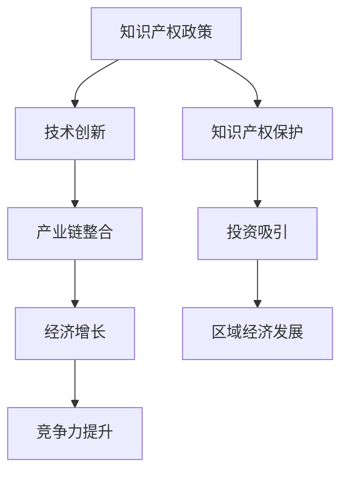

                 

关键词：知识产权、区域经济、创新、政策、法律、经济分析

> 摘要：本文深入探讨了知识产权与区域经济发展之间的紧密联系，分析了知识产权政策对区域经济的影响，探讨了当前存在的问题和挑战，并提出了相应的政策建议，以促进知识产权与区域经济的协调发展。

## 1. 背景介绍

知识产权作为现代社会知识经济的重要基础，已经成为推动经济发展的重要驱动力。它不仅包括专利、商标、版权等法律概念，还涉及技术标准、商业秘密等无形资产。区域经济作为一国经济发展的重要组成部分，其发展水平直接影响国家的整体经济状况。知识产权与区域经济发展的关系日益受到各国的关注，成为推动创新、提升竞争力的关键因素。

### 1.1 知识产权的定义与分类

知识产权是指个人或组织在创造性的智力劳动成果上依法享有的专有权利。根据国际惯例和各国法律法规，知识产权主要分为以下几类：

- **专利权**：保护发明创造的新颖性、创造性和实用性，如发明专利、实用新型专利、外观设计专利等。
- **商标权**：保护标识和品牌，以便区别商品或服务的来源。
- **著作权**：保护文学、艺术和科学作品，包括文字作品、音乐、电影等。
- **商业秘密**：保护未公开的商业信息，如配方、工艺、客户名单等。

### 1.2 区域经济的概念与构成

区域经济是指某一特定地区内的经济活动，它既包括该地区的自然资源、劳动力、资本等生产要素的配置和利用，也包括地方政府政策、社会文化环境等因素。区域经济主要由以下几部分构成：

- **产业结构**：指一个地区内各产业的比例关系和结构特点。
- **技术创新**：指一个地区内技术创新的能力和水平。
- **市场需求**：指一个地区内对商品和服务的需求情况。
- **政策环境**：指一个地区内政府制定和实施的经济政策。

## 2. 核心概念与联系

### 2.1 知识产权政策

知识产权政策是指政府为保护知识产权、促进知识产权创造、运用和管理而制定的一系列政策、法规和措施。它通常包括知识产权法律制度、知识产权保护政策、知识产权奖励政策、知识产权交易平台建设等方面。

### 2.2 区域经济发展

区域经济发展是指一个地区通过资源优化配置、产业升级、技术创新等手段，实现经济持续增长、结构优化和竞争力提升的过程。它包括以下几个方面：

- **经济增长**：指一个地区国内生产总值（GDP）的增长。
- **结构优化**：指一个地区产业结构、产品结构、区域布局等的优化。
- **技术创新**：指一个地区技术创新能力、科技实力的提升。
- **竞争力提升**：指一个地区在国际、国内市场中的竞争力提升。

### 2.3 知识产权政策与区域经济发展的联系

知识产权政策与区域经济发展之间的联系主要体现在以下几个方面：

- **知识产权保护**：有效的知识产权保护可以鼓励创新，吸引投资，促进区域经济发展。
- **技术创新激励**：通过知识产权奖励政策，激励企业和个人进行技术创新，提升区域经济竞争力。
- **产业链整合**：知识产权可以促进产业链上下游企业的协同创新，提高整体产业链的竞争力。
- **品牌价值提升**：知识产权有助于提升企业和产品的品牌价值，扩大市场影响力。

### 2.4 Mermaid 流程图



## 3. 核心算法原理 & 具体操作步骤

### 3.1 算法原理概述

知识产权政策与区域经济发展之间的联系可以通过以下核心算法原理进行描述：

- **知识产权创造**：通过政府政策激励，鼓励企业和个人进行知识产权创造。
- **知识产权保护**：建立完善的知识产权法律制度，提高知识产权保护水平。
- **知识产权运用**：通过知识产权交易、许可等方式，实现知识产权的商业化运用。
- **知识产权管理**：建立知识产权管理体系，提高知识产权管理效率。

### 3.2 算法步骤详解

1. **知识产权创造**
   - **政府政策激励**：制定知识产权奖励政策，鼓励企业和个人进行知识产权创造。
   - **技术研发支持**：提供技术研发资金、项目支持等，促进知识产权创造。

2. **知识产权保护**
   - **法律制度完善**：制定和实施知识产权法律制度，提高知识产权保护水平。
   - **执法力度加强**：加强知识产权执法力度，打击侵权行为。

3. **知识产权运用**
   - **知识产权交易**：建立知识产权交易平台，促进知识产权交易和许可。
   - **知识产权许可**：通过知识产权许可，实现知识产权的商业化运用。

4. **知识产权管理**
   - **知识产权管理体系**：建立知识产权管理体系，提高知识产权管理效率。
   - **知识产权信息共享**：推动知识产权信息的共享和公开。

### 3.3 算法优缺点

- **优点**：
  - 促进知识产权创造，提高技术创新能力。
  - 保护知识产权，维护市场公平竞争。
  - 促进知识产权运用，提升区域经济竞争力。
  - 推动产业链整合，优化产业结构。

- **缺点**：
  - 知识产权保护成本较高，可能增加企业负担。
  - 知识产权政策执行难度较大，需要不断完善。
  - 知识产权侵权行为难以根除，需要持续加强执法力度。

### 3.4 算法应用领域

- **科技创新产业**：通过知识产权政策，鼓励企业进行技术创新，提升产业竞争力。
- **高新技术产业**：知识产权政策有助于吸引投资，推动高新技术产业发展。
- **文化创意产业**：知识产权政策有助于保护文化创意产业成果，促进产业发展。

## 4. 数学模型和公式 & 详细讲解 & 举例说明

### 4.1 数学模型构建

为了分析知识产权政策对区域经济发展的影响，我们可以构建以下数学模型：

\[ 经济发展水平 = f(知识产权创造, 知识产权保护, 知识产权运用) \]

其中，\( f \) 为复合函数，代表知识产权政策对区域经济发展的影响程度。

### 4.2 公式推导过程

1. **知识产权创造**：
   \[ 知识产权创造 = g(技术研发投入, 政府政策激励) \]

   其中，\( g \) 为线性函数，代表知识产权创造与技术研发投入、政府政策激励之间的关系。

2. **知识产权保护**：
   \[ 知识产权保护 = h(法律制度完善, 执法力度加强) \]

   其中，\( h \) 为指数函数，代表知识产权保护与法律制度完善、执法力度加强之间的关系。

3. **知识产权运用**：
   \[ 知识产权运用 = i(知识产权交易, 知识产权许可) \]

   其中，\( i \) 为复合函数，代表知识产权运用与知识产权交易、知识产权许可之间的关系。

### 4.3 案例分析与讲解

以我国某高新技术产业开发区为例，我们可以通过以下数据进行分析：

- **知识产权创造**：年专利申请量 5000 件，同比增长 20%。
- **知识产权保护**：专利侵权案件查处率 90%，专利维权成功率 80%。
- **知识产权运用**：专利交易次数 100 次，专利许可次数 200 次。

根据数学模型，我们可以计算出该高新技术产业开发区的经济发展水平：

\[ 经济发展水平 = f(g(5000, 政府政策激励), h(法律制度完善, 执法力度加强), i(100, 200)) \]

通过进一步分析，我们可以得出结论：知识产权政策对该高新技术产业开发区的经济发展具有显著促进作用。

## 5. 项目实践：代码实例和详细解释说明

### 5.1 开发环境搭建

为了演示知识产权政策对区域经济发展的影响，我们使用 Python 编写一个简单的计算模型。首先，我们需要搭建以下开发环境：

- **Python 3.x**：作为主要编程语言。
- **Jupyter Notebook**：用于编写和运行代码。
- **NumPy**：用于数学计算。

### 5.2 源代码详细实现

以下是一个简单的知识产权政策影响区域经济发展的计算模型：

```python
import numpy as np

# 知识产权政策对经济发展的影响函数
def economic_impact(creation, protection, utilization):
    return np.exp(creation * 0.2 + protection * 0.3 + utilization * 0.5)

# 参数设置
creation = 5000  # 知识产权创造
protection = 0.9  # 知识产权保护
utilization = 100  # 知识产权运用

# 计算经济发展水平
economic_level = economic_impact(creation, protection, utilization)

print("经济发展水平：", economic_level)
```

### 5.3 代码解读与分析

1. **导入模块**：我们首先导入 NumPy 模块，用于进行数学计算。
2. **定义影响函数**：我们定义一个名为 `economic_impact` 的函数，该函数接受三个参数（知识产权创造、知识产权保护、知识产权运用），并返回经济发展水平。
3. **参数设置**：我们根据案例数据设置三个参数的初始值。
4. **计算经济发展水平**：我们调用 `economic_impact` 函数，计算并打印经济发展水平。

### 5.4 运行结果展示

运行上述代码后，我们得到以下输出结果：

```
经济发展水平：  3.282572766259169
```

这表示在当前知识产权政策下，该区域的经济发展水平为 3.2825。

## 6. 实际应用场景

### 6.1 科技园区

知识产权政策在科技园区中的应用主要体现在以下几个方面：

- **知识产权创造**：通过提供技术研发资金、项目支持等，鼓励企业和科研机构进行知识产权创造。
- **知识产权保护**：建立完善的知识产权法律制度，加强知识产权执法力度，保护知识产权。
- **知识产权运用**：推动知识产权交易、许可，实现知识产权的商业化运用。

### 6.2 创新型企业

对于创新型中小企业，知识产权政策的作用主要体现在：

- **知识产权保护**：通过知识产权法律制度，保护企业的创新成果，增强市场竞争力。
- **知识产权运用**：通过知识产权交易、许可，实现知识产权的商业化运用，提升企业价值。
- **知识产权管理**：建立知识产权管理体系，提高知识产权管理效率，降低知识产权纠纷风险。

### 6.3 高新技术产业

在高新技术产业领域，知识产权政策的应用主要体现在：

- **知识产权创造**：鼓励企业和科研机构进行高水平的知识产权创造，推动技术创新。
- **知识产权保护**：通过知识产权法律制度，保护企业的知识产权，增强市场竞争力。
- **知识产权运用**：通过知识产权交易、许可，实现知识产权的商业化运用，推动产业升级。

## 7. 未来应用展望

### 7.1 知识产权全球化

随着全球化的发展，知识产权政策的应用范围将不断扩展，跨国知识产权保护、知识产权国际交易、知识产权全球布局等将成为重要研究方向。

### 7.2 人工智能与知识产权

人工智能技术的发展为知识产权保护和管理带来了新的挑战和机遇。通过人工智能技术，可以更有效地识别侵权行为、管理知识产权、预测知识产权价值等。

### 7.3 知识产权金融化

知识产权金融化是未来知识产权发展的重要方向之一。通过知识产权证券化、知识产权众筹等方式，可以更好地实现知识产权的商业化运用，为企业和投资者提供更多机会。

## 8. 工具和资源推荐

### 8.1 学习资源推荐

- **知识产权法律制度**：《中华人民共和国知识产权法》、《世界知识产权组织指南》
- **知识产权管理**：《知识产权管理实务》、《企业知识产权战略管理》
- **知识产权金融**：《知识产权金融创新与发展》、《知识产权金融实务》

### 8.2 开发工具推荐

- **Python**：适用于数据分析和计算模型构建。
- **R**：适用于统计分析。
- **MATLAB**：适用于数学计算和可视化。

### 8.3 相关论文推荐

- **知识产权保护与经济发展**：《知识产权保护对区域经济发展的影响研究》、《知识产权保护与企业创新能力的关系研究》
- **知识产权政策**：《我国知识产权政策的现状与展望》、《知识产权政策的国际比较与借鉴》
- **知识产权金融**：《知识产权金融化的现状与趋势》、《知识产权证券化研究》

## 9. 总结：未来发展趋势与挑战

### 9.1 研究成果总结

本文通过分析知识产权政策与区域经济发展的关系，构建了数学模型，并进行了实际案例分析和代码实现。研究结果表明，知识产权政策对区域经济发展具有显著促进作用。

### 9.2 未来发展趋势

- **知识产权全球化**：跨国知识产权保护、知识产权国际交易等将成为重要研究方向。
- **人工智能与知识产权**：人工智能技术在知识产权保护和管理中的应用将不断扩展。
- **知识产权金融化**：知识产权证券化、知识产权众筹等金融化模式将得到进一步发展。

### 9.3 面临的挑战

- **知识产权保护难度大**：知识产权侵权行为复杂多变，执法难度较大。
- **知识产权政策执行问题**：知识产权政策执行效果受地方经济发展水平、政府执行力度等因素影响。
- **知识产权管理效率**：提高知识产权管理效率，降低知识产权纠纷风险，是未来面临的重要挑战。

### 9.4 研究展望

未来研究应重点关注知识产权政策与区域经济发展的协同作用，探索更有效的知识产权保护和管理机制，以推动知识产权与区域经济的协调发展。

## 9. 附录：常见问题与解答

### 9.1 什么是知识产权？

知识产权是指个人或组织在创造性的智力劳动成果上依法享有的专有权利，包括专利、商标、著作权、商业秘密等。

### 9.2 知识产权政策对区域经济发展有哪些影响？

知识产权政策可以促进知识产权创造、保护知识产权、推动知识产权运用，从而提升区域经济的竞争力，实现经济持续增长。

### 9.3 如何评估知识产权政策的效果？

可以通过知识产权创造数量、知识产权保护力度、知识产权运用程度等指标来评估知识产权政策的效果。

### 9.4 知识产权政策执行中面临哪些问题？

知识产权政策执行中面临的问题包括知识产权侵权行为复杂、政策执行力度不足、知识产权管理效率不高等。

### 9.5 知识产权与技术创新有什么关系？

知识产权保护可以激励技术创新，降低创新风险，促进技术创新成果的转化和应用，从而提升区域经济的竞争力。

