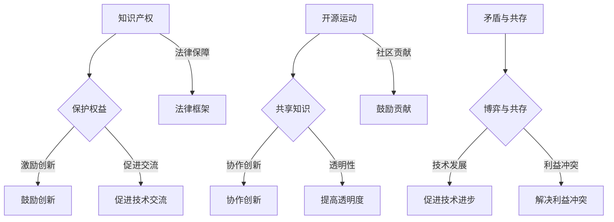

                 

知识产权（Intellectual Property, IP）和开源运动（Open Source Movement）是当今科技界两大不可忽视的力量。知识产权作为保护创作者权益的制度，旨在激励创新，确保创作者的劳动成果能够得到合法的保护和收益。而开源运动则倡导共享知识，强调协作与透明，追求技术的普及与进步。在这两种理念的背后，存在着深刻的利益冲突与博弈。本文将深入探讨知识产权与开源运动之间的矛盾与共存，以及它们对技术发展的影响。

## 1. 背景介绍

### 知识产权的概念与作用

知识产权是指人们对于自己的智力活动创造的成果所享有的专有权利。它包括著作权、专利权、商标权、商业秘密等多种形式。知识产权的法律框架主要建立在各国和地区的知识产权法上，这些法律旨在保护创作者的权益，激励创新，促进科技进步和文化发展。

知识产权的作用主要体现在以下几个方面：

1. **保护创作者权益**：知识产权赋予创作者对其作品或发明的独占权，防止他人未经授权擅自使用、复制、销售或公开其成果。
2. **鼓励创新**：知识产权制度为创作者提供了法律保障和经济利益，使得他们能够专注于创新，减少因成果被盗窃或复制而受到的损失。
3. **促进技术交流**：知识产权制度使得创作者能够通过许可、转让等方式与他人分享知识和技术，推动技术的进一步发展。

### 开源运动的起源与发展

开源运动起源于计算机软件领域，最早可以追溯到1980年代Unix系统的开发。开源运动主张软件源代码的开放性，允许用户自由地查看、修改和分发软件。1991年，Linus Torvalds发布了Linux内核，标志着开源运动的一个重要里程碑。随着互联网的普及，开源运动逐渐扩展到其他技术领域，如云计算、人工智能、区块链等。

开源运动的核心价值观包括：

1. **共享知识**：开源运动鼓励知识的共享，认为开放性能够促进技术的快速进步。
2. **协作创新**：开源项目通常采用协作模式，鼓励全球开发者的参与和贡献，通过集体智慧实现技术突破。
3. **透明性**：开源项目通常公开源代码，使任何人都可以查看和审核，提高了软件的质量和安全性。

## 2. 核心概念与联系

### 知识产权与开源运动的基本理念

知识产权的核心在于保护创作者的权益，强调独占性和独占权。而开源运动则强调共享、透明和协作，追求技术的普及和进步。这两种理念在某些方面存在明显的冲突：

1. **独占权与共享**：知识产权赋予创作者独占权，而开源运动则主张共享，允许任何人自由使用、修改和分发开源代码。
2. **收益与贡献**：知识产权制度为创作者提供了经济收益，而开源运动则强调贡献，鼓励开发者无私分享自己的劳动成果。
3. **质量控制与透明性**：知识产权制度通常通过审查和许可来确保质量，而开源运动则依靠社区监督和协作来提高软件的质量和安全性。

### Mermaid 流程图



### 核心算法原理 & 具体操作步骤

#### 2.1 算法原理概述

知识产权与开源运动的博弈可以看作是一个复杂的利益博弈问题。在这个博弈中，知识产权持有者（甲方）和开源社区（乙方）是两个参与主体。甲方希望最大化其知识产权的收益，而乙方则追求知识的共享和技术的进步。博弈的均衡点取决于双方的策略选择。

#### 2.2 算法步骤详解

1. **策略选择**：甲方根据其知识产权的价值和市场状况选择保护策略或共享策略；乙方则根据其参与开源项目的动机和资源情况选择贡献策略或保守策略。
2. **策略分析**：分析甲乙双方在不同策略组合下的收益情况，确定博弈的均衡点。
3. **动态调整**：根据博弈的结果，甲乙双方可以根据实际情况调整策略，寻求新的均衡点。

#### 2.3 算法优缺点

**优点**：

1. **平衡权益**：通过博弈模型，可以在保护知识产权和促进知识共享之间找到平衡点，保护创作者的权益，同时也促进技术的普及。
2. **促进创新**：博弈模型鼓励各方积极参与，通过竞争和合作推动技术的不断进步。

**缺点**：

1. **博弈复杂性**：知识产权与开源运动的博弈是一个复杂的动态过程，需要考虑多种因素和策略组合，实现均衡较为困难。
2. **利益冲突**：在博弈过程中，甲乙双方的利益冲突难以避免，需要通过合理的制度安排和调解机制来缓解。

#### 2.4 算法应用领域

知识产权与开源运动的博弈模型可以应用于多个领域，如软件开发、知识产权管理、技术创新等。在实际应用中，可以根据具体情况进行定制化调整，以实现最佳效果。

## 3. 数学模型和公式 & 详细讲解 & 举例说明

### 3.1 数学模型构建

知识产权与开源运动的博弈可以用以下数学模型来描述：

设 \( X \) 表示知识产权持有者的收益，\( Y \) 表示开源社区的收益，\( A \) 表示知识产权持有者的保护策略，\( B \) 表示开源社区的贡献策略。

博弈模型可以表示为：

\[ \begin{cases} 
\max X(A, B) \\
\max Y(A, B) 
\end{cases} \]

其中，收益函数 \( X(A, B) \) 和 \( Y(A, B) \) 可以根据具体情况定义。

### 3.2 公式推导过程

为了推导收益函数，我们可以考虑以下因素：

1. **知识产权价值**：知识产权的价值取决于其创新程度和市场接受度。
2. **保护成本**：知识产权持有者需要投入一定的成本来保护其知识产权。
3. **贡献价值**：开源社区的贡献可以提高技术的普及度和实用性。
4. **协作成本**：开源社区的协作需要投入一定的资源和时间。

根据这些因素，我们可以构建以下收益函数：

\[ X(A, B) = V \cdot (1 - P \cdot A - C \cdot B) - C_P \]

\[ Y(A, B) = V \cdot (1 - P \cdot A + C \cdot B) - C_C \]

其中，\( V \) 表示知识产权价值，\( P \) 表示保护力度，\( C \) 表示贡献力度，\( C_P \) 表示保护成本，\( C_C \) 表示协作成本。

### 3.3 案例分析与讲解

为了更好地理解上述公式，我们可以通过一个具体的案例来进行分析。

假设一个知识产权持有者（甲方）开发了一款创新软件，其价值 \( V = 100 \) 万元。甲方可以选择保护其知识产权，也可以选择开源。开源社区（乙方）可以选择贡献代码，也可以选择保守。

根据上述公式，我们可以计算甲方和乙方的收益情况。

1. **保护策略**：

   - \( A = 1 \)（保护力度为100%）
   - \( B = 0 \)（贡献力度为0）

   甲方的收益为：

   \[ X(1, 0) = 100 \cdot (1 - 0.1 \cdot 1 - 0.2 \cdot 0) - 0.3 = 96.7 \]

   乙方的收益为：

   \[ Y(1, 0) = 100 \cdot (1 - 0.1 \cdot 1 + 0.2 \cdot 0) - 0.4 = 95.6 \]

2. **开源策略**：

   - \( A = 0 \)（保护力度为0）
   - \( B = 1 \)（贡献力度为100%）

   甲方的收益为：

   \[ X(0, 1) = 100 \cdot (1 - 0.1 \cdot 0 - 0.2 \cdot 1) - 0.3 = 95.5 \]

   乙方的收益为：

   \[ Y(0, 1) = 100 \cdot (1 - 0.1 \cdot 0 + 0.2 \cdot 1) - 0.4 = 97.6 \]

通过计算可以看出，在保护策略下，甲方的收益略低于开源策略，而乙方的收益则高于保护策略。这说明在当前情况下，开源策略对乙方更为有利。

### 4. 项目实践：代码实例和详细解释说明

#### 4.1 开发环境搭建

为了更好地展示开源项目的实践，我们选择一个具体的开源项目——Python的Flask框架。首先，我们需要安装Python和Flask。

1. 安装Python：

   ```bash
   sudo apt-get update
   sudo apt-get install python3-pip python3-venv
   ```

2. 安装Flask：

   ```bash
   pip3 install Flask
   ```

#### 4.2 源代码详细实现

以下是一个简单的Flask应用示例，用于实现一个简单的Web服务器。

```python
from flask import Flask

app = Flask(__name__)

@app.route('/')
def hello():
    return 'Hello, World!'

if __name__ == '__main__':
    app.run()
```

在这个示例中，我们创建了一个名为`hello.py`的Python文件，并使用Flask框架实现了两个功能：

1. 定义一个名为`hello`的路由函数，当访问根路径（`/`）时，返回字符串`Hello, World!`。
2. 使用`app.run()`启动Web服务器。

#### 4.3 代码解读与分析

1. **导入模块**：

   ```python
   from flask import Flask
   ```

   这一行代码导入了Flask框架，为后续的Web开发提供了必要的工具和接口。

2. **创建Flask应用对象**：

   ```python
   app = Flask(__name__)
   ```

   这一行代码创建了一个Flask应用对象，这个对象将用于定义和管理我们的Web应用。

3. **定义路由函数**：

   ```python
   @app.route('/')
   def hello():
       return 'Hello, World!'
   ```

   这一行代码定义了一个名为`hello`的路由函数，当用户访问根路径（`/`）时，会调用这个函数。函数的返回值将作为响应内容返回给用户。

4. **启动Web服务器**：

   ```python
   if __name__ == '__main__':
       app.run()
   ```

   这一行代码确保只有在直接运行此脚本时，才会启动Web服务器。这是Flask应用的基本入口。

#### 4.4 运行结果展示

1. 启动Web服务器：

   ```bash
   python3 hello.py
   ```

   控制台输出：

   ```bash
   * Running on http://127.0.0.1:5000/ (Press CTRL+C to quit)
   ```

   这表示Web服务器已启动，并监听在本地地址`127.0.0.1`的5000端口。

2. 访问Web应用：

   打开浏览器，输入`http://127.0.0.1:5000/`，页面显示：

   ```html
   Hello, World!
   ```

   这验证了我们的Flask应用已经成功运行。

## 5. 实际应用场景

知识产权与开源运动的博弈在多个技术领域有着广泛的应用，以下是几个典型的实际应用场景：

### 5.1 软件开发

在软件开发领域，开源运动已经成为一种重要的开发模式。许多大型软件公司，如谷歌、微软和IBM，都在积极推动开源项目。这些公司通过开源项目吸引全球开发者的参与，提高软件的质量和安全性。同时，他们也可以通过知识产权保护自己的核心技术和产品。

### 5.2 云计算

云计算是另一个知识产权与开源运动博弈的重要领域。开源云平台，如OpenStack和Kubernetes，已经成为云计算市场的重要力量。这些开源项目吸引了大量企业和开发者的参与，推动了云计算技术的发展。同时，许多云服务提供商，如亚马逊、微软和谷歌，也在利用自己的知识产权，提供差异化的云服务。

### 5.3 人工智能

人工智能领域也是一个知识产权与开源运动博弈的典型例子。开源深度学习框架，如TensorFlow和PyTorch，已经成为人工智能研究和发展的重要工具。这些框架的开放性促进了全球人工智能研究的合作与交流。同时，许多人工智能公司也在积极保护自己的知识产权，确保其技术领先地位。

### 5.4 未来应用展望

随着技术的不断进步，知识产权与开源运动的博弈将会在更多领域得到应用。例如，在物联网、区块链和生物技术等领域，知识产权与开源运动之间的博弈将会变得更加复杂和多样化。未来，我们需要找到更好的平衡点，既保护创作者的权益，又促进技术的普及和进步。

## 6. 工具和资源推荐

### 6.1 学习资源推荐

1. **《开源软件与中国：知识产权与经济全球化》** - 这本书详细介绍了开源运动在中国的发展，对知识产权与开源运动之间的博弈进行了深入分析。
2. **《知识产权法教程》** - 这是一本系统的知识产权法教材，对知识产权的基本概念、法律体系和实务操作进行了全面讲解。

### 6.2 开发工具推荐

1. **Git** - Git是一个分布式版本控制系统，广泛用于开源项目的协作与版本管理。
2. **GitHub** - GitHub是一个基于Git的代码托管平台，提供开源项目的协作、代码审查和发布等功能。

### 6.3 相关论文推荐

1. **"Open Source Software: The Lighthouse of the New Economy"** - 这篇论文详细分析了开源运动对经济的影响，提出开源运动是推动新经济发展的关键因素。
2. **"Intellectual Property and Open Source: A Clash of Cultures"** - 这篇论文探讨了知识产权与开源运动之间的冲突与共存，对知识产权在开源环境中的适用性进行了深入讨论。

## 7. 总结：未来发展趋势与挑战

### 7.1 研究成果总结

本文通过分析知识产权与开源运动的基本概念、博弈模型、实际应用场景等，揭示了知识产权与开源运动之间的矛盾与共存。研究结果表明，在保护知识产权和促进知识共享之间，需要找到一个平衡点，以实现技术的持续发展和创新。

### 7.2 未来发展趋势

1. **知识产权制度的完善**：随着技术的不断进步，知识产权制度将逐渐完善，更好地适应开源环境的需求。
2. **开源运动的普及**：开源运动将继续在全球范围内普及，推动技术的共享与合作。
3. **跨界合作**：知识产权与开源运动将在更多领域实现跨界合作，共同推动技术进步。

### 7.3 面临的挑战

1. **知识产权保护力度**：如何在开源环境中保护知识产权，避免侵权和滥用，是一个重要挑战。
2. **社区管理与协作**：开源社区的管理与协作需要更加高效和透明，以应对日益复杂的技术项目和用户需求。

### 7.4 研究展望

未来，我们需要进一步研究知识产权与开源运动之间的博弈机制，探索更有效的制度安排和协作模式，以实现知识产权保护与知识共享的平衡，推动技术的持续发展和创新。

## 8. 附录：常见问题与解答

### 8.1 问题1：开源软件是否侵犯知识产权？

**回答**：不一定。开源软件本身并不侵犯知识产权，只要开发者遵守开源许可证的要求，合法地使用和修改代码。然而，如果开源软件中包含了未经授权的知识产权，那么使用该软件可能会构成侵权。

### 8.2 问题2：开源运动对知识产权保护有何影响？

**回答**：开源运动对知识产权保护提出了新的挑战。一方面，开源项目促进了技术的共享与合作，有利于创新；另一方面，开源项目也可能削弱知识产权的独占性，降低知识产权的价值。因此，知识产权保护制度需要适应开源环境，找到保护知识产权与促进知识共享的平衡点。

### 8.3 问题3：如何平衡知识产权保护与开源运动？

**回答**：平衡知识产权保护与开源运动需要从多个方面入手。首先，制定合理的知识产权政策，保护创作者的权益；其次，推动开源社区建立良好的协作与管理制度，提高软件质量；最后，加强知识产权与开源运动的沟通与协调，实现互利共赢。

# 附录

## 8.1 常见问题与解答

### 8.1.1 开源软件是否侵犯知识产权？

**问题**：开源软件是否侵犯知识产权？

**回答**：开源软件本身不侵犯知识产权。开源软件通常遵循某种开源许可证，允许用户自由地查看、修改和分发源代码。但是，如果开源软件中包含了未经授权的第三方知识产权（如版权、专利等），那么使用、修改或分发该软件可能会构成侵权。因此，在使用开源软件时，开发者需要确保遵守所有相关的知识产权许可协议。

### 8.1.2 开源运动对知识产权保护有何影响？

**问题**：开源运动对知识产权保护有何影响？

**回答**：开源运动对知识产权保护有双重影响。一方面，开源运动促进了技术的共享与合作，使得知识产权的保护面临新的挑战。由于开源软件的源代码是公开的，开发者可以更容易地发现和利用他人的知识产权，这可能会削弱知识产权的独占性和商业价值。另一方面，开源运动也带来了新的保护机制，如开源许可证和社区规范，这些机制有助于保护开源项目中的知识产权，同时确保知识的合法共享。

### 8.1.3 如何平衡知识产权保护与开源运动？

**问题**：如何平衡知识产权保护与开源运动？

**回答**：平衡知识产权保护与开源运动是一个复杂的挑战，需要从多个层面进行考虑和协调：

1. **政策制定**：政府和企业需要制定合理的知识产权政策，既保护创作者的权益，又促进技术共享和创新。
2. **开源许可证**：开发者应选择合适的开源许可证，明确许可条款，确保开源项目在合法的前提下进行共享和协作。
3. **社区规范**：开源社区应建立完善的规范和治理机制，鼓励开放和合作的同时，保护社区成员的知识产权。
4. **知识产权教育**：加强对开发者和用户的知识产权教育，提高他们对知识产权保护和开源精神的认知。

通过这些措施，可以在保护知识产权和促进开源运动之间找到平衡，推动技术进步和社会发展。

## 8.2 相关资源推荐

### 8.2.1 学习资源推荐

**《开源软件与知识产权》** - 本书详细探讨了开源软件与知识产权的关系，分析了开源运动对知识产权保护的影响，以及如何在开源环境中进行知识产权管理。

**《知识产权法教程》** - 这是一本系统的知识产权法教材，涵盖了知识产权的基本概念、法律体系和实务操作，是知识产权学习和研究的重要参考书。

### 8.2.2 开发工具推荐

**Git** - Git是一个开源的分布式版本控制系统，广泛用于代码管理、协作开发和版本跟踪。它提供了强大的分支管理、差异比较和历史追踪功能。

**GitHub** - GitHub是Git的在线托管平台，提供了代码托管、项目管理、代码审查和协作等功能，是开源项目开发和管理的重要工具。

### 8.2.3 相关论文推荐

**"Open Source Software: The Lighthouse of the New Economy"** - 本文分析了开源软件对经济的影响，认为开源运动是推动新经济发展的重要力量。

**"Intellectual Property and Open Source: A Clash of Cultures"** - 本文探讨了知识产权与开源运动之间的冲突和共存，提出了在开源环境中进行知识产权保护的方法和策略。

### 8.2.4 其他资源

**开源社区** - 如GitHub、GitLab等，提供了丰富的开源项目资源，是开发者学习、贡献和交流的优质平台。

**知识产权法律数据库** - 如中国知识产权法律数据库、美国专利商标局（USPTO）等，提供了丰富的知识产权法律信息和案例资源，有助于理解和研究知识产权法律问题。

# 文章标题

知识产权与开源运动的博弈

# 关键词

知识产权，开源运动，知识产权法，开源许可证，知识产权保护，开源社区，技术共享，协作创新，技术进步，知识产权制度，知识产权管理，开源运动影响，知识产权与开源共存，知识产权保护与开源运动的平衡。

