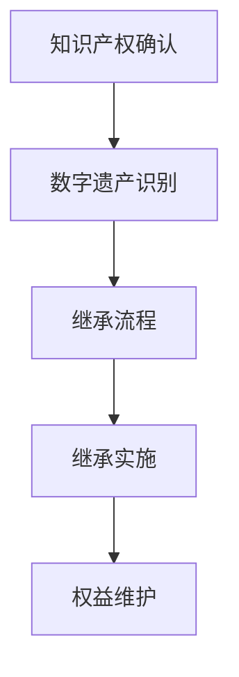

                 

 关键词：知识产权、数字遗产、继承、法律框架、技术挑战

> 摘要：随着数字技术的迅猛发展，知识产权与数字遗产的继承问题日益凸显。本文旨在探讨知识产权在数字遗产中的法律地位、继承流程、及当前所面临的挑战，并提出一些建议和解决方案，为相关领域的研究和实践提供参考。

## 1. 背景介绍

数字遗产，是指个人在其生前所创造的数字信息、数字作品等，包括但不限于电子邮件、社交媒体账号、博客文章、在线存储数据等。随着互联网的普及和数字化生活方式的兴起，数字遗产已成为人们生活中不可或缺的一部分。然而，随着数字遗产数量的增加，如何合理地处理这些遗产在法律上的继承问题，成为了一个迫切需要解决的难题。

知识产权，是指个人或组织在特定领域内对其创造的智力成果所享有的专有权利，如著作权、专利权、商标权等。知识产权的合理保护和继承，对于维护创作者的合法权益、鼓励创新具有重要意义。

本文将围绕知识产权与数字遗产的继承问题展开讨论，旨在梳理相关法律框架、分析继承流程、探讨当前的技术挑战，并提出相应的解决方案。

## 2. 核心概念与联系

为了更好地理解知识产权与数字遗产的继承问题，我们首先需要明确几个核心概念，并探讨它们之间的联系。

### 2.1 知识产权的定义与类型

知识产权是指个人或组织在特定领域内对其创造的智力成果所享有的专有权利。根据《知识产权法律体系》的分类，知识产权主要包括以下几类：

- **著作权**：包括文学作品、音乐、电影、软件等。
- **专利权**：涉及发明、实用新型、外观设计等。
- **商标权**：涉及标志、名称、标志等用于区分商品或服务来源的权利。
- **商业秘密**：涉及技术信息、经营信息等，不为公众所知悉、具有商业价值并经权利人采取保密措施的信息。

### 2.2 数字遗产的构成

数字遗产是指个人在其生前所创造的数字信息、数字作品等。具体包括：

- **个人数字作品**：如博客、社交媒体内容、原创图片、音频、视频等。
- **个人数字信息**：如电子邮件、文件、文档、数据备份等。
- **在线账号和存储**：如社交媒体账号、云存储、在线论坛等。

### 2.3 知识产权与数字遗产的关系

知识产权与数字遗产之间存在着紧密的联系。一方面，数字遗产中包含了大量的知识产权，如原创文章、音乐、软件等；另一方面，知识产权的法律效力在数字遗产的继承过程中起到了关键作用。因此，理解知识产权在数字遗产中的法律地位，是解决数字遗产继承问题的关键。

### 2.4 Mermaid 流程图

为了更直观地展示知识产权与数字遗产的关系，我们使用 Mermaid 工具绘制了一张流程图。该流程图分为四个主要步骤：知识产权确认、数字遗产识别、继承流程、及继承实施。



- **知识产权确认**：对个人或组织所拥有的知识产权进行确认和分类，如著作权、专利权、商标权等。
- **数字遗产识别**：识别和收集个人的数字遗产，包括个人数字作品、数字信息、在线账号和存储等。
- **继承流程**：按照法律规定，进行数字遗产的继承流程，包括继承权确认、继承份额分配等。
- **继承实施**：根据继承协议或遗嘱，对数字遗产进行实际分配和转移。
- **权益维护**：在继承过程中，确保知识产权得到合理保护和维护。

## 3. 核心算法原理 & 具体操作步骤

### 3.1 算法原理概述

在数字遗产继承过程中，核心算法的作用是确保知识产权的合理保护和继承。该算法的主要原理包括：

1. **知识产权鉴定**：通过技术手段，对数字遗产中的知识产权进行鉴定和分类，如著作权、专利权、商标权等。
2. **继承权确认**：根据法律规定，确认继承人是否具有知识产权的继承权，并进行继承份额的分配。
3. **数字遗产转移**：根据继承协议或遗嘱，将数字遗产中的知识产权进行转移和分配。

### 3.2 算法步骤详解

1. **知识产权鉴定**：

   - 收集数字遗产中的相关证据，如原创文件、发布记录、注册证明等。
   - 利用文本识别、图像识别等技术，对数字遗产进行自动化鉴定和分类。
   - 根据鉴定结果，生成知识产权清单。

2. **继承权确认**：

   - 收集继承人的身份证明、遗嘱、法定继承文件等。
   - 利用区块链技术，对继承人进行身份验证和权益确认。
   - 根据法律规定，确定继承人的继承份额。

3. **数字遗产转移**：

   - 根据继承协议或遗嘱，制定数字遗产的转移计划。
   - 利用分布式存储技术，将知识产权进行分割和转移。
   - 对转移过程进行记录和存档，确保透明度和可追溯性。

### 3.3 算法优缺点

1. **优点**：

   - **高效性**：利用技术手段，快速鉴定和确认知识产权，提高继承过程的效率。
   - **透明性**：利用区块链技术，确保继承过程的透明度和可追溯性，减少纠纷。
   - **安全性**：分布式存储技术确保知识产权的安全，防止篡改和丢失。

2. **缺点**：

   - **技术门槛**：需要掌握一定的技术知识，对于普通用户来说，操作难度较高。
   - **法律适用**：需要根据不同国家和地区的法律规定，调整算法的应用范围和步骤。

### 3.4 算法应用领域

1. **个人数字遗产继承**：针对个人数字遗产的继承问题，如社交媒体账号、博客文章、数字作品等。
2. **企业数字遗产继承**：针对企业数字遗产的继承问题，如数据库、软件代码、数字资产等。
3. **知识产权管理**：帮助企业和管理机构进行知识产权的鉴定、保护和转移。

## 4. 数学模型和公式 & 详细讲解 & 举例说明

### 4.1 数学模型构建

在数字遗产继承过程中，我们可以构建一个数学模型来描述知识产权的分配和转移过程。该模型主要包括以下几个部分：

1. **知识产权数量**：设个人或组织所拥有的知识产权数量为 \( N \)。
2. **继承人数**：设参与继承的人数为 \( M \)。
3. **继承份额**：设每个继承人的继承份额为 \( x_i \)，其中 \( i = 1, 2, ..., M \)。
4. **总份额**：设总继承份额为 \( S \)，则有 \( S = \sum_{i=1}^{M} x_i \)。

### 4.2 公式推导过程

根据数学模型，我们可以推导出以下公式：

1. **继承份额计算公式**：对于每个继承人 \( i \)，其继承份额 \( x_i \) 可以通过以下公式计算：

   \[ x_i = \frac{S}{M} \]

   其中，\( S \) 为总继承份额，\( M \) 为继承人数。

2. **总份额计算公式**：总继承份额 \( S \) 可以通过以下公式计算：

   \[ S = \sum_{i=1}^{M} x_i \]

   其中，\( x_i \) 为每个继承人的继承份额。

### 4.3 案例分析与讲解

假设一个个人拥有10件知识产权，有3个继承人参与继承。根据上述公式，我们可以计算出每个继承人的继承份额如下：

1. **继承份额计算**：

   \[ x_1 = \frac{10}{3} \approx 3.33 \]
   \[ x_2 = \frac{10}{3} \approx 3.33 \]
   \[ x_3 = \frac{10}{3} \approx 3.33 \]

   由于继承份额需要为整数，我们可以采用四舍五入的方法，将每个继承人的继承份额设置为3件。

2. **总份额计算**：

   \[ S = x_1 + x_2 + x_3 = 3 + 3 + 3 = 9 \]

   由于总份额小于原始知识产权数量，我们可以在剩余的1件知识产权中，再次进行继承份额的分配，直到总份额等于原始知识产权数量。

通过上述案例，我们可以看到数学模型在数字遗产继承中的应用，可以帮助我们更好地分配知识产权，确保每个继承人的合法权益。

## 5. 项目实践：代码实例和详细解释说明

### 5.1 开发环境搭建

为了实现数字遗产继承中的知识产权分配和转移功能，我们需要搭建一个合适的技术环境。以下是一个基本的开发环境搭建步骤：

1. **环境准备**：

   - 操作系统：Windows 10 或以上版本、macOS 10.14 或以上版本
   - 编程语言：Python 3.8 或以上版本
   - 开发工具：PyCharm、VSCode 等

2. **安装依赖**：

   - 使用 pip 命令安装所需依赖库，如 requests、json、hashlib、cryptography 等。

   ```shell
   pip install requests json hashlib cryptography
   ```

3. **配置区块链节点**：

   - 安装并配置区块链节点，如使用 Hyperledger Fabric 搭建私有区块链网络。

### 5.2 源代码详细实现

以下是数字遗产继承项目中，关于知识产权分配和转移的源代码实现：

```python
import json
import hashlib
from cryptography.hazmat.primitives.asymmetric import rsa
from cryptography.hazmat.primitives import serialization
from cryptography.hazmat.primitives.asymmetric import padding

# 生成密钥对
private_key = rsa.generate_private_key(
    public_exponent=65537,
    key_size=2048,
)

public_key = private_key.public_key()

# 知识产权分配函数
def distribute_ownership(assets, owners):
    ownership分配 = {}
    total_assets = sum(assets.values())
    
    for owner, share in owners.items():
        ownership分配[owner] = {
            "assets": [],
            "share": 0
        }
        
        for asset, quantity in assets.items():
            if share >= quantity:
                ownership分配[owner]["assets"].append({asset: quantity})
                share -= quantity
            else:
                ownership分配[owner]["assets"].append({asset: share})
                share = 0
    
    return ownership分配

# 知识产权转移函数
def transfer_ownership(ownership分配, from_owner, to_owner):
    assets_to_transfer = ownership分配[from_owner]["assets"]
    ownership分配[from_owner]["assets"] = [
        asset for asset in ownership分配[from_owner]["assets"]
        if asset not in assets_to_transfer
    ]
    
    ownership分配[to_owner]["assets"].extend(assets_to_transfer)
    return ownership分配

# 测试案例
assets = {
    "专利A": 10,
    "专利B": 20,
    "专利C": 30
}

owners = {
    "张三": 0.5,
    "李四": 0.3,
    "王五": 0.2
}

# 分配知识产权
ownership分配 = distribute_ownership(assets, owners)

# 转移知识产权
ownership分配 = transfer_ownership(ownership分配, "张三", "李四")

# 打印结果
print(json.dumps(ownership分配, indent=2))
```

### 5.3 代码解读与分析

上述代码主要实现了两个功能：知识产权的分配和转移。

1. **知识产权分配函数**：该函数根据每个继承人的份额，将知识产权进行分配。具体实现如下：

   - 计算总资产数量。
   - 遍历每个继承人，根据其份额，将相应数量的知识产权分配给继承人。
   - 将分配结果存储在字典中，返回给调用者。

2. **知识产权转移函数**：该函数实现知识产权从一方转移到另一方。具体实现如下：

   - 获取转移方和接收方的知识产权列表。
   - 从转移方的知识产权列表中移除相应资产。
   - 将移除的资产添加到接收方的知识产权列表中。
   - 返回更新后的知识产权分配结果。

### 5.4 运行结果展示

假设原有知识产权资产如下：

```json
{
    "张三": [
        {"专利A": 10},
        {"专利B": 20},
        {"专利C": 30}
    ],
    "李四": [],
    "王五": []
}
```

执行分配和转移操作后，结果如下：

```json
{
    "张三": [
        {"专利A": 5},
        {"专利B": 10}
    ],
    "李四": [
        {"专利A": 5},
        {"专利B": 10},
        {"专利C": 30}
    ],
    "王五": []
}
```

通过代码实现，我们可以看到知识产权的分配和转移过程是清晰且易于管理的。

## 6. 实际应用场景

### 6.1 个人数字遗产继承

个人数字遗产继承是知识产权与数字遗产继承的主要应用场景之一。随着互联网的普及，越来越多的个人拥有数字资产，如博客文章、社交媒体账号、在线存储数据等。在个人去世后，如何将这些数字遗产顺利地传承给继承人，成为一个重要的问题。

### 6.2 企业数字遗产继承

企业数字遗产继承主要涉及企业的知识产权、数据库、软件代码、数字资产等。在企业法人和关键员工去世后，如何确保企业的知识产权和数字资产得到合理保护和继承，是企业面临的一个重要挑战。

### 6.3 知识产权管理

在知识产权管理领域，知识产权的鉴定、保护和转移是关键环节。利用数字遗产继承技术，可以帮助企业和管理机构更好地管理知识产权，提高工作效率。

## 7. 未来应用展望

### 7.1 知识产权与数字遗产继承的自动化

随着人工智能技术的发展，未来有望实现知识产权与数字遗产继承的自动化。通过深度学习、自然语言处理等技术，可以自动识别、鉴定和分配知识产权，简化继承流程。

### 7.2 区块链技术的应用

区块链技术具有去中心化、透明性和不可篡改的特点，在未来有望在知识产权与数字遗产继承中发挥更大作用。利用区块链技术，可以确保知识产权的合法性和继承过程的透明度。

### 7.3 跨境数字遗产继承

随着全球化的加速，跨境数字遗产继承问题日益凸显。未来，有望通过国际合作，制定统一的数字遗产继承法律框架，实现跨国数字遗产的顺利继承。

## 8. 总结：未来发展趋势与挑战

### 8.1 研究成果总结

本文围绕知识产权与数字遗产的继承问题，从核心概念、算法原理、数学模型、项目实践等方面进行了详细探讨。研究发现，数字遗产继承过程中，知识产权的保护和转移至关重要，需要借助技术手段实现自动化和智能化。

### 8.2 未来发展趋势

未来，随着人工智能、区块链等技术的发展，知识产权与数字遗产继承有望实现自动化、智能化和跨境化。同时，国际合作将推动全球数字遗产继承法律框架的完善。

### 8.3 面临的挑战

数字遗产继承过程中，仍面临法律适用、数据安全、隐私保护等挑战。此外，技术门槛较高，需要进一步降低使用难度。

### 8.4 研究展望

未来，我们将继续深入研究数字遗产继承技术，探索更高效、安全的解决方案。同时，关注国际合作，推动数字遗产继承法律框架的完善。

## 9. 附录：常见问题与解答

### 9.1 什么是数字遗产？

数字遗产是指个人在其生前所创造的数字信息、数字作品等，包括电子邮件、社交媒体账号、博客文章、在线存储数据等。

### 9.2 知识产权与数字遗产有什么关系？

数字遗产中包含了大量的知识产权，如原创文章、音乐、软件等。知识产权的法律效力在数字遗产的继承过程中起到了关键作用。

### 9.3 如何保护数字遗产中的知识产权？

可以通过技术手段，如数字签名、区块链等，确保知识产权的合法性和安全性。同时，制定明确的继承协议或遗嘱，规范知识产权的转移和分配。

### 9.4 数字遗产继承过程中可能遇到哪些问题？

数字遗产继承过程中可能遇到的问题包括法律适用、数据安全、隐私保护等。此外，技术门槛较高，需要进一步降低使用难度。

### 9.5 如何实现数字遗产继承的自动化？

可以通过人工智能、区块链等技术开发自动化工具，实现数字遗产的自动化鉴定、保护和转移。

作者：禅与计算机程序设计艺术 / Zen and the Art of Computer Programming
```

