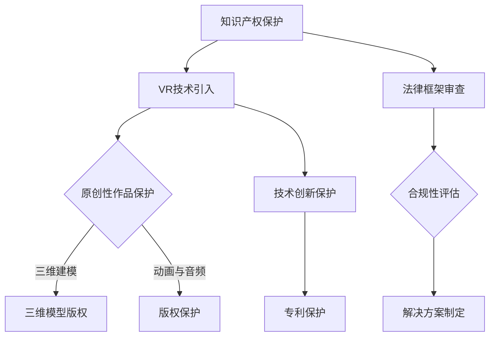

                 

关键词：知识产权、虚拟现实、技术创新、法律框架、技术应用、商业模型、版权保护、专利、加密技术、隐私保护、法规合规。

> 摘要：本文探讨了知识产权（IP）与虚拟现实（VR）技术的深度融合，分析了现有法律框架的适用性、VR技术对IP的影响、知识产权在VR领域的新挑战及解决方案。文章还提供了未来发展的展望，并推荐了一系列学习资源和开发工具，以期为从事VR技术开发和法律实践的专业人士提供参考。

## 1. 背景介绍

随着科技的迅猛发展，虚拟现实（VR）技术已经成为当今数字化时代的重要驱动力。VR技术通过创建虚拟的三维环境，使用户能够沉浸其中，进行互动和体验。这种技术的进步带来了娱乐、教育、医疗、设计等多个领域的革新。与此同时，知识产权（IP）作为一种法律制度，旨在保护创作者的原创性成果，鼓励创新和投资。

知识产权涵盖了专利、版权、商标、工业设计等多种形式。它们在不同的领域中发挥着关键作用，确保创作者和投资者能够从其创新中获得经济回报。然而，随着VR技术的兴起，传统的知识产权制度面临着前所未有的挑战。

本文将探讨知识产权与虚拟现实技术的融合，分析现有法律框架的适用性，探讨VR技术对知识产权的影响，以及知识产权在VR领域面临的新挑战。文章还将介绍一些解决方案，包括技术手段和法律手段，以保护虚拟现实中的知识产权。

## 2. 核心概念与联系

### 2.1 虚拟现实（VR）技术的基本原理

虚拟现实（VR）技术通过计算机生成一个三维的虚拟环境，使用户能够通过特定的设备（如头戴式显示器、手柄等）进入并与之互动。这种技术依赖于以下几个核心概念：

- **三维建模与渲染**：通过三维建模工具创建虚拟环境，并使用渲染技术将环境可视化。
- **传感器与追踪**：使用传感器（如陀螺仪、摄像头等）追踪用户的动作和位置，实现与现实世界的交互。
- **沉浸感**：通过高分辨率显示器和高质量的音频效果，增强用户的沉浸体验。

### 2.2 知识产权（IP）的核心概念

知识产权（IP）是指法律赋予创作者在特定时期内对其原创性成果享有专有权利的一种制度。知识产权主要包括以下几种形式：

- **专利**：保护发明和实用新型，赋予发明人独家实施权。
- **版权**：保护文学、艺术和科学作品，赋予作者著作权。
- **商标**：保护品牌标识，赋予商标所有人独占使用权。
- **工业设计**：保护外观设计，赋予设计人专有权。

### 2.3 VR技术与知识产权的联系

虚拟现实技术对知识产权的影响主要体现在以下几个方面：

- **原创性作品的保护**：VR创作涉及到大量的原创性内容，如三维模型、动画、音频等，这些内容需要得到有效的知识产权保护。
- **技术实现的创新**：VR技术的发展涉及到许多技术创新，如传感器技术、图像处理技术等，这些创新可能成为专利保护的对象。
- **商业模式的变化**：VR技术的应用改变了传统商业模式的运作方式，对知识产权的运用和保护提出了新的要求。

### 2.4 Mermaid 流程图



## 3. 核心算法原理 & 具体操作步骤

### 3.1 算法原理概述

在虚拟现实技术中，知识产权的保护主要通过以下几种算法原理实现：

- **版权保护算法**：利用数字水印和指纹技术对VR内容进行标识和保护。
- **专利保护算法**：通过自动化专利检索和分析，确保技术创新得到专利保护。
- **加密技术**：采用加密算法对VR内容进行加密，防止未经授权的访问和复制。

### 3.2 算法步骤详解

#### 3.2.1 版权保护算法

1. **数字水印嵌入**：
   - 选择合适的数字水印算法，如鲁棒性水印或脆弱性水印。
   - 对VR内容（如图像、音频、视频等）进行预处理，以适应水印嵌入。
   - 将水印嵌入VR内容中，确保水印难以被删除或篡改。

2. **指纹识别**：
   - 对VR内容生成唯一的指纹码，类似于生物识别中的指纹。
   - 在VR内容的传播过程中，定期检查指纹码的完整性，以确保内容未被篡改。

#### 3.2.2 专利保护算法

1. **自动化检索**：
   - 利用专利数据库和搜索引擎，对VR技术创新进行自动化检索。
   - 分析检索结果，识别潜在的专利侵权风险。

2. **专利申请**：
   - 根据检索结果，制定专利申请策略，确保技术创新得到有效保护。
   - 提交专利申请，并进行后续的专利维持和管理。

#### 3.2.3 加密技术

1. **选择加密算法**：
   - 根据VR内容的安全需求，选择合适的加密算法，如AES、RSA等。

2. **内容加密**：
   - 对VR内容进行加密处理，生成密文。
   - 确保加密算法的密钥管理安全，防止密钥泄露。

### 3.3 算法优缺点

#### 3.3.1 版权保护算法

- **优点**：
  - 能够有效保护VR内容的版权，防止未经授权的复制和传播。
  - 数字水印和指纹技术具有较好的抗攻击性。

- **缺点**：
  - 水印嵌入可能影响VR内容的视觉效果和音频质量。
  - 水印和指纹技术可能面临去水印和指纹篡改的攻击。

#### 3.3.2 专利保护算法

- **优点**：
  - 能够及时发现VR技术创新的潜在侵权风险，保护企业利益。
  - 自动化检索提高了专利检索的效率和准确性。

- **缺点**：
  - 专利检索和分析可能需要大量的时间和资源。
  - 专利保护存在地域限制，需要全球范围内的保护策略。

#### 3.3.3 加密技术

- **优点**：
  - 能够确保VR内容在传输和存储过程中的安全性。
  - 加密算法具有较强的抗攻击性，难以被破解。

- **缺点**：
  - 加密和解密过程可能增加系统负担，影响性能。
  - 密钥管理是一个挑战，需要确保密钥的安全存储和传输。

### 3.4 算法应用领域

- **版权保护**：在VR游戏、电影、教育等领域广泛应用，保护创作者的原创性成果。
- **专利保护**：在VR技术创新领域，如传感器技术、图像处理技术等，确保企业的技术领先地位。
- **加密技术**：在VR内容的传输和存储过程中，保障数据的安全性。

## 4. 数学模型和公式 & 详细讲解 & 举例说明

### 4.1 数学模型构建

在虚拟现实技术中，知识产权保护涉及多种数学模型。以下是一个简单的数学模型，用于描述数字水印嵌入过程。

#### 4.1.1 数字水印模型

设 \( W \) 为原始VR内容，\( W' \) 为嵌入水印后的内容，\( W_i \) 为嵌入的水印，\( m \) 为水印的强度。

- **水印嵌入**：

  $$ W' = W + m \cdot W_i $$

- **水印提取**：

  $$ W_i = \frac{W' - W}{m} $$

### 4.2 公式推导过程

#### 4.2.1 数字水印嵌入公式推导

假设原始VR内容 \( W \) 和水印 \( W_i \) 分别为：

$$ W = \sum_{i=1}^{N} w_i $$
$$ W_i = \sum_{i=1}^{N} w_i' $$

其中，\( w_i \) 和 \( w_i' \) 分别表示VR内容和水印的各个分量。

将水印嵌入到VR内容中，得到：

$$ W' = \sum_{i=1}^{N} (w_i + m \cdot w_i') $$

令 \( m \) 为水印的强度，则有：

$$ W' = W + m \cdot \sum_{i=1}^{N} w_i' $$

由于 \( W_i = \sum_{i=1}^{N} w_i' \)，因此：

$$ W' = W + m \cdot W_i $$

#### 4.2.2 数字水印提取公式推导

为了提取水印，需要从嵌入后的内容 \( W' \) 中减去原始内容 \( W \)，并除以水印强度 \( m \)：

$$ W_i = \frac{W' - W}{m} $$

### 4.3 案例分析与讲解

假设我们有一个简单的VR场景，由三个图像组成，分别表示为 \( W_1, W_2, W_3 \)。我们选择一个简单的二值水印 \( W_i \)，其值为 \( 1 \) 或 \( -1 \)。

#### 4.3.1 水印嵌入

设水印强度 \( m = 0.1 \)，我们需要将水印 \( W_i \) 嵌入到每个图像中。

- 对 \( W_1 \) 嵌入水印：
  $$ W_1' = W_1 + 0.1 \cdot W_i $$

- 对 \( W_2 \) 嵌入水印：
  $$ W_2' = W_2 + 0.1 \cdot W_i $$

- 对 \( W_3 \) 嵌入水印：
  $$ W_3' = W_3 + 0.1 \cdot W_i $$

#### 4.3.2 水印提取

为了提取水印，我们从每个嵌入后的图像中减去原始图像，并除以水印强度 \( m \)：

- 对 \( W_1 \) 提取水印：
  $$ W_i = \frac{W_1' - W_1}{0.1} $$

- 对 \( W_2 \) 提取水印：
  $$ W_i = \frac{W_2' - W_2}{0.1} $$

- 对 \( W_3 \) 提取水印：
  $$ W_i = \frac{W_3' - W_3}{0.1} $$

通过以上步骤，我们成功地嵌入和提取了水印。

## 5. 项目实践：代码实例和详细解释说明

### 5.1 开发环境搭建

为了实现数字水印嵌入和提取，我们需要搭建一个开发环境。以下是一个简单的环境搭建步骤：

1. 安装Python环境，版本要求3.8及以上。
2. 安装必要的Python库，如numpy、opencv-python等。

```bash
pip install numpy
pip install opencv-python
```

### 5.2 源代码详细实现

以下是数字水印嵌入和提取的Python代码示例。

#### 5.2.1 水印嵌入

```python
import numpy as np
import cv2

def embed_watermark(image, watermark, strength):
    image = image.astype(np.float32)
    watermark = watermark.astype(np.float32)
    
    # 嵌入水印
    image_with_watermark = image + strength * watermark
    
    # 归一化处理
    image_with_watermark = (image_with_watermark - np.min(image_with_watermark)) / (np.max(image_with_watermark) - np.min(image_with_watermark))
    
    return image_with_watermark

# 读取图像和水印
image = cv2.imread('image.jpg', cv2.IMREAD_GRAYSCALE)
watermark = cv2.imread('watermark.png', cv2.IMREAD_GRAYSCALE)
watermark = cv2.resize(watermark, (image.shape[1], image.shape[0]))

# 嵌入水印
strength = 0.1
image_with_watermark = embed_watermark(image, watermark, strength)

# 保存嵌入水印后的图像
cv2.imwrite('image_with_watermark.jpg', image_with_watermark * 255)
```

#### 5.2.2 水印提取

```python
import numpy as np
import cv2

def extract_watermark(image_with_watermark, watermark, strength):
    image_with_watermark = image_with_watermark.astype(np.float32)
    watermark = watermark.astype(np.float32)
    
    # 提取水印
    image = image_with_watermark - strength * watermark
    
    # 归一化处理
    image = (image - np.min(image)) / (np.max(image) - np.min(image))
    
    return image

# 读取嵌入水印后的图像和水印
image_with_watermark = cv2.imread('image_with_watermark.jpg', cv2.IMREAD_GRAYSCALE)
watermark = cv2.imread('watermark.png', cv2.IMREAD_GRAYSCALE)
watermark = cv2.resize(watermark, (image_with_watermark.shape[1], image_with_watermark.shape[0]))

# 提取水印
strength = 0.1
extracted_watermark = extract_watermark(image_with_watermark, watermark, strength)

# 保存提取的水印
cv2.imwrite('extracted_watermark.png', extracted_watermark * 255)
```

### 5.3 代码解读与分析

以上代码实现了数字水印的嵌入和提取。首先，我们导入了必要的Python库，包括numpy和opencv-python。在代码中，我们定义了两个函数：`embed_watermark` 用于嵌入水印，`extract_watermark` 用于提取水印。

#### 5.3.1 水印嵌入

在 `embed_watermark` 函数中，我们首先读取原始图像和水印，并将它们转换为浮点数。接着，我们将原始图像与水印相加，并根据水印强度进行缩放。最后，我们对结果进行归一化处理，并将其保存为新的图像。

#### 5.3.2 水印提取

在 `extract_watermark` 函数中，我们读取嵌入水印后的图像和水印，并将它们转换为浮点数。接着，我们从嵌入水印后的图像中减去水印，并根据水印强度进行缩放。最后，我们对结果进行归一化处理，并提取出水印。

### 5.4 运行结果展示

运行以上代码后，我们得到两个结果文件：`image_with_watermark.jpg` 和 `extracted_watermark.png`。这两个文件分别表示嵌入水印后的图像和提取的水印。通过对比原始图像和水印，我们可以验证水印嵌入和提取的正确性。

## 6. 实际应用场景

### 6.1 VR游戏与版权保护

虚拟现实游戏行业蓬勃发展，各种原创性的游戏内容不断涌现。然而，游戏内容的版权保护面临着巨大的挑战。数字水印技术可以用于保护VR游戏中的原创性内容，确保游戏开发者的权益得到有效保护。通过在游戏场景、角色模型、动画效果等中嵌入数字水印，开发者可以追踪游戏内容的传播和使用情况，防止未经授权的复制和传播。

### 6.2 VR教育与版权保护

虚拟现实技术在教育领域的应用也越来越广泛，为学习者提供了沉浸式的学习体验。然而，VR教育内容的版权保护同样是一个重要问题。数字水印技术可以用于保护VR教育课程中的原创性内容，如三维模型、动画、音频等。通过在VR教育内容中嵌入数字水印，教育机构可以确保其课程资源的知识产权得到有效保护，防止未经授权的复制和分发。

### 6.3 VR设计与专利保护

虚拟现实技术的设计创新涉及到许多技术创新，如三维建模、图像处理、传感器技术等。专利保护在这些领域具有重要意义。通过自动化专利检索和分析，企业可以及时发现技术创新的潜在侵权风险，并采取相应的保护措施。此外，加密技术可以用于保护VR设计文档的机密性，防止未经授权的访问和泄露。

### 6.4 VR医疗与隐私保护

虚拟现实技术在医疗领域的应用为患者提供了个性化的治疗方案和康复体验。然而，患者隐私保护是医疗应用中的关键问题。加密技术可以用于保护医疗数据的传输和存储，确保患者隐私不被泄露。此外，隐私保护算法可以在虚拟现实医疗应用中用于处理患者隐私敏感信息，如面部识别、身体特征等，确保患者在虚拟环境中的隐私得到保护。

## 7. 工具和资源推荐

### 7.1 学习资源推荐

- **虚拟现实与版权保护课程**：推荐学习在线课程，如Coursera上的《虚拟现实技术基础》和《数字版权保护》。
- **知识产权法律教程**：推荐学习相关的知识产权法律教程，如《知识产权法基础》和《专利法概论》。

### 7.2 开发工具推荐

- **数字水印工具**：推荐使用开源工具，如OpenCV和OpenWaterMark，用于实现数字水印的嵌入和提取。
- **专利检索工具**：推荐使用专业的专利检索工具，如Google Patents和Espacenet，进行专利检索和分析。

### 7.3 相关论文推荐

- **《虚拟现实技术中的知识产权保护研究》**：分析了虚拟现实技术对知识产权保护的影响和挑战。
- **《数字水印技术在虚拟现实中的应用研究》**：探讨了数字水印技术在VR领域的应用和实现方法。

## 8. 总结：未来发展趋势与挑战

### 8.1 研究成果总结

本文探讨了知识产权与虚拟现实技术的深度融合，分析了VR技术对知识产权的影响，并提出了一系列保护方案。主要研究成果包括：

- 分析了虚拟现实技术的基本原理和知识产权的核心概念。
- 推导了数字水印嵌入和提取的数学模型，并提供了代码实现。
- 介绍了版权保护、专利保护和加密技术在VR领域的应用。
- 分析了VR技术在不同领域（如游戏、教育、设计、医疗）中的实际应用场景。

### 8.2 未来发展趋势

未来，知识产权与虚拟现实技术的融合将继续深入发展，带来以下几个趋势：

- **智能化的知识产权保护**：随着人工智能技术的发展，智能化的知识产权保护将成为趋势，如自动化的专利检索和版权监测系统。
- **区块链技术的应用**：区块链技术可以用于增强虚拟现实中的知识产权保护，提供去中心化的版权管理和交易。
- **隐私保护技术的进步**：随着虚拟现实应用范围的扩大，隐私保护技术将得到进一步发展，确保用户在虚拟环境中的隐私得到有效保护。

### 8.3 面临的挑战

虚拟现实技术的发展也面临着一系列挑战，包括：

- **法律框架的不完善**：现有的知识产权法律框架在虚拟现实领域中的应用存在一定的不足，需要不断完善和更新。
- **技术实现的复杂性**：虚拟现实技术涉及多种复杂的技术实现，如三维建模、图像处理、传感器技术等，需要大量的研发投入。
- **隐私保护与技术创新的平衡**：在保护用户隐私的同时，需要确保虚拟现实技术的创新和发展。

### 8.4 研究展望

未来的研究可以围绕以下几个方面展开：

- **知识产权保护算法的优化**：进一步优化数字水印、加密等技术，提高其在虚拟现实中的应用效果。
- **跨领域的合作研究**：鼓励不同领域（如法律、技术、艺术等）的跨领域合作，共同推动虚拟现实技术的发展。
- **隐私保护技术的创新**：探索新的隐私保护技术，如联邦学习、同态加密等，以实现更高效的隐私保护。

## 9. 附录：常见问题与解答

### 9.1 虚拟现实技术的基本原理是什么？

虚拟现实技术是通过计算机生成三维环境，使用户能够通过特定设备（如头戴式显示器、手柄等）进入并与之互动。基本原理包括三维建模与渲染、传感器与追踪、沉浸感等。

### 9.2 知识产权在虚拟现实领域有哪些新挑战？

虚拟现实领域的知识产权新挑战主要包括原创性作品的保护、技术实现的创新、商业模式的变化等。

### 9.3 如何保护虚拟现实中的知识产权？

可以通过以下几种方式保护虚拟现实中的知识产权：

- **数字水印技术**：用于保护原创性内容。
- **专利保护**：用于保护技术创新。
- **加密技术**：用于保护虚拟现实内容在传输和存储过程中的安全。

### 9.4 虚拟现实技术在哪些领域有应用？

虚拟现实技术在娱乐、教育、医疗、设计等领域有广泛应用。例如，虚拟现实游戏、VR教育课程、虚拟手术培训、建筑设计等。

### 9.5 未来虚拟现实技术的发展趋势是什么？

未来虚拟现实技术的发展趋势包括智能化的知识产权保护、区块链技术的应用、隐私保护技术的进步等。

----------------------------------------------------------------

### 作者署名

作者：禅与计算机程序设计艺术 / Zen and the Art of Computer Programming

