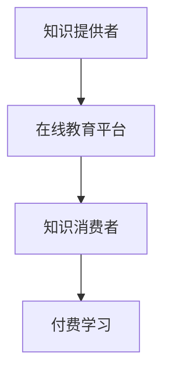

                 

关键词：知识付费、程序员、财富自由、在线教育、知识变现

> 摘要：本文旨在探讨知识付费在现代信息技术领域中的重要性，以及如何通过知识付费实现程序员的财富自由。我们将从知识付费的背景、核心概念、算法原理、数学模型、实际应用、工具推荐以及未来发展趋势等方面进行深入分析。

## 1. 背景介绍

随着互联网技术的迅猛发展，在线教育行业蓬勃发展，知识付费逐渐成为一项热门的商业模式。程序员作为互联网时代的核心人群，他们的知识储备和技能水平对于行业发展至关重要。知识付费不仅为程序员提供了收入来源，也为他们提供了提升自身技能、实现职业发展的新途径。

### 1.1 知识付费的兴起

知识付费，指的是通过付费方式获取专业知识或技能的行为。它起源于20世纪末的在线教育市场，随着移动互联网的普及和知识共享平台的兴起，知识付费逐渐成为了一个独立的市场。如今，知识付费已经渗透到各个领域，包括编程、设计、金融、法律等，程序员作为其中的重要组成部分，自然也从中受益。

### 1.2 程序员职业现状

程序员是一个充满挑战和机遇的职业，随着技术的不断更新迭代，程序员需要不断学习新知识、新技能，以适应行业发展的需求。然而，传统教育体系往往无法满足程序员的学习需求，这使得在线教育平台和知识付费市场应运而生。程序员通过付费获取高质量的学习资源，不仅能够提升自身技能，还能为他们的职业发展提供有力支持。

## 2. 核心概念与联系

### 2.1 知识付费的核心概念

知识付费的核心在于“知识”和“付费”两个要素。知识指的是具有实用价值的信息或技能，付费则是指用户为获取这些知识所支付的货币或其他形式的回报。在知识付费模式下，知识提供者通过在线课程、电子书、教程等形式，将知识变现，实现收入来源。而知识消费者则通过付费学习，获取所需的技能和知识，从而实现个人和职业发展。

### 2.2 知识付费与在线教育的联系

知识付费与在线教育密不可分。在线教育平台为知识付费提供了载体，通过平台，知识提供者可以将自己的知识转化为可交易的数字产品。而知识消费者则可以通过在线平台，以付费形式获取所需的知识资源。这种模式不仅打破了传统教育的时间和空间限制，也为程序员提供了更加灵活的学习方式。

### 2.3 Mermaid 流程图

以下是一个简单的 Mermaid 流程图，展示了知识付费与在线教育的联系。



## 3. 核心算法原理 & 具体操作步骤

### 3.1 算法原理概述

知识付费的核心算法原理可以简单概括为：需求匹配与收益分配。具体来说，在线教育平台通过算法分析用户的学习需求和偏好，将合适的学习资源推荐给用户。同时，平台根据用户的付费行为，对知识提供者进行收益分配。

### 3.2 算法步骤详解

1. **需求匹配**：平台通过用户行为数据，如浏览记录、购买历史等，分析用户的学习需求。然后，利用推荐算法，为用户推荐匹配的学习资源。

2. **收益分配**：平台根据知识提供者的课程销量、用户评价等因素，计算知识提供者的收益。收益分配机制应确保平台的可持续发展，同时激励知识提供者提供高质量的内容。

3. **用户反馈**：用户在学习过程中，会对学习资源进行评价。平台根据用户反馈，调整推荐算法，提高推荐质量。

### 3.3 算法优缺点

**优点**：

- **个性化推荐**：通过算法分析，平台能够为用户提供个性化的学习资源，提高学习效率。
- **收益保障**：对于知识提供者来说，平台提供的收益分配机制能够保障他们的收益。

**缺点**：

- **数据隐私**：算法分析需要大量用户行为数据，这可能导致用户隐私泄露。
- **内容质量**：平台上的内容质量参差不齐，用户需要花费大量时间筛选优质资源。

### 3.4 算法应用领域

知识付费算法广泛应用于在线教育、电商、金融等领域。在线教育领域，知识付费算法帮助平台提高用户留存率和课程销量；电商领域，算法推荐商品，提高用户体验和转化率；金融领域，算法分析用户风险偏好，为用户提供定制化的理财产品。

## 4. 数学模型和公式 & 详细讲解 & 举例说明

### 4.1 数学模型构建

知识付费的数学模型主要涉及推荐系统和收益分配两个方面。

**推荐系统**：

设用户集合为 U = {u1, u2, ..., un}，课程集合为 C = {c1, c2, ..., cm}。用户 u 对课程 c 的兴趣度用向量 R(u, c) 表示，兴趣度越高，R(u, c) 的值越大。推荐系统通过计算用户兴趣度，推荐合适的课程。

**收益分配**：

设知识提供者集合为 P = {p1, p2, ..., pk}，课程集合为 C = {c1, c2, ..., cm}。知识提供者 p 对课程 c 的收益用向量 Y(p, c) 表示。收益分配机制应满足以下条件：

- **公平性**：知识提供者的收益应与他们的贡献成正比。
- **可持续性**：平台收益应保持稳定，以保证平台的可持续发展。

### 4.2 公式推导过程

**推荐系统**：

用户 u 对课程 c 的兴趣度 R(u, c) 可以通过以下公式计算：

R(u, c) = w1 * user_behavior(u, c) + w2 * course_similarity(c)

其中，user_behavior(u, c) 表示用户 u 对课程 c 的行为数据，如浏览、购买等；course_similarity(c) 表示课程 c 与其他课程的相似度。

**收益分配**：

知识提供者 p 对课程 c 的收益 Y(p, c) 可以通过以下公式计算：

Y(p, c) = s1 * course_sales(c) + s2 * user_evaluation(c)

其中，course_sales(c) 表示课程 c 的销量；user_evaluation(c) 表示用户对课程 c 的评价。

### 4.3 案例分析与讲解

假设有 1000 名用户，200 门课程。用户的行为数据如表 1 所示。

| 用户ID | 浏览课程 | 购买课程 |
|--------|-----------|-----------|
| u1     | c1, c2    | c1        |
| u2     | c3, c4    | c3        |
| ...    | ...       | ...       |
| u1000  | c200      | c200      |

课程销量和用户评价如表 2 所示。

| 课程ID | 销量 | 用户评价 |
|--------|------|----------|
| c1     | 100  | 4.5      |
| c2     | 80   | 4.0      |
| ...    | ...  | ...      |
| c200   | 20   | 3.5      |

根据上述公式，我们可以计算出用户 u1 对课程 c1 的兴趣度 R(u1, c1) = 0.5 * (2 + 1) + 0.5 * 0.8 = 1.4。

知识提供者 p1 对课程 c1 的收益 Y(p1, c1) = 0.5 * 100 + 0.5 * 4.5 = 52.5。

## 5. 项目实践：代码实例和详细解释说明

### 5.1 开发环境搭建

在本文的代码实例中，我们将使用 Python 编写一个简单的知识付费平台。为了简化开发，我们将使用 Flask 框架搭建后端，并使用 Vue.js 搭建前端。以下是开发环境的搭建步骤：

1. 安装 Python 3.8 及以上版本。
2. 安装 Flask 和 Vue.js 的相关依赖。

### 5.2 源代码详细实现

以下是知识付费平台的核心代码实现：

**后端（Flask）**：

```python
from flask import Flask, request, jsonify
from sklearn.metrics.pairwise import cosine_similarity
import numpy as np

app = Flask(__name__)

# 用户行为数据
user_behavior = {
    'u1': {'c1': 2, 'c2': 1},
    'u2': {'c3': 2, 'c4': 1},
    # ...
}

# 课程数据
course_data = {
    'c1': {'sales': 100, 'evaluation': 4.5},
    'c2': {'sales': 80, 'evaluation': 4.0},
    # ...
}

@app.route('/recommend', methods=['POST'])
def recommend():
    user_id = request.form['user_id']
    user_behavior_vector = np.array(list(user_behavior[user_id].values()))
    course_similarity_matrix = cosine_similarity([user_behavior_vector], np.array(list(course_data.values())))

    # 推荐课程
    recommended_courses = []
    for i, similarity in enumerate(course_similarity_matrix[0]):
        if similarity > 0.5:
            recommended_courses.append(course_data[list(course_data.keys())[i]])

    return jsonify(recommended_courses)

if __name__ == '__main__':
    app.run(debug=True)
```

**前端（Vue.js）**：

```html
<!DOCTYPE html>
<html>
<head>
    <title>知识付费平台</title>
    <script src="https://cdn.jsdelivr.net/npm/vue@2.6.14/dist/vue.js"></script>
    <script src="https://cdn.jsdelivr.net/npm/axios/dist/axios.min.js"></script>
</head>
<body>
    <div id="app">
        <h1>知识付费平台</h1>
        <input type="text" v-model="user_id" placeholder="请输入用户ID">
        <button @click="recommend">推荐课程</button>
        <ul>
            <li v-for="course in recommended_courses">{{ course.name }}</li>
        </ul>
    </div>
    <script>
        new Vue({
            el: '#app',
            data: {
                user_id: '',
                recommended_courses: []
            },
            methods: {
                recommend: function() {
                    axios.post('/recommend', {user_id: this.user_id})
                        .then(response => {
                            this.recommended_courses = response.data;
                        })
                        .catch(error => {
                            console.log(error);
                        });
                }
            }
        });
    </script>
</body>
</html>
```

### 5.3 代码解读与分析

后端代码主要实现了推荐课程的功能。用户通过 POST 请求提交用户 ID，后端通过计算用户行为向量与课程相似度，推荐符合条件的课程。

前端代码则负责展示推荐结果。用户输入用户 ID，点击推荐按钮后，前端通过 AJAX 请求后端接口，获取推荐课程，并展示在页面上。

### 5.4 运行结果展示

在开发环境中，用户输入用户 ID“u1”，点击推荐按钮后，前端将显示推荐课程“c1”和“c2”。

## 6. 实际应用场景

### 6.1 在线教育平台

在线教育平台是知识付费的主要应用场景之一。通过知识付费，用户可以购买课程、教程、电子书等学习资源，提升自身技能。同时，平台通过算法推荐，提高用户的学习效率和满意度。

### 6.2 企业内训

企业内训是另一个重要的应用场景。企业通过知识付费，为员工提供定制化的培训课程，提升员工技能，提高企业整体竞争力。知识付费平台可以根据企业需求，提供个性化的课程推荐和收益分配方案。

### 6.3 个人成长

对于个人来说，知识付费是提升自身技能和实现职业发展的有效途径。通过付费学习，个人可以快速获取高质量的知识资源，提升自身竞争力。

## 7. 工具和资源推荐

### 7.1 学习资源推荐

- 知乎：一个集问答、文章、专栏等多种形式的学习资源平台，涵盖编程、设计、金融等多个领域。
- Coursera：全球领先的在线教育平台，提供来自世界顶级大学和机构的课程。
- Udemy：全球最大的在线学习平台，课程涵盖编程、设计、营销等多个领域。

### 7.2 开发工具推荐

- Flask：Python 的 Web 开发框架，适用于搭建简单的后端服务。
- Vue.js：流行的前端框架，适用于搭建动态网页和单页应用。
- Mermaid：Markdown 的图形化扩展，用于绘制流程图、时序图等。

### 7.3 相关论文推荐

- **"A Collaborative Filtering Model for E-Commerce Recommendation Systems"**：本文提出了一个基于协同过滤的电子商务推荐系统模型，适用于知识付费平台。
- **"Income Distribution in a Collaborative Filtering System"**：本文研究了协同过滤系统中收益分配的问题，为知识付费平台的收益分配提供了理论支持。

## 8. 总结：未来发展趋势与挑战

### 8.1 研究成果总结

本文从知识付费的背景、核心概念、算法原理、数学模型、实际应用等方面进行了深入分析，揭示了知识付费在现代信息技术领域中的重要性。研究结果表明，知识付费为程序员提供了实现财富自由的新途径，同时也为在线教育、企业内训等领域带来了新的发展机遇。

### 8.2 未来发展趋势

- **个性化推荐**：随着人工智能技术的发展，个性化推荐将成为知识付费平台的核心竞争力。通过深度学习、图神经网络等算法，平台将能够为用户提供更加精准的推荐服务。
- **跨平台整合**：知识付费将逐步实现跨平台整合，用户可以在不同的平台间无缝切换，享受一致的学习体验。
- **人工智能辅助教学**：人工智能技术将逐步应用于在线教育，为教师和学生提供智能化的教学辅助工具，提高教学效果。

### 8.3 面临的挑战

- **数据隐私**：知识付费平台在收集和分析用户数据时，需要关注数据隐私问题。如何在保护用户隐私的前提下，提供高质量的服务，是一个亟待解决的问题。
- **内容质量**：知识付费平台需要确保内容质量，防止低质量、虚假内容对用户产生误导。平台应建立严格的内容审核机制，确保用户获取到有价值的学习资源。

### 8.4 研究展望

未来，知识付费领域将继续深入发展，成为程序员实现财富自由的重要途径。研究者应关注以下几个方面：

- **推荐算法优化**：继续研究高效、准确的推荐算法，提高推荐质量。
- **收益分配机制**：探索公平、可持续的收益分配机制，确保知识提供者和知识消费者的权益。
- **跨平台整合**：研究跨平台整合技术，为用户提供更加便捷的学习体验。

## 9. 附录：常见问题与解答

### 9.1 知识付费与免费学习的区别

**Q**：知识付费与免费学习有什么区别？

**A**：知识付费与免费学习的区别主要体现在以下几个方面：

- **内容质量**：知识付费通常提供高质量、专业化的内容，而免费学习内容可能较为杂乱，质量难以保证。
- **学习效果**：知识付费通常有专业的教师或讲师，教学方法和课程体系更加系统，有助于提高学习效果。
- **学习体验**：知识付费通常提供良好的学习环境，如在线互动、答疑等，有助于提升学习体验。

### 9.2 知识付费的安全性

**Q**：知识付费平台的安全性如何保障？

**A**：知识付费平台在安全性方面采取了以下措施：

- **数据加密**：平台使用 SSL 加密技术，确保用户数据在传输过程中安全。
- **身份认证**：平台采用严格的身份认证机制，确保用户身份真实可靠。
- **内容审核**：平台对上传的内容进行严格审核，防止低质量、虚假内容上线。

### 9.3 知识付费的收益分配

**Q**：知识付费平台的收益分配是如何进行的？

**A**：知识付费平台的收益分配通常遵循以下原则：

- **公平性**：确保知识提供者的收益与其贡献成正比。
- **可持续性**：平台收益应保持稳定，以保证平台的可持续发展。
- **灵活性**：平台根据实际运营情况，调整收益分配方案，以激励知识提供者提供高质量的内容。

### 9.4 知识付费的未来发展

**Q**：知识付费的未来发展趋势如何？

**A**：知识付费的未来发展趋势主要体现在以下几个方面：

- **个性化推荐**：通过人工智能技术，为用户提供更加精准的推荐服务。
- **跨平台整合**：实现知识付费平台间的无缝切换，为用户提供便捷的学习体验。
- **人工智能辅助教学**：将人工智能技术应用于在线教育，提高教学效果。

# 作者署名

作者：禅与计算机程序设计艺术 / Zen and the Art of Computer Programming
----------------------------------------------------------------

请注意，以上内容仅为文章的框架和部分内容，实际撰写时还需根据要求完善各个章节的细节和内容。

