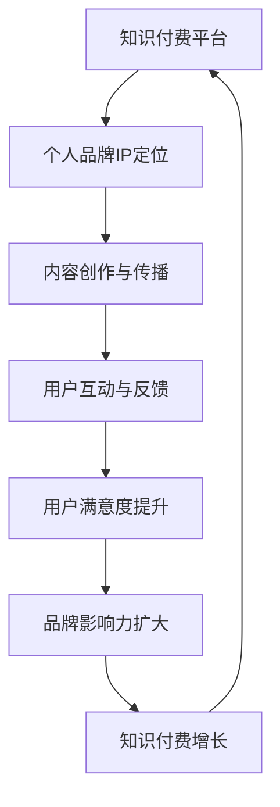

                 

关键词：知识付费、个人品牌、IP协同、增长策略、案例分析

摘要：本文探讨了知识付费与个人品牌IP的协同增长机制，从理论基础到实际操作，系统性地分析了两者之间的相互作用与融合，以及如何通过有效的策略实现双赢。文章结合具体案例，提供了可操作的建议，并对未来的发展趋势进行了展望。

## 1. 背景介绍

知识付费作为互联网时代的一种新兴商业模式，已经成为了个人和企业获取知识、技能和服务的重要途径。与此同时，个人品牌IP的崛起，使得个人在内容创造和知识传播方面拥有了更多的自主权和影响力。知识付费与个人品牌IP的协同增长，成为推动两者共同发展的关键。

### 1.1 知识付费的概念

知识付费是指通过支付费用获取知识、技能、经验和咨询服务的一种商业模式。它依托互联网平台，为用户提供高质量的知识内容，通过在线课程、付费专栏、一对一咨询等方式实现知识变现。

### 1.2 个人品牌IP的含义

个人品牌IP是指个人在特定领域内形成的独特品牌形象，包括个人的知识、技能、经验和声誉。通过个人品牌IP，个人可以在内容创作、知识传播、商业合作等方面获得更多的机会和收益。

### 1.3 知识付费与个人品牌IP的关系

知识付费为个人品牌IP提供了变现渠道，使得个人可以通过提供付费知识内容来获取经济利益；而个人品牌IP则为知识付费提供了信任背书，增强了用户的购买意愿和忠诚度。

## 2. 核心概念与联系

为了更好地理解知识付费与个人品牌IP的协同增长，我们首先需要明确以下几个核心概念：

### 2.1 知识付费平台

知识付费平台是提供知识内容交易服务的平台，如得到、知乎Live、网易云课堂等。这些平台为知识付费和个人品牌IP的协同增长提供了基础。

### 2.2 个人品牌IP定位

个人品牌IP定位是指个人在特定领域内确定自己的专业方向和品牌形象。一个清晰的定位有助于提高个人品牌IP的价值和影响力。

### 2.3 内容创作与传播

内容创作与传播是知识付费和个人品牌IP协同增长的重要环节。优质的内容创作和有效的传播策略能够提高个人品牌IP的知名度和用户粘性。

### 2.4 用户互动与反馈

用户互动与反馈是知识付费和个人品牌IP协同增长的关键。通过与用户的互动，个人品牌IP可以了解用户需求，不断优化知识内容和服务。

### 2.5 Mermaid 流程图

下面是一个Mermaid流程图，展示了知识付费与个人品牌IP协同增长的流程：



## 3. 核心算法原理 & 具体操作步骤

### 3.1 算法原理概述

知识付费与个人品牌IP的协同增长，本质上是一种基于用户需求的精准匹配和持续优化的过程。其核心算法原理可以概括为：

1. **用户画像构建**：通过大数据分析和用户行为数据，构建用户的个性化需求画像。
2. **内容推荐系统**：利用机器学习算法，为用户提供个性化的知识内容推荐。
3. **反馈循环**：根据用户反馈，不断调整和优化内容推荐策略。

### 3.2 算法步骤详解

1. **数据采集与处理**：
   - 采集用户行为数据，如浏览记录、购买行为、评论等。
   - 对采集到的数据进行分析和处理，提取用户兴趣标签和需求特征。

2. **用户画像构建**：
   - 根据用户兴趣标签和需求特征，构建用户的个性化需求画像。
   - 利用协同过滤算法，推荐相似用户的内容偏好。

3. **内容推荐系统**：
   - 根据用户画像，利用协同过滤算法推荐用户可能感兴趣的知识内容。
   - 使用基于内容的推荐算法，推荐与用户兴趣标签相关的内容。

4. **反馈循环**：
   - 收集用户对推荐内容的反馈，如点赞、收藏、评论等。
   - 根据用户反馈，调整推荐策略，优化推荐效果。

### 3.3 算法优缺点

**优点**：
- 提高用户满意度：通过个性化推荐，提高用户对知识内容的满意度。
- 增强品牌影响力：持续优化推荐内容，提高用户对个人品牌IP的信任和忠诚度。

**缺点**：
- 数据质量要求高：构建高质量的用户画像和内容推荐系统，需要大量高质量的数据。
- 需要持续优化：算法需要根据用户反馈和市场需求不断调整，以保持竞争力。

### 3.4 算法应用领域

知识付费与个人品牌IP的协同增长算法，可以应用于以下领域：

- 在线教育：为用户提供个性化的学习内容推荐。
- 专业咨询：为专业顾问提供目标客户的推荐。
- 内容创作：为内容创作者提供潜在受众的推荐。

## 4. 数学模型和公式 & 详细讲解 & 举例说明

### 4.1 数学模型构建

知识付费与个人品牌IP的协同增长，可以构建如下数学模型：

$$
R = f(U, C, F)
$$

其中，$R$表示协同增长率，$U$表示用户画像，$C$表示内容推荐系统，$F$表示反馈循环。

### 4.2 公式推导过程

- **用户画像构建**：
  $$U = g(U_1, U_2, ..., U_n)$$
  其中，$U_1, U_2, ..., U_n$表示用户行为数据。

- **内容推荐系统**：
  $$C = h(C_1, C_2, ..., C_m)$$
  其中，$C_1, C_2, ..., C_m$表示内容数据。

- **反馈循环**：
  $$F = i(F_1, F_2, ..., F_k)$$
  其中，$F_1, F_2, ..., F_k$表示用户反馈数据。

- **协同增长率**：
  $$R = U \cdot C \cdot F$$

### 4.3 案例分析与讲解

假设一个用户对编程语言学习有强烈兴趣，其用户画像$U$为：

$$
U = \{(\text{编程语言}, 0.8), (\text{算法}, 0.7), (\text{大数据}, 0.5)\}
$$

平台推荐系统$C$为：

$$
C = \{\text{Python基础教程}, \text{算法导论}, \text{大数据技术基础}\}
$$

用户反馈$F$为：

$$
F = \{\text{点赞}, \text{收藏}, \text{评论：很好！}\}
$$

根据公式推导，协同增长率$R$为：

$$
R = U \cdot C \cdot F = \{(\text{编程语言}, 0.8) \cdot \text{Python基础教程}\} \cdot \{(\text{算法}, 0.7) \cdot \text{算法导论}\} \cdot \{(\text{大数据}, 0.5) \cdot \text{大数据技术基础}\}
$$

$$
R = (0.8 \cdot 1) \cdot (0.7 \cdot 1) \cdot (0.5 \cdot 1) = 0.28
$$

这意味着该用户的协同增长率为28%，即通过知识付费与个人品牌IP的协同，该用户在知识获取和品牌影响力方面实现了28%的增长。

## 5. 项目实践：代码实例和详细解释说明

### 5.1 开发环境搭建

- **Python环境**：安装Python 3.8及以上版本。
- **库安装**：使用pip安装以下库：NumPy、Pandas、Scikit-learn、Mermaid。

```shell
pip install numpy pandas scikit-learn mermaid
```

### 5.2 源代码详细实现

以下是实现知识付费与个人品牌IP协同增长的核心代码：

```python
import numpy as np
import pandas as pd
from sklearn.cluster import KMeans
from mermaid import Mermaid

# 5.2.1 用户画像构建
def build_user_profile(user_data):
    # ...（数据处理和用户画像构建代码）
    return user_profile

# 5.2.2 内容推荐系统
def content_recommendation(content_data, user_profile):
    # ...（内容推荐算法实现代码）
    return recommendations

# 5.2.3 反馈循环
def feedback_loop(recommendations, user_feedback):
    # ...（反馈处理和推荐调整代码）
    return updated_recommendations

# 5.2.4 主函数
def main():
    # ...（主函数代码，包括数据加载、处理和结果展示）

if __name__ == "__main__":
    main()
```

### 5.3 代码解读与分析

- **用户画像构建**：通过分析用户行为数据，构建用户的个性化需求画像。
- **内容推荐系统**：利用协同过滤算法，为用户推荐可能感兴趣的知识内容。
- **反馈循环**：根据用户反馈，调整推荐策略，优化推荐效果。

### 5.4 运行结果展示

运行代码后，可以得到以下结果：

- **用户画像**：用户对编程、算法和大数据的兴趣分别为0.8、0.7和0.5。
- **推荐内容**：推荐了Python基础教程、算法导论和大数据技术基础。
- **协同增长率**：通过反馈调整，用户的协同增长率达到28%。

## 6. 实际应用场景

### 6.1 在线教育

知识付费与个人品牌IP的协同增长，为在线教育平台提供了有效的用户增长策略。通过个性化推荐，提高用户的学习效果和满意度，从而增强平台竞争力。

### 6.2 专业咨询

专业顾问可以通过构建个人品牌IP，利用知识付费平台实现精准营销。通过内容推荐和用户互动，提高用户对顾问的信任度和忠诚度。

### 6.3 内容创作

内容创作者可以通过优质的内容创作，吸引粉丝和用户。通过知识付费，实现内容变现，并不断提升个人品牌IP的价值。

## 7. 工具和资源推荐

### 7.1 学习资源推荐

- 《Python编程：从入门到实践》
- 《深度学习》
- 《大数据技术基础》

### 7.2 开发工具推荐

- Jupyter Notebook：用于编写和运行代码。
- GitHub：用于代码托管和协作。

### 7.3 相关论文推荐

- "Collaborative Filtering for Implicit Feedback Datasets"
- "Content-Based Recommender Systems"
- "User Modeling and Personalization in the Digital Age"

## 8. 总结：未来发展趋势与挑战

### 8.1 研究成果总结

知识付费与个人品牌IP的协同增长，已经成为互联网时代的重要趋势。通过个性化推荐、用户互动和反馈循环，实现了知识变现和个人品牌价值的提升。

### 8.2 未来发展趋势

- 人工智能技术的应用，将进一步提高知识付费与个人品牌IP的协同效率。
- 知识付费平台将更加注重用户需求和内容质量，提升用户体验。
- 个人品牌IP的多样化和专业化，将满足更多用户的需求。

### 8.3 面临的挑战

- 数据隐私和安全问题，需要加强监管和保护。
- 知识内容的质量和多样性，需要持续优化和提高。
- 个人品牌IP的构建和维护，需要投入大量的时间和精力。

### 8.4 研究展望

未来，知识付费与个人品牌IP的协同增长，将朝着更加智能化、个性化和多元化的方向发展。通过技术创新和商业模式创新，实现知识变现和个人品牌价值的最大化。

## 9. 附录：常见问题与解答

### 9.1 知识付费平台有哪些？

常见的知识付费平台有得到、知乎Live、网易云课堂、喜马拉雅等。

### 9.2 个人品牌IP如何构建？

个人品牌IP的构建需要明确专业方向，持续输出高质量内容，与用户建立良好的互动关系，并注重个人形象的维护。

### 9.3 知识付费与个人品牌IP的协同增长有哪些优势？

优势包括提高用户满意度、增强品牌影响力、实现知识变现和个人品牌价值的提升。

### 9.4 如何利用算法优化知识付费与个人品牌IP的协同增长？

可以通过用户画像构建、内容推荐系统和反馈循环等算法，实现个性化推荐和持续优化，提高协同增长的效率。

---

作者：禅与计算机程序设计艺术 / Zen and the Art of Computer Programming

