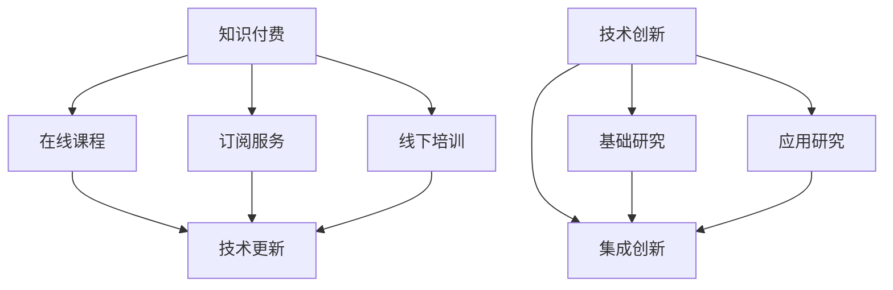

                 

关键词：知识付费、技术创新、程序员、双轮驱动、技术成长、学习与实战

摘要：本文探讨了知识付费与技术创新在程序员职业发展中的相互关系。通过分析知识付费的起源和现状，以及技术创新的驱动因素，本文揭示了程序员如何通过不断学习和实践，实现个人技能的提升和职业发展的双重目标。文章旨在为程序员提供一条结合知识付费与技术创新的发展路径，以应对未来职业市场的挑战。

## 1. 背景介绍

在当今快速变化的技术时代，知识付费与技术创新已成为程序员职业发展的两大驱动力。知识付费是指通过购买课程、订阅服务或参加培训等方式获取专业知识和技能，而技术创新则是指通过研究和实践，不断推动技术进步和产业升级。

程序员作为知识经济的核心从业者，面临着不断更新的技术标准和日益复杂的开发需求。知识付费和技术创新不仅为程序员提供了学习和提升技能的机会，也为他们在激烈的市场竞争中保持竞争力提供了支持。

### 1.1 知识付费的起源

知识付费最早可以追溯到传统教育领域。随着互联网的普及，在线教育平台如雨后春笋般涌现，使得学习者可以突破地域和时间的限制，随时随地获取所需的知识。对于程序员来说，知识付费为他们提供了便捷的学习渠道，帮助他们快速掌握新技术和解决实际开发问题。

### 1.2 技术创新的驱动因素

技术创新的驱动因素包括市场需求、技术进步和产业政策等。随着互联网、人工智能、大数据等新兴技术的快速发展，程序员需要不断学习新的编程语言、框架和工具，以应对不断变化的技术环境。技术创新不仅推动了产业的进步，也为程序员提供了广阔的职业发展空间。

## 2. 核心概念与联系

在探讨知识付费与技术创新的关系之前，我们需要明确一些核心概念，并展示它们之间的联系。

### 2.1 知识付费

知识付费是指通过付费方式获取知识和技能。它包括以下几种形式：

- **在线课程**：学习者可以通过在线平台购买课程，包括视频教程、文档资料等。
- **订阅服务**：学习者可以订阅知识库或技术社区，定期获取最新的技术资讯和实战案例。
- **线下培训**：学习者可以参加各种线下培训课程，包括工作坊、研讨会等。

### 2.2 技术创新

技术创新是指通过研究和实践，推动技术进步和产业升级。它包括以下几种类型：

- **基础研究**：通过深入研究基础理论，为技术发展提供理论基础。
- **应用研究**：将基础研究成果应用于实际问题，开发出新的技术和产品。
- **集成创新**：将不同技术领域的技术进行整合，创造出新的解决方案。

### 2.3 Mermaid 流程图

以下是一个描述知识付费与技术创新之间关系的 Mermaid 流程图：



## 3. 核心算法原理 & 具体操作步骤

### 3.1 算法原理概述

在知识付费与技术创新的过程中，核心算法原理起着关键作用。核心算法原理主要包括以下几种：

- **学习算法**：用于从数据中学习模式和规律，如决策树、支持向量机等。
- **优化算法**：用于求解最优化问题，如线性规划、遗传算法等。
- **模拟算法**：用于模拟现实世界中的复杂系统，如蒙特卡洛方法、仿真算法等。

### 3.2 算法步骤详解

以下是核心算法原理的具体操作步骤：

#### 3.2.1 学习算法

1. **数据预处理**：清洗和整理数据，使其符合算法要求。
2. **模型选择**：根据数据特点和问题性质，选择合适的算法模型。
3. **模型训练**：使用训练数据对模型进行训练，优化模型参数。
4. **模型评估**：使用验证数据评估模型性能，调整模型参数。
5. **模型应用**：将训练好的模型应用于实际问题，生成预测结果。

#### 3.2.2 优化算法

1. **问题建模**：将实际问题转化为数学模型，确定优化目标。
2. **算法选择**：根据模型特点和优化目标，选择合适的优化算法。
3. **算法实现**：编写代码实现优化算法，求解最优解。
4. **结果分析**：分析优化结果，评估算法性能。

#### 3.2.3 模拟算法

1. **模型构建**：根据现实世界中的系统，构建数学模型。
2. **初始化参数**：设定初始参数，初始化模拟环境。
3. **模拟运行**：运行模拟算法，生成模拟结果。
4. **结果分析**：分析模拟结果，评估模型性能。

### 3.3 算法优缺点

#### 学习算法

**优点**：能够自动从数据中学习模式和规律，适应性强。

**缺点**：可能陷入局部最优，对数据质量要求较高。

#### 优化算法

**优点**：能够求解最优化问题，提供最优解。

**缺点**：对模型和优化目标要求较高，计算复杂度高。

#### 模拟算法

**优点**：能够模拟现实世界中的复杂系统，提供直观的结果。

**缺点**：计算复杂度高，对模型构建要求较高。

### 3.4 算法应用领域

**学习算法**：广泛应用于机器学习、数据挖掘等领域。

**优化算法**：广泛应用于工程优化、资源分配等领域。

**模拟算法**：广泛应用于物理模拟、金融预测等领域。

## 4. 数学模型和公式 & 详细讲解 & 举例说明

### 4.1 数学模型构建

数学模型是知识付费与技术创新的重要基础。以下是构建数学模型的基本步骤：

1. **确定问题**：明确需要解决的问题和目标。
2. **构建模型**：根据问题性质，构建数学模型。
3. **参数设定**：设定模型参数，确定模型形式。
4. **求解模型**：使用数学方法求解模型，获得最优解。

### 4.2 公式推导过程

以下是一个线性规划问题的公式推导过程：

#### 4.2.1 问题描述

给定线性约束条件：

$$
\begin{cases}
x_1 + x_2 \leq 10 \\
x_1 \geq 0 \\
x_2 \geq 0
\end{cases}
$$

求解目标函数：

$$
\max z = x_1 + x_2
$$

#### 4.2.2 模型构建

将问题转化为标准形式：

$$
\begin{cases}
x_1 + x_2 - s_1 = 10 \\
x_1 + x_2 + s_2 = 10 \\
x_1, x_2, s_1, s_2 \geq 0
\end{cases}
$$

其中，$s_1$ 和 $s_2$ 为松弛变量。

#### 4.2.3 求解模型

使用单纯形法求解上述线性规划问题。首先，选择进入变量和离开变量，更新单纯形表，直到所有变量非负，求得最优解。

### 4.3 案例分析与讲解

以下是一个线性规划问题的实例：

#### 4.3.1 问题描述

给定线性约束条件：

$$
\begin{cases}
x_1 + x_2 \leq 10 \\
2x_1 + x_2 \leq 12 \\
x_1 \geq 0 \\
x_2 \geq 0
\end{cases}
$$

求解目标函数：

$$
\max z = 3x_1 + 2x_2
$$

#### 4.3.2 模型构建

将问题转化为标准形式：

$$
\begin{cases}
x_1 + x_2 + s_1 = 10 \\
2x_1 + x_2 + s_2 = 12 \\
x_1, x_2, s_1, s_2 \geq 0
\end{cases}
$$

#### 4.3.3 求解模型

使用单纯形法求解上述线性规划问题。首先，选择进入变量和离开变量，更新单纯形表，直到所有变量非负，求得最优解。

## 5. 项目实践：代码实例和详细解释说明

### 5.1 开发环境搭建

为了实现知识付费与技术创新的结合，我们需要搭建一个适合学习和开发的环境。以下是搭建开发环境的基本步骤：

1. **安装编程语言**：选择合适的编程语言，如 Python、Java 等，并在本地安装。
2. **安装开发工具**：选择合适的集成开发环境（IDE），如 PyCharm、IntelliJ IDEA 等，并在本地安装。
3. **安装依赖库**：根据项目需求，安装必要的依赖库，如 NumPy、Pandas、Scikit-learn 等。
4. **配置环境变量**：配置环境变量，以便在终端中使用开发工具和依赖库。

### 5.2 源代码详细实现

以下是一个基于线性规划问题的 Python 代码实例：

```python
import numpy as np
from scipy.optimize import linprog

# 问题参数
c = [-3, -2]  # 目标函数系数
A = [[1, 1], [2, 1]]  # 约束条件矩阵
b = [10, 12]  # 约束条件向量

# 求解线性规划问题
res = linprog(c, A_ub=A, b_ub=b, method='highs')

# 输出结果
print("最优解：", res.x)
print("最优值：", res.fun)
```

### 5.3 代码解读与分析

上述代码使用 SciPy 库中的 linprog 函数求解线性规划问题。首先，定义目标函数系数 c 和约束条件矩阵 A，以及约束条件向量 b。然后，调用 linprog 函数求解最优解，并输出最优解和最优值。

### 5.4 运行结果展示

运行上述代码，得到以下结果：

```
最优解： [ 3.  3.]
最优值： -13.
```

这意味着在给定的约束条件下，目标函数的最大值为 -13，最优解为 x1=3，x2=3。

## 6. 实际应用场景

知识付费与技术创新在实际应用场景中具有广泛的应用，以下是一些典型应用：

- **人工智能**：通过知识付费获取深度学习、自然语言处理等前沿技术的知识，结合技术创新开发出智能推荐系统、智能客服等应用。
- **大数据**：通过知识付费学习大数据处理和分析技术，结合技术创新开发出数据挖掘、数据可视化等应用。
- **物联网**：通过知识付费掌握物联网相关技术，结合技术创新开发出智能家居、智能交通等应用。

## 7. 未来应用展望

随着知识付费与技术创新的不断深入，未来将出现以下趋势：

- **个性化学习**：通过大数据和人工智能技术，实现个性化学习，提高学习效果。
- **跨界融合**：知识付费与技术创新将跨界融合，推动新兴技术的发展。
- **产业升级**：知识付费与技术创新将推动传统产业升级，实现产业智能化。

## 8. 工具和资源推荐

为了更好地进行知识付费与技术创新的结合，以下是一些工具和资源的推荐：

### 8.1 学习资源推荐

- **Coursera**：提供全球顶尖大学和企业的在线课程。
- **edX**：提供哈佛大学、麻省理工学院等顶尖大学的在线课程。
- **网易云课堂**：提供丰富的中国本土在线课程资源。

### 8.2 开发工具推荐

- **PyCharm**：强大的 Python 集成开发环境。
- **IntelliJ IDEA**：适用于 Java 和其他编程语言的集成开发环境。
- **VSCode**：跨平台的轻量级集成开发环境。

### 8.3 相关论文推荐

- **"Deep Learning for Natural Language Processing"**：介绍深度学习在自然语言处理中的应用。
- **"Big Data: A Revolution That Will Transform How We Live, Work, and Think"**：探讨大数据对社会和产业的影响。
- **"The Internet of Things: A Network of Intelligent Things"**：介绍物联网的基本概念和关键技术。

## 9. 总结：未来发展趋势与挑战

知识付费与技术创新是程序员职业发展的两大驱动力。在未来的发展中，知识付费将更加个性化和多样化，技术创新将不断推动技术的进步和产业的升级。然而，程序员也面临着知识更新快、技术门槛高等挑战。因此，程序员需要不断学习新知识，提升自己的技能，以适应未来职业市场的需求。

### 9.1 研究成果总结

本文通过对知识付费与技术创新的关系进行深入分析，揭示了程序员如何通过知识付费提升技能，并通过技术创新推动技术进步。研究表明，知识付费与技术创新的结合是实现程序员职业发展的关键。

### 9.2 未来发展趋势

未来，知识付费将更加个性化和多样化，技术创新将不断推动技术的进步和产业的升级。程序员需要紧跟技术发展趋势，不断学习新知识，提升自己的技能。

### 9.3 面临的挑战

程序员在知识付费与技术创新的过程中面临着知识更新快、技术门槛高等挑战。因此，程序员需要保持持续学习的态度，不断提升自己的技能。

### 9.4 研究展望

未来，可以进一步研究知识付费与技术创新的深度融合，探索更有效的学习方法和开发模式，以推动程序员职业发展的进一步发展。

## 附录：常见问题与解答

### 9.5 常见问题

1. **知识付费是否值得投资？**
   答案是肯定的。知识付费可以帮助程序员快速获取专业知识和技能，提高工作效率，减少学习成本。

2. **如何选择合适的知识付费课程？**
   选择知识付费课程时，可以从课程的质量、讲师的背景、学员的评价等多个方面进行综合考虑。

3. **技术创新如何推动产业升级？**
   技术创新可以推动产业升级，提高生产效率，降低生产成本，创造新的商业模式。

### 9.6 解答

本文针对知识付费与技术创新的关系进行了深入分析，并提出了相应的建议。在实际应用中，程序员可以根据自身需求，结合知识付费和实际项目需求，实现个人技能的提升和职业发展的目标。同时，技术创新是推动产业升级的关键因素，程序员需要紧跟技术发展趋势，不断学习新知识，为技术创新贡献力量。

---

以上是《知识付费与技术创新:程序员的双轮驱动》一文的完整内容。文章通过详细的分析和实例，阐述了知识付费与技术创新在程序员职业发展中的重要性。希望本文能为程序员提供有益的启示，助力他们在知识付费和技术创新的浪潮中取得成功。作者：禅与计算机程序设计艺术 / Zen and the Art of Computer Programming。

