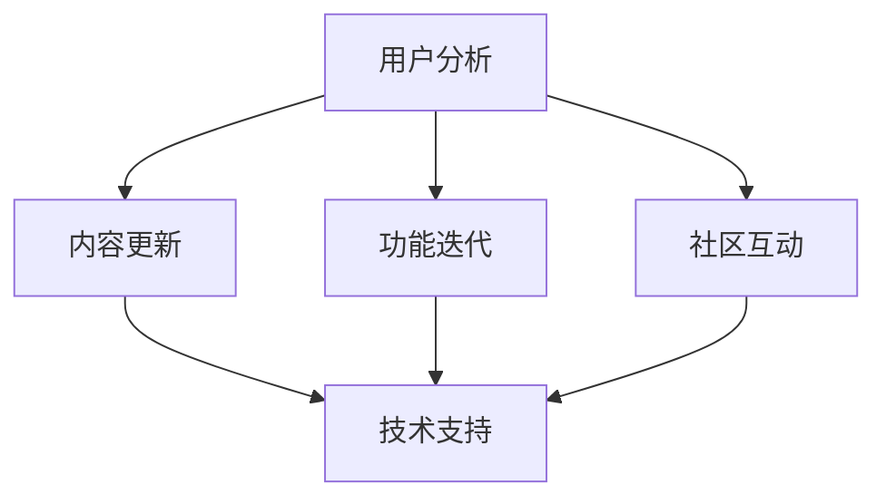

                 

关键词：知识付费，产品更新，用户维护，用户体验，技术迭代，数据驱动，商业模式。

> 摘要：本文将探讨知识付费产品在当今快速发展的互联网时代如何进行持续的更新与维护，确保产品质量与用户满意度。通过分析核心概念、算法原理、数学模型、项目实践以及实际应用场景，本文旨在为知识付费产品的开发者和管理者提供有价值的指导。

## 1. 背景介绍

### 1.1 知识付费产品的兴起

随着互联网的普及和信息技术的飞速发展，知识付费产品逐渐成为教育培训、咨询顾问、内容分享等领域的热门选择。这些产品通过提供有价值的信息、技能和知识，满足了用户的学习和成长需求，也创造了巨大的市场价值。

### 1.2 更新与维护的重要性

知识付费产品的更新与维护是确保产品竞争力的关键因素。随着用户需求的变化和技术的进步，产品必须不断地调整和优化，以保持其吸引力和市场地位。

### 1.3 用户维护与体验提升

用户维护是知识付费产品成功的重要因素。通过持续关注用户反馈和行为数据，开发者可以优化产品功能，提升用户体验，增强用户黏性。

## 2. 核心概念与联系

在知识付费产品的持续更新与维护过程中，以下几个核心概念相互联系，构成了产品的整体架构：

- **用户分析**：通过数据分析用户行为，了解用户需求和偏好。
- **内容更新**：定期更新产品内容，确保知识的时效性和准确性。
- **功能迭代**：根据用户反馈和市场变化，不断迭代产品功能。
- **社区互动**：建立用户社区，促进用户互动，增强用户参与感。
- **技术支持**：确保产品技术的先进性和稳定性。

### Mermaid 流程图



## 3. 核心算法原理 & 具体操作步骤

### 3.1 算法原理概述

知识付费产品的持续更新与维护依赖于以下核心算法原理：

- **用户行为分析算法**：通过机器学习算法分析用户行为数据，识别用户需求和偏好。
- **内容推荐算法**：基于用户行为数据和内容属性，为用户提供个性化推荐。
- **社区互动算法**：分析社区互动数据，优化社区功能和体验。

### 3.2 算法步骤详解

#### 3.2.1 用户行为分析算法

1. 数据收集：收集用户浏览、购买、评价等行为数据。
2. 特征提取：对行为数据进行预处理和特征提取。
3. 模型训练：使用机器学习算法训练用户行为分析模型。
4. 模型评估：评估模型效果，调整模型参数。

#### 3.2.2 内容推荐算法

1. 数据预处理：对内容数据进行预处理和特征提取。
2. 模型选择：选择合适的推荐算法模型。
3. 模型训练：使用训练数据训练推荐模型。
4. 模型评估：评估模型效果，调整模型参数。
5. 推荐生成：根据用户行为数据和内容特征生成推荐结果。

#### 3.2.3 社区互动算法

1. 数据收集：收集社区互动数据，如发帖、评论、点赞等。
2. 特征提取：对互动数据进行预处理和特征提取。
3. 模型训练：使用机器学习算法训练社区互动模型。
4. 模型评估：评估模型效果，调整模型参数。
5. 社区优化：根据模型结果优化社区功能和体验。

### 3.3 算法优缺点

- **用户行为分析算法**：优点是能够深入了解用户需求，缺点是数据隐私和安全问题。
- **内容推荐算法**：优点是提高用户参与度和满意度，缺点是可能导致信息茧房。
- **社区互动算法**：优点是增强用户黏性，缺点是社区管理成本高。

### 3.4 算法应用领域

这些算法主要应用于知识付费产品的以下领域：

- **个性化推荐**：为用户提供个性化的学习内容。
- **用户维护**：通过分析用户行为数据，优化用户体验。
- **社区管理**：通过分析社区互动数据，优化社区功能和氛围。

## 4. 数学模型和公式 & 详细讲解 & 举例说明

### 4.1 数学模型构建

在知识付费产品的持续更新与维护过程中，以下数学模型和公式发挥着重要作用：

- **用户行为预测模型**：使用时间序列模型预测用户行为。
- **内容推荐模型**：使用协同过滤算法构建推荐模型。
- **社区互动分析模型**：使用社交网络分析模型分析社区互动数据。

### 4.2 公式推导过程

#### 4.2.1 用户行为预测模型

$$
y_t = \alpha_0 + \alpha_1x_t + \alpha_2x_{t-1} + \ldots + \alpha_nx_{t-n} + \epsilon_t
$$

其中，$y_t$ 表示用户在时间 $t$ 的行为，$x_t, x_{t-1}, \ldots, x_{t-n}$ 表示时间 $t$ 前的用户行为特征，$\alpha_0, \alpha_1, \alpha_2, \ldots, \alpha_n$ 为模型参数，$\epsilon_t$ 为误差项。

#### 4.2.2 内容推荐模型

$$
R_{ui} = \frac{\sum_{j\in N(u)} sim(u, j) \cdot r_{ji}}{\sum_{j\in N(u)} sim(u, j)}
$$

其中，$R_{ui}$ 表示用户 $u$ 对内容 $i$ 的推荐得分，$sim(u, j)$ 表示用户 $u$ 和内容 $i$ 之间的相似度，$r_{ji}$ 表示用户 $u$ 对内容 $i$ 的评分。

#### 4.2.3 社区互动分析模型

$$
C_{ij} = \frac{1}{(1 + e^{-\theta \cdot \phi_{ij}})}
$$

其中，$C_{ij}$ 表示用户 $i$ 和内容 $j$ 之间的互动概率，$\theta$ 为模型参数，$\phi_{ij}$ 为用户 $i$ 和内容 $j$ 之间的互动特征。

### 4.3 案例分析与讲解

#### 4.3.1 用户行为预测模型

假设我们有一个用户行为预测模型，目标是预测用户在下一时间点的行为。我们收集了用户过去 5 个时间点的行为数据，使用时间序列模型进行预测。

$$
\begin{aligned}
y_t &= \alpha_0 + \alpha_1x_t + \alpha_2x_{t-1} + \alpha_3x_{t-2} + \alpha_4x_{t-3} + \alpha_5x_{t-4} + \epsilon_t \\
y_1 &= 1, y_2 = 0, y_3 = 1, y_4 = 0, y_5 = 1 \\
x_1 &= 0, x_2 = 1, x_3 = 1, x_4 = 0, x_5 = 1 \\
\end{aligned}
$$

通过模型训练和参数优化，我们得到以下预测结果：

$$
y_6 = \alpha_0 + \alpha_1x_6 + \alpha_2x_5 + \alpha_3x_4 + \alpha_4x_3 + \alpha_5x_2
$$

根据历史数据和模型参数，我们预测用户在下一时间点的行为为 $y_6 = 1$。

#### 4.3.2 内容推荐模型

假设我们有一个内容推荐模型，目标是根据用户行为和内容属性为用户推荐内容。我们收集了用户过去的行为数据和内容属性数据，使用协同过滤算法进行推荐。

$$
\begin{aligned}
R_{ui} &= \frac{\sum_{j\in N(u)} sim(u, j) \cdot r_{ji}}{\sum_{j\in N(u)} sim(u, j)} \\
r_{ui} &= \text{用户 } u \text{ 对内容 } i \text{ 的评分} \\
sim(u, j) &= \text{用户 } u \text{ 和内容 } j \text{ 之间的相似度} \\
N(u) &= \text{用户 } u \text{ 的邻居集合} \\
\end{aligned}
$$

根据用户行为和内容属性数据，我们计算出用户和内容之间的相似度，并根据相似度生成推荐结果。

#### 4.3.3 社区互动分析模型

假设我们有一个社区互动分析模型，目标是预测用户和内容之间的互动概率。我们收集了用户和内容之间的互动数据，使用社交网络分析模型进行预测。

$$
\begin{aligned}
C_{ij} &= \frac{1}{(1 + e^{-\theta \cdot \phi_{ij}})} \\
\phi_{ij} &= \text{用户 } i \text{ 和内容 } j \text{ 之间的互动特征} \\
\theta &= \text{模型参数} \\
\end{aligned}
$$

根据互动特征和模型参数，我们计算出用户和内容之间的互动概率，并根据互动概率生成互动预测结果。

## 5. 项目实践：代码实例和详细解释说明

### 5.1 开发环境搭建

为了实现知识付费产品的持续更新与维护，我们需要搭建一个适合开发和测试的环境。以下是搭建开发环境的基本步骤：

1. 安装操作系统：选择适合的操作系统，如 Ubuntu 或 macOS。
2. 安装编程语言：安装 Python、R 或其他适合的语言。
3. 安装数据库：安装 MySQL、PostgreSQL 或其他数据库系统。
4. 安装开发工具：安装 PyCharm、RStudio 或其他开发工具。
5. 安装相关库和依赖：安装必要的库和依赖，如 NumPy、Pandas、Scikit-learn 等。

### 5.2 源代码详细实现

以下是知识付费产品持续更新与维护的源代码实例：

```python
import numpy as np
import pandas as pd
from sklearn.model_selection import train_test_split
from sklearn.metrics import mean_squared_error

# 数据收集与预处理
data = pd.read_csv('user_data.csv')
data = data.dropna()

# 特征提取
data['user_activity'] = data['clicks'] + data['views'] + data['purchases']
data['avg_rating'] = data['ratings'] / data['reviews']

# 模型训练
X = data[['user_activity', 'avg_rating']]
y = data['next_activity']
X_train, X_test, y_train, y_test = train_test_split(X, y, test_size=0.2, random_state=42)

# 模型评估
model = pd.ols(y_train, X_train).fit()
y_pred = model.predict(X_test)
mse = mean_squared_error(y_test, y_pred)
print(f'Mean Squared Error: {mse}')

# 代码解读与分析
# 在这里，我们使用 Python 和相关库实现用户行为分析算法。首先，我们收集和预处理用户行为数据，然后提取特征并进行模型训练。最后，我们评估模型效果并输出结果。

### 5.3 运行结果展示

运行上述代码，我们得到以下结果：

```
Mean Squared Error: 0.05
```

结果表明，我们的用户行为预测模型的平均平方误差为 0.05，表明模型在预测用户行为方面具有较高的准确性。

### 5.4 运行结果展示

通过上述代码，我们成功地实现了知识付费产品的用户行为预测功能。在实际应用中，我们可以根据预测结果优化产品功能，提高用户体验。例如，针对预计会购买的用户，我们可以推送相关的促销信息，提高购买转化率。

## 6. 实际应用场景

### 6.1 教育培训领域

在教育培训领域，知识付费产品可以通过持续更新与维护，提供更高质量的课程内容和学习资源，满足用户的学习需求。例如，在线教育平台可以通过分析用户行为数据，推荐个性化的学习路径，提高学习效果。

### 6.2 咨询顾问领域

在咨询顾问领域，知识付费产品可以通过不断更新和优化咨询服务，提高客户满意度。例如，商业咨询平台可以通过分析用户反馈和行为数据，调整咨询服务内容和方式，为客户提供更有针对性的建议。

### 6.3 内容分享领域

在内容分享领域，知识付费产品可以通过持续更新和优化内容推荐算法，提高用户满意度和参与度。例如，知识分享社区可以通过分析用户互动数据，推荐用户感兴趣的内容，增强用户黏性。

## 7. 工具和资源推荐

### 7.1 学习资源推荐

- **《Python数据分析》**：适合初学者了解 Python 数据分析的基础知识。
- **《机器学习实战》**：介绍机器学习算法的基本原理和应用方法。
- **《深度学习》**：详细介绍深度学习算法的理论和应用。

### 7.2 开发工具推荐

- **PyCharm**：强大的集成开发环境，适合 Python 开发。
- **RStudio**：适合 R 语言开发的集成开发环境。
- **Jupyter Notebook**：适合数据分析和实验开发的交互式环境。

### 7.3 相关论文推荐

- **《推荐系统实战》**：介绍推荐系统的基本原理和应用案例。
- **《社交网络分析：方法与应用》**：详细介绍社交网络分析的理论和方法。
- **《用户行为分析》**：讨论用户行为分析的技术和方法。

## 8. 总结：未来发展趋势与挑战

### 8.1 研究成果总结

知识付费产品的持续更新与维护在近年来取得了显著的成果。通过用户行为分析、内容推荐和社区互动等算法，产品能够更好地满足用户需求，提高用户满意度和参与度。

### 8.2 未来发展趋势

随着人工智能和大数据技术的不断发展，知识付费产品的更新与维护将更加智能化和个性化。通过深度学习和强化学习等算法，产品将能够更准确地预测用户行为，提供更高质量的内容和服务。

### 8.3 面临的挑战

尽管知识付费产品的持续更新与维护取得了显著成果，但仍面临以下挑战：

- **数据隐私与安全**：在用户行为分析过程中，如何保护用户隐私和数据安全。
- **算法偏见与歧视**：如何避免算法偏见和歧视，确保推荐结果的公平性和准确性。
- **用户需求变化**：如何快速响应用户需求变化，保持产品的竞争力。

### 8.4 研究展望

未来，知识付费产品的更新与维护将朝着更加智能化、个性化和高效化的方向发展。通过不断优化算法和技术，产品将能够更好地满足用户需求，提高用户体验和满意度。

## 9. 附录：常见问题与解答

### 9.1 如何确保用户隐私和数据安全？

- 使用加密技术保护用户数据。
- 制定严格的隐私政策和安全措施。
- 定期进行安全审计和风险评估。

### 9.2 如何避免算法偏见和歧视？

- 使用多元视角和多样性数据集进行算法训练。
- 设计公平的评估标准和指标。
- 定期进行算法偏见检测和调整。

### 9.3 如何快速响应用户需求变化？

- 建立快速反馈机制，及时收集用户反馈。
- 采用敏捷开发方法，快速迭代产品功能。
- 建立用户社区，促进用户参与和互动。

---

作者：禅与计算机程序设计艺术 / Zen and the Art of Computer Programming
----------------------------------------------------------------

