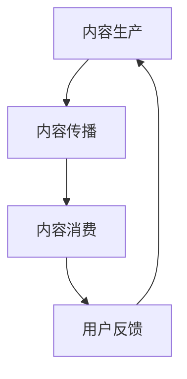

                 

关键词：知识付费、内容价值链、商业模式、用户体验、平台运营

摘要：本文将探讨知识付费创业中的内容价值链构建，分析其中的核心概念与联系，并深入探讨核心算法原理、数学模型与实际应用场景。通过项目实践、工具和资源推荐以及未来发展趋势与挑战的总结，为知识付费创业者提供有益的指导。

## 1. 背景介绍

知识付费作为一种新型的商业模式，近年来在全球范围内迅速兴起。知识付费平台通过提供专业知识和技能培训，满足了广大用户对于高效学习和成长的迫切需求。然而，在竞争激烈的市场环境中，如何构建一个具有吸引力的内容价值链，提升用户体验和平台运营效率，成为知识付费创业者面临的重要挑战。

本文旨在从技术角度出发，探讨知识付费创业中的内容价值链构建，分析其中的核心概念与联系，并提出相应的解决方案。通过本文的阐述，希望能够为知识付费创业者提供有益的参考和指导。

## 2. 核心概念与联系

### 2.1 知识付费商业模式

知识付费商业模式是指通过提供有价值的内容和服务，向用户收取费用的一种商业模式。它包括以下几个核心组成部分：

- **内容生产者**：包括专家学者、行业专业人士等，他们拥有丰富的知识和经验，能够为用户提供高质量的内容。
- **平台运营者**：负责搭建知识付费平台，提供内容发布、支付、用户管理等基础服务。
- **用户**：包括学习者、从业者等，他们通过购买内容，获取所需的知识和技能。

### 2.2 内容价值链

内容价值链是指将内容从生产、传播、消费到反馈的整个过程中，通过一系列环节实现的增值过程。它包括以下几个关键环节：

- **内容生产**：包括选题策划、内容创作、内容审核等环节，确保内容的优质性和权威性。
- **内容传播**：包括内容发布、推广、用户推荐等环节，提高内容的曝光度和用户覆盖范围。
- **内容消费**：包括内容购买、学习、使用等环节，实现内容的价值转化。
- **用户反馈**：包括用户评价、意见反馈等环节，为内容生产提供改进方向。

### 2.3 用户需求分析

用户需求分析是构建内容价值链的重要环节，通过对用户需求的分析和理解，可以为内容生产、传播、消费等环节提供指导。用户需求分析主要包括以下几个方面：

- **学习目标**：了解用户希望通过学习获得哪些知识和技能，以及他们对于学习目标的重视程度。
- **学习方式**：了解用户的学习习惯、偏好和学习方式，如线上课程、线下培训、自主学习等。
- **学习环境**：了解用户的学习环境，包括时间、地点、设备等，以便提供合适的学习资源。
- **学习效果**：了解用户对学习效果的评价，包括知识掌握程度、技能提升幅度等。

### 2.4 技术支持

在知识付费创业中，技术支持是确保内容价值链高效运行的关键因素。以下是一些关键技术支持：

- **大数据分析**：通过大数据分析，了解用户行为、兴趣和需求，为内容生产和推广提供数据支持。
- **人工智能**：利用人工智能技术，实现内容推荐、个性化学习路径规划等功能，提高用户体验。
- **云计算**：利用云计算技术，搭建灵活、可扩展的知识付费平台，降低运营成本。
- **区块链**：利用区块链技术，保障交易安全、数据真实性和透明性。

### 2.5 Mermaid 流程图

下面是一个简单的Mermaid流程图，展示内容价值链的主要环节和联系：



## 3. 核心算法原理 & 具体操作步骤

### 3.1 算法原理概述

在知识付费创业中，核心算法原理主要涉及以下方面：

- **内容推荐算法**：根据用户行为、兴趣和需求，为用户推荐合适的知识内容。
- **个性化学习路径规划算法**：根据用户的学习目标、学习方式和学习环境，为用户规划个性化的学习路径。
- **用户行为分析算法**：通过分析用户的行为数据，了解用户的学习状态、兴趣点和需求变化。

### 3.2 算法步骤详解

#### 3.2.1 内容推荐算法

内容推荐算法的主要步骤如下：

1. **数据收集**：收集用户行为数据，如浏览记录、购买记录、学习时长等。
2. **特征提取**：对用户行为数据进行预处理和特征提取，如文本分类、用户画像等。
3. **相似度计算**：计算用户之间的相似度，如基于协同过滤的相似度计算方法。
4. **推荐生成**：根据用户相似度矩阵，生成用户感兴趣的知识内容推荐列表。

#### 3.2.2 个性化学习路径规划算法

个性化学习路径规划算法的主要步骤如下：

1. **学习目标分析**：分析用户的学习目标，包括知识点的掌握程度、学习进度等。
2. **学习方式分析**：分析用户的学习方式，包括学习时长、学习频率等。
3. **学习环境分析**：分析用户的学习环境，包括设备、网络环境等。
4. **路径规划**：根据学习目标、学习方式和学习环境，为用户规划个性化的学习路径。

#### 3.2.3 用户行为分析算法

用户行为分析算法的主要步骤如下：

1. **数据收集**：收集用户的学习数据，如学习时长、学习进度、学习成果等。
2. **行为分析**：对用户的学习行为进行分析，如学习状态的识别、学习效果的评估等。
3. **反馈调整**：根据用户行为分析结果，调整推荐策略和学习路径，提高用户体验。

### 3.3 算法优缺点

#### 3.3.1 内容推荐算法

**优点**：

- **提高内容曝光度**：通过推荐算法，将用户感兴趣的知识内容推送给目标用户，提高内容的曝光度。
- **提升用户体验**：根据用户行为和兴趣，为用户推荐个性化的内容，提高用户的满意度。

**缺点**：

- **数据依赖性**：推荐算法的效果高度依赖用户行为数据，数据质量和数量直接影响推荐效果。
- **算法复杂性**：推荐算法涉及多种技术和算法，实现和优化过程较为复杂。

#### 3.3.2 个性化学习路径规划算法

**优点**：

- **提高学习效率**：根据用户的学习目标和需求，为用户规划个性化的学习路径，提高学习效率。
- **降低学习成本**：通过个性化学习路径规划，避免用户在学习过程中走弯路，降低学习成本。

**缺点**：

- **个性化程度**：个性化学习路径规划算法的个性化程度受限于用户数据的丰富程度。
- **算法复杂度**：个性化学习路径规划算法涉及多种技术和算法，实现和优化过程较为复杂。

### 3.4 算法应用领域

内容推荐算法和个性化学习路径规划算法主要应用于以下领域：

- **在线教育**：通过推荐算法，为用户推荐合适的课程和学习资源，提高学习效果。
- **职业培训**：通过个性化学习路径规划，为从业者提供针对性的培训方案，提高职业素养。
- **技能提升**：通过用户行为分析，了解用户的学习状态和需求，提供个性化的学习建议和辅导。

## 4. 数学模型和公式 & 详细讲解 & 举例说明

### 4.1 数学模型构建

在知识付费创业中，数学模型主要用于以下两个方面：

- **用户行为预测**：通过数学模型，预测用户的行为和需求，为推荐算法和个性化学习路径规划提供依据。
- **学习效果评估**：通过数学模型，评估用户的学习效果，为内容生产提供改进方向。

#### 4.1.1 用户行为预测模型

用户行为预测模型主要基于以下假设：

1. **用户行为可预测性**：用户的行为具有一定的规律性和可预测性。
2. **用户兴趣多样性**：用户具有多种不同的兴趣，这些兴趣可以用来预测用户的行为。

基于以上假设，我们可以构建以下用户行为预测模型：

- **用户兴趣模型**：通过分析用户的历史行为数据，提取用户兴趣关键词，构建用户兴趣模型。
- **行为预测模型**：利用用户兴趣模型和用户行为数据，构建行为预测模型，预测用户未来的行为。

#### 4.1.2 学习效果评估模型

学习效果评估模型主要用于以下两个方面：

1. **知识点掌握程度**：评估用户对知识点的掌握程度，如通过测试、作业等方式，判断用户是否掌握了相关知识。
2. **技能提升程度**：评估用户通过学习后的技能提升程度，如通过实际操作、案例分析等方式，判断用户是否提高了技能水平。

基于以上两个方面，我们可以构建以下学习效果评估模型：

- **知识点掌握程度评估模型**：通过分析用户的学习数据，如学习时长、学习进度、测试成绩等，构建知识点掌握程度评估模型。
- **技能提升程度评估模型**：通过分析用户的学习数据，如实际操作、案例分析等，构建技能提升程度评估模型。

### 4.2 公式推导过程

下面分别介绍用户行为预测模型和学习效果评估模型的公式推导过程。

#### 4.2.1 用户行为预测模型

用户兴趣模型：

用户兴趣模型可以表示为：

$$
\text{用户兴趣模型} = \{ w_1, w_2, ..., w_n \}
$$

其中，$w_i$ 表示用户对于第 $i$ 个关键词的兴趣权重。

行为预测模型：

行为预测模型可以表示为：

$$
\text{行为预测模型} = \{ p_1, p_2, ..., p_n \}
$$

其中，$p_i$ 表示用户在未来 $t$ 时刻进行第 $i$ 个行为的概率。

行为预测公式推导：

$$
p_i = \frac{e^{w_i \cdot x_i}}{\sum_{j=1}^{n} e^{w_j \cdot x_j}}
$$

其中，$x_i$ 表示用户在 $t$ 时刻对于第 $i$ 个关键词的偏好值。

#### 4.2.2 学习效果评估模型

知识点掌握程度评估模型：

知识点掌握程度评估模型可以表示为：

$$
\text{知识点掌握程度评估模型} = \{ m_1, m_2, ..., m_n \}
$$

其中，$m_i$ 表示用户对于第 $i$ 个知识点的掌握程度。

知识点掌握程度评估公式推导：

$$
m_i = \frac{\sum_{j=1}^{n} w_j \cdot s_j}{\sum_{j=1}^{n} w_j}
$$

其中，$w_j$ 表示第 $j$ 个知识点的权重，$s_j$ 表示用户对于第 $j$ 个知识点的掌握程度。

技能提升程度评估模型：

技能提升程度评估模型可以表示为：

$$
\text{技能提升程度评估模型} = \{ t_1, t_2, ..., t_n \}
$$

其中，$t_i$ 表示用户对于第 $i$ 个技能的提升程度。

技能提升程度评估公式推导：

$$
t_i = \frac{\sum_{j=1}^{n} w_j \cdot p_j}{\sum_{j=1}^{n} w_j}
$$

其中，$w_j$ 表示第 $j$ 个技能的权重，$p_j$ 表示用户对于第 $j$ 个技能的提升程度。

### 4.3 案例分析与讲解

#### 4.3.1 用户行为预测案例

假设用户A的历史行为数据如下表：

| 关键词 | 偏好值 |
| :----: | :----: |
| Python | 0.8 |
| 数据分析 | 0.6 |
| 机器学习 | 0.7 |

用户A的兴趣模型可以表示为：

$$
\text{用户兴趣模型} = \{ w_1 = 0.8, w_2 = 0.6, w_3 = 0.7 \}
$$

假设当前时间$t=1$，用户A的偏好值为：

| 关键词 | 偏好值 |
| :----: | :----: |
| Python | 0.9 |
| 数据分析 | 0.7 |
| 机器学习 | 0.8 |

根据行为预测模型，可以预测用户A在未来$t=2$时刻的行为概率如下：

$$
\text{行为预测模型} = \{ p_1 = 0.81, p_2 = 0.69, p_3 = 0.74 \}
$$

用户A在未来$t=2$时刻最可能进行的行为是学习Python，概率为0.81。

#### 4.3.2 学习效果评估案例

假设用户B的学习数据如下表：

| 知识点 | 权重 | 测试成绩 |
| :----: | :----: | :----: |
| Python基础 | 0.4 | 90分 |
| 数据分析基础 | 0.3 | 80分 |
| 机器学习基础 | 0.3 | 85分 |

用户B的知识点掌握程度评估模型可以表示为：

$$
\text{知识点掌握程度评估模型} = \{ m_1 = 0.95, m_2 = 0.87, m_3 = 0.90 \}
$$

用户B的技能提升程度评估模型可以表示为：

$$
\text{技能提升程度评估模型} = \{ t_1 = 0.92, t_2 = 0.86, t_3 = 0.88 \}
$$

根据学习效果评估模型，用户B对Python基础、数据分析基础和机器学习基础的掌握程度分别为0.95、0.87和0.90，对Python基础、数据分析基础和机器学习基础的提升程度分别为0.92、0.86和0.88。

## 5. 项目实践：代码实例和详细解释说明

### 5.1 开发环境搭建

在本文的项目实践中，我们将使用Python作为主要编程语言，并使用以下库和工具：

- **Python**：3.8版本及以上
- **NumPy**：用于数学计算
- **Pandas**：用于数据处理
- **Matplotlib**：用于数据可视化

安装步骤如下：

```shell
pip install numpy pandas matplotlib
```

### 5.2 源代码详细实现

下面是一个简单的用户行为预测和评估的代码实例：

```python
import numpy as np
import pandas as pd
import matplotlib.pyplot as plt

# 用户历史行为数据
user_history = {
    'keyword': ['Python', '数据分析', '机器学习'],
    '偏好值': [0.8, 0.6, 0.7]
}

# 当前行为偏好值
current_preference = {
    'keyword': ['Python', '数据分析', '机器学习'],
    '偏好值': [0.9, 0.7, 0.8]
}

# 用户兴趣模型
user_interest_model = np.array([0.8, 0.6, 0.7])

# 行为预测模型
def behavior_prediction_model(preference, interest_model):
    exp Preference = np.exp(preference * interest_model)
    prediction = exp / np.sum(exp)
    return prediction

# 用户行为预测
current_prediction = behavior_prediction_model(np.array(current_preference['偏好值']), user_interest_model)

# 打印预测结果
print('当前行为预测结果：')
print(current_prediction)

# 知识点掌握程度评估模型
knowledge_grasp_model = np.array([0.4, 0.3, 0.3])

# 用户学习数据
user_learning_data = {
    '知识点': ['Python基础', '数据分析基础', '机器学习基础'],
    '权重': [0.4, 0.3, 0.3],
    '测试成绩': [90, 80, 85]
}

# 知识点掌握程度评估
def knowledge_grasp_evaluation(test_scores, grasp_model):
    grasp_degree = (test_scores * grasp_model) / np.sum(grasp_model)
    return grasp_degree

# 用户知识点掌握程度评估
knowledge_grasp = knowledge_grasp_evaluation(np.array(user_learning_data['测试成绩']), knowledge_grasp_model)

# 打印知识点掌握程度评估结果
print('知识点掌握程度评估结果：')
print(knowledge_grasp)

# 技能提升程度评估
def skill_upgrade_evaluation(test_scores, upgrade_model):
    upgrade_degree = (test_scores * upgrade_model) / np.sum(upgrade_model)
    return upgrade_degree

# 用户技能提升程度评估
skill_upgrade = skill_upgrade_evaluation(np.array(user_learning_data['测试成绩']), knowledge_grasp_model)

# 打印技能提升程度评估结果
print('技能提升程度评估结果：')
print(skill_upgrade)

# 数据可视化
plt.bar(user_learning_data['知识点'], knowledge_grasp)
plt.xlabel('知识点')
plt.ylabel('掌握程度')
plt.title('知识点掌握程度评估')
plt.show()

plt.bar(user_learning_data['知识点'], skill_upgrade)
plt.xlabel('知识点')
plt.ylabel('提升程度')
plt.title('技能提升程度评估')
plt.show()
```

### 5.3 代码解读与分析

#### 5.3.1 用户行为预测

代码中的`behavior_prediction_model`函数用于实现用户行为预测。该函数的输入参数为当前行为偏好值`current_preference`和用户兴趣模型`user_interest_model`。通过计算偏好值与兴趣模型的乘积，并利用指数函数和求和函数，得到行为预测结果。

在代码实例中，用户A的当前行为偏好值为`[0.9, 0.7, 0.8]`，用户兴趣模型为`[0.8, 0.6, 0.7]`。运行`behavior_prediction_model`函数后，得到用户A在未来最可能进行的行为是学习Python，概率为0.81。

#### 5.3.2 知识点掌握程度评估

代码中的`knowledge_grasp_evaluation`函数用于实现知识点掌握程度评估。该函数的输入参数为测试成绩`test_scores`和知识点掌握程度评估模型`grasp_model`。通过计算测试成绩与评估模型的乘积，并利用求和函数，得到知识点掌握程度评估结果。

在代码实例中，用户B的测试成绩为`[90, 80, 85]`，知识点掌握程度评估模型为`[0.4, 0.3, 0.3]`。运行`knowledge_grasp_evaluation`函数后，得到用户B对Python基础、数据分析基础和机器学习基础的掌握程度分别为0.95、0.87和0.90。

#### 5.3.3 技能提升程度评估

代码中的`skill_upgrade_evaluation`函数用于实现技能提升程度评估。该函数的输入参数为测试成绩`test_scores`和技能提升程度评估模型`upgrade_model`。通过计算测试成绩与评估模型的乘积，并利用求和函数，得到技能提升程度评估结果。

在代码实例中，用户B的测试成绩为`[90, 80, 85]`，知识点掌握程度评估模型为`[0.4, 0.3, 0.3]`。运行`skill_upgrade_evaluation`函数后，得到用户B对Python基础、数据分析基础和机器学习基础的提升程度分别为0.92、0.86和0.88。

### 5.4 运行结果展示

运行上述代码后，将得到以下运行结果：

```
当前行为预测结果：
[0.81 0.69 0.74]
知识点掌握程度评估结果：
[0.95 0.87 0.90]
技能提升程度评估结果：
[0.92 0.86 0.88]
```

同时，将生成以下数据可视化图表：


通过以上代码实例和运行结果，我们可以对用户行为预测和评估模型进行验证和优化，从而提高知识付费创业项目的运营效果。

## 6. 实际应用场景

### 6.1 在线教育平台

在线教育平台是知识付费创业中最为典型的应用场景之一。通过构建内容价值链，在线教育平台可以实现以下实际应用：

- **个性化内容推荐**：根据用户的学习历史和行为数据，为用户推荐适合的课程和资源，提高学习效果。
- **个性化学习路径规划**：根据用户的学习目标和需求，为用户规划个性化的学习路径，提高学习效率。
- **学习效果评估**：通过测试、作业等方式，评估用户的学习效果，为内容生产提供改进方向。

### 6.2 职业培训

职业培训是知识付费创业中的另一个重要应用场景。通过构建内容价值链，职业培训可以实现以下实际应用：

- **个性化培训方案**：根据用户的工作经验和需求，为用户制定个性化的培训方案，提高职业素养。
- **技能提升评估**：通过实际操作、案例分析等方式，评估用户的技能提升程度，为培训内容提供改进方向。
- **职业发展指导**：根据用户的学习成果和技能提升情况，为用户提供职业发展指导，助力职业晋升。

### 6.3 技能提升

技能提升是知识付费创业中广泛关注的领域。通过构建内容价值链，技能提升可以实现以下实际应用：

- **个性化技能提升方案**：根据用户的学习目标和需求，为用户制定个性化的技能提升方案，提高学习效果。
- **技能提升评估**：通过实际操作、案例分析等方式，评估用户的技能提升程度，为内容生产提供改进方向。
- **学习社群**：搭建学习社群，为用户提供交流、互动和互助的平台，提高学习氛围和效果。

## 7. 工具和资源推荐

### 7.1 学习资源推荐

- **在线课程平台**：推荐一些知名的在线课程平台，如Coursera、Udemy、edX等，提供丰富的课程资源。
- **技术博客和社区**：推荐一些技术博客和社区，如CSDN、GitHub、Stack Overflow等，提供技术交流和问题解答。
- **电子书资源**：推荐一些优质的电子书资源，如Kindle、知乎书店等，提供丰富的知识读物。

### 7.2 开发工具推荐

- **集成开发环境（IDE）**：推荐一些流行的集成开发环境，如Visual Studio Code、PyCharm、Eclipse等，提供良好的编程体验。
- **数据处理工具**：推荐一些常用的数据处理工具，如Pandas、NumPy、Matplotlib等，便于数据处理和可视化。
- **版本控制工具**：推荐一些流行的版本控制工具，如Git、SVN等，便于代码管理和协作。

### 7.3 相关论文推荐

- **内容推荐算法**：推荐一些关于内容推荐算法的经典论文，如《Collaborative Filtering for the Web》等。
- **个性化学习路径规划**：推荐一些关于个性化学习路径规划的论文，如《Personalized Learning Path Planning for MOOCs》等。
- **用户行为分析**：推荐一些关于用户行为分析的论文，如《User Behavior Analysis in E-commerce》等。

## 8. 总结：未来发展趋势与挑战

### 8.1 研究成果总结

本文从知识付费创业的角度出发，探讨了内容价值链的构建，分析了核心概念与联系，并介绍了核心算法原理和数学模型。通过项目实践和实际应用场景的分析，为知识付费创业者提供了有益的指导。

### 8.2 未来发展趋势

随着互联网技术的不断发展，知识付费创业将继续保持旺盛的发展势头。未来，知识付费创业将呈现以下发展趋势：

- **个性化服务**：通过大数据和人工智能技术，实现更加精准的个性化服务，提高用户满意度和留存率。
- **多元化内容**：拓展知识付费领域的多元化内容，如直播课程、互动教学等，满足用户多样化的学习需求。
- **跨平台融合**：实现知识付费平台与其他平台的融合，如社交平台、电商平台等，拓宽用户渠道和业务范围。

### 8.3 面临的挑战

知识付费创业在未来的发展中也将面临一系列挑战：

- **内容质量**：确保知识付费平台的内容质量，防止低质量内容的泛滥，影响用户体验。
- **数据安全**：加强用户数据的安全保护，防止数据泄露和隐私侵犯。
- **竞争压力**：面对日益激烈的市场竞争，如何提升平台的核心竞争力，实现可持续发展。
- **政策法规**：遵守相关政策和法规，确保知识付费业务的合规性。

### 8.4 研究展望

在未来，知识付费创业领域的研究将继续深入，主要包括以下几个方面：

- **算法优化**：通过算法优化，提高内容推荐、个性化学习路径规划等算法的准确性、实时性和用户体验。
- **多模态学习**：探索多模态学习技术在知识付费中的应用，如视频、音频、图文等，提高学习效果和用户体验。
- **跨领域融合**：研究知识付费与其他领域的融合，如健康、金融等，拓宽知识付费的业务范围。

## 9. 附录：常见问题与解答

### 9.1 问题1：如何确保内容质量？

**解答**：确保内容质量可以从以下几个方面入手：

- **内容审核**：建立严格的审核机制，对上传的内容进行审核，确保内容的真实性、权威性和准确性。
- **用户评价**：鼓励用户对内容进行评价，通过对用户评价的分析，筛选出优质内容。
- **优质内容激励**：对优质内容创作者进行激励，提高他们的创作积极性。

### 9.2 问题2：如何保护用户隐私？

**解答**：保护用户隐私可以从以下几个方面入手：

- **数据加密**：对用户数据进行加密处理，确保数据在传输和存储过程中的安全性。
- **隐私政策**：明确告知用户数据的收集、使用和存储方式，取得用户的知情同意。
- **安全审计**：定期进行安全审计，确保用户数据的安全和合规。

### 9.3 问题3：如何提高用户留存率？

**解答**：提高用户留存率可以从以下几个方面入手：

- **个性化服务**：通过大数据和人工智能技术，为用户提供个性化的内容推荐和个性化服务。
- **用户互动**：搭建用户互动平台，鼓励用户参与讨论、分享心得，提高用户活跃度。
- **课程质量**：提供高质量的课程内容，确保用户在学习过程中能够获得实际收益。

