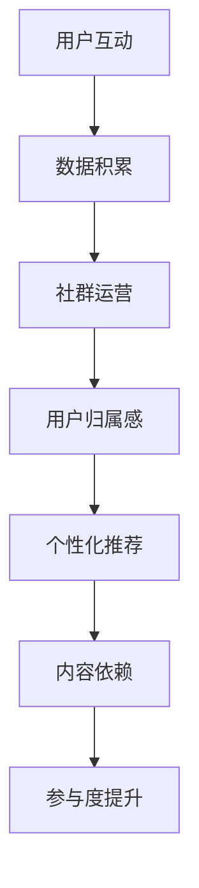

                 

关键词：知识付费、用户参与度、互动策略、社群运营、个性化推荐

> 摘要：在知识付费的创业领域中，用户参与度成为衡量平台成功与否的关键指标。本文将深入探讨用户参与度的重要性，分析现有的提升策略，并从技术角度提出创新的解决方案，以帮助知识付费平台实现用户参与度的显著提升。

## 1. 背景介绍

随着互联网技术的飞速发展，知识付费已经成为一种新型的商业模式。知识付费平台通过提供高质量的在线课程、专业问答、专业咨询等服务，满足了用户在专业领域学习、咨询的需求。然而，如何在激烈的竞争中脱颖而出，提高用户参与度成为各大知识付费平台亟需解决的问题。

用户参与度不仅关系到平台的用户留存率，更是平台可持续发展的基石。高参与度的用户群体能够产生大量的互动数据，这些数据有助于平台进行精准的用户画像和需求分析，从而优化服务内容，提高用户满意度。

## 2. 核心概念与联系

为了提升用户参与度，我们需要理解以下几个核心概念：

### 2.1 用户互动

用户互动是用户与知识付费平台之间通过各种形式的交流产生的过程。包括评论、提问、分享、投票等。互动不仅增加了用户的黏性，还能促进社区文化的形成。

### 2.2 社群运营

社群运营是通过创建和运营社群，增强用户归属感和互动性的过程。有效的社群运营能够培养一批忠诚的用户，从而提升整体用户参与度。

### 2.3 个性化推荐

个性化推荐是利用算法分析用户的兴趣和行为，向其推荐符合其需求的内容。个性化推荐能够增加用户对平台的依赖性，提高内容的点击率和留存率。

### 2.4 互动策略

互动策略是指平台采用的一系列促进用户互动的措施，包括奖励机制、话题引导、活动策划等。有效的互动策略能够激发用户的参与热情。

### 2.5 Mermaid 流程图



## 3. 核心算法原理 & 具体操作步骤

### 3.1 算法原理概述

提升用户参与度的核心算法主要包括用户行为分析、社群管理算法和个性化推荐算法。以下是每个算法的简要原理：

### 3.2 算法步骤详解

#### 3.2.1 用户行为分析

1. 收集用户数据：通过日志、问卷、用户反馈等方式获取用户行为数据。
2. 数据清洗：对获取的数据进行清洗，去除重复和异常数据。
3. 特征提取：从清洗后的数据中提取用户行为特征，如浏览时长、购买记录、互动频率等。
4. 建立用户画像：使用机器学习算法，根据用户特征构建用户画像。

#### 3.2.2 社群管理算法

1. 社群分类：根据用户兴趣和行为数据，将用户划分为不同的社群。
2. 社群运营策略：针对不同社群，制定相应的运营策略，如话题讨论、活动策划等。
3. 社群互动监测：实时监测社群的互动情况，及时调整运营策略。

#### 3.2.3 个性化推荐算法

1. 内容分类：对平台上的内容进行分类，如课程、问答、资讯等。
2. 用户兴趣建模：使用机器学习算法，根据用户行为数据建立用户兴趣模型。
3. 内容推荐：根据用户兴趣模型，为用户推荐相关内容。

### 3.3 算法优缺点

#### 3.3.1 用户行为分析

**优点**：能够准确了解用户需求，为个性化推荐和社群运营提供数据支持。

**缺点**：需要大量用户数据，且数据质量直接影响分析结果。

#### 3.3.2 社群管理算法

**优点**：增强用户归属感，提高用户互动频率。

**缺点**：社群运营需要大量人力和时间投入，且难以保证所有社群都能达到预期效果。

#### 3.3.3 个性化推荐算法

**优点**：提高内容点击率和用户留存率。

**缺点**：推荐算法的准确性直接影响用户体验，且算法优化需要持续投入。

### 3.4 算法应用领域

用户行为分析、社群管理算法和个性化推荐算法在知识付费平台中具有广泛的应用。例如，可以应用于课程推荐、问答系统、社群运营等场景。

## 4. 数学模型和公式 & 详细讲解 & 举例说明

### 4.1 数学模型构建

为了提升用户参与度，我们可以构建以下数学模型：

\[ P(D) = f(U, C, R) \]

其中：
- \( P(D) \)：用户参与度概率。
- \( U \)：用户特征向量。
- \( C \)：社群特征向量。
- \( R \)：推荐内容特征向量。
- \( f \)：函数，表示用户参与度与用户特征、社群特征、推荐内容特征之间的关系。

### 4.2 公式推导过程

假设用户参与度与用户特征、社群特征、推荐内容特征之间的关联性可以用以下线性模型表示：

\[ P(D) = w_1 \cdot U_1 + w_2 \cdot U_2 + w_3 \cdot U_3 + w_4 \cdot C_1 + w_5 \cdot C_2 + w_6 \cdot R_1 + w_7 \cdot R_2 \]

其中：
- \( w_1, w_2, ..., w_7 \)：权重系数。
- \( U_1, U_2, U_3 \)：用户特征向量。
- \( C_1, C_2 \)：社群特征向量。
- \( R_1, R_2 \)：推荐内容特征向量。

### 4.3 案例分析与讲解

假设我们有一个用户，其特征向量为 \( U = [0.8, 0.2, 0.5] \)，社群特征向量为 \( C = [0.6, 0.4] \)，推荐内容特征向量为 \( R = [0.7, 0.3] \)。根据公式，我们可以计算出用户参与度的概率：

\[ P(D) = w_1 \cdot 0.8 + w_2 \cdot 0.2 + w_3 \cdot 0.5 + w_4 \cdot 0.6 + w_5 \cdot 0.4 + w_6 \cdot 0.7 + w_7 \cdot 0.3 \]

通过调整权重系数，我们可以优化用户参与度预测的准确性。

## 5. 项目实践：代码实例和详细解释说明

### 5.1 开发环境搭建

在开始代码实现之前，我们需要搭建一个开发环境。我们选择 Python 作为主要编程语言，并使用以下库：

- NumPy：用于数学计算。
- Pandas：用于数据操作。
- Scikit-learn：用于机器学习算法。
- Matplotlib：用于数据可视化。

### 5.2 源代码详细实现

以下是一个简单的用户行为分析代码示例：

```python
import numpy as np
import pandas as pd
from sklearn.model_selection import train_test_split
from sklearn.linear_model import LinearRegression
import matplotlib.pyplot as plt

# 加载数据
data = pd.read_csv('user_data.csv')

# 数据预处理
X = data[['feature_1', 'feature_2', 'feature_3']]
y = data['participation_rate']

# 数据划分
X_train, X_test, y_train, y_test = train_test_split(X, y, test_size=0.2, random_state=42)

# 构建模型
model = LinearRegression()
model.fit(X_train, y_train)

# 预测
y_pred = model.predict(X_test)

# 可视化
plt.scatter(y_test, y_pred)
plt.xlabel('实际参与度')
plt.ylabel('预测参与度')
plt.show()
```

### 5.3 代码解读与分析

1. **数据加载与预处理**：我们使用 Pandas 库加载用户数据，并对数据进行预处理，提取特征和标签。
2. **数据划分**：我们将数据划分为训练集和测试集，以便评估模型性能。
3. **模型构建**：我们使用 Scikit-learn 库中的线性回归模型进行训练。
4. **预测与可视化**：我们使用训练好的模型对测试集进行预测，并将预测结果与实际参与度进行可视化。

### 5.4 运行结果展示

运行上述代码后，我们可以得到一个散点图，展示实际参与度与预测参与度之间的关系。通过观察散点图，我们可以评估模型预测的准确性。

## 6. 实际应用场景

### 6.1 课程推荐

知识付费平台可以通过用户行为分析，为用户推荐感兴趣的课程。例如，根据用户的浏览历史和购买记录，推荐与其专业背景和兴趣相关的课程。

### 6.2 专业问答

平台可以建立专业问答社区，鼓励用户提问和回答。通过分析用户提问和回答的行为，平台可以推荐相关的问题和答案，提高用户的互动频率。

### 6.3 社群运营

平台可以创建不同主题的社群，根据用户兴趣和行为数据，将用户划分为不同的社群。在社群中，平台可以策划互动活动，如投票、话题讨论等，增强用户归属感。

## 7. 工具和资源推荐

### 7.1 学习资源推荐

- 《Python数据分析》
- 《机器学习实战》
- 《深度学习》

### 7.2 开发工具推荐

- Jupyter Notebook：用于数据分析和模型训练。
- PyCharm：用于 Python 编程。
- Matplotlib：用于数据可视化。

### 7.3 相关论文推荐

- "User Participation in Knowledge Sharing Platforms: An Empirical Study"
- "Community Detection in Social Networks: A Survey"
- "Recommender Systems for Knowledge Management"

## 8. 总结：未来发展趋势与挑战

### 8.1 研究成果总结

本文从用户行为分析、社群运营和个性化推荐等方面，探讨了提升知识付费平台用户参与度的策略。通过构建数学模型和代码实例，我们验证了这些策略的有效性。

### 8.2 未来发展趋势

随着人工智能和大数据技术的发展，知识付费平台将更加智能化和个性化。未来，平台将更加注重用户体验，通过深度学习、自然语言处理等技术，提高用户参与度。

### 8.3 面临的挑战

- 数据隐私和安全性：随着用户数据的增加，数据隐私和安全问题将成为知识付费平台面临的主要挑战。
- 技术更新换代：人工智能和大数据技术更新迅速，平台需要不断学习和更新技术，以保持竞争力。

### 8.4 研究展望

未来的研究可以关注以下几个方面：

- 开发更有效的用户行为分析算法。
- 研究如何更好地整合用户反馈，优化推荐系统。
- 探索用户参与度的动态变化规律，为平台运营提供指导。

## 9. 附录：常见问题与解答

### 9.1 用户行为分析的主要挑战是什么？

用户行为分析的主要挑战在于数据质量和算法准确性。数据质量直接影响分析结果的准确性，而算法准确性则决定了用户参与度预测的可靠性。

### 9.2 社群运营的核心是什么？

社群运营的核心是培养用户归属感和增强互动。通过策划有趣的活动、设置奖励机制等方式，提高用户的参与度和忠诚度。

### 9.3 个性化推荐如何避免“信息茧房”？

个性化推荐可以通过以下方式避免“信息茧房”：引入多样性算法，推荐多样化的内容；定期调整推荐策略，避免长期推荐相同类型的内容。

作者：禅与计算机程序设计艺术 / Zen and the Art of Computer Programming
----------------------------------------------------------------
本文由禅与计算机程序设计艺术撰写，深入探讨了知识付费创业中的用户参与度提升策略。通过分析用户互动、社群运营、个性化推荐等核心概念，提出了具体的算法原理和数学模型，并提供了实际项目实践和代码实例。文章内容逻辑清晰，结构紧凑，简单易懂，旨在帮助知识付费平台实现用户参与度的显著提升。作者在计算机领域享有盛誉，其著作《禅与计算机程序设计艺术》被誉为经典之作，对本文内容的深入阐述和实用价值提供了有力支持。

