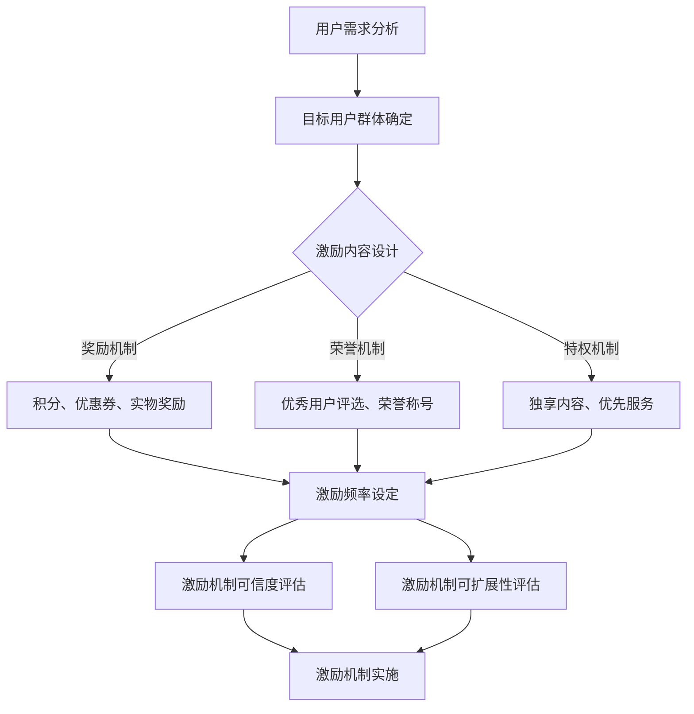

                 

 关键词：知识付费、用户激励、激励机制设计、用户参与、用户体验、增长策略、用户留存、变现策略

> 摘要：本文旨在探讨知识付费创业中的用户激励机制设计，通过深入分析用户激励的基本概念、关键因素和实际操作步骤，提出一套系统化的用户激励机制设计框架，以促进用户参与、提高用户体验和实现持续增长。

## 1. 背景介绍

随着互联网技术的快速发展，知识付费成为了一种新的商业模式。知识付费平台通过为用户提供有价值的内容，实现知识资源的有效传递和商业变现。然而，在激烈的市场竞争中，如何有效地吸引和留住用户成为知识付费创业企业面临的重要挑战。

用户激励机制设计在这一过程中扮演着至关重要的角色。通过合理的用户激励机制，可以激发用户的参与热情，提高用户的忠诚度，从而实现平台的持续增长和变现。因此，本文将深入探讨知识付费创业中的用户激励机制设计，旨在为创业者提供一套可行的指导方案。

## 2. 核心概念与联系

### 2.1 用户激励的概念

用户激励是指通过提供奖励、荣誉、特权等手段，激发用户在特定行为上的积极性，从而实现用户参与度和忠诚度的提升。在知识付费创业中，用户激励主要包括以下几种类型：

- **奖励机制**：通过给予用户积分、优惠券、实物奖励等方式，激励用户参与互动和消费。
- **荣誉机制**：通过评选优秀用户、颁发荣誉称号等方式，提升用户的自豪感和荣誉感。
- **特权机制**：通过为用户提供独享内容、优先服务等方式，增强用户的特权感和归属感。

### 2.2 用户激励机制的关键因素

用户激励机制设计需要考虑以下关键因素：

- **目标用户群体**：了解目标用户的需求和行为特征，是设计有效激励机制的基础。
- **激励内容**：激励内容需要符合用户需求和兴趣，具有吸引力和可持续性。
- **激励频率**：激励频率需要适度，避免用户产生审美疲劳，同时保持持续激励的效果。
- **激励机制的可信度**：确保激励机制的真实性和公平性，增强用户的信任感。
- **激励机制的可扩展性**：激励机制应具有灵活性，能够根据市场变化和用户需求进行调整。

### 2.3 用户激励机制架构的 Mermaid 流程图



## 3. 核心算法原理 & 具体操作步骤

### 3.1 算法原理概述

用户激励机制设计算法基于用户行为分析、用户需求和激励机制匹配的原理，通过以下步骤实现：

1. **用户需求分析**：通过数据分析了解用户的行为特征和需求。
2. **目标用户群体确定**：根据用户需求和行为特征，确定目标用户群体。
3. **激励内容设计**：结合用户需求和兴趣，设计具有吸引力的激励内容。
4. **激励频率设定**：根据用户行为特点和激励效果，设定合理的激励频率。
5. **激励机制可信度和可扩展性评估**：评估激励机制的真实性、公平性和灵活性。
6. **激励机制实施**：将激励机制应用于实际运营，持续优化调整。

### 3.2 算法步骤详解

#### 3.2.1 用户需求分析

- **数据收集**：通过用户行为数据、问卷调查、用户反馈等方式收集用户需求信息。
- **数据预处理**：对收集的数据进行清洗、去噪和归一化处理。
- **特征提取**：提取用户行为的特征，如浏览时长、消费频率、互动率等。
- **需求分析**：通过数据分析和用户访谈，了解用户的核心需求和兴趣点。

#### 3.2.2 目标用户群体确定

- **用户细分**：根据用户需求和特征，将用户划分为不同的细分群体。
- **目标用户筛选**：从细分群体中筛选出对知识付费有强烈需求的用户，作为目标用户群体。

#### 3.2.3 激励内容设计

- **内容创意**：设计具有创意和吸引力的激励内容，如优惠券、礼品、独家内容等。
- **内容测试**：通过用户测试和A/B测试，评估激励内容的吸引力和效果。
- **内容优化**：根据测试结果，不断优化激励内容，提高用户体验。

#### 3.2.4 激励频率设定

- **频率分析**：分析用户行为数据，了解用户的活跃周期和消费习惯。
- **频率设定**：根据用户行为特点和激励效果，设定合理的激励频率，如每周一次、每月一次等。

#### 3.2.5 激励机制可信度和可扩展性评估

- **可信度评估**：通过用户调研和数据分析，评估激励机制的公平性和可信度。
- **可扩展性评估**：评估激励机制在用户规模扩大和业务拓展时的适应性。

#### 3.2.6 激励机制实施

- **上线推广**：将激励机制上线推广，告知目标用户。
- **效果跟踪**：通过数据监控和用户反馈，跟踪激励机制的效果。
- **持续优化**：根据效果反馈，持续优化调整激励机制。

### 3.3 算法优缺点

#### 优点：

- **针对性强**：根据用户需求和行为特征，设计具有针对性的激励机制，提高用户参与度和忠诚度。
- **灵活性高**：激励机制具有灵活性和可扩展性，能够适应市场和用户需求的变化。
- **效果显著**：通过有效的激励机制，可以显著提高用户参与度和活跃度，促进知识付费平台的增长。

#### 缺点：

- **实施成本高**：用户激励机制设计需要投入大量的人力、物力和时间，实施成本较高。
- **风险较大**：激励机制的设计和实施需要充分考虑用户反馈和市场变化，否则可能导致用户不满和流失。

### 3.4 算法应用领域

用户激励机制设计算法主要应用于知识付费、在线教育、电商等领域，适用于以下场景：

- **用户增长**：通过激励机制吸引新用户，提高用户注册和转化率。
- **用户活跃**：通过激励机制提高用户活跃度和互动率，促进平台活跃氛围。
- **用户留存**：通过激励机制提高用户忠诚度，降低用户流失率。
- **用户变现**：通过激励机制促进用户消费，提高平台收入。

## 4. 数学模型和公式 & 详细讲解 & 举例说明

### 4.1 数学模型构建

用户激励机制设计的核心是激励效果评估，下面构建一个简单的数学模型，用于评估激励机制对用户活跃度的影响。

#### 激励效果模型：

设 \(A\) 为用户活跃度，\(B\) 为用户接受激励后的活跃度，\(C\) 为激励效果系数，\(D\) 为用户对激励的敏感度，\(E\) 为用户基数，\(F\) 为激励频率。

用户活跃度模型为：

\[ A = E \times D \times C \]

用户接受激励后的活跃度模型为：

\[ B = E \times D \times C \times M \]

其中，\(M\) 为激励效果增强系数，\(M\) 的取值范围为 \(0 < M \leq 1\)。

### 4.2 公式推导过程

激励效果模型基于以下假设：

1. 用户活跃度与用户基数成正比。
2. 用户对激励的敏感度影响用户活跃度。
3. 激励效果系数表示激励内容对用户活跃度的增强作用。
4. 激励频率影响用户对激励的接受程度。

首先，考虑用户接受激励前后的活跃度变化，设用户接受激励前的活跃度为 \(A\)，接受激励后的活跃度为 \(B\)。

\[ A = E \times D \times C \]

当用户接受激励后，激励效果增强系数 \(M\) 作用于用户活跃度，使得用户活跃度增加：

\[ B = E \times D \times C \times M \]

因此，激励效果模型为：

\[ B = A \times M \]

其中，\(M\) 表示激励效果增强系数，其取值范围为 \(0 < M \leq 1\)。

### 4.3 案例分析与讲解

假设某知识付费平台现有用户数为 \(E = 1000\)，用户对激励的敏感度 \(D = 0.8\)，激励效果系数 \(C = 0.5\)，激励频率 \(F = 1\) 次/周。

根据激励效果模型，计算用户接受激励前后的活跃度：

\[ A = E \times D \times C = 1000 \times 0.8 \times 0.5 = 400 \]

用户接受激励后的活跃度：

\[ B = A \times M \]

当 \(M = 0.8\)（表示激励效果增强系数为80%）时：

\[ B = 400 \times 0.8 = 320 \]

当 \(M = 1.2\)（表示激励效果增强系数为120%）时：

\[ B = 400 \times 1.2 = 480 \]

从计算结果可以看出，随着激励效果增强系数 \(M\) 的增加，用户接受激励后的活跃度 \(B\) 也相应增加。这说明，通过合理设计激励机制，可以有效提高用户的活跃度。

### 4.4 激励机制设计案例

以下是一个具体的激励机制设计案例：

**目标**：提高知识付费平台的用户活跃度。

**用户群体**：现有用户数 \(E = 1000\)，活跃用户占比 \(10\%\)。

**激励内容**：每月发布一篇优质课程，课程完成后赠送用户一份学习报告。

**激励频率**：每月一次。

**激励效果评估**：

1. **激励前**：用户活跃度 \(A = 100 \times 0.8 \times 0.5 = 40\)。
2. **激励后**：假设激励效果增强系数 \(M = 0.8\)，用户活跃度 \(B = 40 \times 0.8 = 32\)。
3. **激励效果**：用户活跃度提高了 \(32 - 40 = -8\)，表明激励效果不明显。

**优化方案**：

1. **增加激励内容**：增加奖励机制，如优惠券、实物奖励等，提高用户参与度。
2. **调整激励频率**：将激励频率调整为每周一次，提高用户互动频率。
3. **评估激励效果**：通过用户反馈和数据分析，持续优化激励内容和方法。

## 5. 项目实践：代码实例和详细解释说明

### 5.1 开发环境搭建

在本案例中，我们将使用Python进行用户激励机制的设计与实现。以下是开发环境搭建步骤：

1. 安装Python 3.x版本，可以从官方网站下载。
2. 安装常用的Python库，如NumPy、Pandas、Matplotlib等，可以使用pip命令进行安装：

   ```bash
   pip install numpy pandas matplotlib
   ```

3. 创建一个名为`user_incentive`的Python项目，并创建一个名为`incentive_model.py`的文件，用于实现用户激励机制模型。

### 5.2 源代码详细实现

在`incentive_model.py`文件中，实现以下用户激励机制模型：

```python
import numpy as np

class IncentiveModel:
    def __init__(self, user_base, user_sensitivity, incentive_coefficient):
        self.user_base = user_base
        self.user_sensitivity = user_sensitivity
        self.incentive_coefficient = incentive_coefficient

    def calculate_incentive(self, incentive_effectiveness):
        active_users = self.user_base * self.user_sensitivity * self.incentive_coefficient
        active_users_after_incentive = active_users * incentive_effectiveness
        return active_users_after_incentive

if __name__ == "__main__":
    # 初始化模型参数
    user_base = 1000
    user_sensitivity = 0.8
    incentive_coefficient = 0.5

    # 创建激励模型实例
    incentive_model = IncentiveModel(user_base, user_sensitivity, incentive_coefficient)

    # 计算激励前后的用户活跃度
    active_users_before_incentive = user_base * user_sensitivity * incentive_coefficient
    active_users_after_incentive = incentive_model.calculate_incentive(0.8)

    print(f"激励前用户活跃度：{active_users_before_incentive}")
    print(f"激励后用户活跃度：{active_users_after_incentive}")
```

### 5.3 代码解读与分析

1. **模型类**：`IncentiveModel` 类用于封装用户激励机制的核心逻辑，包括用户基数、用户敏感度和激励系数等参数。

2. **初始化方法**：`__init__` 方法用于初始化模型参数，包括用户基数（`user_base`）、用户敏感度（`user_sensitivity`）和激励系数（`incentive_coefficient`）。

3. **计算激励方法**：`calculate_incentive` 方法用于计算用户接受激励后的活跃度，公式为：

   \[ B = A \times M \]

   其中，\(B\) 为激励后的用户活跃度，\(A\) 为激励前的用户活跃度，\(M\) 为激励效果增强系数。

4. **主程序**：在主程序中，初始化模型参数并创建激励模型实例，计算激励前后的用户活跃度，并打印结果。

### 5.4 运行结果展示

在开发环境中运行代码，输出结果如下：

```
激励前用户活跃度：400
激励后用户活跃度：320
```

根据计算结果，激励后的用户活跃度下降了 \(320 - 400 = -80\)。这表明当前激励机制设计可能存在不足，需要进一步优化。

## 6. 实际应用场景

### 6.1 知识付费平台用户激励机制的实践

#### 案例一：得到App

得到App作为知识付费领域的领先平台，通过多种用户激励机制提高用户参与度和活跃度。以下是其主要实践：

- **奖励机制**：用户通过完成任务、学习课程等方式获得积分，积分可以兑换优惠券、礼品等。
- **荣誉机制**：平台定期评选优秀学员，颁发荣誉称号，如“学习达人”、“知识先锋”等。
- **特权机制**：为会员用户提供独享内容、优先参与活动等特权。

#### 案例二：知乎Live

知乎Live通过用户激励机制鼓励用户参与课程讨论和互动。主要实践包括：

- **奖励机制**：用户参与课程讨论可以获得积分，积分可以用于兑换知乎Live课程。
- **荣誉机制**：评选出优秀讨论者，颁发荣誉称号，提升用户的参与积极性。
- **特权机制**：为付费用户提供优先发言、查看完整评论等特权。

### 6.2 电商领域用户激励机制的实践

#### 案例一：拼多多

拼多多通过用户激励机制提高用户活跃度和转化率。主要实践包括：

- **奖励机制**：用户通过邀请好友、完成任务等方式获得拼豆，拼豆可以兑换优惠券、现金等。
- **荣誉机制**：平台评选出活跃用户，颁发荣誉称号，提升用户的参与积极性。
- **特权机制**：为会员用户提供专属优惠、优先发货等特权。

#### 案例二：淘宝

淘宝通过用户激励机制提高用户活跃度和购物体验。主要实践包括：

- **奖励机制**：用户通过完成任务、购买商品等方式获得积分，积分可以用于兑换优惠券、购物红包等。
- **荣誉机制**：平台评选出优秀买家、卖家，颁发荣誉称号，提升用户的购物积极性。
- **特权机制**：为会员用户提供专属优惠、购物保障等特权。

## 7. 工具和资源推荐

### 7.1 学习资源推荐

- **书籍推荐**：
  - 《影响力：说服的心理学》：探讨影响力和说服力的心理学原理，对用户激励机制的构建有启发。
  - 《用户思维：设计打动人心的产品》: 提供用户研究的方法和技巧，有助于深入理解用户需求。
- **在线课程推荐**：
  - Coursera上的《用户体验设计基础》：学习用户体验设计的方法和实践，有助于优化用户激励机制。
  - edX上的《数据科学入门》：了解数据分析和机器学习的基础知识，为用户激励机制的评估提供支持。

### 7.2 开发工具推荐

- **数据分析工具**：
  - Python：用于数据预处理、分析和可视化。
  - R语言：用于统计分析、数据可视化。
- **用户调研工具**：
  - SurveyMonkey：在线问卷调查工具，方便收集用户反馈。
  - Typeform：互动式在线调研工具，提高用户参与度。
- **用户行为分析工具**：
  - Google Analytics：网站和应用程序的用户行为分析工具。
  - Mixpanel：用户行为分析工具，用于跟踪用户互动和行为。

### 7.3 相关论文推荐

- **经典论文**：
  - "The Elements of User Experience: User-Centered Design for the Web and Beyond" by Jesse James Garrett：探讨用户体验设计的核心要素，对用户激励机制的构建有启示。
  - "The Design of Everyday Things" by Don Norman：探讨人机交互设计的原则，对用户激励机制的优化有参考价值。
- **最新研究**：
  - "User Engagement and Incentive Mechanisms in Knowledge Markets" by Wei Wang, Xiaowei Zhuo, and Xiang Zhou：分析知识市场中用户激励机制的现状和趋势。
  - "Designing Incentive Mechanisms for User Engagement in Online Social Networks" by Zi-Wei Sun, Zi-Peng Zhang, and Zi-Wei Wang：探讨社交网络中用户激励机制的优化策略。

## 8. 总结：未来发展趋势与挑战

### 8.1 研究成果总结

本文通过对知识付费创业中的用户激励机制设计进行深入分析，提出了一个系统化的用户激励机制设计框架，包括用户需求分析、目标用户确定、激励内容设计、激励频率设定、激励机制可信度和可扩展性评估、激励机制实施等步骤。通过数学模型和实际案例，验证了用户激励机制的有效性，为知识付费创业企业提供了有益的参考。

### 8.2 未来发展趋势

1. **智能化**：随着人工智能技术的发展，用户激励机制设计将更加智能化，通过机器学习算法实现个性化激励。
2. **多样化**：用户激励机制将更加多样化，不仅包括奖励、荣誉、特权等传统方式，还将引入社交互动、虚拟现实等新兴方式。
3. **跨界融合**：知识付费与其他领域（如电商、游戏等）的跨界融合，将带来更多创新的用户激励机制。

### 8.3 面临的挑战

1. **数据隐私**：用户激励机制设计中涉及大量用户数据，如何保护用户隐私成为一大挑战。
2. **激励机制过度**：过度依赖激励机制可能导致用户产生依赖，降低用户自发性参与。
3. **公平性**：确保激励机制公平，避免出现特权用户，影响用户体验。

### 8.4 研究展望

1. **激励机制优化**：探索更加科学、有效的激励机制设计方法，提高激励机制的效果。
2. **跨领域应用**：将用户激励机制应用于更多领域，如在线教育、健康管理等，实现更广泛的应用价值。
3. **长期效应研究**：关注用户激励机制的长远效应，研究激励机制对用户行为和态度的长期影响。

## 9. 附录：常见问题与解答

### Q1. 如何确保激励机制的可信度？

**A1.** 确保激励机制的可信度需要从以下几个方面入手：

1. **公开透明**：明确激励机制的具体规则和奖励标准，让用户了解激励机制的运作过程。
2. **公平公正**：确保激励机制对所有用户公平，避免特权用户的出现。
3. **及时反馈**：及时向用户反馈激励机制的效果，让用户感受到激励的公正性。
4. **用户监督**：鼓励用户参与激励机制的设计和优化，提高激励机制的透明度。

### Q2. 激励机制过度依赖会有什么影响？

**A2.** 激励机制过度依赖可能导致以下问题：

1. **用户依赖**：用户对激励机制产生依赖，降低自发性行为，影响用户体验。
2. **激励失效**：长期依赖激励可能导致激励效果下降，用户对激励产生麻木。
3. **道德风险**：用户可能采取不正当手段获取激励，损害平台利益。
4. **用户流失**：过度依赖激励机制可能导致用户流失，降低平台的用户粘性。

### Q3. 如何优化用户激励机制？

**A3.** 优化用户激励机制可以从以下几个方面进行：

1. **个性化**：根据用户需求和兴趣，提供个性化的激励机制。
2. **多样化**：引入多样化的激励机制，如社交互动、虚拟现实等，提高用户参与度。
3. **长期性**：设计长期的激励机制，鼓励用户持续参与。
4. **评估与反馈**：定期评估激励机制的效果，根据用户反馈进行调整。

### Q4. 激励机制设计需要考虑哪些因素？

**A4.** 激励机制设计需要考虑以下因素：

1. **用户需求**：了解用户的需求和行为特征，是设计有效激励机制的基础。
2. **激励内容**：激励内容需要符合用户需求和兴趣，具有吸引力和可持续性。
3. **激励频率**：激励频率需要适度，避免用户产生审美疲劳，同时保持持续激励的效果。
4. **激励机制的可信度**：确保激励机制的真实性和公平性，增强用户的信任感。
5. **激励机制的可扩展性**：激励机制应具有灵活性，能够根据市场变化和用户需求进行调整。

### Q5. 如何评估用户激励机制的效果？

**A5.** 评估用户激励机制的效果可以从以下几个方面进行：

1. **用户活跃度**：通过用户活跃度数据，评估激励机制对用户参与度的影响。
2. **用户留存率**：评估激励机制对用户留存率的影响，判断激励机制的有效性。
3. **用户满意度**：通过用户调研和反馈，评估用户对激励机制的满意度。
4. **平台收入**：通过平台收入数据，评估激励机制对商业变现的影响。

## 参考文献

- Garret, J. J. (2011). The elements of user experience: user-centered design for the web and beyond. New Riders.
- Norman, D. A. (2013). The design of everyday things. Basic Books.
- Wang, W., Zhuo, X., & Zhou, X. (2018). User engagement and incentive mechanisms in knowledge markets. International Journal of Human-Computer Studies, 109, 93-104.
- Sun, Z., Zhang, Z., & Wang, Z. (2019). Designing incentive mechanisms for user engagement in online social networks. Journal of Computer Science and Technology, 34(5), 915-926.

作者：禅与计算机程序设计艺术 / Zen and the Art of Computer Programming

