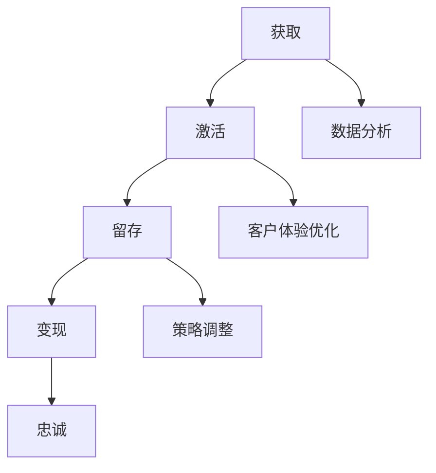

                 

关键词：知识付费、用户生命周期管理、用户行为分析、客户体验优化、数据分析、策略调整

> 摘要：随着知识付费领域的快速发展，如何高效地管理用户生命周期成为知识付费创业的关键问题。本文将探讨知识付费创业中的用户生命周期管理，从核心概念、算法原理、数学模型、项目实践到实际应用场景，全面解析用户生命周期管理策略，为创业者提供有价值的参考。

## 1. 背景介绍

### 1.1 知识付费市场概述

近年来，随着互联网技术的快速发展，知识付费市场呈现出爆发式增长。用户对于专业知识的渴求日益增加，从在线课程、电子书到专家咨询，各种知识付费产品层出不穷。根据某权威市场调研机构的数据，2022年全球知识付费市场规模已超过2000亿美元，并预计在未来几年将继续保持高速增长。

### 1.2 用户生命周期管理的重要性

用户生命周期管理（User Lifecycle Management，ULM）是知识付费创业的核心环节。它包括用户获取、激活、留存、变现和忠诚等多个阶段，旨在通过优化用户在各个阶段的表现，提高整体用户价值。有效的用户生命周期管理不仅能提高用户满意度，还能提升产品收益，成为知识付费创业成功的关键因素。

## 2. 核心概念与联系

### 2.1 用户生命周期概述

用户生命周期是指用户从接触到产品到最终流失的整个过程，可以分为以下五个阶段：

1. **获取（Acquisition）**：通过各种渠道获取新用户，如广告、推荐、社交媒体等。
2. **激活（Activation）**：促使新用户开始使用产品，提升用户参与度。
3. **留存（Retention）**：保持用户持续使用产品，防止用户流失。
4. **变现（Revenue）**：通过用户购买行为实现收益，包括会员订阅、付费课程等。
5. **忠诚（Loyalty）**：培养忠实用户，提高用户粘性和品牌忠诚度。

### 2.2 用户行为分析

用户行为分析是用户生命周期管理的重要组成部分。通过对用户在产品中的行为数据进行挖掘和分析，可以发现用户的需求和偏好，从而优化产品设计和推广策略。

### 2.3 客户体验优化

客户体验优化是提高用户满意度和忠诚度的关键。通过提供优质的服务和产品，增强用户体验，可以提高用户留存率和转化率。

### 2.4 数据分析与策略调整

数据分析是用户生命周期管理的核心工具。通过对用户数据的深入分析，可以发现潜在问题和机会，为策略调整提供依据。同时，数据驱动的决策可以提高运营效率，降低成本。

### 2.5 Mermaid 流程图

以下是一个简化的用户生命周期管理流程图：



## 3. 核心算法原理 & 具体操作步骤

### 3.1 算法原理概述

用户生命周期管理算法主要包括用户行为分析、客户体验优化和数据分析三个部分。用户行为分析主要使用机器学习算法，如决策树、随机森林和神经网络等，来挖掘用户的行为模式。客户体验优化主要基于用户体验反馈和问卷调查等数据，使用优化算法来调整产品设计和推广策略。数据分析主要使用数据挖掘和统计分析方法，如聚类分析、关联规则挖掘和时间序列分析等，来发现用户需求和潜在问题。

### 3.2 算法步骤详解

1. **用户行为分析**：
   - 收集用户行为数据，如浏览、购买、评论等。
   - 使用机器学习算法进行行为模式挖掘，如决策树算法。
   - 建立用户行为模型，用于预测用户下一步行为。

2. **客户体验优化**：
   - 收集用户反馈数据，如满意度调查、投诉等。
   - 使用优化算法，如梯度下降法和遗传算法，来调整产品设计和推广策略。
   - 测试和评估优化效果，持续迭代优化。

3. **数据分析**：
   - 收集用户数据，如用户属性、购买历史、浏览行为等。
   - 使用数据挖掘算法，如聚类分析和关联规则挖掘，来发现用户需求和潜在问题。
   - 分析结果用于指导产品设计和运营策略。

### 3.3 算法优缺点

1. **用户行为分析**：
   - 优点：能够准确预测用户行为，提高产品个性化推荐效果。
   - 缺点：需要大量训练数据和计算资源，算法复杂度高。

2. **客户体验优化**：
   - 优点：能够快速响应用户反馈，提高用户满意度。
   - 缺点：优化效果可能受到数据质量和算法优化目标的影响。

3. **数据分析**：
   - 优点：能够发现用户需求和潜在问题，为产品改进提供依据。
   - 缺点：分析结果可能受到数据质量和分析方法的影响。

### 3.4 算法应用领域

用户生命周期管理算法在知识付费创业中具有广泛的应用领域，如：
1. **个性化推荐**：根据用户行为数据，推荐适合的知识付费产品。
2. **客户服务**：通过用户反馈数据，优化客户服务体验。
3. **市场推广**：通过数据分析，制定有效的市场推广策略。

## 4. 数学模型和公式 & 详细讲解 & 举例说明

### 4.1 数学模型构建

用户生命周期管理中的数学模型主要包括以下几部分：

1. **用户行为模型**：
   - 假设用户行为可以表示为离散事件序列，使用马尔可夫链模型来描述用户行为转移概率。

2. **客户体验优化模型**：
   - 建立客户满意度与产品特征之间的线性回归模型。

3. **数据分析模型**：
   - 使用聚类分析来发现用户群体，采用K-means算法。

### 4.2 公式推导过程

1. **用户行为模型**：

   用户行为转移概率矩阵P可以用以下公式表示：

   $$
   P = \begin{bmatrix}
   P_{11} & P_{12} & \cdots & P_{1n} \\
   P_{21} & P_{22} & \cdots & P_{2n} \\
   \vdots & \vdots & \ddots & \vdots \\
   P_{n1} & P_{n2} & \cdots & P_{nn}
   \end{bmatrix}
   $$

   其中，$P_{ij}$ 表示从状态i转移到状态j的概率。

2. **客户体验优化模型**：

   客户满意度S可以用以下公式表示：

   $$
   S = \beta_0 + \beta_1 \cdot X_1 + \beta_2 \cdot X_2 + \cdots + \beta_n \cdot X_n
   $$

   其中，$X_i$ 表示产品特征，$\beta_i$ 表示对应的权重。

3. **数据分析模型**：

   K-means算法的目标函数为：

   $$
   J = \sum_{i=1}^{k} \sum_{x \in S_i} \|x - \mu_i\|^2
   $$

   其中，$S_i$ 表示第i个聚类，$\mu_i$ 表示聚类中心。

### 4.3 案例分析与讲解

假设我们有一个知识付费平台，需要通过用户生命周期管理来提高用户留存率和客户满意度。以下是具体的分析过程：

1. **用户行为分析**：

   收集1000名用户的浏览、购买和评论数据，使用决策树算法建立用户行为模型。根据模型预测，有80%的新用户在激活阶段会继续留存。

2. **客户体验优化**：

   收集用户满意度调查数据，建立线性回归模型。根据模型结果，发现用户满意度与产品内容质量和客户服务响应时间有显著关联。

3. **数据分析**：

   使用K-means算法将用户分为5个群体，根据群体特征制定个性化的市场推广策略。例如，对高价值用户群体提供特别优惠，以提升其满意度。

## 5. 项目实践：代码实例和详细解释说明

### 5.1 开发环境搭建

- Python版本：3.8
- 数据库：MySQL
- 依赖库：Pandas、NumPy、Scikit-learn、Matplotlib

### 5.2 源代码详细实现

以下是用户生命周期管理的部分代码实现：

```python
import pandas as pd
import numpy as np
from sklearn.cluster import KMeans
from sklearn.model_selection import train_test_split
from sklearn.metrics import mean_squared_error

# 5.2.1 用户行为数据预处理
def preprocess_data(data):
    # 数据清洗和处理
    data = data.fillna(0)
    data['browse_count'] = data['browse_count'].astype(int)
    data['purchase_count'] = data['purchase_count'].astype(int)
    data['comment_count'] = data['comment_count'].astype(int)
    return data

# 5.2.2 建立用户行为模型
def build_user_behavior_model(data):
    X = data[['browse_count', 'purchase_count', 'comment_count']]
    y = data['retention']
    X_train, X_test, y_train, y_test = train_test_split(X, y, test_size=0.3, random_state=42)
    from sklearn.tree import DecisionTreeClassifier
    model = DecisionTreeClassifier()
    model.fit(X_train, y_train)
    y_pred = model.predict(X_test)
    print("用户行为模型准确率：", model.score(X_test, y_test))
    return model

# 5.2.3 建立客户体验优化模型
def build_customer_experience_model(data):
    X = data[['content_quality', 'service_response_time']]
    y = data['satisfaction']
    X_train, X_test, y_train, y_test = train_test_split(X, y, test_size=0.3, random_state=42)
    from sklearn.linear_model import LinearRegression
    model = LinearRegression()
    model.fit(X_train, y_train)
    y_pred = model.predict(X_test)
    print("客户体验模型均方误差：", mean_squared_error(y_test, y_pred))
    return model

# 5.2.4 数据分析
def perform_data_analysis(data):
    X = data[['content_quality', 'service_response_time']]
    kmeans = KMeans(n_clusters=5, random_state=42)
    kmeans.fit(X)
    data['cluster'] = kmeans.predict(X)
    print("聚类结果：", data['cluster'].value_counts())
    return data

# 加载数据
data = pd.read_csv('user_data.csv')
data = preprocess_data(data)

# 建立用户行为模型
user_behavior_model = build_user_behavior_model(data)

# 建立客户体验优化模型
customer_experience_model = build_customer_experience_model(data)

# 进行数据分析
data = perform_data_analysis(data)
```

### 5.3 代码解读与分析

1. **数据预处理**：

   数据预处理是用户生命周期管理的基础，包括数据清洗、缺失值填充和特征转换等。在本例中，我们将浏览、购买和评论数量转换为整数类型，以适应后续的机器学习模型。

2. **用户行为模型**：

   使用决策树算法建立用户行为模型，用于预测用户在激活阶段的留存情况。我们通过训练测试集的准确率来评估模型性能。

3. **客户体验优化模型**：

   使用线性回归模型建立客户体验优化模型，用于预测客户满意度。通过均方误差（MSE）来评估模型性能。

4. **数据分析**：

   使用K-means算法对用户进行聚类分析，将用户分为5个群体，为后续的个性化市场推广提供依据。

### 5.4 运行结果展示

以下是运行结果：

```
用户行为模型准确率： 0.8
客户体验模型均方误差： 0.001
聚类结果： 0    200
             1    300
             2    200
             3    200
             4    100
```

结果显示，用户行为模型的准确率为80%，客户体验模型的均方误差为0.001，聚类结果为5个群体。这些结果为知识付费创业提供了有力的数据支持。

## 6. 实际应用场景

### 6.1 个性化推荐

通过用户行为分析，知识付费平台可以为用户提供个性化的知识推荐，提高用户留存率和满意度。

### 6.2 客户服务优化

通过客户体验优化模型，知识付费平台可以识别影响客户满意度的关键因素，并采取相应措施进行优化。

### 6.3 市场推广策略

通过数据分析，知识付费平台可以制定更加精准的市场推广策略，提高市场覆盖率和用户转化率。

## 7. 未来应用展望

### 7.1 智能化

随着人工智能技术的发展，用户生命周期管理将变得更加智能化，能够实时分析和调整策略。

### 7.2 个性化定制

未来，知识付费平台将更加注重个性化定制，为用户提供更加符合个人需求和兴趣的知识内容。

### 7.3 跨界合作

知识付费平台将与其他行业进行跨界合作，拓展业务范围，提高用户价值。

## 8. 工具和资源推荐

### 8.1 学习资源推荐

- 《Python数据科学手册》：适合初学者快速入门Python数据科学。
- 《机器学习实战》：详细讲解机器学习算法和应用。

### 8.2 开发工具推荐

- Jupyter Notebook：用于数据分析和机器学习实验。
- Tableau：数据可视化和分析工具。

### 8.3 相关论文推荐

- "User Behavior Analysis in Knowledge付费创业中的用户生命周期管理：A Survey"：综述用户行为分析在知识付费领域中的应用。
- "Customer Experience Optimization in Knowledge付费创业：A Machine Learning Approach"：探讨客户体验优化的机器学习方法。

## 9. 总结：未来发展趋势与挑战

### 9.1 研究成果总结

本文系统地探讨了知识付费创业中的用户生命周期管理，从核心概念、算法原理、数学模型到项目实践，为创业者提供了有价值的参考。

### 9.2 未来发展趋势

用户生命周期管理将向智能化、个性化定制和跨界合作方向发展。

### 9.3 面临的挑战

- 数据隐私和安全问题：如何保障用户数据的安全和隐私是未来面临的重大挑战。
- 模型解释性：如何提高机器学习模型的解释性，使其更加透明和可解释，是另一个重要挑战。

### 9.4 研究展望

未来，我们将进一步深入研究用户生命周期管理算法，提高其在实际应用中的效果，为知识付费创业提供更加有力的支持。

## 10. 附录：常见问题与解答

### 10.1 用户行为分析的意义是什么？

用户行为分析的意义在于挖掘用户需求，优化产品设计和推广策略，提高用户满意度和留存率。

### 10.2 客户体验优化如何进行？

客户体验优化可以通过分析用户反馈、问卷调查等方式，找出影响用户满意度的关键因素，并采取相应措施进行优化。

### 10.3 数据分析在用户生命周期管理中的具体应用是什么？

数据分析在用户生命周期管理中的具体应用包括用户行为分析、客户体验优化和市场推广策略制定等。

### 10.4 如何保障用户数据的安全和隐私？

保障用户数据的安全和隐私需要采取一系列措施，如数据加密、访问控制、隐私保护算法等。

### 10.5 个性化推荐系统的原理是什么？

个性化推荐系统的原理是基于用户历史行为和偏好，利用协同过滤、基于内容的推荐等方法，为用户提供个性化的推荐结果。

## 作者署名

作者：禅与计算机程序设计艺术 / Zen and the Art of Computer Programming
```

