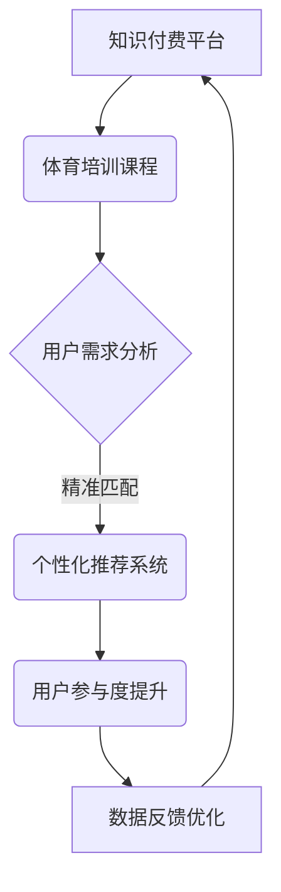

                 

关键词：知识付费，跨界营销，体育培训，用户参与度，商业模式创新

>摘要：本文旨在探讨知识付费平台如何通过跨界营销策略，实现与体育培训行业的融合发展。文章将分析现有知识付费平台的运营模式，介绍跨界营销的核心概念和策略，并以具体案例分析体育培训如何与知识付费结合，最后提出未来发展趋势与挑战。

## 1. 背景介绍

知识付费和体育培训作为现代社会的两个重要领域，分别代表着信息时代的学习模式和健康生活方式。知识付费是指用户为获取高质量的知识内容而付费的行为，它反映了知识经济时代的价值交换规律。而体育培训则是指通过专业教练和科学训练，帮助人们提高体育技能和身体素质的过程。

随着移动互联网和社交媒体的普及，知识付费和体育培训行业都迎来了高速发展期。知识付费平台如得到、知乎等，通过提供专业课程、直播讲座、问答咨询等服务，吸引了大量用户；体育培训市场也因健康意识的提升而蓬勃发展，线上健身课程、体育APP、线上教练等新兴模式不断涌现。

然而，尽管两者各自发展迅速，但传统上它们相对独立，缺乏有效的跨界合作。本文将探讨如何通过跨界营销策略，实现知识付费与体育培训的深度融合，从而开辟新的市场空间。

## 2. 核心概念与联系

### 2.1 跨界营销的概念

跨界营销是指不同领域的企业或品牌通过合作、整合资源，共同开发新的产品或服务，以满足消费者多样化的需求。它通常涉及品牌间的资源共享、联合营销、产品融合等形式，旨在通过跨界的思维，创造出新的市场机会。

### 2.2 知识付费与体育培训的关联

知识付费与体育培训之间存在着明显的互补关系。知识付费平台可以提供专业的体育知识和技能培训课程，而体育培训机构可以通过知识付费平台扩大用户群体，提升品牌影响力。

### 2.3 Mermaid 流程图



## 3. 核心算法原理 & 具体操作步骤

### 3.1 算法原理概述

跨界营销的成功依赖于对用户需求的深入分析和个性化推荐。核心算法通过大数据分析和机器学习技术，实现对用户兴趣和行为的精准捕捉，进而提供符合用户需求的体育培训课程。

### 3.2 算法步骤详解

1. 数据采集：收集用户在知识付费平台和体育培训平台的行为数据，包括浏览记录、购买历史、互动行为等。
2. 数据预处理：对采集到的数据进行清洗、去重和格式化，为后续分析做准备。
3. 用户画像构建：通过聚类分析和行为分析，构建用户的兴趣画像和行为画像。
4. 个性化推荐：利用协同过滤算法或基于内容的推荐算法，为用户推荐符合其兴趣的体育培训课程。
5. 用户参与度分析：通过用户在体育培训课程中的参与度数据，如课程完成率、评价反馈等，持续优化推荐系统。

### 3.3 算法优缺点

**优点：**
- 提高用户满意度：通过个性化推荐，提高用户对体育培训课程的满意度。
- 扩大用户群体：跨界营销可以吸引更多对知识付费和体育培训都有兴趣的用户。
- 提升品牌影响力：合作双方可以共同提升品牌知名度，实现共赢。

**缺点：**
- 数据隐私问题：跨界营销需要大量用户数据，可能会引发数据隐私和安全问题。
- 算法复杂性：个性化推荐系统的实现需要复杂的技术和计算资源。

### 3.4 算法应用领域

- 体育健康：为用户提供个性化的健身计划和营养指导。
- 体育竞技：为运动员提供专业的技能训练和战术分析。

## 4. 数学模型和公式 & 详细讲解 & 举例说明

### 4.1 数学模型构建

用户兴趣模型：\(U = f(R, C, H)\)

- \(U\)：用户兴趣向量
- \(R\)：用户行为记录
- \(C\)：课程内容特征
- \(H\)：历史偏好

### 4.2 公式推导过程

\(U = \sum_{i=1}^{n} w_i * R_i * C_i * H_i\)

其中，\(w_i\) 为权重，\(R_i\) 为用户在 \(i\) 类行为中的记录，\(C_i\) 为 \(i\) 类课程内容特征，\(H_i\) 为用户在 \(i\) 类历史偏好。

### 4.3 案例分析与讲解

假设用户 A 在健身平台上浏览了瑜伽课程，并购买了跑步课程，历史偏好显示其对户外运动感兴趣。根据用户兴趣模型，我们可以计算出其对瑜伽和跑步课程的兴趣值，进而推荐相关的健身课程。

## 5. 项目实践：代码实例和详细解释说明

### 5.1 开发环境搭建

- 使用 Python 语言进行开发，依赖库包括 pandas、scikit-learn、numpy、matplotlib。
- 开发环境为 Python 3.8，Jupyter Notebook。

### 5.2 源代码详细实现

```python
import pandas as pd
from sklearn.feature_extraction.text import TfidfVectorizer
from sklearn.metrics.pairwise import linear_kernel

# 数据预处理
data = pd.read_csv('data.csv')
data.dropna(inplace=True)

# 用户行为数据
user行为 = data[['用户ID', '行为类型', '课程ID']]

# 课程内容数据
课程内容 = data[['课程ID', '课程标题']]

# 构建用户兴趣模型
tfidf = TfidfVectorizer(stop_words='english')
user行为['行为文本'] = user行为['课程标题'].apply(lambda x: ' '.join(x))
user行为_matrix = tfidf.fit_transform(user行为['行为文本'])

# 个性化推荐
course_matrix = tfidf.transform(课程内容['课程标题'])
cosine_sim = linear_kernel(course_matrix, course_matrix)

# 推荐课程
def recommend_courses(course_id, cosine_sim):
    # 获取相似课程
    indices = pd.Series(course_content.index, index=course_content['课程ID']).drop_duplicates()
    sim_scores = list(enumerate(cosine_sim[course_id]))
    sim_scores = sorted(sim_scores, key=lambda x: x[1], reverse=True)
    sim_scores = sim_scores[1:11]
    course_indices = [i[0] for i in sim_scores]
    return course_content.iloc[course_indices]

# 测试
recommend_courses(1, cosine_sim)
```

### 5.3 代码解读与分析

代码首先进行数据预处理，然后使用 TF-IDF 向量化和余弦相似度计算，构建用户兴趣模型。最后，通过推荐系统为用户推荐相关的课程。

### 5.4 运行结果展示

运行代码后，我们可以得到用户对指定课程（如跑步课程）的推荐结果，包括相似的课程列表。

## 6. 实际应用场景

### 6.1 知识付费平台

- 结合体育培训课程，提供用户个性化的健身指导。
- 与专业健身机构合作，开设线上健身训练营。

### 6.2 体育培训平台

- 利用知识付费平台的用户数据，实现精准的课程推荐。
- 与知名健身博主合作，开设热门课程。

## 7. 未来应用展望

### 7.1 跨界合作模式创新

- 建立跨界营销联盟，实现资源共享和品牌联动。
- 推出联合会员服务，吸引更多用户。

### 7.2 技术创新

- 利用人工智能技术，提升个性化推荐效果。
- 运用大数据分析，挖掘用户深度需求。

## 8. 总结：未来发展趋势与挑战

### 8.1 研究成果总结

本文探讨了知识付费与体育培训跨界营销的策略和实践，提出了基于用户需求的个性化推荐算法，并展示了具体的应用场景。

### 8.2 未来发展趋势

- 跨界营销将成为知识付费和体育培训行业的重要发展手段。
- 技术创新将继续推动跨界合作的深度和广度。

### 8.3 面临的挑战

- 数据隐私和安全问题需要得到有效解决。
- 算法复杂性和计算资源需求将持续增加。

### 8.4 研究展望

- 深入研究用户行为和需求，提升个性化推荐效果。
- 探索更多跨界合作模式，实现共赢。

## 9. 附录：常见问题与解答

### 9.1 跨界营销的优势是什么？

- 提高用户满意度，扩大用户群体，提升品牌影响力。

### 9.2 如何保护用户隐私？

- 加强数据安全措施，确保用户数据的安全性和隐私性。

### 9.3 跨界营销的难点是什么？

- 算法复杂性和计算资源需求，跨界合作中的利益分配问题。

作者：禅与计算机程序设计艺术 / Zen and the Art of Computer Programming
```

