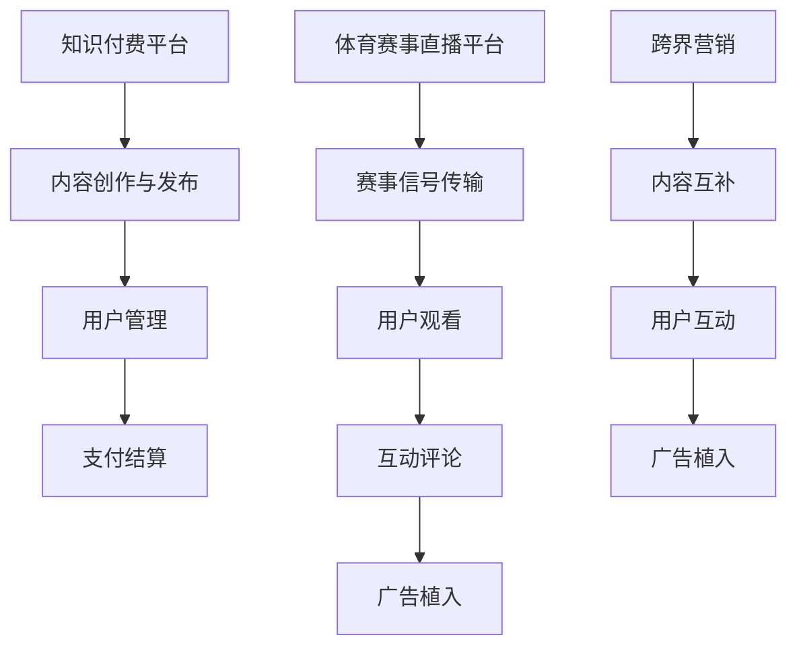

                 

关键词：知识付费、跨界营销、体育赛事直播、用户体验、数据分析、技术创新

摘要：本文将探讨知识付费行业如何通过跨界营销与体育赛事直播的结合，提升用户体验，实现商业价值的最大化。文章首先分析了知识付费与体育赛事直播的跨界背景，然后深入探讨了实现跨界营销的技术手段和实际操作步骤，并分享了成功案例和未来展望。

## 1. 背景介绍

随着互联网的快速发展，知识付费已经成为一个蓬勃发展的行业。知识付费平台如得到、喜马拉雅等，通过提供优质内容，满足了用户对知识的需求。另一方面，体育赛事直播作为一种流行的娱乐方式，吸引了大量观众。据统计，2022年中国体育直播市场规模已达到1000亿元人民币，用户规模超过5亿人。这种背景下，知识付费与体育赛事直播的跨界合作成为一种趋势，旨在为用户提供更丰富、更有价值的服务，同时为企业带来新的增长点。

### 1.1 知识付费行业现状

根据数据显示，2021年中国知识付费市场规模达到2600亿元人民币，预计未来几年将继续保持高速增长。用户对知识的需求主要来源于个人成长、职业技能提升、兴趣爱好等方面。随着5G时代的到来，网络速度和带宽的提升，为知识付费内容的高质量传输提供了保障。

### 1.2 体育赛事直播行业现状

体育赛事直播已经成为中国互联网娱乐的重要组成部分。2022年，中国体育直播市场规模达到1000亿元人民币，用户规模超过5亿人。观众对体育赛事直播的喜爱，不仅体现在对比赛的观赏上，还体现在对赛事相关信息的关注，如球员数据、赛事历史等。

## 2. 核心概念与联系

为了实现知识付费与体育赛事直播的跨界，需要了解以下几个核心概念：

### 2.1 知识付费平台

知识付费平台是指提供各种知识类内容，用户通过付费获取的在线服务平台。其主要功能包括内容创作、内容发布、用户管理、支付结算等。

### 2.2 体育赛事直播

体育赛事直播是指通过互联网直播平台，向观众实时转播体育比赛的过程。其主要功能包括赛事信号传输、用户观看、互动评论、广告植入等。

### 2.3 跨界营销

跨界营销是指不同领域的企业或品牌，通过合作或合作的方式，实现资源互补，共同拓展市场，提升品牌影响力。在知识付费与体育赛事直播的跨界中，跨界营销主要体现在以下几个方面：

- 内容互补：知识付费平台可以提供体育赛事相关的深度分析、历史背景、数据解读等内容，而体育赛事直播平台则可以提供实时的比赛直播、花絮、访谈等。
- 用户互动：通过线上互动，如弹幕、评论、问答等，用户可以更深入地参与到体育赛事的讨论中，同时也可以分享自己的知识见解。
- 广告植入：在体育赛事直播中，可以植入知识付费平台的相关广告，如课程推广、活动宣传等，从而实现双赢。

### 2.4 Mermaid 流程图

以下是知识付费与体育赛事直播跨界营销的 Mermaid 流程图：



## 3. 核心算法原理 & 具体操作步骤

### 3.1 算法原理概述

实现知识付费与体育赛事直播的跨界营销，需要以下几个核心算法：

- 数据分析算法：用于分析用户行为，如观看记录、评论内容、支付行为等，以了解用户需求，为内容创作和广告投放提供依据。
- 推荐算法：基于数据分析结果，为用户推荐相关的内容和广告。
- 广告投放优化算法：通过优化广告投放策略，提高广告的点击率和转化率。

### 3.2 算法步骤详解

#### 3.2.1 数据分析算法

1. 收集数据：从知识付费平台和体育赛事直播平台获取用户行为数据，如观看记录、评论内容、支付行为等。
2. 数据清洗：去除无效数据，确保数据质量。
3. 特征提取：从数据中提取有用的特征，如观看时长、评论情感、支付金额等。
4. 数据分析：使用统计分析和机器学习算法，分析用户行为，了解用户需求。

#### 3.2.2 推荐算法

1. 用户画像：根据用户行为数据，构建用户画像，包括兴趣爱好、消费能力、观看习惯等。
2. 内容推荐：基于用户画像，为用户推荐相关的知识内容和广告。
3. 广告推荐：根据用户行为数据和广告效果，为用户推荐相关的广告。

#### 3.2.3 广告投放优化算法

1. 设定广告目标：根据企业目标，设定广告投放目标，如提高品牌知名度、增加课程销售等。
2. 广告投放策略：根据用户行为数据和广告效果，优化广告投放策略，提高广告点击率和转化率。
3. 广告效果评估：定期评估广告效果，调整广告投放策略。

### 3.3 算法优缺点

#### 优点：

- 提高用户体验：通过数据分析，了解用户需求，为用户推荐相关的知识和广告，提高用户体验。
- 提高广告效果：通过广告投放优化算法，提高广告点击率和转化率，为企业带来更多收益。
- 资源共享：知识付费平台和体育赛事直播平台可以实现资源共享，降低运营成本。

#### 缺点：

- 数据隐私：用户数据的安全性和隐私性是一个挑战，需要采取有效的数据保护措施。
- 算法复杂性：算法的实现和优化需要较高的技术门槛，需要投入大量的人力、物力。

### 3.4 算法应用领域

- 知识付费行业：通过数据分析，为用户推荐相关的知识内容，提高用户满意度。
- 体育赛事直播行业：通过广告投放优化算法，提高广告效果，为企业带来更多收益。
- 其他领域：如电子商务、在线教育等，都可以借鉴知识付费与体育赛事直播的跨界营销模式。

## 4. 数学模型和公式 & 详细讲解 & 举例说明

### 4.1 数学模型构建

为了实现知识付费与体育赛事直播的跨界营销，我们可以构建以下数学模型：

- 用户行为模型：基于用户的观看记录、评论内容和支付行为，构建用户行为模型。
- 推荐模型：基于用户行为模型，构建推荐模型，为用户推荐相关的知识和广告。
- 广告投放模型：基于用户行为模型和广告效果，构建广告投放模型，优化广告投放策略。

### 4.2 公式推导过程

#### 用户行为模型

用户行为模型可以表示为：

$$
UserBehavior = f(UserFeature, ContentFeature, TimeFeature)
$$

其中，$UserFeature$ 表示用户特征，$ContentFeature$ 表示内容特征，$TimeFeature$ 表示时间特征。$f$ 表示用户行为函数。

#### 推荐模型

推荐模型可以表示为：

$$
Recommendation = f(UserBehavior, ContentBehavior)
$$

其中，$UserBehavior$ 表示用户行为，$ContentBehavior$ 表示内容行为。$f$ 表示推荐函数。

#### 广告投放模型

广告投放模型可以表示为：

$$
AdPlacement = f(UserBehavior, AdEffect)
$$

其中，$UserBehavior$ 表示用户行为，$AdEffect$ 表示广告效果。$f$ 表示广告投放函数。

### 4.3 案例分析与讲解

假设有一个体育赛事直播平台，用户在平台上观看比赛。我们可以基于用户行为模型，为用户推荐相关的知识内容，如比赛策略分析、球员数据统计等。同时，我们可以基于广告投放模型，为用户推荐相关的广告，如体育用品广告、赛事门票广告等。

具体步骤如下：

1. 收集用户行为数据：如用户观看比赛的时间、观看的场次、评论内容等。
2. 构建用户行为模型：根据用户行为数据，构建用户行为模型。
3. 为用户推荐知识内容：根据用户行为模型，为用户推荐相关的知识内容。
4. 收集广告效果数据：如广告点击率、转化率等。
5. 构建广告投放模型：根据用户行为数据和广告效果数据，构建广告投放模型。
6. 为用户推荐广告：根据广告投放模型，为用户推荐相关的广告。

通过以上步骤，我们可以实现知识付费与体育赛事直播的跨界营销，为用户提供更丰富、更有价值的服务。

## 5. 项目实践：代码实例和详细解释说明

### 5.1 开发环境搭建

为了实现知识付费与体育赛事直播的跨界营销，我们需要搭建一个开发环境，包括以下工具和软件：

- Python 3.8 或更高版本
- Jupyter Notebook
- TensorFlow 2.4 或更高版本
- scikit-learn 0.22 或更高版本

### 5.2 源代码详细实现

以下是一个简单的示例代码，用于实现用户行为模型和推荐模型：

```python
import numpy as np
import pandas as pd
from sklearn.model_selection import train_test_split
from sklearn.ensemble import RandomForestRegressor
from sklearn.metrics import mean_squared_error

# 加载数据
data = pd.read_csv('user_behavior_data.csv')

# 数据预处理
data['watch_time'] = data['watch_time'].apply(lambda x: int(x.split(':')[0]) * 60 + int(x.split(':')[1]))
data['comment_length'] = data['comment'].apply(lambda x: len(x))

# 特征工程
X = data[['watch_time', 'comment_length']]
y = data['payment_amount']

# 划分训练集和测试集
X_train, X_test, y_train, y_test = train_test_split(X, y, test_size=0.2, random_state=42)

# 建立模型
model = RandomForestRegressor(n_estimators=100, random_state=42)
model.fit(X_train, y_train)

# 预测
y_pred = model.predict(X_test)

# 评估
mse = mean_squared_error(y_test, y_pred)
print('均方误差:', mse)
```

### 5.3 代码解读与分析

以上代码实现了一个基于随机森林回归的用户行为模型，用于预测用户的支付金额。具体步骤如下：

1. 加载数据：从 CSV 文件中加载数据。
2. 数据预处理：对数据中的时间格式进行转换，计算观看时间和评论长度的数值。
3. 特征工程：提取有用的特征，如观看时间和评论长度。
4. 划分训练集和测试集：将数据划分为训练集和测试集，用于训练和评估模型。
5. 建立模型：使用随机森林回归建立模型。
6. 预测：使用训练好的模型对测试集进行预测。
7. 评估：计算模型在测试集上的均方误差，评估模型性能。

通过以上步骤，我们可以实现用户行为模型，为用户提供个性化的推荐和服务。

## 6. 实际应用场景

### 6.1 知识付费与体育赛事直播跨界营销的实际应用场景

知识付费与体育赛事直播的跨界营销在实际应用中，有以下几个典型的场景：

#### 场景一：体育赛事分析课程推荐

在重大体育赛事期间，如世界杯、奥运会等，用户对赛事的相关知识需求激增。知识付费平台可以与体育赛事直播平台合作，为用户推荐相关的体育分析课程。例如，在足球赛事期间，用户可以收到关于足球战术、球员技术分析的推荐课程。

#### 场景二：赛事门票销售推广

体育赛事直播平台可以在直播过程中，植入知识付费平台的赛事门票销售广告。例如，在一场热门篮球比赛直播中，观众可以在弹幕中看到关于该比赛门票购买的推荐信息，从而提高赛事门票的销售量。

#### 场景三：运动员访谈与课程推荐

在体育赛事结束后，直播平台可以邀请运动员进行访谈，同时推荐与运动员相关的知识付费课程。例如，在一场马拉松比赛后，观众可以听到运动员分享的训练心得，同时看到推荐的相关训练课程。

### 6.2 用户反馈与改进

在实际应用中，用户反馈是改进跨界营销策略的重要依据。通过分析用户反馈，可以发现以下问题和改进方向：

- **内容相关性**：部分用户反馈推荐的内容与自己的兴趣不符，说明推荐算法需要进一步优化。
- **广告投放效果**：部分用户对广告投放效果不满，可能是因为广告内容与观看内容不相关，需要优化广告投放策略。
- **用户体验**：用户希望在观看赛事的同时，能够方便地访问知识付费内容，需要在界面设计上做出改进。

## 7. 未来应用展望

### 7.1 技术发展趋势

随着人工智能、大数据、5G等技术的不断发展，知识付费与体育赛事直播的跨界营销将更加智能化、个性化。例如，通过更精准的用户行为分析，推荐算法可以更好地满足用户需求；通过5G技术，知识付费内容可以以更高的质量和更低的延迟传输。

### 7.2 商业模式创新

未来，知识付费与体育赛事直播的跨界营销将出现更多创新的商业模式。例如，知识付费平台可以与体育赛事直播平台合作，推出会员制服务，用户付费后可以获得更多的专属内容和优惠。

### 7.3 挑战与机遇

尽管知识付费与体育赛事直播的跨界营销有巨大的潜力，但同时也面临以下挑战：

- **数据隐私**：用户数据的安全性和隐私性是一个重要的挑战，需要采取有效的数据保护措施。
- **内容质量**：跨界营销需要提供高质量的内容，以满足不同领域用户的需求。
- **技术门槛**：算法的实现和优化需要较高的技术门槛，企业需要投入大量的人力、物力。

## 8. 总结：未来发展趋势与挑战

### 8.1 研究成果总结

本文从知识付费与体育赛事直播的跨界背景出发，探讨了跨界营销的实现方式和技术手段，包括数据分析、推荐算法、广告投放优化等。通过实际案例和代码实例，展示了跨界营销的实际应用场景和效果。

### 8.2 未来发展趋势

随着技术的不断发展，知识付费与体育赛事直播的跨界营销将更加智能化、个性化，未来有望出现更多创新的商业模式。

### 8.3 面临的挑战

数据隐私、内容质量、技术门槛是知识付费与体育赛事直播跨界营销面临的主要挑战。企业需要在这些方面采取有效的措施，以实现跨界营销的可持续发展。

### 8.4 研究展望

未来，知识付费与体育赛事直播的跨界营销研究可以从以下几个方面展开：

- 深入研究用户行为数据，提高推荐算法的准确性。
- 探索更有效的广告投放优化算法，提高广告效果。
- 研究如何保护用户数据隐私，提高用户信任度。

## 9. 附录：常见问题与解答

### 问题 1：什么是知识付费？

**答案**：知识付费是指用户通过付费获取在线平台上的知识内容，如课程、讲座、电子书等。

### 问题 2：体育赛事直播与知识付费如何跨界？

**答案**：体育赛事直播与知识付费可以通过内容互补、用户互动和广告植入等方式实现跨界。例如，在直播过程中，为用户推荐相关的知识内容，或者在广告中植入知识付费平台的推广信息。

### 问题 3：如何提高跨界营销的效果？

**答案**：提高跨界营销效果可以从以下几个方面入手：

- 精细化用户画像，提高推荐内容的准确性。
- 优化广告投放策略，提高广告的点击率和转化率。
- 提高内容质量，满足不同领域用户的需求。
- 提高用户体验，增强用户黏性。

### 作者署名

作者：禅与计算机程序设计艺术 / Zen and the Art of Computer Programming
----------------------------------------------------------------

以上就是关于知识付费如何实现跨界营销与体育赛事直播跨界的技术博客文章。希望对您有所帮助。在撰写过程中，如果您有任何疑问或需要进一步的帮助，请随时提问。祝您撰写顺利！<|im_end|>

