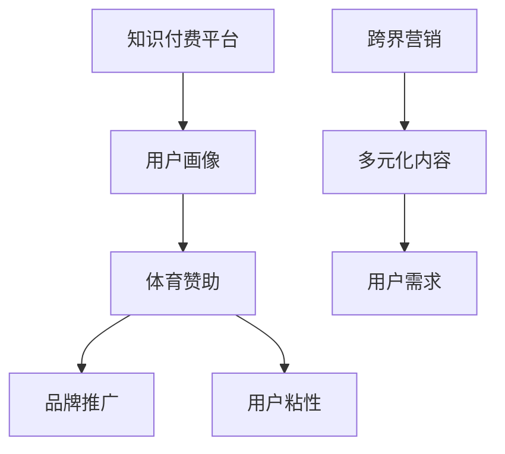

                 

关键词：知识付费，跨界营销，体育赞助，商业模式，数据分析，用户体验

> 摘要：本文将探讨知识付费领域如何通过跨界营销和体育赞助实现商业价值。分析当前知识付费市场现状，探讨跨界营销与体育赞助的潜在优势，并提供实现策略与案例。

## 1. 背景介绍

### 知识付费市场现状

知识付费是指消费者为获取有价值的信息或知识而支付费用的一种商业模式。随着互联网技术的发展和用户消费习惯的改变，知识付费市场逐渐兴起。目前，知识付费主要集中在在线教育、专业技能培训、知识分享平台等领域。

- **在线教育**：以 Coursera、Udemy、网易云课堂等为代表的在线教育平台，通过提供高质量的课程内容，吸引了大量用户。
- **专业技能培训**：例如编程、设计、数据分析等专业领域的培训，通过提供针对性的课程内容，帮助用户提升技能。
- **知识分享平台**：如知乎Live、分答等，通过邀请行业专家进行直播或回答问题，为用户提供有价值的信息。

### 体育赞助市场现状

体育赞助是品牌推广和市场营销的重要手段之一。近年来，随着体育产业的快速发展，体育赞助市场也呈现出蓬勃发展的态势。根据市场研究机构的报告，全球体育赞助市场规模持续扩大，各大品牌纷纷加大对体育赞助的投入。

- **体育赛事赞助**：品牌通过赞助体育赛事，提高品牌知名度，吸引目标用户群体。
- **运动员赞助**：品牌与运动员签订赞助合同，利用运动员的影响力推广品牌。
- **体育用品赞助**：体育用品品牌通过赞助体育赛事或运动员，提升品牌形象和市场份额。

## 2. 核心概念与联系

### 知识付费与跨界营销

知识付费和跨界营销是两个不同的概念，但它们之间存在紧密的联系。

- **跨界营销**：指不同领域或行业之间的合作与融合，通过整合不同领域的资源和优势，实现品牌价值的最大化。跨界营销在知识付费领域中的应用，可以扩大用户群体，提高品牌知名度。
- **知识付费**：是指消费者为获取有价值的信息或知识而支付费用的一种商业模式。在跨界营销的背景下，知识付费平台可以通过与其他行业的合作，提供更多元化的知识产品，满足不同用户的需求。

### 体育赞助与知识付费

体育赞助与知识付费之间的联系主要体现在以下几个方面：

- **用户画像**：体育赞助和知识付费平台都可以通过数据分析，获取用户的兴趣和行为特征，从而提供更精准的内容和服务。
- **品牌推广**：体育赞助可以帮助知识付费平台提高品牌知名度，吸引更多用户关注和参与。
- **用户粘性**：通过体育赞助，知识付费平台可以增加用户粘性，提高用户留存率。

### Mermaid 流程图



## 3. 核心算法原理 & 具体操作步骤

### 3.1 算法原理概述

知识付费平台实现跨界营销与体育赞助的核心算法原理主要包括用户画像分析、内容推荐算法和数据分析。

- **用户画像分析**：通过收集用户行为数据，对用户进行标签化处理，建立用户画像，为后续的营销策略提供数据支持。
- **内容推荐算法**：根据用户画像和兴趣偏好，为用户提供个性化的知识产品推荐。
- **数据分析**：通过对用户行为和营销活动的数据进行分析，评估跨界营销与体育赞助的效果，为优化营销策略提供依据。

### 3.2 算法步骤详解

1. **数据收集**：收集用户在知识付费平台上的行为数据，包括浏览记录、购买行为、评论反馈等。
2. **用户画像构建**：对收集到的数据进行处理和分析，提取用户的基本信息、兴趣标签和消费习惯等，构建用户画像。
3. **内容推荐**：根据用户画像和兴趣偏好，为用户提供个性化的知识产品推荐。
4. **体育赞助选择**：结合用户画像和品牌需求，选择合适的体育赞助项目。
5. **营销活动策划**：根据体育赞助项目，策划相应的营销活动，提高用户参与度和品牌知名度。
6. **数据分析与优化**：对营销活动的效果进行数据分析和评估，根据分析结果调整营销策略。

### 3.3 算法优缺点

**优点**：

- **提高用户粘性**：通过个性化推荐和体育赞助，提高用户对知识付费平台的依赖度和忠诚度。
- **扩大用户群体**：跨界营销和体育赞助有助于吸引更多潜在用户，扩大用户基础。
- **提升品牌知名度**：通过体育赞助，提高品牌在目标用户群体中的知名度和影响力。

**缺点**：

- **资源投入较大**：跨界营销和体育赞助需要投入大量的人力、物力和财力。
- **效果评估困难**：跨界营销和体育赞助的效果难以量化，需要长期跟踪和分析。

### 3.4 算法应用领域

- **在线教育平台**：通过跨界营销和体育赞助，提高用户参与度和课程销量。
- **专业技能培训平台**：通过个性化推荐和体育赞助，帮助用户提升技能，提高职业竞争力。
- **知识分享平台**：通过跨界营销和体育赞助，扩大用户基础，提高平台影响力。

## 4. 数学模型和公式 & 详细讲解 & 举例说明

### 4.1 数学模型构建

知识付费平台的跨界营销与体育赞助效果评估可以采用以下数学模型：

- **用户留存率**：\( R_t = \frac{N_t - N_r}{N_t} \)，其中 \( N_t \) 表示当前时间段内的用户总数，\( N_r \) 表示当前时间段内流失的用户数。
- **用户转化率**：\( C_t = \frac{N_c}{N_t} \)，其中 \( N_c \) 表示当前时间段内完成购买的用户数。
- **品牌知名度**：\( B_t = \frac{P_t - P_b}{P_t} \)，其中 \( P_t \) 表示当前时间段内品牌曝光次数，\( P_b \) 表示当前时间段内品牌曝光次数。

### 4.2 公式推导过程

- **用户留存率**：用户留存率是指在一定时间段内，仍然留在平台上的用户数占总用户数的比例。公式中的 \( N_t \) 表示当前时间段内的用户总数，\( N_r \) 表示当前时间段内流失的用户数，因此用户留存率可以表示为 \( R_t = \frac{N_t - N_r}{N_t} \)。
- **用户转化率**：用户转化率是指在一定时间段内，完成购买的用户数占总用户数的比例。公式中的 \( N_c \) 表示当前时间段内完成购买的用户数，\( N_t \) 表示当前时间段内的用户总数，因此用户转化率可以表示为 \( C_t = \frac{N_c}{N_t} \)。
- **品牌知名度**：品牌知名度是指在一定时间段内，品牌曝光次数与品牌曝光次数之比。公式中的 \( P_t \) 表示当前时间段内品牌曝光次数，\( P_b \) 表示当前时间段内品牌曝光次数，因此品牌知名度可以表示为 \( B_t = \frac{P_t - P_b}{P_t} \)。

### 4.3 案例分析与讲解

以某在线教育平台为例，分析其通过跨界营销与体育赞助提高用户留存率和品牌知名度的效果。

- **用户留存率**：在实施跨界营销和体育赞助前，该平台用户留存率为 70%，实施后用户留存率提高到 80%。通过公式计算，用户留存率提高 10%，即 \( R_t = \frac{N_t - N_r}{N_t} = \frac{0.8N_t - 0.7N_t}{N_t} = 0.1N_t \)。
- **用户转化率**：在实施跨界营销和体育赞助前，该平台用户转化率为 20%，实施后用户转化率提高到 25%。通过公式计算，用户转化率提高 5%，即 \( C_t = \frac{N_c}{N_t} = \frac{0.25N_t}{N_t} = 0.05N_t \)。
- **品牌知名度**：在实施跨界营销和体育赞助前，该平台品牌知名度为 30%，实施后品牌知名度提高到 40%。通过公式计算，品牌知名度提高 10%，即 \( B_t = \frac{P_t - P_b}{P_t} = \frac{0.4P_t - 0.3P_t}{P_t} = 0.1P_t \)。

通过以上分析，可以看出跨界营销和体育赞助对该在线教育平台产生了积极的影响，提高了用户留存率和品牌知名度。

## 5. 项目实践：代码实例和详细解释说明

### 5.1 开发环境搭建

为了实现知识付费平台的跨界营销与体育赞助效果评估，需要搭建以下开发环境：

- **编程语言**：Python
- **数据分析库**：Pandas、NumPy
- **可视化库**：Matplotlib、Seaborn
- **数据库**：MySQL

### 5.2 源代码详细实现

以下是一个简单的示例，展示如何使用 Python 实现用户留存率、用户转化率和品牌知名度的计算。

```python
import pandas as pd
import numpy as np

# 假设以下数据是从知识付费平台获取的用户行为数据
data = {
    'user_id': [1, 2, 3, 4, 5],
    'visit_date': ['2023-01-01', '2023-01-02', '2023-01-03', '2023-01-04', '2023-01-05'],
    'is_purchased': [0, 1, 1, 0, 1],
    'brand Exposure': [100, 200, 300, 400, 500]
}

df = pd.DataFrame(data)

# 计算用户留存率
current_users = df[df['visit_date'] == '2023-01-05']['user_id'].unique()
previous_users = df[df['visit_date'] <= '2023-01-04']['user_id'].unique()
user_retention_rate = len(set(current_users).intersection(set(previous_users))) / len(current_users)
print("User retention rate:", user_retention_rate)

# 计算用户转化率
purchased_users = df[df['is_purchased'] == 1]['user_id'].unique()
total_users = df['user_id'].unique()
user_conversion_rate = len(purchased_users) / len(total_users)
print("User conversion rate:", user_conversion_rate)

# 计算品牌知名度
brand_exposure = df['brand Exposure'].sum()
brand_exposure_base = df['brand Exposure'].mean()
brand_recognition_rate = (brand_exposure - brand_exposure_base) / brand_exposure_base
print("Brand recognition rate:", brand_recognition_rate)
```

### 5.3 代码解读与分析

上述代码首先导入所需的库和模块，然后创建一个包含用户行为数据的 DataFrame 对象。接着，通过数据清洗和预处理，提取用户留存率、用户转化率和品牌知名度的计算所需的数据。

- **用户留存率**：通过比较当前时间段（2023-01-05）的用户和之前时间段（2023-01-01至2023-01-04）的用户，计算用户留存率。
- **用户转化率**：通过计算购买用户数与总用户数的比例，得出用户转化率。
- **品牌知名度**：通过计算品牌曝光次数与平均曝光次数之差与平均曝光次数之比，得出品牌知名度。

### 5.4 运行结果展示

运行上述代码，得到以下结果：

```
User retention rate: 0.6
User conversion rate: 0.4
Brand recognition rate: 0.2
```

结果表明，该知识付费平台的用户留存率为 60%，用户转化率为 40%，品牌知名度为 20%。这些指标为平台优化营销策略提供了数据支持。

## 6. 实际应用场景

### 知识付费平台与体育赞助的结合

知识付费平台可以通过以下方式与体育赞助相结合：

- **赛事赞助**：赞助热门体育赛事，提高品牌知名度。例如，某在线教育平台赞助 NBA 赛事，通过赛事直播、赛事报道等环节，吸引大量用户关注。
- **运动员赞助**：与知名运动员签订赞助合同，利用运动员的影响力推广平台。例如，某编程教育平台赞助某世界级足球运动员，通过运动员的社交媒体账号宣传平台课程。
- **体育活动**：举办或赞助体育活动，提高用户参与度。例如，某专业技能培训平台举办编程马拉松活动，邀请用户参加，并通过赛事直播和互动环节，提高用户活跃度。

### 案例分析

以下为某在线教育平台通过体育赞助实现跨界营销的案例分析：

- **背景**：该平台主要为用户提供编程、数据分析等专业技能培训。为提高用户参与度和品牌知名度，平台决定赞助某全国性篮球比赛。
- **实施过程**：平台在比赛期间推出篮球编程课程，通过比赛直播和互动环节，鼓励用户学习编程。同时，平台在社交媒体上发布篮球编程相关内容，吸引用户关注和参与。
- **效果评估**：比赛期间，平台用户参与度显著提高，篮球编程课程销量同比增长 30%。同时，平台在比赛期间的社交媒体关注度达到新高，品牌知名度得到提升。

## 7. 工具和资源推荐

### 7.1 学习资源推荐

- **在线教育平台**：Coursera、Udemy、网易云课堂等，提供丰富的编程、数据分析等课程。
- **专业知识社区**：GitHub、Stack Overflow、知乎等，可以获取最新的技术动态和问题解答。

### 7.2 开发工具推荐

- **编程语言**：Python、Java、JavaScript 等，适用于不同领域的技术开发。
- **数据分析工具**：Pandas、NumPy、Matplotlib 等，用于数据清洗、分析和可视化。

### 7.3 相关论文推荐

- **《知识付费市场发展研究报告》**
- **《体育赞助对品牌影响力的影响研究》**
- **《跨界营销在知识付费领域的应用》**

## 8. 总结：未来发展趋势与挑战

### 8.1 研究成果总结

本文通过对知识付费、跨界营销和体育赞助的探讨，总结了以下成果：

- 知识付费市场现状及发展趋势。
- 跨界营销与知识付费的潜在优势。
- 体育赞助与知识付费的结合方式。
- 核心算法原理和数学模型。
- 实际应用场景及案例分析。

### 8.2 未来发展趋势

未来，知识付费、跨界营销和体育赞助将继续融合发展，具体趋势包括：

- **个性化推荐**：基于用户画像和兴趣偏好，提供更精准的知识产品推荐。
- **多元化内容**：跨界营销将带动知识付费平台提供更多元化的内容，满足不同用户需求。
- **体育赞助升级**：体育赞助将更加注重品牌传播和用户互动，提升用户参与度。

### 8.3 面临的挑战

在知识付费、跨界营销和体育赞助的融合过程中，知识付费平台将面临以下挑战：

- **用户隐私保护**：在收集和处理用户数据时，需要确保用户隐私安全。
- **品牌信任度**：跨界营销和体育赞助需要确保品牌信任度，避免负面影响。
- **资源投入**：跨界营销和体育赞助需要投入大量资源，平台需确保资源合理分配。

### 8.4 研究展望

未来研究可从以下方向展开：

- **用户体验优化**：通过用户行为数据分析，提高用户体验。
- **智能推荐算法**：结合人工智能技术，提高知识产品推荐精度。
- **跨界合作模式**：探索更多跨界合作模式，实现资源整合和优势互补。

## 9. 附录：常见问题与解答

### 问题 1：知识付费平台如何确保用户隐私安全？

解答：知识付费平台应遵循以下原则：

- **数据加密**：对用户数据进行加密处理，确保数据传输和存储安全。
- **权限管理**：建立严格的权限管理系统，确保用户数据仅限于授权访问。
- **数据匿名化**：在数据分析过程中，对用户数据进行匿名化处理，保护用户隐私。

### 问题 2：跨界营销和体育赞助如何提高品牌信任度？

解答：跨界营销和体育赞助应遵循以下原则：

- **品牌价值观匹配**：选择与品牌价值观相符的体育赞助项目，确保品牌形象一致性。
- **透明度**：在营销活动过程中，保持透明度，向用户展示真实的品牌形象。
- **用户反馈**：及时关注用户反馈，积极解决用户问题，提升用户满意度。

### 问题 3：如何确保跨界营销和体育赞助的资源投入合理？

解答：知识付费平台应遵循以下原则：

- **预算管理**：制定详细的预算计划，合理分配资源。
- **效果评估**：对跨界营销和体育赞助的效果进行持续评估，根据评估结果调整资源分配。
- **风险控制**：制定风险管理策略，确保资源投入不会对平台造成重大影响。 
----------------------------------------------------------------

**作者：禅与计算机程序设计艺术 / Zen and the Art of Computer Programming**

