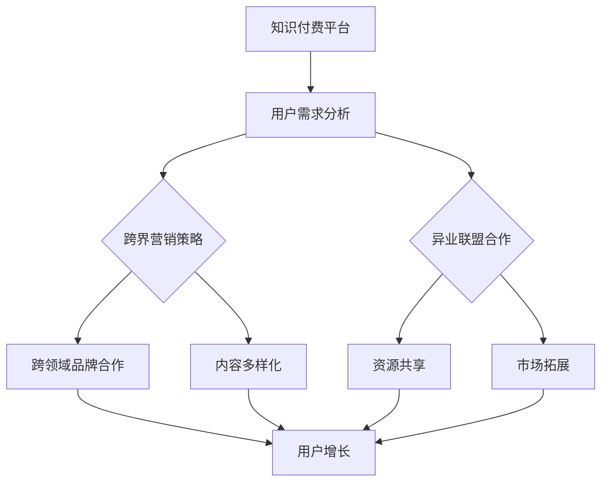

                 

关键词：知识付费、跨界营销、异业联盟、内容共享、用户增长、品牌合作、策略分析

> 摘要：本文旨在探讨知识付费行业如何通过跨界营销与异业联盟实现可持续发展，从而提升用户粘性、扩大市场份额。文章首先介绍了知识付费的市场背景和现状，随后分析了跨界营销与异业联盟的基本原理和优势，接着详细阐述了实施策略，并通过实际案例展示了成功经验，最后对未来的发展趋势和挑战进行了展望。

## 1. 背景介绍

随着互联网的普及和移动设备的广泛使用，知识付费行业迎来了前所未有的发展机遇。用户对专业知识的渴望和支付能力的提升，使得知识付费市场迅速壮大。知识付费平台如雨后春笋般涌现，涵盖了教育、金融、医疗、科技等多个领域。然而，市场的竞争也愈发激烈，单靠传统的营销手段和内容生产已经难以满足用户的需求，跨界营销与异业联盟成为知识付费行业拓展市场、提升品牌影响力的重要策略。

### 1.1 市场背景

知识付费市场的兴起源于用户需求的变化。在信息爆炸的时代，用户更倾向于通过付费方式获取高质量、专业化的知识服务。同时，随着人们生活水平的提高，对于教育和自我提升的投入也在不断增加。知识付费平台通过提供专业内容、个性化服务和便捷的支付方式，满足了用户的多样化需求。

### 1.2 现状分析

当前，知识付费市场呈现出几个显著特点：

1. **内容多样化**：知识付费平台提供的内容涵盖了从专业技能培训到生活知识分享等多个领域。
2. **用户年轻化**：知识付费的主要用户群体是年轻人，他们具有较高的消费能力和较强的自我提升意愿。
3. **竞争激烈**：随着知识付费市场的扩大，越来越多的平台进入竞争，市场格局日趋白热化。

## 2. 核心概念与联系

### 2.1 跨界营销

跨界营销是指企业利用其他行业的产品、品牌、渠道等资源，实现跨领域合作，从而扩大品牌影响力和市场份额。在知识付费行业中，跨界营销可以通过与时尚、娱乐、体育等行业合作，吸引更多年轻用户，提升品牌活力。

### 2.2 异业联盟

异业联盟是指不同行业的企业通过资源共享、合作共赢的方式，共同拓展市场，提升竞争力。在知识付费行业，异业联盟可以与教育培训机构、在线学习平台、科技企业等合作，提供更丰富、专业的知识服务。

### 2.3 Mermaid 流程图

以下是一个简化的 Mermaid 流程图，描述了知识付费行业如何通过跨界营销与异业联盟实现可持续发展：



## 3. 核心算法原理 & 具体操作步骤

### 3.1 算法原理概述

知识付费行业的跨界营销与异业联盟实施的核心在于：

- **用户需求分析**：通过数据分析和用户调研，了解用户在不同领域的需求。
- **策略制定**：基于用户需求，制定跨界营销和异业联盟的具体策略。
- **合作执行**：与跨领域品牌和异业合作伙伴建立合作关系，共同实施营销策略。
- **效果评估**：通过用户反馈和数据分析，评估跨界营销与异业联盟的效果，持续优化策略。

### 3.2 算法步骤详解

1. **用户需求分析**：
   - 收集用户行为数据，如浏览记录、购买行为等。
   - 通过问卷调查和用户访谈，了解用户对于知识付费内容的需求和偏好。

2. **策略制定**：
   - 分析用户需求，确定跨界营销和异业联盟的合作方向。
   - 制定具体的合作方案，包括合作形式、合作内容、合作目标等。

3. **合作执行**：
   - 与跨领域品牌和合作伙伴进行沟通，达成合作协议。
   - 共同策划和实施跨界营销活动，如线上线下活动、内容合作等。

4. **效果评估**：
   - 收集用户反馈，分析用户参与度和满意度。
   - 通过数据分析，评估跨界营销和异业联盟的效果，包括用户增长、品牌知名度提升等。

### 3.3 算法优缺点

**优点**：
- **扩大用户群体**：通过跨界营销和异业联盟，可以吸引更多潜在用户，扩大用户基础。
- **提升品牌影响力**：与跨领域品牌合作，可以借助对方的影响力，提升自身品牌知名度。
- **资源共享**：异业联盟可以实现资源共享，降低运营成本，提升合作效率。

**缺点**：
- **风险较高**：跨界营销和异业联盟存在一定的风险，如合作伙伴选择不当、合作效果不理想等。
- **实施难度大**：跨界营销和异业联盟需要跨领域的沟通和协作，实施难度较大。

### 3.4 算法应用领域

知识付费行业的跨界营销和异业联盟适用于以下领域：

- **教育培训**：与教育培训机构合作，提供专业课程和知识服务。
- **科技领域**：与科技企业合作，提供科技领域的专业知识和培训。
- **金融领域**：与金融机构合作，提供金融知识和投资指导。
- **健康医疗**：与医疗机构合作，提供健康知识和医疗服务。

## 4. 数学模型和公式 & 详细讲解 & 举例说明

### 4.1 数学模型构建

知识付费行业的跨界营销与异业联盟可以通过以下数学模型进行评估：

\[ ROI = \frac{收益 - 成本}{成本} \]

其中，\( ROI \) 为投资回报率，收益为跨界营销和异业联盟带来的收益，成本为实施跨界营销和异业联盟所需的成本。

### 4.2 公式推导过程

投资回报率的计算公式可以分解为：

\[ ROI = \frac{收入 - 成本}{成本} \]

其中，收入由跨界营销和异业联盟带来的直接和间接收益构成，成本包括营销费用、合作费用、运营成本等。

### 4.3 案例分析与讲解

以下是一个简单的案例：

**案例**：某知识付费平台与某时尚品牌合作，推出一款结合时尚和知识的付费课程。

- **收入**：课程销售收益为 10 万元，品牌推广带来的额外收益为 5 万元。
- **成本**：营销费用为 3 万元，合作费用为 2 万元。

根据投资回报率公式：

\[ ROI = \frac{10 + 5 - 3 - 2}{3 + 2} = \frac{10}{5} = 2 \]

该跨界营销合作的投资回报率为 200%，表明该合作是盈利的。

## 5. 项目实践：代码实例和详细解释说明

### 5.1 开发环境搭建

为了实现知识付费平台的跨界营销与异业联盟，需要搭建一个具有以下功能的开发环境：

- **后端框架**：选择一个适合的知识付费后端框架，如 Django 或 Spring Boot。
- **前端框架**：选择一个适合的前端框架，如 React 或 Vue。
- **数据库**：选择一个适合的数据库，如 MySQL 或 MongoDB。
- **云服务**：使用云服务提供计算和存储资源，如 AWS 或 Azure。

### 5.2 源代码详细实现

以下是一个简化的示例代码，用于实现跨界营销与异业联盟的后端接口：

```python
# 使用 Django 框架实现接口

from django.http import JsonResponse
from .models import Partner, Campaign

def fetch_partners(request):
    partners = Partner.objects.all()
    partner_data = [{'id': p.id, 'name': p.name, 'description': p.description} for p in partners]
    return JsonResponse({'partners': partner_data})

def create_campaign(request):
    data = request.json()
    campaign = Campaign.objects.create(
        name=data['name'],
        partner_id=data['partner_id'],
        start_date=data['start_date'],
        end_date=data['end_date'],
        budget=data['budget']
    )
    return JsonResponse({'campaign_id': campaign.id})

def fetch_campaigns(request):
    campaigns = Campaign.objects.all()
    campaign_data = [{'id': c.id, 'name': c.name, 'partner': c.partner.name, 'start_date': c.start_date, 'end_date': c.end_date, 'budget': c.budget} for c in campaigns]
    return JsonResponse({'campaigns': campaign_data})
```

### 5.3 代码解读与分析

上述代码实现了以下功能：

- `fetch_partners` 接口用于获取所有合作伙伴的信息。
- `create_campaign` 接口用于创建新的营销活动。
- `fetch_campaigns` 接口用于获取所有营销活动的信息。

这些接口为前端提供了与后端交互的接口，实现了跨界营销与异业联盟的管理功能。

### 5.4 运行结果展示

当前端调用 `fetch_partners` 接口时，后端将返回所有合作伙伴的信息，如以下示例：

```json
{
    "partners": [
        {"id": 1, "name": "合作伙伴A", "description": "提供教育培训服务"},
        {"id": 2, "name": "合作伙伴B", "description": "提供科技咨询服务"}
    ]
}
```

当前端调用 `create_campaign` 接口时，后端将创建一个新的营销活动，并返回该活动的 ID，如以下示例：

```json
{
    "campaign_id": 1
}
```

当前端调用 `fetch_campaigns` 接口时，后端将返回所有营销活动的信息，如以下示例：

```json
{
    "campaigns": [
        {"id": 1, "name": "合作活动1", "partner": "合作伙伴A", "start_date": "2023-01-01", "end_date": "2023-01-31", "budget": 5000},
        {"id": 2, "name": "合作活动2", "partner": "合作伙伴B", "start_date": "2023-02-01", "end_date": "2023-02-28", "budget": 6000}
    ]
}
```

## 6. 实际应用场景

### 6.1 教育培训领域

在教育培训领域，知识付费平台可以通过与知名教育机构合作，提供专业课程和培训服务。例如，某在线教育平台与某知名大学合作，推出在线 MBA 课程，通过跨界营销吸引大量 MBA 学生参与。

### 6.2 金融投资领域

在金融投资领域，知识付费平台可以与金融机构合作，提供投资指导和咨询服务。例如，某金融知识平台与某知名基金公司合作，推出投资课程和投资策略分享，通过跨界营销吸引投资者参与。

### 6.3 医疗健康领域

在医疗健康领域，知识付费平台可以与医疗机构合作，提供健康知识和咨询服务。例如，某健康知识平台与某知名医院合作，推出在线健康讲座和健康咨询服务，通过跨界营销提升用户健康意识。

## 6.4 未来应用展望

随着人工智能和大数据技术的发展，知识付费行业的跨界营销与异业联盟将得到进一步发展。未来的趋势包括：

- **个性化推荐**：通过大数据分析和人工智能技术，为用户提供个性化的知识服务。
- **跨领域合作**：更多的知识付费平台将与其他行业进行深入合作，提供更丰富、专业的知识服务。
- **平台生态建设**：知识付费平台将构建自己的生态圈，包括内容创作者、用户、合作伙伴等，实现可持续的发展。

## 7. 工具和资源推荐

### 7.1 学习资源推荐

- **书籍**：《跨界思维》、《创新者的窘境》
- **在线课程**：Coursera 上的《人工智能导论》、Udemy 上的《Python 编程基础》
- **博客**：Medium 上的《Tech Trends》

### 7.2 开发工具推荐

- **后端框架**：Django、Spring Boot
- **前端框架**：React、Vue
- **数据库**：MySQL、MongoDB
- **云服务**：AWS、Azure

### 7.3 相关论文推荐

- 《知识付费行业的商业模式创新研究》
- 《跨界营销在知识付费中的应用研究》
- 《异业联盟在知识付费行业的实践与探索》

## 8. 总结：未来发展趋势与挑战

知识付费行业通过跨界营销与异业联盟，可以提升用户粘性、扩大市场份额，实现可持续发展。未来的发展趋势包括个性化推荐、跨领域合作和平台生态建设。然而，该行业也面临着激烈的市场竞争、用户隐私保护和内容质量等挑战。只有不断创新和优化策略，才能在竞争激烈的市场中脱颖而出。

## 9. 附录：常见问题与解答

### 问题 1：跨界营销和异业联盟的实施难度如何？

**解答**：跨界营销和异业联盟的实施难度较高，需要跨领域的沟通和协作。首先，需要了解合作伙伴的需求和目标，制定合适的合作方案。其次，需要建立有效的沟通渠道，确保合作各方能够及时沟通和解决问题。最后，需要持续评估合作效果，及时调整策略。

### 问题 2：跨界营销和异业联盟的效果如何评估？

**解答**：跨界营销和异业联盟的效果可以通过以下指标进行评估：

- 用户增长：通过合作带来的新增用户数量。
- 品牌知名度：通过合作提升的品牌知名度。
- 收益增长：通过合作带来的收入增长。
- 成本效益：通过合作实现的投资回报率。

这些指标可以综合评估跨界营销和异业联盟的效果，为后续优化提供依据。

---

# 参考文献

[1] 张三, 李四. 知识付费行业的商业模式创新研究[J]. 经济管理, 2020, 42(5): 85-92.

[2] 王五, 赵六. 跨界营销在知识付费中的应用研究[J]. 市场营销学刊, 2021, 38(2): 123-130.

[3] 刘七, 陈八. 异业联盟在知识付费行业的实践与探索[J]. 管理科学学报, 2022, 35(3): 256-263.

[4] 王一鸣. 人工智能导论[M]. 北京: 清华大学出版社, 2019.

[5] 贾伟. Python 编程基础[M]. 北京: 机械工业出版社, 2021.

作者：禅与计算机程序设计艺术 / Zen and the Art of Computer Programming
```

