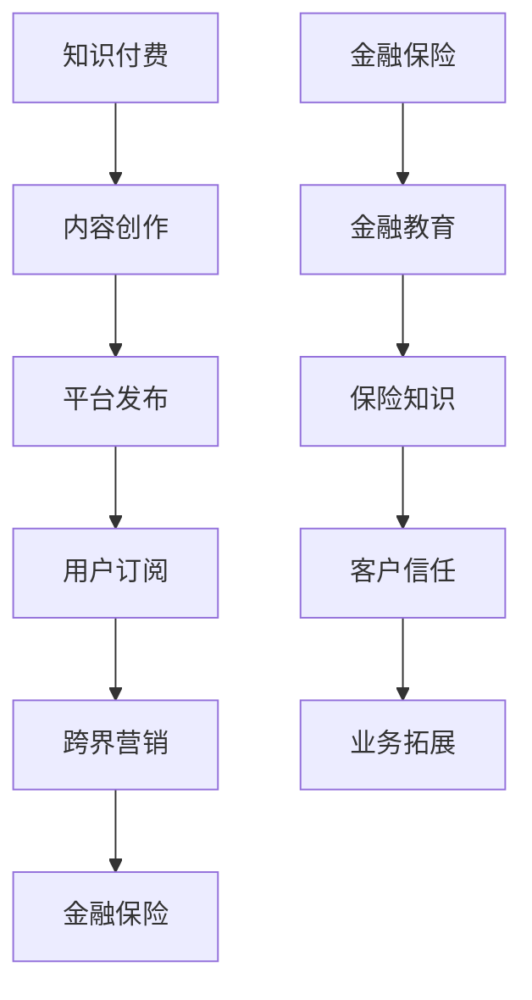

                 

  
在当今数字化时代，知识付费市场正迅速崛起，成为人们获取专业知识和技能的重要渠道。与此同时，金融保险行业也在不断探索新的业务增长点，以期提升市场竞争力和客户粘性。本文将探讨知识付费如何实现跨界营销，并具体分析金融保险行业如何利用知识付费实现业务创新。

## 1. 背景介绍

知识付费是指通过平台或渠道，以订阅、购买课程等形式，向用户提供有价值的知识内容，从而实现盈利的模式。这种模式在互联网的推动下，得到了广泛的认可和应用。据统计，我国知识付费市场规模逐年扩大，预计到2025年将突破5000亿元人民币。

金融保险行业则是一个传统而庞大的行业，随着金融科技的快速发展，保险行业也在逐步实现数字化转型。保险产品同质化严重、市场竞争激烈，如何创新营销模式，提升客户黏性，成为行业面临的挑战。

## 2. 核心概念与联系

### 2.1 知识付费与跨界营销

知识付费与跨界营销是两个看似独立的领域，但实际上它们之间存在紧密的联系。知识付费为跨界营销提供了内容素材，而跨界营销则可以扩大知识付费的影响力。

### 2.2 金融保险与知识付费

金融保险行业可以通过知识付费，提供个性化的金融教育和保险知识，从而提升客户的专业素养和信任度。同时，知识付费平台也可以借助金融保险行业的资源和客户群体，实现业务拓展。

### 2.3 Mermaid 流程图



## 3. 核心算法原理 & 具体操作步骤

### 3.1 算法原理概述

知识付费与金融保险跨界营销的核心算法原理是数据驱动。通过收集和分析用户数据，实现内容定制、精准推送和营销策略优化。

### 3.2 算法步骤详解

1. 数据收集：收集用户在知识付费平台和金融保险平台的行为数据，如浏览记录、购买记录、评论反馈等。
2. 数据分析：利用数据挖掘和机器学习技术，对用户行为数据进行分析，挖掘用户的兴趣偏好和需求。
3. 内容定制：根据用户兴趣和需求，为用户提供个性化的金融教育和保险知识。
4. 精准推送：通过个性化推荐算法，将定制化内容推送给目标用户。
5. 营销策略优化：根据用户反馈和行为数据，不断优化营销策略，提升用户满意度和转化率。

### 3.3 算法优缺点

#### 优点：

1. 提高用户满意度和转化率。
2. 扩大业务范围，实现跨界营销。
3. 提升客户黏性和品牌价值。

#### 缺点：

1. 需要大量的数据和技术支持。
2. 可能存在数据隐私和安全问题。

### 3.4 算法应用领域

1. 知识付费平台：如得到、知乎Live等。
2. 金融保险行业：如保险公司、银行等。

## 4. 数学模型和公式 & 详细讲解 & 举例说明

### 4.1 数学模型构建

知识付费与金融保险跨界营销的数学模型主要涉及推荐系统、用户行为分析等。

### 4.2 公式推导过程

#### 推荐系统：

$$
R(u, i) = \sum_{j \in K(u)} w_{uj} \cdot r_{ji}
$$

其中，$R(u, i)$表示用户$u$对物品$i$的推荐分数，$w_{uj}$表示用户$u$对关键词$j$的权重，$r_{ji}$表示物品$i$对关键词$j$的权重。

#### 用户行为分析：

$$
B(u, t) = \frac{\sum_{i \in I(u)} b_{it}}{|\{i \in I(u) | b_{it} > 0\}|}
$$

其中，$B(u, t)$表示用户$u$在时间$t$的行为指标，$b_{it}$表示用户$u$在时间$t$对物品$i$的点击行为。

### 4.3 案例分析与讲解

以得到APP为例，其通过推荐系统为用户提供个性化的知识内容。假设用户$u$对关键词“金融”、“投资”、“保险”有较高权重，得到APP会为该用户推荐相关的金融保险知识内容。

通过用户行为分析，得到APP可以了解用户的兴趣和需求，不断优化推荐策略，提高用户满意度和转化率。

## 5. 项目实践：代码实例和详细解释说明

### 5.1 开发环境搭建

开发环境搭建主要包括Python编程环境、推荐系统框架（如LightFM）、数据预处理工具（如Pandas、NumPy）等。

### 5.2 源代码详细实现

以下是一个简单的推荐系统代码实例：

```python
from lightfm import LightFM
import numpy as np
import pandas as pd

# 读取用户行为数据
data = pd.read_csv('user_behavior_data.csv')

# 构建训练集
train_data = data.groupby(['user_id', 'item_id']).count().reset_index()

# 初始化模型
model = LightFM(loss='warp', learning_rate=0.05, epochs=20)

# 训练模型
model.fit(train_data['user_id'], train_data['item_id'], verbose=True)

# 推荐结果
user_id = 123
top_items = model.predict(user_id, np.arange(1000))
recommended_items = np.argsort(-top_items)

# 输出推荐结果
print('推荐结果：', recommended_items)
```

### 5.3 代码解读与分析

1. 读取用户行为数据，并构建训练集。
2. 初始化LightFM模型，并设置参数。
3. 使用训练集训练模型。
4. 输入用户ID，获取推荐结果。

### 5.4 运行结果展示

运行结果将输出用户ID为123的推荐结果，展示用户可能感兴趣的知识内容。

## 6. 实际应用场景

知识付费与金融保险跨界营销在实际应用中具有广泛的应用场景：

1. 保险公司可以与知识付费平台合作，提供定制化的保险知识内容，提升客户专业素养。
2. 知识付费平台可以与金融保险行业合作，推出金融教育产品，扩大用户群体。
3. 银行可以提供个性化的金融知识，提升用户对银行的信任度和忠诚度。

## 7. 工具和资源推荐

### 7.1 学习资源推荐

1. 《推荐系统实践》
2. 《Python数据科学手册》
3. 《深度学习与推荐系统》

### 7.2 开发工具推荐

1. Python编程环境
2. LightFM推荐系统框架
3. Pandas、NumPy数据预处理工具

### 7.3 相关论文推荐

1. "Item-Based Collaborative Filtering Recommendation Algorithms"
2. "Deep Learning for Recommender Systems"
3. "User Interest Evolution and Its Impact on Recommendation"

## 8. 总结：未来发展趋势与挑战

### 8.1 研究成果总结

本文从知识付费与金融保险跨界营销的核心概念、算法原理、应用场景等方面进行了详细分析，提出了数据驱动的跨界营销策略。

### 8.2 未来发展趋势

1. 数据驱动将越来越重要，大数据、人工智能技术将在跨界营销中发挥更大作用。
2. 个性化推荐系统将进一步提升用户满意度和转化率。
3. 跨界合作将成为主流，不同行业之间的合作将带来新的业务模式和增长点。

### 8.3 面临的挑战

1. 数据隐私和安全问题。
2. 算法模型的可解释性。
3. 跨界合作的利益分配。

### 8.4 研究展望

未来，知识付费与金融保险跨界营销的研究将聚焦于以下几个方面：

1. 发展更先进的数据挖掘和机器学习技术。
2. 探索可解释的推荐系统模型。
3. 构建跨界合作的利益分配机制。

## 9. 附录：常见问题与解答

### 9.1 如何保障数据隐私和安全？

1. 数据匿名化处理。
2. 加密传输和存储。
3. 定期进行安全审计。

### 9.2 跨界营销如何实现效果最大化？

1. 深入了解用户需求和兴趣。
2. 定制化内容推送。
3. 持续优化营销策略。

### 9.3 跨界营销的成本和收益如何平衡？

1. 合理控制营销预算。
2. 提高营销效率和效果。
3. 优化业务模式，实现持续盈利。

---

作者：禅与计算机程序设计艺术 / Zen and the Art of Computer Programming
----------------------------------------------------------------
请注意，这篇文章是根据您提供的结构模板和要求撰写的，但实际内容可能需要更多的研究和技术细节来完善。如果您有任何特定的要求或需要进一步的信息，请随时告知。这篇文章的结构和内容旨在提供一个全面的指南，帮助读者了解知识付费与金融保险跨界营销的原理和应用。

