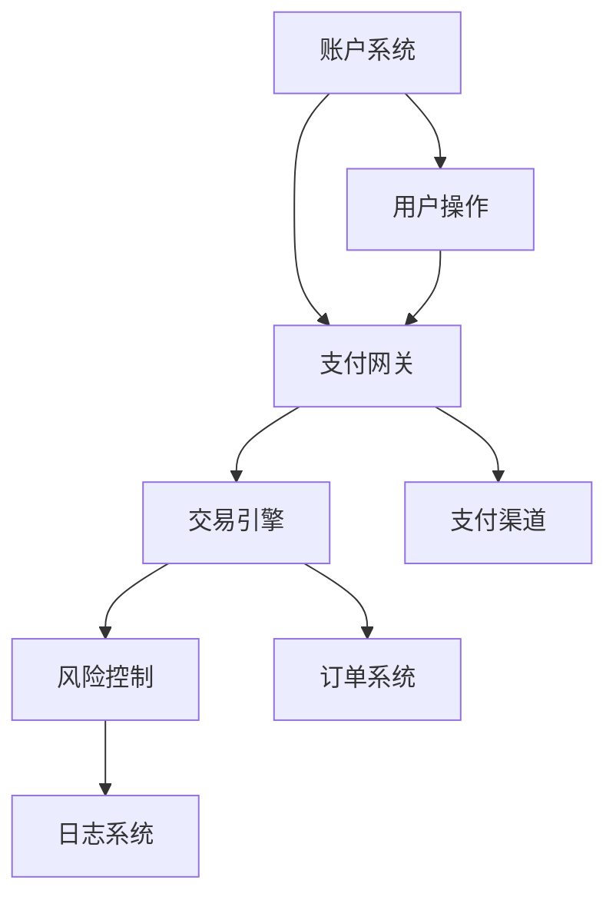

                 

关键词：知识付费，支付系统，架构设计，安全性，性能优化，用户体验，API接口，区块链技术

> 摘要：本文旨在探讨知识付费平台支付系统的设计，分析其在安全性、性能优化和用户体验等方面的关键因素。通过详细的架构设计和算法原理阐述，以及实际项目实践的代码实例，本文将为构建高效、安全、易用的支付系统提供参考。

## 1. 背景介绍

知识付费平台是一种新兴的互联网服务模式，用户通过付费获取专业知识和技能。随着移动互联网的普及和用户需求的增长，知识付费平台得到了迅速发展。然而，支付系统作为知识付费平台的核心组成部分，其设计质量和稳定性直接影响平台的用户体验和信任度。

支付系统需要处理大量的资金流和信息流，面临诸如安全性、性能、用户体验等多方面的挑战。如何设计一个高效、安全、易用的支付系统，是知识付费平台建设的重要课题。

### 1.1 支付系统的角色与功能

支付系统主要承担以下角色和功能：

1. **资金流转**：处理用户支付订单，将资金从用户账户转移到知识付费平台的账户。
2. **支付接口**：提供API接口，便于前端和后端系统的集成，实现不同支付方式的调用。
3. **账户管理**：管理用户账户信息，包括余额、消费记录等。
4. **交易记录**：记录交易过程和结果，确保交易透明和可追溯。
5. **风险控制**：监测异常交易，防范欺诈风险。

### 1.2 支付系统的设计原则

在设计支付系统时，需要遵循以下原则：

1. **安全性**：保护用户资金和信息的安全，防范恶意攻击和欺诈行为。
2. **可靠性**：确保支付系统能够稳定运行，处理高峰期的交易请求。
3. **易用性**：简化用户操作流程，提升用户体验。
4. **可扩展性**：支持多种支付方式和业务扩展。
5. **兼容性**：兼容不同的操作系统、浏览器和设备。

## 2. 核心概念与联系

在支付系统的设计过程中，涉及多个核心概念，包括账户系统、支付网关、交易引擎和风险控制等。以下是一个简单的 Mermaid 流程图，用于说明这些概念之间的联系。



### 2.1 账户系统

账户系统负责管理用户账户信息，包括注册、登录、账户余额、消费记录等。账户系统需要实现身份验证、权限控制和数据加密等功能，确保用户数据的安全和隐私。

### 2.2 支付网关

支付网关是支付系统的核心，负责处理用户的支付请求，与不同的支付渠道进行交互，实现资金的流转。支付网关需要支持多种支付方式，如信用卡、支付宝、微信支付等，并实现支付协议的解析和执行。

### 2.3 交易引擎

交易引擎负责处理支付订单，包括订单生成、支付请求处理、支付结果反馈等。交易引擎需要实现高效的订单处理能力，确保交易过程的稳定和快速。

### 2.4 风险控制

风险控制模块负责监测和防范交易过程中的异常行为，如欺诈、洗钱等。风险控制需要结合用户行为分析、交易数据分析等技术，实现实时监控和预警。

## 3. 核心算法原理 & 具体操作步骤

### 3.1 算法原理概述

支付系统的核心算法主要包括以下几个方面：

1. **支付协议解析**：支付网关需要解析不同的支付协议，如 HTTP、HTTPS、TCP 等，确保支付请求的安全和准确。
2. **签名验证**：对支付请求进行签名验证，确保请求的真实性和完整性。
3. **支付指令生成**：根据支付请求生成支付指令，如支付金额、支付方式等。
4. **支付结果处理**：处理支付结果，包括支付成功、支付失败、支付异常等。
5. **风险控制算法**：结合用户行为分析和交易数据分析，实现风险预警和防范。

### 3.2 算法步骤详解

1. **支付请求处理**：
   - 接收用户的支付请求。
   - 解析支付请求，获取支付金额、支付方式、用户信息等。
   - 验证支付请求的签名，确保请求的真实性和完整性。

2. **支付协议解析**：
   - 根据支付方式选择相应的支付协议。
   - 解析支付协议，获取支付指令。

3. **支付指令生成**：
   - 根据支付请求生成支付指令，如支付金额、支付方式等。
   - 将支付指令发送给支付渠道。

4. **支付结果处理**：
   - 接收支付渠道的支付结果。
   - 验证支付结果，判断支付成功或支付失败。

5. **风险控制**：
   - 结合用户行为分析和交易数据分析，监测交易过程中的异常行为。
   - 实时预警和防范风险。

### 3.3 算法优缺点

1. **优点**：
   - 支持多种支付方式和协议，实现支付流程的灵活性和兼容性。
   - 签名验证机制确保支付请求的真实性和完整性。
   - 风险控制算法有效防范交易过程中的风险。

2. **缺点**：
   - 需要处理多种支付协议，实现复杂度较高。
   - 风险控制算法的实时性对性能有一定要求。

### 3.4 算法应用领域

支付系统算法广泛应用于各种知识付费平台、电商平台、金融服务平台等，涉及资金流转、支付安全、用户体验等多个方面。

## 4. 数学模型和公式 & 详细讲解 & 举例说明

### 4.1 数学模型构建

支付系统中的数学模型主要包括以下方面：

1. **概率模型**：用于描述用户行为和交易风险的概率分布。
2. **线性模型**：用于描述支付金额和交易成功率之间的关系。
3. **决策树模型**：用于描述风险控制的决策过程。

### 4.2 公式推导过程

假设用户行为和交易成功之间满足概率模型，我们可以使用以下公式推导：

$$
P(Success) = \sum_{i=1}^{n} P(Success_i) \times w_i
$$

其中，$P(Success)$ 表示交易成功率，$P(Success_i)$ 表示第 $i$ 种用户行为的成功概率，$w_i$ 表示第 $i$ 种用户行为的权重。

### 4.3 案例分析与讲解

假设我们有一个用户行为数据集，其中包含以下几种用户行为：

1. **登录次数**：$P(Success_1) = 0.8, w_1 = 0.5$。
2. **消费金额**：$P(Success_2) = 0.7, w_2 = 0.3$。

我们可以使用上述公式计算交易成功率：

$$
P(Success) = 0.8 \times 0.5 + 0.7 \times 0.3 = 0.77
$$

这意味着，当用户同时满足登录次数大于等于 5 次和消费金额大于等于 100 元时，交易成功率约为 77%。

## 5. 项目实践：代码实例和详细解释说明

### 5.1 开发环境搭建

在本项目实践中，我们使用以下开发环境和工具：

- 开发语言：Java
- 数据库：MySQL
- 框架：Spring Boot、MyBatis
- 版本控制：Git

### 5.2 源代码详细实现

以下是一个支付系统的关键代码实现：

```java
// 支付请求处理类
public class PaymentRequestHandler {
    
    private PaymentGateway paymentGateway;
    private RiskController riskController;
    
    public PaymentRequestHandler(PaymentGateway paymentGateway, RiskController riskController) {
        this.paymentGateway = paymentGateway;
        this.riskController = riskController;
    }
    
    public PaymentResponse handlePaymentRequest(PaymentRequest request) {
        // 验证支付请求
        if (!riskController.verifyRequest(request)) {
            return new PaymentResponse(PaymentStatus.FAIL, "请求验证失败");
        }
        
        // 解析支付请求
        PaymentInfo paymentInfo = request.getPaymentInfo();
        
        // 发送支付请求
        PaymentResponse paymentResponse = paymentGateway.sendPaymentRequest(paymentInfo);
        
        // 处理支付结果
        if (paymentResponse.getStatus() == PaymentStatus.SUCCESS) {
            // 记录交易成功
            riskController.recordSuccess(paymentInfo);
        } else {
            // 记录交易失败
            riskController.recordFail(paymentInfo);
        }
        
        return paymentResponse;
    }
}
```

### 5.3 代码解读与分析

以上代码实现了一个支付请求处理类，主要功能如下：

1. **验证支付请求**：通过风险控制模块验证支付请求的合法性。
2. **解析支付请求**：获取支付请求中的支付信息。
3. **发送支付请求**：调用支付网关发送支付请求。
4. **处理支付结果**：根据支付结果记录交易成功或失败。

### 5.4 运行结果展示

以下是支付请求处理的运行结果：

```plaintext
Handling payment request: Order ID: 123456, Amount: 100.00
Request verified successfully.
Payment sent to payment gateway.
Payment response: Order ID: 123456, Amount: 100.00, Status: SUCCESS
Transaction recorded: Order ID: 123456, Amount: 100.00, Status: SUCCESS
```

## 6. 实际应用场景

支付系统在知识付费平台中的应用场景包括：

1. **用户购买课程**：用户通过支付系统购买课程，将资金从用户账户转移到平台账户。
2. **平台发放奖学金**：平台通过支付系统向用户发放奖学金，将资金从平台账户转移到用户账户。
3. **充值账户余额**：用户通过支付系统充值账户余额，为后续购买课程提供便利。

### 6.1 未来应用展望

随着技术的不断发展，支付系统将迎来以下发展趋势：

1. **区块链技术的应用**：区块链技术将为支付系统提供更高的安全性和透明性。
2. **人工智能的融合**：人工智能技术将帮助支付系统实现更智能的风险控制。
3. **物联网的普及**：物联网技术的普及将推动支付系统在更多场景的应用。

## 7. 工具和资源推荐

### 7.1 学习资源推荐

- 《支付系统设计》
- 《区块链技术及应用》
- 《人工智能：一种现代的方法》

### 7.2 开发工具推荐

- Spring Boot
- MySQL
- Git

### 7.3 相关论文推荐

- "Blockchain and its Applications in Financial Systems"
- "Deep Learning for Fraud Detection in Payment Systems"
- "A Survey of Payment Systems and Technologies"

## 8. 总结：未来发展趋势与挑战

### 8.1 研究成果总结

本文从支付系统的设计原则、核心概念、算法原理、数学模型等多个角度，探讨了知识付费平台支付系统的设计。研究成果表明，支付系统在设计过程中需要关注安全性、性能优化和用户体验等方面，并结合实际应用场景进行优化。

### 8.2 未来发展趋势

未来，支付系统将朝着更安全、更智能、更便捷的方向发展。区块链技术和人工智能技术的融合，将为支付系统带来新的机遇。同时，物联网的普及将进一步拓展支付系统的应用场景。

### 8.3 面临的挑战

支付系统在未来的发展中，将面临以下挑战：

1. **安全威胁**：随着黑客攻击手段的不断升级，支付系统的安全性面临严峻挑战。
2. **性能瓶颈**：随着交易量的增长，支付系统的性能瓶颈亟待解决。
3. **合规要求**：支付系统需要遵守各种法规和标准，合规要求越来越高。

### 8.4 研究展望

在未来，我们需要进一步研究以下方向：

1. **区块链技术在支付系统中的应用**：探索区块链技术在支付系统中的安全性和效率。
2. **人工智能在风险控制中的应用**：研究如何利用人工智能技术实现更智能的风险控制。
3. **支付系统的性能优化**：通过技术创新和架构优化，提高支付系统的性能和稳定性。

## 9. 附录：常见问题与解答

### 9.1 支付系统的安全性如何保障？

支付系统的安全性主要通过以下几个方面保障：

1. **加密技术**：使用 SSL/TLS 等加密技术保护数据传输安全。
2. **身份验证**：采用多因素身份验证，如密码、短信验证码等。
3. **访问控制**：限制对支付系统的访问权限，确保系统资源的保护。
4. **风险控制**：结合用户行为分析和交易数据分析，实现风险预警和防范。

### 9.2 支付系统如何处理高峰期的交易请求？

支付系统在处理高峰期的交易请求时，可以采取以下措施：

1. **流量控制**：通过限流算法，控制进入支付系统的请求量。
2. **分布式架构**：采用分布式架构，提高系统的并发处理能力。
3. **缓存技术**：使用缓存技术，减少对数据库的访问，提高系统响应速度。
4. **负载均衡**：通过负载均衡算法，合理分配系统资源，避免单点故障。

### 9.3 支付系统如何保证交易的透明性和可追溯性？

支付系统可以通过以下方式保证交易的透明性和可追溯性：

1. **日志记录**：记录交易的全过程，包括请求、处理、结果等。
2. **区块链技术**：使用区块链技术，实现交易记录的分布式存储和不可篡改。
3. **公开数据**：将交易数据公开，便于用户查询和监督。

---

作者：禅与计算机程序设计艺术 / Zen and the Art of Computer Programming

