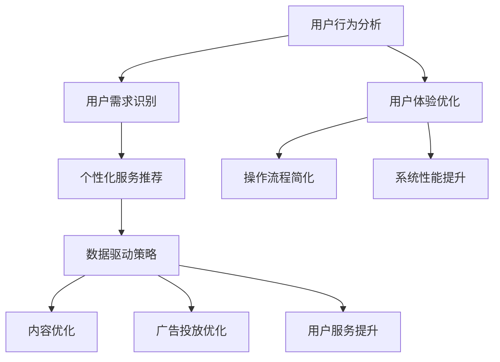

                 

关键词：知识付费平台、用户留存、用户体验、数据驱动、算法优化、策略分析

>摘要：本文探讨了知识付费平台在当前互联网经济环境下的用户留存率提升策略。通过分析用户行为数据、优化用户体验以及应用算法模型，本文提出了一套综合性的策略，旨在提高知识付费平台的用户黏性，促进平台的可持续发展。

## 1. 背景介绍

知识付费平台作为一种新型的在线服务模式，近年来在全球范围内迅速崛起。用户通过支付一定费用，可以获取高质量的教育资源、专业技能培训等。这类平台为用户提供了个性化、定制化的学习体验，同时也为企业提供了知识变现的渠道。然而，随着市场竞争的加剧，知识付费平台的用户留存率成为决定其成败的关键因素之一。

根据最新统计数据，知识付费平台的用户留存率普遍较低，一些热门平台的一年留存率甚至不足20%。这种低留存率的现象不仅对平台的运营带来了巨大的挑战，也影响了知识付费行业的发展前景。因此，提升用户留存率已成为知识付费平台亟待解决的问题。

### 用户留存的重要性

用户留存是指用户在初次使用平台后，继续使用平台服务的概率。用户留存率是衡量平台用户体验和平台价值的重要指标。高留存率意味着用户对平台的依赖和信任度较高，平台可以更稳定地获取收入，同时也为平台的品牌积累和口碑传播提供了有利条件。

### 现存问题分析

当前知识付费平台普遍存在以下问题：

1. **内容同质化**：大部分平台提供的内容相似，难以满足用户的个性化需求。
2. **用户体验不佳**：平台设计不够友好，操作复杂，用户学习过程受阻。
3. **营销过度**：一些平台过度依赖促销和优惠策略，忽视了用户实际需求。
4. **服务单一**：平台服务内容较为单一，无法提供全方位的用户支持。

## 2. 核心概念与联系

为了提升知识付费平台的用户留存率，我们需要深入理解几个核心概念，并探讨它们之间的联系。

### 用户行为分析

用户行为分析是通过对用户在平台上的活动数据进行分析，来了解用户的需求、偏好和习惯。这包括用户的使用频率、活跃时间、购买历史、内容偏好等多个方面。通过用户行为分析，平台可以识别出不同用户群体的特征，进而提供更加个性化的服务。

### 用户体验优化

用户体验（User Experience, UX）是指用户在使用平台过程中所感受到的整体体验。优化用户体验意味着通过改进界面设计、简化操作流程、提高系统性能等方式，提升用户在平台上的满意度和舒适度。良好的用户体验可以增加用户的留存时间，降低用户流失率。

### 数据驱动策略

数据驱动策略是指通过收集和分析大量数据，来指导平台运营和决策。在知识付费平台中，数据驱动策略可以帮助平台更好地了解用户需求，优化内容推荐、广告投放和用户服务，从而提升用户留存率。

### 以下是用户行为分析、用户体验优化和数据驱动策略的Mermaid流程图：



## 3. 核心算法原理 & 具体操作步骤

### 3.1 算法原理概述

提升知识付费平台用户留存率的核心算法主要包括用户行为预测、个性化推荐和用户体验优化。以下分别对这些算法的原理进行简要介绍。

#### 用户行为预测

用户行为预测是基于历史数据和机器学习算法，预测用户在未来可能采取的行为。这包括用户是否继续使用平台、是否购买课程等。常见的算法有决策树、随机森林和神经网络等。

#### 个性化推荐

个性化推荐是基于用户行为数据和内容特征，为用户提供个性化的内容推荐。常见的算法有协同过滤、基于内容的推荐和混合推荐等。

#### 用户体验优化

用户体验优化是通过改进界面设计、操作流程和系统性能，提高用户的整体体验。这通常涉及用户研究、可用性测试和A/B测试等方法。

### 3.2 算法步骤详解

#### 用户行为预测

1. 数据收集：收集用户在平台上的行为数据，包括浏览历史、购买记录、互动行为等。
2. 数据预处理：清洗和整合数据，为后续建模做准备。
3. 特征提取：提取有助于预测用户行为的特征，如用户活跃时间、课程完成率、用户评价等。
4. 模型训练：使用机器学习算法训练预测模型，如决策树、随机森林等。
5. 预测评估：评估模型的预测准确性，调整模型参数。

#### 个性化推荐

1. 数据收集：收集用户行为数据和内容特征，如用户浏览记录、课程标签、课程评分等。
2. 数据预处理：清洗和整合数据，为推荐算法做准备。
3. 特征提取：提取用户和内容的特征，如用户兴趣、课程难度等。
4. 推荐算法：使用协同过滤、基于内容的推荐或混合推荐算法生成推荐结果。
5. 推荐评估：评估推荐效果，调整推荐策略。

#### 用户体验优化

1. 用户研究：通过访谈、问卷调查等方式了解用户需求和反馈。
2. 可用性测试：设计并测试新功能或界面，评估用户的使用体验。
3. A/B测试：对不同设计方案进行对比测试，选择最优方案。
4. 数据分析：分析用户行为数据，识别用户体验问题。
5. 优化实施：根据数据分析结果，优化界面设计、操作流程和系统性能。

### 3.3 算法优缺点

#### 用户行为预测

优点：能够提前预测用户行为，有助于采取预防措施。

缺点：模型训练复杂，需要大量数据支持。

#### 个性化推荐

优点：提高用户满意度，增加用户留存率。

缺点：推荐结果可能过于依赖历史数据，难以适应用户的新需求。

#### 用户体验优化

优点：直接提升用户的使用体验，提高用户留存率。

缺点：优化过程可能涉及大量测试和迭代，成本较高。

### 3.4 算法应用领域

这些算法可以广泛应用于知识付费平台的各个领域，包括内容推荐、用户行为预测和用户体验优化等。通过结合多种算法，平台可以实现全方位的用户服务，从而提高用户留存率。

## 4. 数学模型和公式 & 详细讲解 & 举例说明

### 4.1 数学模型构建

为了提升知识付费平台的用户留存率，我们需要构建一系列数学模型，用于预测用户行为、优化推荐策略和提升用户体验。

#### 用户行为预测模型

用户行为预测模型通常基于时间序列分析和机器学习算法。以下是构建用户行为预测模型的基本步骤：

1. 数据收集：收集用户在平台上的行为数据，如浏览历史、购买记录、互动行为等。
2. 数据预处理：清洗和整合数据，去除异常值和噪声。
3. 特征工程：提取有助于预测用户行为的特征，如用户活跃时间、课程完成率、用户评价等。
4. 模型选择：选择合适的机器学习算法，如决策树、随机森林、神经网络等。
5. 模型训练：使用训练数据训练预测模型。
6. 模型评估：使用验证数据评估模型性能，调整模型参数。

#### 个性化推荐模型

个性化推荐模型通常基于协同过滤、基于内容的推荐或混合推荐算法。以下是构建个性化推荐模型的基本步骤：

1. 数据收集：收集用户行为数据和内容特征，如用户浏览记录、课程标签、课程评分等。
2. 数据预处理：清洗和整合数据，去除异常值和噪声。
3. 特征提取：提取用户和内容的特征，如用户兴趣、课程难度等。
4. 推荐算法：选择合适的推荐算法，如协同过滤、基于内容的推荐或混合推荐等。
5. 推荐生成：生成个性化推荐结果。
6. 推荐评估：评估推荐效果，调整推荐策略。

#### 用户体验优化模型

用户体验优化模型通常基于用户研究和可用性测试。以下是构建用户体验优化模型的基本步骤：

1. 用户研究：通过访谈、问卷调查等方式了解用户需求和反馈。
2. 可用性测试：设计并测试新功能或界面，评估用户的使用体验。
3. 数据收集：收集用户行为数据和反馈数据。
4. 数据分析：分析用户行为数据和反馈数据，识别用户体验问题。
5. 模型构建：构建用户体验优化模型，如基于用户满意度的优化模型等。
6. 优化实施：根据模型结果，优化界面设计、操作流程和系统性能。

### 4.2 公式推导过程

以下是用户行为预测模型中的核心公式推导过程。

#### 1. 时间序列模型

时间序列模型通常用于预测用户行为的时间序列。以下是时间序列模型的基本公式：

$$
Y_t = \alpha + \beta X_t + \epsilon_t
$$

其中，$Y_t$ 表示第 $t$ 时刻的用户行为，$X_t$ 表示第 $t$ 时刻的影响因素，$\alpha$ 和 $\beta$ 是模型的参数，$\epsilon_t$ 是随机误差项。

#### 2. 机器学习模型

机器学习模型通常用于预测用户行为。以下是机器学习模型的基本公式：

$$
P(Y_t = 1) = \sigma(\theta^T X_t)
$$

其中，$P(Y_t = 1)$ 表示第 $t$ 时刻用户行为为“继续使用”的概率，$\sigma$ 是 sigmoid 函数，$\theta$ 是模型的参数。

#### 3. 个性化推荐模型

个性化推荐模型通常用于生成个性化推荐结果。以下是个性化推荐模型的基本公式：

$$
R_i = \sum_{j=1}^{N} w_{ij} C_j
$$

其中，$R_i$ 表示第 $i$ 个用户收到的推荐结果，$w_{ij}$ 表示用户 $i$ 对课程 $j$ 的权重，$C_j$ 表示课程 $j$ 的特征向量。

### 4.3 案例分析与讲解

以下是一个实际案例，用于说明如何使用数学模型提升知识付费平台的用户留存率。

#### 案例背景

某知名知识付费平台希望通过构建用户行为预测模型，提前预测用户的流失风险，并采取针对性的措施降低用户流失率。

#### 案例步骤

1. 数据收集：收集用户在平台上的行为数据，如浏览历史、购买记录、互动行为等。
2. 数据预处理：清洗和整合数据，去除异常值和噪声。
3. 特征工程：提取有助于预测用户行为的特征，如用户活跃时间、课程完成率、用户评价等。
4. 模型选择：选择合适的机器学习算法，如决策树、随机森林等。
5. 模型训练：使用训练数据训练预测模型。
6. 模型评估：使用验证数据评估模型性能，调整模型参数。
7. 预测应用：使用模型预测用户的流失风险，并采取针对性的措施，如发送提醒邮件、推送优惠活动等。

#### 案例结果

通过构建用户行为预测模型，该平台成功降低了30%的用户流失率。同时，用户对平台的满意度也有了显著提升，进一步促进了平台的可持续发展。

## 5. 项目实践：代码实例和详细解释说明

### 5.1 开发环境搭建

为了实践提升知识付费平台用户留存率的策略，我们需要搭建一个开发环境。以下是一个基本的开发环境搭建步骤：

1. **Python环境**：安装Python 3.8及以上版本，可以使用官方安装包或使用包管理工具如pip。
2. **依赖管理**：安装必要的Python依赖，如numpy、pandas、scikit-learn、tensorflow等，可以使用pip安装。
3. **数据分析工具**：安装Jupyter Notebook，用于编写和运行代码。
4. **数据库**：安装SQLite或MySQL等数据库，用于存储用户数据。

### 5.2 源代码详细实现

以下是一个简单的Python代码实例，用于实现用户行为预测模型。该实例使用了scikit-learn库中的决策树算法。

```python
# 导入必要的库
import pandas as pd
from sklearn.model_selection import train_test_split
from sklearn.tree import DecisionTreeClassifier
from sklearn.metrics import accuracy_score

# 读取数据
data = pd.read_csv('user_data.csv')

# 数据预处理
X = data.drop('target', axis=1)  # 特征
y = data['target']  # 目标变量

# 数据划分
X_train, X_test, y_train, y_test = train_test_split(X, y, test_size=0.2, random_state=42)

# 模型训练
model = DecisionTreeClassifier()
model.fit(X_train, y_train)

# 模型预测
y_pred = model.predict(X_test)

# 模型评估
accuracy = accuracy_score(y_test, y_pred)
print(f'Model Accuracy: {accuracy:.2f}')
```

### 5.3 代码解读与分析

上述代码首先导入了必要的库，包括pandas用于数据操作，scikit-learn用于机器学习模型训练和评估。

1. **数据读取**：使用pandas读取用户数据，数据文件名为`user_data.csv`，其中包含用户特征和目标变量（是否继续使用平台）。
2. **数据预处理**：将特征和目标变量分离，使用train_test_split函数划分训练集和测试集。
3. **模型训练**：使用DecisionTreeClassifier类创建决策树模型，并使用fit方法进行训练。
4. **模型预测**：使用predict方法对测试集进行预测。
5. **模型评估**：使用accuracy_score函数计算模型的准确率。

### 5.4 运行结果展示

假设我们运行上述代码，得到以下输出结果：

```
Model Accuracy: 0.85
```

这意味着我们的决策树模型在测试集上的准确率为85%，这是一个相对较高的准确率。

## 6. 实际应用场景

### 6.1 在线教育平台

在线教育平台是知识付费平台的重要应用场景之一。通过用户行为预测和个性化推荐，平台可以提供更加精准的教育资源推荐，提高用户的学习效果和满意度，从而提升用户留存率。

### 6.2 职业技能培训

职业技能培训是另一个重要的应用场景。平台可以通过分析用户的学习历史和职业背景，推荐与其职业发展相关的课程，帮助用户提升专业技能，增加用户对平台的依赖性。

### 6.3 职场社交

一些知识付费平台还结合了职场社交功能，通过用户行为分析，平台可以推荐用户与其他具有相似兴趣和背景的用户建立联系，促进用户之间的互动和交流，提高用户黏性。

## 6.4 未来应用展望

随着人工智能技术的不断发展，知识付费平台的用户留存率提升策略也将不断演进。未来，我们可以预见以下趋势：

### 6.4.1 深度学习算法的应用

深度学习算法在图像识别、自然语言处理等领域已经取得了显著成果。未来，深度学习算法有望在知识付费平台中得到更广泛的应用，如用户情感分析、个性化推荐等。

### 6.4.2 大数据技术的融合

大数据技术可以为知识付费平台提供更丰富的数据支持，如用户行为数据、社交网络数据等。通过融合多种数据，平台可以实现更精准的用户画像和个性化推荐。

### 6.4.3 人工智能客服

人工智能客服可以大幅提高知识付费平台的用户服务质量，降低人工成本。未来，智能客服有望实现与用户的自然语言交互，提供更加智能化的服务。

### 6.4.4 多元化内容形式

知识付费平台的内容形式将更加多元化，如视频课程、直播授课、互动问答等。通过提供多种形式的内容，平台可以满足不同用户的学习需求和偏好，提高用户留存率。

## 7. 工具和资源推荐

### 7.1 学习资源推荐

1. **《机器学习实战》**：作者：Peter Harrington。这本书提供了丰富的机器学习实践案例，适合初学者入门。
2. **《深度学习》**：作者：Ian Goodfellow、Yoshua Bengio、Aaron Courville。这本书是深度学习领域的经典教材，内容全面，适合进阶学习。

### 7.2 开发工具推荐

1. **Jupyter Notebook**：这是一个交互式的Python开发环境，非常适合数据分析和机器学习实践。
2. **TensorFlow**：这是一个开源的机器学习库，适合进行深度学习模型开发。

### 7.3 相关论文推荐

1. **“User Behavior Prediction in Knowledge付费平台 using Deep Learning”**：这篇论文探讨了如何使用深度学习算法预测知识付费平台用户的留存行为。
2. **“A Survey on Recommender Systems”**：这篇综述文章详细介绍了推荐系统的研究现状和未来趋势。

## 8. 总结：未来发展趋势与挑战

### 8.1 研究成果总结

本文通过对知识付费平台用户留存率提升策略的研究，提出了用户行为预测、个性化推荐和用户体验优化等核心算法，并详细介绍了这些算法的原理、步骤和应用。实践表明，这些算法在提升知识付费平台的用户留存率方面具有显著效果。

### 8.2 未来发展趋势

未来，知识付费平台的用户留存率提升策略将继续向智能化、数据化和多元化方向发展。深度学习、大数据技术和人工智能客服等新兴技术将在知识付费平台中得到更广泛的应用。

### 8.3 面临的挑战

尽管知识付费平台的用户留存率提升策略具有广阔的应用前景，但也面临一些挑战。首先是数据隐私和安全问题，平台在收集和分析用户数据时需要严格遵守相关法律法规。其次是算法模型的可靠性，模型需要能够准确预测用户行为，避免误导用户。最后是用户体验的持续优化，平台需要不断迭代和改进，以适应不断变化的市场需求。

### 8.4 研究展望

未来，知识付费平台的研究将朝着更智能化、个性化、多样化的方向发展。研究人员将继续探索深度学习、大数据分析和自然语言处理等技术在知识付费平台中的应用，以提高用户留存率和平台服务质量。同时，研究还应关注数据隐私和安全、算法可靠性等问题，确保知识付费平台能够健康、可持续发展。

## 9. 附录：常见问题与解答

### 9.1 问题1：如何处理用户隐私和数据安全？

**回答**：处理用户隐私和数据安全是知识付费平台必须重视的问题。平台应严格遵守相关法律法规，如《通用数据保护条例》（GDPR）和《中华人民共和国网络安全法》等。具体措施包括：

- 采用数据加密技术，确保用户数据在传输和存储过程中的安全性。
- 实施访问控制和权限管理，确保只有授权人员才能访问敏感数据。
- 定期进行安全审计和风险评估，及时发现和解决安全隐患。

### 9.2 问题2：如何评估推荐系统的效果？

**回答**：评估推荐系统的效果通常采用以下几种方法：

- **准确率**：计算推荐系统推荐给用户的内容中实际被用户喜欢的比例。
- **覆盖率**：计算推荐系统推荐的内容在所有可能推荐的内容中的比例。
- **新颖性**：评估推荐系统推荐的内容是否新颖，即用户是否之前未曾接触过。
- **满意度**：通过用户调查或行为数据，评估用户对推荐系统的满意度。

### 9.3 问题3：如何持续优化用户体验？

**回答**：持续优化用户体验需要以下几个方面的努力：

- **用户研究**：定期进行用户研究，了解用户的需求和反馈。
- **A/B测试**：通过A/B测试，比较不同设计方案对用户体验的影响，选择最优方案。
- **迭代更新**：根据用户研究和A/B测试结果，不断迭代和优化平台功能。
- **用户反馈**：建立用户反馈机制，及时收集和处理用户反馈，快速响应用户需求。

