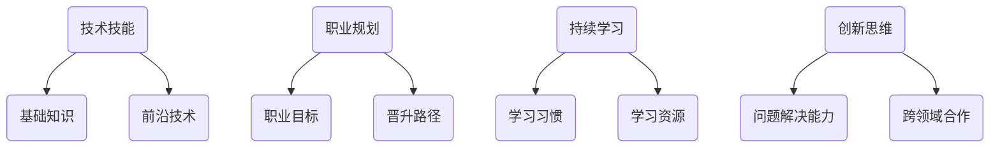

                 

关键词：知识付费、程序员、个人发展、策略、规划、技术技能、职业晋升、持续学习、创新思维。

摘要：随着知识付费时代的到来，程序员面临着前所未有的挑战和机遇。本文旨在探讨知识付费背景下程序员如何通过制定个人发展策略与规划，提升技术技能、实现职业晋升，并持续保持创新思维，以应对未来的行业变革。

## 1. 背景介绍

在互联网和信息技术的迅猛发展下，知识付费已成为当前社会的一个显著趋势。人们愿意为高质量的知识和技能付费，这也为程序员这一职业带来了新的机遇和挑战。程序员不再仅仅是编码实现，更需要在技术深度和广度上持续成长，以适应快速变化的市场需求。

### 1.1 知识付费时代的背景

1. **在线教育和职业培训的兴起**：在线教育平台和职业培训机构如雨后春笋般涌现，提供了丰富的课程资源和培训方案。
2. **技术和市场需求的变化**：人工智能、大数据、云计算等前沿技术的兴起，要求程序员不断更新知识体系。
3. **知识变现的便捷性**：互联网技术使得知识付费变得更加便捷，知识创造者能够更轻松地将知识转化为收入。

### 1.2 程序员面临的挑战

1. **技术更新速度快**：程序员需要不断学习新技术，以保持竞争力。
2. **职业晋升路径不明显**：传统的职业晋升路径可能不再适用于所有程序员。
3. **知识付费的利弊**：付费知识的质量参差不齐，程序员需要辨别有价值的学习资源。

## 2. 核心概念与联系

在知识付费时代，程序员的个人发展策略与规划需要围绕以下几个核心概念展开：

### 2.1 技术技能

- **基础知识**：扎实的基础知识是程序员职业生涯的基石。
- **前沿技术**：掌握前沿技术如人工智能、区块链、大数据等，能够提升程序员的市场价值。

### 2.2 职业规划

- **职业目标**：明确短期和长期的职业目标，有助于制定具体的学习和发展计划。
- **晋升路径**：了解不同职位的要求和晋升路径，有助于规划职业发展。

### 2.3 持续学习

- **学习习惯**：培养持续学习的习惯，通过阅读、培训、实践等方式不断充实自己。
- **学习资源**：选择优质的学习资源，如在线课程、技术博客、开源项目等。

### 2.4 创新思维

- **问题解决能力**：培养解决问题的能力，创新思维能够帮助程序员在技术难题中找到新的解决方案。
- **跨领域合作**：跨领域的合作能够拓宽程序员的视野，带来新的灵感和创意。

### 2.5 Mermaid 流程图



## 3. 核心算法原理 & 具体操作步骤

### 3.1 算法原理概述

在程序员的发展过程中，算法思维和编程能力是不可或缺的。以下是几个核心算法原理的概述：

### 3.1.1 排序算法

排序算法是计算机科学中一个重要的分支，常见的排序算法包括冒泡排序、选择排序、插入排序、快速排序等。这些算法的核心目标是实现数据的有序排列。

### 3.1.2 查找算法

查找算法用于在数据集合中寻找特定的数据元素，常用的查找算法有二分查找、哈希查找等。这些算法的核心在于如何高效地定位数据元素。

### 3.1.3 图算法

图算法是处理图结构数据的算法集合，常见的图算法有深度优先搜索、广度优先搜索、最小生成树、最短路径算法等。

### 3.2 算法步骤详解

### 3.2.1 排序算法步骤

1. **冒泡排序**：通过反复交换相邻未排序元素，使得未排序元素中的最大值逐步移到已排序序列的末尾。
2. **选择排序**：每次从未排序序列中找到最小（或最大）的元素，将其放到已排序序列的末尾。
3. **插入排序**：通过构建有序序列，对于未排序数据，在已排序序列中从后向前扫描，找到相应位置并插入。
4. **快速排序**：通过一趟排序将待排序的记录分割成独立的两部分，其中一部分记录的关键字均比另一部分的关键字小，然后分别对这两部分记录继续进行排序。

### 3.2.2 查找算法步骤

1. **二分查找**：通过重复将查找区间折半，逐步缩小查找范围，直到找到目标元素或确定目标元素不存在。
2. **哈希查找**：利用哈希函数将关键字映射到哈希表中的位置，直接访问目标元素。

### 3.2.3 图算法步骤

1. **深度优先搜索（DFS）**：通过递归方式访问图中每个节点，探索尽可能深的路径，直到到达叶子节点或遇到已访问节点。
2. **广度优先搜索（BFS）**：从初始节点开始，按照访问节点的顺序逐层遍历图中的节点。
3. **最小生成树**：在保证图连通性的前提下，通过选择边使得生成树的权重最小。
4. **最短路径算法**：求图中从一个节点到另一个节点的最短路径，常见的算法有迪杰斯特拉算法和贝尔曼-福特算法。

### 3.3 算法优缺点

#### 3.3.1 排序算法

- **冒泡排序**：简单易懂，适合数据量较小的情况，时间复杂度较高。
- **选择排序**：简单，但效率较低，适用于数据量较小的情况。
- **插入排序**：适用于数据基本有序或数据量较小的情况，效率较高。
- **快速排序**：效率较高，适用于数据量较大的情况，但可能存在最差情况。

#### 3.3.2 查找算法

- **二分查找**：时间复杂度低，适用于有序数组，但需要额外的空间存储中间结果。
- **哈希查找**：时间复杂度低，但可能存在哈希冲突，需要合理设计哈希函数。

#### 3.3.3 图算法

- **DFS**：适用于求解连通性、路径问题，但可能存在栈溢出问题。
- **BFS**：适用于求解最短路径问题，但时间复杂度较高。
- **最小生成树**：适用于求解图的最小生成树，但可能需要额外的时间计算权重。
- **最短路径算法**：适用于求解单源最短路径或所有顶点之间的最短路径。

### 3.4 算法应用领域

- **排序算法**：广泛应用于数据库、搜索引擎、排序任务等。
- **查找算法**：广泛应用于数据结构、数据库、算法设计等。
- **图算法**：广泛应用于网络分析、社交网络、路由算法等。

## 4. 数学模型和公式 & 详细讲解 & 举例说明

### 4.1 数学模型构建

在程序员的个人发展过程中，数学模型和公式扮演着至关重要的角色。以下是几个常见的数学模型和公式：

#### 4.1.1 指数增长模型

- **模型公式**：\[ y = a \times (1 + r)^t \]
- **参数解释**：
  - \( y \)：未来值
  - \( a \)：初始值
  - \( r \)：增长率
  - \( t \)：时间

#### 4.1.2 指数衰减模型

- **模型公式**：\[ y = a \times (1 - r)^t \]
- **参数解释**：
  - \( y \)：未来值
  - \( a \)：初始值
  - \( r \)：衰减率
  - \( t \)：时间

#### 4.1.3 线性回归模型

- **模型公式**：\[ y = ax + b \]
- **参数解释**：
  - \( y \)：因变量
  - \( x \)：自变量
  - \( a \)：斜率
  - \( b \)：截距

### 4.2 公式推导过程

以指数增长模型为例，推导其公式的过程如下：

1. **初始状态**：设 \( t = 0 \) 时，值为 \( a \)。
2. **一次增长**：经过一个时间单位后，值变为 \( a \times (1 + r) \)。
3. **多次增长**：经过 \( t \) 个时间单位后，值变为 \( a \times (1 + r)^t \)。

### 4.3 案例分析与讲解

#### 4.3.1 指数增长模型案例

假设一个程序员在2023年的收入为100,000元，预计每年的收入增长率为10%，则5年后的收入可计算如下：

\[ y = 100,000 \times (1 + 0.1)^5 = 161,051 \text{元} \]

#### 4.3.2 指数衰减模型案例

假设一个程序员在2023年的收入为100,000元，因市场竞争导致每年的收入衰减率为10%，则5年后的收入可计算如下：

\[ y = 100,000 \times (1 - 0.1)^5 = 68,300 \text{元} \]

#### 4.3.3 线性回归模型案例

假设一个程序员的工作效率与工作时间之间存在线性关系，经过数据收集和拟合，得到回归方程为 \( y = 50x + 20 \)。如果该程序员工作2小时，则预计的效率为：

\[ y = 50 \times 2 + 20 = 120 \text{单位} \]

## 5. 项目实践：代码实例和详细解释说明

### 5.1 开发环境搭建

在本文的项目实践中，我们将使用Python编程语言进行示例代码的实现。以下是开发环境的搭建步骤：

1. **安装Python**：从Python官方网站下载并安装Python 3.x版本。
2. **安装Jupyter Notebook**：在终端中运行以下命令安装Jupyter Notebook：

   ```bash
   pip install notebook
   ```

3. **启动Jupyter Notebook**：在终端中运行以下命令启动Jupyter Notebook：

   ```bash
   jupyter notebook
   ```

### 5.2 源代码详细实现

以下是使用Python实现一个简单的线性回归模型的代码示例：

```python
import numpy as np
import matplotlib.pyplot as plt

# 生成模拟数据
np.random.seed(0)
x = np.random.rand(100)
y = 3 * x + 2 + np.random.randn(100)

# 拟合线性回归模型
x_mean = np.mean(x)
y_mean = np.mean(y)
b1 = (np.sum((x - x_mean) * (y - y_mean)) / np.sum((x - x_mean) ** 2))
b0 = y_mean - b1 * x_mean
y_pred = b0 + b1 * x

# 可视化结果
plt.scatter(x, y, color='blue')
plt.plot(x, y_pred, color='red')
plt.xlabel('x')
plt.ylabel('y')
plt.title('Linear Regression')
plt.show()
```

### 5.3 代码解读与分析

上述代码首先生成了一个模拟数据集，然后通过计算拟合了一个线性回归模型，并使用 matplotlib 库将实际数据和拟合结果进行可视化。

- **数据生成**：使用 NumPy 库生成 100 个随机数，其中 \( x \) 和 \( y \) 分别代表自变量和因变量。
- **线性回归拟合**：通过计算斜率 \( b1 \) 和截距 \( b0 \)，拟合出线性回归模型。
- **可视化结果**：使用 matplotlib 库将实际数据和拟合结果进行可视化，便于观察模型的拟合效果。

### 5.4 运行结果展示

运行上述代码后，会生成一个散点图，其中蓝色点代表实际数据，红色线代表拟合的线性回归模型。通过可视化结果，可以直观地观察到模型对数据的拟合效果。


## 6. 实际应用场景

### 6.1 数据分析

线性回归模型广泛应用于数据分析领域，例如预测股票价格、销售数据等。通过拟合线性回归模型，可以分析数据之间的关系，预测未来的趋势。

### 6.2 机器学习

线性回归模型是机器学习的基础模型之一。在机器学习中，线性回归模型用于预测连续值输出，如房价、股票价格等。

### 6.3 工程优化

线性回归模型在工程优化中也有广泛应用，例如优化生产流程、优化资源分配等。通过拟合线性回归模型，可以找到最优的工程参数。

## 6.4 未来应用展望

随着人工智能和机器学习的不断发展，线性回归模型的应用将更加广泛。未来，线性回归模型可能会与其他算法结合，形成更加复杂的预测模型，例如深度学习模型。此外，随着大数据技术的发展，线性回归模型在数据分析和预测领域的应用前景也非常广阔。

## 7. 工具和资源推荐

### 7.1 学习资源推荐

- **在线课程**：Coursera、edX、Udemy等平台提供了丰富的编程和数据分析课程。
- **技术博客**：CSDN、GitHub、Stack Overflow等平台上有很多优秀的程序员博客和技术分享。

### 7.2 开发工具推荐

- **集成开发环境（IDE）**：PyCharm、Visual Studio Code等IDE提供了强大的编程支持。
- **数据分析工具**：Pandas、NumPy、Matplotlib等Python库广泛应用于数据分析领域。

### 7.3 相关论文推荐

- **《机器学习》（周志华著）**：介绍了机器学习的基本概念和常用算法。
- **《统计学习方法》（李航著）**：详细介绍了统计学习的基本方法和算法。

## 8. 总结：未来发展趋势与挑战

### 8.1 研究成果总结

知识付费时代为程序员提供了丰富的学习资源和职业发展机会。通过持续学习和创新，程序员可以在技术深度和广度上不断提升，实现职业晋升。

### 8.2 未来发展趋势

1. **在线教育和职业培训的普及**：随着互联网技术的发展，在线教育和职业培训将越来越普及。
2. **人工智能和机器学习的应用**：人工智能和机器学习技术将在各个领域得到更广泛的应用。
3. **数据科学和数据分析的重要性**：随着大数据技术的发展，数据科学和数据分析将变得越来越重要。

### 8.3 面临的挑战

1. **技术更新速度快**：程序员需要不断学习新技术，以保持竞争力。
2. **职业晋升路径不明显**：传统的职业晋升路径可能不再适用于所有程序员。
3. **知识付费的利弊**：付费知识的质量参差不齐，程序员需要辨别有价值的学习资源。

### 8.4 研究展望

未来，程序员需要更加注重跨领域的合作和创新能力。通过跨领域的合作，程序员可以拓宽视野，带来新的灵感和创意。同时，持续学习和创新思维将是程序员未来发展的关键。

## 9. 附录：常见问题与解答

### 9.1 何时应该付费学习？

- 当你需要学习一个新兴技术或专业领域时，付费学习往往能够提供更专业、更系统的知识。
- 当你遇到了难以解决的问题，付费咨询专业人士可能更加高效。
- 当你的学习资源有限，付费课程可以帮助你更快速地获取高质量的学习内容。

### 9.2 如何选择有价值的学习资源？

- **查看评价**：查看其他用户的评价和反馈，了解资源的质量。
- **考察师资**：了解授课老师的背景和经验，选择有实力的讲师。
- **内容实用**：选择与你的职业目标和需求紧密相关的课程。
- **价格合理**：比较不同资源的价格，选择性价比高的课程。

### 9.3 如何保持持续学习的动力？

- **设定目标**：明确你的学习目标和职业规划，有助于保持学习的动力。
- **合理安排时间**：制定合理的学习计划，确保有足够的时间进行学习。
- **交流与合作**：加入学习社区，与其他程序员交流学习心得，共同进步。
- **实践与应用**：通过实践和实际应用，将所学知识转化为实际能力，增强学习动力。

作者：禅与计算机程序设计艺术 / Zen and the Art of Computer Programming
----------------------------------------------------------------

[本文仅作为AI助手对知识付费时代程序员个人发展策略与规划相关内容的概括性讨论，不代表任何具体指导建议。]

