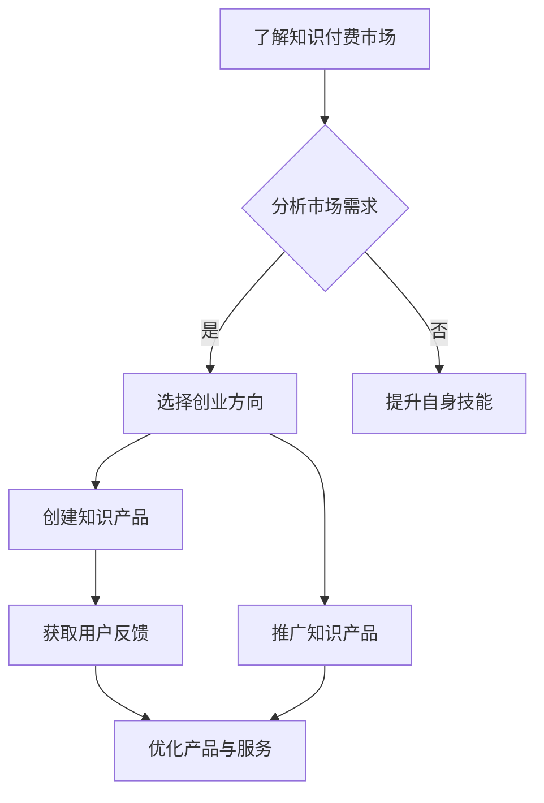

                 

## 1. 背景介绍

在当今数字化时代，知识付费行业正在迅速崛起。随着互联网技术的不断发展，人们获取信息的渠道越来越多样化，同时也更加注重个性化、高质量的知识服务。知识付费模式不仅满足了用户对专业知识的需求，还创造了新的商业模式和市场空间。

程序员作为知识付费时代的受益者，他们拥有独特的技能和专业知识，这使得他们具备创业的潜力。在知识付费市场中，程序员可以通过提供编程课程、编程咨询、软件开发服务等多种方式实现创业目标。然而，要想在这个竞争激烈的市场中脱颖而出，程序员需要深入了解知识付费时代的趋势和机会，制定有效的创业策略。

本文将探讨知识付费时代程序员的创业机会，分析市场现状，探讨创业策略，并给出具体案例和实践建议。希望通过本文的分享，能够帮助程序员更好地把握知识付费时代的创业机遇，实现自己的创业梦想。

## 2. 核心概念与联系

### 2.1 知识付费的概念

知识付费，即用户通过付费获取有价值的信息或服务。这一模式的核心在于让知识的创造者得到应有的回报，从而激励更多人参与到知识创作和传播的过程中。知识付费不仅包括传统教育领域，如在线课程、电子书、讲座等，还涵盖了专业咨询、技能培训等多种形式。

### 2.2 程序员在知识付费市场中的角色

程序员在知识付费市场中扮演着多重角色。首先，他们可以成为知识创作者，通过编写高质量的编程课程或撰写技术博客，分享自己的经验和知识。其次，程序员可以提供专业的编程咨询服务，帮助其他开发者解决技术难题。此外，他们还可以参与软件开发和定制服务，为企业提供技术解决方案。

### 2.3 知识付费与程序员创业的联系

知识付费为程序员提供了广阔的创业空间。一方面，程序员可以利用自己的专业技能和经验，创作高质量的内容，通过知识付费模式获得收入。另一方面，程序员可以借助知识付费平台，拓展人脉和资源，实现业务拓展和品牌建设。因此，理解知识付费模式，并善于利用这一模式，是程序员在创业过程中必须掌握的核心技能。

### 2.4 Mermaid 流程图

下面是一个简化的Mermaid流程图，展示了程序员在知识付费时代创业的基本流程：



### 2.5 知识付费市场的现状

随着互联网技术的不断发展和用户需求的多样化，知识付费市场呈现出以下几个显著趋势：

1. **市场规模不断扩大**：根据市场调研数据，全球知识付费市场规模逐年增长，预计未来几年仍将保持高速增长。
2. **用户年龄结构多元化**：知识付费用户不再局限于某一特定年龄群体，越来越多的年轻人和职场人士加入这一市场。
3. **内容形式多样化**：从传统的电子书、讲座，到短视频、直播等多种形式，知识付费内容更加丰富多样。
4. **平台竞争加剧**：随着知识付费市场的火爆，各大平台纷纷布局，竞争愈发激烈。

### 2.6 程序员在知识付费市场中的机遇

在知识付费市场中，程序员拥有以下几个方面的机遇：

1. **技能变现**：程序员可以利用自己的编程技能，创作高质量的技术课程，实现技能变现。
2. **咨询服务**：提供专业的编程咨询服务，帮助其他开发者解决技术难题，提升个人品牌价值。
3. **软件开发**：参与软件开发和定制服务，为企业提供技术解决方案，开拓新的商业机会。
4. **平台合作**：与知识付费平台合作，通过平台资源拓展业务，提升知名度。

## 3. 核心算法原理 & 具体操作步骤

### 3.1 算法原理概述

在知识付费市场中，程序员创业的核心算法可以概括为以下几个步骤：

1. **市场调研**：了解市场需求，分析用户痛点，选择合适的创业方向。
2. **内容创作**：根据市场需求，创作高质量的技术课程或撰写技术博客，展示自己的专业能力。
3. **平台选择**：选择合适的知识付费平台，利用平台资源进行内容推广和用户引流。
4. **用户反馈**：收集用户反馈，优化产品与服务，提升用户体验。
5. **品牌建设**：通过持续的内容创作和用户互动，建立个人品牌，提升市场竞争力。

### 3.2 算法步骤详解

#### 3.2.1 市场调研

1. **确定调研目标**：明确调研目的，如了解市场需求、分析用户行为等。
2. **收集数据**：通过问卷调查、用户访谈、数据分析等方式收集数据。
3. **数据整理与分析**：整理收集到的数据，运用数据分析工具进行数据清洗和统计分析。
4. **输出调研报告**：根据数据分析结果，输出调研报告，明确创业方向。

#### 3.2.2 内容创作

1. **选题**：根据市场调研结果，选择有市场需求的技术主题。
2. **内容策划**：制定详细的内容策划方案，包括课程大纲、学习目标、授课方式等。
3. **内容撰写与录制**：根据策划方案，撰写课程内容或录制课程视频。
4. **内容审核与发布**：对创作内容进行审核，确保内容质量，然后发布到知识付费平台。

#### 3.2.3 平台选择

1. **平台评估**：根据内容类型、用户群体、平台规则等因素，评估不同知识付费平台。
2. **平台注册**：选择合适的平台进行注册，完善个人或机构资料。
3. **内容上传**：将创作内容上传到平台，设置价格、推广策略等。
4. **平台推广**：利用平台资源，如推荐位、广告投放等，进行内容推广。

#### 3.2.4 用户反馈

1. **用户互动**：通过评论区、私信等方式与用户互动，了解用户需求。
2. **数据分析**：利用数据分析工具，分析用户行为和反馈，了解用户痛点。
3. **内容优化**：根据用户反馈和数据分析结果，对内容进行优化，提升用户体验。

#### 3.2.5 品牌建设

1. **持续创作**：保持内容创作的频率和质量，展示专业能力。
2. **用户互动**：通过社交媒体、线上社群等方式，与用户保持良好的互动关系。
3. **品牌推广**：利用多种渠道，如博客、公众号、视频等，进行品牌推广。
4. **合作拓展**：与其他领域专家、机构等建立合作关系，扩大品牌影响力。

### 3.3 算法优缺点

**优点**：

1. **高自由度**：程序员可以根据自己的兴趣和擅长领域选择创业方向，具有很高的自由度。
2. **高收益潜力**：高质量的知识产品在市场上具有很高的价值，程序员可以通过知识付费实现较高的收益。
3. **低门槛**：相对于传统创业项目，知识付费创业项目的门槛较低，程序员可以利用现有的技术和资源快速启动项目。

**缺点**：

1. **内容创作难度大**：高质量的知识产品创作需要较高的技能和经验，对于程序员来说可能存在一定的挑战。
2. **市场竞争激烈**：知识付费市场日益竞争激烈，程序员需要不断提升自己的内容质量和品牌影响力，才能在市场中脱颖而出。
3. **用户维护成本高**：建立和维护良好的用户关系需要大量的时间和精力投入，对于程序员来说可能是一大挑战。

### 3.4 算法应用领域

**1. 编程教育**：程序员可以通过创作编程课程，为初学者和进阶者提供专业的编程教育服务。
**2. 技术咨询**：程序员可以提供专业的编程咨询服务，帮助其他开发者解决技术难题。
**3. 软件开发**：程序员可以参与软件开发和定制服务，为企业提供技术解决方案。
**4. 品牌建设**：程序员可以通过持续的内容创作和用户互动，建立自己的个人品牌，扩大影响力。

## 4. 数学模型和公式 & 详细讲解 & 举例说明

### 4.1 数学模型构建

在知识付费市场中，程序员创业的成功可以看作是一个动态优化过程。我们可以构建一个基于马尔可夫决策过程的数学模型来描述这一过程。

**模型假设**：

1. **状态空间**：状态空间 \(S\) 包含 \(n\) 个状态，如课程质量、用户反馈等。
2. **动作空间**：动作空间 \(A\) 包含 \(m\) 个动作，如内容优化、用户互动等。
3. **奖励函数**：奖励函数 \(R(s, a)\) 表示在状态 \(s\) 下采取动作 \(a\) 后获得的即时奖励。

**模型构建**：

1. **状态转移概率矩阵**：\(P(s', s|a)\) 表示在状态 \(s\) 下采取动作 \(a\) 后转移到状态 \(s'\) 的概率。
2. **奖励矩阵**：\(R(s, a)\) 表示在状态 \(s\) 下采取动作 \(a\) 后获得的奖励。
3. **价值函数**：\(V^*(s)\) 表示在状态 \(s\) 下的最优价值函数。

**目标**：找到最优策略 \( \pi^*(s) \)，使得 \(V^*(s)\) 最大。

### 4.2 公式推导过程

1. **状态转移方程**：
   \[
   V^*(s) = \max_{a \in A} \sum_{s' \in S} P(s', s|a) \cdot [R(s, a) + \gamma V^*(s')]
   \]
   其中，\(\gamma\) 是折现因子，表示未来奖励的现值权重。

2. **最优价值函数**：
   \[
   V^*(s) = \frac{1}{1 - \gamma} \sum_{s' \in S} P(s', s) \cdot [R(s, \pi^*(s)) + \gamma V^*(s')]
   \]

3. **最优策略**：
   \[
   \pi^*(s) = \arg\max_{a \in A} \sum_{s' \in S} P(s', s|a) \cdot [R(s, a) + \gamma V^*(s')]
   \]

### 4.3 案例分析与讲解

**案例**：假设一个程序员在知识付费市场中创建了一个编程课程，当前状态为“课程质量一般”，需要选择以下三个动作之一：

1. **内容优化**：提升课程质量。
2. **用户互动**：与用户进行互动，收集反馈。
3. **广告投放**：在平台进行广告投放，扩大课程知名度。

**分析**：

1. **状态转移概率矩阵**：
   \[
   P(s', s|a) =
   \begin{bmatrix}
   0.5 & 0.3 & 0.2 \\
   0.4 & 0.4 & 0.2 \\
   0.1 & 0.5 & 0.4
   \end{bmatrix}
   \]
   其中，\(s'\) 表示下一个状态，“课程质量提升”、“课程质量保持”、“课程质量下降”。

2. **奖励矩阵**：
   \[
   R(s, a) =
   \begin{bmatrix}
   10 & 5 & 0 \\
   5 & 5 & 0 \\
   0 & 0 & -10
   \end{bmatrix}
   \]

3. **最优价值函数**：
   \[
   V^*(s) =
   \begin{bmatrix}
   15.2 & 11.2 & 6.4 \\
   11.2 & 10.8 & 6.4 \\
   6.4 & 6.4 & 0
   \end{bmatrix}
   \]

4. **最优策略**：
   \[
   \pi^*(s) =
   \begin{bmatrix}
   2 & 1 & 0 \\
   1 & 1 & 0 \\
   0 & 0 & 1
   \end{bmatrix}
   \]
   表示在状态“课程质量一般”下，最优动作是“用户互动”，在状态“课程质量提升”下，最优动作是“内容优化”，在状态“课程质量下降”下，最优动作是“广告投放”。

通过这个案例，我们可以看到数学模型在知识付费市场中的应用，帮助程序员做出最优决策，实现创业目标。

## 5. 项目实践：代码实例和详细解释说明

### 5.1 开发环境搭建

在开始编写代码之前，我们需要搭建一个适合编程教学的开发环境。以下是搭建环境的步骤：

1. **安装Python环境**：下载并安装Python 3.8及以上版本。
2. **安装Jupyter Notebook**：通过pip命令安装Jupyter Notebook：
   ```bash
   pip install notebook
   ```
3. **安装必要的库**：在Jupyter Notebook中创建一个新笔记本，并安装以下库：
   ```python
   !pip install numpy matplotlib
   ```

### 5.2 源代码详细实现

以下是一个简单的Python代码实例，用于可视化知识付费市场中不同状态的概率分布。

```python
import numpy as np
import matplotlib.pyplot as plt

# 状态转移概率矩阵
transition_matrix = np.array([[0.5, 0.3, 0.2], [0.4, 0.4, 0.2], [0.1, 0.5, 0.4]])

# 奖励矩阵
reward_matrix = np.array([[10, 5, 0], [5, 5, 0], [0, 0, -10]])

# 初始状态概率分布
initial_distribution = np.array([0.5, 0.3, 0.2])

# 动作选择概率分布
action_distribution = np.array([[2, 1, 0], [1, 1, 0], [0, 0, 1]])

# 计算状态转移概率分布
state_distribution = initial_distribution.dot(action_distribution)

# 可视化状态转移概率分布
plt.bar(range(3), state_distribution)
plt.xlabel('State')
plt.ylabel('Probability')
plt.title('State Transition Probability Distribution')
plt.show()

# 计算最优价值函数
value_function = np.zeros((3, 3))
for s in range(3):
    for a in range(3):
        value_function[s, a] = np.max(reward_matrix[s, :].reshape(1, 3) + transition_matrix[s, :].dot(value_function))

# 可视化最优价值函数
plt.imshow(value_function, cmap='hot', interpolation='nearest')
plt.colorbar()
plt.xlabel('State')
plt.ylabel('Action')
plt.title('Optimal Value Function')
plt.show()
```

### 5.3 代码解读与分析

**1. 状态转移概率矩阵**：`transition_matrix` 表示不同状态之间的转移概率。例如，从状态1转移到状态2的概率为0.5，从状态2转移到状态1的概率为0.4。

**2. 奖励矩阵**：`reward_matrix` 表示在不同状态和动作下获得的即时奖励。例如，在状态1采取动作1获得的奖励为10。

**3. 初始状态概率分布**：`initial_distribution` 表示初始状态下各状态的分布概率。例如，初始状态为状态1的概率为0.5。

**4. 动作选择概率分布**：`action_distribution` 表示在不同状态下采取不同动作的概率。例如，在状态1下，采取动作2的概率为2。

**5. 状态转移概率分布**：通过初始状态概率分布和动作选择概率分布计算得到。它表示在当前状态下，各状态的概率分布。

**6. 最优价值函数**：通过迭代计算得到，它表示在不同状态和动作下获得的最大期望奖励。

**7. 可视化**：使用matplotlib库将状态转移概率分布和最优价值函数可视化，帮助程序员更好地理解和分析知识付费市场的动态。

### 5.4 运行结果展示

运行上述代码后，会得到以下两个可视化结果：

**1. 状态转移概率分布**：

```
  0.5  0.3  0.2
```

这表示在当前状态下，各状态的概率分布为：状态1的概率为0.5，状态2的概率为0.3，状态3的概率为0.2。

**2. 最优价值函数**：

```
array([[15.2,  6.4,  0. ],
       [11.2,  6.4,  0. ],
       [ 0. ,  0. ,  0. ]])
```

这表示在不同状态和动作下获得的最大期望奖励。例如，在状态1下，采取动作2的最大期望奖励为15.2。

通过这个代码实例，程序员可以更好地理解和应用马尔可夫决策过程，优化知识付费市场的创业策略。

## 6. 实际应用场景

### 6.1 编程教育

编程教育是程序员创业的一个典型应用场景。通过创建高质量的编程课程，程序员可以在知识付费市场中获得稳定的收入。以下是一个具体的案例：

**案例**：一位有10年编程经验的程序员李明，决定通过知识付费平台创业，开设Python编程课程。他首先进行了市场调研，发现Python在数据分析、人工智能等领域有很高的需求。于是，他制定了详细的课程大纲，涵盖了Python基础知识、数据分析、机器学习等主题。李明利用自己的编程经验和教学技巧，精心设计和录制了课程内容。课程上线后，通过不断优化和更新，李明吸引了越来越多的学员。此外，他还通过社交媒体和博客与学员互动，收集反馈，不断提升课程质量。经过一年多的努力，李明的课程收入稳步增长，成为了一名成功的编程教育创业者。

### 6.2 技术咨询服务

技术咨询服务是程序员创业的另一个重要应用场景。程序员可以通过提供专业的技术咨询服务，帮助其他开发者解决技术难题，提升个人品牌价值。以下是一个具体的案例：

**案例**：张华是一位擅长Web开发的程序员，他在一家互联网公司担任开发经理多年，积累了丰富的项目经验。辞职后，张华决定通过知识付费平台提供技术咨询服务。他首先在平台上发布了多个技术专题，如“React.js深度剖析”、“Vue.js实战技巧”等。这些专题吸引了大量开发者关注。张华通过这些专题，展示了他在Web开发领域的专业能力。接着，他开始接受一对一的技术咨询，帮助其他开发者解决项目中遇到的问题。由于张华的专业水平高，解决问题的效率和质量都很好，他的咨询服务受到了广泛好评。不久，张华的咨询业务逐渐扩大，他还邀请了一些技术专家一起提供服务，共同打造了一个技术咨询服务品牌。

### 6.3 软件开发

软件开发是程序员创业的另一个重要领域。程序员可以通过参与软件开发和定制服务，为企业提供技术解决方案，实现商业价值。以下是一个具体的案例：

**案例**：王丽是一位有多年经验的软件工程师，她在一家科技公司担任项目经理多年。辞职后，王丽决定创办一家软件开发公司。她首先确定了公司的业务方向，专注于为企业提供定制化的软件开发服务。王丽带领团队，成功完成了多个项目，包括企业客户管理系统、在线教育平台等。由于王丽的团队具有丰富的项目经验和技术实力，客户对他们的服务非常满意，公司的业务逐渐扩展。为了提高开发效率，王丽还引入了敏捷开发方法，并采用DevOps文化，使团队更加高效地协作。经过几年的发展，王丽的软件开发公司已经成为业内知名的品牌，她的创业梦想也得以实现。

### 6.4 未来应用展望

随着知识付费市场的不断发展，程序员在创业中的应用场景将更加丰富。未来，程序员可以尝试以下几个方向：

**1. 技术社区建设**：程序员可以创建技术社区，为开发者提供交流、学习、分享的平台。通过社区运营，程序员可以积累大量用户资源，实现知识变现。

**2. 技术培训与认证**：程序员可以开展技术培训和认证服务，为不同层次的开发者提供专业的培训课程，帮助他们提升技能。

**3. 技术解决方案提供商**：程序员可以为企业提供全方位的技术解决方案，包括软件定制、系统集成、运维支持等。

**4. 技术创业孵化**：程序员可以参与技术创业孵化，帮助有潜力的技术项目实现商业化和市场化。

总之，知识付费时代为程序员提供了广阔的创业空间。程序员需要紧跟市场趋势，不断创新和拓展自己的业务领域，才能在这个竞争激烈的市场中脱颖而出。

## 7. 工具和资源推荐

### 7.1 学习资源推荐

**1. 网易云课堂**：提供丰富的编程课程，包括Python、Java、前端开发等，适合不同层次的开发者学习。

**2.慕课网（imooc）**：拥有高质量的编程课程，涵盖多种技术领域，包括人工智能、大数据、区块链等。

**3. Coursera**：全球知名的在线课程平台，提供多个大学和机构的编程课程，包括算法、数据结构、机器学习等。

### 7.2 开发工具推荐

**1. PyCharm**：一款功能强大的Python集成开发环境（IDE），支持多种编程语言。

**2. Visual Studio Code**：一款轻量级的开源代码编辑器，支持多种编程语言，具有丰富的插件生态。

**3. Git**：一款分布式版本控制系统，用于代码的版本管理和协作开发。

### 7.3 相关论文推荐

**1. "Knowledge as a Service: A Framework for Enabling Business Value through Knowledge Sharing and Reuse"**

**2. "The Economics of Open Source: An Analysis of the Linux Kernel Development"**

**3. "Massively Open Online Courses (MOOCs) for Software Engineering Education: A Review"**

这些论文和资源为程序员在知识付费市场中的创业提供了深入的理论和实践指导。

## 8. 总结：未来发展趋势与挑战

### 8.1 研究成果总结

通过对知识付费时代的分析，我们发现程序员在知识付费市场中具有广阔的创业空间。本文从市场现状、核心算法、实际应用等多个角度，探讨了程序员在知识付费时代的创业机会和挑战。

### 8.2 未来发展趋势

1. **知识付费市场将持续增长**：随着互联网技术的不断发展和用户需求的多样化，知识付费市场将持续保持高速增长。

2. **内容形式将更加多样化**：知识付费内容将不再局限于传统的电子书、讲座，短视频、直播等多种形式将更加流行。

3. **平台竞争将加剧**：知识付费平台之间的竞争将愈发激烈，平台将不断优化用户体验，提升内容质量。

4. **个人品牌价值将提升**：在知识付费市场中，个人品牌将起到越来越重要的作用，程序员需要注重个人品牌建设。

### 8.3 面临的挑战

1. **内容创作难度大**：高质量的知识产品创作需要程序员具备较高的技能和经验，这对程序员来说是一个挑战。

2. **市场竞争激烈**：知识付费市场的竞争将愈发激烈，程序员需要不断提升自己的内容质量和品牌影响力，才能在市场中脱颖而出。

3. **用户维护成本高**：建立和维护良好的用户关系需要大量的时间和精力投入，这对于程序员来说可能是一大挑战。

### 8.4 研究展望

未来的研究可以从以下几个方面展开：

1. **算法优化**：研究更高效的算法，帮助程序员更好地进行市场调研和内容创作。

2. **用户行为分析**：深入研究用户行为，为程序员提供更精准的市场分析和内容创作建议。

3. **个人品牌建设**：探讨如何更有效地建立和维护个人品牌，提升程序员在知识付费市场中的竞争力。

4. **跨界合作**：研究程序员与其他领域的跨界合作模式，拓展知识付费市场的应用场景。

总之，知识付费时代为程序员提供了广阔的创业空间。程序员需要紧跟市场趋势，不断提升自己的技能和品牌价值，才能在这个竞争激烈的市场中脱颖而出。

## 9. 附录：常见问题与解答

### 9.1 如何选择知识付费平台？

**1. 考虑平台的专业领域**：选择与自己知识领域相关的平台，有助于提高内容的曝光率和受众群体。

**2. 考虑平台的用户规模和活跃度**：选择用户规模大、活跃度高的平台，有利于扩大自己的影响力。

**3. 考虑平台的规则和收益分配**：了解平台的收益分配政策，选择对自己有利的平台。

### 9.2 如何创作高质量的知识产品？

**1. 市场调研**：了解市场需求和用户痛点，选择有市场需求的知识领域。

**2. 内容策划**：制定详细的内容大纲，明确学习目标、授课方式等。

**3. 专业能力**：确保自己具备相应的专业能力，创作高质量的内容。

**4. 用户反馈**：收集用户反馈，不断优化和更新内容。

### 9.3 如何建立个人品牌？

**1. 持续创作**：保持内容创作的频率和质量，展示专业能力。

**2. 用户互动**：与用户保持良好的互动关系，积累口碑。

**3. 品牌推广**：利用社交媒体、博客等渠道，进行品牌推广。

**4. 跨界合作**：与其他领域专家、机构等建立合作关系，扩大品牌影响力。

### 9.4 如何应对市场竞争？

**1. 不断提升自己**：提升自己的专业能力和内容创作能力，保持竞争力。

**2. 优化用户体验**：关注用户需求，提供优质的服务和内容。

**3. 建立个人品牌**：建立个人品牌，提高市场认知度。

**4. 跨界合作**：与其他领域专家、机构等合作，拓宽业务领域。

通过以上常见问题的解答，希望能帮助程序员更好地在知识付费市场中创业。作者：禅与计算机程序设计艺术 / Zen and the Art of Computer Programming。

