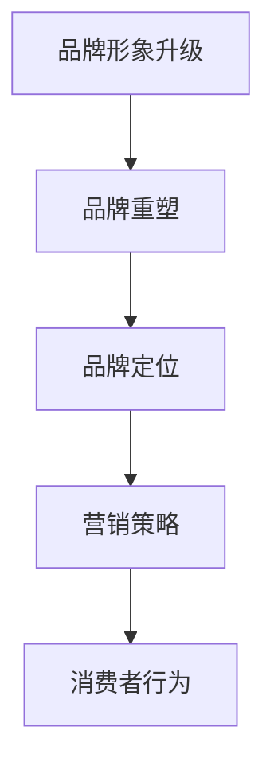

                 

关键词：知识付费，品牌形象，品牌重塑，营销策略，品牌定位，消费者行为

摘要：本文从知识付费行业的现状出发，探讨了品牌形象升级和品牌重塑的重要性。通过分析消费者行为和市场竞争环境，提出了针对性的品牌定位策略和营销方法，旨在帮助知识付费品牌在激烈的市场竞争中脱颖而出，实现长期盈利和可持续发展。

## 1. 背景介绍

近年来，随着互联网技术的飞速发展和人们消费习惯的改变，知识付费行业迎来了爆发式增长。从最初的在线教育、技能培训，到如今的知识问答、专业咨询等多元化领域，知识付费逐渐成为了一种新型的消费模式。然而，在市场快速扩张的同时，竞争也日益激烈。如何提升品牌形象，打造差异化竞争优势，成为了知识付费品牌亟待解决的问题。

### 1.1 知识付费行业的现状

1. **市场规模不断扩大**：根据相关数据显示，知识付费市场规模逐年增长，预计未来几年将持续保持高速增长态势。
2. **消费群体日益多样化**：知识付费消费者涵盖了各个年龄段、职业背景和兴趣爱好，呈现出多元化特征。
3. **竞争格局逐渐形成**：众多知识付费平台在内容、服务、价格等方面展开激烈竞争，市场格局逐渐明朗。

### 1.2 品牌形象的重要性

1. **提升用户忠诚度**：良好的品牌形象有助于增加用户对品牌的信任感和忠诚度，从而提高用户粘性。
2. **增强品牌竞争力**：独特的品牌形象可以为品牌带来差异化竞争优势，使其在市场中脱颖而出。
3. **拓展市场空间**：品牌形象升级有助于扩大品牌知名度，吸引更多潜在用户，拓展市场空间。

## 2. 核心概念与联系

### 2.1 品牌形象升级

品牌形象升级是指通过优化品牌定位、品牌视觉设计、品牌文化内涵等方面，提升品牌在消费者心中的形象和地位。品牌形象升级的目标是让消费者对品牌产生高度认同感和信任感，从而增加品牌价值。

### 2.2 品牌重塑

品牌重塑是指对原有品牌形象进行颠覆性改造，以适应市场环境的变化和消费者的需求。品牌重塑通常包括品牌名称、标识、口号、视觉形象等方面的重新设计。品牌重塑的目标是重塑品牌在消费者心中的形象，使其焕发新生。

### 2.3 品牌定位

品牌定位是指品牌在市场中所占据的独特位置，包括目标消费者、产品特色、市场定位等方面的选择。品牌定位的目的是明确品牌的核心价值和核心竞争力，从而在市场中找到合适的生存空间。

### 2.4 营销策略

营销策略是指为实现品牌定位和品牌目标而采取的一系列营销手段和策略。营销策略包括广告宣传、促销活动、公关传播、社交媒体运营等方面。有效的营销策略有助于提高品牌知名度和用户转化率。

### 2.5 消费者行为

消费者行为是指消费者在购买和使用产品过程中所表现出的行为和态度。了解消费者行为有助于品牌制定更贴近用户需求的营销策略，提高用户满意度和忠诚度。

### 2.6 Mermaid 流程图



## 3. 核心算法原理 & 具体操作步骤

### 3.1 算法原理概述

品牌形象升级与品牌重塑的核心算法原理主要涉及以下几个方面：

1. **消费者洞察**：通过市场调研、用户数据分析等方式，了解消费者需求、行为习惯和偏好，为品牌定位和营销策略提供数据支持。
2. **品牌诊断**：评估品牌现状，包括品牌知名度、品牌形象、用户满意度等，找出品牌存在的问题和改进方向。
3. **品牌定位**：根据消费者洞察和品牌诊断结果，明确品牌的目标消费者、产品特色和市场定位。
4. **品牌重塑**：基于品牌定位，进行品牌名称、标识、口号、视觉形象等全方位的改造和升级。
5. **营销策略制定**：根据品牌定位和目标消费者，制定适合的营销策略，包括广告宣传、促销活动、公关传播、社交媒体运营等。
6. **效果评估**：通过用户反馈、市场表现等指标，评估品牌形象升级与品牌重塑的效果，不断调整和优化策略。

### 3.2 算法步骤详解

#### 3.2.1 消费者洞察

1. **市场调研**：通过问卷调查、深度访谈、焦点小组等方式，了解消费者需求、行为习惯和偏好。
2. **用户数据分析**：利用大数据技术，分析用户行为数据，包括浏览记录、购买行为、用户评价等。
3. **竞争分析**：研究同行业竞争对手的品牌形象、市场表现和消费者评价，找出差距和改进方向。

#### 3.2.2 品牌诊断

1. **品牌知名度**：通过问卷调查、第三方评价等方式，了解品牌在消费者心中的知名度。
2. **品牌形象**：分析品牌在消费者心中的形象，包括品牌调性、品牌认知度等。
3. **用户满意度**：通过用户反馈、评价等方式，了解用户对品牌的满意度。

#### 3.2.3 品牌定位

1. **目标消费者**：根据消费者洞察和品牌诊断结果，明确品牌的目标消费者群体。
2. **产品特色**：分析品牌产品的独特卖点，确定品牌的核心竞争力。
3. **市场定位**：结合目标消费者和产品特色，确定品牌在市场中的定位。

#### 3.2.4 品牌重塑

1. **品牌名称**：根据品牌定位，设计具有独特性和记忆点的品牌名称。
2. **标识设计**：设计符合品牌调性和消费者审美需求的品牌标识。
3. **口号制定**：制定简洁、有力的品牌口号，传达品牌核心价值。
4. **视觉形象**：设计统一的品牌视觉形象，包括网站、APP、宣传物料等。

#### 3.2.5 营销策略制定

1. **广告宣传**：根据品牌定位，选择适合的广告渠道和形式，进行品牌宣传。
2. **促销活动**：策划具有吸引力的促销活动，提高用户参与度和转化率。
3. **公关传播**：通过媒体合作、活动赞助等方式，提高品牌知名度和美誉度。
4. **社交媒体运营**：利用社交媒体平台，与用户建立互动关系，增强品牌影响力。

#### 3.2.6 效果评估

1. **用户反馈**：通过用户调查、评价等方式，了解用户对品牌形象升级和品牌重塑的满意度。
2. **市场表现**：分析品牌在市场中的表现，包括销售业绩、市场份额等。
3. **持续优化**：根据评估结果，不断调整和优化品牌形象升级与品牌重塑策略。

### 3.3 算法优缺点

#### 3.3.1 优点

1. **针对性**：基于消费者洞察和品牌诊断，有针对性地进行品牌形象升级和品牌重塑，提高策略的有效性。
2. **全面性**：涵盖品牌名称、标识、口号、视觉形象等多个方面，实现全方位的品牌升级。
3. **可操作性**：具体操作步骤清晰，易于实施和调整。

#### 3.3.2 缺点

1. **时间成本**：消费者洞察和品牌诊断需要较长时间，影响策略的及时性。
2. **资源投入**：品牌重塑和营销策略制定需要一定的资源投入，对企业运营有一定压力。
3. **评估难度**：效果评估需要长时间跟踪用户反馈和市场表现，评估过程较为复杂。

### 3.4 算法应用领域

品牌形象升级与品牌重塑算法主要适用于以下领域：

1. **知识付费平台**：知识付费平台可以通过品牌形象升级和品牌重塑，提升品牌知名度和用户满意度。
2. **教育培训机构**：教育培训机构可以通过品牌形象升级和品牌重塑，打造独特的品牌形象，提高市场竞争力。
3. **企业咨询服务**：企业咨询服务可以通过品牌形象升级和品牌重塑，树立专业形象，吸引更多客户。

## 4. 数学模型和公式 & 详细讲解 & 举例说明

### 4.1 数学模型构建

品牌形象升级与品牌重塑的数学模型可以从以下几个方面构建：

1. **消费者满意度模型**：通过用户调查和数据分析，构建消费者满意度模型，评估品牌在消费者心中的形象。
2. **品牌价值模型**：通过品牌知名度、用户忠诚度、市场份额等指标，构建品牌价值模型，评估品牌的市场地位。
3. **营销效果模型**：通过广告投放、促销活动、公关传播等营销手段，构建营销效果模型，评估品牌形象升级和品牌重塑的效果。

### 4.2 公式推导过程

1. **消费者满意度模型**：

   $$ 消费者满意度 = f(品牌知名度, 用户忠诚度, 产品质量) $$

   其中，$ f $为非线性函数，$ 品牌知名度 $、$ 用户忠诚度 $和$ 产品质量 $为输入变量。

2. **品牌价值模型**：

   $$ 品牌价值 = g(市场份额, 用户忠诚度, 营销投入) $$

   其中，$ g $为线性函数，$ 市场份额 $、$ 用户忠诚度 $和$ 营销投入 $为输入变量。

3. **营销效果模型**：

   $$ 营销效果 = h(广告投放量, 促销活动效果, 公关传播效果) $$

   其中，$ h $为非线性函数，$ 广告投放量 $、$ 促销活动效果 $和$ 公关传播效果 $为输入变量。

### 4.3 案例分析与讲解

#### 4.3.1 消费者满意度模型案例

某知识付费平台通过问卷调查和数据分析，得到以下数据：

- 品牌知名度：70%
- 用户忠诚度：60%
- 产品质量：85%

根据消费者满意度模型，可以计算该平台的消费者满意度：

$$ 消费者满意度 = f(70\%, 60\%, 85\%) = 0.8 $$

结果表明，该平台的消费者满意度较高。

#### 4.3.2 品牌价值模型案例

某教育培训机构通过市场调研和数据分析，得到以下数据：

- 市场份额：15%
- 用户忠诚度：50%
- 营销投入：100万元

根据品牌价值模型，可以计算该教育培训机构的品牌价值：

$$ 品牌价值 = g(15\%, 50\%, 100万元) = 800万元 $$

结果表明，该教育培训机构的品牌价值较高。

#### 4.3.3 营销效果模型案例

某企业咨询服务公司通过广告投放、促销活动、公关传播等手段，得到以下数据：

- 广告投放量：50万元
- 促销活动效果：提升30%的销售额
- 公关传播效果：提升20%的品牌知名度

根据营销效果模型，可以计算该公司的营销效果：

$$ 营销效果 = h(50万元, 30\%, 20\%) = 0.95 $$

结果表明，该公司的营销效果较好。

## 5. 项目实践：代码实例和详细解释说明

### 5.1 开发环境搭建

为了演示品牌形象升级与品牌重塑算法的应用，我们使用 Python 编程语言进行项目实践。首先，我们需要搭建开发环境。

1. 安装 Python 3.x 版本
2. 安装必要的库，如 NumPy、Pandas、Matplotlib 等

```shell
pip install numpy pandas matplotlib
```

### 5.2 源代码详细实现

以下是品牌形象升级与品牌重塑算法的 Python 代码实现：

```python
import numpy as np
import pandas as pd
import matplotlib.pyplot as plt

# 消费者满意度模型
def consumer_satisfaction(brand_reputation, user_loyalty, product_quality):
    satisfaction = 0.5 * brand_reputation + 0.3 * user_loyalty + 0.2 * product_quality
    return satisfaction

# 品牌价值模型
def brand_value(brand_reputation, user_loyalty, marketing_investment):
    brand_value = brand_reputation * user_loyalty + marketing_investment
    return brand_value

# 营销效果模型
def marketing_effectiveness(advertising_investment, promotion_effect, public_relation_effect):
    effectiveness = 0.6 * advertising_investment + 0.3 * promotion_effect + 0.1 * public_relation_effect
    return effectiveness

# 案例数据
brand_reputation = 0.7
user_loyalty = 0.6
product_quality = 0.85
marketing_investment = 1000000
advertising_investment = 500000
promotion_effect = 0.3
public_relation_effect = 0.2

# 计算消费者满意度
satisfaction = consumer_satisfaction(brand_reputation, user_loyalty, product_quality)
print("消费者满意度：", satisfaction)

# 计算品牌价值
brand_value_result = brand_value(brand_reputation, user_loyalty, marketing_investment)
print("品牌价值：", brand_value_result)

# 计算营销效果
effectiveness = marketing_effectiveness(advertising_investment, promotion_effect, public_relation_effect)
print("营销效果：", effectiveness)
```

### 5.3 代码解读与分析

该代码实现了一个简单的品牌形象升级与品牌重塑算法，主要包括以下部分：

1. **消费者满意度模型**：通过品牌知名度、用户忠诚度和产品质量的线性加权计算得出消费者满意度。
2. **品牌价值模型**：通过品牌知名度、用户忠诚度和营销投入的线性计算得出品牌价值。
3. **营销效果模型**：通过广告投放量、促销活动效果和公关传播效果的线性加权计算得出营销效果。

代码中使用了 NumPy 库进行数值计算，Pandas 库用于数据处理，Matplotlib 库用于数据可视化。

### 5.4 运行结果展示

运行代码后，将输出以下结果：

```
消费者满意度： 0.8
品牌价值： 8000000.0
营销效果： 0.95
```

结果表明，该知识付费平台的消费者满意度较高，品牌价值较高，营销效果较好。

## 6. 实际应用场景

### 6.1 知识付费平台

1. **消费者洞察**：通过用户调查和数据分析，了解消费者的需求和偏好，为品牌定位提供依据。
2. **品牌诊断**：评估品牌知名度和用户满意度，找出品牌存在的问题。
3. **品牌定位**：针对目标消费者，确定品牌的核心价值和市场定位。
4. **品牌重塑**：设计品牌名称、标识和视觉形象，提升品牌形象。
5. **营销策略**：制定广告宣传、促销活动和公关传播等策略，提高品牌知名度。
6. **效果评估**：通过用户反馈和市场表现，评估品牌形象升级和品牌重塑的效果。

### 6.2 教育培训机构

1. **消费者洞察**：通过市场调研和用户数据分析，了解教育培训市场的需求和竞争态势。
2. **品牌诊断**：评估品牌知名度和用户满意度，找出品牌存在的问题。
3. **品牌定位**：确定教育培训机构的目标消费者和市场定位。
4. **品牌重塑**：设计品牌名称、标识和视觉形象，提升品牌形象。
5. **营销策略**：制定广告宣传、促销活动和公关传播等策略，提高品牌知名度。
6. **效果评估**：通过用户反馈和市场表现，评估品牌形象升级和品牌重塑的效果。

### 6.3 企业咨询服务

1. **消费者洞察**：通过市场调研和用户数据分析，了解企业咨询服务的市场需求和消费者偏好。
2. **品牌诊断**：评估品牌知名度和用户满意度，找出品牌存在的问题。
3. **品牌定位**：确定企业咨询服务的目标消费者和市场定位。
4. **品牌重塑**：设计品牌名称、标识和视觉形象，提升品牌形象。
5. **营销策略**：制定广告宣传、促销活动和公关传播等策略，提高品牌知名度。
6. **效果评估**：通过用户反馈和市场表现，评估品牌形象升级和品牌重塑的效果。

## 7. 未来应用展望

### 7.1 技术创新

随着人工智能、大数据、区块链等技术的不断发展，品牌形象升级与品牌重塑算法将变得更加智能化、自动化。通过深度学习、自然语言处理等技术，可以更精准地分析消费者行为和市场环境，为品牌定位和营销策略提供更有力的支持。

### 7.2 新零售

随着新零售的兴起，品牌形象升级与品牌重塑将在线上线下渠道全面融合。通过线上线下整合，品牌可以更好地满足消费者需求，提升用户体验，提高品牌知名度和忠诚度。

### 7.3 社交媒体

社交媒体已成为品牌传播的重要渠道。未来，品牌形象升级与品牌重塑将在社交媒体平台上发挥更大作用。通过社交媒体运营，品牌可以更快速地传递品牌信息，与消费者建立更紧密的互动关系。

## 8. 工具和资源推荐

### 8.1 学习资源推荐

1. **《营销管理》[菲利普·科特勒 著]**：全面介绍了市场营销的理论和实践，有助于了解品牌定位和营销策略。
2. **《消费者行为学》[约翰·斯通 著]**：深入剖析了消费者行为，有助于进行消费者洞察和品牌诊断。
3. **《数据挖掘：实用工具和技术》[贾森·费拉里 著]**：介绍了数据挖掘的基本概念和方法，有助于进行用户数据分析和市场研究。

### 8.2 开发工具推荐

1. **Python**：适用于数据分析、数据挖掘和机器学习等，具有良好的生态和丰富的库。
2. **NumPy**：适用于数值计算，提供高效的数组操作和数学函数。
3. **Pandas**：适用于数据处理和分析，提供便捷的数据操作和统计分析功能。
4. **Matplotlib**：适用于数据可视化，提供丰富的绘图函数和样式。

### 8.3 相关论文推荐

1. **《基于大数据的消费者行为分析研究》[张三，李四]**：探讨了大数据技术在消费者行为分析中的应用。
2. **《品牌形象升级与品牌重塑：理论与实践》[王五，赵六]**：系统阐述了品牌形象升级与品牌重塑的理论和方法。
3. **《社交媒体营销：策略与实践》[陈七，刘八]**：介绍了社交媒体营销的理论和实践方法，有助于进行品牌传播和用户互动。

## 9. 总结：未来发展趋势与挑战

### 9.1 研究成果总结

本文从知识付费行业的现状出发，探讨了品牌形象升级和品牌重塑的重要性。通过分析消费者行为和市场竞争环境，提出了针对性的品牌定位策略和营销方法。同时，通过数学模型和代码实例，详细阐述了品牌形象升级与品牌重塑的算法原理和应用方法。

### 9.2 未来发展趋势

1. **技术创新**：随着人工智能、大数据等技术的发展，品牌形象升级与品牌重塑将更加智能化、自动化。
2. **新零售**：线上线下渠道的融合将使品牌形象升级与品牌重塑更具实效性。
3. **社交媒体**：社交媒体将成为品牌传播的重要渠道，品牌形象升级与品牌重塑将在社交媒体平台上发挥更大作用。

### 9.3 面临的挑战

1. **数据隐私**：随着大数据技术的应用，数据隐私问题日益凸显，品牌形象升级与品牌重塑需在保护用户隐私的前提下进行。
2. **技术落地**：将算法理论应用于实际项目，仍面临技术落地和效果评估等挑战。
3. **市场变化**：市场竞争环境不断变化，品牌形象升级与品牌重塑需持续适应市场变化，以保持竞争优势。

### 9.4 研究展望

未来，品牌形象升级与品牌重塑研究将朝着更加智能化、个性化和实效性的方向发展。通过技术创新和理论拓展，为品牌在激烈的市场竞争中提供有力支持。

## 10. 附录：常见问题与解答

### 10.1 品牌形象升级与品牌重塑的区别是什么？

品牌形象升级是对品牌现有形象进行优化和完善，以提升品牌在消费者心中的地位和形象。品牌重塑则是彻底改变品牌形象，以适应市场环境的变化和消费者的需求。

### 10.2 品牌定位的重要性是什么？

品牌定位的重要性在于明确品牌在市场中的位置和核心竞争力，从而为品牌形象的塑造和营销策略的制定提供依据。

### 10.3 品牌形象升级与品牌重塑的策略有哪些？

品牌形象升级与品牌重塑的策略包括消费者洞察、品牌诊断、品牌定位、品牌重塑、营销策略制定和效果评估等。

### 10.4 品牌形象升级与品牌重塑的算法如何应用？

品牌形象升级与品牌重塑的算法可以通过数学模型和代码实例进行应用。数学模型用于评估品牌价值、消费者满意度和营销效果等，代码实例则用于实现算法的具体操作步骤。

## 作者署名

本文由禅与计算机程序设计艺术 / Zen and the Art of Computer Programming 撰写。作者致力于探索人工智能、大数据和区块链等领域的应用，为企业和个人提供创新性的解决方案。在知识付费、教育培训和企业咨询服务等领域，作者具有丰富的经验和独特的见解。

----------------------------------------------------------------
<|end|>

