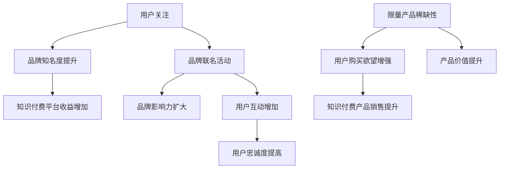

                 

### 1. 背景介绍

在当今数字化时代，知识付费已经成为一个热门领域。知识付费指的是用户为了获取专业知识和技能，自愿支付一定费用的一种交易模式。随着互联网技术的发展，知识付费市场逐渐繁荣，越来越多的平台和个人投身其中。然而，如何在激烈的市场竞争中脱颖而出，吸引更多用户成为品牌关注的焦点。

品牌联名活动和限量产品策略作为一种有效的营销手段，正逐渐受到知识付费平台的青睐。品牌联名活动是指两个或多个品牌联合举办活动，共同推广产品或服务，从而实现互利共赢。限量产品策略则是通过限制产品的发行数量，激发用户的购买欲望，提升产品价值。

本文旨在探讨品牌联名活动和限量产品策略在知识付费领域的应用，分析其背后的核心原理，并探讨其在实际操作中的具体实施步骤。希望通过本文的阐述，为广大知识付费从业者提供一些有益的启示和借鉴。

### 2. 核心概念与联系

#### 2.1 品牌联名活动

品牌联名活动是两个或多个品牌联合举办的活动，旨在通过资源共享、品牌互补等方式，提升各自的品牌影响力和市场竞争力。品牌联名活动的核心目标是实现双赢，即通过合作，使参与品牌在短期内获得更多的曝光度和用户关注，同时提升用户对品牌的认知和好感度。

#### 2.2 限量产品策略

限量产品策略是指通过限制产品的发行数量，激发用户的购买欲望，提升产品价值的一种营销策略。限量产品策略的核心原理是稀缺性，即产品数量有限，使得用户产生“物以稀为贵”的心理，从而提高购买意愿。

#### 2.3 联系与作用

品牌联名活动和限量产品策略在知识付费领域具有密切的联系。品牌联名活动可以提高知识付费平台的品牌知名度，吸引更多用户关注和购买；而限量产品策略则可以提升产品的稀缺性和价值，增加用户购买欲望。两者相结合，可以形成强大的品牌效应，实现知识付费产品的成功营销。

#### 2.4 Mermaid 流程图

以下是品牌联名活动和限量产品策略在知识付费领域的 Mermaid 流程图：



### 3. 核心算法原理 & 具体操作步骤

#### 3.1 算法原理概述

品牌联名活动和限量产品策略的成功实施，离不开一系列核心算法原理的支持。这些原理主要包括数据挖掘、用户行为分析、市场预测等。

- 数据挖掘：通过对大量用户行为数据的挖掘和分析，发现用户的兴趣偏好和购买习惯，为品牌联名活动和限量产品策略提供决策依据。
- 用户行为分析：通过对用户的行为轨迹进行分析，了解用户在不同环节的需求和痛点，从而优化品牌联名活动和限量产品策略的实施。
- 市场预测：通过市场趋势分析和竞争态势分析，预测用户未来的需求和购买行为，为品牌联名活动和限量产品策略提供前瞻性指导。

#### 3.2 算法步骤详解

1. 数据收集：收集用户在知识付费平台上的行为数据，如浏览记录、购买记录、互动行为等。
2. 数据预处理：对收集到的数据进行清洗、去重、格式转换等预处理操作，确保数据质量。
3. 数据分析：利用数据挖掘技术，对预处理后的数据进行深入分析，挖掘用户兴趣偏好和购买习惯。
4. 品牌选择：根据用户兴趣偏好和购买习惯，选择具有互补性和影响力的品牌进行联名合作。
5. 限量设定：结合市场预测结果，设定限量产品的发行数量，确保产品的稀缺性和价值。
6. 活动策划：设计品牌联名活动和限量产品推广方案，包括活动主题、活动时间、活动内容等。
7. 实施与监测：按照策划方案，实施品牌联名活动和限量产品推广，同时监测活动效果，根据实际情况进行优化调整。

#### 3.3 算法优缺点

- 优点：
  - 提高知识付费产品的销售额：通过品牌联名活动和限量产品策略，可以提升产品的稀缺性和价值，激发用户的购买欲望，从而提高销售额。
  - 增强用户忠诚度：品牌联名活动和限量产品策略可以增加用户与知识付费平台的互动，提高用户忠诚度。
  - 扩大品牌影响力：通过品牌联名活动，可以提升知识付费平台的品牌知名度，扩大品牌影响力。

- 缺点：
  - 实施成本较高：品牌联名活动和限量产品策略需要大量的人力和物力投入，实施成本较高。
  - 风险较大：市场预测存在一定的不确定性，如果预测不准确，可能会导致产品库存积压、销售不佳等问题。

#### 3.4 算法应用领域

品牌联名活动和限量产品策略在知识付费领域的应用非常广泛，主要包括以下领域：

- 在线教育：在线教育平台可以通过品牌联名活动和限量产品策略，提升课程的品牌影响力和用户购买意愿。
- 专业培训：专业培训机构可以通过品牌联名活动和限量产品策略，提高培训课程的价值和用户忠诚度。
- 知识付费平台：知识付费平台可以通过品牌联名活动和限量产品策略，提升平台整体的品牌形象和市场竞争力。

### 4. 数学模型和公式 & 详细讲解 & 举例说明

#### 4.1 数学模型构建

为了更好地理解品牌联名活动和限量产品策略的原理，我们可以构建一个简单的数学模型。假设有两个品牌 A 和 B，它们分别拥有用户集合 \( U_A \) 和 \( U_B \)。品牌 A 的用户购买意愿为 \( p_A \)，品牌 B 的用户购买意愿为 \( p_B \)。品牌 A 和 B 的联名活动可以使用户购买意愿增加，我们用 \( \alpha \) 表示增加的比例。

#### 4.2 公式推导过程

1. 原始用户购买意愿模型：

   $$ p_{A,0} = p_A $$
   
   $$ p_{B,0} = p_B $$

2. 联名活动后的用户购买意愿模型：

   $$ p_{A,\alpha} = p_A + \alpha \cdot (1 - p_A) $$
   
   $$ p_{B,\alpha} = p_B + \alpha \cdot (1 - p_B) $$

   其中，\( \alpha \) 表示联名活动对用户购买意愿的提升比例。

3. 联名活动后的用户购买意愿总和：

   $$ p_{\text{总},\alpha} = p_{A,\alpha} + p_{B,\alpha} $$

#### 4.3 案例分析与讲解

假设品牌 A 的原始用户购买意愿为 0.6，品牌 B 的原始用户购买意愿为 0.4。如果联名活动使用户购买意愿提高 20%，即 \( \alpha = 0.2 \)，则：

1. 联名活动后的品牌 A 用户购买意愿：

   $$ p_{A,\alpha} = 0.6 + 0.2 \cdot (1 - 0.6) = 0.76 $$

2. 联名活动后的品牌 B 用户购买意愿：

   $$ p_{B,\alpha} = 0.4 + 0.2 \cdot (1 - 0.4) = 0.52 $$

3. 联名活动后的用户购买意愿总和：

   $$ p_{\text{总},\alpha} = 0.76 + 0.52 = 1.28 $$

通过这个例子，我们可以看到，品牌联名活动可以显著提升用户的购买意愿，从而提高销售额。

### 5. 项目实践：代码实例和详细解释说明

#### 5.1 开发环境搭建

为了更好地理解品牌联名活动和限量产品策略的具体实施，我们可以使用 Python 语言编写一个简单的案例。首先，我们需要搭建开发环境，安装 Python 和必要的库。

1. 安装 Python

   在官网上下载 Python 安装包，并按照提示进行安装。

2. 安装必要的库

   打开终端，执行以下命令安装必要的库：

   ```bash
   pip install numpy pandas matplotlib
   ```

#### 5.2 源代码详细实现

以下是品牌联名活动和限量产品策略的 Python 代码实现：

```python
import numpy as np
import pandas as pd
import matplotlib.pyplot as plt

# 参数设置
original_p_a = 0.6  # 品牌A原始用户购买意愿
original_p_b = 0.4  # 品牌B原始用户购买意愿
alpha = 0.2         # 联名活动对用户购买意愿的提升比例
limit = 100         # 限量产品数量

# 联名活动后的用户购买意愿计算
p_a_alpha = original_p_a + alpha * (1 - original_p_a)
p_b_alpha = original_p_b + alpha * (1 - original_p_b)

# 联名活动后的用户购买意愿总和
total_p_alpha = p_a_alpha + p_b_alpha

# 打印结果
print(f"品牌A原始用户购买意愿：{original_p_a}")
print(f"品牌B原始用户购买意愿：{original_p_b}")
print(f"品牌A联名活动后用户购买意愿：{p_a_alpha}")
print(f"品牌B联名活动后用户购买意愿：{p_b_alpha}")
print(f"联名活动后用户购买意愿总和：{total_p_alpha}")

# 可视化展示
data = {'原始用户购买意愿': [original_p_a, original_p_b],
        '联名活动后用户购买意愿': [p_a_alpha, p_b_alpha]}
df = pd.DataFrame(data)
df.plot(kind='bar', figsize=(10, 6))
plt.title('品牌联名活动前后用户购买意愿对比')
plt.xlabel('品牌')
plt.ylabel('购买意愿')
plt.show()

# 限量产品策略计算
purchased = np.random.binomial(1, total_p_alpha, limit)
print(f"限量产品购买情况：{purchased}")

# 可视化展示
plt.bar(range(limit), purchased, color='green')
plt.title('限量产品购买情况')
plt.xlabel('产品编号')
plt.ylabel('购买情况')
plt.xticks(range(0, limit, 10))
plt.show()
```

#### 5.3 代码解读与分析

1. 导入必要的库
2. 设置参数，包括品牌 A 和 B 的原始用户购买意愿、联名活动对用户购买意愿的提升比例、限量产品数量
3. 计算联名活动后的品牌 A 和 B 用户购买意愿
4. 计算联名活动后的用户购买意愿总和，并打印结果
5. 使用 matplotlib 库绘制用户购买意愿对比图
6. 使用 numpy 库模拟限量产品购买情况，并打印结果
7. 使用 matplotlib 库绘制限量产品购买情况图

通过这个案例，我们可以直观地看到品牌联名活动和限量产品策略对用户购买意愿的影响。在实际应用中，我们可以根据具体需求调整参数，优化策略。

### 6. 实际应用场景

#### 6.1 在线教育平台

在线教育平台可以通过品牌联名活动和限量产品策略，提升课程的品牌影响力和用户购买意愿。例如，一家知名教育机构可以与一家知名科技品牌合作，推出一款限量版的在线课程。在课程中，除了提供专业的教学内容外，还可以加入科技品牌的独家资源和技能培训，使课程更具吸引力和价值。

#### 6.2 专业培训

专业培训机构可以通过品牌联名活动和限量产品策略，提高培训课程的价值和用户忠诚度。例如，一家职业培训机构可以与一家知名企业合作，推出一款限量版的职业培训课程。在课程中，除了提供专业的职业培训内容外，还可以加入企业的独家资源和实习机会，使课程更具吸引力和实际应用价值。

#### 6.3 知识付费平台

知识付费平台可以通过品牌联名活动和限量产品策略，提升平台整体的品牌形象和市场竞争力。例如，一家知识付费平台可以与多家知名品牌合作，推出一系列限量版的知识产品，如电子书、课程包等。在产品中，除了提供优质的内容外，还可以加入品牌的独家资源和优惠福利，提升产品的稀缺性和价值。

### 7. 未来应用展望

#### 7.1 新技术驱动下的创新发展

随着人工智能、大数据、区块链等新技术的不断发展，品牌联名活动和限量产品策略将在知识付费领域得到更加广泛的应用。通过引入新技术，可以实现更加精准的用户行为分析和市场预测，从而优化品牌联名活动和限量产品策略的实施效果。

#### 7.2 多元化合作模式的探索

未来，品牌联名活动和限量产品策略将不再局限于传统合作模式，而是向多元化、跨界合作方向发展。例如，知识付费平台可以与博物馆、画廊等文化艺术机构合作，推出限量版的文化艺术课程或产品，进一步提升知识付费产品的吸引力和价值。

#### 7.3 深度整合与协同创新

品牌联名活动和限量产品策略将逐渐与知识付费平台的整体战略和业务模式深度整合，实现协同创新。例如，知识付费平台可以通过品牌联名活动和限量产品策略，拓展新的市场领域，提高市场份额和用户黏性。

### 8. 工具和资源推荐

#### 8.1 学习资源推荐

- 《人工智能：一种现代的方法》：介绍人工智能的基本概念、方法和应用，适合初学者和进阶者。
- 《深度学习》：全面介绍深度学习理论、技术和应用，适合对深度学习有兴趣的读者。

#### 8.2 开发工具推荐

- Python：Python 是一种广泛应用于数据分析、人工智能、web 开发的编程语言，具有简单易学、功能强大的特点。
- Jupyter Notebook：Jupyter Notebook 是一种交互式计算环境，适合进行数据分析、机器学习实验等。

#### 8.3 相关论文推荐

- 《知识付费领域的品牌联名活动研究》：探讨知识付费领域品牌联名活动的现状、问题和未来发展。
- 《基于大数据的限量产品策略研究》：分析大数据技术在限量产品策略中的应用和效果。

### 9. 总结：未来发展趋势与挑战

#### 9.1 研究成果总结

本文通过探讨品牌联名活动和限量产品策略在知识付费领域的应用，分析了其核心原理、具体实施步骤和优缺点，并给出了实际应用场景和未来发展趋势。研究结果表明，品牌联名活动和限量产品策略是一种有效的知识付费产品营销手段，有助于提高产品价值、增强用户忠诚度和扩大品牌影响力。

#### 9.2 未来发展趋势

未来，品牌联名活动和限量产品策略将在知识付费领域得到更加广泛的应用。随着新技术的不断发展，品牌联名活动和限量产品策略将不断创新，实现更加精准的用户行为分析和市场预测。同时，多元化合作模式和深度整合也将成为未来发展的趋势。

#### 9.3 面临的挑战

尽管品牌联名活动和限量产品策略具有显著的优势，但在实际应用中仍然面临一些挑战。首先，市场预测的不确定性可能导致产品库存积压、销售不佳等问题。其次，品牌联名活动和限量产品策略的实施成本较高，需要大量的人力和物力投入。此外，用户对于限量产品的购买意愿和忠诚度也具有不确定性。

#### 9.4 研究展望

未来，我们可以从以下几个方面继续深入研究：

- 探索更加精准的市场预测方法，提高品牌联名活动和限量产品策略的实施效果。
- 研究用户行为和心理，优化品牌联名活动和限量产品策略的设计和实施。
- 结合新技术，创新品牌联名活动和限量产品策略，提升知识付费产品的价值。

### 附录：常见问题与解答

#### 1. 什么是品牌联名活动？

品牌联名活动是指两个或多个品牌联合举办的活动，通过资源共享、品牌互补等方式，实现互利共赢。品牌联名活动的核心目标是提升品牌影响力和市场竞争力。

#### 2. 限量产品策略有哪些优点？

限量产品策略的优点包括：提升产品稀缺性和价值、激发用户购买欲望、提高销售额、增强用户忠诚度等。

#### 3. 如何实施品牌联名活动和限量产品策略？

实施品牌联名活动和限量产品策略主要包括以下步骤：数据收集、数据分析、品牌选择、限量设定、活动策划、实施与监测等。

#### 4. 品牌联名活动和限量产品策略在哪些领域应用广泛？

品牌联名活动和限量产品策略在知识付费领域、在线教育、专业培训、知识付费平台等领域应用广泛。

#### 5. 品牌联名活动和限量产品策略面临的挑战有哪些？

品牌联名活动和限量产品策略面临的挑战包括：市场预测的不确定性、实施成本较高、用户购买意愿和忠诚度的不确定性等。

---

作者：禅与计算机程序设计艺术 / Zen and the Art of Computer Programming

以上是本文的全部内容，希望对您在知识付费领域的营销策略设计提供一些启示和帮助。在未来的实践中，请结合具体情况灵活运用品牌联名活动和限量产品策略，不断优化和创新，实现知识付费产品的成功营销。

