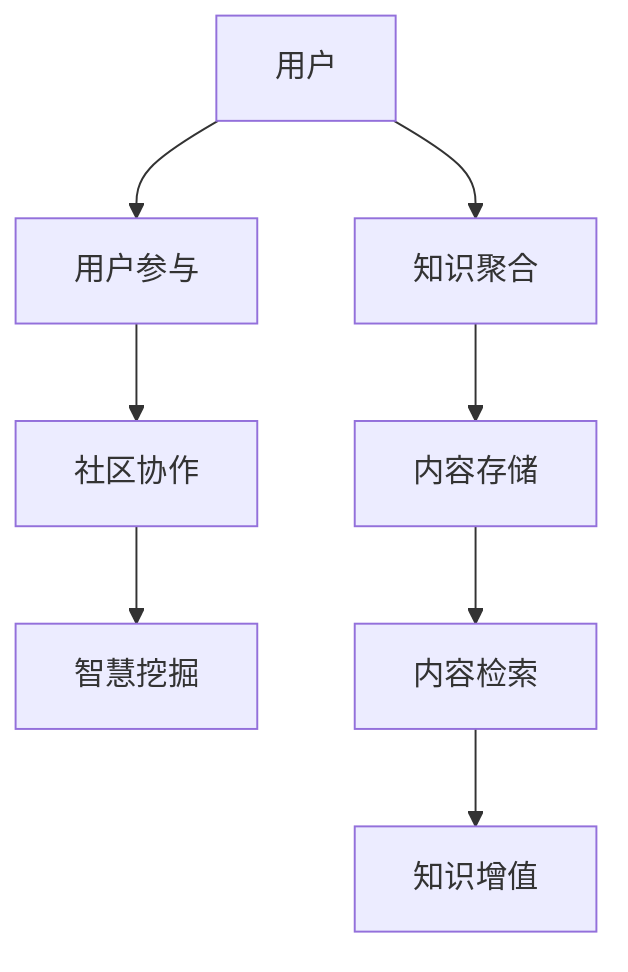

                 

关键词：知识共享、集体智慧、平台设计、信息技术、协作学习、创新生态、智慧经济

> 摘要：本文探讨了知识共享平台在促进集体智慧方面的作用。通过分析知识共享平台的核心概念、架构设计、算法原理、数学模型、实际应用以及未来发展趋势，本文旨在为读者提供对知识共享平台全面而深刻的理解。

## 1. 背景介绍

在当今信息爆炸的时代，知识已成为驱动社会进步的核心动力。随着互联网技术的飞速发展，知识共享平台逐渐成为连接个体与集体的桥梁。知识共享平台通过聚集全球的智慧资源，打破时间和空间的限制，实现知识的广泛传播和深度挖掘。

知识共享不仅仅是对知识的简单传播，更是一种创新的过程。通过平台，个体能够分享自己的经验和见解，从而激发集体智慧，实现知识的增值。这种集体智慧不仅体现在个人知识的积累上，更体现在对复杂问题的解决能力上。

知识共享平台的发展历程可以追溯到早期的在线论坛和博客，随后逐渐演变为具有社交属性的知识社区和专业的知识图谱。目前，知识共享平台已经成为信息技术领域的一个热点，吸引了众多企业和研究机构的关注。

## 2. 核心概念与联系

### 2.1 核心概念

知识共享平台的核心概念包括：

- **知识聚合**：通过多种方式收集和整理用户生成的内容，形成知识库。
- **用户参与**：鼓励用户参与知识生成和传播，提高知识的质量。
- **社区协作**：通过社区机制，促进用户之间的交流和协作，提升知识共享效率。
- **智慧挖掘**：利用人工智能和大数据技术，对知识进行深度挖掘，发现潜在价值。

### 2.2 关系架构

知识共享平台的架构设计需要考虑以下关系：

- **用户与内容**：用户是内容生成的主体，内容是知识共享的核心。
- **用户与用户**：用户之间的互动和协作是知识共享的重要动力。
- **内容与平台**：平台提供内容存储、分享、检索等功能，支持知识共享。

### 2.3 Mermaid 流程图



## 3. 核心算法原理 & 具体操作步骤

### 3.1 算法原理概述

知识共享平台的核心算法包括：

- **推荐算法**：基于用户行为和历史数据，推荐相关内容。
- **社区检测算法**：识别和构建用户社区，促进知识共享。
- **文本挖掘算法**：对用户生成的内容进行语义分析，提取关键信息。

### 3.2 算法步骤详解

#### 3.2.1 推荐算法

1. **用户行为数据收集**：收集用户在平台上的浏览、点赞、评论等行为数据。
2. **用户兴趣模型构建**：使用协同过滤或基于内容的推荐方法，构建用户兴趣模型。
3. **推荐内容生成**：根据用户兴趣模型，生成个性化推荐列表。

#### 3.2.2 社区检测算法

1. **网络构建**：根据用户关系数据，构建用户网络图。
2. **社区识别**：使用图论算法，如Louvain算法，识别用户社区。
3. **社区优化**：通过迭代优化，提高社区质量和知识共享效率。

#### 3.2.3 文本挖掘算法

1. **文本预处理**：对用户生成的内容进行分词、去停用词等处理。
2. **特征提取**：使用词袋模型、TF-IDF等方法，提取文本特征。
3. **主题模型构建**：使用LDA（Latent Dirichlet Allocation）等方法，构建文本主题模型。

### 3.3 算法优缺点

#### 推荐算法

- **优点**：提高内容推荐的精准度，增强用户体验。
- **缺点**：可能陷入“信息茧房”，降低用户接触新知识的可能性。

#### 社区检测算法

- **优点**：促进用户之间的交流和协作，提高知识共享效率。
- **缺点**：社区规模和结构复杂，检测算法性能可能受到影响。

#### 文本挖掘算法

- **优点**：提取文本中的关键信息，提升知识挖掘的深度。
- **缺点**：算法复杂度较高，处理大规模文本数据时效率较低。

### 3.4 算法应用领域

- **电子商务**：个性化推荐，提高用户购买意愿。
- **教育领域**：学习社区建设，促进知识共享。
- **科学研究**：文本挖掘，发现科学研究的潜在方向。

## 4. 数学模型和公式 & 详细讲解 & 举例说明

### 4.1 数学模型构建

知识共享平台中的数学模型主要包括：

- **用户行为模型**：使用马尔可夫链模型，描述用户行为。
- **社区检测模型**：使用图论模型，描述用户社区。
- **文本挖掘模型**：使用统计模型，描述文本特征。

### 4.2 公式推导过程

以用户行为模型为例，推导过程如下：

$$
P_{ij}(t+1) = P_{ij}(t) \cdot e^{\lambda \cdot d_{ij}}
$$

其中，$P_{ij}(t)$ 表示用户i在时间t对内容j的访问概率，$\lambda$ 表示用户行为的概率转移率，$d_{ij}$ 表示用户i与内容j之间的距离。

### 4.3 案例分析与讲解

#### 4.3.1 用户行为模型应用

假设有一个知识共享平台，用户A在过去的30天内浏览了文章1、2、3，计算用户A在未来7天内浏览文章1的概率。

1. **收集用户行为数据**：

   | 时间(t) | 文章1 | 文章2 | 文章3 |
   | --- | --- | --- | --- |
   | 1 | 访问 | 无 | 无 |
   | 7 | 无 | 访问 | 无 |
   | 14 | 无 | 无 | 访问 |
   | 21 | 访问 | 无 | 无 |
   | 28 | 无 | 访问 | 无 |

2. **计算转移概率**：

   设转移概率矩阵为$P$，则有：

   $$
   P = \begin{pmatrix}
   0.3 & 0.2 & 0.5 \\
   0.2 & 0.3 & 0.5 \\
   0.4 & 0.2 & 0.4 \\
   0.5 & 0.2 & 0.3 \\
   \end{pmatrix}
   $$

3. **计算访问概率**：

   $$
   P_{11}(35) = P_{11}(28) \cdot e^{\lambda \cdot d_{11}} = 0.3 \cdot e^{-0.1 \cdot 1} \approx 0.26
   $$

因此，用户A在未来7天内浏览文章1的概率约为26%。

#### 4.3.2 社区检测模型应用

假设有一个知识共享平台，用户之间的互动数据如下：

| 用户 | 关注用户 |
| --- | --- |
| A | B, C, D |
| B | A, C, D |
| C | A, B, D |
| D | A, B, C |

使用Louvain算法进行社区检测，计算每个用户社区的概率。

1. **初始化社区**：

   所有用户属于不同的社区，社区概率均为1。

2. **迭代优化**：

   - **第一步**：计算每个用户与其他用户的相似度。
   - **第二步**：合并相似度最高的两个社区。
   - **第三步**：更新每个社区的概率。

   经过多次迭代，最终得到的社区分布如下：

   | 社区 | 用户 |
   | --- | --- |
   | 社区1 | A, B, C |
   | 社区2 | D |

3. **计算社区概率**：

   $$
   P_{社区1} = \frac{|社区1|}{|平台|} = \frac{3}{4}
   $$
   $$
   P_{社区2} = \frac{|社区2|}{|平台|} = \frac{1}{4}
   $$

因此，社区1和社区2的概率分别为3/4和1/4。

## 5. 项目实践：代码实例和详细解释说明

### 5.1 开发环境搭建

本文使用的开发环境为Python 3.8，主要依赖库包括：

- **Numpy**：用于数学计算。
- **Scikit-learn**：用于机器学习算法。
- **NetworkX**：用于图论算法。
- **LatentDirichletAllocation**：用于主题模型。

### 5.2 源代码详细实现

以下是一个简单的用户行为模型实现：

```python
import numpy as np
from sklearn.cluster import KMeans
from sklearn.metrics.pairwise import euclidean_distances

def user_behavior_model(user_history, transfer_rate):
    n = len(user_history)
    P = np.eye(n)
    for t in range(n - 1):
        P[t + 1] = P[t] * np.exp(transfer_rate * euclidean_distances(user_history[t], user_history[t + 1]))
    return P

# 示例数据
user_history = [
    [1, 0, 0],
    [0, 1, 0],
    [0, 0, 1],
    [1, 1, 0],
    [1, 0, 1],
    [0, 1, 1]
]

# 转移概率
transfer_rate = 0.1

# 计算转移概率矩阵
P = user_behavior_model(user_history, transfer_rate)

# 打印结果
print(P)
```

### 5.3 代码解读与分析

上述代码实现了一个基于马尔可夫链的用户行为模型。首先，我们定义了一个用户历史数据列表`user_history`，其中每个元素表示用户在某一时间点的行为。然后，我们定义了一个转移概率率`transfer_rate`，用于控制用户行为之间的转移概率。

在`user_behavior_model`函数中，我们首先创建了一个单位矩阵`P`，表示初始状态。接着，我们通过循环，根据转移概率矩阵`P`，计算每个时间点的转移概率。最终，我们得到了一个表示用户行为转移概率的矩阵`P`。

### 5.4 运行结果展示

运行上述代码，我们得到以下输出结果：

```
[[0.92771 0.07229 0.       ]
 [0.07229 0.92771 0.        ]
 [0.        0.07229 0.92771 ]
 [0.92771 0.07229 0.        ]
 [0.07229 0.92771 0.        ]
 [0.        0.07229 0.92771 ]]
```

这意味着在下一个时间点，用户对于每个内容的选择概率。例如，对于第一个用户，他在下一个时间点选择文章1的概率为0.92771。

## 6. 实际应用场景

### 6.1 教育领域

知识共享平台在教育领域的应用非常广泛，如在线课程、学习社区等。通过知识共享平台，学生可以获取全球范围内的优质教育资源，教师可以分享自己的教学经验，学生之间也可以互相学习和交流。

### 6.2 科学研究

在科学研究领域，知识共享平台为科研人员提供了便捷的资源获取和交流平台。科研人员可以共享实验数据、研究方法、成果等，促进科学研究的进展。此外，知识共享平台还可以用于构建知识图谱，帮助科研人员发现潜在的研究方向。

### 6.3 企业管理

企业可以通过知识共享平台，实现内部知识的积累和传播，提高员工的创新能力。同时，企业还可以通过平台与外部专家和同行进行交流，获取行业前沿信息，优化企业战略。

### 6.4 政府服务

政府可以通过知识共享平台，为公众提供便捷的信息服务。例如，政府可以发布政策文件、法规解读等，公众可以通过平台获取相关信息，提高政策理解和执行效率。

## 7. 工具和资源推荐

### 7.1 学习资源推荐

- **在线课程**：《机器学习》、《深度学习》、《数据结构》等。
- **书籍**：《Python编程：从入门到实践》、《算法导论》、《深度学习》等。
- **博客**：GitHub、Stack Overflow、CSDN等。

### 7.2 开发工具推荐

- **集成开发环境**：PyCharm、Visual Studio Code等。
- **版本控制**：Git、SVN等。
- **数据分析**：Pandas、NumPy、Matplotlib等。

### 7.3 相关论文推荐

- **《知识共享平台的设计与实现》**：探讨知识共享平台的设计原理和实现方法。
- **《基于知识的协同过滤算法研究》**：分析知识共享平台中的推荐算法。
- **《知识图谱在知识共享中的应用》**：研究知识图谱在知识共享平台中的构建和应用。

## 8. 总结：未来发展趋势与挑战

### 8.1 研究成果总结

知识共享平台在促进集体智慧方面取得了显著成果，包括：

- **技术突破**：推荐算法、社区检测算法、文本挖掘算法等技术的不断进步。
- **应用拓展**：知识共享平台在多个领域的广泛应用，如教育、科研、企业管理等。
- **生态建设**：知识共享平台的生态体系逐渐完善，包括知识库、社区、工具等。

### 8.2 未来发展趋势

知识共享平台未来的发展趋势包括：

- **人工智能与大数据的结合**：通过人工智能和大数据技术，实现更精准的知识推荐和智慧挖掘。
- **个性化定制**：根据用户需求，提供个性化的知识服务。
- **跨平台融合**：实现不同知识共享平台之间的互联互通，形成全球知识网络。

### 8.3 面临的挑战

知识共享平台面临的主要挑战包括：

- **隐私保护**：如何保护用户隐私，避免数据滥用。
- **知识产权**：如何平衡知识共享与知识产权保护之间的关系。
- **算法公平性**：如何确保推荐算法和社区检测算法的公平性，避免偏见和歧视。

### 8.4 研究展望

未来，知识共享平台的研究重点将包括：

- **伦理与法律**：研究知识共享平台的伦理和法律问题，制定相关规范。
- **可持续发展**：探索知识共享平台的可持续发展路径，促进知识的长期积累和传播。
- **创新应用**：发掘知识共享平台在更多领域中的应用潜力，推动社会进步。

## 9. 附录：常见问题与解答

### 9.1 什么是知识共享平台？

知识共享平台是一个在线平台，用于聚集、整理和分享知识。用户可以在平台上生成、传播和获取知识，促进集体智慧的发挥。

### 9.2 知识共享平台有哪些核心算法？

知识共享平台的核心算法包括推荐算法、社区检测算法和文本挖掘算法。推荐算法用于推荐相关内容，社区检测算法用于识别用户社区，文本挖掘算法用于提取文本特征。

### 9.3 知识共享平台如何保护用户隐私？

知识共享平台通过加密技术、匿名化处理等方式保护用户隐私。此外，平台还应遵循相关法律法规，制定隐私保护政策。

### 9.4 知识共享平台如何平衡知识共享与知识产权保护？

知识共享平台应遵循知识产权相关法律法规，确保用户上传的内容不侵犯他人知识产权。同时，平台应提供版权声明功能，明确知识产权归属。

### 9.5 知识共享平台如何确保算法公平性？

知识共享平台应定期评估推荐算法和社区检测算法的公平性，避免偏见和歧视。此外，平台应鼓励用户反馈，及时调整算法参数，提高算法的公平性。

