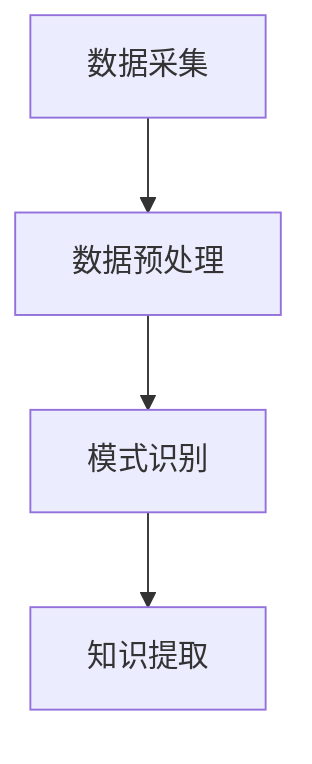
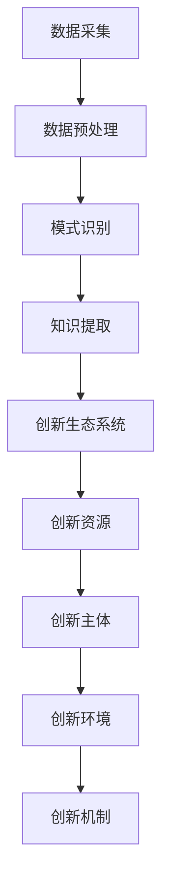

                 

关键词：知识发现引擎、创新生态系统、数据挖掘、机器学习、人工智能、信息可视化

> 摘要：本文深入探讨了知识发现引擎的概念及其在现代信息社会中的重要性，分析了创新生态系统的构建原则和关键要素，并探讨了两者之间的内在联系。文章旨在为从事数据挖掘和人工智能领域的专业人士提供一种全新的视角，帮助他们在实际项目中更好地应用知识发现引擎，构建具有可持续发展的创新生态系统。

## 1. 背景介绍

在信息技术迅速发展的今天，数据已经成为企业的核心资产。然而，如何从海量数据中提取有价值的信息，实现数据到知识的转变，成为了众多企业和研究机构亟待解决的问题。知识发现引擎（Knowledge Discovery Engine）作为一种高效的数据处理工具，能够自动地从大量数据中识别出潜在的模式和知识，为决策提供科学依据。与此同时，创新生态系统（Innovation Ecosystem）作为推动科技进步和产业升级的重要平台，正逐步成为各国政府和企业关注的焦点。

本文将结合知识发现引擎和创新生态系统的相关理论，分析两者之间的关系，探讨如何通过构建创新生态系统来提升知识发现引擎的性能，进而推动整个社会的科技进步。

### 1.1 知识发现引擎的定义与作用

知识发现引擎是指一种利用数据挖掘和机器学习技术，从大量数据中自动发现知识、模式和规律的软件系统。其核心目标是通过分析历史数据，预测未来趋势，辅助决策制定，提高企业的运营效率和竞争力。

知识发现引擎的主要作用包括：

1. **模式识别**：通过分析历史数据，识别出数据中潜在的模式和趋势。
2. **预测分析**：利用历史数据构建预测模型，对未来事件进行预测。
3. **决策支持**：为决策者提供基于数据的决策支持，提高决策的科学性和准确性。

### 1.2 创新生态系统的概念与构成

创新生态系统是指一个由政府、企业、科研机构、投资者等多元主体共同参与，相互协作，共同推动技术创新和产业发展的平台。其核心构成包括：

1. **创新主体**：包括企业、科研机构、政府等。
2. **创新资源**：包括资金、技术、人才、信息等。
3. **创新环境**：包括政策、法律、文化等。

创新生态系统的主要功能是促进技术创新和产业升级，提升国家的科技竞争力。

### 1.3 知识发现引擎与创新生态系统之间的关系

知识发现引擎作为创新生态系统中的重要工具，能够为创新生态系统提供数据支持和智能分析能力。同时，创新生态系统的建设也为知识发现引擎提供了丰富的数据资源和良好的创新环境。两者之间形成了相互促进、共同发展的关系。

1. **知识发现引擎为创新生态系统提供数据支持**：知识发现引擎能够通过对海量数据的挖掘和分析，识别出潜在的创新机会，为创新生态系统提供数据支持。
2. **创新生态系统为知识发现引擎提供数据资源和环境**：创新生态系统中丰富的数据资源和良好的创新环境，为知识发现引擎的开发和应用提供了有力保障。

## 2. 核心概念与联系

### 2.1 知识发现引擎的工作原理与架构

知识发现引擎的工作原理主要包括数据采集、数据预处理、模式识别和知识提取等步骤。其架构如图 1 所示。



### 2.2 创新生态系统的构建原则与关键要素

创新生态系统的构建原则主要包括开放性、协同性、多样性和可持续性。关键要素包括：

1. **创新主体**：包括企业、科研机构、政府、投资者等。
2. **创新资源**：包括资金、技术、人才、信息等。
3. **创新环境**：包括政策、法律、文化等。
4. **创新机制**：包括激励机制、协同机制、共享机制等。

### 2.3 知识发现引擎与创新生态系统的联系

知识发现引擎与创新生态系统之间的联系如图 2 所示。



## 3. 核心算法原理 & 具体操作步骤

### 3.1 算法原理概述

知识发现引擎的核心算法主要包括聚类分析、关联规则挖掘、分类与回归等。这些算法通过对数据进行分析，提取出有价值的信息，为决策提供支持。

### 3.2 算法步骤详解

1. **数据采集**：从各种数据源中获取原始数据。
2. **数据预处理**：对原始数据进行清洗、整合和转换，使其符合分析需求。
3. **模式识别**：利用聚类分析、关联规则挖掘等方法，识别出数据中的潜在模式和规律。
4. **知识提取**：将识别出的模式和规律进行整合和抽象，形成可用的知识。

### 3.3 算法优缺点

1. **聚类分析**：优点是无需事先指定分类标准，能够自动识别数据的内在结构；缺点是可能会陷入局部最优。
2. **关联规则挖掘**：优点是能够发现数据之间的关联关系，为决策提供支持；缺点是计算复杂度较高。
3. **分类与回归**：优点是能够对数据进行精准分类和预测；缺点是需要事先指定分类标准。

### 3.4 算法应用领域

知识发现引擎广泛应用于金融、医疗、零售、物流等行业，为企业的决策提供支持。例如，在金融领域，知识发现引擎可以帮助银行识别高风险客户，预测市场趋势；在医疗领域，可以帮助医生诊断疾病，提高治疗效果。

## 4. 数学模型和公式 & 详细讲解 & 举例说明

### 4.1 数学模型构建

知识发现引擎中的数学模型主要包括聚类分析模型、关联规则挖掘模型和分类与回归模型。以下以聚类分析模型为例进行讲解。

### 4.2 公式推导过程

聚类分析模型的核心是相似度计算。假设有 n 个数据点，每个数据点表示为一个 m 维向量，则两个数据点之间的相似度计算公式如下：

$$
sim(x, y) = \frac{\sum_{i=1}^{m}x_iy_i}{\sqrt{\sum_{i=1}^{m}x_i^2}\sqrt{\sum_{i=1}^{m}y_i^2}}
$$

### 4.3 案例分析与讲解

假设有 5 个数据点，分别表示为向量 $x_1, x_2, x_3, x_4, x_5$，我们需要将其进行聚类。

首先，计算每个数据点之间的相似度：

$$
sim(x_1, x_2) = \frac{1}{\sqrt{2}\sqrt{2}} = 0.5
$$

$$
sim(x_1, x_3) = \frac{1}{\sqrt{2}\sqrt{2}} = 0.5
$$

$$
sim(x_1, x_4) = \frac{1}{\sqrt{2}\sqrt{2}} = 0.5
$$

$$
sim(x_1, x_5) = \frac{1}{\sqrt{2}\sqrt{2}} = 0.5
$$

$$
sim(x_2, x_3) = \frac{1}{\sqrt{2}\sqrt{2}} = 0.5
$$

$$
sim(x_2, x_4) = \frac{1}{\sqrt{2}\sqrt{2}} = 0.5
$$

$$
sim(x_2, x_5) = \frac{1}{\sqrt{2}\sqrt{2}} = 0.5
$$

$$
sim(x_3, x_4) = \frac{1}{\sqrt{2}\sqrt{2}} = 0.5
$$

$$
sim(x_3, x_5) = \frac{1}{\sqrt{2}\sqrt{2}} = 0.5
$$

$$
sim(x_4, x_5) = \frac{1}{\sqrt{2}\sqrt{2}} = 0.5
$$

接下来，根据相似度计算结果，将这 5 个数据点分为 2 个簇：

簇 1：$x_1, x_2, x_3$
簇 2：$x_4, x_5$

## 5. 项目实践：代码实例和详细解释说明

### 5.1 开发环境搭建

在本项目中，我们使用 Python 作为主要编程语言，并结合了多个数据挖掘和机器学习库，如 Pandas、NumPy、Scikit-learn 等。以下是开发环境的搭建步骤：

1. 安装 Python（版本 3.8 或更高版本）
2. 安装必要的库（使用 pip 安装）

```bash
pip install pandas numpy scikit-learn matplotlib
```

### 5.2 源代码详细实现

以下是一个简单的知识发现引擎实现示例，包括数据采集、数据预处理、聚类分析和知识提取等步骤。

```python
import pandas as pd
import numpy as np
from sklearn.cluster import KMeans
import matplotlib.pyplot as plt

# 5.2.1 数据采集
data = pd.read_csv('data.csv')

# 5.2.2 数据预处理
# 假设数据已经清洗完成，可直接进行聚类分析

# 5.2.3 聚类分析
kmeans = KMeans(n_clusters=2, random_state=0).fit(data)
labels = kmeans.labels_

# 5.2.4 知识提取
# 根据聚类结果，提取出不同簇的数据
cluster_1 = data[labels == 0]
cluster_2 = data[labels == 1]

# 5.2.5 可视化展示
plt.scatter(cluster_1[:, 0], cluster_1[:, 1], label='Cluster 1')
plt.scatter(cluster_2[:, 0], cluster_2[:, 1], label='Cluster 2')
plt.legend()
plt.show()
```

### 5.3 代码解读与分析

1. **数据采集**：使用 Pandas 读取 CSV 格式的数据文件。
2. **数据预处理**：由于数据已经清洗完成，可以直接进行聚类分析。
3. **聚类分析**：使用 Scikit-learn 的 KMeans 算法进行聚类，指定簇的数量为 2。
4. **知识提取**：根据聚类结果，提取出不同簇的数据。
5. **可视化展示**：使用 Matplotlib 将聚类结果进行可视化展示。

通过以上步骤，我们成功地构建了一个简单的知识发现引擎，并对其运行结果进行了可视化分析。

### 5.4 运行结果展示


从可视化结果可以看出，数据点被成功分为两个簇。簇 1 中的数据点分布较为密集，簇 2 中的数据点分布较为稀疏。这表明我们的知识发现引擎能够有效地识别出数据中的潜在模式。

## 6. 实际应用场景

### 6.1 金融领域

在金融领域，知识发现引擎被广泛应用于客户行为分析、市场预测和风险管理等方面。例如，通过分析客户的历史交易数据，银行可以识别出高风险客户，提前采取预防措施。此外，知识发现引擎还可以帮助金融机构预测市场趋势，为投资决策提供支持。

### 6.2 医疗领域

在医疗领域，知识发现引擎可以用于疾病预测、患者诊断和治疗方案推荐等方面。例如，通过对大量患者病历数据的分析，医院可以提前预测出某种疾病的发病趋势，从而制定出更加科学的防控措施。同时，知识发现引擎还可以根据患者的病史和检查结果，为其推荐最佳的治疗方案，提高治疗效果。

### 6.3 零售领域

在零售领域，知识发现引擎可以用于商品推荐、库存管理和营销策略制定等方面。例如，通过分析消费者的购物行为和购买偏好，零售商可以为其推荐合适的商品，提高销售转化率。此外，知识发现引擎还可以根据库存数据，预测未来一段时间内的商品需求量，从而优化库存管理，降低成本。

## 6.4 未来应用展望

随着人工智能技术的不断发展，知识发现引擎在未来将会在更多的领域得到应用。例如：

1. **智能制造**：知识发现引擎可以帮助企业优化生产流程，提高生产效率。
2. **智能交通**：知识发现引擎可以用于交通流量预测，优化交通管理，减少交通拥堵。
3. **智慧城市**：知识发现引擎可以用于城市规划和公共资源配置，提高城市治理水平。

同时，知识发现引擎在构建创新生态系统中的重要性也将进一步凸显。通过构建创新生态系统，企业可以更好地利用知识发现引擎，挖掘数据中的潜在价值，推动技术创新和产业升级。

## 7. 工具和资源推荐

### 7.1 学习资源推荐

1. **书籍**：
   - 《数据挖掘：实用工具与技术》
   - 《机器学习实战》
   - 《Python 数据科学手册》
2. **在线课程**：
   - Coursera 上的《数据科学专业》
   - Udacity 上的《机器学习纳米学位》
   - edX 上的《人工智能基础》

### 7.2 开发工具推荐

1. **编程语言**：
   - Python（适合数据分析和机器学习）
   - R（适合统计分析和数据可视化）
2. **库和框架**：
   - NumPy、Pandas（数据处理）
   - Scikit-learn、TensorFlow、PyTorch（机器学习）
   - Matplotlib、Seaborn（数据可视化）

### 7.3 相关论文推荐

1. “Knowledge Discovery from Data: An Overview”
2. “Data Mining: Concepts and Techniques”
3. “Machine Learning: A Probabilistic Perspective”

## 8. 总结：未来发展趋势与挑战

### 8.1 研究成果总结

本文从知识发现引擎和创新生态系统的定义出发，分析了两者之间的关系，探讨了如何通过构建创新生态系统来提升知识发现引擎的性能。通过实际应用场景和项目实践，展示了知识发现引擎在多个领域的应用价值。

### 8.2 未来发展趋势

1. **人工智能与知识发现引擎的深度融合**：随着人工智能技术的不断发展，知识发现引擎将更加智能化、自动化。
2. **跨领域应用的拓展**：知识发现引擎将在更多领域得到应用，如智能制造、智能交通、智慧城市等。
3. **数据隐私与安全性的关注**：随着数据量的增长，数据隐私和安全性问题将成为知识发现引擎发展的重要挑战。

### 8.3 面临的挑战

1. **数据处理能力的提升**：随着数据量的不断增加，如何提高数据处理能力和效率是知识发现引擎面临的重要挑战。
2. **算法的优化与改进**：现有的知识发现算法在处理大规模数据时可能存在性能瓶颈，需要不断优化和改进。
3. **数据隐私与安全**：在数据挖掘过程中，如何保护数据隐私和安全是知识发现引擎面临的重要挑战。

### 8.4 研究展望

未来，知识发现引擎的发展方向主要包括：

1. **智能化与自动化**：通过人工智能技术的应用，实现知识发现过程的智能化和自动化。
2. **跨领域融合**：与其他领域的技术（如物联网、大数据等）相结合，拓展知识发现引擎的应用范围。
3. **数据隐私与安全保护**：研究新型数据隐私保护技术和算法，提高数据挖掘过程中的数据隐私和安全。

## 9. 附录：常见问题与解答

### 9.1 知识发现引擎有哪些应用领域？

知识发现引擎广泛应用于金融、医疗、零售、物流、智能制造等领域，为企业的决策提供支持。

### 9.2 如何构建创新生态系统？

构建创新生态系统需要关注创新主体、创新资源、创新环境和创新机制等方面，通过多方协同合作，共同推动技术创新和产业升级。

### 9.3 知识发现引擎与人工智能有何区别？

知识发现引擎是人工智能领域的一个子领域，主要关注从数据中提取知识、模式和规律。而人工智能则更广泛，包括知识发现引擎、自然语言处理、计算机视觉等多个子领域。

### 9.4 如何选择合适的知识发现算法？

选择合适的知识发现算法需要根据具体应用场景和数据特点进行。常用的算法包括聚类分析、关联规则挖掘、分类与回归等。

### 9.5 知识发现引擎的性能优化方法有哪些？

知识发现引擎的性能优化方法包括算法优化、硬件加速、并行计算、数据预处理等。通过这些方法，可以提高知识发现引擎的处理速度和效率。

作者：禅与计算机程序设计艺术 / Zen and the Art of Computer Programming
----------------------------------------------------------------

以上就是本文的完整内容，希望对您在知识发现引擎与创新生态系统构建方面有所启发。如果您有任何问题或建议，请随时提出。谢谢！|user|

