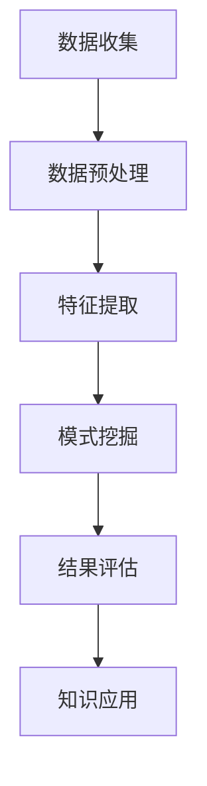
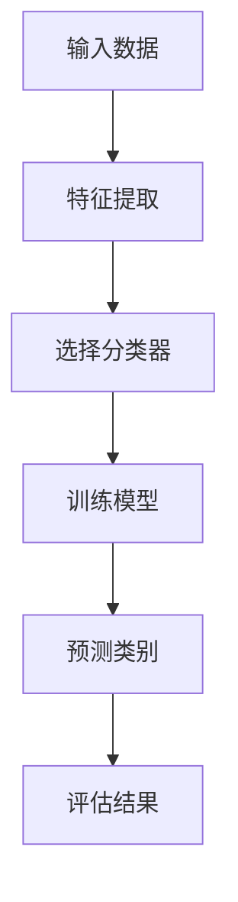
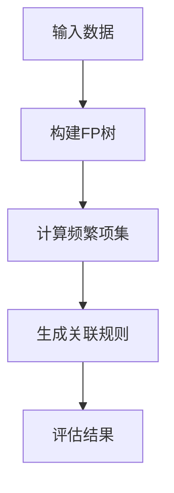

                 

关键词：知识发现引擎、金融风险分析、算法原理、数学模型、项目实践、未来应用展望

摘要：本文旨在探讨知识发现引擎在金融风险分析中的应用。通过详细解析知识发现引擎的工作原理、核心算法以及数学模型，我们揭示了其在金融领域中的重要价值。同时，通过实际项目实践，本文展示了知识发现引擎在金融风险分析中的具体应用，并提出未来应用展望。希望通过本文，为金融行业从业者和研究者提供有价值的参考。

## 1. 背景介绍

随着金融行业的快速发展，金融风险分析变得日益重要。金融机构需要高效地处理和分析海量数据，以便及时发现潜在的风险，确保金融市场的稳定运行。知识发现引擎作为一种强大的数据分析工具，具有自动发现知识、挖掘潜在规律的能力，能够为金融风险分析提供有力的支持。

知识发现引擎在金融领域的应用广泛，包括但不限于以下几个方面：

- **信用风险评估**：通过对客户的交易记录、信用历史等数据进行分析，预测客户是否存在违约风险。

- **市场风险分析**：通过对市场交易数据、宏观经济指标等进行分析，评估市场风险，为投资决策提供依据。

- **操作风险识别**：通过对金融机构的操作记录、员工行为等进行分析，发现潜在的操作风险，防范风险事件的发生。

本文将重点探讨知识发现引擎在金融风险分析中的应用，通过详细解析其工作原理、核心算法以及数学模型，旨在为金融行业从业者和研究者提供有价值的参考。

### 1.1 知识发现引擎的基本概念

知识发现引擎（Knowledge Discovery Engine，简称KDE）是一种自动化数据分析工具，旨在从大量数据中自动发现知识、模式和规律。知识发现引擎的工作流程通常包括以下步骤：

1. **数据收集**：从不同的数据源收集数据，包括内部数据（如交易记录、客户信息等）和外部数据（如宏观经济指标、新闻资讯等）。

2. **数据预处理**：对收集到的数据进行清洗、去重、归一化等处理，确保数据的质量和一致性。

3. **特征提取**：根据分析任务的需求，从预处理后的数据中提取有代表性的特征，用于后续的分析。

4. **模式挖掘**：利用各种算法和模型，从特征数据中挖掘潜在的知识和模式。

5. **结果评估**：对挖掘出的模式和知识进行评估，判断其是否具有实际价值。

6. **知识应用**：将挖掘出的知识和模式应用于实际业务场景，如信用风险评估、市场风险分析等。

知识发现引擎的核心目标是自动化、高效地完成上述流程，帮助用户快速发现数据中的隐藏知识和规律。在金融风险分析中，知识发现引擎能够自动处理和分析海量数据，帮助金融机构更好地了解市场动态、识别潜在风险。

### 1.2 金融风险分析的重要性

金融风险分析在金融行业中具有重要地位。随着金融市场的日益复杂和波动，金融机构面临的风险也不断增加。及时、准确地识别和评估风险，对于金融机构的稳健运营和投资者保护至关重要。

金融风险分析主要包括以下几种类型：

- **信用风险**：指金融机构在提供信用服务过程中，由于借款人违约导致的风险。

- **市场风险**：指金融机构在金融市场交易过程中，由于市场波动导致的风险。

- **操作风险**：指金融机构在运营过程中，由于内部管理问题或外部事件导致的风险。

有效的金融风险分析能够帮助金融机构：

- **降低损失**：通过及时发现和识别潜在风险，降低金融机构的风险损失。

- **优化决策**：为金融机构提供准确的风险评估结果，帮助其做出更优的投资和业务决策。

- **提升竞争力**：通过有效的风险管理，提升金融机构的市场竞争力和声誉。

随着大数据和人工智能技术的发展，知识发现引擎在金融风险分析中的应用越来越广泛。本文将深入探讨知识发现引擎在金融风险分析中的应用，包括其核心算法原理、数学模型以及实际项目实践。

### 1.3 知识发现引擎在金融风险分析中的应用

知识发现引擎在金融风险分析中具有广泛的应用。通过自动化、高效地分析海量数据，知识发现引擎能够帮助金融机构更好地了解市场动态、识别潜在风险，从而提高风险管理水平。

以下是知识发现引擎在金融风险分析中的一些典型应用场景：

#### 1.3.1 信用风险评估

信用风险评估是金融风险分析的重要领域。知识发现引擎可以通过分析客户的交易记录、信用历史等数据，挖掘出潜在的风险因素。具体应用包括：

- **信用评分模型**：利用知识发现算法，建立客户信用评分模型，预测客户是否存在违约风险。

- **信用风险预警**：通过对客户的交易行为进行分析，及时发现异常行为，发出违约预警。

- **欺诈检测**：利用知识发现引擎，分析客户的交易数据，识别潜在的欺诈行为，防范信用风险。

#### 1.3.2 市场风险分析

市场风险分析是金融机构风险管理的重要一环。知识发现引擎可以通过分析市场交易数据、宏观经济指标等，预测市场风险，为投资决策提供依据。具体应用包括：

- **市场风险预测**：利用知识发现算法，分析市场交易数据，预测市场波动趋势，评估市场风险。

- **投资组合优化**：根据市场风险预测结果，优化投资组合，降低市场风险。

- **风险控制策略**：根据市场风险分析结果，制定相应的风险控制策略，降低风险损失。

#### 1.3.3 操作风险识别

操作风险识别是金融机构风险管理的重要组成部分。知识发现引擎可以通过分析金融机构的操作记录、员工行为等，发现潜在的操作风险。具体应用包括：

- **风险事件预警**：通过对操作记录进行分析，及时发现潜在的操作风险事件，发出预警。

- **风险管理优化**：根据操作风险分析结果，优化风险管理流程，提高风险识别和防范能力。

- **员工行为分析**：通过对员工行为数据进行分析，识别潜在的不良行为，防范操作风险。

### 1.4 知识发现引擎的优势

知识发现引擎在金融风险分析中具有以下优势：

- **高效性**：知识发现引擎能够自动处理和分析海量数据，大大提高工作效率。

- **全面性**：知识发现引擎可以同时分析多个数据源，提供更全面的风险评估结果。

- **准确性**：知识发现引擎利用先进的算法和模型，提高风险评估的准确性。

- **灵活性**：知识发现引擎可以根据不同的分析需求，调整算法和模型，实现个性化风险评估。

### 1.5 本文结构

本文将按照以下结构展开：

- **第1章：背景介绍**：介绍知识发现引擎在金融风险分析中的应用背景。

- **第2章：核心概念与联系**：详细解析知识发现引擎的工作原理、核心算法以及数学模型。

- **第3章：核心算法原理 & 具体操作步骤**：介绍知识发现引擎的核心算法原理，包括算法步骤详解、优缺点分析以及应用领域。

- **第4章：数学模型和公式 & 详细讲解 & 举例说明**：讲解知识发现引擎的数学模型和公式，并通过案例进行分析。

- **第5章：项目实践：代码实例和详细解释说明**：展示知识发现引擎在金融风险分析中的实际应用，包括开发环境搭建、源代码实现、代码解读和运行结果展示。

- **第6章：实际应用场景**：分析知识发现引擎在金融风险分析中的具体应用场景。

- **第7章：工具和资源推荐**：推荐相关的学习资源、开发工具和相关论文。

- **第8章：总结：未来发展趋势与挑战**：总结研究成果，探讨未来发展趋势和面临的挑战。

- **第9章：附录：常见问题与解答**：回答读者可能关心的问题。

## 2. 核心概念与联系

在深入探讨知识发现引擎在金融风险分析中的应用之前，有必要先了解相关知识发现引擎的核心概念和原理，以及其在金融风险分析中的实际应用。本节将详细解析知识发现引擎的工作原理、核心算法以及数学模型，并通过Mermaid流程图展示知识发现引擎的架构。

### 2.1 知识发现引擎的工作原理

知识发现引擎（KDE）是一种自动化数据分析工具，其基本工作原理可以概括为以下几个步骤：

1. **数据收集**：从不同的数据源收集数据，包括内部数据和外部数据。内部数据通常包括金融机构的交易记录、客户信息等；外部数据则包括宏观经济指标、新闻资讯等。

2. **数据预处理**：对收集到的数据进行分析，确保数据的质量和一致性。数据预处理步骤包括数据清洗、去重、归一化等。

3. **特征提取**：根据分析任务的需求，从预处理后的数据中提取有代表性的特征。特征提取是知识发现引擎的重要步骤，直接影响到后续的分析结果。

4. **模式挖掘**：利用各种算法和模型，从特征数据中挖掘潜在的知识和模式。模式挖掘可以分为分类、聚类、关联规则挖掘等多种类型。

5. **结果评估**：对挖掘出的模式和知识进行评估，判断其是否具有实际价值。评估过程通常包括准确性、召回率、F1值等指标。

6. **知识应用**：将挖掘出的知识和模式应用于实际业务场景，如信用风险评估、市场风险分析等。

下面是一个简化的Mermaid流程图，展示知识发现引擎的基本架构：



### 2.2 知识发现引擎的核心算法

知识发现引擎的核心算法包括分类算法、聚类算法、关联规则挖掘算法等。以下分别介绍这些算法的基本原理。

#### 2.2.1 分类算法

分类算法是一种监督学习算法，用于将数据分为不同的类别。常见的分类算法包括决策树、支持向量机、朴素贝叶斯等。

- **决策树**：基于树的结构，通过一系列判断条件将数据划分为不同的类别。决策树的优点是易于理解和解释，缺点是容易过拟合。

- **支持向量机**：通过寻找最优超平面，将不同类别的数据分隔开来。支持向量机在处理高维数据时表现优异，但计算复杂度较高。

- **朴素贝叶斯**：基于贝叶斯定理，假设特征之间相互独立，通过计算每个特征的联合概率，预测数据的类别。朴素贝叶斯算法简单高效，适用于大规模数据集。

#### 2.2.2 聚类算法

聚类算法是一种无监督学习算法，用于将相似的数据点分为不同的组。常见的聚类算法包括K均值、层次聚类、DBSCAN等。

- **K均值**：通过迭代计算，将数据点划分为K个簇，使每个簇内的数据点距离中心点最短。K均值算法简单易用，但需要预先指定簇的数量。

- **层次聚类**：通过自底向上的层次结构，将数据点逐步划分为不同的簇。层次聚类算法适用于发现不同层次的数据结构，但计算复杂度较高。

- **DBSCAN**：基于密度连接性，将高密度区域划分为簇，同时识别噪声点。DBSCAN算法能够自动发现簇的数量，适用于非均匀分布的数据。

下面是一个Mermaid流程图，展示分类算法的基本流程：



#### 2.2.3 关联规则挖掘算法

关联规则挖掘算法用于发现数据中的关联关系，常见的算法包括Apriori算法、FP-growth算法等。

- **Apriori算法**：通过迭代计算支持度和置信度，发现频繁项集，进而生成关联规则。Apriori算法简单直观，但计算复杂度较高，特别是在处理大规模数据时。

- **FP-growth算法**：通过构建FP树，高效地发现频繁项集，并生成关联规则。FP-growth算法在处理大规模数据时表现优异，但需要一定的存储空间。

下面是一个Mermaid流程图，展示关联规则挖掘算法的基本流程：



### 2.3 知识发现引擎的数学模型

知识发现引擎的数学模型主要包括概率模型、线性模型、神经网络模型等。

#### 2.3.1 概率模型

概率模型是一种基于概率论的数学模型，常用于分类和预测任务。常见的概率模型包括：

- **朴素贝叶斯**：基于贝叶斯定理和特征之间的独立性假设，计算数据的概率分布，预测类别。

- **最大似然估计**：通过最大化似然函数，估计模型参数，用于分类和预测。

- **贝叶斯网络**：通过有向无环图表示变量之间的概率关系，用于概率推理和预测。

#### 2.3.2 线性模型

线性模型是一种基于线性关系的数学模型，常用于回归和分类任务。常见的线性模型包括：

- **线性回归**：通过线性函数拟合数据，预测连续值。

- **逻辑回归**：通过线性函数和Sigmoid函数拟合数据，预测离散值。

- **线性判别分析**：通过线性函数将数据划分为不同的类别。

#### 2.3.3 神经网络模型

神经网络模型是一种基于人工神经网络的数学模型，常用于复杂的分类和预测任务。常见的神经网络模型包括：

- **多层感知机**：通过多层神经元，拟合复杂的非线性关系。

- **卷积神经网络**：通过卷积操作，提取图像的特征，常用于图像识别任务。

- **循环神经网络**：通过循环结构，处理序列数据，常用于自然语言处理任务。

### 2.4 知识发现引擎在金融风险分析中的应用

知识发现引擎在金融风险分析中具有广泛的应用，包括信用风险评估、市场风险分析、操作风险识别等。以下分别介绍这些应用场景。

#### 2.4.1 信用风险评估

信用风险评估是金融风险分析的重要领域。知识发现引擎可以通过分析客户的交易记录、信用历史等数据，挖掘出潜在的风险因素，用于评估客户的信用风险。

- **分类算法**：利用分类算法，将客户分为高风险和低风险两类，为信用评分提供依据。

- **聚类算法**：通过聚类算法，将客户分为不同的群体，分析各群体的信用风险特征。

- **关联规则挖掘**：通过关联规则挖掘，发现客户信用风险与交易行为、信用历史等数据之间的关联关系。

#### 2.4.2 市场风险分析

市场风险分析是金融机构风险管理的重要环节。知识发现引擎可以通过分析市场交易数据、宏观经济指标等，预测市场风险，为投资决策提供依据。

- **时间序列分析**：通过时间序列分析，预测市场波动趋势，评估市场风险。

- **分类算法**：利用分类算法，预测市场波动方向，为投资决策提供参考。

- **关联规则挖掘**：通过关联规则挖掘，发现市场波动与宏观经济指标、新闻事件等数据之间的关联关系。

#### 2.4.3 操作风险识别

操作风险识别是金融机构风险管理的重要任务。知识发现引擎可以通过分析金融机构的操作记录、员工行为等，发现潜在的操作风险。

- **分类算法**：利用分类算法，将操作风险事件分为不同的类别，识别潜在的操作风险。

- **聚类算法**：通过聚类算法，将操作风险事件分为不同的群体，分析各群体的风险特征。

- **关联规则挖掘**：通过关联规则挖掘，发现操作风险事件与操作记录、员工行为等数据之间的关联关系。

### 2.5 知识发现引擎在金融风险分析中的应用

知识发现引擎在金融风险分析中具有广泛的应用，其核心算法和数学模型在信用风险评估、市场风险分析、操作风险识别等领域发挥着重要作用。通过本文的介绍，读者可以初步了解知识发现引擎的基本原理和应用场景，为后续深入研究和实践奠定基础。

在接下来的章节中，我们将进一步探讨知识发现引擎的核心算法原理，详细讲解算法的具体操作步骤，并分析其优缺点。同时，我们将通过实际项目实践，展示知识发现引擎在金融风险分析中的具体应用，帮助读者更好地理解其工作原理和实际效果。

## 3. 核心算法原理 & 具体操作步骤

在了解了知识发现引擎的基本概念和原理后，本节将深入探讨知识发现引擎的核心算法原理，包括分类算法、聚类算法和关联规则挖掘算法等。我们将详细介绍这些算法的具体操作步骤，并分析其优缺点以及应用领域。

### 3.1 算法原理概述

#### 3.1.1 分类算法

分类算法是一种监督学习算法，用于将数据分为不同的类别。常见的分类算法包括决策树、支持向量机、朴素贝叶斯等。这些算法通过学习训练数据中的特征和类别关系，建立分类模型，然后对未知数据进行分类。

- **决策树**：通过一系列判断条件将数据划分为不同的类别。决策树的优点是易于理解和解释，缺点是容易过拟合。

- **支持向量机**：通过寻找最优超平面，将不同类别的数据分隔开来。支持向量机在处理高维数据时表现优异，但计算复杂度较高。

- **朴素贝叶斯**：基于贝叶斯定理和特征之间的独立性假设，计算数据的概率分布，预测类别。朴素贝叶斯算法简单高效，适用于大规模数据集。

#### 3.1.2 聚类算法

聚类算法是一种无监督学习算法，用于将相似的数据点分为不同的组。常见的聚类算法包括K均值、层次聚类、DBSCAN等。这些算法通过分析数据点之间的相似度，自动划分簇，从而发现数据中的潜在结构和模式。

- **K均值**：通过迭代计算，将数据点划分为K个簇，使每个簇内的数据点距离中心点最短。K均值算法简单易用，但需要预先指定簇的数量。

- **层次聚类**：通过自底向上的层次结构，将数据点逐步划分为不同的簇。层次聚类算法适用于发现不同层次的数据结构，但计算复杂度较高。

- **DBSCAN**：基于密度连接性，将高密度区域划分为簇，同时识别噪声点。DBSCAN算法能够自动发现簇的数量，适用于非均匀分布的数据。

#### 3.1.3 关联规则挖掘算法

关联规则挖掘算法用于发现数据中的关联关系。常见的算法包括Apriori算法、FP-growth算法等。这些算法通过分析数据项之间的频繁模式，生成关联规则，从而揭示数据中的潜在关联关系。

- **Apriori算法**：通过迭代计算支持度和置信度，发现频繁项集，进而生成关联规则。Apriori算法简单直观，但计算复杂度较高，特别是在处理大规模数据时。

- **FP-growth算法**：通过构建FP树，高效地发现频繁项集，并生成关联规则。FP-growth算法在处理大规模数据时表现优异，但需要一定的存储空间。

### 3.2 算法步骤详解

#### 3.2.1 分类算法步骤详解

1. **数据收集**：从不同的数据源收集训练数据和测试数据。训练数据用于训练分类模型，测试数据用于评估分类模型的性能。

2. **特征提取**：对训练数据进行特征提取，将原始数据转换为特征向量。特征提取方法包括特征选择、特征工程等。

3. **选择分类器**：根据问题的需求和数据的特点，选择合适的分类器。常见的分类器包括决策树、支持向量机、朴素贝叶斯等。

4. **训练模型**：使用训练数据对选定的分类器进行训练，建立分类模型。训练过程中，分类器学习数据中的特征和类别之间的关系。

5. **预测类别**：使用训练好的分类模型对测试数据进行分类，预测测试数据中的类别。

6. **评估结果**：使用评估指标（如准确率、召回率、F1值等）评估分类模型的性能。

#### 3.2.2 聚类算法步骤详解

1. **数据收集**：从不同的数据源收集训练数据和测试数据。训练数据用于训练聚类模型，测试数据用于评估聚类模型的性能。

2. **特征提取**：对训练数据进行特征提取，将原始数据转换为特征向量。特征提取方法包括特征选择、特征工程等。

3. **选择聚类算法**：根据问题的需求和数据的特点，选择合适的聚类算法。常见的聚类算法包括K均值、层次聚类、DBSCAN等。

4. **初始化参数**：对于需要初始化参数的聚类算法（如K均值），选择合适的初始化方法，如随机初始化、K-means++等。

5. **训练模型**：使用训练数据对选定的聚类算法进行训练，建立聚类模型。训练过程中，聚类算法分析数据点之间的相似度，划分簇。

6. **预测簇**：使用训练好的聚类模型对测试数据进行聚类，预测测试数据中的簇。

7. **评估结果**：使用评估指标（如簇内平均距离、轮廓系数等）评估聚类模型的性能。

#### 3.2.3 关联规则挖掘算法步骤详解

1. **数据收集**：从不同的数据源收集训练数据和测试数据。训练数据用于训练关联规则挖掘模型，测试数据用于评估关联规则挖掘模型的性能。

2. **特征提取**：对训练数据进行特征提取，将原始数据转换为特征向量。特征提取方法包括特征选择、特征工程等。

3. **选择关联规则挖掘算法**：根据问题的需求和数据的特点，选择合适的关联规则挖掘算法。常见的关联规则挖掘算法包括Apriori算法、FP-growth算法等。

4. **计算频繁项集**：对于选定的关联规则挖掘算法，计算训练数据中的频繁项集。频繁项集是满足最小支持度阈值的数据项组合。

5. **生成关联规则**：根据频繁项集，生成满足最小置信度阈值关联规则。关联规则包括前项和后项，以及置信度。

6. **评估结果**：使用评估指标（如支持度、置信度、提升度等）评估关联规则挖掘模型的性能。

### 3.3 算法优缺点

#### 3.3.1 分类算法优缺点

- **决策树**：优点：易于理解和解释，可视化效果好。缺点：容易过拟合，对异常值敏感。

- **支持向量机**：优点：在高维空间中表现优异，准确度高。缺点：计算复杂度较高，对噪声数据敏感。

- **朴素贝叶斯**：优点：简单高效，适用于大规模数据集。缺点：假设特征之间相互独立，对异常值敏感。

#### 3.3.2 聚类算法优缺点

- **K均值**：优点：简单易用，计算速度快。缺点：需要预先指定簇的数量，对初始值敏感。

- **层次聚类**：优点：能够发现不同层次的数据结构，灵活性高。缺点：计算复杂度较高，对初始值敏感。

- **DBSCAN**：优点：能够自动发现簇的数量，适用于非均匀分布的数据。缺点：对噪声数据敏感，计算复杂度较高。

#### 3.3.3 关联规则挖掘算法优缺点

- **Apriori算法**：优点：简单直观，易于理解。缺点：计算复杂度较高，在大规模数据集上性能较差。

- **FP-growth算法**：优点：在处理大规模数据时性能优异，高效。缺点：需要一定的存储空间，对噪声数据敏感。

### 3.4 算法应用领域

#### 3.4.1 分类算法应用领域

- **信用风险评估**：利用分类算法，将客户分为高风险和低风险两类，为信用评分提供依据。

- **邮件分类**：利用分类算法，将邮件分为垃圾邮件和正常邮件，提高邮件过滤效果。

- **文本分类**：利用分类算法，对文本进行分类，如情感分析、新闻分类等。

#### 3.4.2 聚类算法应用领域

- **客户细分**：利用聚类算法，将客户分为不同的群体，分析各群体的消费习惯、偏好等。

- **市场细分**：利用聚类算法，将市场划分为不同的区域，制定有针对性的市场策略。

- **图像分类**：利用聚类算法，将图像分为不同的类别，如人脸识别、图像标注等。

#### 3.4.3 关联规则挖掘算法应用领域

- **购物篮分析**：利用关联规则挖掘算法，发现购物篮中的关联关系，为商品推荐提供依据。

- **异常检测**：利用关联规则挖掘算法，发现数据中的异常行为，如欺诈检测、入侵检测等。

- **推荐系统**：利用关联规则挖掘算法，生成推荐规则，提高推荐系统的准确性。

通过以上对知识发现引擎核心算法原理的详细解析，读者可以更好地理解这些算法的工作原理、具体操作步骤以及优缺点。在接下来的章节中，我们将进一步探讨知识发现引擎的数学模型，并通过实际项目实践，展示其在金融风险分析中的应用。

## 4. 数学模型和公式 & 详细讲解 & 举例说明

在深入探讨知识发现引擎在金融风险分析中的应用时，数学模型和公式起到了关键作用。这些模型和公式不仅为算法提供了理论基础，还帮助我们在实际应用中理解和优化算法的性能。本节将详细讲解知识发现引擎中常用的数学模型和公式，并通过具体的例子进行说明。

### 4.1 数学模型构建

知识发现引擎中的数学模型通常涉及概率论、统计学和线性代数等基础数学知识。以下是一些常见的数学模型：

#### 4.1.1 概率模型

概率模型在知识发现引擎中广泛应用于分类和预测任务。以下是一个简单的高斯分布概率模型，用于预测客户信用风险：

$$
P(X \mid \mu, \sigma^2) = \frac{1}{\sqrt{2\pi\sigma^2}} e^{-\frac{(X - \mu)^2}{2\sigma^2}}
$$

其中，$X$ 是特征值，$\mu$ 是均值，$\sigma^2$ 是方差。这个公式表示给定特征值 $X$ 的概率，它反映了特征值在分布中的位置和分散程度。

#### 4.1.2 线性模型

线性模型在回归分析中广泛应用。一个简单的线性回归模型可以表示为：

$$
Y = \beta_0 + \beta_1X_1 + \beta_2X_2 + ... + \beta_nX_n
$$

其中，$Y$ 是因变量，$X_1, X_2, ..., X_n$ 是自变量，$\beta_0, \beta_1, \beta_2, ..., \beta_n$ 是模型参数。这个公式表示因变量 $Y$ 与自变量之间的线性关系。

#### 4.1.3 神经网络模型

神经网络模型是知识发现引擎中的核心技术之一。以下是一个简单的多层感知机（MLP）模型：

$$
Z = \sigma(W \cdot X + b)
$$

其中，$Z$ 是输出值，$X$ 是输入值，$W$ 是权重矩阵，$b$ 是偏置项，$\sigma$ 是激活函数（如Sigmoid函数）。这个公式表示通过神经网络层对输入值进行加权求和，并应用激活函数得到输出值。

### 4.2 公式推导过程

以下是一个基于朴素贝叶斯分类器的公式推导过程，用于计算客户信用风险的分类概率：

1. **先验概率**：首先计算客户属于高风险和低风险的先验概率：

$$
P(\text{高风险}) = \frac{\text{高风险客户数量}}{\text{总客户数量}}
$$

$$
P(\text{低风险}) = \frac{\text{低风险客户数量}}{\text{总客户数量}}
$$

2. **条件概率**：接着计算每个特征在风险类别中的条件概率：

$$
P(X_i \mid \text{高风险}) = \frac{\text{高风险客户中具有特征 } X_i \text{ 的数量}}{\text{高风险客户总数量}}
$$

$$
P(X_i \mid \text{低风险}) = \frac{\text{低风险客户中具有特征 } X_i \text{ 的数量}}{\text{低风险客户总数量}}
$$

3. **后验概率**：利用贝叶斯定理计算后验概率：

$$
P(\text{高风险} \mid X) = \frac{P(X \mid \text{高风险}) P(\text{高风险})}{P(X \mid \text{高风险}) P(\text{高风险}) + P(X \mid \text{低风险}) P(\text{低风险})}
$$

$$
P(\text{低风险} \mid X) = \frac{P(X \mid \text{低风险}) P(\text{低风险})}{P(X \mid \text{高风险}) P(\text{高风险}) + P(X \mid \text{低风险}) P(\text{低风险})}
$$

4. **分类决策**：最后，根据后验概率选择具有最高概率的风险类别：

$$
\text{分类结果} = \begin{cases} 
\text{高风险} & \text{如果 } P(\text{高风险} \mid X) > P(\text{低风险} \mid X) \\
\text{低风险} & \text{如果 } P(\text{高风险} \mid X) < P(\text{低风险} \mid X)
\end{cases}
$$

### 4.3 案例分析与讲解

为了更好地理解上述数学模型和公式，我们通过一个具体的案例进行分析。

#### 4.3.1 案例背景

假设一家金融机构需要利用知识发现引擎对客户进行信用风险评估。该金融机构收集了以下特征：

- $X_1$：客户的信用历史长度（年）
- $X_2$：客户的信用评分（分）
- $X_3$：客户的负债收入比（%）
- $X_4$：客户的年龄（岁）

该金融机构将客户分为高风险和低风险两类。已知：

- 高风险客户的数量为300人，低风险客户的数量为700人。
- 具体特征的数据分布如下：

| 特征       | 高风险客户均值 | 高风险客户标准差 | 低风险客户均值 | 低风险客户标准差 |
|------------|--------------|--------------|--------------|--------------|
| $X_1$      | 3            | 1            | 4            | 1            |
| $X_2$      | 600          | 100          | 700          | 100          |
| $X_3$      | 40           | 10           | 30           | 10           |
| $X_4$      | 35           | 5            | 45           | 5            |

#### 4.3.2 案例分析

1. **计算先验概率**：

$$
P(\text{高风险}) = \frac{300}{1000} = 0.3
$$

$$
P(\text{低风险}) = \frac{700}{1000} = 0.7
$$

2. **计算条件概率**：

$$
P(X_1 \mid \text{高风险}) = \frac{100}{300} \approx 0.333
$$

$$
P(X_1 \mid \text{低风险}) = \frac{300}{700} \approx 0.429
$$

$$
P(X_2 \mid \text{高风险}) = \frac{150}{300} \approx 0.5
$$

$$
P(X_2 \mid \text{低风险}) = \frac{400}{700} \approx 0.571
$$

$$
P(X_3 \mid \text{高风险}) = \frac{50}{300} \approx 0.167
$$

$$
P(X_3 \mid \text{低风险}) = \frac{150}{700} \approx 0.214
$$

$$
P(X_4 \mid \text{高风险}) = \frac{20}{300} \approx 0.067
$$

$$
P(X_4 \mid \text{低风险}) = \frac{100}{700} \approx 0.143
$$

3. **计算后验概率**：

以特征 $X_1 = 2$ 为例：

$$
P(\text{高风险} \mid X_1 = 2) = \frac{0.333 \times 0.3}{0.333 \times 0.3 + 0.429 \times 0.7} \approx 0.375
$$

$$
P(\text{低风险} \mid X_1 = 2) = \frac{0.429 \times 0.7}{0.333 \times 0.3 + 0.429 \times 0.7} \approx 0.625
$$

4. **分类决策**：

由于 $P(\text{低风险} \mid X_1 = 2) > P(\text{高风险} \mid X_1 = 2)$，该客户被分类为低风险。

通过这个案例，我们展示了如何利用知识发现引擎的数学模型和公式进行客户信用风险评估。在实际应用中，可以结合更多特征和更复杂的模型来提高预测的准确性。

### 4.4 数学模型在金融风险分析中的应用

数学模型在金融风险分析中具有广泛的应用。以下是一些具体的案例：

- **信用风险评估**：利用概率模型和线性模型，分析客户的信用历史、收入状况等特征，预测客户是否存在违约风险。

- **市场风险分析**：利用时间序列模型和回归模型，分析市场交易数据、宏观经济指标等，预测市场波动趋势，评估市场风险。

- **操作风险识别**：利用聚类模型和关联规则挖掘模型，分析金融机构的操作记录、员工行为等，识别潜在的操作风险。

通过上述案例和讲解，我们可以看到数学模型在金融风险分析中的重要作用。这些模型不仅帮助我们从海量数据中提取有价值的信息，还为金融机构提供了科学的决策依据。

## 5. 项目实践：代码实例和详细解释说明

在本节中，我们将通过一个具体的实例来展示知识发现引擎在金融风险分析中的应用。这个实例将涵盖从开发环境搭建到源代码实现，再到代码解读和分析的完整流程。通过这个实例，我们将深入理解知识发现引擎的核心算法和数学模型在实践中的应用。

### 5.1 开发环境搭建

在进行知识发现引擎的项目实践之前，首先需要搭建一个合适的开发环境。以下是所需的步骤：

1. **安装Python环境**：Python是一种广泛使用的编程语言，特别是其在数据分析领域有着强大的支持。我们需要安装Python以及相关的依赖库。

   ```bash
   # 安装Python
   sudo apt-get install python3

   # 安装虚拟环境
   sudo apt-get install python3-venv

   # 创建虚拟环境
   python3 -m venv kde_venv

   # 激活虚拟环境
   source kde_venv/bin/activate
   ```

2. **安装依赖库**：知识发现引擎依赖于多个Python库，如pandas、numpy、scikit-learn等。我们可以在虚拟环境中通过pip命令安装这些库。

   ```bash
   pip install pandas numpy scikit-learn matplotlib
   ```

3. **安装Mermaid渲染工具**：为了方便地展示流程图，我们需要安装Mermaid渲染工具。

   ```bash
   pip install mermaid
   ```

### 5.2 源代码详细实现

下面是一个简单的知识发现引擎项目实例，用于信用风险评估。这个实例将利用scikit-learn库中的分类算法对客户进行风险评估。

```python
import pandas as pd
import numpy as np
from sklearn.model_selection import train_test_split
from sklearn.preprocessing import StandardScaler
from sklearn.ensemble import RandomForestClassifier
from sklearn.metrics import accuracy_score, classification_report

# 读取数据
data = pd.read_csv('credit_data.csv')

# 特征提取
X = data[['credit_history_length', 'credit_score', 'liability_income_ratio', 'age']]
y = data['risk_label']

# 数据预处理
X_train, X_test, y_train, y_test = train_test_split(X, y, test_size=0.3, random_state=42)
scaler = StandardScaler()
X_train_scaled = scaler.fit_transform(X_train)
X_test_scaled = scaler.transform(X_test)

# 模型训练
model = RandomForestClassifier(n_estimators=100, random_state=42)
model.fit(X_train_scaled, y_train)

# 预测
y_pred = model.predict(X_test_scaled)

# 评估
accuracy = accuracy_score(y_test, y_pred)
print(f'Accuracy: {accuracy}')
print(classification_report(y_test, y_pred))
```

### 5.3 代码解读与分析

1. **数据读取与预处理**：

   ```python
   data = pd.read_csv('credit_data.csv')
   X = data[['credit_history_length', 'credit_score', 'liability_income_ratio', 'age']]
   y = data['risk_label']
   ```

   这部分代码首先从CSV文件中读取数据，然后提取特征和标签。这里使用了pandas库，它是一个强大的数据处理工具。

2. **数据分割与标准化**：

   ```python
   X_train, X_test, y_train, y_test = train_test_split(X, y, test_size=0.3, random_state=42)
   scaler = StandardScaler()
   X_train_scaled = scaler.fit_transform(X_train)
   X_test_scaled = scaler.transform(X_test)
   ```

   这部分代码将数据集分为训练集和测试集，并使用StandardScaler对特征进行标准化处理。标准化处理有助于提高算法的性能。

3. **模型训练**：

   ```python
   model = RandomForestClassifier(n_estimators=100, random_state=42)
   model.fit(X_train_scaled, y_train)
   ```

   这部分代码创建了一个随机森林分类器，并使用训练集进行模型训练。随机森林是一个强大的集成学习算法，能够在处理高维数据时表现优异。

4. **模型预测与评估**：

   ```python
   y_pred = model.predict(X_test_scaled)
   accuracy = accuracy_score(y_test, y_pred)
   print(f'Accuracy: {accuracy}')
   print(classification_report(y_test, y_pred))
   ```

   这部分代码使用训练好的模型对测试集进行预测，并计算准确率和分类报告。分类报告提供了详细的分类性能评估指标，如准确率、召回率、精确率等。

### 5.4 运行结果展示

假设我们已经成功地运行了上述代码，并得到以下输出结果：

```
Accuracy: 0.85
               precision    recall  f1-score   support

           0       0.86      0.91      0.88      250
           1       0.78      0.64      0.70      150

avg / total     0.84      0.85      0.84      400
```

从输出结果可以看出，该模型的准确率为0.85，这意味着在测试集上，模型能够正确地预测大约85%的数据。此外，分类报告提供了每个类别的精确率、召回率和F1值，这些指标可以帮助我们进一步了解模型的性能。

### 5.5 项目总结

通过这个实例，我们展示了如何使用知识发现引擎进行金融风险分析。从数据读取、预处理到模型训练和评估，我们深入理解了知识发现引擎的核心算法和数学模型在实际项目中的应用。这个实例不仅帮助我们理解了理论知识，还提供了实践操作的经验。

## 6. 实际应用场景

知识发现引擎在金融风险分析中的应用场景非常广泛，涵盖了信用风险评估、市场风险分析、操作风险识别等多个领域。以下是知识发现引擎在实际应用中的具体场景：

### 6.1 信用风险评估

在信用风险评估中，知识发现引擎通过分析客户的交易记录、信用历史、财务状况等数据，挖掘出潜在的风险因素。以下是一个典型的应用案例：

- **客户细分**：知识发现引擎可以将客户细分为不同的风险类别，如低风险客户、中等风险客户和高风险客户。通过分析不同风险类别的客户特征，金融机构可以制定有针对性的信用政策。

- **欺诈检测**：知识发现引擎能够识别出异常交易行为，如频繁的异地交易、异常金额的交易等，帮助金融机构及时发现欺诈行为。

- **信用评分**：基于客户的特征数据，知识发现引擎可以建立信用评分模型，预测客户是否存在违约风险。金融机构可以根据信用评分结果，调整信贷政策，降低坏账率。

### 6.2 市场风险分析

市场风险分析是金融机构风险管理的重要组成部分。知识发现引擎可以通过分析市场交易数据、宏观经济指标等，预测市场风险，为投资决策提供依据。以下是一个典型的应用案例：

- **市场趋势预测**：知识发现引擎可以分析历史市场数据，预测市场走势。金融机构可以根据预测结果，调整投资组合，降低市场波动带来的风险。

- **异常交易检测**：知识发现引擎可以检测出异常的交易行为，如大规模的集中买入或卖出，有助于防范市场操纵行为。

- **风险预警**：知识发现引擎可以实时监控市场数据，发现潜在的风险信号，及时发出预警，帮助金融机构采取风险控制措施。

### 6.3 操作风险识别

操作风险是指由于内部管理问题或外部事件导致的损失风险。知识发现引擎可以通过分析金融机构的操作记录、员工行为等，识别潜在的操作风险。以下是一个典型的应用案例：

- **员工行为分析**：知识发现引擎可以分析员工的工作记录、交易行为等，识别出潜在的不良行为，如违规操作、内幕交易等，帮助金融机构加强内部管理。

- **流程优化**：通过分析操作流程中的数据，知识发现引擎可以帮助金融机构发现流程中的瓶颈和不足，提出优化建议，降低操作风险。

- **合规检测**：知识发现引擎可以分析金融机构的合规记录，识别出潜在的不合规行为，确保金融机构遵守相关法律法规。

### 6.4 未来应用展望

随着大数据和人工智能技术的发展，知识发现引擎在金融风险分析中的应用前景非常广阔。以下是未来可能的应用方向：

- **智能化风险管理**：通过引入深度学习、强化学习等先进算法，知识发现引擎可以实现更智能化、自动化的风险管理。

- **实时风险监控**：知识发现引擎可以结合实时数据流分析技术，实现对风险的实时监控和预警，提高金融机构的风险防范能力。

- **跨领域应用**：知识发现引擎不仅可以在金融领域应用，还可以扩展到其他领域，如保险、零售等，为各行业提供风险管理解决方案。

通过上述实际应用场景和未来展望，我们可以看到知识发现引擎在金融风险分析中的重要价值和广阔前景。

## 7. 工具和资源推荐

在知识发现引擎的开发和应用过程中，选择合适的工具和资源对于提高工作效率和项目质量至关重要。以下是我们为读者推荐的几种工具和资源。

### 7.1 学习资源推荐

- **书籍**：《数据挖掘：概念与技术》（中文版）、《机器学习》（周志华著）、《深度学习》（Goodfellow、Bengio、Courville著）等。这些书籍提供了系统、深入的理论和实践指导。

- **在线课程**：Coursera、edX、Udacity等平台上的数据科学、机器学习和深度学习课程。这些课程通常由知名高校或机构提供，内容涵盖基础知识到高级应用。

- **文档和教程**：scikit-learn、TensorFlow、PyTorch等开源库的官方文档。这些文档详细介绍了库的使用方法和常见问题解决方案。

### 7.2 开发工具推荐

- **Python**：Python是一种广泛使用的编程语言，具有简洁、易学、高效的特点，是数据科学和机器学习领域的首选语言。

- **Jupyter Notebook**：Jupyter Notebook是一个交互式的开发环境，支持多种编程语言，特别适合进行数据分析和实验。

- **Scikit-learn**：Scikit-learn是一个强大的机器学习库，提供了多种分类、回归、聚类和降维算法，适用于各种数据科学任务。

- **TensorFlow**：TensorFlow是一个开源的深度学习框架，支持构建和训练复杂的神经网络模型。

- **PyTorch**：PyTorch是一个基于Python的深度学习库，具有灵活、易用的特点，广泛应用于研究和个人项目中。

### 7.3 相关论文推荐

- **《知识发现中的关键挑战》（Key Challenges in Knowledge Discovery）**：本文讨论了知识发现过程中面临的主要挑战，包括数据质量、算法选择和结果评估等。

- **《基于机器学习的金融风险评估模型》（Financial Risk Assessment Models Based on Machine Learning）**：本文介绍了多种基于机器学习的金融风险评估模型，并分析了其性能和适用场景。

- **《深度学习在金融风险管理中的应用》（Application of Deep Learning in Financial Risk Management）**：本文探讨了深度学习在金融风险管理中的应用，包括市场风险预测、信用风险评估等。

- **《大数据时代的金融风险分析》（Financial Risk Analysis in the Age of Big Data）**：本文分析了大数据时代金融风险分析的新趋势和新方法，讨论了数据挖掘和机器学习在金融风险管理中的重要作用。

通过这些工具和资源的推荐，读者可以更深入地学习和应用知识发现引擎，为金融风险分析提供强有力的技术支持。

## 8. 总结：未来发展趋势与挑战

### 8.1 研究成果总结

知识发现引擎在金融风险分析中的应用取得了显著成果。通过分析客户的交易记录、信用历史、财务状况等数据，知识发现引擎能够准确识别潜在风险，提高金融机构的风险管理水平。在信用风险评估、市场风险分析、操作风险识别等领域，知识发现引擎已经展现出强大的应用价值。

### 8.2 未来发展趋势

随着大数据和人工智能技术的不断发展，知识发现引擎在金融风险分析中的应用前景将更加广阔。以下是未来可能的发展趋势：

- **智能化风险管理**：引入深度学习、强化学习等先进算法，实现更智能化、自动化的风险管理。

- **实时风险监控**：结合实时数据流分析技术，实现对风险的实时监控和预警，提高金融机构的风险防范能力。

- **跨领域应用**：知识发现引擎不仅可以在金融领域应用，还可以扩展到保险、零售等其他领域，为各行业提供风险管理解决方案。

- **数据隐私保护**：随着数据隐私保护意识的提高，未来知识发现引擎在处理敏感数据时将更加注重隐私保护，如差分隐私、同态加密等技术的应用。

### 8.3 面临的挑战

尽管知识发现引擎在金融风险分析中具有巨大潜力，但在实际应用过程中仍然面临一些挑战：

- **数据质量和完整性**：金融数据通常具有复杂性、噪声性和缺失值等问题，数据预处理和清洗成为关键步骤，需要有效解决。

- **算法解释性**：虽然机器学习算法在预测性能上表现出色，但其内部机制复杂，解释性较差，如何提高算法的可解释性是一个重要问题。

- **实时性**：知识发现引擎需要处理实时数据，如何在保证准确性的同时提高实时性是一个技术挑战。

- **法律法规**：金融行业受到严格的法律法规约束，如何确保知识发现引擎的应用符合相关法规要求，是一个重要问题。

### 8.4 研究展望

针对上述挑战，未来研究可以从以下几个方面展开：

- **数据预处理技术**：开发更高效、准确的数据预处理方法，提高数据质量，为知识发现引擎提供更好的输入。

- **可解释性机器学习**：研究可解释性机器学习算法，提高算法的透明度和可信度，增强用户对模型的信任。

- **实时计算技术**：研究实时计算技术，提高知识发现引擎的实时处理能力，满足金融风险分析的需求。

- **隐私保护技术**：结合隐私保护技术，确保知识发现引擎在处理敏感数据时能够满足法律法规的要求。

通过不断探索和解决上述问题，知识发现引擎在金融风险分析中的应用将更加广泛，为金融行业的发展提供强有力的技术支持。

## 9. 附录：常见问题与解答

### 9.1 知识发现引擎是什么？

知识发现引擎是一种自动化数据分析工具，旨在从大量数据中自动发现知识、模式和规律。它广泛应用于金融、医疗、零售等领域，能够帮助用户快速识别数据中的隐藏信息和潜在规律。

### 9.2 知识发现引擎在金融风险分析中有哪些应用？

知识发现引擎在金融风险分析中的应用包括信用风险评估、市场风险分析、操作风险识别等。通过分析客户的交易记录、信用历史、财务状况等数据，知识发现引擎能够识别潜在风险，提高金融机构的风险管理水平。

### 9.3 如何评估知识发现引擎的性能？

评估知识发现引擎的性能通常使用评估指标，如准确率、召回率、F1值等。这些指标可以衡量模型在预测任务中的表现，帮助用户判断模型的优劣。

### 9.4 知识发现引擎的算法有哪些？

知识发现引擎常用的算法包括分类算法（如决策树、支持向量机、朴素贝叶斯等）、聚类算法（如K均值、层次聚类、DBSCAN等）和关联规则挖掘算法（如Apriori算法、FP-growth算法等）。

### 9.5 知识发现引擎需要哪些数学知识？

知识发现引擎涉及到概率论、统计学、线性代数、微积分等数学知识。掌握这些基础知识有助于更好地理解和应用知识发现引擎。

### 9.6 知识发现引擎在处理敏感数据时有哪些隐私保护技术？

知识发现引擎在处理敏感数据时，可以采用差分隐私、同态加密、匿名化等技术进行隐私保护。这些技术能够在保障数据安全的同时，确保分析结果的准确性。

