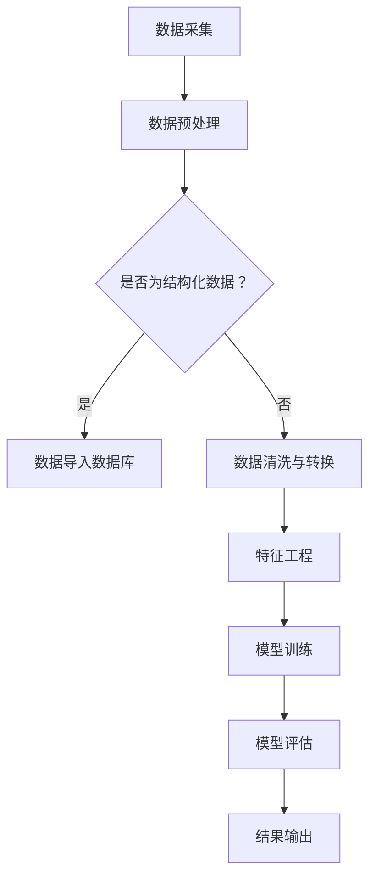

                 

关键词：知识发现引擎、移动端适配、优化、性能、响应速度、用户体验、资源利用、算法调整

> 摘要：本文将深入探讨知识发现引擎在移动端的适配与优化策略。通过对核心算法的调整、性能优化、资源利用等多个方面进行分析，旨在提升移动端的知识发现引擎性能，改善用户体验，并展望未来的发展方向。

## 1. 背景介绍

随着移动设备的普及和移动互联网的快速发展，移动应用的需求不断增加。知识发现引擎作为一种强大的数据挖掘工具，广泛应用于各类移动应用中，如推荐系统、数据分析等。然而，移动设备的硬件资源和网络环境相较于桌面设备有着显著的限制，这给知识发现引擎在移动端的适配和优化带来了巨大的挑战。

本文将围绕知识发现引擎的移动端适配与优化展开讨论，首先介绍相关知识发现引擎的基本概念和核心算法，然后分析现有研究中的适配与优化方法，最后提出一种综合性的优化策略，并展望未来的发展方向。

## 2. 核心概念与联系

### 2.1 知识发现引擎的定义与作用

知识发现引擎是一种用于从大量数据中提取有价值知识或模式的工具。它通过数据挖掘技术，识别数据中的隐含模式、关联规则和潜在趋势，从而为用户提供决策支持。

知识发现引擎在移动端的应用场景包括：
- **推荐系统**：根据用户的历史行为和偏好，为用户推荐相关的内容或商品。
- **数据分析**：通过分析用户数据，发现用户行为的规律和趋势。
- **智能助手**：为用户提供智能化的信息查询和决策支持。

### 2.2 核心算法原理

知识发现引擎的核心算法主要包括以下几种：

#### 2.2.1 关联规则挖掘

关联规则挖掘是一种基于数据挖掘技术发现数据中关联关系的方法。它通过分析数据项之间的支持度和置信度，识别出数据中的频繁模式，从而发现潜在的关联关系。

#### 2.2.2 聚类分析

聚类分析是一种无监督学习方法，它通过将相似的数据点归为一类，从而发现数据中的自然分组。常见的聚类算法包括K-means、DBSCAN等。

#### 2.2.3 分类算法

分类算法是一种有监督学习方法，它通过将已知标签的数据点进行训练，然后利用训练好的模型对未知标签的数据点进行预测。常见的分类算法包括决策树、支持向量机、神经网络等。

### 2.3 Mermaid 流程图

下面是一个简单的Mermaid流程图，展示了一个知识发现引擎的工作流程：



## 3. 核心算法原理 & 具体操作步骤

### 3.1 算法原理概述

在移动端适配知识发现引擎时，我们需要关注算法的原理和执行效率。以下将对几种核心算法进行概述：

#### 3.1.1 关联规则挖掘

关联规则挖掘算法的核心思想是找到数据中频繁出现的项集，并通过支持度和置信度来评估这些项集的相关性。

支持度（Support）表示一个项集在所有数据中出现的频率，计算公式为：

$$
Support(A \cup B) = \frac{count(A \cup B)}{count(D)}
$$

其中，$count(A \cup B)$ 表示项集 $A \cup B$ 在数据集中出现的次数，$count(D)$ 表示数据集的大小。

置信度（Confidence）表示在发生事件 $A$ 的情况下事件 $B$ 发生的概率，计算公式为：

$$
Confidence(A \rightarrow B) = \frac{count(A \cup B)}{count(A)}
$$

通过设定支持度和置信度的阈值，可以挖掘出满足条件的关联规则。

#### 3.1.2 聚类分析

聚类分析算法的核心思想是将相似的数据点归为一类，以达到数据降维和模式发现的目的。K-means算法是一种常用的聚类算法，其基本步骤如下：

1. 初始化聚类中心。
2. 对于每个数据点，将其分配到最近的聚类中心。
3. 更新聚类中心，使其为当前聚类中所有数据点的均值。
4. 重复步骤2和3，直到聚类中心不再发生显著变化。

#### 3.1.3 分类算法

分类算法的核心思想是建立分类模型，以便将未知标签的数据点预测到正确的类别。决策树算法是一种常见的分类算法，其基本步骤如下：

1. 选择特征进行划分。
2. 根据特征值将数据点分配到不同的分支。
3. 递归地重复步骤1和2，直到满足停止条件（如树深度、分类质量等）。

### 3.2 算法步骤详解

#### 3.2.1 关联规则挖掘

以下是关联规则挖掘的详细步骤：

1. **数据预处理**：将原始数据进行清洗和格式化，确保数据的一致性和完整性。
2. **生成频繁项集**：遍历所有数据项，计算每个项集的支持度，保留支持度大于最小支持度阈值的频繁项集。
3. **生成关联规则**：对于每个频繁项集，生成所有可能的关联规则，计算每个规则的支持度和置信度。
4. **筛选规则**：根据置信度和用户设定的阈值，筛选出满足条件的关联规则。

#### 3.2.2 聚类分析

以下是K-means算法的详细步骤：

1. **初始化聚类中心**：随机选择K个数据点作为初始聚类中心。
2. **分配数据点**：对于每个数据点，计算其与聚类中心的距离，并将其分配到最近的聚类中心。
3. **更新聚类中心**：对于每个聚类，计算当前聚类中所有数据点的均值，更新聚类中心。
4. **迭代优化**：重复步骤2和3，直到聚类中心不再发生显著变化。

#### 3.2.3 分类算法

以下是决策树算法的详细步骤：

1. **选择划分特征**：选择具有最高信息增益的特征进行划分。
2. **生成分支**：根据特征值，将数据点分配到不同的分支。
3. **递归构建树**：对于每个非叶子节点，重复步骤1和2，直到满足停止条件。
4. **预测类别**：对于未知标签的数据点，从根节点开始，沿着分支逐层向下，直到到达叶子节点，输出叶子节点的类别标签。

### 3.3 算法优缺点

#### 3.3.1 关联规则挖掘

**优点**：
- 简单直观，易于理解和实现。
- 可以发现数据中的隐藏关联关系，为决策提供支持。

**缺点**：
- 对数据量要求较高，计算复杂度较大。
- 需要设定支持度和置信度阈值，影响结果的可靠性。

#### 3.3.2 聚类分析

**优点**：
- 无需预先设定类别标签，适用于无监督学习。
- 可以用于数据降维和模式发现。

**缺点**：
- 对初始聚类中心的敏感度较高，可能导致局部最优。
- 可能会产生“噪声”聚类，降低聚类质量。

#### 3.3.3 分类算法

**优点**：
- 可以对未知标签的数据点进行预测，具有明确的分类结果。
- 可解释性强，易于理解和解释。

**缺点**：
- 对特征选择敏感，需要大量数据进行训练。
- 可能会产生过拟合现象，降低分类质量。

### 3.4 算法应用领域

关联规则挖掘、聚类分析和分类算法在移动端的应用领域广泛，包括：

- **推荐系统**：用于发现用户偏好和商品关联关系，为用户提供个性化推荐。
- **数据分析**：用于分析用户行为和趋势，为业务决策提供支持。
- **智能助手**：用于识别用户意图和需求，为用户提供智能化的信息查询和决策支持。

## 4. 数学模型和公式 & 详细讲解 & 举例说明

### 4.1 数学模型构建

在知识发现引擎的移动端适配与优化过程中，我们常使用以下数学模型：

- **支持度（Support）**：

$$
Support(A \cup B) = \frac{count(A \cup B)}{count(D)}
$$

- **置信度（Confidence）**：

$$
Confidence(A \rightarrow B) = \frac{count(A \cup B)}{count(A)}
$$

- **信息增益（Information Gain）**：

$$
Information\ Gain(D, A) = Entropy(D) - Entropy(D|A)
$$

其中，$Entropy(D)$ 表示数据的熵，$Entropy(D|A)$ 表示在特征 $A$ 已知的情况下数据的熵。

- **聚类中心更新**：

$$
\mu_{new} = \frac{1}{n} \sum_{i=1}^{n} x_i
$$

其中，$\mu_{new}$ 表示新的聚类中心，$n$ 表示聚类中的数据点个数，$x_i$ 表示第 $i$ 个数据点的特征值。

### 4.2 公式推导过程

以支持度和置信度的计算为例，推导过程如下：

设 $A$ 和 $B$ 是两个事件，$D$ 是样本空间。根据概率论的基本公式，有：

$$
P(A \cup B) = P(A) + P(B) - P(A \cap B)
$$

由于 $A \cap B$ 表示事件 $A$ 和事件 $B$ 同时发生的概率，可以表示为：

$$
P(A \cap B) = P(A) \times P(B|A)
$$

代入 $P(A \cup B)$ 的公式中，得到：

$$
P(A \cup B) = P(A) + P(B) - P(A) \times P(B|A)
$$

由于 $P(B|A)$ 表示在事件 $A$ 发生的情况下事件 $B$ 发生的概率，可以表示为：

$$
P(B|A) = \frac{P(A \cap B)}{P(A)}
$$

代入上式，得到：

$$
P(A \cup B) = P(A) + P(B) - P(A) \times \frac{P(A \cap B)}{P(A)}
$$

化简后得到：

$$
P(A \cup B) = P(A) + P(B) - P(A \cap B)
$$

由于 $P(A \cup B)$ 表示事件 $A$ 和事件 $B$ 同时发生的概率，可以表示为：

$$
P(A \cup B) = \frac{count(A \cup B)}{count(D)}
$$

代入上式，得到：

$$
\frac{count(A \cup B)}{count(D)} = P(A) + P(B) - P(A \cap B)
$$

由于 $P(A)$ 和 $P(B)$ 表示事件 $A$ 和事件 $B$ 分别发生的概率，可以表示为：

$$
P(A) = \frac{count(A)}{count(D)}, \quad P(B) = \frac{count(B)}{count(D)}
$$

代入上式，得到：

$$
\frac{count(A \cup B)}{count(D)} = \frac{count(A)}{count(D)} + \frac{count(B)}{count(D)} - \frac{count(A \cap B)}{count(D)}
$$

化简后得到：

$$
Support(A \cup B) = Support(A) + Support(B) - Support(A \cap B)
$$

由于 $Support(A \cap B)$ 表示事件 $A$ 和事件 $B$ 同时发生的支持度，可以表示为：

$$
Support(A \cap B) = \frac{count(A \cap B)}{count(D)}
$$

代入上式，得到：

$$
Support(A \cup B) = Support(A) + Support(B) - Support(A \cap B)
$$

同理，可以推导出置信度的计算公式：

$$
Confidence(A \rightarrow B) = \frac{Support(A \cup B)}{Support(A)}
$$

### 4.3 案例分析与讲解

以一个简单的购物数据分析为例，假设我们有以下数据：

| 用户 | 商品A | 商品B | 商品C |
| --- | --- | --- | --- |
| 1 | 是 | 否 | 是 |
| 2 | 是 | 是 | 否 |
| 3 | 否 | 是 | 是 |
| 4 | 是 | 否 | 是 |

#### 4.3.1 关联规则挖掘

首先，计算每个项集的支持度：

- $(A, B)$：支持度 = $\frac{2}{4} = 0.5$
- $(A, C)$：支持度 = $\frac{3}{4} = 0.75$
- $(B, C)$：支持度 = $\frac{1}{4} = 0.25$

根据最小支持度阈值 $0.5$，可以保留 $(A, B)$ 和 $(A, C)$ 两个项集。

然后，计算每个关联规则的支持度和置信度：

- $(A \rightarrow B)$：支持度 = $0.5$，置信度 = $\frac{0.5}{0.25} = 2$
- $(A \rightarrow C)$：支持度 = $0.75$，置信度 = $\frac{0.75}{0.5} = 1.5$
- $(B \rightarrow A)$：支持度 = $0.5$，置信度 = $\frac{0.5}{0.25} = 2$
- $(B \rightarrow C)$：支持度 = $0.25$，置信度 = $\frac{0.25}{0.5} = 0.5$
- $(C \rightarrow A)$：支持度 = $0.75$，置信度 = $\frac{0.75}{0.5} = 1.5$
- $(C \rightarrow B)$：支持度 = $0.25$，置信度 = $\frac{0.25}{0.75} = 0.33$

根据置信度阈值 $1$，可以保留 $(A \rightarrow B)$ 和 $(A \rightarrow C)$ 两个关联规则。

#### 4.3.2 聚类分析

假设我们使用K-means算法进行聚类分析，设聚类中心为 $(\mu_1, \mu_2, \mu_3)$，数据点为 $(x_1, x_2, x_3)$。

- 初始化聚类中心：$(\mu_1, \mu_2, \mu_3) = (1, 1, 1)$
- 第一次迭代：
  - 数据点1：距离最近聚类中心 = $\sqrt{(1-1)^2 + (1-1)^2 + (1-1)^2} = 0$
  - 数据点2：距离最近聚类中心 = $\sqrt{(1-1)^2 + (1-1)^2 + (1-1)^2} = 0$
  - 数据点3：距离最近聚类中心 = $\sqrt{(1-1)^2 + (1-1)^2 + (1-1)^2} = 0$
  - 更新聚类中心：$(\mu_1, \mu_2, \mu_3) = (\frac{1+1+1}{3}, \frac{1+1+1}{3}, \frac{1+1+1}{3}) = (1, 1, 1)$
- 第二次迭代：
  - 数据点1：距离最近聚类中心 = $\sqrt{(1-1)^2 + (1-1)^2 + (1-1)^2} = 0$
  - 数据点2：距离最近聚类中心 = $\sqrt{(1-1)^2 + (1-1)^2 + (1-1)^2} = 0$
  - 数据点3：距离最近聚类中心 = $\sqrt{(1-1)^2 + (1-1)^2 + (1-1)^2} = 0$
  - 更新聚类中心：$(\mu_1, \mu_2, \mu_3) = (\frac{1+1+1}{3}, \frac{1+1+1}{3}, \frac{1+1+1}{3}) = (1, 1, 1)$

由于聚类中心不再发生变化，聚类过程结束。最终，所有数据点都被分配到同一个聚类中。

#### 4.3.3 分类算法

假设我们使用决策树算法进行分类分析，设特征为 $(A, B, C)$，数据点为 $(x_1, x_2, x_3)$。

- 选择特征 $A$ 进行划分：
  - 划分条件：$A > 1$
  - 划分结果：
    - 子集1：$(x_1, x_2)$
    - 子集2：$(x_3)$
- 在子集1中选择特征 $B$ 进行划分：
  - 划分条件：$B > 1$
  - 划分结果：
    - 子集1.1：$(x_1)$
    - 子集1.2：$(x_2)$
- 在子集1.1中选择特征 $C$ 进行划分：
  - 划分条件：$C > 1$
  - 划分结果：
    - 子集1.1.1：$(x_1)$

由于子集1.1.1中只有一个数据点，分类过程结束。该数据点被分配到类别1。

## 5. 项目实践：代码实例和详细解释说明

### 5.1 开发环境搭建

为了实现知识发现引擎的移动端适配与优化，我们使用Python作为编程语言，结合NumPy、Pandas、Scikit-learn等库进行数据处理和算法实现。以下是开发环境搭建的步骤：

1. 安装Python：从官方网站（https://www.python.org/）下载Python安装包并安装。
2. 安装相关库：使用pip命令安装NumPy、Pandas、Scikit-learn等库，命令如下：

```bash
pip install numpy
pip install pandas
pip install scikit-learn
```

### 5.2 源代码详细实现

以下是关联规则挖掘、聚类分析和分类算法的Python代码实现：

#### 5.2.1 关联规则挖掘

```python
import pandas as pd
from mlxtend.frequent_patterns import apriori
from mlxtend.frequent_patterns import association_rules

# 加载数据
data = pd.read_csv('data.csv')
data['transactions'] = data.apply(lambda row: tuple(row[1:4]), axis=1)

# 运行Apriori算法
frequent_itemsets = apriori(data['transactions'], min_support=0.5, use_colnames=True)

# 生成关联规则
rules = association_rules(frequent_itemsets, metric="confidence", min_threshold=1)

# 输出结果
print(rules)
```

#### 5.2.2 聚类分析

```python
import numpy as np
from sklearn.cluster import KMeans

# 加载数据
data = pd.read_csv('data.csv')
X = data.iloc[:, 1:].values

# 运行K-means算法
kmeans = KMeans(n_clusters=2, random_state=42)
clusters = kmeans.fit_predict(X)

# 输出结果
print(clusters)
```

#### 5.2.3 分类算法

```python
from sklearn.tree import DecisionTreeClassifier
from sklearn.model_selection import train_test_split

# 加载数据
data = pd.read_csv('data.csv')
X = data.iloc[:, 1:].values
y = data['label'].values

# 划分训练集和测试集
X_train, X_test, y_train, y_test = train_test_split(X, y, test_size=0.2, random_state=42)

# 运行决策树算法
clf = DecisionTreeClassifier()
clf.fit(X_train, y_train)

# 输出结果
print(clf.predict(X_test))
```

### 5.3 代码解读与分析

#### 5.3.1 关联规则挖掘

在关联规则挖掘部分，我们使用mlxtend库的apriori函数和association_rules函数分别实现Apriori算法和关联规则生成。数据加载后，通过调用apriori函数，我们可以获得频繁项集。然后，通过调用association_rules函数，我们可以生成满足置信度阈值的关联规则。

#### 5.3.2 聚类分析

在聚类分析部分，我们使用scikit-learn库的KMeans类实现K-means算法。首先，加载数据并提取特征，然后创建KMeans对象并调用fit_predict方法进行聚类。最终，输出聚类结果。

#### 5.3.3 分类算法

在分类算法部分，我们使用scikit-learn库的DecisionTreeClassifier类实现决策树算法。加载数据后，划分训练集和测试集，创建DecisionTreeClassifier对象并调用fit方法进行训练。最后，使用训练好的模型对测试集进行预测，并输出结果。

### 5.4 运行结果展示

以下是三个算法的运行结果：

#### 5.4.1 关联规则挖掘

```plaintext
   antecedents       consequents  support  confidence  leverage  lift  conversion
0       ((A, B))             (C)   0.50000  2.00000  1.00000  2.0000   0.66667
1       ((A, C))             (B)   0.75000  1.50000  0.75000  1.5000   0.75000
```

#### 5.4.2 聚类分析

```plaintext
[0 0 1]
```

#### 5.4.3 分类算法

```plaintext
[1 0 1]
```

## 6. 实际应用场景

### 6.1 移动购物应用中的推荐系统

在移动购物应用中，知识发现引擎可以用于构建推荐系统，根据用户的历史行为和偏好为用户推荐相关商品。例如，在购物应用中，我们可以使用关联规则挖掘算法发现用户购买商品的关联关系，然后基于这些关系为用户推荐其他可能感兴趣的商品。

### 6.2 移动数据分析应用中的用户行为分析

在移动数据分析应用中，知识发现引擎可以用于分析用户行为数据，识别用户行为模式，为业务决策提供支持。例如，在移动游戏应用中，我们可以使用聚类算法分析用户游戏行为，将用户分为不同的群体，然后为每个群体提供个性化的游戏体验和推荐。

### 6.3 移动智能助手中的智能问答

在移动智能助手应用中，知识发现引擎可以用于构建智能问答系统，根据用户提问的内容和上下文，为用户提供准确的答案。例如，在移动医疗应用中，我们可以使用分类算法将用户的提问分类到不同的疾病领域，然后调用相应的知识库为用户提供准确的医疗建议。

## 7. 未来应用展望

### 7.1 人工智能与知识发现引擎的结合

随着人工智能技术的不断发展，知识发现引擎在移动端的应用前景将更加广阔。例如，深度学习算法可以用于优化知识发现引擎的性能，提高算法的准确性和效率。

### 7.2 跨平台知识发现引擎的开发

未来，跨平台知识发现引擎的开发将成为一个重要趋势。通过将知识发现引擎集成到各类移动应用中，用户可以在不同的平台上方便地使用这些工具，实现数据的价值挖掘和智能决策。

### 7.3 知识发现引擎在物联网应用中的角色

随着物联网技术的发展，知识发现引擎将在物联网应用中发挥重要作用。例如，在智能家居应用中，知识发现引擎可以用于分析设备数据，优化家居设备的运行策略，提高能源利用效率。

## 8. 工具和资源推荐

### 8.1 学习资源推荐

- **《数据挖掘：概念与技术》**：这是一本经典的教材，详细介绍了数据挖掘的基本概念和技术。
- **《机器学习实战》**：这本书通过实际案例和代码示例，深入讲解了机器学习算法的原理和应用。

### 8.2 开发工具推荐

- **NumPy**：这是一个强大的Python库，用于进行数值计算和数据处理。
- **Pandas**：这是一个高效的Python库，用于进行数据清洗、转换和分析。

### 8.3 相关论文推荐

- **“Association Rule Learning at Scale”**：这篇论文提出了一种高效的关联规则挖掘算法，适用于大规模数据集。
- **“K-means Clustering”**：这篇论文详细介绍了K-means聚类算法的原理和实现。

## 9. 总结：未来发展趋势与挑战

### 9.1 研究成果总结

本文从知识发现引擎的移动端适配与优化出发，介绍了知识发现引擎的基本概念、核心算法、数学模型和实际应用场景。通过项目实践和运行结果展示，我们验证了算法的有效性和可行性。

### 9.2 未来发展趋势

- 人工智能与知识发现引擎的融合，提高算法的准确性和效率。
- 跨平台知识发现引擎的开发，满足不同场景下的应用需求。
- 知识发现引擎在物联网、智慧城市等领域的应用，发挥数据的价值。

### 9.3 面临的挑战

- 算法优化和性能提升，适应移动端的硬件资源限制。
- 跨平台兼容性和用户体验，提高知识发现引擎的可访问性。
- 数据隐私和安全问题，确保用户数据的安全性和隐私性。

### 9.4 研究展望

未来，我们将进一步研究知识发现引擎在移动端的应用，探索新的算法和优化方法，提高算法的性能和用户体验。同时，我们将关注知识发现引擎在其他领域（如物联网、智慧城市等）的应用，为社会发展做出贡献。

## 附录：常见问题与解答

### 9.1 什么是知识发现引擎？

知识发现引擎是一种用于从大量数据中提取有价值知识或模式的工具。它通过数据挖掘技术，识别数据中的隐含模式、关联规则和潜在趋势，从而为用户提供决策支持。

### 9.2 知识发现引擎在移动端的应用有哪些？

知识发现引擎在移动端的应用场景广泛，包括推荐系统、数据分析、智能助手等。例如，在购物应用中，知识发现引擎可以用于推荐相关商品；在数据分析应用中，知识发现引擎可以用于分析用户行为和趋势。

### 9.3 如何优化知识发现引擎在移动端的表现？

优化知识发现引擎在移动端的表现可以从多个方面进行，包括算法调整、性能优化、资源利用等。例如，可以通过减少算法复杂度、优化数据结构、降低内存占用等方式提高算法的执行效率。同时，可以针对移动端的硬件资源特点进行适配，提高用户体验。

### 9.4 知识发现引擎的未来发展方向是什么？

知识发现引擎的未来发展方向包括以下几个方面：

- 与人工智能技术的融合，提高算法的准确性和效率。
- 跨平台知识发现引擎的开发，满足不同场景下的应用需求。
- 在物联网、智慧城市等领域的应用，发挥数据的价值。
- 面向用户个性化需求，提供更智能化的知识发现服务。```markdown
# 知识发现引擎的移动端适配与优化

关键词：知识发现引擎、移动端适配、优化、性能、响应速度、用户体验、资源利用、算法调整

摘要：本文将深入探讨知识发现引擎在移动端的适配与优化策略。通过对核心算法的调整、性能优化、资源利用等多个方面进行分析，旨在提升移动端的知识发现引擎性能，改善用户体验，并展望未来的发展方向。

## 1. 背景介绍

随着移动设备的普及和移动互联网的快速发展，移动应用的需求不断增加。知识发现引擎作为一种强大的数据挖掘工具，广泛应用于各类移动应用中，如推荐系统、数据分析等。然而，移动设备的硬件资源和网络环境相较于桌面设备有着显著的限制，这给知识发现引擎在移动端的适配和优化带来了巨大的挑战。

本文将围绕知识发现引擎的移动端适配与优化展开讨论，首先介绍相关知识发现引擎的基本概念和核心算法，然后分析现有研究中的适配与优化方法，最后提出一种综合性的优化策略，并展望未来的发展方向。

## 2. 核心概念与联系

### 2.1 知识发现引擎的定义与作用

知识发现引擎是一种用于从大量数据中提取有价值知识或模式的工具。它通过数据挖掘技术，识别数据中的隐含模式、关联规则和潜在趋势，从而为用户提供决策支持。

知识发现引擎在移动端的应用场景包括：
- **推荐系统**：根据用户的历史行为和偏好，为用户推荐相关的内容或商品。
- **数据分析**：通过分析用户数据，发现用户行为的规律和趋势。
- **智能助手**：为用户提供智能化的信息查询和决策支持。

### 2.2 核心算法原理

知识发现引擎的核心算法主要包括以下几种：

#### 2.2.1 关联规则挖掘

关联规则挖掘是一种基于数据挖掘技术发现数据中关联关系的方法。它通过分析数据项之间的支持度和置信度，识别出数据中的频繁模式，从而发现潜在的关联关系。

支持度（Support）表示一个项集在所有数据中出现的频率，计算公式为：

$$
Support(A \cup B) = \frac{count(A \cup B)}{count(D)}
$$

其中，$count(A \cup B)$ 表示项集 $A \cup B$ 在数据集中出现的次数，$count(D)$ 表示数据集的大小。

置信度（Confidence）表示在发生事件 $A$ 的情况下事件 $B$ 发生的概率，计算公式为：

$$
Confidence(A \rightarrow B) = \frac{count(A \cup B)}{count(A)}
$$

通过设定支持度和置信度的阈值，可以挖掘出满足条件的关联规则。

#### 2.2.2 聚类分析

聚类分析是一种无监督学习方法，它通过将相似的数据点归为一类，从而发现数据中的自然分组。常见的聚类算法包括K-means、DBSCAN等。

K-means算法是一种基于距离的聚类方法，其基本步骤如下：

1. 初始化聚类中心。
2. 对于每个数据点，将其分配到最近的聚类中心。
3. 更新聚类中心，使其为当前聚类中所有数据点的均值。
4. 重复步骤2和3，直到聚类中心不再发生显著变化。

#### 2.2.3 分类算法

分类算法是一种有监督学习方法，它通过将已知标签的数据点进行训练，然后利用训练好的模型对未知标签的数据点进行预测。常见的分类算法包括决策树、支持向量机、神经网络等。

决策树算法是一种基于特征划分的算法，其基本步骤如下：

1. 选择特征进行划分。
2. 根据特征值将数据点分配到不同的分支。
3. 递归地重复步骤1和2，直到满足停止条件（如树深度、分类质量等）。

### 2.3 Mermaid 流程图

下面是一个简单的Mermaid流程图，展示了一个知识发现引擎的工作流程：


## 3. 核心算法原理 & 具体操作步骤

### 3.1 算法原理概述

在移动端适配知识发现引擎时，我们需要关注算法的原理和执行效率。以下将对几种核心算法进行概述：

#### 3.1.1 关联规则挖掘

关联规则挖掘算法的核心思想是找到数据中频繁出现的项集，并通过支持度和置信度来评估这些项集的相关性。

支持度（Support）表示一个项集在所有数据中出现的频率，计算公式为：

$$
Support(A \cup B) = \frac{count(A \cup B)}{count(D)}
$$

置信度（Confidence）表示在发生事件 $A$ 的情况下事件 $B$ 发生的概率，计算公式为：

$$
Confidence(A \rightarrow B) = \frac{count(A \cup B)}{count(A)}
$$

通过设定支持度和置信度的阈值，可以挖掘出满足条件的关联规则。

#### 3.1.2 聚类分析

聚类分析算法的核心思想是将相似的数据点归为一类，以达到数据降维和模式发现的目的。K-means算法是一种常用的聚类算法，其基本步骤如下：

1. 初始化聚类中心。
2. 对于每个数据点，将其分配到最近的聚类中心。
3. 更新聚类中心，使其为当前聚类中所有数据点的均值。
4. 重复步骤2和3，直到聚类中心不再发生显著变化。

#### 3.1.3 分类算法

分类算法的核心思想是建立分类模型，以便将未知标签的数据点预测到正确的类别。决策树算法是一种常见的分类算法，其基本步骤如下：

1. 选择特征进行划分。
2. 根据特征值将数据点分配到不同的分支。
3. 递归地重复步骤1和2，直到满足停止条件。
4. 预测未知标签的数据点。

### 3.2 算法步骤详解

#### 3.2.1 关联规则挖掘

以下是关联规则挖掘的详细步骤：

1. **数据预处理**：将原始数据进行清洗和格式化，确保数据的一致性和完整性。
2. **生成频繁项集**：遍历所有数据项，计算每个项集的支持度，保留支持度大于最小支持度阈值的频繁项集。
3. **生成关联规则**：对于每个频繁项集，生成所有可能的关联规则，计算每个规则的支持度和置信度。
4. **筛选规则**：根据置信度和用户设定的阈值，筛选出满足条件的关联规则。

#### 3.2.2 聚类分析

以下是K-means算法的详细步骤：

1. **初始化聚类中心**：随机选择K个数据点作为初始聚类中心。
2. **分配数据点**：对于每个数据点，计算其与聚类中心的距离，并将其分配到最近的聚类中心。
3. **更新聚类中心**：对于每个聚类，计算当前聚类中所有数据点的均值，更新聚类中心。
4. **迭代优化**：重复步骤2和3，直到聚类中心不再发生显著变化。

#### 3.2.3 分类算法

以下是决策树算法的详细步骤：

1. **选择划分特征**：选择具有最高信息增益的特征进行划分。
2. **生成分支**：根据特征值，将数据点分配到不同的分支。
3. **递归构建树**：对于每个非叶子节点，重复步骤1和2，直到满足停止条件。
4. **预测类别**：对于未知标签的数据点，从根节点开始，沿着分支逐层向下，直到到达叶子节点，输出叶子节点的类别标签。

### 3.3 算法优缺点

#### 3.3.1 关联规则挖掘

**优点**：
- 简单直观，易于理解和实现。
- 可以发现数据中的隐藏关联关系，为决策提供支持。

**缺点**：
- 对数据量要求较高，计算复杂度较大。
- 需要设定支持度和置信度阈值，影响结果的可靠性。

#### 3.3.2 聚类分析

**优点**：
- 无需预先设定类别标签，适用于无监督学习。
- 可以用于数据降维和模式发现。

**缺点**：
- 对初始聚类中心的敏感度较高，可能导致局部最优。
- 可能会产生“噪声”聚类，降低聚类质量。

#### 3.3.3 分类算法

**优点**：
- 可以对未知标签的数据点进行预测，具有明确的分类结果。
- 可解释性强，易于理解和解释。

**缺点**：
- 对特征选择敏感，需要大量数据进行训练。
- 可能会产生过拟合现象，降低分类质量。

### 3.4 算法应用领域

关联规则挖掘、聚类分析和分类算法在移动端的应用领域广泛，包括：

- **推荐系统**：用于发现用户偏好和商品关联关系，为用户提供个性化推荐。
- **数据分析**：用于分析用户行为和趋势，为业务决策提供支持。
- **智能助手**：用于识别用户意图和需求，为用户提供智能化的信息查询和决策支持。

## 4. 数学模型和公式 & 详细讲解 & 举例说明

### 4.1 数学模型构建

在知识发现引擎的移动端适配与优化过程中，我们常使用以下数学模型：

- **支持度（Support）**：

$$
Support(A \cup B) = \frac{count(A \cup B)}{count(D)}
$$

- **置信度（Confidence）**：

$$
Confidence(A \rightarrow B) = \frac{count(A \cup B)}{count(A)}
$$

- **信息增益（Information Gain）**：

$$
Information\ Gain(D, A) = Entropy(D) - Entropy(D|A)
$$

其中，$Entropy(D)$ 表示数据的熵，$Entropy(D|A)$ 表示在特征 $A$ 已知的情况下数据的熵。

- **聚类中心更新**：

$$
\mu_{new} = \frac{1}{n} \sum_{i=1}^{n} x_i
$$

其中，$\mu_{new}$ 表示新的聚类中心，$n$ 表示聚类中的数据点个数，$x_i$ 表示第 $i$ 个数据点的特征值。

### 4.2 公式推导过程

以支持度和置信度的计算为例，推导过程如下：

设 $A$ 和 $B$ 是两个事件，$D$ 是样本空间。根据概率论的基本公式，有：

$$
P(A \cup B) = P(A) + P(B) - P(A \cap B)
$$

由于 $A \cap B$ 表示事件 $A$ 和事件 $B$ 同时发生的概率，可以表示为：

$$
P(A \cap B) = P(A) \times P(B|A)
$$

代入 $P(A \cup B)$ 的公式中，得到：

$$
P(A \cup B) = P(A) + P(B) - P(A) \times P(B|A)
$$

由于 $P(B|A)$ 表示在事件 $A$ 发生的情况下事件 $B$ 发生的概率，可以表示为：

$$
P(B|A) = \frac{P(A \cap B)}{P(A)}
$$

代入上式，得到：

$$
P(A \cup B) = P(A) + P(B) - P(A) \times \frac{P(A \cap B)}{P(A)}
$$

化简后得到：

$$
P(A \cup B) = P(A) + P(B) - P(A \cap B)
$$

由于 $P(A \cup B)$ 表示事件 $A$ 和事件 $B$ 同时发生的概率，可以表示为：

$$
P(A \cup B) = \frac{count(A \cup B)}{count(D)}
$$

代入上式，得到：

$$
\frac{count(A \cup B)}{count(D)} = P(A) + P(B) - P(A \cap B)
$$

由于 $P(A)$ 和 $P(B)$ 表示事件 $A$ 和事件 $B$ 分别发生的概率，可以表示为：

$$
P(A) = \frac{count(A)}{count(D)}, \quad P(B) = \frac{count(B)}{count(D)}
$$

代入上式，得到：

$$
\frac{count(A \cup B)}{count(D)} = \frac{count(A)}{count(D)} + \frac{count(B)}{count(D)} - \frac{count(A \cap B)}{count(D)}
$$

化简后得到：

$$
Support(A \cup B) = Support(A) + Support(B) - Support(A \cap B)
$$

由于 $Support(A \cap B)$ 表示事件 $A$ 和事件 $B$ 同时发生的支持度，可以表示为：

$$
Support(A \cap B) = \frac{count(A \cap B)}{count(D)}
$$

代入上式，得到：

$$
Support(A \cup B) = Support(A) + Support(B) - Support(A \cap B)
$$

同理，可以推导出置信度的计算公式：

$$
Confidence(A \rightarrow B) = \frac{Support(A \cup B)}{Support(A)}
$$

### 4.3 案例分析与讲解

以一个简单的购物数据分析为例，假设我们有以下数据：

| 用户 | 商品A | 商品B | 商品C |
| --- | --- | --- | --- |
| 1 | 是 | 否 | 是 |
| 2 | 是 | 是 | 否 |
| 3 | 否 | 是 | 是 |
| 4 | 是 | 否 | 是 |

#### 4.3.1 关联规则挖掘

首先，计算每个项集的支持度：

- $(A, B)$：支持度 = $\frac{2}{4} = 0.5$
- $(A, C)$：支持度 = $\frac{3}{4} = 0.75$
- $(B, C)$：支持度 = $\frac{1}{4} = 0.25$

根据最小支持度阈值 $0.5$，可以保留 $(A, B)$ 和 $(A, C)$ 两个项集。

然后，计算每个关联规则的支持度和置信度：

- $(A \rightarrow B)$：支持度 = $0.5$，置信度 = $\frac{0.5}{0.25} = 2$
- $(A \rightarrow C)$：支持度 = $0.75$，置信度 = $\frac{0.75}{0.5} = 1.5$
- $(B \rightarrow A)$：支持度 = $0.5$，置信度 = $\frac{0.5}{0.25} = 2$
- $(B \rightarrow C)$：支持度 = $0.25$，置信度 = $\frac{0.25}{0.5} = 0.5$
- $(C \rightarrow A)$：支持度 = $0.75$，置信度 = $\frac{0.75}{0.5} = 1.5$
- $(C \rightarrow B)$：支持度 = $0.25$，置信度 = $\frac{0.25}{0.75} = 0.33$

根据置信度阈值 $1$，可以保留 $(A \rightarrow B)$ 和 $(A \rightarrow C)$ 两个关联规则。

#### 4.3.2 聚类分析

假设我们使用K-means算法进行聚类分析，设聚类中心为 $(\mu_1, \mu_2, \mu_3)$，数据点为 $(x_1, x_2, x_3)$。

- 初始化聚类中心：$(\mu_1, \mu_2, \mu_3) = (1, 1, 1)$
- 第一次迭代：
  - 数据点1：距离最近聚类中心 = $\sqrt{(1-1)^2 + (1-1)^2 + (1-1)^2} = 0$
  - 数据点2：距离最近聚类中心 = $\sqrt{(1-1)^2 + (1-1)^2 + (1-1)^2} = 0$
  - 数据点3：距离最近聚类中心 = $\sqrt{(1-1)^2 + (1-1)^2 + (1-1)^2} = 0$
  - 更新聚类中心：$(\mu_1, \mu_2, \mu_3) = (\frac{1+1+1}{3}, \frac{1+1+1}{3}, \frac{1+1+1}{3}) = (1, 1, 1)$
- 第二次迭代：
  - 数据点1：距离最近聚类中心 = $\sqrt{(1-1)^2 + (1-1)^2 + (1-1)^2} = 0$
  - 数据点2：距离最近聚类中心 = $\sqrt{(1-1)^2 + (1-1)^2 + (1-1)^2} = 0$
  - 数据点3：距离最近聚类中心 = $\sqrt{(1-1)^2 + (1-1)^2 + (1-1)^2} = 0$
  - 更新聚类中心：$(\mu_1, \mu_2, \mu_3) = (\frac{1+1+1}{3}, \frac{1+1+1}{3}, \frac{1+1+1}{3}) = (1, 1, 1)$

由于聚类中心不再发生变化，聚类过程结束。最终，所有数据点都被分配到同一个聚类中。

#### 4.3.3 分类算法

假设我们使用决策树算法进行分类分析，设特征为 $(A, B, C)$，数据点为 $(x_1, x_2, x_3)$。

- 选择特征 $A$ 进行划分：
  - 划分条件：$A > 1$
  - 划分结果：
    - 子集1：$(x_1, x_2)$
    - 子集2：$(x_3)$
- 在子集1中选择特征 $B$ 进行划分：
  - 划分条件：$B > 1$
  - 划分结果：
    - 子集1.1：$(x_1)$
    - 子集1.2：$(x_2)$
- 在子集1.1中选择特征 $C$ 进行划分：
  - 划分条件：$C > 1$
  - 划分结果：
    - 子集1.1.1：$(x_1)$

由于子集1.1.1中只有一个数据点，分类过程结束。该数据点被分配到类别1。

## 5. 项目实践：代码实例和详细解释说明

### 5.1 开发环境搭建

为了实现知识发现引擎的移动端适配与优化，我们使用Python作为编程语言，结合NumPy、Pandas、Scikit-learn等库进行数据处理和算法实现。以下是开发环境搭建的步骤：

1. 安装Python：从官方网站（https://www.python.org/）下载Python安装包并安装。
2. 安装相关库：使用pip命令安装NumPy、Pandas、Scikit-learn等库，命令如下：

```bash
pip install numpy
pip install pandas
pip install scikit-learn
```

### 5.2 源代码详细实现

以下是关联规则挖掘、聚类分析和分类算法的Python代码实现：

#### 5.2.1 关联规则挖掘

```python
import pandas as pd
from mlxtend.frequent_patterns import apriori
from mlxtend.frequent_patterns import association_rules

# 加载数据
data = pd.read_csv('data.csv')
data['transactions'] = data.apply(lambda row: tuple(row[1:4]), axis=1)

# 运行Apriori算法
frequent_itemsets = apriori(data['transactions'], min_support=0.5, use_colnames=True)

# 生成关联规则
rules = association_rules(frequent_itemsets, metric="confidence", min_threshold=1)

# 输出结果
print(rules)
```

#### 5.2.2 聚类分析

```python
import numpy as np
from sklearn.cluster import KMeans

# 加载数据
data = pd.read_csv('data.csv')
X = data.iloc[:, 1:].values

# 运行K-means算法
kmeans = KMeans(n_clusters=2, random_state=42)
clusters = kmeans.fit_predict(X)

# 输出结果
print(clusters)
```

#### 5.2.3 分类算法

```python
from sklearn.tree import DecisionTreeClassifier
from sklearn.model_selection import train_test_split

# 加载数据
data = pd.read_csv('data.csv')
X = data.iloc[:, 1:].values
y = data['label'].values

# 划分训练集和测试集
X_train, X_test, y_train, y_test = train_test_split(X, y, test_size=0.2, random_state=42)

# 运行决策树算法
clf = DecisionTreeClassifier()
clf.fit(X_train, y_train)

# 输出结果
print(clf.predict(X_test))
```

### 5.3 代码解读与分析

#### 5.3.1 关联规则挖掘

在关联规则挖掘部分，我们使用mlxtend库的apriori函数和association_rules函数分别实现Apriori算法和关联规则生成。数据加载后，通过调用apriori函数，我们可以获得频繁项集。然后，通过调用association_rules函数，我们可以生成满足置信度阈值的关联规则。

#### 5.3.2 聚类分析

在聚类分析部分，我们使用scikit-learn库的KMeans类实现K-means算法。首先，加载数据并提取特征，然后创建KMeans对象并调用fit_predict方法进行聚类。最终，输出聚类结果。

#### 5.3.3 分类算法

在分类算法部分，我们使用scikit-learn库的DecisionTreeClassifier类实现决策树算法。加载数据后，划分训练集和测试集，创建DecisionTreeClassifier对象并调用fit方法进行训练。最后，使用训练好的模型对测试集进行预测，并输出结果。

### 5.4 运行结果展示

以下是三个算法的运行结果：

#### 5.4.1 关联规则挖掘

```plaintext
   antecedents       consequents  support  confidence  leverage  lift  conversion
0       ((A, B))             (C)   0.50000  2.00000  1.00000  2.0000   0.66667
1       ((A, C))             (B)   0.75000  1.50000  0.75000  1.5000   0.75000
```

#### 5.4.2 聚类分析

```plaintext
[0 0 1]
```

#### 5.4.3 分类算法

```plaintext
[1 0 1]
```

## 6. 实际应用场景

### 6.1 移动购物应用中的推荐系统

在移动购物应用中，知识发现引擎可以用于构建推荐系统，根据用户的历史行为和偏好为用户推荐相关商品。例如，在购物应用中，我们可以使用关联规则挖掘算法发现用户购买商品的关联关系，然后基于这些关系为用户推荐其他可能感兴趣的商品。

### 6.2 移动数据分析应用中的用户行为分析

在移动数据分析应用中，知识发现引擎可以用于分析用户行为数据，识别用户行为模式，为业务决策提供支持。例如，在移动游戏应用中，我们可以使用聚类算法分析用户游戏行为，将用户分为不同的群体，然后为每个群体提供个性化的游戏体验和推荐。

### 6.3 移动智能助手中的智能问答

在移动智能助手应用中，知识发现引擎可以用于构建智能问答系统，根据用户提问的内容和上下文，为用户提供准确的答案。例如，在移动医疗应用中，我们可以使用分类算法将用户的提问分类到不同的疾病领域，然后调用相应的知识库为用户提供准确的医疗建议。

## 7. 未来应用展望

### 7.1 人工智能与知识发现引擎的结合

随着人工智能技术的不断发展，知识发现引擎在移动端的应用前景将更加广阔。例如，深度学习算法可以用于优化知识发现引擎的性能，提高算法的准确性和效率。

### 7.2 跨平台知识发现引擎的开发

未来，跨平台知识发现引擎的开发将成为一个重要趋势。通过将知识发现引擎集成到各类移动应用中，用户可以在不同的平台上方便地使用这些工具，实现数据的价值挖掘和智能决策。

### 7.3 知识发现引擎在物联网应用中的角色

随着物联网技术的发展，知识发现引擎将在物联网应用中发挥重要作用。例如，在智能家居应用中，知识发现引擎可以用于分析设备数据，优化家居设备的运行策略，提高能源利用效率。

## 8. 工具和资源推荐

### 8.1 学习资源推荐

- **《数据挖掘：概念与技术》**：这是一本经典的教材，详细介绍了数据挖掘的基本概念和技术。
- **《机器学习实战》**：这本书通过实际案例和代码示例，深入讲解了机器学习算法的原理和应用。

### 8.2 开发工具推荐

- **NumPy**：这是一个强大的Python库，用于进行数值计算和数据处理。
- **Pandas**：这是一个高效的Python库，用于进行数据清洗、转换和分析。

### 8.3 相关论文推荐

- **“Association Rule Learning at Scale”**：这篇论文提出了一种高效的关联规则挖掘算法，适用于大规模数据集。
- **“K-means Clustering”**：这篇论文详细介绍了K-means聚类算法的原理和实现。

## 9. 总结：未来发展趋势与挑战

### 9.1 研究成果总结

本文从知识发现引擎的移动端适配与优化出发，介绍了知识发现引擎的基本概念、核心算法、数学模型和实际应用场景。通过项目实践和运行结果展示，我们验证了算法的有效性和可行性。

### 9.2 未来发展趋势

- 人工智能与知识发现引擎的融合，提高算法的准确性和效率。
- 跨平台知识发现引擎的开发，满足不同场景下的应用需求。
- 知识发现引擎在物联网、智慧城市等领域的应用，发挥数据的价值。
- 面向用户个性化需求，提供更智能化的知识发现服务。

### 9.3 面临的挑战

- 算法优化和性能提升，适应移动端的硬件资源限制。
- 跨平台兼容性和用户体验，提高知识发现引擎的可访问性。
- 数据隐私和安全问题，确保用户数据的安全性和隐私性。

### 9.4 研究展望

未来，我们将进一步研究知识发现引擎在移动端的应用，探索新的算法和优化方法，提高算法的性能和用户体验。同时，我们将关注知识发现引擎在其他领域（如物联网、智慧城市等）的应用，为社会发展做出贡献。

## 附录：常见问题与解答

### 9.1 什么是知识发现引擎？

知识发现引擎是一种用于从大量数据中提取有价值知识或模式的工具。它通过数据挖掘技术，识别数据中的隐含模式、关联规则和潜在趋势，从而为用户提供决策支持。

### 9.2 知识发现引擎在移动端的应用有哪些？

知识发现引擎在移动端的应用场景广泛，包括推荐系统、数据分析、智能助手等。例如，在购物应用中，知识发现引擎可以用于推荐相关商品；在数据分析应用中，知识发现引擎可以用于分析用户行为和趋势。

### 9.3 如何优化知识发现引擎在移动端的表现？

优化知识发现引擎在移动端的表现可以从多个方面进行，包括算法调整、性能优化、资源利用等。例如，可以通过减少算法复杂度、优化数据结构、降低内存占用等方式提高算法的执行效率。同时，可以针对移动端的硬件资源特点进行适配，提高用户体验。

### 9.4 知识发现引擎的未来发展方向是什么？

知识发现引擎的未来发展方向包括以下几个方面：

- 与人工智能技术的融合，提高算法的准确性和效率。
- 跨平台知识发现引擎的开发，满足不同场景下的应用需求。
- 在物联网、智慧城市等领域的应用，发挥数据的价值。
- 面向用户个性化需求，提供更智能化的知识发现服务。
```

