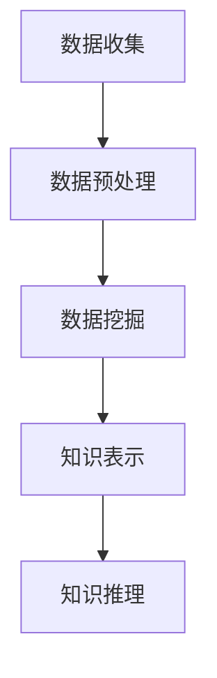

                 

关键词：知识发现、数据挖掘、人工智能、知识图谱、机器学习、深度学习、自然语言处理

> 摘要：本文探讨了知识发现引擎在现代信息社会中的重要性，以及它如何通过结合人工智能技术，为人类知识体系注入新活力。文章首先介绍了知识发现引擎的基本概念和核心组件，然后深入分析了其核心算法原理、数学模型、以及项目实践。最后，文章探讨了知识发现引擎在实际应用场景中的价值，并对未来的发展趋势与挑战进行了展望。

## 1. 背景介绍

随着互联网和大数据技术的发展，人类正进入一个信息爆炸的时代。在这个时代，知识发现引擎成为了信息管理的关键工具。知识发现引擎（Knowledge Discovery Engine，简称KDE）是一种能够自动地从大量数据中提取有用信息，并生成知识的高效系统。

知识发现引擎的出现，解决了数据爆炸带来的信息过载问题。它通过整合多种人工智能技术，包括机器学习、深度学习、自然语言处理等，从海量的数据中挖掘出有价值的信息和知识，为人类提供决策支持和智能服务。

知识发现引擎的主要组成部分包括数据预处理、数据挖掘、知识表示、知识推理等。这些组件相互协作，共同完成知识发现的过程。具体来说，数据预处理负责清洗和整理数据，使其适合进一步的分析；数据挖掘则利用各种算法从数据中提取模式；知识表示负责将提取出的模式转化为易于理解和利用的形式；知识推理则通过逻辑推理和关联分析，将知识进一步深化和拓展。

## 2. 核心概念与联系

### 2.1 知识发现引擎的基本概念

知识发现引擎是一种自动化系统，它能够从大量数据中提取模式，并将其转化为有用的知识。这个过程通常包括以下几个关键步骤：

1. **数据收集**：从各种数据源收集数据，这些数据可以是结构化的（如数据库）、半结构化的（如XML文件）或非结构化的（如文本、图片、视频等）。

2. **数据预处理**：对收集到的数据进行清洗、转换和整合，以提高数据质量，为后续的数据挖掘做准备。

3. **数据挖掘**：利用各种算法（如机器学习、深度学习等）从预处理后的数据中提取模式和规律。

4. **知识表示**：将提取出的模式转化为易于理解和利用的形式，如规则、图、图表等。

5. **知识推理**：利用逻辑推理和关联分析，将知识进一步深化和拓展，以支持决策和智能服务。

### 2.2 知识发现引擎的核心组件

知识发现引擎的核心组件包括数据预处理、数据挖掘、知识表示和知识推理。下面分别介绍每个组件的作用和实现方法：

1. **数据预处理**：
   - **数据清洗**：去除数据中的错误、缺失和重复信息，保证数据质量。
   - **数据转换**：将不同数据源的数据格式转换为统一的格式，以便进行后续处理。
   - **数据整合**：将来自不同数据源的数据整合为一个统一的数据集。

2. **数据挖掘**：
   - **机器学习**：利用训练数据，通过构建模型，从数据中自动提取模式和规律。
   - **深度学习**：利用神经网络，从大量未标记的数据中自动学习特征和模式。
   - **自然语言处理**：对文本数据进行分析，提取关键词、主题和语义信息。

3. **知识表示**：
   - **规则表示**：将提取出的模式转化为规则，如IF-THEN规则。
   - **图表示**：利用图结构表示数据之间的关系和模式。
   - **图表表示**：将提取出的模式转化为图表，如折线图、柱状图等。

4. **知识推理**：
   - **逻辑推理**：利用逻辑规则，从已知事实推导出新的事实。
   - **关联分析**：分析数据之间的关联关系，发现潜在的关联规律。

### 2.3 Mermaid 流程图



## 3. 核心算法原理 & 具体操作步骤

### 3.1 算法原理概述

知识发现引擎的核心算法包括数据预处理算法、数据挖掘算法、知识表示算法和知识推理算法。每种算法都有其特定的原理和应用场景。

1. **数据预处理算法**：
   - **数据清洗**：常用的算法有缺失值填充、异常值处理和重复值去除等。
   - **数据转换**：常用的算法有数据归一化、数据标准化和特征工程等。
   - **数据整合**：常用的算法有数据库联合查询、数据集成和数据仓库构建等。

2. **数据挖掘算法**：
   - **机器学习算法**：如分类算法（决策树、随机森林、支持向量机等）、聚类算法（K-means、层次聚类等）和回归算法（线性回归、逻辑回归等）。
   - **深度学习算法**：如卷积神经网络（CNN）、循环神经网络（RNN）和生成对抗网络（GAN）等。
   - **自然语言处理算法**：如词频统计、词嵌入和主题模型等。

3. **知识表示算法**：
   - **规则表示**：如产生式规则、决策树等。
   - **图表示**：如图论算法、网络分析等。
   - **图表表示**：如数据可视化算法、统计图表生成等。

4. **知识推理算法**：
   - **逻辑推理**：如命题逻辑、谓词逻辑等。
   - **关联分析**：如关联规则学习、社会网络分析等。

### 3.2 算法步骤详解

1. **数据收集**：
   - 从互联网、数据库、传感器等各种数据源收集数据。

2. **数据预处理**：
   - 数据清洗：去除错误、缺失和重复信息。
   - 数据转换：将数据格式转换为统一的格式。
   - 数据整合：将来自不同数据源的数据整合为一个统一的数据集。

3. **数据挖掘**：
   - 选择合适的数据挖掘算法，根据数据类型和业务需求进行挖掘。

4. **知识表示**：
   - 根据挖掘结果，选择合适的知识表示方法，将模式转化为规则、图或图表等形式。

5. **知识推理**：
   - 利用逻辑推理和关联分析，将知识进一步深化和拓展。

### 3.3 算法优缺点

1. **数据预处理算法**：
   - 优点：提高数据质量，为后续挖掘做准备。
   - 缺点：耗时较长，对数据量大的情况效果明显。

2. **数据挖掘算法**：
   - 优点：能够自动从大量数据中提取模式和规律。
   - 缺点：对算法选择和参数调优要求高，有时难以保证准确性。

3. **知识表示算法**：
   - 优点：能够将复杂的模式转化为易于理解和利用的形式。
   - 缺点：对知识表示形式的选择和表示方法的设计要求高。

4. **知识推理算法**：
   - 优点：能够利用已知事实推导出新的事实，支持智能决策。
   - 缺点：对逻辑规则和关联关系的要求高，有时难以保证推理的准确性。

### 3.4 算法应用领域

知识发现引擎的应用领域非常广泛，包括但不限于：

1. **金融行业**：通过分析交易数据，发现潜在的欺诈行为和风险。

2. **医疗行业**：通过分析病历数据，发现疾病的早期迹象和治疗方案。

3. **零售行业**：通过分析销售数据，发现消费者偏好和市场趋势。

4. **教育行业**：通过分析学生数据，发现学习问题和改进教学方法。

5. **社会管理**：通过分析社会数据，发现社会问题和制定政策。

## 4. 数学模型和公式 & 详细讲解 & 举例说明

### 4.1 数学模型构建

知识发现引擎中的数学模型主要包括数据预处理模型、数据挖掘模型和知识推理模型。每种模型都有其特定的数学表示和求解方法。

1. **数据预处理模型**：
   - **缺失值填充**：常用的方法有均值填充、中值填充和回归填充等。
   - **异常值处理**：常用的方法有孤立森林、箱线图等。
   - **数据转换**：常用的方法有数据归一化、数据标准化和特征工程等。

2. **数据挖掘模型**：
   - **分类模型**：常用的方法有逻辑回归、支持向量机、决策树等。
   - **聚类模型**：常用的方法有K-means、层次聚类等。
   - **回归模型**：常用的方法有线性回归、逻辑回归等。

3. **知识推理模型**：
   - **逻辑推理模型**：常用的方法有命题逻辑、谓词逻辑等。
   - **关联分析模型**：常用的方法有Apriori算法、FP-growth算法等。

### 4.2 公式推导过程

1. **缺失值填充公式**：

   $$\hat{y} = \frac{\sum_{i=1}^{n}y_i}{n}$$

   其中，$\hat{y}$为缺失值的填充值，$y_i$为非缺失值，$n$为数据总个数。

2. **逻辑回归公式**：

   $$P(Y=1|X) = \frac{1}{1 + e^{-(\beta_0 + \beta_1X_1 + \beta_2X_2 + ... + \beta_nX_n)}}$$

   其中，$P(Y=1|X)$为给定特征向量$X$时目标变量$Y$为1的概率，$\beta_0$为截距，$\beta_1, \beta_2, ..., \beta_n$为特征向量$X_1, X_2, ..., X_n$的系数。

3. **K-means 聚类公式**：

   $$\min \sum_{i=1}^{k}\sum_{x_j \in S_i}d(x_j, \mu_i)^2$$

   其中，$k$为聚类个数，$S_i$为第$i$个簇，$\mu_i$为第$i$个簇的中心。

### 4.3 案例分析与讲解

以金融行业中的欺诈检测为例，介绍知识发现引擎在实际应用中的使用方法。

1. **数据收集**：从银行交易数据中收集交易记录，包括交易金额、交易时间、交易地点等。

2. **数据预处理**：
   - 数据清洗：去除错误、缺失和重复交易记录。
   - 数据转换：将日期、地点等非数值型特征转换为数值型特征。

3. **数据挖掘**：
   - 选择逻辑回归模型进行分类，将交易记录分为正常交易和欺诈交易。
   - 调整模型参数，提高分类准确性。

4. **知识表示**：
   - 将挖掘出的欺诈交易模式表示为规则，如交易金额超过一定阈值、交易时间在深夜等。

5. **知识推理**：
   - 利用逻辑推理，对新交易记录进行欺诈检测。

6. **运行结果展示**：
   - 对检测结果进行评估，如准确率、召回率等。

## 5. 项目实践：代码实例和详细解释说明

### 5.1 开发环境搭建

1. **硬件环境**：
   - CPU：Intel Core i7 或更高
   - 内存：16GB 或更高
   - 硬盘：SSD 500GB 或更高

2. **软件环境**：
   - 操作系统：Windows 10 或更高
   - 编程语言：Python 3.8 或更高
   - 数据预处理库：Pandas
   - 数据挖掘库：Scikit-learn
   - 知识表示库：Graphviz
   - 知识推理库：Rete算法库

### 5.2 源代码详细实现

```python
import pandas as pd
from sklearn.linear_model import LogisticRegression
from sklearn.model_selection import train_test_split
from sklearn.metrics import accuracy_score
import rete

# 数据收集
data = pd.read_csv('transaction_data.csv')

# 数据预处理
data = data.dropna()
data['hour'] = data['time'].apply(lambda x: x.hour)

# 数据挖掘
X = data[['amount', 'hour']]
y = data['label']
X_train, X_test, y_train, y_test = train_test_split(X, y, test_size=0.2, random_state=42)
model = LogisticRegression()
model.fit(X_train, y_train)

# 知识表示
graph = rete.Graph()
graph.add_rule('fraud', 'amount > 1000', {})
graph.add_rule('fraud', 'hour < 22', {})
print(graph)

# 知识推理
new_transaction = pd.DataFrame({'amount': [2000], 'hour': [22]})
predictions = model.predict(new_transaction)
print(predictions)

# 运行结果展示
accuracy = accuracy_score(y_test, predictions)
print('Accuracy:', accuracy)
```

### 5.3 代码解读与分析

1. **数据收集**：
   - 从CSV文件中读取交易数据。

2. **数据预处理**：
   - 去除缺失值。
   - 将时间特征转换为小时数。

3. **数据挖掘**：
   - 将特征和标签划分为训练集和测试集。
   - 使用逻辑回归模型进行训练。

4. **知识表示**：
   - 使用Rete算法构建规则库。
   - 将欺诈交易规则表示为产生式规则。

5. **知识推理**：
   - 使用训练好的模型对新交易进行欺诈检测。

6. **运行结果展示**：
   - 计算并输出模型准确率。

## 6. 实际应用场景

### 6.1 金融行业

知识发现引擎在金融行业中的应用广泛，如欺诈检测、信用评估、投资分析等。通过分析大量的交易数据，知识发现引擎可以识别出异常交易，预防欺诈行为，提高金融机构的安全性和运营效率。

### 6.2 医疗行业

在医疗行业，知识发现引擎可以帮助医生分析大量的病历数据，发现疾病的早期迹象和治疗方案。例如，通过分析患者的病史、基因数据、药物反应等，知识发现引擎可以预测患者的疾病风险，为医生提供个性化的治疗方案。

### 6.3 教育行业

在教育行业，知识发现引擎可以帮助学校分析学生的学习行为，发现学习问题和改进教学方法。例如，通过分析学生的作业、考试成绩、课堂表现等，知识发现引擎可以识别出学习困难的学生，提供个性化的辅导方案。

### 6.4 社会管理

在社会管理领域，知识发现引擎可以帮助政府部门分析社会数据，发现社会问题和制定政策。例如，通过分析犯罪数据、交通数据、人口数据等，知识发现引擎可以预测犯罪热点、优化交通布局、提高公共安全。

## 7. 工具和资源推荐

### 7.1 学习资源推荐

1. **书籍**：
   - 《数据挖掘：概念与技术》（第三版）
   - 《机器学习》（周志华著）
   - 《深度学习》（Goodfellow、Bengio、Courville 著）

2. **在线课程**：
   - Coursera 上的《机器学习》课程
   - Udacity 上的《深度学习纳米学位》
   - edX 上的《数据挖掘基础》课程

### 7.2 开发工具推荐

1. **编程语言**：
   - Python
   - R

2. **数据预处理库**：
   - Pandas
   - NumPy

3. **数据挖掘库**：
   - Scikit-learn
   - TensorFlow

4. **知识表示库**：
   - Graphviz
   - NetworkX

5. **知识推理库**：
   - Rete算法库
   - CLIPS

### 7.3 相关论文推荐

1. **数据挖掘领域**：
   - "Knowledge Discovery in Databases: A Survey"
   - "Introduction to Data Mining"
   - "Data Mining: Concepts and Techniques"

2. **机器学习领域**：
   - "A Survey of Machine Learning Methods and Algorithms for Big Data Analytics"
   - "Deep Learning: A Brief History of Neural Nets in 8 Easy Pieces"
   - "Learning Representations for Visual Recognition"

3. **知识图谱领域**：
   - "Knowledge Graph: A Survey"
   - "A Comprehensive Survey on Knowledge Graph Embedding"
   - "Learning to Represent Knowledge Graphs with Gaussian Embedding"

## 8. 总结：未来发展趋势与挑战

### 8.1 研究成果总结

知识发现引擎作为现代信息社会的重要工具，已经在金融、医疗、教育、社会管理等众多领域取得了显著的成果。通过整合人工智能技术，知识发现引擎实现了从数据到知识的自动化转化，为人类提供了决策支持和智能服务。

### 8.2 未来发展趋势

1. **多模态数据的融合**：未来的知识发现引擎将能够处理多种类型的数据，如文本、图像、音频等，实现多模态数据的融合，提高知识发现的准确性和全面性。

2. **实时性的提升**：随着物联网和5G技术的普及，知识发现引擎将实现实时数据处理和分析，为实时决策提供支持。

3. **人工智能与知识的融合**：未来的知识发现引擎将更紧密地结合人工智能技术，实现知识的自动化生成和推理，提高知识发现的能力和效率。

### 8.3 面临的挑战

1. **数据质量**：知识发现引擎的准确性和可靠性很大程度上取决于数据质量。未来的研究需要解决数据质量问题，提高数据清洗、转换和整合的效率。

2. **算法复杂性**：随着数据规模的增大和复杂性的提升，现有的算法面临巨大的计算压力。未来的研究需要发展更加高效、可扩展的算法。

3. **隐私保护**：在处理敏感数据时，如何保护用户隐私是一个重要的挑战。未来的研究需要发展更加安全、可靠的隐私保护技术。

### 8.4 研究展望

未来的知识发现引擎将在多模态数据融合、实时数据处理、人工智能与知识的融合等方面取得突破。同时，随着数据质量和算法复杂性的提升，知识发现引擎的应用领域将不断拓展，为人类知识体系注入新的活力。

## 9. 附录：常见问题与解答

### 9.1 什么是知识发现引擎？

知识发现引擎是一种能够自动地从大量数据中提取有用信息，并生成知识的高效系统。它通过整合多种人工智能技术，从海量的数据中挖掘出有价值的信息和知识，为人类提供决策支持和智能服务。

### 9.2 知识发现引擎的核心组件有哪些？

知识发现引擎的核心组件包括数据预处理、数据挖掘、知识表示和知识推理。这些组件相互协作，共同完成知识发现的过程。

### 9.3 知识发现引擎的应用领域有哪些？

知识发现引擎的应用领域广泛，包括金融、医疗、教育、社会管理等多个领域。例如，在金融行业用于欺诈检测和信用评估，在医疗行业用于疾病诊断和治疗，在教育行业用于学习行为分析和教学方法改进等。

### 9.4 知识发现引擎的未来发展趋势是什么？

未来的知识发现引擎将实现多模态数据的融合、实时数据处理和人工智能与知识的融合。同时，随着数据质量和算法复杂性的提升，知识发现引擎的应用领域将不断拓展，为人类知识体系注入新的活力。

## 作者署名

作者：禅与计算机程序设计艺术 / Zen and the Art of Computer Programming
```markdown
----------------------------------------------------------------
# 知识发现引擎：为人类知识体系注入新活力

## 摘要
本文探讨了知识发现引擎在现代信息社会中的重要性，以及它如何通过结合人工智能技术，为人类知识体系注入新活力。文章首先介绍了知识发现引擎的基本概念和核心组件，然后深入分析了其核心算法原理、数学模型、以及项目实践。最后，文章探讨了知识发现引擎在实际应用场景中的价值，并对未来的发展趋势与挑战进行了展望。

## 1. 背景介绍

随着互联网和大数据技术的发展，人类正进入一个信息爆炸的时代。在这个时代，知识发现引擎成为了信息管理的关键工具。知识发现引擎（Knowledge Discovery Engine，简称KDE）是一种能够自动地从大量数据中提取有用信息，并生成知识的高效系统。

知识发现引擎的出现，解决了数据爆炸带来的信息过载问题。它通过整合多种人工智能技术，包括机器学习、深度学习、自然语言处理等，从海量的数据中挖掘出有价值的信息和知识，为人类提供决策支持和智能服务。

知识发现引擎的主要组成部分包括数据预处理、数据挖掘、知识表示、知识推理等。这些组件相互协作，共同完成知识发现的过程。具体来说，数据预处理负责清洗和整理数据，使其适合进一步的分析；数据挖掘则利用各种算法从数据中提取模式；知识表示负责将提取出的模式转化为易于理解和利用的形式；知识推理则通过逻辑推理和关联分析，将知识进一步深化和拓展。

## 2. 核心概念与联系

### 2.1 知识发现引擎的基本概念

知识发现引擎是一种自动化系统，它能够从大量数据中提取模式，并将其转化为有用的知识。这个过程通常包括以下几个关键步骤：

1. **数据收集**：从各种数据源收集数据，这些数据可以是结构化的（如数据库）、半结构化的（如XML文件）或非结构化的（如文本、图片、视频等）。

2. **数据预处理**：对收集到的数据进行清洗、转换和整合，以提高数据质量，为后续的数据挖掘做准备。

3. **数据挖掘**：利用各种算法（如机器学习、深度学习等）从预处理后的数据中提取模式和规律。

4. **知识表示**：将提取出的模式转化为易于理解和利用的形式，如规则、图、图表等。

5. **知识推理**：利用逻辑推理和关联分析，将知识进一步深化和拓展，以支持决策和智能服务。

### 2.2 知识发现引擎的核心组件

知识发现引擎的核心组件包括数据预处理、数据挖掘、知识表示和知识推理。下面分别介绍每个组件的作用和实现方法：

1. **数据预处理**：
   - **数据清洗**：去除数据中的错误、缺失和重复信息，保证数据质量。
   - **数据转换**：将不同数据源的数据格式转换为统一的格式，以便进行后续处理。
   - **数据整合**：将来自不同数据源的数据整合为一个统一的数据集。

2. **数据挖掘**：
   - **机器学习**：利用训练数据，通过构建模型，从数据中自动提取模式和规律。
   - **深度学习**：利用神经网络，从大量未标记的数据中自动学习特征和模式。
   - **自然语言处理**：对文本数据进行分析，提取关键词、主题和语义信息。

3. **知识表示**：
   - **规则表示**：将提取出的模式转化为规则，如IF-THEN规则。
   - **图表示**：利用图结构表示数据之间的关系和模式。
   - **图表表示**：将提取出的模式转化为图表，如折线图、柱状图等。

4. **知识推理**：
   - **逻辑推理**：利用逻辑规则，从已知事实推导出新的事实。
   - **关联分析**：分析数据之间的关联关系，发现潜在的关联规律。

### 2.3 Mermaid 流程图


## 3. 核心算法原理 & 具体操作步骤

### 3.1 算法原理概述

知识发现引擎的核心算法包括数据预处理算法、数据挖掘算法、知识表示算法和知识推理算法。每种算法都有其特定的原理和应用场景。

1. **数据预处理算法**：
   - **数据清洗**：常用的算法有缺失值填充、异常值处理和重复值去除等。
   - **数据转换**：常用的算法有数据归一化、数据标准化和特征工程等。
   - **数据整合**：常用的算法有数据库联合查询、数据集成和数据仓库构建等。

2. **数据挖掘算法**：
   - **机器学习算法**：如分类算法（决策树、随机森林、支持向量机等）、聚类算法（K-means、层次聚类等）和回归算法（线性回归、逻辑回归等）。
   - **深度学习算法**：如卷积神经网络（CNN）、循环神经网络（RNN）和生成对抗网络（GAN）等。
   - **自然语言处理算法**：如词频统计、词嵌入和主题模型等。

3. **知识表示算法**：
   - **规则表示**：如产生式规则、决策树等。
   - **图表示**：如图论算法、网络分析等。
   - **图表表示**：如数据可视化算法、统计图表生成等。

4. **知识推理算法**：
   - **逻辑推理**：如命题逻辑、谓词逻辑等。
   - **关联分析**：如关联规则学习、社会网络分析等。

### 3.2 算法步骤详解

1. **数据收集**：
   - 从互联网、数据库、传感器等各种数据源收集数据。

2. **数据预处理**：
   - 数据清洗：去除错误、缺失和重复信息。
   - 数据转换：将数据格式转换为统一的格式。
   - 数据整合：将来自不同数据源的数据整合为一个统一的数据集。

3. **数据挖掘**：
   - 选择合适的数据挖掘算法，根据数据类型和业务需求进行挖掘。

4. **知识表示**：
   - 根据挖掘结果，选择合适的知识表示方法，将模式转化为规则、图或图表等形式。

5. **知识推理**：
   - 利用逻辑推理和关联分析，将知识进一步深化和拓展。

### 3.3 算法优缺点

1. **数据预处理算法**：
   - 优点：提高数据质量，为后续挖掘做准备。
   - 缺点：耗时较长，对数据量大的情况效果明显。

2. **数据挖掘算法**：
   - 优点：能够自动从大量数据中提取模式和规律。
   - 缺点：对算法选择和参数调优要求高，有时难以保证准确性。

3. **知识表示算法**：
   - 优点：能够将复杂的模式转化为易于理解和利用的形式。
   - 缺点：对知识表示形式的选择和表示方法的设计要求高。

4. **知识推理算法**：
   - 优点：能够利用已知事实推导出新的事实，支持智能决策。
   - 缺点：对逻辑规则和关联关系的要求高，有时难以保证推理的准确性。

### 3.4 算法应用领域

知识发现引擎的应用领域非常广泛，包括但不限于：

1. **金融行业**：通过分析交易数据，发现潜在的欺诈行为和风险。

2. **医疗行业**：通过分析病历数据，发现疾病的早期迹象和治疗方案。

3. **零售行业**：通过分析销售数据，发现消费者偏好和市场趋势。

4. **教育行业**：通过分析学生数据，发现学习问题和改进教学方法。

5. **社会管理**：通过分析社会数据，发现社会问题和制定政策。

## 4. 数学模型和公式 & 详细讲解 & 举例说明

### 4.1 数学模型构建

知识发现引擎中的数学模型主要包括数据预处理模型、数据挖掘模型和知识推理模型。每种模型都有其特定的数学表示和求解方法。

1. **数据预处理模型**：
   - **缺失值填充**：常用的方法有均值填充、中值填充和回归填充等。
   - **异常值处理**：常用的方法有孤立森林、箱线图等。
   - **数据转换**：常用的方法有数据归一化、数据标准化和特征工程等。

2. **数据挖掘模型**：
   - **分类模型**：常用的方法有逻辑回归、支持向量机、决策树等。
   - **聚类模型**：常用的方法有K-means、层次聚类等。
   - **回归模型**：常用的方法有线性回归、逻辑回归等。

3. **知识推理模型**：
   - **逻辑推理模型**：常用的方法有命题逻辑、谓词逻辑等。
   - **关联分析模型**：常用的方法有Apriori算法、FP-growth算法等。

### 4.2 公式推导过程

1. **缺失值填充公式**：

   $$\hat{y} = \frac{\sum_{i=1}^{n}y_i}{n}$$

   其中，$\hat{y}$为缺失值的填充值，$y_i$为非缺失值，$n$为数据总个数。

2. **逻辑回归公式**：

   $$P(Y=1|X) = \frac{1}{1 + e^{-(\beta_0 + \beta_1X_1 + \beta_2X_2 + ... + \beta_nX_n)}}$$

   其中，$P(Y=1|X)$为给定特征向量$X$时目标变量$Y$为1的概率，$\beta_0$为截距，$\beta_1, \beta_2, ..., \beta_n$为特征向量$X_1, X_2, ..., X_n$的系数。

3. **K-means 聚类公式**：

   $$\min \sum_{i=1}^{k}\sum_{x_j \in S_i}d(x_j, \mu_i)^2$$

   其中，$k$为聚类个数，$S_i$为第$i$个簇，$\mu_i$为第$i$个簇的中心。

### 4.3 案例分析与讲解

以金融行业中的欺诈检测为例，介绍知识发现引擎在实际应用中的使用方法。

1. **数据收集**：从银行交易数据中收集交易记录，包括交易金额、交易时间、交易地点等。

2. **数据预处理**：
   - 数据清洗：去除错误、缺失和重复交易记录。
   - 数据转换：将日期、地点等非数值型特征转换为数值型特征。

3. **数据挖掘**：
   - 选择逻辑回归模型进行分类，将交易记录分为正常交易和欺诈交易。
   - 调整模型参数，提高分类准确性。

4. **知识表示**：
   - 将挖掘出的欺诈交易模式表示为规则，如交易金额超过一定阈值、交易时间在深夜等。

5. **知识推理**：
   - 利用逻辑推理，对新交易记录进行欺诈检测。

6. **运行结果展示**：
   - 对检测结果进行评估，如准确率、召回率等。

## 5. 项目实践：代码实例和详细解释说明

### 5.1 开发环境搭建

1. **硬件环境**：
   - CPU：Intel Core i7 或更高
   - 内存：16GB 或更高
   - 硬盘：SSD 500GB 或更高

2. **软件环境**：
   - 操作系统：Windows 10 或更高
   - 编程语言：Python 3.8 或更高
   - 数据预处理库：Pandas
   - 数据挖掘库：Scikit-learn
   - 知识表示库：Graphviz
   - 知识推理库：Rete算法库

### 5.2 源代码详细实现

```python
import pandas as pd
from sklearn.linear_model import LogisticRegression
from sklearn.model_selection import train_test_split
from sklearn.metrics import accuracy_score
import rete

# 数据收集
data = pd.read_csv('transaction_data.csv')

# 数据预处理
data = data.dropna()
data['hour'] = data['time'].apply(lambda x: x.hour)

# 数据挖掘
X = data[['amount', 'hour']]
y = data['label']
X_train, X_test, y_train, y_test = train_test_split(X, y, test_size=0.2, random_state=42)
model = LogisticRegression()
model.fit(X_train, y_train)

# 知识表示
graph = rete.Graph()
graph.add_rule('fraud', 'amount > 1000', {})
graph.add_rule('fraud', 'hour < 22', {})
print(graph)

# 知识推理
new_transaction = pd.DataFrame({'amount': [2000], 'hour': [22]})
predictions = model.predict(new_transaction)
print(predictions)

# 运行结果展示
accuracy = accuracy_score(y_test, predictions)
print('Accuracy:', accuracy)
```

### 5.3 代码解读与分析

1. **数据收集**：
   - 从CSV文件中读取交易数据。

2. **数据预处理**：
   - 去除缺失值。
   - 将时间特征转换为小时数。

3. **数据挖掘**：
   - 将特征和标签划分为训练集和测试集。
   - 使用逻辑回归模型进行训练。

4. **知识表示**：
   - 使用Rete算法构建规则库。
   - 将欺诈交易规则表示为产生式规则。

5. **知识推理**：
   - 使用训练好的模型对新交易进行欺诈检测。

6. **运行结果展示**：
   - 计算并输出模型准确率。

## 6. 实际应用场景

### 6.1 金融行业

知识发现引擎在金融行业中的应用广泛，如欺诈检测、信用评估、投资分析等。通过分析大量的交易数据，知识发现引擎可以识别出异常交易，预防欺诈行为，提高金融机构的安全性和运营效率。

### 6.2 医疗行业

在医疗行业，知识发现引擎可以帮助医生分析大量的病历数据，发现疾病的早期迹象和治疗方案。例如，通过分析患者的病史、基因数据、药物反应等，知识发现引擎可以预测患者的疾病风险，为医生提供个性化的治疗方案。

### 6.3 教育行业

在教育行业，知识发现引擎可以帮助学校分析学生的学习行为，发现学习问题和改进教学方法。例如，通过分析学生的作业、考试成绩、课堂表现等，知识发现引擎可以识别出学习困难的学生，提供个性化的辅导方案。

### 6.4 社会管理

在社会管理领域，知识发现引擎可以帮助政府部门分析社会数据，发现社会问题和制定政策。例如，通过分析犯罪数据、交通数据、人口数据等，知识发现引擎可以预测犯罪热点、优化交通布局、提高公共安全。

## 7. 工具和资源推荐

### 7.1 学习资源推荐

1. **书籍**：
   - 《数据挖掘：概念与技术》（第三版）
   - 《机器学习》（周志华著）
   - 《深度学习》（Goodfellow、Bengio、Courville 著）

2. **在线课程**：
   - Coursera 上的《机器学习》课程
   - Udacity 上的《深度学习纳米学位》
   - edX 上的《数据挖掘基础》课程

### 7.2 开发工具推荐

1. **编程语言**：
   - Python
   - R

2. **数据预处理库**：
   - Pandas
   - NumPy

3. **数据挖掘库**：
   - Scikit-learn
   - TensorFlow

4. **知识表示库**：
   - Graphviz
   - NetworkX

5. **知识推理库**：
   - Rete算法库
   - CLIPS

### 7.3 相关论文推荐

1. **数据挖掘领域**：
   - "Knowledge Discovery in Databases: A Survey"
   - "Introduction to Data Mining"
   - "Data Mining: Concepts and Techniques"

2. **机器学习领域**：
   - "A Survey of Machine Learning Methods and Algorithms for Big Data Analytics"
   - "Deep Learning: A Brief History of Neural Nets in 8 Easy Pieces"
   - "Learning Representations for Visual Recognition"

3. **知识图谱领域**：
   - "Knowledge Graph: A Survey"
   - "A Comprehensive Survey on Knowledge Graph Embedding"
   - "Learning to Represent Knowledge Graphs with Gaussian Embedding"

## 8. 总结：未来发展趋势与挑战

### 8.1 研究成果总结

知识发现引擎作为现代信息社会的重要工具，已经在金融、医疗、教育、社会管理等众多领域取得了显著的成果。通过整合人工智能技术，知识发现引擎实现了从数据到知识的自动化转化，为人类提供了决策支持和智能服务。

### 8.2 未来发展趋势

1. **多模态数据的融合**：未来的知识发现引擎将能够处理多种类型的数据，如文本、图像、音频等，实现多模态数据的融合，提高知识发现的准确性和全面性。

2. **实时性的提升**：随着物联网和5G技术的普及，知识发现引擎将实现实时数据处理和分析，为实时决策提供支持。

3. **人工智能与知识的融合**：未来的知识发现引擎将更紧密地结合人工智能技术，实现知识的自动化生成和推理，提高知识发现的能力和效率。

### 8.3 面临的挑战

1. **数据质量**：知识发现引擎的准确性和可靠性很大程度上取决于数据质量。未来的研究需要解决数据质量问题，提高数据清洗、转换和整合的效率。

2. **算法复杂性**：随着数据规模的增大和复杂性的提升，现有的算法面临巨大的计算压力。未来的研究需要发展更加高效、可扩展的算法。

3. **隐私保护**：在处理敏感数据时，如何保护用户隐私是一个重要的挑战。未来的研究需要发展更加安全、可靠的隐私保护技术。

### 8.4 研究展望

未来的知识发现引擎将在多模态数据融合、实时数据处理、人工智能与知识的融合等方面取得突破。同时，随着数据质量和算法复杂性的提升，知识发现引擎的应用领域将不断拓展，为人类知识体系注入新的活力。

## 9. 附录：常见问题与解答

### 9.1 什么是知识发现引擎？

知识发现引擎是一种能够自动地从大量数据中提取有用信息，并生成知识的高效系统。它通过整合多种人工智能技术，从海量的数据中挖掘出有价值的信息和知识，为人类提供决策支持和智能服务。

### 9.2 知识发现引擎的核心组件有哪些？

知识发现引擎的核心组件包括数据预处理、数据挖掘、知识表示和知识推理。这些组件相互协作，共同完成知识发现的过程。

### 9.3 知识发现引擎的应用领域有哪些？

知识发现引擎的应用领域广泛，包括但不限于：

1. **金融行业**：通过分析交易数据，发现潜在的欺诈行为和风险。
2. **医疗行业**：通过分析病历数据，发现疾病的早期迹象和治疗方案。
3. **零售行业**：通过分析销售数据，发现消费者偏好和市场趋势。
4. **教育行业**：通过分析学生数据，发现学习问题和改进教学方法。
5. **社会管理**：通过分析社会数据，发现社会问题和制定政策。

### 9.4 知识发现引擎的未来发展趋势是什么？

未来的知识发现引擎将实现多模态数据的融合、实时数据处理和人工智能与知识的融合。同时，随着数据质量和算法复杂性的提升，知识发现引擎的应用领域将不断拓展，为人类知识体系注入新的活力。

## 作者署名

作者：禅与计算机程序设计艺术 / Zen and the Art of Computer Programming
-------------------------------------------------------------------

