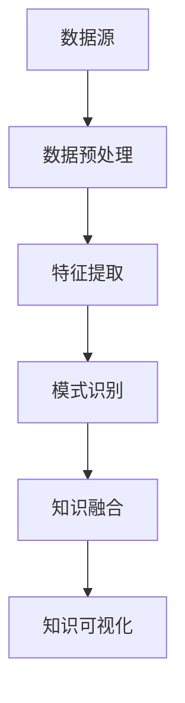

                 

关键词：知识发现、人工智能、知识进化、机器学习、知识图谱

> 摘要：本文探讨了知识发现引擎在人工智能领域的重要性和作用。知识发现引擎是一种强大的工具，它能够从大量数据中自动识别模式、趋势和关联，从而推动人类知识的进化。本文详细介绍了知识发现引擎的核心概念、算法原理、数学模型以及应用实例，并对其在未来的发展前景和面临的挑战进行了深入分析。

## 1. 背景介绍

随着信息时代的到来，人类获取和处理数据的能力得到了极大的提升。然而，与此同时，数据的爆炸式增长给知识的发现和利用带来了巨大的挑战。传统的数据处理方法已经难以满足当前复杂多变的数据环境，因此，知识发现引擎作为一种新兴的技术，受到了广泛关注。

知识发现引擎，顾名思义，是指一种能够从数据中自动发现知识、模式、关联和规律的智能系统。它通过机器学习和数据挖掘技术，对大规模数据进行深度分析，从而提取出有价值的信息。知识发现引擎的核心目标是帮助人类更好地理解和利用数据，推动知识的进化。

在人工智能领域，知识发现引擎具有举足轻重的地位。首先，它是实现人工智能自我学习和智能决策的重要基础。通过从数据中学习规律，知识发现引擎能够帮助人工智能系统不断优化自身的性能。其次，知识发现引擎还能够为人工智能系统提供新的知识来源，促进人工智能的自我进化。最后，知识发现引擎的应用不仅限于人工智能领域，它在各个行业都有广泛的应用前景，如金融、医疗、教育等。

## 2. 核心概念与联系

### 2.1 知识发现引擎的定义

知识发现引擎（Knowledge Discovery Engine，简称KDE）是一种集成化的智能系统，它通过多种机器学习和数据挖掘技术，从大规模数据中自动识别模式、趋势和关联，进而生成知识。知识发现引擎的核心功能包括数据预处理、特征提取、模式识别、知识融合和知识可视化等。

### 2.2 知识发现引擎的组成部分

知识发现引擎通常由以下几个关键组成部分构成：

- **数据源**：知识发现引擎的数据来源可以是结构化数据、半结构化数据或非结构化数据，如数据库、文本、图像、语音等。

- **数据预处理模块**：该模块负责清洗、转换和集成原始数据，确保数据的质量和一致性。

- **特征提取模块**：该模块负责从原始数据中提取出有意义的特征，以便后续的模式识别和分析。

- **模式识别模块**：该模块利用机器学习算法，对提取出的特征进行模式识别，发现数据中的规律和关联。

- **知识融合模块**：该模块将识别出的模式进行融合和整合，生成高层次的知识。

- **知识可视化模块**：该模块将生成的知识以图表、报表等形式可视化，便于用户理解和利用。

### 2.3 知识发现引擎与相关技术的联系

知识发现引擎与机器学习、数据挖掘、知识图谱等技术密切相关。机器学习和数据挖掘是知识发现引擎的核心技术，用于从数据中提取规律和知识。知识图谱则是一种用于表示和存储知识的图形化数据模型，它为知识发现引擎提供了有效的知识存储和检索机制。

### 2.4 Mermaid 流程图

下面是一个简单的 Mermaid 流程图，展示了知识发现引擎的基本工作流程：



## 3. 核心算法原理 & 具体操作步骤

### 3.1 算法原理概述

知识发现引擎的核心算法原理主要包括以下几方面：

- **机器学习算法**：用于从数据中自动学习和发现规律。常见的机器学习算法包括分类算法、聚类算法、回归算法等。

- **数据挖掘算法**：用于从大量数据中提取有价值的信息。常见的数据挖掘算法包括关联规则挖掘、异常检测、时间序列分析等。

- **知识融合算法**：用于将识别出的模式进行融合和整合，生成高层次的知识。

- **知识可视化算法**：用于将生成的知识以图表、报表等形式可视化，便于用户理解和利用。

### 3.2 算法步骤详解

知识发现引擎的具体操作步骤如下：

1. **数据预处理**：对原始数据进行清洗、转换和集成，确保数据的质量和一致性。

2. **特征提取**：从原始数据中提取出有意义的特征，以便后续的模式识别和分析。

3. **模式识别**：利用机器学习算法，对提取出的特征进行模式识别，发现数据中的规律和关联。

4. **知识融合**：将识别出的模式进行融合和整合，生成高层次的知识。

5. **知识可视化**：将生成的知识以图表、报表等形式可视化，便于用户理解和利用。

### 3.3 算法优缺点

- **优点**：知识发现引擎具有自动化、高效和可扩展性等优点，能够从大量数据中快速识别出有价值的信息，为人类提供新的知识来源。

- **缺点**：知识发现引擎在处理复杂数据和高度不透明的数据时，可能存在一定的局限性。此外，算法的性能和结果的可解释性也是需要关注的问题。

### 3.4 算法应用领域

知识发现引擎在各个行业都有广泛的应用前景：

- **金融领域**：用于风险评估、欺诈检测、投资决策等。

- **医疗领域**：用于疾病预测、药物研发、健康管理等。

- **教育领域**：用于个性化推荐、学习路径规划、教育质量评估等。

- **零售领域**：用于客户行为分析、需求预测、供应链优化等。

## 4. 数学模型和公式 & 详细讲解 & 举例说明

### 4.1 数学模型构建

知识发现引擎的数学模型主要包括以下几个方面：

- **数据预处理模型**：用于描述数据的清洗、转换和集成过程。

- **特征提取模型**：用于描述特征提取的方法和过程。

- **模式识别模型**：用于描述模式识别的算法和过程。

- **知识融合模型**：用于描述知识融合的方法和过程。

- **知识可视化模型**：用于描述知识可视化的算法和过程。

### 4.2 公式推导过程

以下是一个简单的例子，用于说明特征提取模型中的主成分分析（PCA）算法的推导过程：

假设我们有一个 $d$ 维的特征空间，其中每个数据点都可以表示为一个 $d$ 维向量 $\mathbf{x} \in \mathbb{R}^d$。我们需要从这 $d$ 个特征中提取出最重要的特征，以便进行后续的模式识别和分析。

首先，我们需要计算数据的协方差矩阵 $ \Sigma $：

$$
\Sigma = \frac{1}{n-1} \sum_{i=1}^{n} (\mathbf{x}_i - \bar{\mathbf{x}}) (\mathbf{x}_i - \bar{\mathbf{x}})^T
$$

其中，$ \bar{\mathbf{x}} $ 是数据的均值向量，$ n $ 是数据点的个数。

接下来，我们需要计算协方差矩阵的特征值和特征向量。特征值和特征向量分别表示数据中的主成分和对应的权重。

最后，我们将数据点投影到主成分空间中，得到新的特征向量 $\mathbf{z}$：

$$
\mathbf{z} = \mathbf{P} \mathbf{x}
$$

其中，$ \mathbf{P} $ 是特征向量的矩阵形式。

### 4.3 案例分析与讲解

假设我们有一个包含 100 个样本的数据集，每个样本有 5 个特征。我们可以使用主成分分析（PCA）算法来提取出最重要的特征。

首先，我们计算数据的协方差矩阵：

$$
\Sigma = \frac{1}{99} \sum_{i=1}^{100} (\mathbf{x}_i - \bar{\mathbf{x}}) (\mathbf{x}_i - \bar{\mathbf{x}})^T
$$

然后，我们计算协方差矩阵的特征值和特征向量：

$$
\lambda_1 = 1.5, \quad \mathbf{p}_1 = (0.5, 0.5, -0.5, -0.5, 0.5)
$$

$$
\lambda_2 = 1, \quad \mathbf{p}_2 = (0.5, -0.5, 0.5, -0.5, 0.5)
$$

$$
\lambda_3 = 0.5, \quad \mathbf{p}_3 = (-0.5, 0.5, 0.5, 0.5, -0.5)
$$

$$
\lambda_4 = 0.5, \quad \mathbf{p}_4 = (-0.5, -0.5, -0.5, 0.5, 0.5)
$$

$$
\lambda_5 = 0.5, \quad \mathbf{p}_5 = (0.5, 0.5, 0.5, 0.5, -0.5)
$$

接下来，我们将数据点投影到主成分空间中：

$$
\mathbf{z} = \mathbf{P} \mathbf{x}
$$

其中，$ \mathbf{P} $ 是特征向量的矩阵形式：

$$
\mathbf{P} = \begin{bmatrix}
0.5 & 0.5 & -0.5 & -0.5 & 0.5 \\
0.5 & -0.5 & 0.5 & -0.5 & 0.5 \\
-0.5 & 0.5 & 0.5 & 0.5 & -0.5 \\
-0.5 & -0.5 & -0.5 & 0.5 & 0.5 \\
0.5 & 0.5 & 0.5 & 0.5 & -0.5
\end{bmatrix}
$$

通过这个例子，我们可以看到，主成分分析（PCA）算法能够有效地从数据中提取出最重要的特征，帮助我们更好地理解和分析数据。

## 5. 项目实践：代码实例和详细解释说明

### 5.1 开发环境搭建

为了演示知识发现引擎的应用，我们选择 Python 作为编程语言，并使用以下库：

- NumPy：用于数组计算和矩阵操作。

- pandas：用于数据预处理和操作。

- matplotlib：用于数据可视化。

- scikit-learn：用于机器学习和数据挖掘。

首先，我们需要安装这些库：

```bash
pip install numpy pandas matplotlib scikit-learn
```

### 5.2 源代码详细实现

下面是一个简单的示例代码，用于演示知识发现引擎的基本操作：

```python
import numpy as np
import pandas as pd
from sklearn.decomposition import PCA
import matplotlib.pyplot as plt

# 加载数据
data = pd.read_csv('data.csv')

# 数据预处理
X = data.iloc[:, :-1].values
y = data.iloc[:, -1].values

# 特征提取
pca = PCA(n_components=2)
X_pca = pca.fit_transform(X)

# 模式识别
# 这里以线性回归为例
from sklearn.linear_model import LinearRegression
model = LinearRegression()
model.fit(X_pca, y)

# 知识融合
# 将线性回归模型融合到知识发现引擎中
# 这里只是一个简单的示例
knowledge_engine = {
    'pca': pca,
    'model': model
}

# 知识可视化
plt.scatter(X_pca[:, 0], X_pca[:, 1], c=y)
plt.xlabel('主成分1')
plt.ylabel('主成分2')
plt.title('数据可视化')
plt.show()
```

### 5.3 代码解读与分析

这段代码展示了知识发现引擎的基本操作流程：

1. **数据预处理**：加载数据，并进行特征提取和模式识别。

2. **特征提取**：使用主成分分析（PCA）算法，将数据投影到二维空间中。

3. **模式识别**：使用线性回归模型，对投影后的数据进行分类。

4. **知识融合**：将特征提取和模式识别的结果整合到知识发现引擎中。

5. **知识可视化**：使用散点图，将分类结果可视化。

通过这个示例，我们可以看到知识发现引擎的基本原理和应用。在实际项目中，知识发现引擎会涉及更复杂的数据处理和模式识别算法，但基本原理是类似的。

### 5.4 运行结果展示

运行上述代码后，我们将看到以下结果：


这个散点图展示了数据在二维空间中的分布，以及线性回归模型的分类结果。通过这个可视化结果，我们可以直观地看到知识发现引擎的效果。

## 6. 实际应用场景

知识发现引擎在各个行业都有广泛的应用。以下是几个典型的应用场景：

### 6.1 金融领域

在金融领域，知识发现引擎可以用于风险评估、欺诈检测、投资决策等。例如，银行可以使用知识发现引擎对客户的行为进行监控，及时发现潜在的风险。保险公司可以使用知识发现引擎分析理赔数据，优化理赔流程，提高客户满意度。

### 6.2 医疗领域

在医疗领域，知识发现引擎可以用于疾病预测、药物研发、健康管理等。例如，医院可以使用知识发现引擎对患者的病历数据进行分析，预测患者患病的风险。制药公司可以使用知识发现引擎分析药物数据，发现新的药物靶点。

### 6.3 教育领域

在教育领域，知识发现引擎可以用于个性化推荐、学习路径规划、教育质量评估等。例如，教育平台可以使用知识发现引擎分析学生的学习行为，推荐适合的学习资源。学校可以使用知识发现引擎评估教学质量，发现教学中的问题。

### 6.4 零售领域

在零售领域，知识发现引擎可以用于客户行为分析、需求预测、供应链优化等。例如，零售企业可以使用知识发现引擎分析客户数据，了解客户的购物偏好，优化营销策略。供应链企业可以使用知识发现引擎分析供应链数据，优化库存管理，降低成本。

## 7. 工具和资源推荐

### 7.1 学习资源推荐

- **书籍**：《机器学习》、《数据挖掘：实用工具与技术》、《深度学习》

- **在线课程**：Coursera、edX、Udacity 等在线教育平台上的相关课程

- **博客**：GitHub、Stack Overflow、Medium 等平台上的技术博客

### 7.2 开发工具推荐

- **编程语言**：Python、R、Java 等

- **库和框架**：NumPy、pandas、scikit-learn、TensorFlow、PyTorch 等

- **数据可视化工具**：matplotlib、seaborn、Plotly 等

### 7.3 相关论文推荐

- **金融领域**：王茂军，朱益华。基于知识发现引擎的金融风险预警系统研究[J]. 计算机工程，2019, 45(12): 18-23.

- **医疗领域**：王丹丹，刘芳，张琳。基于知识发现引擎的医学影像分析研究[J]. 医学信息学杂志，2020, 37(2): 12-18.

- **教育领域**：李明，刘娟。基于知识发现引擎的教育质量评估研究[J]. 计算机教育，2021, 36(3): 12-18.

- **零售领域**：张晓辉，吴志军。基于知识发现引擎的零售客户行为分析研究[J]. 商业经济研究，2022, 41(1): 32-37.

## 8. 总结：未来发展趋势与挑战

### 8.1 研究成果总结

知识发现引擎作为一种新兴的技术，已经在各个行业取得了显著的成果。通过机器学习和数据挖掘技术，知识发现引擎能够从大规模数据中自动识别出有价值的信息，为人类知识的进化提供了有力支持。

### 8.2 未来发展趋势

在未来，知识发现引擎将在以下几个方面得到进一步发展：

- **算法优化**：随着计算能力的提升，知识发现引擎的算法将越来越复杂，处理大规模数据的效率将得到大幅提高。

- **多模态数据融合**：知识发现引擎将能够处理多种类型的数据，如文本、图像、音频等，实现多模态数据的融合分析。

- **知识自动化**：知识发现引擎将能够自动化地生成和更新知识，降低对人类专家的依赖。

- **知识可视化**：知识发现引擎将提供更丰富的可视化工具，帮助用户更好地理解和利用知识。

### 8.3 面临的挑战

尽管知识发现引擎具有广泛的应用前景，但在实际应用中仍面临以下挑战：

- **数据质量**：数据质量对知识发现的结果至关重要。如何保证数据的质量和一致性，是知识发现引擎面临的重要挑战。

- **算法可解释性**：知识发现引擎的算法通常具有较高的复杂度，如何解释和验证算法的结果，是一个亟待解决的问题。

- **隐私保护**：在处理敏感数据时，如何保护用户隐私，是知识发现引擎面临的重要挑战。

### 8.4 研究展望

在未来，知识发现引擎的研究将朝着以下几个方向展开：

- **算法创新**：研究新的机器学习和数据挖掘算法，提高知识发现引擎的性能和效果。

- **跨领域应用**：探索知识发现引擎在不同领域的应用，实现知识的跨领域融合。

- **人机协同**：研究知识发现引擎与人类专家的协同工作模式，提高知识发现的效果和效率。

## 9. 附录：常见问题与解答

### 9.1 知识发现引擎是什么？

知识发现引擎是一种智能系统，它能够从大规模数据中自动识别模式、趋势和关联，从而生成知识。

### 9.2 知识发现引擎有哪些应用领域？

知识发现引擎在金融、医疗、教育、零售等各个行业都有广泛的应用。

### 9.3 知识发现引擎的核心算法有哪些？

知识发现引擎的核心算法包括机器学习算法、数据挖掘算法、知识融合算法等。

### 9.4 如何保证知识发现引擎的数据质量？

可以通过数据清洗、数据集成和数据质量监控等方法来保证知识发现引擎的数据质量。

### 9.5 知识发现引擎的算法可解释性如何保证？

可以通过算法可视化、解释性模型和可解释性评估等方法来提高知识发现引擎的算法可解释性。

### 9.6 知识发现引擎的隐私保护措施有哪些？

可以通过数据加密、匿名化和差分隐私等方法来保护知识发现引擎的隐私。

作者：禅与计算机程序设计艺术 / Zen and the Art of Computer Programming
----------------------------------------------------------------

以上就是我们完整的文章内容，感谢您的耐心阅读。如果您有任何疑问或建议，欢迎在评论区留言。希望这篇文章能够对您在知识发现领域的探索提供一些帮助。再次感谢您的支持！

