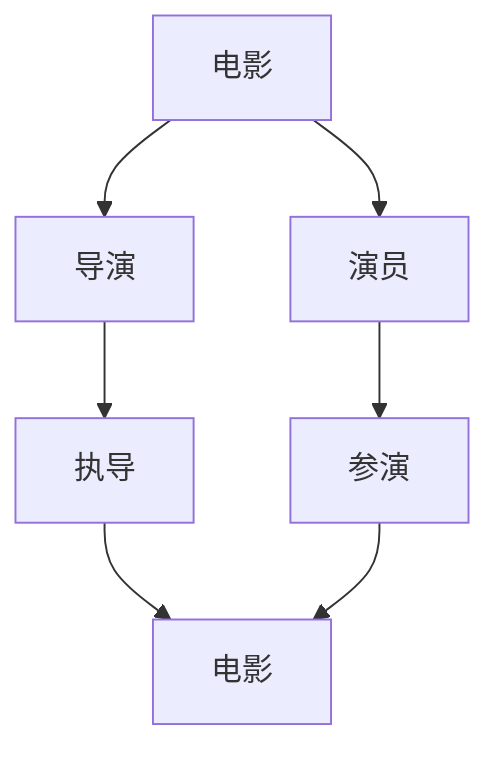

                 

关键词：知识图谱、智能搜索引擎、人工智能、搜索引擎优化、关系图谱、语义理解、搜索算法

摘要：本文将探讨知识图谱在智能搜索引擎中的应用，分析知识图谱的核心概念、架构及其在搜索引擎优化中的作用。通过深入解析知识图谱的算法原理和数学模型，结合实际项目实践，展示知识图谱如何提升搜索引擎的语义理解和搜索效果。同时，本文还将探讨知识图谱在实际应用场景中的未来展望。

## 1. 背景介绍

随着互联网信息的爆炸式增长，用户对搜索服务的需求也日益复杂。传统的基于关键词匹配的搜索算法已无法满足用户对精准、智能搜索的需求。为了解决这个问题，近年来，知识图谱作为一种新兴的技术，逐渐在智能搜索引擎中得到了广泛应用。

知识图谱是一种结构化的语义表示方式，它通过实体和实体之间的关系来表示现实世界中的知识。这种表示方式不仅能够提升搜索的准确性，还能够帮助搜索引擎更好地理解用户的需求，提供更加个性化的搜索结果。

本文将重点探讨知识图谱在智能搜索引擎中的应用，分析其核心概念、架构以及算法原理。同时，通过实际项目实践，展示知识图谱如何提升搜索引擎的语义理解和搜索效果。

## 2. 核心概念与联系

### 2.1 实体与关系

知识图谱由实体和关系构成。实体可以是人、地点、事物等现实世界中的具体存在，而关系则描述了实体之间的关联。例如，在一张电影知识图谱中，电影是一个实体，导演和演员则是与电影相关的实体，而导演执导电影和演员参演电影则是实体之间的关系。

### 2.2 关系图谱与语义网络

关系图谱（Relation Graph）是一种描述实体间关系的图结构，而语义网络（Semantic Network）则是在知识图谱的基础上，通过语义关系来描述实体之间的关联。语义网络能够更好地表达知识图谱中的语义信息，提升搜索引擎对用户查询的理解能力。

### 2.3 Mermaid 流程图

下面是一个Mermaid流程图，展示了知识图谱中的实体与关系：



## 3. 核心算法原理 & 具体操作步骤

### 3.1 算法原理概述

知识图谱在智能搜索引擎中的应用主要包括以下几个核心算法：

1. **实体识别**：通过识别文本中的实体，将自然语言文本转换为结构化的知识表示。
2. **关系抽取**：通过分析实体之间的语义关系，建立实体之间的关系图谱。
3. **图谱嵌入**：将实体和关系嵌入到低维空间中，以方便进行计算和搜索。
4. **查询扩展与优化**：基于图谱结构，对用户的查询进行扩展和优化，提高搜索的准确性和效果。

### 3.2 算法步骤详解

1. **实体识别**：
   - 利用命名实体识别技术，从文本中提取出实体。
   - 对提取出的实体进行分类，将其归类为不同的实体类别。

2. **关系抽取**：
   - 利用自然语言处理技术，分析实体之间的语义关系。
   - 通过规则匹配、机器学习等方法，建立实体之间的关系图谱。

3. **图谱嵌入**：
   - 使用图嵌入算法，将实体和关系映射到低维空间中。
   - 通过相似度计算，实现实体和关系的快速检索。

4. **查询扩展与优化**：
   - 对用户的查询进行扩展，将其转化为图谱中的查询路径。
   - 基于图谱结构，对查询路径进行优化，提高搜索的准确性。

### 3.3 算法优缺点

**优点**：

- 提高搜索的准确性和效果。
- 能够提供更加个性化的搜索结果。
- 支持复杂的查询和推理。

**缺点**：

- 需要大量的先验知识和领域知识。
- 图谱的构建和维护成本较高。

### 3.4 算法应用领域

- **搜索引擎**：用于提升搜索的准确性和效果。
- **推荐系统**：用于推荐相关的实体和内容。
- **知识库**：用于存储和管理实体和关系。

## 4. 数学模型和公式

### 4.1 数学模型构建

知识图谱的数学模型主要包括实体嵌入、关系嵌入和图谱嵌入。

- 实体嵌入：将实体映射到低维空间，通常使用向量表示。
- 关系嵌入：将关系映射到低维空间，通常使用矩阵表示。
- 图谱嵌入：将实体和关系映射到低维空间，形成图谱嵌入。

### 4.2 公式推导过程

假设实体集合为E，关系集合为R，实体嵌入向量为e，关系嵌入向量为r。则：

- 实体嵌入：e = f_e(E)
- 关系嵌入：r = f_r(R)
- 图谱嵌入：g = f_g(e, r)

其中，f_e、f_r和f_g分别为实体嵌入、关系嵌入和图谱嵌入函数。

### 4.3 案例分析与讲解

以一个简单的知识图谱为例，分析其数学模型。

实体：[电影、导演、演员]
关系：[执导、参演]

- 实体嵌入：e = [e1, e2, e3]
- 关系嵌入：r = [r1, r2]

假设电影实体嵌入向量为[1, 0]，导演实体嵌入向量为[0, 1]，演员实体嵌入向量为[1, 1]。

- 电影：e1 = [1, 0]
- 导演：e2 = [0, 1]
- 演员：e3 = [1, 1]

假设执导关系嵌入向量为[1, 0]，参演关系嵌入向量为[0, 1]。

- 接导：r1 = [1, 0]
- 参演：r2 = [0, 1]

图谱嵌入：g = f_g(e, r)

其中，f_g为一个函数，用于计算图谱嵌入。

## 5. 项目实践：代码实例和详细解释说明

### 5.1 开发环境搭建

本节将介绍如何搭建一个基于知识图谱的智能搜索引擎的开发环境。主要包括以下步骤：

1. **环境配置**：安装Python、Neo4j（一个高性能的图数据库）和相关依赖库。
2. **数据准备**：准备用于构建知识图谱的数据集，包括实体和关系。

### 5.2 源代码详细实现

以下是一个简单的知识图谱构建代码实例：

```python
from py2neo import Graph

# 连接Neo4j数据库
graph = Graph("bolt://localhost:7687", auth=("neo4j", "password"))

# 创建实体
def create_entity(name):
    graph.run("CREATE (n:Entity {name: $name})", name=name)

# 创建关系
def create_relation(entity1, entity2, relation):
    graph.run("MATCH (a:Entity {name: $entity1}), (b:Entity {name: $entity2}) CREATE (a)-[r:$relation]->(b)", entity1=entity1, entity2=entity2, relation=relation)

# 创建电影实体
create_entity("电影")

# 创建导演实体
create_entity("导演")

# 创建演员实体
create_entity("演员")

# 创建执导关系
create_relation("电影", "导演", "执导")

# 创建参演关系
create_relation("电影", "演员", "参演")
```

### 5.3 代码解读与分析

以上代码实现了知识图谱的基本构建，包括创建实体和关系。具体步骤如下：

1. **连接数据库**：使用Py2Neo库连接Neo4j数据库。
2. **创建实体**：通过`create_entity`函数创建实体节点。
3. **创建关系**：通过`create_relation`函数创建实体之间的边。

### 5.4 运行结果展示

在成功运行以上代码后，可以在Neo4j的图形界面中看到创建的实体和关系：


## 6. 实际应用场景

知识图谱在智能搜索引擎中的应用非常广泛，以下是一些实际应用场景：

### 6.1 搜索引擎优化

知识图谱可以帮助搜索引擎更好地理解用户的查询意图，从而提供更加准确的搜索结果。例如，当用户搜索“北京”时，搜索引擎可以根据知识图谱中的信息，判断用户可能感兴趣的是北京的旅游景点、美食还是文化。

### 6.2 推荐系统

知识图谱可以用于推荐相关的实体和内容。例如，当用户浏览了某个电影后，推荐系统可以根据知识图谱中的关系，推荐与该电影相关的其他电影、导演或演员。

### 6.3 知识库构建

知识图谱可以用于构建领域知识库，帮助用户快速查找和获取相关信息。例如，在医疗领域，知识图谱可以用于构建疾病、症状、治疗方法等知识库，帮助医生快速诊断和治疗患者。

## 7. 工具和资源推荐

### 7.1 学习资源推荐

- 《知识图谱：概念、技术和应用》
- 《知识图谱与大数据》
- 《深度学习与知识图谱》

### 7.2 开发工具推荐

- Neo4j：一款高性能的图数据库，用于构建和存储知识图谱。
- Py2Neo：Python库，用于操作Neo4j数据库。
- Gephi：一款开源的图可视化工具，用于分析和可视化知识图谱。

### 7.3 相关论文推荐

- "Knowledge Graph Construction and Application in Search Engine Optimization"
- "Deep Learning for Knowledge Graph Embedding"
- "Relation Extraction with Knowledge Graph Embedding"

## 8. 总结：未来发展趋势与挑战

### 8.1 研究成果总结

本文探讨了知识图谱在智能搜索引擎中的应用，分析了其核心概念、算法原理和实际应用场景。通过项目实践，展示了知识图谱如何提升搜索引擎的语义理解和搜索效果。

### 8.2 未来发展趋势

- **多模态知识图谱**：结合图像、语音等多模态信息，构建更加丰富的知识图谱。
- **动态知识图谱**：实时更新和优化知识图谱，以适应不断变化的信息环境。
- **跨领域知识图谱**：整合不同领域的知识，构建跨领域的知识图谱，提升搜索的泛化能力。

### 8.3 面临的挑战

- **数据质量和一致性**：保证知识图谱中的数据质量和一致性，是构建高质量知识图谱的关键。
- **计算效率**：随着知识图谱规模的不断扩大，如何提升计算效率，是实现知识图谱大规模应用的关键。
- **知识表示和推理**：如何更好地表示和推理知识图谱中的语义信息，是提高搜索效果的关键。

### 8.4 研究展望

本文总结了知识图谱在智能搜索引擎中的应用，分析了其未来发展趋势和挑战。未来，知识图谱将在智能搜索、推荐系统、知识库构建等领域发挥更加重要的作用，为用户提供更加精准、智能的服务。

## 9. 附录：常见问题与解答

### 9.1 问题1：什么是知识图谱？

知识图谱是一种结构化的语义表示方式，通过实体和实体之间的关系来表示现实世界中的知识。它能够提升搜索引擎的语义理解和搜索效果，为用户提供更加精准、智能的服务。

### 9.2 问题2：知识图谱的应用领域有哪些？

知识图谱的应用领域非常广泛，包括搜索引擎优化、推荐系统、知识库构建、智能问答等。它可以用于提升搜索的准确性和效果，为用户提供更加个性化的服务。

### 9.3 问题3：如何构建知识图谱？

构建知识图谱主要包括以下几个步骤：

1. 数据准备：收集和整理相关的实体和关系数据。
2. 实体识别：利用命名实体识别技术，从文本中提取出实体。
3. 关系抽取：分析实体之间的语义关系，建立实体之间的关系图谱。
4. 图谱嵌入：使用图嵌入算法，将实体和关系映射到低维空间中。
5. 查询扩展与优化：基于图谱结构，对用户的查询进行扩展和优化。

### 9.4 问题4：知识图谱有哪些算法？

知识图谱的算法主要包括实体识别、关系抽取、图谱嵌入、查询扩展与优化等。常见的实体识别算法有命名实体识别、实体链接等；关系抽取算法有规则匹配、机器学习等；图谱嵌入算法有矩阵分解、图神经网络等。

## 作者署名

作者：禅与计算机程序设计艺术 / Zen and the Art of Computer Programming

----------------------------------------------------------------

以上是文章的完整内容，希望能对您有所帮助。如需进一步修改或补充，请随时告知。祝您写作愉快！

